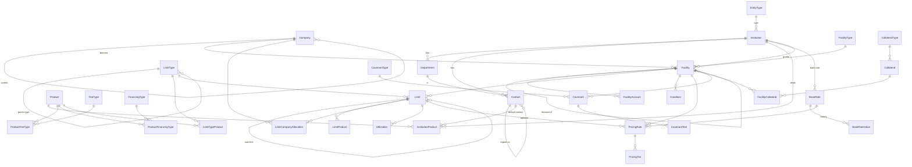

# وثيقة تصميم قاعدة البيانات — نظام إدارة التسهيلات البنكية (BFMS)

| البند | القيمة |
|---|---|
| الإصدار | 0.1 |
| المنصة | Microsoft SQL Server 2019/2022 على Windows |
| اسم القاعدة / الترتيب | `BankFacilities` / `Arabic_100_CI_AS` |
| السكربتات | `db/001_schema.sql` (الجداول) ← `db/002_views_functions.sql` (العروض والدوال) ← `db/003_seed_reference.sql` (بيانات أولية) |

> **ملاحظة صدق:** السكربتات مُدقَّقة نحويًا (T-SQL parse) لكنها **لم تُنفَّذ على خادم SQL Server فعلي** في بيئة التطوير الحالية. يلزم تشغيلها على قاعدة فارغة في بيئة الاختبار وإصلاح أي ملاحظات قبل الاعتماد.

---

## 1. اصطلاحات التسمية والتصميم

| البند | الاصطلاح |
|---|---|
| المخططات | `ref` مراجع عامة، `org` شركات، `fin` جهات ممولة، `cat` كتالوجات، `fac` تسهيلات وحدود، `pr` تسعير، `cov` تعهدات، `col` ضمانات، `doc` مرفقات، `sec` أمن، `aud` تدقيق |
| الجداول | PascalCase مفرد: `Facility`, `Limit` |
| المفاتيح الأساسية | `<Table>Id` من نوع `INT IDENTITY` (`BIGINT` للجداول الكبيرة) ؛ المراجع الصغيرة (`Currency`) مفتاحها رمز طبيعي |
| الأسماء الثنائية | `NameAr` + `NameEn` في كل كتالوج |
| المبالغ / النسب | `DECIMAL(19,4)` / `DECIMAL(9,6)` (النسبة بالنقاط المئوية: 1.000000 = 1%) |
| التاريخ | `DATE` للتواريخ، `DATETIME2(0)` بتوقيت UTC للطوابع الزمنية |
| أعمدة التدقيق | `CreatedAt/By`, `UpdatedAt/By` في الجداول التشغيلية (يضبطها التطبيق عند التحديث) |
| التعطيل بدل الحذف | `IsActive` في الكتالوجات، `Status` في العمليات؛ لا `DELETE` على بيانات ائتمانية |
| التعدادات الثابتة | قيود `CHECK` (حالات، طرق احتساب) ؛ القيم القابلة للتوسعة في `ref.Lookup` |
| المفاتيح المركبة للتماسك | `Limit (LimitId, FacilityId)` فريد، وكل جدول يربط حدًا يستخدم FK مركبًا → **يستحيل ربط حد بتسهيل آخر** |
| السجل التاريخي | جداول زمنية Temporal: `Facility`, `Limit`, `PricingRule` (جداول `*History`) |

---

## 2. مخطط العلاقات (ERD)



---

## 3. قاموس البيانات المختصر

### 3.1 `ref` — المراجع
| الجدول | الوصف | أهم الأعمدة |
|---|---|---|
| `Currency` | العملات | `CurrencyCode` (PK)، `DecimalPlaces` |
| `EntityType` | نوع المنشأة: BANK، FINANCE_CO، PRIVATE_CO، INDIVIDUAL | `IsFinancier` |
| `Lookup` | قوائم قيم موسعة: `CONTACT_ROLE`، `DEPARTMENT_TYPE`، `CONDITION_TYPE` | `LookupGroup+Code` فريد |
| `BaseRate` | أسعار الأساس: `MARKET` (SIBOR…) أو `BANK_INTERNAL` (TARIFF) | `InstitutionId` إلزامي لسعر البنك |
| `BaseRateValue` | قيم السعر عبر الزمن لكل مدة (ON,1M,3M…) | `Tenor`, `EffectiveDate`, `RatePct` |

### 3.2 `org` / `fin` — الشركات والجهات الممولة
| الجدول | الوصف | ملاحظات |
|---|---|---|
| `org.Company` | شركات المجموعة | `ParentCompanyId` ذاتي، `IsHolding`، سجل تجاري فريد |
| `fin.Institution` | الجهة الممولة بأي نوع | `EntityTypeId`، SWIFT |
| `fin.Department` | أقسام الجهة التي يُتواصل معها | `DepartmentTypeId` من Lookup |
| `fin.Contact` | جهات الاتصال | `ContactRoleId` (RM/TEAM_LEAD/REGIONAL_MGR/DEPT_HEAD)، `ReportsToContactId` للتسلسل (نفس الجهة) |
| `fin.InstitutionProduct` | المنتجات التي تتعامل بها الجهة + جهة الاتصال الافتراضية | PK مركب؛ يغذّي معالج الإعداد |

### 3.3 `cat` — الكتالوجات
| الجدول | الوصف |
|---|---|
| `FacilityType` | أنواع التسهيلات |
| `LimitType` | أنواع الحدود؛ `IsSubLimit` + `ParentLimitTypeId` للجزئي |
| `Product` | المنتجات (`ProductGroup`: TRADE، FINANCING، GUARANTEE…) |
| `FeeType` | أنواع المصاريف (`FeeCategory`) |
| `FinancingType` | أنواع التمويل (`IsIslamic`) |
| `ProductFeeType` | المصاريف المرتبطة بالمنتج (`IsMandatory`) |
| `ProductFinancingType` | أنواع التمويل المرتبطة بالمنتج |
| `LimitTypeProduct` | المنتجات المسموحة لنوع الحد |
| `CollateralType` | أنواع الضمانات + `AttributesTemplate` (JSON) |
| `CovenantType` | أنواع التعهدات (`MetricUnit`, `DefaultOperator`) |

### 3.4 `fac` — التسهيلات
| الجدول | الوصف | قيود مهمة |
|---|---|---|
| `Facility` | رأس التسهيل (Temporal) | `InternalNo` فريد؛ `(InstitutionId, BankReferenceNo)` فريد مصفّى؛ `EndDate > StartDate`؛ الحالات: DRAFT، PENDING_APPROVAL، ACTIVE، SUSPENDED، EXPIRED، CANCELLED، RENEWED |
| `FacilityAccount` | الحسابات المرتبطة | `(FacilityId, AccountNo)` فريد |
| `Limit` | حد رئيسي/جزئي (Temporal) | `ParentLimitId` + `FacilityId` → FK مركب لنفس التسهيل؛ `LimitNo` فريد داخل التسهيل؛ `PricingMode` INHERIT/OWN |
| `LimitProduct` | المنتجات المسموحة بالحد وسقفها | `MaxAmount` اختياري |
| `LimitCompanyAllocation` | توزيع الحد على الشركات | `AllocatedAmount NULL` = مشترك بلا سقف خاص؛ فترة سريان |
| `Utilization` | قراءات المستخدم من الحد | `Source` MANUAL/IMPORT |
| `Condition` | الشروط البنكية | `Nature` سابق/مستمر/لاحق |

### 3.5 `pr` — التسعير
| الجدول | الوصف |
|---|---|
| `PricingRule` (Temporal) | قاعدة تسعير. `FacilityId` إلزامي، و`LimitId/ProductId/CompanyId` اختيارية لتضييق النطاق. `ComponentKind` = FEE (يتطلب `FeeTypeId`) أو FINANCING (يتطلب `FinancingTypeId`). `CalcMethod` يحدد الحقول المطلوبة (قيد `CK_PR_Method`) |
| `PricingTier` | شرائح (من مبلغ، إلى مبلغ، نسبة/هامش) لطريقة TIERED |

**أمثلة إدخال:**

| المطلوب | ComponentKind | CalcMethod | BaseRate | MarginPct | RatePct |
|---|---|---|---|---|---|
| سعر الإصدار = TARIFF + 1% | FEE (ISSUANCE_COMM) | BASE_PLUS_MARGIN | TARIFF | 1.0 | — |
| سعر التمويل = SIBOR 3M + 2% | FINANCING (MURABAHA_PROFIT) | BASE_PLUS_MARGIN | SIBOR (Tenor 3M) | 2.0 | — |
| عمولة التزام 0.5% | FEE (COMMITMENT_FEE) | PERCENT_OF_AMOUNT | — | — | 0.5 |
| رسوم سويفت 100 | FEE (SWIFT_FEE) | FIXED_AMOUNT | — | — | — (FixedAmount=100) |

### 3.6 `cov` — التعهدات
| الجدول | الوصف |
|---|---|
| `Covenant` | تعهد على تسهيل/حد؛ `(Operator, ThresholdValue)` إما معًا أو لا شيء (تعهد تقديم قوائم) |
| `CovenantTest` | اختبار كل فترة: `PeriodEndDate`, `DueDate`, `ActualValue`, `Result` — فريد لكل (تعهد، فترة) |

### 3.7 `col` — الضمانات
| الجدول | الوصف |
|---|---|
| `Collateral` | الضمان وتقييمه؛ `Attributes` (JSON مُتحقق `ISJSON`)؛ المالك شركة من المجموعة **أو** اسم خارجي (فرد/شركة) |
| `FacilityCollateral` | ربط الضمان بتسهيل/حد مع `CoverageAmount` و`LienRank`؛ فهرس فريد يمنع تكرار ربط نشط (يعتمد عمود محسوب `LimitKey`) |

### 3.8 `doc` / `sec` / `aud`
| الجدول | الوصف |
|---|---|
| `doc.Attachment` | مرفق عام (`EntityName+EntityId`) والملف خارج القاعدة (مسار UNC + SHA-256) |
| `sec.AppUser / Role / UserRole` | المستخدمون بحساب Windows (`DOMAIN\user`) وأدوارهم |
| `sec.UserCompanyScope` | الشركات المسموح للمستخدم رؤيتها |
| `aud.AuditLog` | من/متى/ماذا (JSON قبل وبعد) تكتبه طبقة التطبيق |

---

## 4. قواعد الأعمال ومكان فرضها

| القاعدة | القاعدة (DB) | التطبيق |
|---|---|---|
| نهاية > بداية للتسهيل/الحد | `CHECK` | ✔ |
| الحد الجزئي ضمن نفس تسهيل الحد الأب | FK مركب | ✔ |
| مجموع الحدود ≤ التسهيل، الجزئية ≤ الأب، التوزيعات ≤ الحد | `fac.vw_LimitIntegrityViolations` (تقرير/فحص قبل الاعتماد) | ✔ يمنع الاعتماد عند وجود مخالفة |
| منتج الحد ضمن منتجات نوع الحد | العرض نفسه | ✔ |
| تسعير: مكوّن واحد (مصروف أو تمويل) وحقول الطريقة | `CHECK CK_PR_Component / CK_PR_Method` | ✔ |
| سعر البنك يتطلب جهة | `CK_BaseRate_Owner` | ✔ |
| ضمان له مالك | `CK_Coll_Owner` | ✔ |
| منع الحلقات في هيكل الشركات | `CK_Company_NotSelf` للحالة المباشرة فقط | ✔ كشف الحلقات غير المباشرة (CTE) |
| فصل المهام: المنشئ ≠ المعتمد | — | ✔ |
| لا حذف لبيانات ائتمانية | صلاحيات: لا `DELETE` لمستخدم التطبيق على جداول `fac/pr/cov/col` | ✔ |

> سبب عدم استخدام Triggers لمجاميع الحدود: تجنّب تعقيد المعاملات الدفعية. الفحص يُجرى عند الحفظ/الاعتماد عبر العرض، ويمكن لاحقًا تحويله إلى إجراء مخزَّن يُستدعى داخل معاملة الاعتماد.

---

## 5. حسم التسعير (التنفيذ)

الدالة `pr.fn_ResolvePricing(@FacilityId,@LimitId,@ProductId,@CompanyId,@ComponentKind,@FeeTypeId,@FinancingTypeId,@AsOf)` تُرجع قاعدة واحدة:

1. تبني سلسلة الحدود من الحد المطلوب صعودًا؛ تتوقف بعد أول حد `PricingMode='OWN'`.
2. تقبل القواعد التي: على التسهيل (`LimitId IS NULL`) أو على حد ضمن السلسلة؛ و(لا منتج أو المنتج المطلوب)؛ و(لا شركة أو الشركة المطلوبة)؛ وسارية في `@AsOf`.
3. الترتيب: الأقرب في السلسلة، ثم الخاصة بشركة، ثم الخاصة بمنتج، ثم الأحدث سريانًا.

```sql
-- سعر عمولة الإصدار للشركة 5 على الحد 12 اليوم
SELECT r.*, pr.fn_AllInRate(r.PricingRuleId, CAST(GETDATE() AS DATE)) AS AllInRatePct
FROM pr.fn_ResolvePricing(100, 12, @ProductId, 5, 'FEE', @FeeTypeId, NULL, CAST(GETDATE() AS DATE)) r;
```
> ملاحظة: «الحد التابع لحد `OWN`» يتوقف عند الحد نفسه لأنه يملك تسعيره؛ إن لم توجد له قاعدة مطابقة لا يرث من أبيه (سلوك مقصود).

---

## 6. استعلامات مرجعية

```sql
-- المتاح لكل شركة على كل حد
SELECT * FROM fac.vw_LimitAvailability WHERE FacilityId = @id;

-- مخالفات السلامة (يجب أن يكون فارغًا قبل الاعتماد)
SELECT * FROM fac.vw_LimitIntegrityViolations WHERE FacilityId = @id;

-- التنبيهات خلال 90 يومًا
SELECT * FROM fac.vw_ExpiryAlerts ORDER BY DueDate;

-- سجل تعديلات تسعير (Temporal)
SELECT * FROM pr.PricingRule FOR SYSTEM_TIME ALL WHERE PricingRuleId = @id ORDER BY SysStart;

-- إجمالي التسهيلات النشطة لكل شركة وجهة
SELECT c.NameAr, i.NameAr AS Lender, f.CurrencyCode, SUM(f.TotalAmount) AS Total
FROM fac.Facility f JOIN org.Company c ON c.CompanyId=f.BorrowerCompanyId
JOIN fin.Institution i ON i.InstitutionId=f.InstitutionId
WHERE f.Status='ACTIVE' GROUP BY c.NameAr, i.NameAr, f.CurrencyCode;
```

---

## 7. الأمن والتشغيل على Windows

- **الاتصال:** حساب خدمة مُدار (gMSA) لمجمع تطبيقات IIS، ويُمنح عضوية دور قاعدة بيانات `bfms_app` بصلاحيات `SELECT/INSERT/UPDATE` على الجداول **بدون `DELETE`** على `fac/pr/cov/col/aud`.
- **التدقيق:** `aud.AuditLog` للإدراج فقط (لا UPDATE/DELETE للتطبيق).
- **التشفير:** TLS للاتصال، وTDE (Transparent Data Encryption) لقاعدة الإنتاج، وتشفير النسخ الاحتياطية.
- **النسخ الاحتياطي:** Full يوميًا + Differential كل 4 ساعات + Log كل 15 دقيقة عبر SQL Agent؛ اختبار استعادة شهري.
- **الصيانة:** إعادة بناء الفهارس أسبوعيًا، وتحديث الإحصاءات، ومراقبة نمو جداول `*History` (سياسة احتفاظ `HISTORY_RETENTION_PERIOD` عند الحاجة).
- **الترحيل (Migrations):** تُدار لاحقًا بأداة (EF Core Migrations أو DbUp)، وهذه السكربتات هي خط الأساس (Baseline v0.1).
- **أمان على مستوى الصف (اختياري):** `SESSION_CONTEXT` + سياسة RLS لتطبيق `UserCompanyScope` في القاعدة بدل التطبيق فقط.

---

## 8. التنفيذ والتحقق

```bat
sqlcmd -S .\SQLEXPRESS -E -f 65001 -i db\001_schema.sql
sqlcmd -S .\SQLEXPRESS -E -f 65001 -i db\002_views_functions.sql
sqlcmd -S .\SQLEXPRESS -E -f 65001 -i db\003_seed_reference.sql
```
- يتطلب الإصدار **Standard/Developer/Enterprise** أو Express (Temporal Tables مدعومة في كل الإصدارات منذ 2016 SP1).
- حالة التحقق الحالية: فحص نحوي T-SQL ✔ — تنفيذ فعلي ✘ (مطلوب في الخطوة التالية).

---

## 9. ما لم يُضمَّن عمدًا (مرحلة لاحقة)

- `FacilityLender` للتمويل المشترك (انظر سؤال 1 في وثيقة التحليل).
- أسعار صرف وتحويل العملات داخل التسهيل.
- جداول القوائم المالية وحساب النسب آليًا.
- حركات الاستخدام التفصيلية (حاليًا قراءات `Utilization` فقط).
- سير اعتماد متعدد المستويات (`ApprovalRequest/Step`).
- جدول إشعارات مُرسَلة (`Notification`) وقواعد التنبيه القابلة للضبط.
- بيانات تجريبية (Demo Seed) للشركات والبنوك والتسهيلات.
