# Entity-Relationship Diagrams — Masslak Database (study v2.6)

> Generated from the actual foreign keys of the built database. Each diagram shows the module's tables with their key columns,
> plus the tables they reference in other modules (without columns). Solid line = required relationship, dashed = optional.
> For clarity, "who did it" links (created_by, approved_by...) to `iam.app_user` and links to currency, country,
> encryption keys and files are not drawn; they are all listed in the [data dictionary](DATA_DICTIONARY.md).

## Overview: modules and their relationships

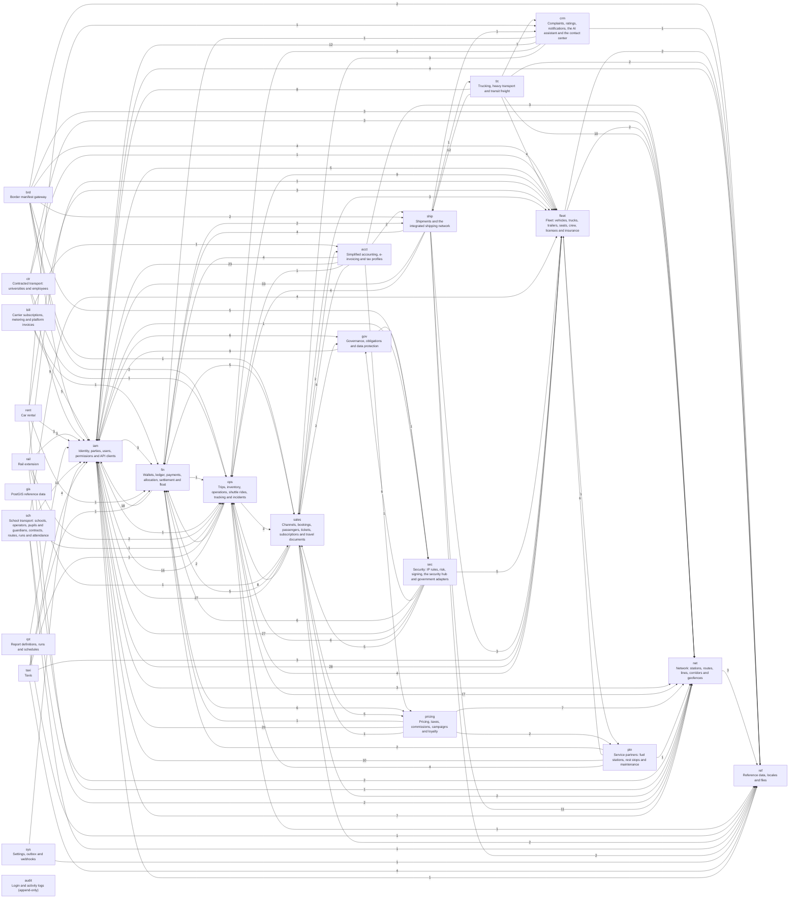

## `iam` — Identity, parties, users, permissions and API clients

```mermaid
erDiagram
  iam_api_client {
    bigint id PK
    uuid uid
    bigint owner_party_id FK
    bigint company_id FK
    text status
    bigint created_by FK
    bigint approved_by FK
    bigint acting_user_id FK
    bigint payment_provider_id FK
    bigint authority_id FK
  }
  iam_api_key {
    bigint id PK
    bigint api_client_id FK
    text status
    bigint created_by FK
    bigint revoked_by FK
  }
  iam_api_usage_daily {
    bigint api_client_id PK
    date day PK
  }
  iam_app_user {
    bigint id PK
    uuid uid
    bigint party_id FK
    text status
    text preferred_locale FK
  }
  iam_auth_token {
    bigint id PK
    bigint user_id FK
  }
  iam_bank_account {
    bigint id PK
    bigint party_id FK
    integer enc_key_id FK
    character currency FK
    text status
    uuid uid
    bigint verified_by FK
  }
  iam_beneficial_owner {
    bigint company_id PK
    bigint party_id PK
  }
  iam_biometric_template {
    bigint party_id PK
    integer enc_key_id FK
  }
  iam_company {
    bigint id PK
    bigint approved_by FK
    bigint payout_bank_account_id FK
  }
  iam_company_member {
    bigint user_id PK
    bigint company_id PK
    bigint role_id FK
    text status
  }
  iam_device {
    bigint id PK
    bigint user_id FK
  }
  iam_device_permission_state {
    bigint device_id PK
    bigint user_id FK
  }
  iam_document {
    bigint id PK
    uuid uid
    integer enc_key_id FK
    bigint file_id FK
    text status
    bigint reviewed_by FK
    bigint company_id FK
    bigint uploaded_by FK
    bigint owner_lease_id FK
    bigint owner_party_id FK
    bigint owner_company_id FK
    bigint owner_license_id FK
    bigint owner_station_id FK
    bigint owner_vehicle_id FK
    bigint owner_incident_id FK
    bigint owner_insurance_id FK
    bigint retention_policy_id FK
    bigint erasure_request_id FK
  }
  iam_family {
    bigint id PK
    uuid uid
    bigint head_party_id FK
    bigint trips_wallet_id FK
    text status
  }
  iam_family_link_request {
    bigint id PK
    uuid uid
    bigint family_id FK
    bigint member_id FK
    bigint requester_user_id FK
    bigint requester_party_id FK
    text status
    bigint decided_by FK
  }
  iam_family_member {
    bigint id PK
    uuid uid
    bigint family_id FK
    bigint party_id FK
    character nationality FK
    integer enc_key_id FK
    bigint linked_user_id FK
    text status
    bigint retention_policy_id FK
    bigint erasure_request_id FK
  }
  iam_family_spend {
    bigint id PK
    bigint family_id FK
    bigint member_id FK
    character currency FK
    bigint initiated_by FK
    bigint ledger_txn_id FK
  }
  iam_family_travel_rule {
    bigint id PK
    uuid uid
    bigint member_id FK
    bigint from_city_id FK
    bigint to_city_id FK
    bigint line_id FK
  }
  iam_gov_identity_link {
    bigint party_id PK
    bigint provider_id PK
  }
  iam_identity_provider {
    bigint id PK
    text code
    character country_code FK
    text status
  }
  iam_mfa_factor {
    bigint id PK
    bigint user_id FK
    integer enc_key_id FK
  }
  iam_party {
    bigint id PK
    uuid uid
    integer enc_key_id FK
    character nationality FK
    character country_code FK
    character tax_country FK
    text status
    bigint retention_policy_id FK
    bigint erasure_request_id FK
  }
  iam_party_role {
    bigint party_id PK
    text role_code PK
    text status
  }
  iam_permission {
    text code PK
  }
  iam_push_token {
    bigint device_id PK
  }
  iam_role {
    bigint id PK
    text code
    bigint company_id FK
  }
  iam_role_permission {
    bigint role_id PK
    text permission_code PK
  }
  iam_role_scope {
    bigint id PK
    bigint role_id FK
  }
  iam_user_role {
    bigint user_id PK
    bigint role_id PK
    bigint granted_by FK
  }
  iam_user_session {
    bigint id PK
    bigint user_id FK
    bigint device_id FK
    bigint company_id FK
  }
  iam_user_station_scope {
    bigint user_id PK
    bigint station_id PK
    bigint company_id FK
  }
  iam_verification {
    bigint id PK
    bigint provider_id FK
    bigint reviewer_id FK
    bigint subject_party_id FK
    bigint subject_company_id FK
    bigint subject_vehicle_id FK
    bigint subject_document_id FK
  }
  fin_ledger_txn {
    ref external
  }
  fin_payment_provider {
    ref external
  }
  fin_wallet {
    ref external
  }
  fleet_insurance_policy {
    ref external
  }
  fleet_license_record {
    ref external
  }
  fleet_vehicle {
    ref external
  }
  fleet_vehicle_lease {
    ref external
  }
  gov_retention_policy {
    ref external
  }
  gov_subject_request {
    ref external
  }
  net_line {
    ref external
  }
  net_station {
    ref external
  }
  ops_incident {
    ref external
  }
  ref_city {
    ref external
  }
  ref_locale {
    ref external
  }
  ref_party_role_type {
    ref external
  }
  sec_authority_profile {
    ref external
  }
  iam_family_spend }o..o| fin_ledger_txn : "ledger_txn_id"
  iam_api_client }o..o| fin_payment_provider : "payment_provider_id"
  iam_family }o..o| fin_wallet : "trips_wallet_id"
  iam_document }o..o| fleet_insurance_policy : "owner_insurance_id"
  iam_document }o..o| fleet_license_record : "owner_license_id"
  iam_verification }o..o| fleet_vehicle : "subject_vehicle_id"
  iam_document }o..o| fleet_vehicle : "owner_vehicle_id"
  iam_document }o..o| fleet_vehicle_lease : "owner_lease_id"
  iam_party }o..o| gov_retention_policy : "retention_policy_id"
  iam_document }o..o| gov_retention_policy : "retention_policy_id"
  iam_family_member }o..o| gov_retention_policy : "retention_policy_id"
  iam_party }o..o| gov_subject_request : "erasure_request_id"
  iam_document }o..o| gov_subject_request : "erasure_request_id"
  iam_family_member }o..o| gov_subject_request : "erasure_request_id"
  iam_api_usage_daily }o--|| iam_api_client : "api_client_id"
  iam_api_key }o--|| iam_api_client : "api_client_id"
  iam_user_role }o--|| iam_app_user : "user_id"
  iam_company_member }o--|| iam_app_user : "user_id"
  iam_user_station_scope }o--|| iam_app_user : "user_id"
  iam_device }o--|| iam_app_user : "user_id"
  iam_mfa_factor }o--|| iam_app_user : "user_id"
  iam_user_session }o--|| iam_app_user : "user_id"
  iam_auth_token }o..o| iam_app_user : "user_id"
  iam_device_permission_state }o--|| iam_app_user : "user_id"
  iam_family_link_request }o..o| iam_app_user : "requester_user_id"
  iam_family_spend }o..o| iam_app_user : "initiated_by"
  iam_api_client }o..o| iam_app_user : "acting_user_id"
  iam_family_member }o..o| iam_app_user : "linked_user_id"
  iam_company }o..o| iam_bank_account : "payout_bank_account_id"
  iam_beneficial_owner }o--|| iam_company : "company_id"
  iam_company_member }o--|| iam_company : "company_id"
  iam_user_station_scope }o--|| iam_company : "company_id"
  iam_role }o..o| iam_company : "company_id"
  iam_user_session }o..o| iam_company : "company_id"
  iam_api_client }o..o| iam_company : "company_id"
  iam_document }o..o| iam_company : "company_id"
  iam_verification }o..o| iam_company : "subject_company_id"
  iam_document }o..o| iam_company : "owner_company_id"
  iam_push_token }o--|| iam_device : "device_id"
  iam_device_permission_state }o--|| iam_device : "device_id"
  iam_user_session }o..o| iam_device : "device_id"
  iam_verification }o..o| iam_document : "subject_document_id"
  iam_family_spend }o--|| iam_family : "family_id"
  iam_family_member }o--|| iam_family : "family_id"
  iam_family_link_request }o--|| iam_family : "family_id"
  iam_family_travel_rule }o--|| iam_family_member : "member_id"
  iam_family_spend }o--|| iam_family_member : "member_id"
  iam_family_link_request }o--|| iam_family_member : "member_id"
  iam_gov_identity_link }o--|| iam_identity_provider : "provider_id"
  iam_verification }o..o| iam_identity_provider : "provider_id"
  iam_party_role }o--|| iam_party : "party_id"
  iam_company }o--|| iam_party : "id"
  iam_biometric_template }o--|| iam_party : "party_id"
  iam_gov_identity_link }o--|| iam_party : "party_id"
  iam_beneficial_owner }o--|| iam_party : "party_id"
  iam_bank_account }o--|| iam_party : "party_id"
  iam_app_user }o--|| iam_party : "party_id"
  iam_family }o--|| iam_party : "head_party_id"
  iam_family_member }o--|| iam_party : "party_id"
  iam_api_client }o--|| iam_party : "owner_party_id"
  iam_family_link_request }o..o| iam_party : "requester_party_id"
  iam_verification }o..o| iam_party : "subject_party_id"
  iam_document }o..o| iam_party : "owner_party_id"
  iam_role_permission }o--|| iam_permission : "permission_code"
  iam_role_permission }o--|| iam_role : "role_id"
  iam_user_role }o--|| iam_role : "role_id"
  iam_role_scope }o--|| iam_role : "role_id"
  iam_company_member }o..o| iam_role : "role_id"
  iam_family_travel_rule }o..o| net_line : "line_id"
  iam_user_station_scope }o--|| net_station : "station_id"
  iam_document }o..o| net_station : "owner_station_id"
  iam_document }o..o| ops_incident : "owner_incident_id"
  iam_family_travel_rule }o..o| ref_city : "from_city_id"
  iam_family_travel_rule }o..o| ref_city : "to_city_id"
  iam_app_user }o--|| ref_locale : "preferred_locale"
  iam_party_role }o--|| ref_party_role_type : "role_code"
  iam_api_client }o..o| sec_authority_profile : "authority_id"
```

## `ref` — Reference data, locales and files

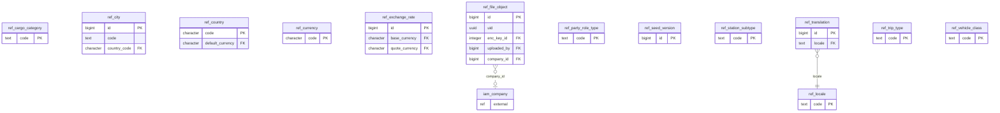

## `sys` — Settings, outbox and webhooks

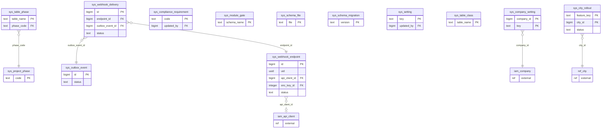

## `net` — Network: stations, routes, lines, corridors and geofences

```mermaid
erDiagram
  net_approved_rest_stop {
    bigint corridor_id PK
    bigint station_id PK
  }
  net_carrier_code {
    bigint id PK
    bigint company_id FK
    text status
    bigint approved_by FK
  }
  net_code_reservation {
    text code PK
  }
  net_compliance_profile {
    bigint id PK
    text status
    bigint created_by FK
    bigint approved_by FK
  }
  net_corridor {
    bigint id PK
    uuid uid
    text code
    character country_code FK
    text status
  }
  net_geofence {
    bigint id PK
    text code
    bigint station_id FK
    text status
  }
  net_line {
    bigint id PK
    uuid uid
    text code
    bigint city_id FK
    text status
  }
  net_line_diversion {
    bigint id PK
    bigint line_id FK
    bigint approved_by FK
    text status
  }
  net_line_fare {
    bigint id PK
    bigint tariff_id FK
    bigint from_station_id FK
    bigint to_station_id FK
  }
  net_line_permit {
    bigint id PK
    bigint line_id FK
    bigint company_id FK
    text status
  }
  net_line_stop {
    bigint line_version_id PK
    smallint seq PK
    bigint station_id FK
  }
  net_line_tariff {
    bigint id PK
    bigint line_id FK
    character currency FK
    text status
    bigint approved_by FK
  }
  net_line_version {
    bigint id PK
    bigint line_id FK
    text status
  }
  net_line_version_approval {
    bigint line_version_id PK
    bigint user_id PK
  }
  net_route {
    bigint id PK
    uuid uid
    bigint company_id FK
    text code
    bigint origin_station_id FK
    bigint dest_station_id FK
    text status
    bigint line_id FK
  }
  net_route_stop {
    bigint route_id PK
    smallint seq PK
    bigint station_id FK
  }
  net_service_number {
    bigint id PK
    bigint company_id FK
    integer number
    bigint route_id FK
  }
  net_station {
    bigint id PK
    uuid uid
    text code
    bigint city_id FK
    character country_code FK
    text subtype FK
    bigint owner_company_id FK
    text status
    bigint compliance_profile_id FK
    bigint verified_by FK
  }
  net_station_contact {
    bigint id PK
    bigint station_id FK
  }
  net_station_display {
    bigint id PK
    bigint station_id FK
    bigint gate_id FK
    text status
  }
  net_station_gate {
    bigint id PK
    bigint station_id FK
    text code
    text status
  }
  net_timetable_template {
    bigint id PK
    bigint line_id FK
    bigint company_id FK
    text status
  }
  iam_app_user {
    ref external
  }
  iam_company {
    ref external
  }
  ref_city {
    ref external
  }
  ref_station_subtype {
    ref external
  }
  net_line_version_approval }o--|| iam_app_user : "user_id"
  net_carrier_code }o--|| iam_company : "company_id"
  net_service_number }o--|| iam_company : "company_id"
  net_route }o--|| iam_company : "company_id"
  net_line_permit }o--|| iam_company : "company_id"
  net_timetable_template }o--|| iam_company : "company_id"
  net_station }o..o| iam_company : "owner_company_id"
  net_station }o..o| net_compliance_profile : "compliance_profile_id"
  net_approved_rest_stop }o--|| net_corridor : "corridor_id"
  net_line_version }o--|| net_line : "line_id"
  net_line_permit }o--|| net_line : "line_id"
  net_line_tariff }o--|| net_line : "line_id"
  net_timetable_template }o--|| net_line : "line_id"
  net_line_diversion }o--|| net_line : "line_id"
  net_route }o..o| net_line : "line_id"
  net_line_fare }o--|| net_line_tariff : "tariff_id"
  net_line_version_approval }o--|| net_line_version : "line_version_id"
  net_line_stop }o--|| net_line_version : "line_version_id"
  net_route_stop }o--|| net_route : "route_id"
  net_service_number }o..o| net_route : "route_id"
  net_station_contact }o--|| net_station : "station_id"
  net_approved_rest_stop }o--|| net_station : "station_id"
  net_station_gate }o--|| net_station : "station_id"
  net_station_display }o--|| net_station : "station_id"
  net_route_stop }o--|| net_station : "station_id"
  net_line_stop }o--|| net_station : "station_id"
  net_line_fare }o..o| net_station : "from_station_id"
  net_line_fare }o..o| net_station : "to_station_id"
  net_geofence }o..o| net_station : "station_id"
  net_route }o--|| net_station : "origin_station_id"
  net_route }o--|| net_station : "dest_station_id"
  net_station_display }o..o| net_station_gate : "gate_id"
  net_station }o--|| ref_city : "city_id"
  net_line }o..o| ref_city : "city_id"
  net_station }o--|| ref_station_subtype : "subtype"
```

## `fleet` — Fleet: vehicles, trucks, trailers, seats, crew, licenses and insurance

```mermaid
erDiagram
  fleet_boarding_validator {
    bigint id PK
    bigint company_id FK
    bigint vehicle_id FK
    text status
  }
  fleet_crew_profile {
    bigint party_id PK
    bigint company_id FK
    text status
  }
  fleet_driving_hours_log {
    bigint id PK
    bigint company_id FK
    bigint party_id FK
    bigint trip_id FK
  }
  fleet_field_check_log {
    bigint id PK
    bigint inspector_user_id FK
    bigint vehicle_id FK
  }
  fleet_insurance_claim {
    bigint id PK
    bigint company_id FK
    bigint incident_id FK
    bigint policy_id FK
    character currency FK
    text status
  }
  fleet_insurance_policy {
    bigint id PK
    bigint vehicle_id FK
    bigint insurer_party_id FK
    bigint license_record_id FK
    bigint document_id FK
    text status
  }
  fleet_license_change_request {
    bigint id PK
    bigint license_record_id FK
    bigint requested_by FK
    bigint document_id FK
    text status
    bigint reviewed_by FK
    bigint approved_by FK
  }
  fleet_license_record {
    bigint id PK
    bigint company_id FK
    bigint document_id FK
    text status
    bigint verified_by FK
    bigint last_change_request_id FK
    bigint subject_driver_id FK
    bigint subject_company_id FK
    bigint subject_partner_id FK
    bigint subject_station_id FK
    bigint subject_trailer_id FK
    bigint subject_vehicle_id FK
    bigint subject_person_id FK
  }
  fleet_line_permit_vehicle {
    bigint id PK
    bigint permit_id FK
    bigint company_id FK
    bigint vehicle_id FK
    text status
    bigint approved_by FK
  }
  fleet_seat_layout {
    bigint id PK
    bigint company_id FK
    uuid uid
    text status
    bigint created_by FK
  }
  fleet_seat_layout_seat {
    bigint layout_id PK
    smallint seat_no PK
  }
  fleet_seat_price_rule {
    bigint id PK
    bigint company_id FK
    bigint vehicle_id FK
    bigint seat_layout_id FK
  }
  fleet_tracking_device {
    bigint id PK
    bigint company_id FK
    bigint vehicle_id FK
    text status
  }
  fleet_trailer {
    bigint id PK
    uuid uid
    bigint company_id FK
    bigint owner_party_id FK
    character plate_country FK
    text status
  }
  fleet_truck_combination {
    bigint id PK
    bigint company_id FK
    bigint truck_vehicle_id FK
    bigint trailer_id FK
    bigint driver_party_id FK
  }
  fleet_truck_unit {
    bigint vehicle_id PK
  }
  fleet_vehicle {
    bigint id PK
    uuid uid
    bigint company_id FK
    text vehicle_class FK
    character plate_country FK
    bigint seat_layout_id FK
    bigint owner_party_id FK
    text status
  }
  fleet_vehicle_fuel_profile {
    bigint id PK
    bigint company_id FK
    bigint vehicle_id FK
    text vehicle_class FK
  }
  fleet_vehicle_lease {
    bigint id PK
    bigint vehicle_id FK
    bigint owner_party_id FK
    bigint lessee_company_id FK
    bigint document_id FK
    text status
  }
  fleet_vehicle_qr_tag {
    bigint id PK
    bigint vehicle_id FK
  }
  fleet_vehicle_service_status {
    bigint id PK
    bigint company_id FK
    bigint vehicle_id FK
    text status
    bigint incident_id FK
    bigint released_by FK
    bigint release_evidence_id FK
  }
  fleet_vehicle_status_history {
    bigint id PK
    bigint vehicle_id FK
    text status
    bigint incident_id FK
    bigint changed_by FK
    bigint release_document_id FK
  }
  iam_company {
    ref external
  }
  iam_document {
    ref external
  }
  iam_party {
    ref external
  }
  net_line_permit {
    ref external
  }
  net_station {
    ref external
  }
  ops_incident {
    ref external
  }
  ops_trip {
    ref external
  }
  ptn_partner {
    ref external
  }
  ref_vehicle_class {
    ref external
  }
  fleet_driving_hours_log }o--|| fleet_crew_profile : "party_id"
  fleet_truck_combination }o..o| fleet_crew_profile : "driver_party_id"
  fleet_insurance_claim }o--|| fleet_insurance_policy : "policy_id"
  fleet_license_record }o..o| fleet_license_change_request : "last_change_request_id"
  fleet_license_change_request }o--|| fleet_license_record : "license_record_id"
  fleet_insurance_policy }o..o| fleet_license_record : "license_record_id"
  fleet_seat_layout_seat }o--|| fleet_seat_layout : "layout_id"
  fleet_seat_price_rule }o..o| fleet_seat_layout : "seat_layout_id"
  fleet_vehicle }o..o| fleet_seat_layout : "seat_layout_id"
  fleet_truck_combination }o..o| fleet_trailer : "trailer_id"
  fleet_license_record }o..o| fleet_trailer : "subject_trailer_id"
  fleet_truck_combination }o--|| fleet_truck_unit : "truck_vehicle_id"
  fleet_truck_unit }o--|| fleet_vehicle : "vehicle_id"
  fleet_vehicle_lease }o--|| fleet_vehicle : "vehicle_id"
  fleet_insurance_policy }o--|| fleet_vehicle : "vehicle_id"
  fleet_vehicle_qr_tag }o--|| fleet_vehicle : "vehicle_id"
  fleet_vehicle_status_history }o--|| fleet_vehicle : "vehicle_id"
  fleet_seat_price_rule }o..o| fleet_vehicle : "vehicle_id"
  fleet_field_check_log }o..o| fleet_vehicle : "vehicle_id"
  fleet_vehicle_service_status }o--|| fleet_vehicle : "vehicle_id"
  fleet_vehicle_fuel_profile }o..o| fleet_vehicle : "vehicle_id"
  fleet_tracking_device }o--|| fleet_vehicle : "vehicle_id"
  fleet_boarding_validator }o..o| fleet_vehicle : "vehicle_id"
  fleet_line_permit_vehicle }o--|| fleet_vehicle : "vehicle_id"
  fleet_license_record }o..o| fleet_vehicle : "subject_vehicle_id"
  fleet_seat_layout }o..o| iam_company : "company_id"
  fleet_seat_price_rule }o--|| iam_company : "company_id"
  fleet_crew_profile }o--|| iam_company : "company_id"
  fleet_license_record }o..o| iam_company : "company_id"
  fleet_driving_hours_log }o--|| iam_company : "company_id"
  fleet_vehicle_service_status }o--|| iam_company : "company_id"
  fleet_insurance_claim }o--|| iam_company : "company_id"
  fleet_truck_combination }o--|| iam_company : "company_id"
  fleet_boarding_validator }o--|| iam_company : "company_id"
  fleet_vehicle_fuel_profile }o..o| iam_company : "company_id"
  fleet_tracking_device }o--|| iam_company : "company_id"
  fleet_vehicle }o--|| iam_company : "company_id"
  fleet_trailer }o--|| iam_company : "company_id"
  fleet_line_permit_vehicle }o--|| iam_company : "company_id"
  fleet_vehicle_lease }o--|| iam_company : "lessee_company_id"
  fleet_license_record }o..o| iam_company : "subject_company_id"
  fleet_license_change_request }o..o| iam_document : "document_id"
  fleet_vehicle_lease }o..o| iam_document : "document_id"
  fleet_vehicle_status_history }o..o| iam_document : "release_document_id"
  fleet_license_record }o..o| iam_document : "document_id"
  fleet_insurance_policy }o..o| iam_document : "document_id"
  fleet_crew_profile }o--|| iam_party : "party_id"
  fleet_vehicle_lease }o--|| iam_party : "owner_party_id"
  fleet_insurance_policy }o..o| iam_party : "insurer_party_id"
  fleet_trailer }o..o| iam_party : "owner_party_id"
  fleet_license_record }o..o| iam_party : "subject_driver_id"
  fleet_vehicle }o--|| iam_party : "owner_party_id"
  fleet_license_record }o..o| iam_party : "subject_person_id"
  fleet_line_permit_vehicle }o--|| net_line_permit : "permit_id"
  fleet_license_record }o..o| net_station : "subject_station_id"
  fleet_insurance_claim }o--|| ops_incident : "incident_id"
  fleet_vehicle_status_history }o..o| ops_incident : "incident_id"
  fleet_vehicle_service_status }o..o| ops_incident : "incident_id"
  fleet_driving_hours_log }o..o| ops_trip : "trip_id"
  fleet_license_record }o..o| ptn_partner : "subject_partner_id"
  fleet_vehicle }o--|| ref_vehicle_class : "vehicle_class"
  fleet_vehicle_fuel_profile }o..o| ref_vehicle_class : "vehicle_class"
```

## `pricing` — Pricing, taxes, commissions, campaigns and loyalty

```mermaid
erDiagram
  pricing_allocation_template {
    bigint id PK
    text code
    text status
    bigint created_by FK
    bigint approved_by FK
  }
  pricing_allocation_template_line {
    bigint template_id PK
    text code PK
  }
  pricing_award_seat_rule {
    bigint id PK
    bigint company_id FK
    bigint line_id FK
    bigint route_id FK
    text status
  }
  pricing_bin_range {
    bigint id PK
    bigint bank_party_id FK
    text status
  }
  pricing_campaign {
    bigint id PK
    uuid uid
    text code
    bigint company_id FK
    text status
    bigint created_by FK
    bigint approved_by FK
    bigint sponsor_account_id FK
  }
  pricing_cancellation_policy {
    bigint id PK
    bigint company_id FK
    text code
    text status
    bigint approved_by FK
  }
  pricing_category_fare_rule {
    bigint id PK
    bigint company_id FK
    bigint route_id FK
    character currency FK
    text status
    bigint created_by FK
  }
  pricing_commission_rule {
    bigint id PK
    bigint scheme_id FK
  }
  pricing_commission_scheme {
    bigint id PK
    text code
    text status
    bigint created_by FK
    bigint approved_by FK
  }
  pricing_family_offer {
    bigint id PK
    uuid uid
    bigint company_id FK
    text code
    bigint route_id FK
    text status
    bigint created_by FK
  }
  pricing_fare_brand {
    text code PK
    bigint company_id FK
  }
  pricing_fare_table {
    bigint id PK
    bigint company_id FK
    bigint route_id FK
    character currency FK
    text status
    bigint created_by FK
    bigint approved_by FK
  }
  pricing_fare_table_item {
    bigint fare_table_id PK
    bigint from_station_id PK
    bigint to_station_id PK
    text cabin PK
    text passenger_category PK
  }
  pricing_jurisdiction {
    bigint id PK
    character country_code FK
    bigint parent_id FK
  }
  pricing_loyalty_partner {
    bigint id PK
    bigint program_id FK
    bigint party_id FK
    bigint service_partner_id FK
    text status
  }
  pricing_loyalty_program {
    bigint id PK
    text code
    character currency FK
    text status
  }
  pricing_loyalty_rule {
    bigint id PK
    bigint program_id FK
  }
  pricing_loyalty_tier {
    bigint id PK
    bigint program_id FK
    text code
  }
  pricing_override_policy {
    bigint id PK
    bigint user_id FK
    bigint company_id FK
    bigint created_by FK
    bigint approved_by FK
  }
  pricing_partner_redemption {
    bigint id PK
    bigint loyalty_partner_id FK
    bigint voucher_id FK
    bigint token_id FK
    bigint partner_sale_id FK
    character currency FK
  }
  pricing_passenger_age_band {
    bigint id PK
    bigint company_id FK
    text status
    bigint created_by FK
  }
  pricing_points_account {
    bigint id PK
    bigint program_id FK
    bigint party_id FK
    bigint tier_id FK
    text status
  }
  pricing_points_ledger {
    bigint id PK
    bigint account_id FK
    bigint booking_id FK
    bigint rule_id FK
    bigint reverses_id FK
  }
  pricing_points_liability {
    bigint id PK
    bigint program_id FK
    bigint issuer_party_id FK
  }
  pricing_points_transfer {
    bigint id PK
    bigint account_id FK
    bigint loyalty_partner_id FK
    bigint points_ledger_id FK
    text status
  }
  pricing_pricing_modifier {
    bigint id PK
    bigint company_id FK
  }
  pricing_promo_code {
    bigint id PK
    bigint campaign_id FK
    citext code
    bigint owner_party_id FK
  }
  pricing_rate_band {
    bigint id PK
    bigint tax_rule_id FK
    bigint commission_rule_id FK
  }
  pricing_redemption_channel {
    text code PK
  }
  pricing_redemption_token {
    bigint id PK
    bigint user_id FK
    text channel_code FK
  }
  pricing_reward_catalog {
    bigint id PK
    bigint program_id FK
    bigint loyalty_partner_id FK
    character currency FK
    text status
  }
  pricing_reward_voucher {
    bigint id PK
    bigint user_id FK
    bigint catalog_id FK
    bigint loyalty_partner_id FK
    bigint points_ledger_id FK
    character currency FK
    text status
  }
  pricing_sponsor_account {
    bigint id PK
    bigint party_id FK
    bigint wallet_id FK
    character currency FK
    text status
  }
  pricing_tax_rule {
    bigint id PK
    bigint scheme_id FK
  }
  pricing_tax_scheme {
    bigint id PK
    text code
    bigint jurisdiction_id FK
    bigint payable_to_party_id FK
    text status
    bigint created_by FK
    bigint approved_by FK
  }
  fin_wallet {
    ref external
  }
  iam_app_user {
    ref external
  }
  iam_company {
    ref external
  }
  iam_party {
    ref external
  }
  net_line {
    ref external
  }
  net_route {
    ref external
  }
  net_station {
    ref external
  }
  ptn_partner {
    ref external
  }
  ptn_partner_sale {
    ref external
  }
  sales_booking {
    ref external
  }
  pricing_sponsor_account }o..o| fin_wallet : "wallet_id"
  pricing_redemption_token }o--|| iam_app_user : "user_id"
  pricing_reward_voucher }o--|| iam_app_user : "user_id"
  pricing_override_policy }o..o| iam_app_user : "user_id"
  pricing_fare_brand }o..o| iam_company : "company_id"
  pricing_pricing_modifier }o..o| iam_company : "company_id"
  pricing_cancellation_policy }o..o| iam_company : "company_id"
  pricing_award_seat_rule }o--|| iam_company : "company_id"
  pricing_passenger_age_band }o..o| iam_company : "company_id"
  pricing_category_fare_rule }o..o| iam_company : "company_id"
  pricing_fare_table }o..o| iam_company : "company_id"
  pricing_family_offer }o--|| iam_company : "company_id"
  pricing_override_policy }o..o| iam_company : "company_id"
  pricing_campaign }o..o| iam_company : "company_id"
  pricing_bin_range }o--|| iam_party : "bank_party_id"
  pricing_points_account }o--|| iam_party : "party_id"
  pricing_loyalty_partner }o--|| iam_party : "party_id"
  pricing_points_liability }o..o| iam_party : "issuer_party_id"
  pricing_sponsor_account }o--|| iam_party : "party_id"
  pricing_promo_code }o..o| iam_party : "owner_party_id"
  pricing_tax_scheme }o..o| iam_party : "payable_to_party_id"
  pricing_award_seat_rule }o..o| net_line : "line_id"
  pricing_fare_table }o..o| net_route : "route_id"
  pricing_award_seat_rule }o..o| net_route : "route_id"
  pricing_category_fare_rule }o..o| net_route : "route_id"
  pricing_family_offer }o..o| net_route : "route_id"
  pricing_fare_table_item }o--|| net_station : "from_station_id"
  pricing_fare_table_item }o--|| net_station : "to_station_id"
  pricing_allocation_template_line }o--|| pricing_allocation_template : "template_id"
  pricing_promo_code }o--|| pricing_campaign : "campaign_id"
  pricing_rate_band }o..o| pricing_commission_rule : "commission_rule_id"
  pricing_commission_rule }o--|| pricing_commission_scheme : "scheme_id"
  pricing_fare_table_item }o--|| pricing_fare_table : "fare_table_id"
  pricing_jurisdiction }o..o| pricing_jurisdiction : "parent_id"
  pricing_tax_scheme }o--|| pricing_jurisdiction : "jurisdiction_id"
  pricing_partner_redemption }o--|| pricing_loyalty_partner : "loyalty_partner_id"
  pricing_reward_catalog }o..o| pricing_loyalty_partner : "loyalty_partner_id"
  pricing_points_transfer }o--|| pricing_loyalty_partner : "loyalty_partner_id"
  pricing_reward_voucher }o..o| pricing_loyalty_partner : "loyalty_partner_id"
  pricing_loyalty_tier }o--|| pricing_loyalty_program : "program_id"
  pricing_loyalty_rule }o--|| pricing_loyalty_program : "program_id"
  pricing_points_account }o--|| pricing_loyalty_program : "program_id"
  pricing_loyalty_partner }o--|| pricing_loyalty_program : "program_id"
  pricing_reward_catalog }o--|| pricing_loyalty_program : "program_id"
  pricing_points_liability }o--|| pricing_loyalty_program : "program_id"
  pricing_points_ledger }o..o| pricing_loyalty_rule : "rule_id"
  pricing_points_account }o..o| pricing_loyalty_tier : "tier_id"
  pricing_points_ledger }o--|| pricing_points_account : "account_id"
  pricing_points_transfer }o--|| pricing_points_account : "account_id"
  pricing_reward_voucher }o..o| pricing_points_ledger : "points_ledger_id"
  pricing_points_transfer }o..o| pricing_points_ledger : "points_ledger_id"
  pricing_points_ledger }o..o| pricing_points_ledger : "reverses_id"
  pricing_redemption_token }o--|| pricing_redemption_channel : "channel_code"
  pricing_partner_redemption }o..o| pricing_redemption_token : "token_id"
  pricing_reward_voucher }o..o| pricing_reward_catalog : "catalog_id"
  pricing_partner_redemption }o..o| pricing_reward_voucher : "voucher_id"
  pricing_campaign }o..o| pricing_sponsor_account : "sponsor_account_id"
  pricing_rate_band }o..o| pricing_tax_rule : "tax_rule_id"
  pricing_tax_rule }o--|| pricing_tax_scheme : "scheme_id"
  pricing_loyalty_partner }o..o| ptn_partner : "service_partner_id"
  pricing_partner_redemption }o..o| ptn_partner_sale : "partner_sale_id"
  pricing_points_ledger }o..o| sales_booking : "booking_id"
```

## `ops` — Trips, inventory, operations, shuttle rides, tracking and incidents

```mermaid
erDiagram
  ops_crew_assignment {
    bigint id PK
    bigint trip_id FK
    bigint party_id FK
    text status
  }
  ops_crossing_event {
    bigint id PK
    bigint trip_id FK
    bigint station_id FK
    bigint recorded_by_user_id FK
  }
  ops_driver_notice {
    bigint id PK
    bigint user_id FK
    bigint trip_id FK
  }
  ops_family_zone {
    bigint trip_id PK
    text label PK
  }
  ops_geo_event {
    bigint id PK
    timestamp_with_time_zone ts PK
  }
  ops_incident {
    bigint id PK
    uuid uid
    bigint company_id FK
    bigint vehicle_id FK
    bigint trip_id FK
    bigint driver_party_id FK
    bigint reported_by FK
    text status
  }
  ops_incident_evidence {
    bigint id PK
    bigint incident_id FK
    bigint file_id FK
    bigint uploaded_by FK
  }
  ops_incident_external_link {
    bigint id PK
    bigint incident_id FK
    text status
  }
  ops_permission_event {
    bigint id PK
    bigint user_id FK
    bigint device_id FK
    bigint trip_id FK
  }
  ops_presence_beacon {
    bigint id PK
    bigint trip_id FK
    bigint vehicle_id FK
    text key_id FK
  }
  ops_proximity_sample {
    bigint ride_id PK
    timestamp_with_time_zone ts PK
  }
  ops_ride_segment_charge {
    bigint id PK
    bigint ride_id FK
    bigint ledger_txn_id FK
  }
  ops_route_adherence_event {
    bigint id PK
    bigint trip_id FK
  }
  ops_route_violation {
    bigint id PK
    uuid uid
    bigint company_id FK
    bigint vehicle_id FK
    bigint trip_id FK
    bigint driver_party_id FK
    bigint line_version_id FK
    text status
    bigint diversion_id FK
    bigint reviewed_by FK
  }
  ops_seat_lock {
    bigint id PK
    bigint trip_id FK
    bigint user_id FK
  }
  ops_seat_segment {
    bigint trip_id PK
    smallint seat_no PK
    smallint seg PK
    text status
    bigint lock_user_id FK
    bigint ticket_id FK
  }
  ops_shuttle_ride {
    bigint id PK
    uuid uid
    bigint user_id FK
    bigint wallet_id FK
    bigint trip_id FK
    bigint line_id FK
    bigint tariff_id FK
    bigint boarding_event_id FK
    bigint board_station_id FK
    bigint alight_station_id FK
    character currency FK
    text status
  }
  ops_standing_segment {
    bigint trip_id PK
    smallint seg PK
  }
  ops_tracking_alert {
    bigint id PK
    bigint trip_id FK
    text status
  }
  ops_tracking_state {
    bigint trip_id PK
    bigint driver_user_id FK
    text status
  }
  ops_transit_reconciliation {
    bigint trip_id PK
    text status
    bigint resolved_by_user_id FK
  }
  ops_trip {
    bigint id PK
    uuid uid
    text trip_no
    bigint company_id FK
    bigint service_number_id FK
    bigint template_id FK
    bigint route_id FK
    text trip_type FK
    bigint vehicle_id FK
    text status
    character currency FK
    bigint corridor_id FK
    bigint line_version_id FK
  }
  ops_trip_change {
    bigint id PK
    bigint trip_id FK
    bigint by_user_id FK
  }
  ops_trip_crossing_plan {
    bigint id PK
    bigint trip_id FK
    bigint exit_station_id FK
    bigint entry_station_id FK
  }
  ops_trip_delay {
    bigint id PK
    bigint trip_id FK
  }
  ops_trip_disruption {
    bigint id PK
    bigint trip_id FK
    bigint incident_id FK
    bigint replacement_vehicle_id FK
    bigint partner_company_id FK
    bigint decided_by FK
    text status
  }
  ops_trip_pair_fare {
    bigint trip_id PK
    smallint from_seq PK
    smallint to_seq PK
  }
  ops_trip_stop {
    bigint trip_id PK
    smallint seq PK
    bigint station_id FK
    bigint gate_id FK
  }
  ops_trip_stop_event {
    bigint id PK
    bigint trip_id FK
    bigint by_user_id FK
  }
  ops_trip_template {
    bigint id PK
    bigint company_id FK
    bigint route_id FK
    bigint service_number_id FK
    bigint default_vehicle_id FK
    character currency FK
    text status
  }
  ops_vehicle_swap {
    bigint id PK
    bigint trip_id FK
    bigint from_vehicle_id FK
    bigint to_vehicle_id FK
    bigint approved_by FK
  }
  ops_violation_report {
    bigint id PK
    bigint violation_id FK
    text status
  }
  fin_ledger_txn {
    ref external
  }
  fin_wallet {
    ref external
  }
  fleet_crew_profile {
    ref external
  }
  fleet_vehicle {
    ref external
  }
  iam_app_user {
    ref external
  }
  iam_company {
    ref external
  }
  iam_device {
    ref external
  }
  iam_party {
    ref external
  }
  net_corridor {
    ref external
  }
  net_line {
    ref external
  }
  net_line_diversion {
    ref external
  }
  net_line_tariff {
    ref external
  }
  net_line_version {
    ref external
  }
  net_route {
    ref external
  }
  net_service_number {
    ref external
  }
  net_station {
    ref external
  }
  net_station_gate {
    ref external
  }
  ref_trip_type {
    ref external
  }
  sales_boarding_event {
    ref external
  }
  sales_ticket {
    ref external
  }
  ops_ride_segment_charge }o..o| fin_ledger_txn : "ledger_txn_id"
  ops_shuttle_ride }o--|| fin_wallet : "wallet_id"
  ops_crew_assignment }o--|| fleet_crew_profile : "party_id"
  ops_vehicle_swap }o--|| fleet_vehicle : "from_vehicle_id"
  ops_presence_beacon }o..o| fleet_vehicle : "vehicle_id"
  ops_vehicle_swap }o--|| fleet_vehicle : "to_vehicle_id"
  ops_incident }o..o| fleet_vehicle : "vehicle_id"
  ops_route_violation }o--|| fleet_vehicle : "vehicle_id"
  ops_trip_template }o..o| fleet_vehicle : "default_vehicle_id"
  ops_trip_disruption }o..o| fleet_vehicle : "replacement_vehicle_id"
  ops_trip }o..o| fleet_vehicle : "vehicle_id"
  ops_permission_event }o--|| iam_app_user : "user_id"
  ops_tracking_state }o..o| iam_app_user : "driver_user_id"
  ops_driver_notice }o--|| iam_app_user : "user_id"
  ops_shuttle_ride }o--|| iam_app_user : "user_id"
  ops_seat_segment }o..o| iam_app_user : "lock_user_id"
  ops_transit_reconciliation }o..o| iam_app_user : "resolved_by_user_id"
  ops_seat_lock }o..o| iam_app_user : "user_id"
  ops_crossing_event }o..o| iam_app_user : "recorded_by_user_id"
  ops_trip_template }o--|| iam_company : "company_id"
  ops_incident }o--|| iam_company : "company_id"
  ops_route_violation }o--|| iam_company : "company_id"
  ops_trip }o--|| iam_company : "company_id"
  ops_trip_disruption }o..o| iam_company : "partner_company_id"
  ops_permission_event }o..o| iam_device : "device_id"
  ops_incident }o..o| iam_party : "driver_party_id"
  ops_route_violation }o..o| iam_party : "driver_party_id"
  ops_trip }o..o| net_corridor : "corridor_id"
  ops_shuttle_ride }o--|| net_line : "line_id"
  ops_route_violation }o..o| net_line_diversion : "diversion_id"
  ops_shuttle_ride }o..o| net_line_tariff : "tariff_id"
  ops_route_violation }o..o| net_line_version : "line_version_id"
  ops_trip }o..o| net_line_version : "line_version_id"
  ops_trip_template }o--|| net_route : "route_id"
  ops_trip }o--|| net_route : "route_id"
  ops_trip_template }o..o| net_service_number : "service_number_id"
  ops_trip }o..o| net_service_number : "service_number_id"
  ops_trip_stop }o--|| net_station : "station_id"
  ops_crossing_event }o--|| net_station : "station_id"
  ops_trip_crossing_plan }o--|| net_station : "exit_station_id"
  ops_trip_crossing_plan }o--|| net_station : "entry_station_id"
  ops_shuttle_ride }o--|| net_station : "board_station_id"
  ops_shuttle_ride }o..o| net_station : "alight_station_id"
  ops_trip_stop }o..o| net_station_gate : "gate_id"
  ops_incident_evidence }o--|| ops_incident : "incident_id"
  ops_incident_external_link }o--|| ops_incident : "incident_id"
  ops_trip_disruption }o..o| ops_incident : "incident_id"
  ops_violation_report }o--|| ops_route_violation : "violation_id"
  ops_proximity_sample }o--|| ops_shuttle_ride : "ride_id"
  ops_ride_segment_charge }o--|| ops_shuttle_ride : "ride_id"
  ops_trip_stop }o--|| ops_trip : "trip_id"
  ops_trip_pair_fare }o--|| ops_trip : "trip_id"
  ops_seat_segment }o--|| ops_trip : "trip_id"
  ops_standing_segment }o--|| ops_trip : "trip_id"
  ops_family_zone }o--|| ops_trip : "trip_id"
  ops_transit_reconciliation }o--|| ops_trip : "trip_id"
  ops_tracking_state }o--|| ops_trip : "trip_id"
  ops_crew_assignment }o--|| ops_trip : "trip_id"
  ops_trip_stop_event }o--|| ops_trip : "trip_id"
  ops_trip_change }o--|| ops_trip : "trip_id"
  ops_vehicle_swap }o--|| ops_trip : "trip_id"
  ops_tracking_alert }o--|| ops_trip : "trip_id"
  ops_trip_disruption }o--|| ops_trip : "trip_id"
  ops_trip_crossing_plan }o--|| ops_trip : "trip_id"
  ops_crossing_event }o--|| ops_trip : "trip_id"
  ops_route_adherence_event }o--|| ops_trip : "trip_id"
  ops_presence_beacon }o--|| ops_trip : "trip_id"
  ops_seat_lock }o--|| ops_trip : "trip_id"
  ops_trip_delay }o--|| ops_trip : "trip_id"
  ops_driver_notice }o..o| ops_trip : "trip_id"
  ops_permission_event }o..o| ops_trip : "trip_id"
  ops_incident }o..o| ops_trip : "trip_id"
  ops_shuttle_ride }o--|| ops_trip : "trip_id"
  ops_route_violation }o..o| ops_trip : "trip_id"
  ops_trip_pair_fare }o--|| ops_trip_stop : "trip_id,from_seq"
  ops_trip_pair_fare }o--|| ops_trip_stop : "trip_id,to_seq"
  ops_trip_stop_event }o--|| ops_trip_stop : "trip_id,seq"
  ops_trip }o..o| ops_trip_template : "template_id"
  ops_trip }o--|| ref_trip_type : "trip_type"
  ops_shuttle_ride }o..o| sales_boarding_event : "boarding_event_id"
  ops_seat_segment }o..o| sales_ticket : "ticket_id"
  ops_seat_segment }o..o| sales_ticket : "trip_id,ticket_id"
```

## `sales` — Channels, bookings, passengers, tickets, subscriptions and travel documents

```mermaid
erDiagram
  sales_agency_agreement {
    bigint id PK
    bigint agency_id FK
    character currency FK
    text status
    bigint created_by FK
  }
  sales_boarding_event {
    bigint id PK
    bigint ticket_id FK
    bigint trip_id FK
    bigint scanned_by_user_id FK
    bigint device_id FK
    bigint vehicle_tag_id FK
    bigint validator_id FK
    bigint nfc_card_id FK
  }
  sales_booking {
    bigint id PK
    uuid uid
    text booking_ref
    bigint trip_id FK
    bigint company_id FK
    bigint booker_party_id FK
    bigint booker_user_id FK
    bigint channel_id FK
    text status
    character currency FK
    bigint price_allocation_id FK
    bigint agency_id FK
    bigint family_id FK
    bigint funded_by_party_id FK
  }
  sales_campaign_redemption {
    bigint id PK
    bigint campaign_id FK
    bigint promo_code_id FK
    bigint booking_id FK
    bigint party_id FK
  }
  sales_channel {
    bigint id PK
    uuid uid
    text code
    bigint party_id FK
    bigint api_client_id FK
    text status
  }
  sales_channel_agreement {
    bigint id PK
    bigint channel_id FK
    bigint company_id FK
    bigint commission_scheme_id FK
    text status
    bigint created_by FK
    bigint approved_by FK
  }
  sales_channel_api_profile {
    bigint channel_id PK
    bigint api_client_id FK
  }
  sales_channel_booking_ref {
    bigint booking_id PK
    bigint channel_id FK
  }
  sales_channel_inventory_rule {
    bigint id PK
    bigint channel_id FK
    bigint company_id FK
    bigint route_id FK
    text trip_type FK
  }
  sales_channel_memo {
    bigint id PK
    bigint channel_id FK
    bigint statement_id FK
    character currency FK
    text status
  }
  sales_channel_statement {
    bigint id PK
    bigint channel_id FK
    character currency FK
    bigint ledger_txn_id FK
    text status
  }
  sales_channel_statement_line {
    bigint statement_id PK
    integer line_no PK
    bigint booking_id FK
  }
  sales_entry_rule {
    bigint id PK
    character country_code FK
    character nationality FK
    text status
    bigint created_by FK
    bigint approved_by FK
  }
  sales_external_mapping {
    bigint source_id PK
    text local_type PK
    text external_id PK
  }
  sales_inspection_check {
    bigint id PK
    bigint company_id FK
    bigint inspector_party_id FK
    bigint vehicle_id FK
    bigint trip_id FK
    bigint boarding_event_id FK
    character currency FK
  }
  sales_nfc_card {
    bigint id PK
    bigint wallet_id FK
    bigint party_id FK
    text status
  }
  sales_passenger {
    bigint id PK
    bigint booking_id FK
    bigint party_id FK
    character passport_country FK
    integer enc_key_id FK
    character nationality FK
    bigint family_member_id FK
    bigint accompanied_by_passenger_id FK
    bigint retention_policy_id FK
    bigint erasure_request_id FK
  }
  sales_passenger_compensation {
    bigint id PK
    bigint booking_id FK
    bigint trip_disruption_id FK
    bigint charged_to_company_id FK
    bigint credit_note_id FK
    text status
  }
  sales_refund_request {
    bigint id PK
    bigint booking_id FK
    bigint ticket_id FK
    text status
    bigint requested_by FK
    bigint decided_by FK
    bigint credit_note_id FK
  }
  sales_shuttle_pass {
    bigint id PK
    bigint subscription_id FK
    bigint nfc_card_id FK
    text qr_key_id FK
    text status
  }
  sales_shuttle_zone {
    bigint id PK
    text code
    bigint city_id FK
    text status
  }
  sales_subscription {
    bigint id PK
    uuid uid
    bigint plan_id FK
    bigint company_id FK
    bigint party_id FK
    bigint wallet_id FK
    character currency FK
    bigint ledger_txn_id FK
    text status
    bigint family_id FK
    bigint purchased_by_party_id FK
    bigint family_offer_id FK
  }
  sales_subscription_plan {
    bigint id PK
    bigint company_id FK
    text code
    bigint line_id FK
    bigint zone_id FK
    character currency FK
    text status
  }
  sales_supplier_source {
    bigint id PK
    bigint company_id FK
    text status
  }
  sales_ticket {
    bigint id PK
    uuid uid
    bigint booking_id FK
    bigint passenger_id FK
    bigint trip_id FK
    text fare_brand_code FK
    integer qr_key_id FK
    text status
  }
  sales_ticket_doc {
    bigint ticket_id PK
    bigint entry_rule_id FK
    character dest_country FK
    character visa_country FK
    character residence_country FK
    integer enc_key_id FK
    text status
    bigint verified_by FK
  }
  sales_waitlist_entry {
    bigint id PK
    bigint trip_id FK
    bigint party_id FK
    text status
    bigint booking_id FK
  }
  acct_einvoice_document {
    ref external
  }
  fin_ledger_txn {
    ref external
  }
  fin_price_allocation {
    ref external
  }
  fin_wallet {
    ref external
  }
  fleet_boarding_validator {
    ref external
  }
  fleet_vehicle {
    ref external
  }
  fleet_vehicle_qr_tag {
    ref external
  }
  gov_retention_policy {
    ref external
  }
  gov_subject_request {
    ref external
  }
  iam_api_client {
    ref external
  }
  iam_app_user {
    ref external
  }
  iam_company {
    ref external
  }
  iam_device {
    ref external
  }
  iam_family {
    ref external
  }
  iam_family_member {
    ref external
  }
  iam_party {
    ref external
  }
  net_line {
    ref external
  }
  net_route {
    ref external
  }
  ops_trip {
    ref external
  }
  ops_trip_disruption {
    ref external
  }
  ops_trip_stop {
    ref external
  }
  pricing_campaign {
    ref external
  }
  pricing_commission_scheme {
    ref external
  }
  pricing_family_offer {
    ref external
  }
  pricing_fare_brand {
    ref external
  }
  pricing_promo_code {
    ref external
  }
  ref_city {
    ref external
  }
  ref_trip_type {
    ref external
  }
  sales_passenger_compensation }o..o| acct_einvoice_document : "credit_note_id"
  sales_refund_request }o..o| acct_einvoice_document : "credit_note_id"
  sales_channel_statement }o..o| fin_ledger_txn : "ledger_txn_id"
  sales_subscription }o..o| fin_ledger_txn : "ledger_txn_id"
  sales_booking }o..o| fin_price_allocation : "price_allocation_id"
  sales_nfc_card }o..o| fin_wallet : "wallet_id"
  sales_subscription }o..o| fin_wallet : "wallet_id"
  sales_boarding_event }o..o| fleet_boarding_validator : "validator_id"
  sales_inspection_check }o..o| fleet_vehicle : "vehicle_id"
  sales_boarding_event }o..o| fleet_vehicle_qr_tag : "vehicle_tag_id"
  sales_passenger }o..o| gov_retention_policy : "retention_policy_id"
  sales_passenger }o..o| gov_subject_request : "erasure_request_id"
  sales_channel_api_profile }o--|| iam_api_client : "api_client_id"
  sales_channel }o..o| iam_api_client : "api_client_id"
  sales_booking }o..o| iam_app_user : "booker_user_id"
  sales_agency_agreement }o--|| iam_company : "agency_id"
  sales_subscription_plan }o..o| iam_company : "company_id"
  sales_inspection_check }o--|| iam_company : "company_id"
  sales_channel_agreement }o..o| iam_company : "company_id"
  sales_channel_inventory_rule }o--|| iam_company : "company_id"
  sales_subscription }o..o| iam_company : "company_id"
  sales_supplier_source }o..o| iam_company : "company_id"
  sales_booking }o--|| iam_company : "company_id"
  sales_passenger_compensation }o..o| iam_company : "charged_to_company_id"
  sales_booking }o..o| iam_company : "agency_id"
  sales_boarding_event }o..o| iam_device : "device_id"
  sales_subscription }o..o| iam_family : "family_id"
  sales_booking }o..o| iam_family : "family_id"
  sales_passenger }o..o| iam_family_member : "family_member_id"
  sales_passenger }o..o| iam_party : "party_id"
  sales_waitlist_entry }o--|| iam_party : "party_id"
  sales_inspection_check }o--|| iam_party : "inspector_party_id"
  sales_channel }o..o| iam_party : "party_id"
  sales_nfc_card }o..o| iam_party : "party_id"
  sales_campaign_redemption }o--|| iam_party : "party_id"
  sales_subscription }o--|| iam_party : "party_id"
  sales_booking }o--|| iam_party : "booker_party_id"
  sales_subscription }o..o| iam_party : "purchased_by_party_id"
  sales_booking }o..o| iam_party : "funded_by_party_id"
  sales_subscription_plan }o..o| net_line : "line_id"
  sales_channel_inventory_rule }o..o| net_route : "route_id"
  sales_waitlist_entry }o--|| ops_trip : "trip_id"
  sales_boarding_event }o--|| ops_trip : "trip_id"
  sales_booking }o--|| ops_trip : "trip_id"
  sales_inspection_check }o..o| ops_trip : "trip_id"
  sales_ticket }o--|| ops_trip : "trip_id"
  sales_passenger_compensation }o..o| ops_trip_disruption : "trip_disruption_id"
  sales_ticket }o--|| ops_trip_stop : "trip_id,from_seq"
  sales_ticket }o--|| ops_trip_stop : "trip_id,to_seq"
  sales_campaign_redemption }o--|| pricing_campaign : "campaign_id"
  sales_channel_agreement }o..o| pricing_commission_scheme : "commission_scheme_id"
  sales_subscription }o..o| pricing_family_offer : "family_offer_id"
  sales_ticket }o..o| pricing_fare_brand : "fare_brand_code"
  sales_campaign_redemption }o..o| pricing_promo_code : "promo_code_id"
  sales_shuttle_zone }o--|| ref_city : "city_id"
  sales_channel_inventory_rule }o..o| ref_trip_type : "trip_type"
  sales_inspection_check }o..o| sales_boarding_event : "boarding_event_id"
  sales_channel_booking_ref }o--|| sales_booking : "booking_id"
  sales_passenger }o--|| sales_booking : "booking_id"
  sales_refund_request }o--|| sales_booking : "booking_id"
  sales_passenger_compensation }o--|| sales_booking : "booking_id"
  sales_channel_statement_line }o..o| sales_booking : "booking_id"
  sales_ticket }o--|| sales_booking : "booking_id"
  sales_campaign_redemption }o--|| sales_booking : "booking_id"
  sales_ticket }o--|| sales_booking : "booking_id,trip_id"
  sales_waitlist_entry }o..o| sales_booking : "booking_id"
  sales_channel_api_profile }o--|| sales_channel : "channel_id"
  sales_channel_agreement }o--|| sales_channel : "channel_id"
  sales_channel_inventory_rule }o--|| sales_channel : "channel_id"
  sales_channel_booking_ref }o--|| sales_channel : "channel_id"
  sales_channel_statement }o--|| sales_channel : "channel_id"
  sales_channel_memo }o--|| sales_channel : "channel_id"
  sales_booking }o--|| sales_channel : "channel_id"
  sales_channel_statement_line }o--|| sales_channel_statement : "statement_id"
  sales_channel_memo }o..o| sales_channel_statement : "statement_id"
  sales_ticket_doc }o..o| sales_entry_rule : "entry_rule_id"
  sales_shuttle_pass }o..o| sales_nfc_card : "nfc_card_id"
  sales_boarding_event }o..o| sales_nfc_card : "nfc_card_id"
  sales_ticket }o--|| sales_passenger : "passenger_id"
  sales_ticket }o--|| sales_passenger : "booking_id,passenger_id"
  sales_passenger }o..o| sales_passenger : "accompanied_by_passenger_id"
  sales_subscription_plan }o..o| sales_shuttle_zone : "zone_id"
  sales_shuttle_pass }o--|| sales_subscription : "subscription_id"
  sales_subscription }o--|| sales_subscription_plan : "plan_id"
  sales_external_mapping }o--|| sales_supplier_source : "source_id"
  sales_ticket_doc }o--|| sales_ticket : "ticket_id"
  sales_boarding_event }o..o| sales_ticket : "ticket_id"
  sales_refund_request }o..o| sales_ticket : "ticket_id"
```

## `fin` — Wallets, ledger, payments, allocation, settlement and float

```mermaid
erDiagram
  fin_bank_reconciliation {
    bigint id PK
    character currency FK
    text status
    bigint reviewed_by FK
  }
  fin_bank_statement_import {
    bigint id PK
    uuid uid
    bigint imported_by FK
  }
  fin_bank_statement_line {
    bigint id PK
    bigint import_id FK
    character currency FK
    text status
    bigint topup_id FK
    bigint decided_by FK
  }
  fin_bank_transfer_topup {
    bigint id PK
    bigint wallet_id FK
    text status
    bigint ledger_txn_id FK
    uuid uid
    bigint payment_id FK
    bigint matched_by FK
    bigint statement_line_id FK
  }
  fin_cash_remittance {
    bigint id PK
    bigint company_id FK
    character currency FK
    bigint ledger_txn_id FK
    bigint recorded_by FK
  }
  fin_deposit_placement {
    bigint id PK
    bigint account_id FK
    text status
  }
  fin_float_account {
    bigint id PK
    bigint bank_party_id FK
    character currency FK
    bigint ledger_wallet_id FK
    text status
  }
  fin_float_report {
    date report_date PK
    character currency PK
  }
  fin_ledger_entry {
    bigint id PK
    bigint txn_id FK
    bigint wallet_id FK
  }
  fin_ledger_txn {
    bigint id PK
    uuid uid
    character currency FK
    bigint reverses_txn_id FK
    bigint created_by FK
    bigint posting_batch_id FK
  }
  fin_payment {
    bigint id PK
    uuid uid
    bigint provider_id FK
    bigint booking_id FK
    bigint payer_party_id FK
    bigint wallet_id FK
    character currency FK
    text status
    bigint ledger_txn_id FK
    bigint agency_company_id FK
    bigint api_client_id FK
  }
  fin_payment_notification {
    bigint id PK
    bigint provider_id FK
    bigint payment_id FK
  }
  fin_payment_provider {
    bigint id PK
    text code
    bigint clearing_wallet_id FK
    text status
    bigint updated_by FK
  }
  fin_payment_refund {
    bigint id PK
    uuid uid
    bigint payment_id FK
    text status
    bigint ledger_txn_id FK
    bigint requested_by FK
  }
  fin_payout {
    bigint id PK
    uuid uid
    bigint company_id FK
    bigint settlement_batch_id FK
    bigint bank_account_id FK
    character currency FK
    text status
    bigint ledger_txn_id FK
  }
  fin_payout_schedule {
    bigint company_id PK
    text status
  }
  fin_posting_batch {
    bigint id PK
    uuid uid
    character currency FK
    bigint created_by FK
  }
  fin_price_allocation {
    bigint id PK
    uuid uid
    bigint booking_id FK
    character currency FK
    bigint template_id FK
    bigint subject_ticket_id FK
    bigint subject_booking_id FK
    bigint subject_shipment_id FK
    bigint subject_freight_leg_id FK
    bigint subject_subscription_id FK
  }
  fin_price_allocation_line {
    bigint id PK
    bigint allocation_id FK
    text code
    bigint parent_line_id FK
    bigint beneficiary_party_id FK
    bigint tax_scheme_id FK
    bigint commission_scheme_id FK
    bigint wallet_id FK
    text status
    bigint sponsor_account_id FK
  }
  fin_settlement_batch {
    bigint id PK
    uuid uid
    bigint company_id FK
    character currency FK
    text status
    bigint approved_by FK
    bigint created_by FK
  }
  fin_settlement_line {
    bigint id PK
    bigint batch_id FK
    bigint trip_id FK
    text trip_no
  }
  fin_tax_ledger {
    bigint id PK
    bigint jurisdiction_id FK
    bigint tax_scheme_id FK
    bigint company_id FK
    character currency FK
    bigint allocation_line_id FK
  }
  fin_wallet {
    bigint id PK
    uuid uid
    bigint owner_party_id FK
    bigint company_id FK
    character currency FK
    text status
  }
  fin_wallet_reconciliation {
    bigint id PK
  }
  fin_withdrawal_request {
    bigint id PK
    bigint wallet_id FK
    bigint bank_account_id FK
    text status
    bigint requested_by FK
    bigint approved_by FK
    bigint second_approver FK
    bigint ledger_txn_id FK
    uuid uid
    bigint company_id FK
    character currency FK
    bigint paid_by FK
  }
  iam_api_client {
    ref external
  }
  iam_app_user {
    ref external
  }
  iam_bank_account {
    ref external
  }
  iam_company {
    ref external
  }
  iam_party {
    ref external
  }
  ops_trip {
    ref external
  }
  pricing_allocation_template {
    ref external
  }
  pricing_commission_scheme {
    ref external
  }
  pricing_jurisdiction {
    ref external
  }
  pricing_sponsor_account {
    ref external
  }
  pricing_tax_scheme {
    ref external
  }
  sales_booking {
    ref external
  }
  sales_subscription {
    ref external
  }
  sales_ticket {
    ref external
  }
  ship_shipment {
    ref external
  }
  ship_shipment_leg {
    ref external
  }
  fin_bank_statement_line }o--|| fin_bank_statement_import : "import_id"
  fin_bank_transfer_topup }o..o| fin_bank_statement_line : "statement_line_id"
  fin_bank_statement_line }o..o| fin_bank_transfer_topup : "topup_id"
  fin_deposit_placement }o--|| fin_float_account : "account_id"
  fin_ledger_entry }o--|| fin_ledger_txn : "txn_id"
  fin_cash_remittance }o..o| fin_ledger_txn : "ledger_txn_id"
  fin_bank_transfer_topup }o..o| fin_ledger_txn : "ledger_txn_id"
  fin_payment_refund }o..o| fin_ledger_txn : "ledger_txn_id"
  fin_ledger_txn }o..o| fin_ledger_txn : "reverses_txn_id"
  fin_withdrawal_request }o..o| fin_ledger_txn : "ledger_txn_id"
  fin_payout }o..o| fin_ledger_txn : "ledger_txn_id"
  fin_payment }o..o| fin_ledger_txn : "ledger_txn_id"
  fin_payment_refund }o--|| fin_payment : "payment_id"
  fin_payment_notification }o..o| fin_payment : "payment_id"
  fin_bank_transfer_topup }o..o| fin_payment : "payment_id"
  fin_payment_notification }o--|| fin_payment_provider : "provider_id"
  fin_payment }o--|| fin_payment_provider : "provider_id"
  fin_ledger_txn }o..o| fin_posting_batch : "posting_batch_id"
  fin_price_allocation_line }o--|| fin_price_allocation : "allocation_id"
  fin_price_allocation_line }o..o| fin_price_allocation_line : "parent_line_id"
  fin_tax_ledger }o..o| fin_price_allocation_line : "allocation_line_id"
  fin_settlement_line }o--|| fin_settlement_batch : "batch_id"
  fin_payout }o..o| fin_settlement_batch : "settlement_batch_id"
  fin_bank_transfer_topup }o--|| fin_wallet : "wallet_id"
  fin_withdrawal_request }o--|| fin_wallet : "wallet_id"
  fin_ledger_entry }o--|| fin_wallet : "wallet_id"
  fin_float_account }o..o| fin_wallet : "ledger_wallet_id"
  fin_payment_provider }o..o| fin_wallet : "clearing_wallet_id"
  fin_payment }o..o| fin_wallet : "wallet_id"
  fin_price_allocation_line }o..o| fin_wallet : "wallet_id"
  fin_payment }o..o| iam_api_client : "api_client_id"
  fin_bank_statement_import }o--|| iam_app_user : "imported_by"
  fin_bank_transfer_topup }o..o| iam_app_user : "matched_by"
  fin_withdrawal_request }o..o| iam_app_user : "paid_by"
  fin_withdrawal_request }o--|| iam_bank_account : "bank_account_id"
  fin_payout }o..o| iam_bank_account : "bank_account_id"
  fin_payout_schedule }o--|| iam_company : "company_id"
  fin_cash_remittance }o--|| iam_company : "company_id"
  fin_settlement_batch }o--|| iam_company : "company_id"
  fin_payout }o--|| iam_company : "company_id"
  fin_wallet }o..o| iam_company : "company_id"
  fin_tax_ledger }o..o| iam_company : "company_id"
  fin_withdrawal_request }o..o| iam_company : "company_id"
  fin_payment }o..o| iam_company : "agency_company_id"
  fin_float_account }o--|| iam_party : "bank_party_id"
  fin_wallet }o..o| iam_party : "owner_party_id"
  fin_payment }o--|| iam_party : "payer_party_id"
  fin_price_allocation_line }o..o| iam_party : "beneficiary_party_id"
  fin_settlement_line }o..o| ops_trip : "trip_id"
  fin_price_allocation }o..o| pricing_allocation_template : "template_id"
  fin_price_allocation_line }o..o| pricing_commission_scheme : "commission_scheme_id"
  fin_tax_ledger }o--|| pricing_jurisdiction : "jurisdiction_id"
  fin_price_allocation_line }o..o| pricing_sponsor_account : "sponsor_account_id"
  fin_tax_ledger }o--|| pricing_tax_scheme : "tax_scheme_id"
  fin_price_allocation_line }o..o| pricing_tax_scheme : "tax_scheme_id"
  fin_payment }o..o| sales_booking : "booking_id"
  fin_price_allocation }o..o| sales_booking : "booking_id"
  fin_price_allocation }o..o| sales_booking : "subject_booking_id"
  fin_price_allocation }o..o| sales_subscription : "subject_subscription_id"
  fin_price_allocation }o..o| sales_ticket : "subject_ticket_id"
  fin_price_allocation }o..o| ship_shipment : "subject_shipment_id"
  fin_price_allocation }o..o| ship_shipment_leg : "subject_freight_leg_id"
```

## `acct` — Simplified accounting, e-invoicing and tax profiles

```mermaid
erDiagram
  acct_account_mapping {
    bigint connection_id PK
    text local_type PK
    bigint local_id PK
  }
  acct_accounting_connection {
    bigint id PK
    bigint company_id FK
    text status
  }
  acct_cash_box {
    bigint id PK
    bigint company_id FK
    bigint owner_party_id FK
    bigint station_id FK
    character currency FK
    bigint account_id FK
    text status
  }
  acct_cash_payment {
    bigint id PK
    bigint company_id FK
    bigint cash_session_id FK
    bigint wallet_id FK
    bigint bank_account_id FK
    bigint party_id FK
    character currency FK
    bigint account_id FK
    bigint approved_by FK
    bigint journal_entry_id FK
  }
  acct_cash_receipt {
    bigint id PK
    bigint company_id FK
    bigint cash_session_id FK
    bigint wallet_id FK
    bigint bank_account_id FK
    bigint party_id FK
    bigint invoice_id FK
    character currency FK
    bigint journal_entry_id FK
  }
  acct_cash_session {
    bigint id PK
    bigint cash_box_id FK
    bigint opened_by FK
    bigint handed_over_to FK
    text status
  }
  acct_cost_center {
    bigint id PK
    bigint company_id FK
    text code
    bigint route_id FK
    bigint station_id FK
    bigint trip_id FK
  }
  acct_credit_note {
    bigint id PK
    bigint company_id FK
    bigint invoice_id FK
    bigint einvoice_document_id FK
    text status
  }
  acct_einvoice_activation {
    bigint id PK
    bigint authority_id FK
  }
  acct_einvoice_document {
    bigint id PK
    bigint seller_profile_id FK
    bigint unit_id FK
    bigint company_id FK
    bigint buyer_party_id FK
    bigint original_doc_id FK
    character currency FK
    text number
    bigint xml_file_id FK
    bigint pdf_file_id FK
    text status
    bigint source_refund_id FK
    bigint source_ticket_id FK
    bigint source_booking_id FK
    bigint source_shipment_id FK
    bigint source_subscription_id FK
  }
  acct_einvoice_line {
    bigint id PK
    bigint document_id FK
    bigint tax_scheme_id FK
    bigint allocation_line_id FK
  }
  acct_einvoice_submission {
    bigint id PK
    bigint document_id FK
    bigint stamped_xml_file_id FK
  }
  acct_einvoice_template {
    bigint id PK
    bigint authority_id FK
  }
  acct_einvoice_unit {
    bigint id PK
    bigint profile_id FK
    bigint authority_id FK
    integer signing_key_id FK
    text status
  }
  acct_export_batch {
    bigint id PK
    bigint company_id FK
    bigint file_id FK
    bigint created_by FK
  }
  acct_gl_account {
    bigint id PK
    bigint company_id FK
    text code
    bigint parent_id FK
    character currency FK
  }
  acct_gl_period {
    bigint company_id FK
    text status
    bigint closed_by FK
    bigint id PK
  }
  acct_journal_entry {
    bigint id PK
    uuid uid
    bigint company_id FK
    bigint posting_rule_id FK
    character currency FK
    text status
    bigint reversed_by_id FK
    bigint created_by FK
  }
  acct_journal_line {
    bigint id PK
    bigint entry_id FK
    bigint account_id FK
    bigint party_id FK
    bigint cost_center_id FK
  }
  acct_posting_rule {
    bigint id PK
    bigint created_by FK
    bigint approved_by FK
  }
  acct_sales_invoice {
    bigint id PK
    uuid uid
    bigint company_id FK
    bigint customer_party_id FK
    character currency FK
    bigint einvoice_document_id FK
    bigint journal_entry_id FK
    text status
    bigint source_booking_id FK
    bigint source_shipment_id FK
    bigint source_subscription_id FK
  }
  acct_sales_invoice_line {
    bigint invoice_id PK
    smallint line_no PK
    bigint tax_code_id FK
    bigint account_id FK
    bigint cost_center_id FK
  }
  acct_sync_conflict {
    bigint id PK
    bigint item_id FK
    bigint resolved_by FK
  }
  acct_sync_item {
    bigint id PK
    bigint connection_id FK
    text status
    bigint job_id FK
  }
  acct_sync_job {
    bigint id PK
    bigint connection_id FK
    text status
  }
  acct_tax_authority {
    bigint id PK
    text code
    character country_code FK
    text status
  }
  acct_tax_code {
    bigint id PK
    bigint company_id FK
    text code
    bigint account_id FK
    bigint tax_rule_id FK
  }
  acct_tax_collection_no_file {
    bigint id PK
    bigint payer_party_id FK
    bigint tax_scheme_id FK
    character currency FK
    bigint remitted_payment_id FK
  }
  acct_tax_payment {
    bigint id PK
    bigint profile_id FK
    bigint authority_id FK
    bigint tax_return_id FK
    bigint tax_scheme_id FK
    character currency FK
    bigint ledger_txn_id FK
  }
  acct_tax_profile {
    bigint id PK
    bigint party_id FK
    bigint authority_id FK
    bigint approved_by FK
  }
  acct_tax_profile_field {
    bigint id PK
    character country_code FK
    bigint authority_id FK
    text code
  }
  acct_tax_profile_value {
    bigint profile_id PK
    bigint field_id PK
  }
  acct_tax_registration {
    bigint id PK
    bigint profile_id FK
    bigint tax_scheme_id FK
  }
  acct_tax_return {
    bigint id PK
    bigint profile_id FK
    bigint authority_id FK
    bigint tax_scheme_id FK
    text status
  }
  acct_tax_return_line {
    bigint return_id PK
    text box_code PK
  }
  fin_ledger_txn {
    ref external
  }
  fin_price_allocation_line {
    ref external
  }
  fin_wallet {
    ref external
  }
  iam_bank_account {
    ref external
  }
  iam_company {
    ref external
  }
  iam_party {
    ref external
  }
  net_route {
    ref external
  }
  net_station {
    ref external
  }
  ops_trip {
    ref external
  }
  pricing_tax_rule {
    ref external
  }
  pricing_tax_scheme {
    ref external
  }
  sales_booking {
    ref external
  }
  sales_refund_request {
    ref external
  }
  sales_subscription {
    ref external
  }
  sales_ticket {
    ref external
  }
  ship_shipment {
    ref external
  }
  acct_account_mapping }o--|| acct_accounting_connection : "connection_id"
  acct_sync_item }o--|| acct_accounting_connection : "connection_id"
  acct_sync_job }o--|| acct_accounting_connection : "connection_id"
  acct_cash_session }o--|| acct_cash_box : "cash_box_id"
  acct_cash_receipt }o..o| acct_cash_session : "cash_session_id"
  acct_cash_payment }o..o| acct_cash_session : "cash_session_id"
  acct_journal_line }o..o| acct_cost_center : "cost_center_id"
  acct_sales_invoice_line }o..o| acct_cost_center : "cost_center_id"
  acct_einvoice_line }o--|| acct_einvoice_document : "document_id"
  acct_einvoice_submission }o--|| acct_einvoice_document : "document_id"
  acct_credit_note }o..o| acct_einvoice_document : "einvoice_document_id"
  acct_einvoice_document }o..o| acct_einvoice_document : "original_doc_id"
  acct_sales_invoice }o..o| acct_einvoice_document : "einvoice_document_id"
  acct_einvoice_document }o--|| acct_einvoice_unit : "unit_id"
  acct_journal_line }o--|| acct_gl_account : "account_id"
  acct_gl_account }o..o| acct_gl_account : "parent_id"
  acct_tax_code }o..o| acct_gl_account : "account_id"
  acct_cash_box }o..o| acct_gl_account : "account_id"
  acct_sales_invoice_line }o..o| acct_gl_account : "account_id"
  acct_cash_payment }o..o| acct_gl_account : "account_id"
  acct_journal_line }o--|| acct_journal_entry : "entry_id"
  acct_journal_entry }o..o| acct_journal_entry : "reversed_by_id"
  acct_cash_receipt }o..o| acct_journal_entry : "journal_entry_id"
  acct_sales_invoice }o..o| acct_journal_entry : "journal_entry_id"
  acct_cash_payment }o..o| acct_journal_entry : "journal_entry_id"
  acct_journal_entry }o..o| acct_posting_rule : "posting_rule_id"
  acct_sales_invoice_line }o--|| acct_sales_invoice : "invoice_id"
  acct_credit_note }o--|| acct_sales_invoice : "invoice_id"
  acct_cash_receipt }o..o| acct_sales_invoice : "invoice_id"
  acct_sync_conflict }o--|| acct_sync_item : "item_id"
  acct_sync_item }o..o| acct_sync_job : "job_id"
  acct_einvoice_template }o--|| acct_tax_authority : "authority_id"
  acct_einvoice_activation }o--|| acct_tax_authority : "authority_id"
  acct_tax_profile }o..o| acct_tax_authority : "authority_id"
  acct_tax_profile_field }o..o| acct_tax_authority : "authority_id"
  acct_einvoice_unit }o--|| acct_tax_authority : "authority_id"
  acct_tax_return }o--|| acct_tax_authority : "authority_id"
  acct_tax_payment }o--|| acct_tax_authority : "authority_id"
  acct_sales_invoice_line }o..o| acct_tax_code : "tax_code_id"
  acct_tax_collection_no_file }o..o| acct_tax_payment : "remitted_payment_id"
  acct_tax_profile_value }o--|| acct_tax_profile : "profile_id"
  acct_tax_registration }o--|| acct_tax_profile : "profile_id"
  acct_einvoice_unit }o--|| acct_tax_profile : "profile_id"
  acct_tax_return }o--|| acct_tax_profile : "profile_id"
  acct_tax_payment }o..o| acct_tax_profile : "profile_id"
  acct_einvoice_document }o--|| acct_tax_profile : "seller_profile_id"
  acct_tax_profile_value }o--|| acct_tax_profile_field : "field_id"
  acct_tax_return_line }o--|| acct_tax_return : "return_id"
  acct_tax_payment }o..o| acct_tax_return : "tax_return_id"
  acct_tax_payment }o..o| fin_ledger_txn : "ledger_txn_id"
  acct_einvoice_line }o..o| fin_price_allocation_line : "allocation_line_id"
  acct_cash_receipt }o..o| fin_wallet : "wallet_id"
  acct_cash_payment }o..o| fin_wallet : "wallet_id"
  acct_cash_receipt }o..o| iam_bank_account : "bank_account_id"
  acct_cash_payment }o..o| iam_bank_account : "bank_account_id"
  acct_gl_period }o..o| iam_company : "company_id"
  acct_gl_account }o..o| iam_company : "company_id"
  acct_cost_center }o..o| iam_company : "company_id"
  acct_accounting_connection }o..o| iam_company : "company_id"
  acct_tax_code }o..o| iam_company : "company_id"
  acct_credit_note }o..o| iam_company : "company_id"
  acct_cash_box }o..o| iam_company : "company_id"
  acct_cash_receipt }o..o| iam_company : "company_id"
  acct_cash_payment }o..o| iam_company : "company_id"
  acct_export_batch }o..o| iam_company : "company_id"
  acct_journal_entry }o..o| iam_company : "company_id"
  acct_sales_invoice }o..o| iam_company : "company_id"
  acct_einvoice_document }o..o| iam_company : "company_id"
  acct_tax_profile }o--|| iam_party : "party_id"
  acct_tax_collection_no_file }o--|| iam_party : "payer_party_id"
  acct_cash_box }o--|| iam_party : "owner_party_id"
  acct_journal_line }o..o| iam_party : "party_id"
  acct_sales_invoice }o--|| iam_party : "customer_party_id"
  acct_einvoice_document }o..o| iam_party : "buyer_party_id"
  acct_cash_receipt }o--|| iam_party : "party_id"
  acct_cash_payment }o--|| iam_party : "party_id"
  acct_cost_center }o..o| net_route : "route_id"
  acct_cash_box }o..o| net_station : "station_id"
  acct_cost_center }o..o| net_station : "station_id"
  acct_cost_center }o..o| ops_trip : "trip_id"
  acct_tax_code }o..o| pricing_tax_rule : "tax_rule_id"
  acct_tax_registration }o--|| pricing_tax_scheme : "tax_scheme_id"
  acct_tax_collection_no_file }o--|| pricing_tax_scheme : "tax_scheme_id"
  acct_tax_return }o--|| pricing_tax_scheme : "tax_scheme_id"
  acct_tax_payment }o--|| pricing_tax_scheme : "tax_scheme_id"
  acct_einvoice_line }o..o| pricing_tax_scheme : "tax_scheme_id"
  acct_sales_invoice }o..o| sales_booking : "source_booking_id"
  acct_einvoice_document }o..o| sales_booking : "source_booking_id"
  acct_einvoice_document }o..o| sales_refund_request : "source_refund_id"
  acct_sales_invoice }o..o| sales_subscription : "source_subscription_id"
  acct_einvoice_document }o..o| sales_subscription : "source_subscription_id"
  acct_einvoice_document }o..o| sales_ticket : "source_ticket_id"
  acct_sales_invoice }o..o| ship_shipment : "source_shipment_id"
  acct_einvoice_document }o..o| ship_shipment : "source_shipment_id"
```

## `bill` — Carrier subscriptions, metering and platform invoices

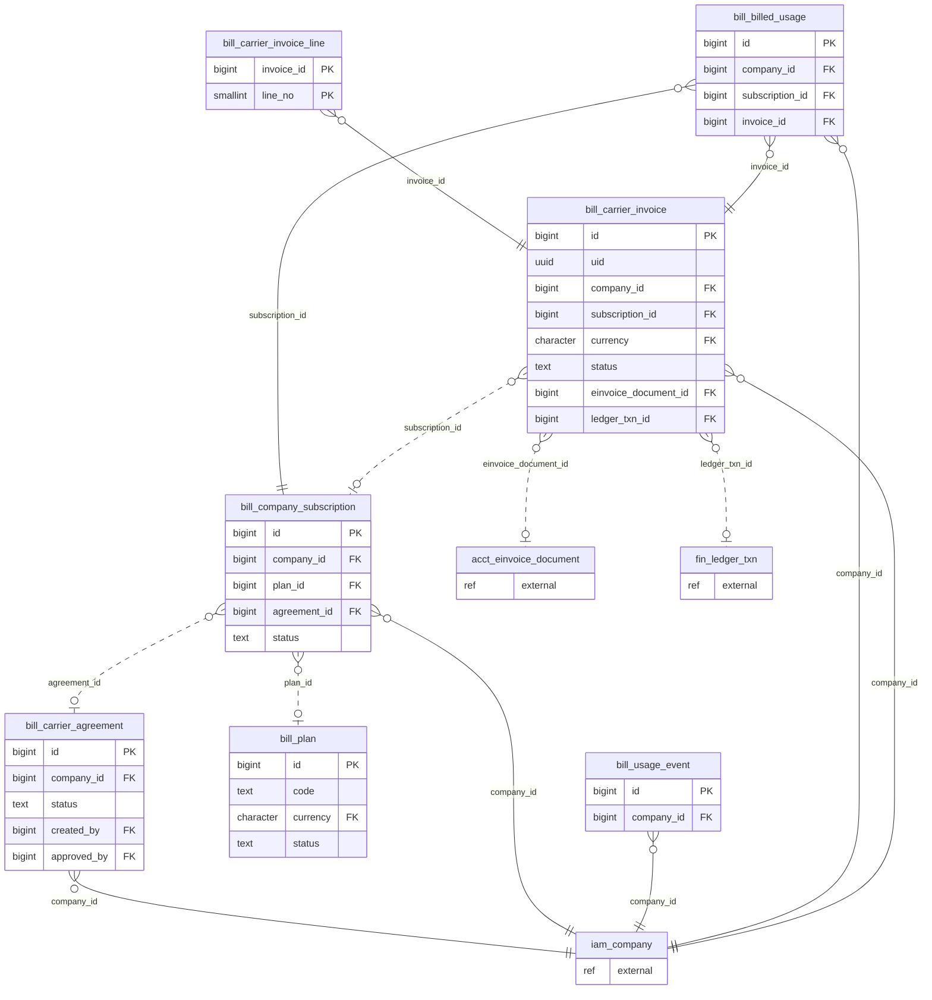

## `crm` — Complaints, ratings, notifications, the AI assistant and the contact center

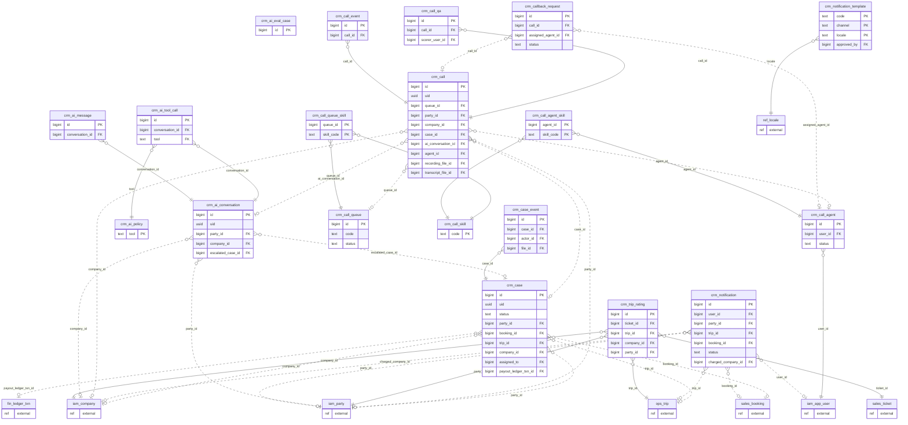

## `gov` — Governance, obligations and data protection

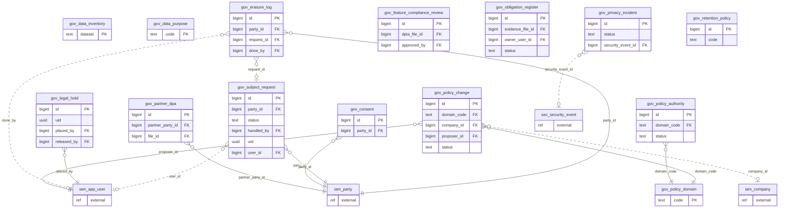

## `sec` — Security: IP rules, risk, signing, the security hub and government adapters

```mermaid
erDiagram
  sec_access_review {
    bigint id PK
    bigint user_id FK
    bigint role_id FK
    bigint reviewer_id FK
  }
  sec_authority_alert {
    bigint id PK
    bigint vehicle_id FK
    bigint trip_id FK
    bigint authority_id FK
    bigint evidence_file_id FK
  }
  sec_authority_data_request {
    bigint id PK
    bigint authority_id FK
    bigint requested_by FK
    bigint approved_by FK
    text status
  }
  sec_authority_order {
    bigint id PK
    bigint authority_id FK
    text status
    bigint executed_by FK
    bigint target_trip_id FK
    bigint target_user_id FK
    bigint target_party_id FK
    bigint target_ticket_id FK
    bigint target_wallet_id FK
    bigint target_booking_id FK
    bigint target_company_id FK
    bigint target_payment_id FK
    bigint target_vehicle_id FK
    bigint target_document_id FK
  }
  sec_authority_policy {
    bigint id PK
    bigint authority_id FK
  }
  sec_authority_profile {
    bigint id PK
    text code
  }
  sec_authority_scope {
    bigint id PK
    bigint authority_id FK
    bigint created_by FK
    bigint approved_by FK
  }
  sec_blocklist_entry {
    bigint id PK
    bigint added_by FK
  }
  sec_break_glass_log {
    bigint id PK
    bigint actor_id FK
    bigint approver_id FK
  }
  sec_document_signature {
    bigint id PK
    integer key_id FK
    bigint file_id FK
  }
  sec_fraud_case {
    bigint id PK
    text status
    bigint assigned_to FK
    bigint subject_user_id FK
    bigint subject_party_id FK
    bigint subject_device_id FK
    bigint subject_booking_id FK
    bigint subject_company_id FK
    bigint subject_payment_id FK
    bigint subject_api_client_id FK
    bigint subject_withdrawal_id FK
  }
  sec_gov_adapter_config {
    bigint id PK
    bigint authority_id FK
    text status
  }
  sec_ip_rule {
    bigint id PK
    bigint api_client_id FK
    bigint created_by FK
    bigint approved_by FK
    bigint revoked_by FK
  }
  sec_key_registry {
    integer id PK
    bigint company_id FK
    text status
  }
  sec_manifest_submission {
    bigint id PK
    bigint trip_id FK
    bigint authority_id FK
    bigint payload_file_id FK
    text status
    bigint created_by FK
  }
  sec_policy_decision {
    bigint id PK
    bigint user_id FK
    bigint company_id FK
    text purpose_code FK
  }
  sec_risk_assessment {
    bigint id PK
    bigint subject_user_id FK
    bigint subject_party_id FK
    bigint subject_booking_id FK
    bigint subject_payment_id FK
    bigint subject_api_client_id FK
    bigint subject_withdrawal_id FK
  }
  sec_screening_request {
    bigint id PK
    bigint authority_id FK
    text status
    bigint subject_host_id FK
    bigint subject_driver_id FK
    bigint subject_company_id FK
    bigint subject_vehicle_id FK
    bigint subject_passenger_id FK
    bigint context_trip_id FK
    bigint context_booking_id FK
  }
  sec_screening_result {
    bigint request_id PK
    bigint reviewed_by FK
  }
  sec_security_event {
    bigint id PK
    bigint ip_rule_id FK
  }
  sec_sos_event {
    bigint id PK
    bigint trip_id FK
    bigint triggered_by FK
    text status
    bigint incident_id FK
  }
  sec_tamper_event {
    bigint id PK
  }
  sec_verification_job {
    bigint id PK
    bigint adapter_id FK
    bigint verification_id FK
    text status
    bigint subject_party_id FK
    bigint subject_company_id FK
    bigint subject_license_id FK
    bigint subject_vehicle_id FK
    bigint subject_document_id FK
  }
  sec_watchlist_entry {
    bigint id PK
    bigint authority_id FK
    text status
    bigint created_by FK
  }
  fin_payment {
    ref external
  }
  fin_wallet {
    ref external
  }
  fin_withdrawal_request {
    ref external
  }
  fleet_license_record {
    ref external
  }
  fleet_vehicle {
    ref external
  }
  gov_data_purpose {
    ref external
  }
  iam_api_client {
    ref external
  }
  iam_app_user {
    ref external
  }
  iam_company {
    ref external
  }
  iam_device {
    ref external
  }
  iam_document {
    ref external
  }
  iam_party {
    ref external
  }
  iam_role {
    ref external
  }
  iam_verification {
    ref external
  }
  ops_incident {
    ref external
  }
  ops_trip {
    ref external
  }
  sales_booking {
    ref external
  }
  sales_ticket {
    ref external
  }
  sec_risk_assessment }o..o| fin_payment : "subject_payment_id"
  sec_fraud_case }o..o| fin_payment : "subject_payment_id"
  sec_authority_order }o..o| fin_payment : "target_payment_id"
  sec_authority_order }o..o| fin_wallet : "target_wallet_id"
  sec_risk_assessment }o..o| fin_withdrawal_request : "subject_withdrawal_id"
  sec_fraud_case }o..o| fin_withdrawal_request : "subject_withdrawal_id"
  sec_verification_job }o..o| fleet_license_record : "subject_license_id"
  sec_authority_alert }o..o| fleet_vehicle : "vehicle_id"
  sec_screening_request }o..o| fleet_vehicle : "subject_vehicle_id"
  sec_verification_job }o..o| fleet_vehicle : "subject_vehicle_id"
  sec_authority_order }o..o| fleet_vehicle : "target_vehicle_id"
  sec_policy_decision }o..o| gov_data_purpose : "purpose_code"
  sec_ip_rule }o..o| iam_api_client : "api_client_id"
  sec_risk_assessment }o..o| iam_api_client : "subject_api_client_id"
  sec_fraud_case }o..o| iam_api_client : "subject_api_client_id"
  sec_access_review }o--|| iam_app_user : "user_id"
  sec_sos_event }o..o| iam_app_user : "triggered_by"
  sec_policy_decision }o..o| iam_app_user : "user_id"
  sec_risk_assessment }o..o| iam_app_user : "subject_user_id"
  sec_fraud_case }o..o| iam_app_user : "subject_user_id"
  sec_authority_order }o..o| iam_app_user : "target_user_id"
  sec_key_registry }o..o| iam_company : "company_id"
  sec_policy_decision }o..o| iam_company : "company_id"
  sec_screening_request }o..o| iam_company : "subject_company_id"
  sec_verification_job }o..o| iam_company : "subject_company_id"
  sec_fraud_case }o..o| iam_company : "subject_company_id"
  sec_authority_order }o..o| iam_company : "target_company_id"
  sec_fraud_case }o..o| iam_device : "subject_device_id"
  sec_verification_job }o..o| iam_document : "subject_document_id"
  sec_authority_order }o..o| iam_document : "target_document_id"
  sec_risk_assessment }o..o| iam_party : "subject_party_id"
  sec_screening_request }o..o| iam_party : "subject_host_id"
  sec_fraud_case }o..o| iam_party : "subject_party_id"
  sec_screening_request }o..o| iam_party : "subject_driver_id"
  sec_verification_job }o..o| iam_party : "subject_party_id"
  sec_authority_order }o..o| iam_party : "target_party_id"
  sec_screening_request }o..o| iam_party : "subject_passenger_id"
  sec_access_review }o..o| iam_role : "role_id"
  sec_verification_job }o..o| iam_verification : "verification_id"
  sec_sos_event }o..o| ops_incident : "incident_id"
  sec_manifest_submission }o--|| ops_trip : "trip_id"
  sec_sos_event }o..o| ops_trip : "trip_id"
  sec_authority_alert }o..o| ops_trip : "trip_id"
  sec_authority_order }o..o| ops_trip : "target_trip_id"
  sec_screening_request }o..o| ops_trip : "context_trip_id"
  sec_risk_assessment }o..o| sales_booking : "subject_booking_id"
  sec_fraud_case }o..o| sales_booking : "subject_booking_id"
  sec_screening_request }o..o| sales_booking : "context_booking_id"
  sec_authority_order }o..o| sales_booking : "target_booking_id"
  sec_authority_order }o..o| sales_ticket : "target_ticket_id"
  sec_authority_policy }o--|| sec_authority_profile : "authority_id"
  sec_screening_request }o--|| sec_authority_profile : "authority_id"
  sec_watchlist_entry }o..o| sec_authority_profile : "authority_id"
  sec_authority_order }o--|| sec_authority_profile : "authority_id"
  sec_authority_data_request }o--|| sec_authority_profile : "authority_id"
  sec_gov_adapter_config }o--|| sec_authority_profile : "authority_id"
  sec_authority_scope }o--|| sec_authority_profile : "authority_id"
  sec_manifest_submission }o..o| sec_authority_profile : "authority_id"
  sec_authority_alert }o..o| sec_authority_profile : "authority_id"
  sec_verification_job }o--|| sec_gov_adapter_config : "adapter_id"
  sec_security_event }o..o| sec_ip_rule : "ip_rule_id"
  sec_screening_result }o--|| sec_screening_request : "request_id"
```

## `ptn` — Service partners: fuel stations, rest stops and maintenance

```mermaid
erDiagram
  ptn_fuel_anomaly {
    bigint id PK
    bigint session_id FK
    text status
    bigint resolved_by FK
  }
  ptn_fuel_card {
    bigint id PK
    uuid uid
    bigint company_id FK
    bigint vehicle_id FK
    bigint driver_party_id FK
    character currency FK
    text status
  }
  ptn_fuel_price {
    bigint id PK
    bigint partner_id FK
    character currency FK
  }
  ptn_fuel_session {
    bigint id PK
    bigint partner_id FK
    bigint station_employee_id FK
    bigint company_id FK
    bigint vehicle_id FK
    bigint driver_party_id FK
    bigint trip_id FK
    bigint fuel_card_id FK
    text status
  }
  ptn_odometer_reading {
    bigint id PK
    bigint vehicle_id FK
    bigint session_id FK
    bigint photo_file_id FK
  }
  ptn_partner {
    bigint id PK
    uuid uid
    bigint party_id FK
    bigint company_id FK
    text code
    bigint station_id FK
    text status
  }
  ptn_partner_contract {
    bigint id PK
    bigint partner_id FK
    character currency FK
    text status
    bigint created_by FK
    bigint approved_by FK
  }
  ptn_partner_menu_item {
    bigint id PK
    bigint partner_id FK
    character currency FK
  }
  ptn_partner_order {
    bigint id PK
    uuid uid
    bigint partner_id FK
    bigint user_id FK
    bigint trip_id FK
    character currency FK
    text status
  }
  ptn_partner_order_item {
    bigint order_id PK
    bigint menu_item_id PK
  }
  ptn_partner_sale {
    bigint id PK
    uuid uid
    bigint partner_id FK
    bigint session_id FK
    bigint order_id FK
    bigint company_id FK
    bigint user_id FK
    bigint vehicle_id FK
    bigint driver_party_id FK
    bigint trip_id FK
    character currency FK
    text status
    bigint ledger_txn_id FK
  }
  ptn_partner_settlement {
    bigint id PK
    bigint partner_id FK
    character currency FK
    bigint ledger_txn_id FK
    text status
  }
  ptn_rest_stop_rating {
    bigint id PK
    bigint partner_id FK
    bigint user_id FK
    bigint trip_id FK
  }
  ptn_station_employee {
    bigint id PK
    bigint partner_id FK
    bigint user_id FK
    text status
  }
  fin_ledger_txn {
    ref external
  }
  fleet_crew_profile {
    ref external
  }
  fleet_vehicle {
    ref external
  }
  iam_app_user {
    ref external
  }
  iam_company {
    ref external
  }
  iam_party {
    ref external
  }
  net_station {
    ref external
  }
  ops_trip {
    ref external
  }
  ptn_partner_settlement }o..o| fin_ledger_txn : "ledger_txn_id"
  ptn_partner_sale }o..o| fin_ledger_txn : "ledger_txn_id"
  ptn_fuel_card }o..o| fleet_crew_profile : "driver_party_id"
  ptn_fuel_session }o..o| fleet_crew_profile : "driver_party_id"
  ptn_odometer_reading }o--|| fleet_vehicle : "vehicle_id"
  ptn_fuel_card }o..o| fleet_vehicle : "vehicle_id"
  ptn_fuel_session }o--|| fleet_vehicle : "vehicle_id"
  ptn_partner_sale }o..o| fleet_vehicle : "vehicle_id"
  ptn_station_employee }o--|| iam_app_user : "user_id"
  ptn_rest_stop_rating }o--|| iam_app_user : "user_id"
  ptn_partner_order }o--|| iam_app_user : "user_id"
  ptn_partner_sale }o..o| iam_app_user : "user_id"
  ptn_fuel_card }o--|| iam_company : "company_id"
  ptn_partner }o..o| iam_company : "company_id"
  ptn_fuel_session }o--|| iam_company : "company_id"
  ptn_partner_sale }o..o| iam_company : "company_id"
  ptn_partner }o--|| iam_party : "party_id"
  ptn_partner_sale }o..o| iam_party : "driver_party_id"
  ptn_partner }o..o| net_station : "station_id"
  ptn_rest_stop_rating }o..o| ops_trip : "trip_id"
  ptn_partner_order }o..o| ops_trip : "trip_id"
  ptn_fuel_session }o..o| ops_trip : "trip_id"
  ptn_partner_sale }o..o| ops_trip : "trip_id"
  ptn_fuel_session }o..o| ptn_fuel_card : "fuel_card_id"
  ptn_fuel_anomaly }o--|| ptn_fuel_session : "session_id"
  ptn_odometer_reading }o..o| ptn_fuel_session : "session_id"
  ptn_partner_sale }o..o| ptn_fuel_session : "session_id"
  ptn_partner_contract }o--|| ptn_partner : "partner_id"
  ptn_station_employee }o--|| ptn_partner : "partner_id"
  ptn_fuel_price }o--|| ptn_partner : "partner_id"
  ptn_fuel_session }o--|| ptn_partner : "partner_id"
  ptn_partner_menu_item }o--|| ptn_partner : "partner_id"
  ptn_partner_settlement }o--|| ptn_partner : "partner_id"
  ptn_rest_stop_rating }o--|| ptn_partner : "partner_id"
  ptn_partner_order }o--|| ptn_partner : "partner_id"
  ptn_partner_sale }o--|| ptn_partner : "partner_id"
  ptn_partner_order_item }o--|| ptn_partner_menu_item : "menu_item_id"
  ptn_partner_order_item }o--|| ptn_partner_order : "order_id"
  ptn_partner_sale }o..o| ptn_partner_order : "order_id"
  ptn_fuel_session }o--|| ptn_station_employee : "station_employee_id"
```

## `ship` — Shipments and the integrated shipping network

```mermaid
erDiagram
  ship_access_point {
    bigint id PK
    bigint station_id FK
    bigint partner_party_id FK
    text status
  }
  ship_address {
    bigint id PK
    bigint party_id FK
    bigint geo_zone_id FK
  }
  ship_capacity_booking {
    bigint id PK
    bigint load_id FK
    bigint trip_id FK
    bigint route_id FK
    bigint seller_company_id FK
    bigint buyer_company_id FK
    character currency FK
    text status
  }
  ship_cargo_claim {
    bigint id PK
    bigint shipment_id FK
    character currency FK
    bigint liable_leg_id FK
    bigint case_id FK
    text status
  }
  ship_cargo_rate_card {
    bigint id PK
    bigint company_id FK
    bigint route_id FK
    bigint service_id FK
    character currency FK
  }
  ship_carrier_scorecard {
    bigint id PK
    bigint carrier_company_id FK
    bigint access_point_id FK
  }
  ship_cod_collection {
    bigint id PK
    bigint shipment_id FK
    character currency FK
    bigint collected_by FK
    bigint ledger_txn_id FK
    text status
  }
  ship_courier_assignment {
    bigint id PK
    bigint courier_route_id FK
    bigint shipment_id FK
    bigint pickup_request_id FK
    text status
  }
  ship_courier_route {
    bigint id PK
    bigint company_id FK
    bigint hub_id FK
    bigint courier_user_id FK
    bigint vehicle_id FK
    text status
  }
  ship_custody_transfer {
    bigint id PK
    bigint shipment_id FK
    bigint unit_id FK
    bigint from_party_id FK
    bigint to_party_id FK
    bigint signature_file_id FK
  }
  ship_delivery_attempt {
    bigint id PK
    bigint shipment_id FK
    bigint courier_user_id FK
  }
  ship_delivery_preference {
    bigint id PK
    bigint shipment_id FK
    bigint party_id FK
    bigint requested_by FK
    text status
  }
  ship_delivery_proof {
    bigint shipment_id PK
    bigint attempt_id FK
    bigint evidence_file_id FK
  }
  ship_fuel_surcharge_index {
    bigint id PK
  }
  ship_geo_zone {
    bigint id PK
    character country_code FK
    bigint city_id FK
    bigint servicing_hub_id FK
  }
  ship_guarantee_claim {
    bigint id PK
    bigint shipment_id FK
    bigint ledger_txn_id FK
    bigint chargeback_leg_id FK
    text status
  }
  ship_handling_unit {
    bigint id PK
    bigint company_id FK
    bigint parent_unit_id FK
    bigint current_station_id FK
    text status
  }
  ship_handling_unit_item {
    bigint id PK
    bigint unit_id FK
    bigint shipment_id FK
    bigint parcel_id FK
  }
  ship_hub {
    bigint id PK
    bigint station_id FK
    bigint company_id FK
    text status
  }
  ship_integration_message {
    bigint id PK
    bigint partner_id FK
    bigint shipment_id FK
    bigint payload_file_id FK
    text status
  }
  ship_integration_partner {
    bigint id PK
    bigint party_id FK
    bigint api_client_id FK
    text status
  }
  ship_linehaul_schedule {
    bigint id PK
    bigint origin_hub_id FK
    bigint dest_hub_id FK
    bigint carrier_company_id FK
    text status
  }
  ship_load {
    bigint id PK
    uuid uid
    bigint company_id FK
    bigint trip_id FK
    bigint vehicle_id FK
    bigint truck_combination_id FK
    bigint origin_hub_id FK
    bigint dest_hub_id FK
    text status
  }
  ship_load_plan {
    bigint load_id PK
    bigint handling_unit_id PK
  }
  ship_load_stop {
    bigint load_id PK
    smallint seq PK
    bigint station_id FK
  }
  ship_locker_compartment {
    bigint id PK
    bigint access_point_id FK
    text code
    bigint shipment_id FK
    text status
  }
  ship_parcel {
    bigint id PK
    bigint shipment_id FK
  }
  ship_partner_command {
    bigint id PK
    bigint partner_id FK
    bigint shipment_id FK
    bigint payload_file_id FK
    text status
  }
  ship_partner_contract {
    bigint id PK
    bigint partner_id FK
    character currency FK
    text status
  }
  ship_partner_pre_alert {
    bigint id PK
    bigint partner_id FK
    text status
  }
  ship_partner_reconciliation {
    bigint id PK
    bigint partner_id FK
    text status
  }
  ship_partner_settlement {
    bigint id PK
    bigint partner_id FK
    character currency FK
    bigint ledger_txn_id FK
    text status
  }
  ship_partner_status_map {
    bigint partner_id PK
    text direction PK
    text external_code PK
    text external_reason PK
    integer version PK
  }
  ship_pickup_request {
    bigint id PK
    bigint company_id FK
    bigint shipper_party_id FK
    bigint address_id FK
    bigint courier_route_id FK
    text status
  }
  ship_pricing_agreement {
    bigint id PK
    bigint company_id FK
    text status
    bigint account_id FK
  }
  ship_pricing_zone_chart {
    bigint origin_zone_id PK
    bigint dest_zone_id PK
    daterange valid PK
  }
  ship_prohibited_item {
    bigint id PK
    text code
    character country_code FK
  }
  ship_rate_table {
    bigint id PK
    bigint company_id FK
    bigint service_id FK
    character currency FK
    text status
  }
  ship_rate_table_entry {
    bigint rate_table_id PK
    text price_zone PK
    numeric weight_break PK
  }
  ship_return_authorization {
    bigint id PK
    bigint original_shipment_id FK
    bigint merchant_account_id FK
    bigint return_shipment_id FK
    text status
  }
  ship_routing_rule {
    bigint id PK
    bigint company_id FK
    bigint service_id FK
    bigint origin_zone_id FK
    bigint dest_zone_id FK
  }
  ship_service_option {
    bigint id PK
    text code
    bigint surcharge_id FK
  }
  ship_service_product {
    bigint id PK
    text code
    text status
  }
  ship_shipment {
    bigint id PK
    uuid uid
    bigint company_id FK
    bigint shipper_party_id FK
    bigint shipper_account_id FK
    bigint service_id FK
    bigint origin_station_id FK
    bigint dest_station_id FK
    bigint origin_address_id FK
    bigint dest_address_id FK
    bigint payer_account_id FK
    character currency FK
    text cargo_category FK
    text status
  }
  ship_shipment_leg {
    bigint id PK
    bigint shipment_id FK
    bigint carrier_company_id FK
    bigint trip_id FK
    bigint load_id FK
    bigint courier_route_id FK
    bigint from_station_id FK
    bigint to_station_id FK
    character currency FK
    text status
    bigint contract_id FK
  }
  ship_shipment_option {
    bigint shipment_id PK
    bigint option_id PK
  }
  ship_shipment_party {
    bigint shipment_id PK
    text role PK
    bigint party_id FK
    integer enc_key_id FK
    bigint address_id FK
  }
  ship_shipment_reference {
    bigint id PK
    bigint shipment_id FK
    bigint parcel_id FK
    bigint issuer_party_id FK
  }
  ship_shipper_account {
    bigint id PK
    bigint party_id FK
    bigint company_id FK
    bigint wallet_id FK
    bigint pricing_agreement_id FK
    text status
  }
  ship_sort_window {
    bigint id PK
    bigint hub_id FK
  }
  ship_surcharge_definition {
    bigint id PK
    text code
    character currency FK
  }
  ship_tracking_event {
    bigint id PK
    bigint shipment_id FK
    bigint unit_id FK
    bigint load_id FK
    bigint leg_id FK
    bigint station_id FK
    bigint actor_user_id FK
    bigint device_id FK
  }
  ship_transit_time_matrix {
    bigint origin_zone_id PK
    bigint dest_zone_id PK
    bigint service_id PK
  }
  ship_trip_cargo_capacity {
    bigint trip_id PK
  }
  ship_weight_audit {
    bigint id PK
    bigint parcel_id FK
    bigint photo_file_id FK
    bigint device_id FK
  }
  crm_case {
    ref external
  }
  fin_ledger_txn {
    ref external
  }
  fin_wallet {
    ref external
  }
  fleet_truck_combination {
    ref external
  }
  fleet_vehicle {
    ref external
  }
  frt_freight_contract {
    ref external
  }
  iam_api_client {
    ref external
  }
  iam_app_user {
    ref external
  }
  iam_company {
    ref external
  }
  iam_device {
    ref external
  }
  iam_party {
    ref external
  }
  net_route {
    ref external
  }
  net_station {
    ref external
  }
  ops_trip {
    ref external
  }
  ref_cargo_category {
    ref external
  }
  ref_city {
    ref external
  }
  ship_cargo_claim }o..o| crm_case : "case_id"
  ship_cod_collection }o..o| fin_ledger_txn : "ledger_txn_id"
  ship_guarantee_claim }o..o| fin_ledger_txn : "ledger_txn_id"
  ship_partner_settlement }o..o| fin_ledger_txn : "ledger_txn_id"
  ship_shipper_account }o..o| fin_wallet : "wallet_id"
  ship_load }o..o| fleet_truck_combination : "truck_combination_id"
  ship_load }o..o| fleet_vehicle : "vehicle_id"
  ship_courier_route }o..o| fleet_vehicle : "vehicle_id"
  ship_shipment_leg }o..o| frt_freight_contract : "contract_id"
  ship_integration_partner }o..o| iam_api_client : "api_client_id"
  ship_courier_route }o--|| iam_app_user : "courier_user_id"
  ship_delivery_attempt }o..o| iam_app_user : "courier_user_id"
  ship_cod_collection }o..o| iam_app_user : "collected_by"
  ship_rate_table }o..o| iam_company : "company_id"
  ship_cargo_rate_card }o--|| iam_company : "company_id"
  ship_pricing_agreement }o..o| iam_company : "company_id"
  ship_handling_unit }o--|| iam_company : "company_id"
  ship_courier_route }o--|| iam_company : "company_id"
  ship_pickup_request }o--|| iam_company : "company_id"
  ship_routing_rule }o..o| iam_company : "company_id"
  ship_carrier_scorecard }o..o| iam_company : "carrier_company_id"
  ship_hub }o..o| iam_company : "company_id"
  ship_load }o--|| iam_company : "company_id"
  ship_shipper_account }o..o| iam_company : "company_id"
  ship_shipment }o--|| iam_company : "company_id"
  ship_shipment_leg }o--|| iam_company : "carrier_company_id"
  ship_capacity_booking }o--|| iam_company : "seller_company_id"
  ship_capacity_booking }o--|| iam_company : "buyer_company_id"
  ship_linehaul_schedule }o--|| iam_company : "carrier_company_id"
  ship_weight_audit }o..o| iam_device : "device_id"
  ship_tracking_event }o..o| iam_device : "device_id"
  ship_address }o..o| iam_party : "party_id"
  ship_integration_partner }o--|| iam_party : "party_id"
  ship_shipper_account }o--|| iam_party : "party_id"
  ship_access_point }o..o| iam_party : "partner_party_id"
  ship_shipment_party }o..o| iam_party : "party_id"
  ship_pickup_request }o--|| iam_party : "shipper_party_id"
  ship_delivery_preference }o..o| iam_party : "party_id"
  ship_custody_transfer }o--|| iam_party : "from_party_id"
  ship_custody_transfer }o--|| iam_party : "to_party_id"
  ship_shipment_reference }o--|| iam_party : "issuer_party_id"
  ship_shipment }o--|| iam_party : "shipper_party_id"
  ship_cargo_rate_card }o..o| net_route : "route_id"
  ship_capacity_booking }o..o| net_route : "route_id"
  ship_hub }o--|| net_station : "station_id"
  ship_access_point }o--|| net_station : "station_id"
  ship_load_stop }o--|| net_station : "station_id"
  ship_handling_unit }o..o| net_station : "current_station_id"
  ship_tracking_event }o..o| net_station : "station_id"
  ship_shipment_leg }o..o| net_station : "from_station_id"
  ship_shipment_leg }o..o| net_station : "to_station_id"
  ship_shipment }o..o| net_station : "origin_station_id"
  ship_shipment }o..o| net_station : "dest_station_id"
  ship_trip_cargo_capacity }o--|| ops_trip : "trip_id"
  ship_capacity_booking }o..o| ops_trip : "trip_id"
  ship_load }o..o| ops_trip : "trip_id"
  ship_shipment_leg }o..o| ops_trip : "trip_id"
  ship_shipment }o..o| ref_cargo_category : "cargo_category"
  ship_geo_zone }o..o| ref_city : "city_id"
  ship_locker_compartment }o--|| ship_access_point : "access_point_id"
  ship_carrier_scorecard }o..o| ship_access_point : "access_point_id"
  ship_pickup_request }o--|| ship_address : "address_id"
  ship_shipment_party }o..o| ship_address : "address_id"
  ship_shipment }o..o| ship_address : "origin_address_id"
  ship_shipment }o..o| ship_address : "dest_address_id"
  ship_courier_assignment }o--|| ship_courier_route : "courier_route_id"
  ship_pickup_request }o..o| ship_courier_route : "courier_route_id"
  ship_shipment_leg }o..o| ship_courier_route : "courier_route_id"
  ship_delivery_proof }o..o| ship_delivery_attempt : "attempt_id"
  ship_pricing_zone_chart }o--|| ship_geo_zone : "origin_zone_id"
  ship_transit_time_matrix }o--|| ship_geo_zone : "origin_zone_id"
  ship_pricing_zone_chart }o--|| ship_geo_zone : "dest_zone_id"
  ship_transit_time_matrix }o--|| ship_geo_zone : "dest_zone_id"
  ship_address }o..o| ship_geo_zone : "geo_zone_id"
  ship_routing_rule }o..o| ship_geo_zone : "origin_zone_id"
  ship_routing_rule }o..o| ship_geo_zone : "dest_zone_id"
  ship_handling_unit_item }o--|| ship_handling_unit : "unit_id"
  ship_load_plan }o--|| ship_handling_unit : "handling_unit_id"
  ship_tracking_event }o..o| ship_handling_unit : "unit_id"
  ship_custody_transfer }o..o| ship_handling_unit : "unit_id"
  ship_handling_unit }o..o| ship_handling_unit : "parent_unit_id"
  ship_linehaul_schedule }o--|| ship_hub : "origin_hub_id"
  ship_sort_window }o--|| ship_hub : "hub_id"
  ship_courier_route }o..o| ship_hub : "hub_id"
  ship_linehaul_schedule }o--|| ship_hub : "dest_hub_id"
  ship_geo_zone }o..o| ship_hub : "servicing_hub_id"
  ship_load }o..o| ship_hub : "origin_hub_id"
  ship_load }o..o| ship_hub : "dest_hub_id"
  ship_partner_status_map }o--|| ship_integration_partner : "partner_id"
  ship_partner_contract }o--|| ship_integration_partner : "partner_id"
  ship_partner_pre_alert }o--|| ship_integration_partner : "partner_id"
  ship_partner_command }o--|| ship_integration_partner : "partner_id"
  ship_integration_message }o--|| ship_integration_partner : "partner_id"
  ship_partner_reconciliation }o--|| ship_integration_partner : "partner_id"
  ship_partner_settlement }o--|| ship_integration_partner : "partner_id"
  ship_load_stop }o--|| ship_load : "load_id"
  ship_load_plan }o--|| ship_load : "load_id"
  ship_capacity_booking }o..o| ship_load : "load_id"
  ship_tracking_event }o..o| ship_load : "load_id"
  ship_shipment_leg }o..o| ship_load : "load_id"
  ship_weight_audit }o--|| ship_parcel : "parcel_id"
  ship_shipment_reference }o..o| ship_parcel : "parcel_id"
  ship_handling_unit_item }o..o| ship_parcel : "parcel_id"
  ship_courier_assignment }o..o| ship_pickup_request : "pickup_request_id"
  ship_shipper_account }o..o| ship_pricing_agreement : "pricing_agreement_id"
  ship_rate_table_entry }o--|| ship_rate_table : "rate_table_id"
  ship_shipment_option }o--|| ship_service_option : "option_id"
  ship_transit_time_matrix }o--|| ship_service_product : "service_id"
  ship_rate_table }o--|| ship_service_product : "service_id"
  ship_routing_rule }o--|| ship_service_product : "service_id"
  ship_cargo_rate_card }o..o| ship_service_product : "service_id"
  ship_shipment }o--|| ship_service_product : "service_id"
  ship_shipment_party }o--|| ship_shipment : "shipment_id"
  ship_shipment_option }o--|| ship_shipment : "shipment_id"
  ship_delivery_proof }o--|| ship_shipment : "shipment_id"
  ship_parcel }o--|| ship_shipment : "shipment_id"
  ship_shipment_leg }o..o| ship_shipment : "shipment_id"
  ship_tracking_event }o..o| ship_shipment : "shipment_id"
  ship_custody_transfer }o..o| ship_shipment : "shipment_id"
  ship_delivery_attempt }o--|| ship_shipment : "shipment_id"
  ship_delivery_preference }o..o| ship_shipment : "shipment_id"
  ship_cod_collection }o--|| ship_shipment : "shipment_id"
  ship_guarantee_claim }o--|| ship_shipment : "shipment_id"
  ship_return_authorization }o--|| ship_shipment : "original_shipment_id"
  ship_cargo_claim }o--|| ship_shipment : "shipment_id"
  ship_shipment_reference }o--|| ship_shipment : "shipment_id"
  ship_handling_unit_item }o..o| ship_shipment : "shipment_id"
  ship_partner_command }o--|| ship_shipment : "shipment_id"
  ship_courier_assignment }o..o| ship_shipment : "shipment_id"
  ship_locker_compartment }o..o| ship_shipment : "shipment_id"
  ship_return_authorization }o..o| ship_shipment : "return_shipment_id"
  ship_integration_message }o..o| ship_shipment : "shipment_id"
  ship_tracking_event }o..o| ship_shipment_leg : "leg_id"
  ship_cargo_claim }o..o| ship_shipment_leg : "liable_leg_id"
  ship_guarantee_claim }o..o| ship_shipment_leg : "chargeback_leg_id"
  ship_return_authorization }o..o| ship_shipper_account : "merchant_account_id"
  ship_shipment }o..o| ship_shipper_account : "shipper_account_id"
  ship_pricing_agreement }o..o| ship_shipper_account : "account_id"
  ship_shipment }o..o| ship_shipper_account : "payer_account_id"
  ship_service_option }o..o| ship_surcharge_definition : "surcharge_id"
```

## `frt` — Trucking, heavy transport and transit freight

```mermaid
erDiagram
  frt_container {
    bigint id PK
    bigint owner_party_id FK
    text status
  }
  frt_detention_claim {
    bigint id PK
    bigint contract_id FK
    bigint leg_id FK
    bigint station_id FK
    character currency FK
    text status
  }
  frt_escort_assignment {
    bigint id PK
    bigint leg_id FK
    bigint escort_party_id FK
    text status
  }
  frt_freight_bid {
    bigint id PK
    bigint request_id FK
    bigint carrier_company_id FK
    bigint truck_vehicle_id FK
    character currency FK
    text status
  }
  frt_freight_claim {
    bigint id PK
    bigint contract_id FK
    bigint leg_id FK
    character currency FK
    bigint case_id FK
    text status
  }
  frt_freight_contract {
    bigint id PK
    uuid uid
    bigint request_id FK
    bigint carrier_company_id FK
    bigint accepted_bid_id FK
    character currency FK
    text status
  }
  frt_freight_document {
    bigint id PK
    bigint contract_id FK
    bigint leg_id FK
    bigint file_id FK
    text status
    bigint verified_by FK
  }
  frt_freight_request {
    bigint id PK
    uuid uid
    bigint shipper_party_id FK
    bigint shipper_company_id FK
    bigint origin_station_id FK
    bigint origin_address_id FK
    bigint dest_station_id FK
    bigint dest_address_id FK
    text cargo_category FK
    character currency FK
    text status
  }
  frt_gate_event {
    bigint id PK
    bigint appointment_id FK
    bigint port_station_id FK
    bigint truck_vehicle_id FK
  }
  frt_handover_event {
    bigint id PK
    bigint leg_id FK
    bigint next_leg_id FK
    bigint from_company_id FK
    bigint to_company_id FK
    bigint station_id FK
    bigint from_signature_file_id FK
    bigint to_signature_file_id FK
  }
  frt_leg_container {
    bigint leg_id PK
    bigint container_id PK
  }
  frt_port_appointment {
    bigint id PK
    bigint port_station_id FK
    bigint truck_vehicle_id FK
    bigint leg_id FK
    text status
  }
  frt_transit_declaration {
    bigint id PK
    bigint leg_id FK
    bigint entry_station_id FK
    bigint exit_station_id FK
    bigint corridor_id FK
    text cargo_category FK
    text status
  }
  frt_weighbridge_reading {
    bigint id PK
    bigint leg_id FK
    bigint station_id FK
    bigint vehicle_id FK
  }
  crm_case {
    ref external
  }
  fleet_truck_unit {
    ref external
  }
  fleet_vehicle {
    ref external
  }
  iam_company {
    ref external
  }
  iam_party {
    ref external
  }
  net_corridor {
    ref external
  }
  net_station {
    ref external
  }
  ref_cargo_category {
    ref external
  }
  ship_address {
    ref external
  }
  ship_shipment_leg {
    ref external
  }
  frt_freight_claim }o..o| crm_case : "case_id"
  frt_port_appointment }o--|| fleet_truck_unit : "truck_vehicle_id"
  frt_freight_bid }o..o| fleet_truck_unit : "truck_vehicle_id"
  frt_gate_event }o--|| fleet_truck_unit : "truck_vehicle_id"
  frt_weighbridge_reading }o--|| fleet_vehicle : "vehicle_id"
  frt_leg_container }o--|| frt_container : "container_id"
  frt_freight_contract }o..o| frt_freight_bid : "accepted_bid_id"
  frt_freight_document }o..o| frt_freight_contract : "contract_id"
  frt_detention_claim }o--|| frt_freight_contract : "contract_id"
  frt_freight_claim }o--|| frt_freight_contract : "contract_id"
  frt_freight_bid }o--|| frt_freight_request : "request_id"
  frt_freight_contract }o--|| frt_freight_request : "request_id"
  frt_gate_event }o..o| frt_port_appointment : "appointment_id"
  frt_freight_bid }o--|| iam_company : "carrier_company_id"
  frt_freight_request }o..o| iam_company : "shipper_company_id"
  frt_freight_contract }o--|| iam_company : "carrier_company_id"
  frt_handover_event }o--|| iam_company : "from_company_id"
  frt_handover_event }o--|| iam_company : "to_company_id"
  frt_freight_request }o--|| iam_party : "shipper_party_id"
  frt_escort_assignment }o--|| iam_party : "escort_party_id"
  frt_container }o..o| iam_party : "owner_party_id"
  frt_transit_declaration }o..o| net_corridor : "corridor_id"
  frt_port_appointment }o--|| net_station : "port_station_id"
  frt_gate_event }o--|| net_station : "port_station_id"
  frt_weighbridge_reading }o--|| net_station : "station_id"
  frt_transit_declaration }o--|| net_station : "entry_station_id"
  frt_detention_claim }o..o| net_station : "station_id"
  frt_freight_request }o..o| net_station : "origin_station_id"
  frt_transit_declaration }o--|| net_station : "exit_station_id"
  frt_handover_event }o..o| net_station : "station_id"
  frt_freight_request }o..o| net_station : "dest_station_id"
  frt_transit_declaration }o--|| ref_cargo_category : "cargo_category"
  frt_freight_request }o--|| ref_cargo_category : "cargo_category"
  frt_freight_request }o..o| ship_address : "origin_address_id"
  frt_freight_request }o..o| ship_address : "dest_address_id"
  frt_leg_container }o--|| ship_shipment_leg : "leg_id"
  frt_handover_event }o--|| ship_shipment_leg : "leg_id"
  frt_transit_declaration }o--|| ship_shipment_leg : "leg_id"
  frt_escort_assignment }o--|| ship_shipment_leg : "leg_id"
  frt_weighbridge_reading }o..o| ship_shipment_leg : "leg_id"
  frt_handover_event }o..o| ship_shipment_leg : "next_leg_id"
  frt_freight_document }o..o| ship_shipment_leg : "leg_id"
  frt_detention_claim }o..o| ship_shipment_leg : "leg_id"
  frt_freight_claim }o..o| ship_shipment_leg : "leg_id"
  frt_port_appointment }o..o| ship_shipment_leg : "leg_id"
```

## `brd` — Border manifest gateway

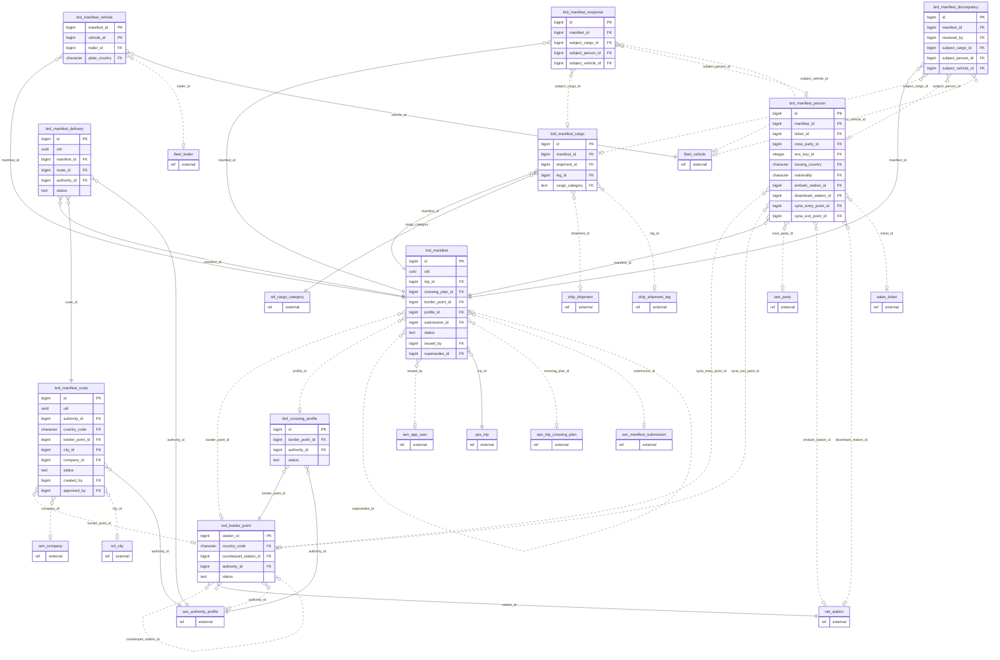

## `ctr` — Contracted transport: universities and employees

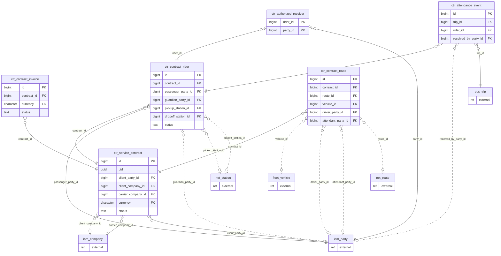

## `sch` — School transport: schools, operators, pupils and guardians, contracts, routes, runs and attendance

```mermaid
erDiagram
  sch_absence_notice {
    bigint enrollment_id PK
    date absent_on PK
    text direction PK
    bigint reported_by_party_id FK
  }
  sch_attendance {
    bigint id PK
    bigint run_id FK
    bigint enrollment_id FK
    bigint received_by_party_id FK
    bigint recorded_by FK
  }
  sch_contract {
    bigint id PK
    uuid uid
    bigint operator_id FK
    bigint company_id FK
    bigint school_id FK
    bigint guardian_party_id FK
    character currency FK
    text status
  }
  sch_enrollment {
    bigint id PK
    bigint contract_id FK
    bigint student_id FK
    bigint to_route_id FK
    bigint from_route_id FK
    bigint consent_by_party_id FK
    text status
  }
  sch_operator {
    bigint id PK
    bigint company_id FK
    bigint school_id FK
    bigint license_record_id FK
    text status
    bigint approved_by FK
  }
  sch_route {
    bigint id PK
    bigint company_id FK
    bigint operator_id FK
    bigint school_id FK
    text code
    bigint vehicle_id FK
    bigint driver_party_id FK
    bigint attendant_party_id FK
    text status
  }
  sch_route_stop {
    bigint route_id PK
    smallint seq PK
    bigint station_id FK
  }
  sch_run {
    bigint id PK
    bigint route_id FK
    bigint trip_id FK
    text status
    bigint sweep_checked_by FK
  }
  sch_school {
    bigint id PK
    uuid uid
    bigint company_id FK
    bigint city_id FK
    bigint station_id FK
    text status
  }
  sch_student {
    bigint id PK
    uuid uid
    bigint school_id FK
    bigint party_id FK
    bigint family_member_id FK
    integer enc_key_id FK
    bigint photo_document_id FK
    text status
  }
  sch_student_guardian {
    bigint student_id PK
    bigint party_id PK
    bigint verified_by FK
  }
  fleet_crew_profile {
    ref external
  }
  fleet_license_record {
    ref external
  }
  fleet_vehicle {
    ref external
  }
  iam_company {
    ref external
  }
  iam_document {
    ref external
  }
  iam_family_member {
    ref external
  }
  iam_party {
    ref external
  }
  net_station {
    ref external
  }
  ops_trip {
    ref external
  }
  ref_city {
    ref external
  }
  sch_route }o..o| fleet_crew_profile : "driver_party_id"
  sch_route }o..o| fleet_crew_profile : "attendant_party_id"
  sch_operator }o..o| fleet_license_record : "license_record_id"
  sch_route }o..o| fleet_vehicle : "vehicle_id"
  sch_operator }o--|| iam_company : "company_id"
  sch_route }o--|| iam_company : "company_id"
  sch_school }o--|| iam_company : "company_id"
  sch_contract }o--|| iam_company : "company_id"
  sch_student }o..o| iam_document : "photo_document_id"
  sch_student }o..o| iam_family_member : "family_member_id"
  sch_student_guardian }o--|| iam_party : "party_id"
  sch_student }o--|| iam_party : "party_id"
  sch_absence_notice }o--|| iam_party : "reported_by_party_id"
  sch_attendance }o..o| iam_party : "received_by_party_id"
  sch_contract }o..o| iam_party : "guardian_party_id"
  sch_run }o..o| iam_party : "sweep_checked_by"
  sch_enrollment }o..o| iam_party : "consent_by_party_id"
  sch_route_stop }o..o| net_station : "station_id"
  sch_school }o..o| net_station : "station_id"
  sch_run }o..o| ops_trip : "trip_id"
  sch_school }o--|| ref_city : "city_id"
  sch_enrollment }o--|| sch_contract : "contract_id"
  sch_absence_notice }o--|| sch_enrollment : "enrollment_id"
  sch_attendance }o--|| sch_enrollment : "enrollment_id"
  sch_contract }o--|| sch_operator : "operator_id"
  sch_route }o--|| sch_operator : "operator_id"
  sch_route_stop }o--|| sch_route : "route_id"
  sch_run }o--|| sch_route : "route_id"
  sch_enrollment }o..o| sch_route : "to_route_id"
  sch_enrollment }o..o| sch_route : "from_route_id"
  sch_enrollment }o..o| sch_route_stop : "to_route_id,to_stop_seq"
  sch_enrollment }o..o| sch_route_stop : "from_route_id,from_stop_seq"
  sch_attendance }o--|| sch_run : "run_id"
  sch_student }o--|| sch_school : "school_id"
  sch_operator }o..o| sch_school : "school_id"
  sch_route }o--|| sch_school : "school_id"
  sch_contract }o--|| sch_school : "school_id"
  sch_student_guardian }o--|| sch_student : "student_id"
  sch_enrollment }o--|| sch_student : "student_id"
```

## `gis` — PostGIS reference data

```mermaid
erDiagram
  gis_spatial_ref_sys {
    integer srid PK
  }
```

## `rail` — Rail extension

```mermaid
erDiagram
  rail_coach_layout {
    bigint id PK
    bigint company_id FK
    text code
    bigint seat_layout_id FK
    bigint fare_class_id FK
    text status
  }
  rail_fare_class {
    bigint id PK
    bigint company_id FK
    text code
    text status
  }
  rail_journey {
    bigint id PK
    uuid uid
    bigint party_id FK
    bigint origin_station_id FK
    bigint dest_station_id FK
    text status
  }
  rail_journey_leg {
    bigint journey_id PK
    smallint seq PK
    bigint ticket_id FK
    bigint trip_id FK
  }
  rail_train_composition {
    bigint trip_id PK
    smallint position PK
    bigint coach_layout_id FK
  }
  fleet_seat_layout {
    ref external
  }
  iam_company {
    ref external
  }
  iam_party {
    ref external
  }
  net_station {
    ref external
  }
  ops_trip {
    ref external
  }
  sales_ticket {
    ref external
  }
  rail_coach_layout }o..o| fleet_seat_layout : "seat_layout_id"
  rail_fare_class }o--|| iam_company : "company_id"
  rail_coach_layout }o--|| iam_company : "company_id"
  rail_journey }o--|| iam_party : "party_id"
  rail_journey }o--|| net_station : "origin_station_id"
  rail_journey }o--|| net_station : "dest_station_id"
  rail_train_composition }o--|| ops_trip : "trip_id"
  rail_journey_leg }o--|| ops_trip : "trip_id"
  rail_train_composition }o--|| rail_coach_layout : "coach_layout_id"
  rail_coach_layout }o..o| rail_fare_class : "fare_class_id"
  rail_journey_leg }o--|| rail_journey : "journey_id"
  rail_journey_leg }o--|| sales_ticket : "ticket_id"
```

## `taxi` — Taxis

```mermaid
erDiagram
  taxi_dispatch_offer {
    bigint id PK
    bigint request_id FK
    bigint shift_id FK
  }
  taxi_meter_tariff {
    bigint id PK
    bigint city_id FK
    character currency FK
    text status
    bigint approved_by FK
  }
  taxi_ride {
    bigint id PK
    uuid uid
    bigint request_id FK
    bigint shift_id FK
    bigint rider_user_id FK
    bigint trip_id FK
    bigint tariff_id FK
    character currency FK
    bigint ledger_txn_id FK
    text status
  }
  taxi_ride_request {
    bigint id PK
    uuid uid
    bigint rider_user_id FK
    bigint city_id FK
    character currency FK
    text status
  }
  taxi_taxi_office {
    bigint id PK
    bigint company_id FK
    bigint city_id FK
    text status
  }
  taxi_taxi_permit {
    bigint id PK
    bigint vehicle_id FK
    bigint company_id FK
    bigint office_id FK
    bigint city_id FK
    text status
  }
  taxi_taxi_shift {
    bigint id PK
    bigint permit_id FK
    bigint vehicle_id FK
    bigint driver_party_id FK
    text status
  }
  fin_ledger_txn {
    ref external
  }
  fleet_crew_profile {
    ref external
  }
  fleet_vehicle {
    ref external
  }
  iam_app_user {
    ref external
  }
  iam_company {
    ref external
  }
  ops_trip {
    ref external
  }
  ref_city {
    ref external
  }
  taxi_ride }o..o| fin_ledger_txn : "ledger_txn_id"
  taxi_taxi_shift }o--|| fleet_crew_profile : "driver_party_id"
  taxi_taxi_permit }o--|| fleet_vehicle : "vehicle_id"
  taxi_taxi_shift }o--|| fleet_vehicle : "vehicle_id"
  taxi_ride_request }o--|| iam_app_user : "rider_user_id"
  taxi_ride }o..o| iam_app_user : "rider_user_id"
  taxi_taxi_office }o--|| iam_company : "company_id"
  taxi_taxi_permit }o--|| iam_company : "company_id"
  taxi_ride }o..o| ops_trip : "trip_id"
  taxi_meter_tariff }o--|| ref_city : "city_id"
  taxi_taxi_office }o--|| ref_city : "city_id"
  taxi_ride_request }o--|| ref_city : "city_id"
  taxi_taxi_permit }o--|| ref_city : "city_id"
  taxi_ride }o..o| taxi_meter_tariff : "tariff_id"
  taxi_dispatch_offer }o--|| taxi_ride_request : "request_id"
  taxi_ride }o..o| taxi_ride_request : "request_id"
  taxi_taxi_permit }o..o| taxi_taxi_office : "office_id"
  taxi_taxi_shift }o--|| taxi_taxi_permit : "permit_id"
  taxi_dispatch_offer }o--|| taxi_taxi_shift : "shift_id"
  taxi_ride }o--|| taxi_taxi_shift : "shift_id"
```

## `rent` — Car rental

```mermaid
erDiagram
  rent_contract_driver {
    bigint contract_id PK
    bigint party_id PK
  }
  rent_deposit_hold {
    bigint id PK
    bigint contract_id FK
    character currency FK
    bigint wallet_id FK
    bigint case_id FK
    text status
  }
  rent_rental_addon {
    bigint id PK
    bigint company_id FK
    text code
    character currency FK
  }
  rent_rental_booking {
    bigint id PK
    uuid uid
    bigint company_id FK
    bigint renter_party_id FK
    text rental_class FK
    bigint vehicle_id FK
    bigint rate_id FK
    bigint pickup_branch_id FK
    bigint return_branch_id FK
    character currency FK
    text status
  }
  rent_rental_booking_addon {
    bigint booking_id PK
    bigint addon_id PK
  }
  rent_rental_branch {
    bigint id PK
    bigint company_id FK
    bigint station_id FK
    text status
  }
  rent_rental_company {
    bigint company_id PK
    text status
  }
  rent_rental_contract {
    bigint id PK
    bigint booking_id FK
    bigint vehicle_id FK
    bigint signature_file_id FK
    text status
  }
  rent_rental_fleet {
    bigint vehicle_id PK
    bigint company_id FK
    text rental_class FK
    bigint home_branch_id FK
    text status
  }
  rent_rental_inspection {
    bigint id PK
    bigint contract_id FK
    bigint inspector_user_id FK
  }
  rent_rental_rate {
    bigint id PK
    bigint company_id FK
    text rental_class FK
    bigint branch_id FK
    character currency FK
    text status
  }
  rent_rental_vehicle_class {
    text code PK
  }
  rent_renter_rule {
    bigint id PK
    text rental_class FK
    text status
    bigint approved_by FK
  }
  rent_telematics_device {
    bigint id PK
    bigint company_id FK
    bigint vehicle_id FK
    text status
  }
  rent_vehicle_trip_log {
    bigint id PK
    bigint device_id FK
    bigint vehicle_id FK
    bigint contract_id FK
  }
  crm_case {
    ref external
  }
  fin_wallet {
    ref external
  }
  fleet_vehicle {
    ref external
  }
  iam_company {
    ref external
  }
  iam_party {
    ref external
  }
  net_station {
    ref external
  }
  rent_deposit_hold }o..o| crm_case : "case_id"
  rent_deposit_hold }o..o| fin_wallet : "wallet_id"
  rent_rental_fleet }o--|| fleet_vehicle : "vehicle_id"
  rent_telematics_device }o..o| fleet_vehicle : "vehicle_id"
  rent_vehicle_trip_log }o--|| fleet_vehicle : "vehicle_id"
  rent_rental_company }o--|| iam_company : "company_id"
  rent_contract_driver }o--|| iam_party : "party_id"
  rent_rental_booking }o--|| iam_party : "renter_party_id"
  rent_rental_branch }o--|| net_station : "station_id"
  rent_rental_booking_addon }o--|| rent_rental_addon : "addon_id"
  rent_rental_booking_addon }o--|| rent_rental_booking : "booking_id"
  rent_rental_contract }o--|| rent_rental_booking : "booking_id"
  rent_rental_fleet }o..o| rent_rental_branch : "home_branch_id"
  rent_rental_rate }o..o| rent_rental_branch : "branch_id"
  rent_rental_booking }o--|| rent_rental_branch : "pickup_branch_id"
  rent_rental_booking }o--|| rent_rental_branch : "return_branch_id"
  rent_rental_branch }o--|| rent_rental_company : "company_id"
  rent_rental_fleet }o--|| rent_rental_company : "company_id"
  rent_rental_rate }o--|| rent_rental_company : "company_id"
  rent_rental_addon }o--|| rent_rental_company : "company_id"
  rent_telematics_device }o--|| rent_rental_company : "company_id"
  rent_rental_booking }o--|| rent_rental_company : "company_id"
  rent_contract_driver }o--|| rent_rental_contract : "contract_id"
  rent_rental_inspection }o--|| rent_rental_contract : "contract_id"
  rent_deposit_hold }o--|| rent_rental_contract : "contract_id"
  rent_vehicle_trip_log }o..o| rent_rental_contract : "contract_id"
  rent_rental_contract }o--|| rent_rental_fleet : "vehicle_id"
  rent_rental_booking }o..o| rent_rental_fleet : "vehicle_id"
  rent_rental_booking }o..o| rent_rental_rate : "rate_id"
  rent_rental_fleet }o--|| rent_rental_vehicle_class : "rental_class"
  rent_rental_rate }o--|| rent_rental_vehicle_class : "rental_class"
  rent_renter_rule }o..o| rent_rental_vehicle_class : "rental_class"
  rent_rental_booking }o--|| rent_rental_vehicle_class : "rental_class"
  rent_vehicle_trip_log }o--|| rent_telematics_device : "device_id"
```

## `rpt` — Report definitions, runs and schedules

```mermaid
erDiagram
  rpt_report_definition {
    bigint id PK
    uuid uid
    bigint company_id FK
    bigint owner_user_id FK
    text status
  }
  rpt_report_run {
    bigint id PK
    bigint definition_id FK
    bigint user_id FK
    bigint api_client_id FK
    bigint company_id FK
  }
  rpt_report_schedule {
    bigint id PK
    uuid uid
    bigint definition_id FK
    bigint owner_user_id FK
    bigint company_id FK
    text locale FK
  }
  iam_api_client {
    ref external
  }
  iam_app_user {
    ref external
  }
  iam_company {
    ref external
  }
  ref_locale {
    ref external
  }
  rpt_report_run }o..o| iam_api_client : "api_client_id"
  rpt_report_run }o..o| iam_app_user : "user_id"
  rpt_report_definition }o..o| iam_company : "company_id"
  rpt_report_run }o..o| iam_company : "company_id"
  rpt_report_schedule }o..o| iam_company : "company_id"
  rpt_report_schedule }o--|| ref_locale : "locale"
  rpt_report_run }o..o| rpt_report_definition : "definition_id"
  rpt_report_schedule }o..o| rpt_report_definition : "definition_id"
```

## `audit` — Login and activity logs (append-only)

```mermaid
erDiagram
  audit_activity_log {
    bigint id PK
    timestamp_with_time_zone ts PK
  }
  audit_auth_event {
    bigint id PK
    timestamp_with_time_zone ts PK
  }
  audit_data_access_log {
    bigint id PK
    timestamp_with_time_zone ts PK
  }
  audit_log_seal {
    bigint id PK
    integer key_id FK
  }
  audit_row_change {
    bigint id PK
    timestamp_with_time_zone ts PK
  }
```
