# Entity-Relationship Diagrams — Masslak Database (Phase 1)

> Generated from the actual foreign keys of the built database. Each diagram shows the module's tables with their key columns,
> plus the tables they reference in other modules (without columns). Solid line = required relationship, dashed = optional.
> For clarity, "who did it" links (created_by, approved_by...) to `iam.app_user` and links to currency, country,
> encryption keys and files are not drawn; they are all listed in the [data dictionary](DATA_DICTIONARY.md).

## Overview: modules and their relationships

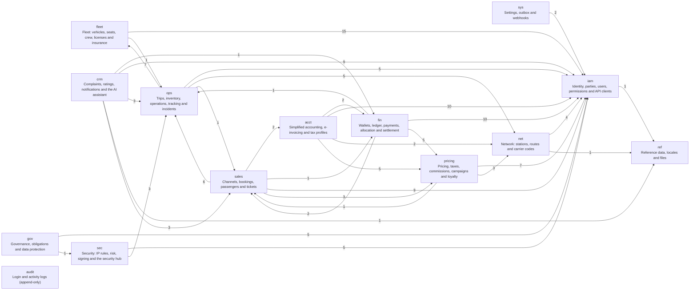

## `iam` — Identity, parties, users, permissions and API clients

```mermaid
erDiagram
  iam_api_client {
    bigint id PK
    uuid uid
    bigint owner_party_id FK
    bigint company_id FK
    text status
    bigint created_by FK
    bigint approved_by FK
  }
  iam_api_key {
    bigint id PK
    bigint api_client_id FK
    text status
    bigint created_by FK
    bigint revoked_by FK
  }
  iam_app_user {
    bigint id PK
    uuid uid
    bigint party_id FK
    text status
    text preferred_locale FK
  }
  iam_auth_token {
    bigint id PK
    bigint user_id FK
  }
  iam_bank_account {
    bigint id PK
    bigint party_id FK
    integer enc_key_id FK
    character currency FK
    text status
  }
  iam_beneficial_owner {
    bigint company_id PK
    bigint party_id PK
  }
  iam_biometric_template {
    bigint party_id PK
    integer enc_key_id FK
  }
  iam_company {
    bigint id PK
    bigint approved_by FK
  }
  iam_company_member {
    bigint user_id PK
    bigint company_id PK
    bigint role_id FK
    text status
  }
  iam_device {
    bigint id PK
    bigint user_id FK
  }
  iam_document {
    bigint id PK
    uuid uid
    integer enc_key_id FK
    bigint file_id FK
    text status
    bigint reviewed_by FK
  }
  iam_gov_identity_link {
    bigint party_id PK
    bigint provider_id PK
  }
  iam_identity_provider {
    bigint id PK
    text code
    character country_code FK
    text status
  }
  iam_mfa_factor {
    bigint id PK
    bigint user_id FK
    integer enc_key_id FK
  }
  iam_party {
    bigint id PK
    uuid uid
    integer enc_key_id FK
    character nationality FK
    character country_code FK
    character tax_country FK
    text status
  }
  iam_party_role {
    bigint party_id PK
    text role_code PK
    text status
  }
  iam_permission {
    text code PK
  }
  iam_push_token {
    bigint device_id PK
  }
  iam_role {
    bigint id PK
    text code
    bigint company_id FK
  }
  iam_role_permission {
    bigint role_id PK
    text permission_code PK
  }
  iam_user_role {
    bigint user_id PK
    bigint role_id PK
    bigint granted_by FK
  }
  iam_user_session {
    bigint id PK
    bigint user_id FK
    bigint device_id FK
    bigint company_id FK
  }
  iam_verification {
    bigint id PK
    bigint provider_id FK
    bigint reviewer_id FK
  }
  ref_locale {
    ref external
  }
  iam_api_key }o--|| iam_api_client : "api_client_id"
  iam_user_role }o--|| iam_app_user : "user_id"
  iam_company_member }o--|| iam_app_user : "user_id"
  iam_device }o--|| iam_app_user : "user_id"
  iam_mfa_factor }o--|| iam_app_user : "user_id"
  iam_user_session }o--|| iam_app_user : "user_id"
  iam_auth_token }o..o| iam_app_user : "user_id"
  iam_beneficial_owner }o--|| iam_company : "company_id"
  iam_company_member }o--|| iam_company : "company_id"
  iam_role }o..o| iam_company : "company_id"
  iam_user_session }o..o| iam_company : "company_id"
  iam_api_client }o..o| iam_company : "company_id"
  iam_push_token }o--|| iam_device : "device_id"
  iam_user_session }o..o| iam_device : "device_id"
  iam_gov_identity_link }o--|| iam_identity_provider : "provider_id"
  iam_verification }o..o| iam_identity_provider : "provider_id"
  iam_party_role }o--|| iam_party : "party_id"
  iam_company }o--|| iam_party : "id"
  iam_biometric_template }o--|| iam_party : "party_id"
  iam_gov_identity_link }o--|| iam_party : "party_id"
  iam_beneficial_owner }o--|| iam_party : "party_id"
  iam_bank_account }o--|| iam_party : "party_id"
  iam_app_user }o--|| iam_party : "party_id"
  iam_api_client }o--|| iam_party : "owner_party_id"
  iam_role_permission }o--|| iam_permission : "permission_code"
  iam_role_permission }o--|| iam_role : "role_id"
  iam_user_role }o--|| iam_role : "role_id"
  iam_company_member }o..o| iam_role : "role_id"
  iam_app_user }o--|| ref_locale : "preferred_locale"
```

## `ref` — Reference data, locales and files

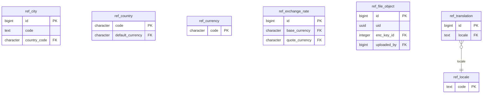

## `sys` — Settings, outbox and webhooks

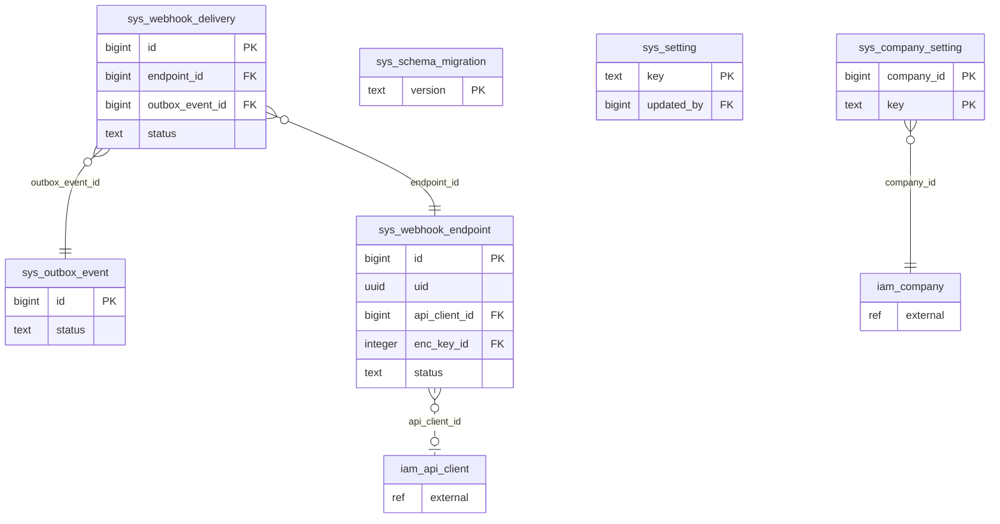

## `net` — Network: stations, routes and carrier codes

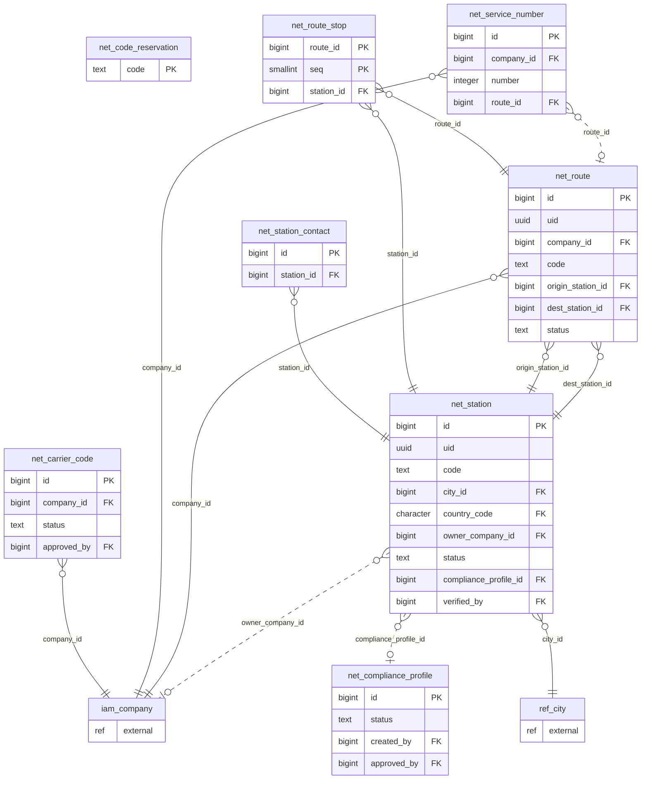

## `fleet` — Fleet: vehicles, seats, crew, licenses and insurance

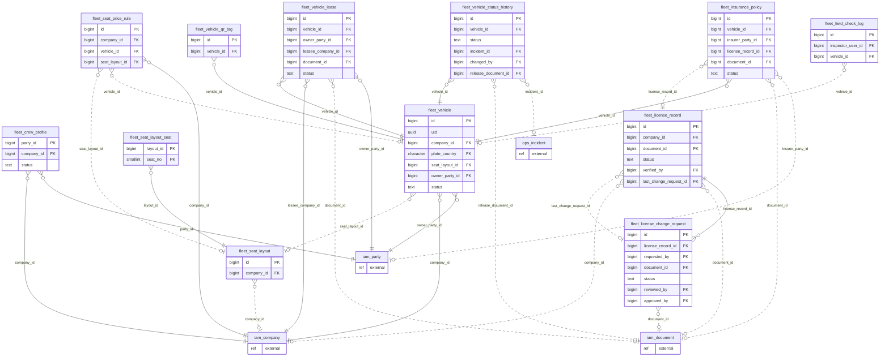

## `pricing` — Pricing, taxes, commissions, campaigns and loyalty

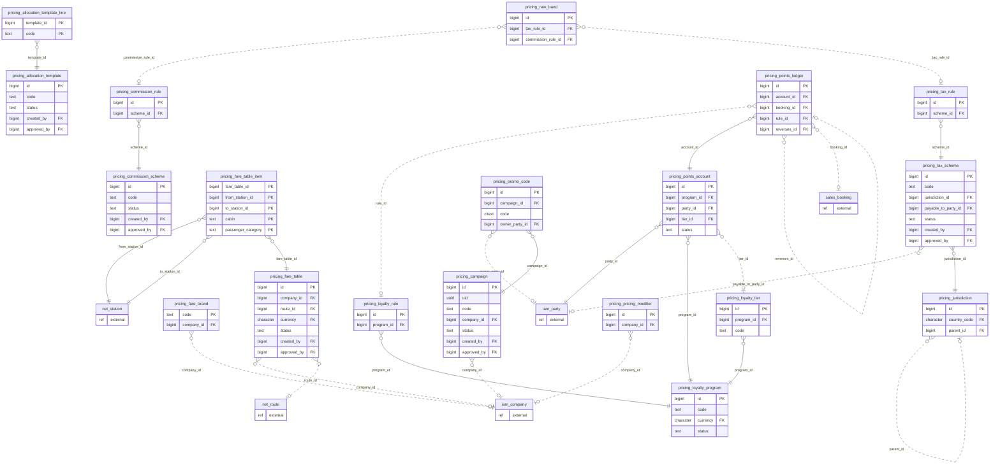

## `ops` — Trips, inventory, operations, tracking and incidents

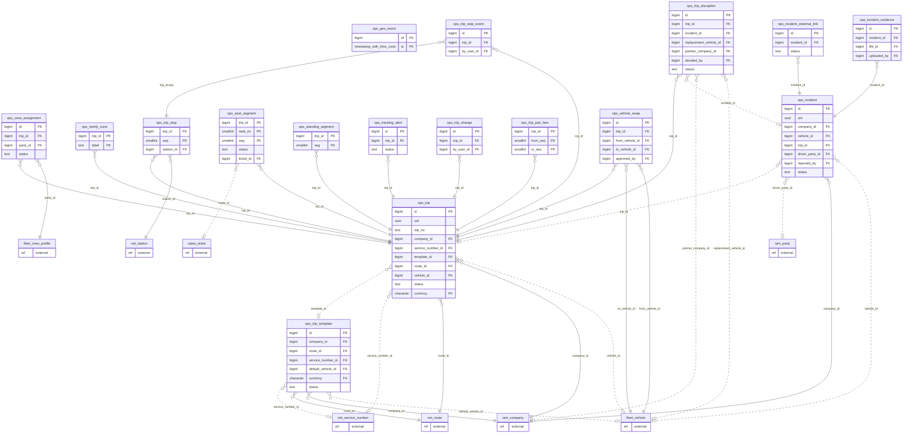

## `sales` — Channels, bookings, passengers and tickets

```mermaid
erDiagram
  sales_boarding_event {
    bigint id PK
    bigint ticket_id FK
    bigint trip_id FK
    bigint scanned_by_user_id FK
    bigint device_id FK
  }
  sales_booking {
    bigint id PK
    uuid uid
    text booking_ref
    bigint trip_id FK
    bigint company_id FK
    bigint booker_party_id FK
    bigint booker_user_id FK
    bigint channel_id FK
    text status
    character currency FK
    bigint price_allocation_id FK
  }
  sales_campaign_redemption {
    bigint id PK
    bigint campaign_id FK
    bigint promo_code_id FK
    bigint booking_id FK
    bigint party_id FK
  }
  sales_channel {
    bigint id PK
    uuid uid
    text code
    bigint party_id FK
    bigint api_client_id FK
    text status
  }
  sales_passenger {
    bigint id PK
    bigint booking_id FK
    bigint party_id FK
    character passport_country FK
    integer enc_key_id FK
    character nationality FK
  }
  sales_passenger_compensation {
    bigint id PK
    bigint booking_id FK
    bigint trip_disruption_id FK
    bigint charged_to_company_id FK
    bigint credit_note_id FK
    text status
  }
  sales_refund_request {
    bigint id PK
    bigint booking_id FK
    bigint ticket_id FK
    text status
    bigint requested_by FK
    bigint decided_by FK
    bigint credit_note_id FK
  }
  sales_ticket {
    bigint id PK
    uuid uid
    bigint booking_id FK
    bigint passenger_id FK
    bigint trip_id FK
    text fare_brand_code FK
    integer qr_key_id FK
    text status
  }
  acct_einvoice_document {
    ref external
  }
  fin_price_allocation {
    ref external
  }
  iam_api_client {
    ref external
  }
  iam_app_user {
    ref external
  }
  iam_company {
    ref external
  }
  iam_device {
    ref external
  }
  iam_party {
    ref external
  }
  ops_trip {
    ref external
  }
  ops_trip_disruption {
    ref external
  }
  ops_trip_stop {
    ref external
  }
  pricing_campaign {
    ref external
  }
  pricing_fare_brand {
    ref external
  }
  pricing_promo_code {
    ref external
  }
  sales_passenger_compensation }o..o| acct_einvoice_document : "credit_note_id"
  sales_refund_request }o..o| acct_einvoice_document : "credit_note_id"
  sales_booking }o..o| fin_price_allocation : "price_allocation_id"
  sales_channel }o..o| iam_api_client : "api_client_id"
  sales_booking }o..o| iam_app_user : "booker_user_id"
  sales_booking }o--|| iam_company : "company_id"
  sales_passenger_compensation }o..o| iam_company : "charged_to_company_id"
  sales_boarding_event }o..o| iam_device : "device_id"
  sales_passenger }o..o| iam_party : "party_id"
  sales_channel }o..o| iam_party : "party_id"
  sales_campaign_redemption }o--|| iam_party : "party_id"
  sales_booking }o--|| iam_party : "booker_party_id"
  sales_boarding_event }o--|| ops_trip : "trip_id"
  sales_booking }o--|| ops_trip : "trip_id"
  sales_ticket }o--|| ops_trip : "trip_id"
  sales_passenger_compensation }o..o| ops_trip_disruption : "trip_disruption_id"
  sales_ticket }o--|| ops_trip_stop : "trip_id,from_seq"
  sales_ticket }o--|| ops_trip_stop : "trip_id,to_seq"
  sales_campaign_redemption }o--|| pricing_campaign : "campaign_id"
  sales_ticket }o..o| pricing_fare_brand : "fare_brand_code"
  sales_campaign_redemption }o..o| pricing_promo_code : "promo_code_id"
  sales_passenger }o--|| sales_booking : "booking_id"
  sales_refund_request }o--|| sales_booking : "booking_id"
  sales_passenger_compensation }o--|| sales_booking : "booking_id"
  sales_ticket }o--|| sales_booking : "booking_id"
  sales_campaign_redemption }o--|| sales_booking : "booking_id"
  sales_booking }o--|| sales_channel : "channel_id"
  sales_ticket }o--|| sales_passenger : "passenger_id"
  sales_boarding_event }o--|| sales_ticket : "ticket_id"
  sales_refund_request }o..o| sales_ticket : "ticket_id"
```

## `fin` — Wallets, ledger, payments, allocation and settlement

```mermaid
erDiagram
  fin_bank_reconciliation {
    bigint id PK
    character currency FK
    text status
    bigint reviewed_by FK
  }
  fin_bank_transfer_topup {
    bigint id PK
    bigint wallet_id FK
    text status
    bigint ledger_txn_id FK
  }
  fin_ledger_entry {
    bigint id PK
    bigint txn_id FK
    bigint wallet_id FK
  }
  fin_ledger_txn {
    bigint id PK
    uuid uid
    character currency FK
    bigint reverses_txn_id FK
    bigint created_by FK
  }
  fin_payment {
    bigint id PK
    uuid uid
    bigint provider_id FK
    bigint booking_id FK
    bigint payer_party_id FK
    bigint wallet_id FK
    character currency FK
    text status
    bigint ledger_txn_id FK
  }
  fin_payment_notification {
    bigint id PK
    bigint provider_id FK
    bigint payment_id FK
  }
  fin_payment_provider {
    bigint id PK
    text code
    bigint clearing_wallet_id FK
    text status
  }
  fin_payout {
    bigint id PK
    uuid uid
    bigint company_id FK
    bigint settlement_batch_id FK
    bigint bank_account_id FK
    character currency FK
    text status
    bigint ledger_txn_id FK
  }
  fin_payout_schedule {
    bigint company_id PK
    text status
  }
  fin_price_allocation {
    bigint id PK
    uuid uid
    bigint booking_id FK
    character currency FK
    bigint template_id FK
  }
  fin_price_allocation_line {
    bigint id PK
    bigint allocation_id FK
    text code
    bigint parent_line_id FK
    bigint beneficiary_party_id FK
    bigint tax_scheme_id FK
    bigint commission_scheme_id FK
    bigint wallet_id FK
    text status
  }
  fin_settlement_batch {
    bigint id PK
    uuid uid
    bigint company_id FK
    character currency FK
    text status
    bigint approved_by FK
  }
  fin_settlement_line {
    bigint id PK
    bigint batch_id FK
    bigint trip_id FK
  }
  fin_tax_ledger {
    bigint id PK
    bigint jurisdiction_id FK
    bigint tax_scheme_id FK
    bigint company_id FK
    character currency FK
    bigint allocation_line_id FK
  }
  fin_wallet {
    bigint id PK
    uuid uid
    bigint owner_party_id FK
    bigint company_id FK
    character currency FK
    text status
  }
  fin_withdrawal_request {
    bigint id PK
    bigint wallet_id FK
    bigint bank_account_id FK
    text status
    bigint requested_by FK
    bigint approved_by FK
    bigint second_approver FK
    bigint ledger_txn_id FK
  }
  iam_bank_account {
    ref external
  }
  iam_company {
    ref external
  }
  iam_party {
    ref external
  }
  ops_trip {
    ref external
  }
  pricing_allocation_template {
    ref external
  }
  pricing_commission_scheme {
    ref external
  }
  pricing_jurisdiction {
    ref external
  }
  pricing_tax_scheme {
    ref external
  }
  sales_booking {
    ref external
  }
  fin_ledger_entry }o--|| fin_ledger_txn : "txn_id"
  fin_bank_transfer_topup }o..o| fin_ledger_txn : "ledger_txn_id"
  fin_ledger_txn }o..o| fin_ledger_txn : "reverses_txn_id"
  fin_withdrawal_request }o..o| fin_ledger_txn : "ledger_txn_id"
  fin_payout }o..o| fin_ledger_txn : "ledger_txn_id"
  fin_payment }o..o| fin_ledger_txn : "ledger_txn_id"
  fin_payment_notification }o..o| fin_payment : "payment_id"
  fin_payment_notification }o--|| fin_payment_provider : "provider_id"
  fin_payment }o--|| fin_payment_provider : "provider_id"
  fin_price_allocation_line }o--|| fin_price_allocation : "allocation_id"
  fin_price_allocation_line }o..o| fin_price_allocation_line : "parent_line_id"
  fin_tax_ledger }o..o| fin_price_allocation_line : "allocation_line_id"
  fin_settlement_line }o--|| fin_settlement_batch : "batch_id"
  fin_payout }o..o| fin_settlement_batch : "settlement_batch_id"
  fin_bank_transfer_topup }o--|| fin_wallet : "wallet_id"
  fin_withdrawal_request }o--|| fin_wallet : "wallet_id"
  fin_ledger_entry }o--|| fin_wallet : "wallet_id"
  fin_payment_provider }o..o| fin_wallet : "clearing_wallet_id"
  fin_payment }o..o| fin_wallet : "wallet_id"
  fin_price_allocation_line }o..o| fin_wallet : "wallet_id"
  fin_withdrawal_request }o--|| iam_bank_account : "bank_account_id"
  fin_payout }o..o| iam_bank_account : "bank_account_id"
  fin_payout_schedule }o--|| iam_company : "company_id"
  fin_settlement_batch }o--|| iam_company : "company_id"
  fin_payout }o--|| iam_company : "company_id"
  fin_wallet }o..o| iam_company : "company_id"
  fin_tax_ledger }o..o| iam_company : "company_id"
  fin_wallet }o..o| iam_party : "owner_party_id"
  fin_payment }o--|| iam_party : "payer_party_id"
  fin_price_allocation_line }o..o| iam_party : "beneficiary_party_id"
  fin_settlement_line }o..o| ops_trip : "trip_id"
  fin_price_allocation }o..o| pricing_allocation_template : "template_id"
  fin_price_allocation_line }o..o| pricing_commission_scheme : "commission_scheme_id"
  fin_tax_ledger }o--|| pricing_jurisdiction : "jurisdiction_id"
  fin_tax_ledger }o--|| pricing_tax_scheme : "tax_scheme_id"
  fin_price_allocation_line }o..o| pricing_tax_scheme : "tax_scheme_id"
  fin_payment }o..o| sales_booking : "booking_id"
  fin_price_allocation }o..o| sales_booking : "booking_id"
```

## `acct` — Simplified accounting, e-invoicing and tax profiles

```mermaid
erDiagram
  acct_account_mapping {
    bigint connection_id PK
    text local_type PK
    bigint local_id PK
  }
  acct_accounting_connection {
    bigint id PK
    bigint company_id FK
    text status
  }
  acct_cost_center {
    bigint id PK
    bigint company_id FK
    text code
    bigint route_id FK
    bigint station_id FK
  }
  acct_einvoice_activation {
    bigint id PK
    bigint authority_id FK
  }
  acct_einvoice_document {
    bigint id PK
    bigint seller_profile_id FK
    bigint unit_id FK
    bigint company_id FK
    bigint buyer_party_id FK
    bigint original_doc_id FK
    character currency FK
    text number
    bigint xml_file_id FK
    bigint pdf_file_id FK
    text status
  }
  acct_einvoice_line {
    bigint id PK
    bigint document_id FK
    bigint tax_scheme_id FK
    bigint allocation_line_id FK
  }
  acct_einvoice_submission {
    bigint id PK
    bigint document_id FK
    bigint stamped_xml_file_id FK
  }
  acct_einvoice_template {
    bigint id PK
    bigint authority_id FK
  }
  acct_einvoice_unit {
    bigint id PK
    bigint profile_id FK
    bigint authority_id FK
    integer signing_key_id FK
    text status
  }
  acct_gl_account {
    bigint id PK
    bigint company_id FK
    text code
    bigint parent_id FK
    character currency FK
  }
  acct_gl_period {
    bigint company_id FK
    text status
    bigint closed_by FK
  }
  acct_journal_entry {
    bigint id PK
    uuid uid
    bigint company_id FK
    bigint posting_rule_id FK
    character currency FK
    text status
    bigint reversed_by_id FK
    bigint created_by FK
  }
  acct_journal_line {
    bigint id PK
    bigint entry_id FK
    bigint account_id FK
    bigint party_id FK
    bigint cost_center_id FK
  }
  acct_posting_rule {
    bigint id PK
    bigint created_by FK
    bigint approved_by FK
  }
  acct_sync_item {
    bigint id PK
    bigint connection_id FK
    text status
  }
  acct_tax_authority {
    bigint id PK
    text code
    character country_code FK
    text status
  }
  acct_tax_collection_no_file {
    bigint id PK
    bigint payer_party_id FK
    bigint tax_scheme_id FK
    character currency FK
    bigint remitted_payment_id FK
  }
  acct_tax_payment {
    bigint id PK
    bigint profile_id FK
    bigint authority_id FK
    bigint tax_return_id FK
    bigint tax_scheme_id FK
    character currency FK
    bigint ledger_txn_id FK
  }
  acct_tax_profile {
    bigint id PK
    bigint party_id FK
    bigint authority_id FK
    bigint approved_by FK
  }
  acct_tax_profile_field {
    bigint id PK
    character country_code FK
    bigint authority_id FK
    text code
  }
  acct_tax_profile_value {
    bigint profile_id PK
    bigint field_id PK
  }
  acct_tax_registration {
    bigint id PK
    bigint profile_id FK
    bigint tax_scheme_id FK
  }
  acct_tax_return {
    bigint id PK
    bigint profile_id FK
    bigint authority_id FK
    bigint tax_scheme_id FK
    text status
  }
  acct_tax_return_line {
    bigint return_id PK
    text box_code PK
  }
  fin_ledger_txn {
    ref external
  }
  fin_price_allocation_line {
    ref external
  }
  iam_company {
    ref external
  }
  iam_party {
    ref external
  }
  net_route {
    ref external
  }
  net_station {
    ref external
  }
  pricing_tax_scheme {
    ref external
  }
  acct_account_mapping }o--|| acct_accounting_connection : "connection_id"
  acct_sync_item }o--|| acct_accounting_connection : "connection_id"
  acct_journal_line }o..o| acct_cost_center : "cost_center_id"
  acct_einvoice_line }o--|| acct_einvoice_document : "document_id"
  acct_einvoice_submission }o--|| acct_einvoice_document : "document_id"
  acct_einvoice_document }o..o| acct_einvoice_document : "original_doc_id"
  acct_einvoice_document }o--|| acct_einvoice_unit : "unit_id"
  acct_journal_line }o--|| acct_gl_account : "account_id"
  acct_gl_account }o..o| acct_gl_account : "parent_id"
  acct_journal_line }o--|| acct_journal_entry : "entry_id"
  acct_journal_entry }o..o| acct_journal_entry : "reversed_by_id"
  acct_journal_entry }o..o| acct_posting_rule : "posting_rule_id"
  acct_einvoice_template }o--|| acct_tax_authority : "authority_id"
  acct_einvoice_activation }o--|| acct_tax_authority : "authority_id"
  acct_tax_profile }o..o| acct_tax_authority : "authority_id"
  acct_tax_profile_field }o..o| acct_tax_authority : "authority_id"
  acct_einvoice_unit }o--|| acct_tax_authority : "authority_id"
  acct_tax_return }o--|| acct_tax_authority : "authority_id"
  acct_tax_payment }o--|| acct_tax_authority : "authority_id"
  acct_tax_collection_no_file }o..o| acct_tax_payment : "remitted_payment_id"
  acct_tax_profile_value }o--|| acct_tax_profile : "profile_id"
  acct_tax_registration }o--|| acct_tax_profile : "profile_id"
  acct_einvoice_unit }o--|| acct_tax_profile : "profile_id"
  acct_tax_return }o--|| acct_tax_profile : "profile_id"
  acct_tax_payment }o..o| acct_tax_profile : "profile_id"
  acct_einvoice_document }o--|| acct_tax_profile : "seller_profile_id"
  acct_tax_profile_value }o--|| acct_tax_profile_field : "field_id"
  acct_tax_return_line }o--|| acct_tax_return : "return_id"
  acct_tax_payment }o..o| acct_tax_return : "tax_return_id"
  acct_tax_payment }o..o| fin_ledger_txn : "ledger_txn_id"
  acct_einvoice_line }o..o| fin_price_allocation_line : "allocation_line_id"
  acct_gl_period }o..o| iam_company : "company_id"
  acct_gl_account }o..o| iam_company : "company_id"
  acct_cost_center }o..o| iam_company : "company_id"
  acct_accounting_connection }o..o| iam_company : "company_id"
  acct_journal_entry }o..o| iam_company : "company_id"
  acct_einvoice_document }o..o| iam_company : "company_id"
  acct_tax_profile }o--|| iam_party : "party_id"
  acct_tax_collection_no_file }o--|| iam_party : "payer_party_id"
  acct_journal_line }o..o| iam_party : "party_id"
  acct_einvoice_document }o..o| iam_party : "buyer_party_id"
  acct_cost_center }o..o| net_route : "route_id"
  acct_cost_center }o..o| net_station : "station_id"
  acct_tax_registration }o--|| pricing_tax_scheme : "tax_scheme_id"
  acct_tax_collection_no_file }o--|| pricing_tax_scheme : "tax_scheme_id"
  acct_tax_return }o--|| pricing_tax_scheme : "tax_scheme_id"
  acct_tax_payment }o--|| pricing_tax_scheme : "tax_scheme_id"
  acct_einvoice_line }o..o| pricing_tax_scheme : "tax_scheme_id"
```

## `crm` — Complaints, ratings, notifications and the AI assistant

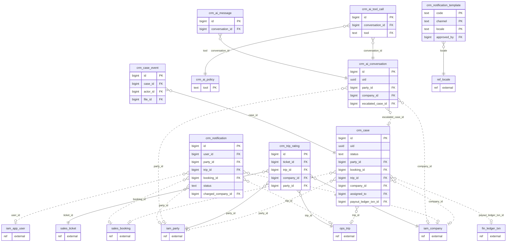

## `gov` — Governance, obligations and data protection

```mermaid
erDiagram
  gov_consent {
    bigint id PK
    bigint party_id FK
  }
  gov_data_inventory {
    text dataset PK
  }
  gov_feature_compliance_review {
    bigint id PK
    bigint dpia_file_id FK
    bigint approved_by FK
  }
  gov_obligation_register {
    bigint id PK
    bigint evidence_file_id FK
    bigint owner_user_id FK
    text status
  }
  gov_partner_dpa {
    bigint id PK
    bigint partner_party_id FK
    bigint file_id FK
  }
  gov_policy_authority {
    bigint id PK
    text domain_code FK
    text status
  }
  gov_policy_change {
    bigint id PK
    text domain_code FK
    bigint company_id FK
    bigint proposer_id FK
    text status
  }
  gov_policy_domain {
    text code PK
  }
  gov_privacy_incident {
    bigint id PK
    text status
    bigint security_event_id FK
  }
  gov_subject_request {
    bigint id PK
    bigint party_id FK
    text status
    bigint handled_by FK
  }
  iam_app_user {
    ref external
  }
  iam_company {
    ref external
  }
  iam_party {
    ref external
  }
  sec_security_event {
    ref external
  }
  gov_policy_authority }o--|| gov_policy_domain : "domain_code"
  gov_policy_change }o--|| gov_policy_domain : "domain_code"
  gov_policy_change }o--|| iam_app_user : "proposer_id"
  gov_policy_change }o..o| iam_company : "company_id"
  gov_partner_dpa }o--|| iam_party : "partner_party_id"
  gov_consent }o--|| iam_party : "party_id"
  gov_subject_request }o--|| iam_party : "party_id"
  gov_privacy_incident }o..o| sec_security_event : "security_event_id"
```

## `sec` — Security: IP rules, risk, signing and the security hub

```mermaid
erDiagram
  sec_access_review {
    bigint id PK
    bigint user_id FK
    bigint role_id FK
    bigint reviewer_id FK
  }
  sec_authority_data_request {
    bigint id PK
    bigint authority_id FK
    bigint requested_by FK
    bigint approved_by FK
    text status
  }
  sec_authority_order {
    bigint id PK
    bigint authority_id FK
    text status
    bigint executed_by FK
  }
  sec_authority_policy {
    bigint id PK
    bigint authority_id FK
  }
  sec_authority_profile {
    bigint id PK
    text code
  }
  sec_blocklist_entry {
    bigint id PK
    bigint added_by FK
  }
  sec_break_glass_log {
    bigint id PK
    bigint actor_id FK
    bigint approver_id FK
  }
  sec_document_signature {
    bigint id PK
    integer key_id FK
    bigint file_id FK
  }
  sec_fraud_case {
    bigint id PK
    text status
    bigint assigned_to FK
  }
  sec_ip_rule {
    bigint id PK
    bigint api_client_id FK
    bigint created_by FK
    bigint approved_by FK
    bigint revoked_by FK
  }
  sec_key_registry {
    integer id PK
    bigint company_id FK
    text status
  }
  sec_manifest_submission {
    bigint id PK
    bigint trip_id FK
    bigint authority_id FK
    bigint payload_file_id FK
    text status
    bigint created_by FK
  }
  sec_risk_assessment {
    bigint id PK
  }
  sec_screening_request {
    bigint id PK
    bigint authority_id FK
    text status
  }
  sec_screening_result {
    bigint request_id PK
    bigint reviewed_by FK
  }
  sec_security_event {
    bigint id PK
    bigint ip_rule_id FK
  }
  sec_sos_event {
    bigint id PK
    bigint trip_id FK
    bigint triggered_by FK
    text status
    bigint incident_id FK
  }
  sec_tamper_event {
    bigint id PK
  }
  sec_watchlist_entry {
    bigint id PK
    bigint authority_id FK
    text status
    bigint created_by FK
  }
  iam_api_client {
    ref external
  }
  iam_app_user {
    ref external
  }
  iam_company {
    ref external
  }
  iam_role {
    ref external
  }
  ops_incident {
    ref external
  }
  ops_trip {
    ref external
  }
  sec_ip_rule }o..o| iam_api_client : "api_client_id"
  sec_access_review }o--|| iam_app_user : "user_id"
  sec_sos_event }o..o| iam_app_user : "triggered_by"
  sec_key_registry }o..o| iam_company : "company_id"
  sec_access_review }o..o| iam_role : "role_id"
  sec_sos_event }o..o| ops_incident : "incident_id"
  sec_manifest_submission }o--|| ops_trip : "trip_id"
  sec_sos_event }o..o| ops_trip : "trip_id"
  sec_authority_policy }o--|| sec_authority_profile : "authority_id"
  sec_screening_request }o--|| sec_authority_profile : "authority_id"
  sec_watchlist_entry }o..o| sec_authority_profile : "authority_id"
  sec_authority_order }o--|| sec_authority_profile : "authority_id"
  sec_authority_data_request }o--|| sec_authority_profile : "authority_id"
  sec_manifest_submission }o..o| sec_authority_profile : "authority_id"
  sec_security_event }o..o| sec_ip_rule : "ip_rule_id"
  sec_screening_result }o--|| sec_screening_request : "request_id"
```

## `audit` — Login and activity logs (append-only)

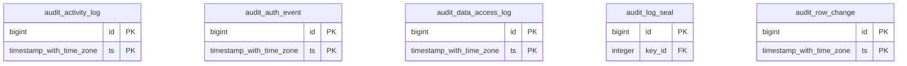
