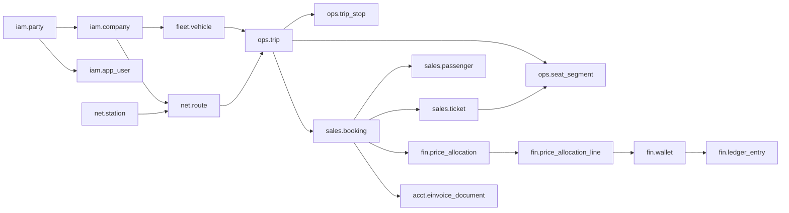

# Masslak Database

Built from the **Analysis and Design Study v2.7** (`docs/Masslak_Analysis_and_Design_EN_v2.7.docx`). Files 000 to 998
cover the Phase 1 scope of sections 21 and 22.2 and the fields the owner decided to build from Phase 1 onwards
(Decision 88). Files 1003 and 1010 to 1032 complete the model against every entity the study defines, including the
modules of later phases (sections 4.10, 9, 10, 11, 13, 14, 21 and appendix D). Those modules stay disabled behind
feature flags until their phase starts (2.8, decision D-6). File 1033 applies the relationship rules of design v3.0:
every table has a primary key, every reference is a foreign key (or documents why not), and every foreign key is indexed.

| | |
|---|---|
| Engine | PostgreSQL 16 (extensions: pgcrypto, citext, btree_gist, pg_trgm) |
| Schemas | 23 separate schemas, each with its own privileges |
| Tables | 445 tables, 4,557 columns, 1,304 foreign keys; row-level security and a data class on every table |
| Tests | 188 automated checks passing against a real database, including the acceptance matrix of the architecture review |
| Design | [Database design and ERD document](../docs/database/) with diagrams in the study's colors |
| Docs | [Data dictionary](DATA_DICTIONARY.md) · [ERD diagrams](ERD.md) (both generated from the database) |

## Language and localization policy

- **English only** for the database and code: schema, table and column names, enum values, comments, seed data, tests, scripts and generated docs.
- **Localization belongs to the UI layer.** No table has per-language columns (`name_ar`, `name_en`...). Each reference row has one English `name`.
- **`ref.locale`** lists supported UI locales with their text direction. English (`en`, LTR) is the default, Arabic (`ar`, RTL) is enabled, and Turkish, French and Spanish are seeded disabled for later phases. Adding a language is a row insert plus UI resource files, with no schema change.
- **`ref.translation`** (entity, entity_key, field, locale, value) holds localized display values for reference data such as city, station, fare brand and role names. The English value in the source row is always the fallback.
- **User preferences:** `iam.app_user.preferred_locale` and `crm.notification_template.locale` reference `ref.locale`.
- **User-entered data** may be in any script, for example a party's legal name as registered. `iam.party.name_latin` holds an optional Latin transliteration.

## Running

```bash
createdb masslak
./db/build.sh masslak                 # builds the schema in order (000 -> 990) and records each file
./db/upgrade.sh masslak               # on an existing database: applies only the files it has not run yet
./db/tests/run.sh                     # builds a temporary database, runs the tests, then drops it
python3 db/tools/gen_docs.py masslak  # regenerates the data dictionary and ERD
```
psql connection arguments can follow the database name, e.g. `./db/build.sh masslak -h host -U owner`.

**Upgrades.** Applied files are recorded with their SHA-256 in `sys.schema_file`. `upgrade.sh` runs each newer file
in its own transaction and records it. Files from 980 on are upgrade files: they are written to be idempotent
(`IF NOT EXISTS`, `ON CONFLICT DO NOTHING`, `DROP POLICY IF EXISTS`) and are never edited once released; a change
is a new file. A database built before file tracking is treated as having every file up to 970.

| File | Contents |
|---|---|
| `000_init.sql` | Extensions, schemas, roles, request context, helper functions |
| `010_ref_sys.sql` | Locales and translations, countries, currencies, exchange rates, cities, files, encryption keys, settings, outbox and webhooks |
| `020_iam.sql` | Parties, companies, users, roles and permissions, sessions, devices and MFA, API clients and keys, identity verification (KYC) |
| `030_net_fleet.sql` | Stations and compliance profiles, routes, carrier codes and service numbers, vehicles and seats, leases, crew, locked licenses, insurance |
| `040_pricing.sql` | Fare brands, fare tables, modifiers, taxes and commissions, allocation templates, campaigns, loyalty |
| `050_ops.sql` | Trip templates, trips, stops, per-segment inventory, crew, changes, tracking, incidents and trip continuity |
| `060_sales.sql` | Channels, bookings, passengers, tickets, boarding, refunds, compensation |
| `070_fin.sql` | Wallets, double-entry ledger, payments and notifications, withdrawals, price allocation, tax ledger, settlement, payouts and reconciliation |
| `080_acct.sql` | Chart of accounts and journals, accounting integration, tax authority and tax profiles, e-invoices, tax returns |
| `090_crm_gov.sql` | Complaints, ratings, notifications, AI assistant, policy authority matrix, obligations, data protection |
| `100_sec.sql` | IP blocking rules, risk and fraud, security events, document signing, security & compliance hub |
| `110_audit.sql` | Login, activity, data-access and change logs, sealing, monthly partitions |
| `900_rls_grants.sql` | Tenant isolation and role privileges |
| `950_seed.sql` | Seed data: locales, currencies, countries, cities, platform wallets, permission and role catalog, settings |
| `960_platform_config.sql` | Fare brands, sandbox payment provider, API permissions |
| `970_passenger_names.sql` | Structured passenger names by identity document, full country list |
| `980_mfa.sql` | Two-factor sign-in: replay protection, one active factor, failure count per session |
| `990_agency.sql` | Travel agencies: agreements (commission, daily limit), booking attribution and its RLS, agency roles |
| `995`–`998` | Seat layouts, default locale, payouts, company documents |
| `1000`–`1002` | Notifications, privacy self-service, mobile devices |
| `1003_extensibility.sql` | Reference tables for extensible lists; passenger transit and contracted transport readiness (appendix D) |
| `1010_model_helpers.sql` | New schemas (bill, ptn, ship, frt, brd, rail, taxi, rent) and the row-level security and privilege helpers |
| `1011_core_fleet.sql` | Crew additions, driving hours, vehicle service status, insurance claims, authority alerts, trucks, trailers, validators |
| `1012_lines_shuttle.sql` | Approved lines, versions, permits, tariffs and timetables (4.15); shuttle rides and proximity (7.13); subscriptions and passes |
| `1013_trips_booking.sql` | Seat locks, cancellation policies, waiting lists, entry rules, ticket documents, inspections, tracking state, station gates |
| `1014_service_partners.sql` | Fuel stations and rest stops: contracts, fuel cards, sessions, odometer, anomalies, sales, orders, settlement (14.11) |
| `1015_loyalty_campaigns.sql` | Loyalty partners, rewards, vouchers, transfers, points liability, sponsors, BIN ranges, override policies |
| `1016_billing_finance.sql` | Plans, agreements, subscriptions, metering and carrier invoices; cash remittances; float and deposit placements |
| `1017_shipping.sql` | Shipments, parcels, handling units, loads, couriers, hubs, zones, rates, delivery, claims and partner integration (9) |
| `1018_freight.sql` | Freight requests, bids, contracts, containers, handovers, ports, transit declarations, weighbridge, claims (10, D.3) |
| `1019_border_manifest.sql` | Border points, crossing profiles, manifests with persons, vehicles and cargo, responses and discrepancies (11) |
| `1020_accounting_ops.sql` | Sales invoices, credit notes, cash boxes and sessions, receipts and payments, tax codes, sync jobs (13.7) |
| `1021_channels.sql` | Channel agreements, allotments, API profiles, statements and memos, supplier sources and mappings (14.7) |
| `1022_contact_center_gov.sql` | AI-first contact center (7.11) and government registry adapters (phase 5) |
| `1023_rail_taxi.sql` | Rail fare classes, coaches, compositions and connected journeys; taxi permits, shifts, dispatch and rides |
| `1024_car_rental.sql` | Rental companies, branches, fleet, rates, bookings, contracts, inspections, deposits and telematics |
| `1029_model_flags.sql` | Feature flags of the new modules (all off) and schema version 1.12.0 |
| `1030`–`1038` | Module permissions, workflows, travel documents, relationship rules, reports, payments, integration API, RLS coverage, passenger categories, families and manifests |
| `1039_review_hardening.sql` | Database architecture review: RLS and a data class on every table, AUTH scope, typed foreign keys behind polymorphic references, same-company checks, ledger reversals and reconciliation, seat rules, business rules, retention and erasure, scopes and decision log, key rules, module gates (see `docs/database/REVIEW_RESPONSE.md`) |
| `1040_integrity_audit.sql` | Strategic review and relationship audit: composite keys for the sale chain (ticket, booking, passenger, seat, trip), guards for boarding scans, manifest persons, cargo legs, payment wallets and fare brands, 27 more tenant guards and 9 vehicle guards (ownership or lease), one company wallet per currency, jurisdiction tree, schema dependency and JSONB inventories (see `docs/database/INTEGRITY_AUDIT.md`) |

## Design rules (study 29.1)

- **Amounts:** `bigint` in the currency's minor unit, never floating point. Every amount carries its currency.
- **Timestamps:** `timestamptz` in UTC. Times are displayed in the city's time zone.
- **Identifiers:** an internal `bigint` key for relationships and a public `uid` (UUID) for interfaces and links only, so sequential numbers are never exposed.
- **Statuses:** text with `CHECK` constraints (no enum types). Adding a status means changing a constraint, not rebuilding the table.
- **Flexibility:** purpose-specific `jsonb` fields (price and terms snapshots, compliance-profile fields, settings), never as a substitute for columns.
- **Foreign keys:** declared explicitly on every relationship, except the high-volume tracking table, which skips them for insert performance.
- **Configuration before code:** feature flags and policies live in `sys.setting` and `sys.company_setting` (principle 2.8).

## Core relationships



- **Unified party** (`iam.party`): any person, company or entity is registered once and can hold several roles (passenger, driver, vehicle owner...). A carrier company is a 1:1 profile of its party and is the tenant.
- **Trip** (`ops.trip`): a fixed snapshot of the route, its stops, fares and crew at publication. Inventory has one row per (trip, seat, segment), so a seat can be sold for any station pair whose segments are all vacant (4.12).
- **Booking:** carries the price snapshot and its allocation tree across beneficiaries (carrier, platform, tax, intermediary). Each leaf is released to its beneficiary's wallet through a ledger entry.
- **E-invoice:** created for every booking and locked after payment. A refund is a credit note linked to it.

## Invariants enforced by the database

Neither the application nor a direct query can bypass these rules, and every one is covered by the tests:

| Invariant | Mechanism |
|---|---|
| A vehicle cannot be assigned to two overlapping trips (including turnaround) | `EXCLUDE USING gist` constraint |
| A driver or host cannot be assigned to two overlapping trips | Exclusion constraint on crew assignment |
| One active lessee per vehicle per period | Exclusion constraint on leases |
| No trip is published on a blocked vehicle (expired license, insurance or lease) or one the carrier neither owns nor leases | Trigger rejects the assignment |
| Every ledger transaction balances (debits = credits) | Deferred constraint trigger checked at commit |
| Ledger entries are never updated or deleted | Trigger plus revoked privileges |
| Wallet balances never go negative (except clearing wallets) | CHECK constraint with atomic balance update |
| Idempotency keys prevent double postings, bookings and payments | Unique indexes |
| Allocation tree leaves sum to the total price | Deferred constraint trigger |
| A finalized invoice never changes and is never deleted | Trigger allows only status transitions and the authority's response |
| Gapless invoice numbering with a hash chain | `acct.finalize_einvoice` with a unit row lock |
| Credit notes cannot exceed the original invoice | Check at finalization |
| License expiry dates are locked; changes need approval by a different officer | Trigger plus CHECK constraint |
| Only allowed status transitions (booking, ticket, payment, invoice) | Triggers per section 28 |
| Financial rules are versioned, and the creator cannot approve their own rule | CHECK constraints on every tax, commission, campaign and allocation scheme |
| Users and templates reference a supported locale only | Foreign keys to `ref.locale` |

## Security, encryption and data protection

**Field-level encryption (16.18):** highly sensitive fields (ID and passport numbers, IBAN, MFA and webhook secrets, biometric templates) are stored in `*_enc` columns. They are encrypted with AES-256-GCM in the application layer, using a data key per class and a master key in KMS. Each such field also has:
- `*_bidx`: an HMAC-SHA256 blind index with a separate key, for lookup and uniqueness (for example, preventing duplicate IDs) without decryption.
- `*_last4`: for masked display only.
- `enc_key_id`: the key reference in `sec.key_registry`, so keys rotate yearly without losing older data.

The database never holds the keys themselves, so a stolen copy does not reveal these fields. Passwords are hashed with Argon2id. API keys, session tokens and OTPs are stored only as SHA-256 hashes.

**Tenant isolation (RLS):** the application sets each request's context with `sys.set_context(user, company, scope, api_client, request_id, ip, session, party)`. Policies then stop any carrier from seeing or changing another carrier's data, and limit a passenger to their own bookings, wallet and invoices. If the context is not set, no private row is visible (deny by default).

**Least privilege (16.17):**

| Role | Privileges |
|---|---|
| `masslak_owner` | Schema owner, used for migrations only; the application never connects as it |
| `masslak_app` | The application: subject to RLS, cannot modify or delete append-only tables, and can write logs but not read them |
| `masslak_readonly` | Reporting |
| `masslak_auditor` | Read access to audit and security logs only |

## Audit logs: every login and every action

| Log | What it records | Written by |
|---|---|---|
| `audit.auth_event` | Every login, logout, MFA, OTP, token refresh or API key use, successful or failed. Includes user or client, portal, device, IP, country, ASN and reason | Application and API gateway |
| `audit.activity_log` | Every request or action (UI or API): who, when, from which IP, which endpoint, which permission, which entity, the outcome (success, denied, blocked, rate-limited), latency and before/after changes | Application (per-request middleware) |
| `audit.data_access_log` | Every reveal of a sensitive field (passport, ID, IBAN), with a mandatory reason | Application |
| `audit.row_change` | Any insert, update or delete on 58 sensitive tables, even outside the application. Includes the user identity and IP from the request context | Database triggers, automatically |

- **Append-only:** a trigger rejects updates and deletes, even from the table owner. The application role has no update privilege and cannot read the logs.
- **Tamper evidence:** every row carries a SHA-256 hash of its content. `audit.seal()`, a job scheduled every few minutes, seals each new block into a hash chain linked to the previous block, with a slot for a KMS signature. Any later deletion, change or insertion breaks the chain and is detected on verification.
- **Redaction:** passwords, tokens and encrypted values are never stored in any log; they are automatically replaced with `***`.
- **Performance and retention:** logs are partitioned monthly, so they stay fast with millions of rows. They are removed only by dropping partitions after the statutory period and after archiving. The default period is 84 months, to be set by legal counsel.

## IP and range blocking

`sec.ip_rule` can block, allow, throttle or challenge traffic:
- **Targets:** a single address, a CIDR range (IPv4 and IPv6), a country, or a network provider (ASN).
- **Scope:** the whole platform, a specific portal (passenger, operator, agency, admin, API, payment webhooks, driver), or a single API client.
- **Priority:** the highest-priority rule wins, then the most specific range. A whole range can therefore be blocked while one partner address is still allowed on the API only (tested).
- **Duration:** permanent or temporary. Rules are never deleted. They are revoked with a reason and the name of the revoker, so a trace remains.
- **Automatic blocking:** `sec.auto_block_ip()` blocks an address that abuses or floods the platform. The duration doubles with each repeat within 30 days, from 15 minutes up to 30 days. As a safety net inside the database itself, 30 failed logins from one address within an hour block it automatically (configurable in `sys.setting`).
- **Immediate enforcement at the edge:** every change is published through the outbox to the WAF, the API gateway and the Redis cache. Requests are rejected before they reach the application and consume no application resources.
- **API client allowlists:** each client can have an optional address allowlist and optional mTLS. The admin portal can be restricted to specific addresses by enabling a single setting.

## Later phases, added without disruption

The core is designed so that later phases add new tables that link to it, without changing existing tables:

| Phase | Added | Links to |
|---|---|---|
| 2. Shuttle | Approved line catalog with versions and paths (PostGIS recommended for geometry), subscriptions, QR/NFC, boarding devices | `ops.trip` (capacity fields ready), `fin.wallet` |
| 3. Cargo | Shipments, parcels, legs, handling units, loads and external references | `ops.trip.cargo_capacity_kg`, `fin.price_allocation.subject_type` |
| 4 & 6. International and borders | Border crossings, entry rules, ticket documents, automated manifest | `sales.passenger` (passport fields ready), `sec.manifest_submission` |
| 5. Government integration | Activate the adapters in `iam.identity_provider`, `sec.authority_profile` and `acct.tax_authority` | Tables exist; activation by configuration |
| 9. Intermediary platforms | Channel agreements and quotas, bundles and subscriptions, fuel stations and rest stops | `sales.channel`, `pricing.commission_scheme` |
| Any. Additional UI languages | Enable the locale in `ref.locale` and add `ref.translation` rows and UI resources | `ref.locale`, `ref.translation` |

## Open points before production

1. **Syrian currency code:** currently `SYP` with two decimal places. If a different code or subdivision is adopted for the new pound, only the currency row needs updating.
2. **Retention periods:** defaults live in `gov.retention_policy` and `gov.data_inventory` (positions 90 days, logs 7 years) and are applied daily by `sys.run_maintenance` (worker `--maintenance`) unless a legal hold applies; the final values are set by legal and accounting advisors.
3. **KMS provider:** tables hold key references only. A KMS or Vault must be chosen before launch (section 18); outside the sandbox the API refuses to start without `MASSLAK_FIELD_KEYS` and `MASSLAK_BIDX_KEY`, and `python -m app.tools.rekey` re-encrypts after a rotation.
4. **Ledger partitioning:** not partitioned in Phase 1, to keep things simple and preserve foreign-key integrity. Partition it by time once it passes tens of millions of entries.
5. **Production schema owner:** migrations run as `masslak_owner`. The application connects as a user that is only a member of `masslak_app`.
