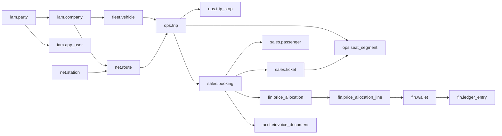

# قاعدة بيانات مسلك — المرحلة الأولى

مبنية حصراً على **دراسة التحليل والتصميم v2.4** (`docs/Masslak_Analysis_and_Design_AR_v2.4.docx`)، وفق نطاق المرحلة الأولى في القسمين 21 و22.2 (النواة، الأسطول والجدولة، الحجز والمال، التشغيل، التصليب)، مع الحقول والجداول التي قرر المالك بناءها منذ المرحلة الأولى (القرار 88).

| | |
|---|---|
| المحرك | PostgreSQL 16 (امتدادات: pgcrypto، citext، btree_gist، pg_trgm) |
| المخططات | 14 مخططاً مستقلاً بصلاحيات مستقلة |
| الجداول | 181 جدولاً، 1,885 عموداً، 422 مفتاحاً أجنبياً |
| الاختبارات | 48 اختباراً آلياً ناجحاً على قاعدة حقيقية |
| الوثائق | [قاموس البيانات](DATA_DICTIONARY.md) · [مخططات العلاقات ERD](ERD.md) (مولَّدان آلياً من القاعدة) |

## التشغيل

```bash
createdb masslak
./db/build.sh masslak                 # يبني المخطط بالترتيب (000 ← 950)
./db/tests/run.sh                     # يبني قاعدة مؤقتة ويشغّل الاختبارات ثم يحذفها
python3 db/tools/gen_docs.py masslak  # يعيد توليد قاموس البيانات وERD
```
يمكن تمرير معاملات الاتصال لـ psql بعد اسم القاعدة، مثل: `./db/build.sh masslak -h host -U owner`.

| الملف | المحتوى |
|---|---|
| `000_init.sql` | الامتدادات، المخططات، الأدوار، سياق الطلب، الدوال المساعدة |
| `010_ref_sys.sql` | الدول، العملات، أسعار الصرف، المدن، الملفات، مفاتيح التشفير، الإعدادات، Outbox وWebhooks |
| `020_iam.sql` | الأطراف، الشركات، المستخدمون، الأدوار والصلاحيات، الجلسات والأجهزة وMFA، عملاء ومفاتيح API، التحقق من الهوية (KYC) |
| `030_net_fleet.sql` | المحطات وملفات الامتثال، الخطوط، رموز الناقلين وأرقام الخدمات، المركبات والمقاعد، الإيجار، الطاقم، التراخيص المقفلة، التأمين |
| `040_pricing.sql` | علامات الأسعار، جداول الأجرة، المعدّلات، الضرائب والعمولات، قوالب التوزيع، الحملات، الولاء |
| `050_ops.sql` | أنماط الرحلات، الرحلات، المحطات، المخزون لكل مقطع، الطاقم، التغييرات، التتبع، الحوادث واستمرارية الرحلة |
| `060_sales.sql` | القنوات، الحجوزات، المسافرون، التذاكر، الصعود، الاسترداد، التعويض |
| `070_fin.sql` | المحافظ، الدفتر المزدوج، المدفوعات وإشعاراتها، السحب، توزيع السعر، دفتر الضرائب، التسوية والتحويل والمطابقة |
| `080_acct.sql` | دليل الحسابات والقيود، الربط المحاسبي، الجهة الضريبية والملف الضريبي، الفاتورة الإلكترونية، الإقرارات |
| `090_crm_gov.sql` | الشكاوى، التقييم، الإشعارات، المساعد الذكي، مصفوفة الصلاحيات، الالتزامات، حماية البيانات |
| `100_sec.sql` | قواعد حجب IP، المخاطر والاحتيال، الأحداث الأمنية، توقيع المستندات، وحدة الأمن والامتثال |
| `110_audit.sql` | سجلات الدخول والإجراءات والاطلاع والتغييرات، الختم، الأقسام الشهرية |
| `900_rls_grants.sql` | عزل المستأجرين وصلاحيات الأدوار |
| `950_seed.sql` | البيانات الأولية: العملات، الدول، المدن، محافظ المنصة، كتالوج الصلاحيات والأدوار، الإعدادات |

## قواعد التصميم (الدراسة 29.1)

- **المبالغ** `bigint` بالوحدة الصغرى للعملة، ولا أعداد عائمة؛ وكل مبلغ معه عملته.
- **الأزمنة** `timestamptz` بتوقيت UTC، والعرض بتوقيت المدينة.
- **المعرّفات**: مفتاح داخلي `bigint` للعلاقات، ومعرّف عام `uid` (UUID) فقط في الواجهات والروابط، فلا تُكشف الأرقام المتسلسلة.
- **الحالات** نصوص بقيود `CHECK` (لا أنواع enum) فتُضاف حالة جديدة بتعديل قيد لا بإعادة بناء.
- **المرونة** بحقول `jsonb` محددة الغرض (لقطات السعر والشروط، حقول ملف الامتثال، الإعدادات)، لا كبديل عن الأعمدة.
- **المفاتيح الأجنبية** معلنة صراحة في كل علاقة، عدا جدول المواقع عالي الكثافة (لأداء الإدخال).
- **الإعداد قبل البرمجة**: مفاتيح التفعيل والسياسات في `sys.setting` و`sys.company_setting` (مبدأ 2.8).

## العلاقات المحورية



- **الطرف الموحد** (`iam.party`): أي شخص أو شركة أو كيان يُسجَّل مرة واحدة ويحمل أدواراً متعددة (مسافر، سائق، مالك مركبة...). الشركة الناقلة ملف 1:1 مع طرفها، وهي المستأجر (Tenant).
- **الرحلة** (`ops.trip`) لقطة ثابتة من الخط ومحطاته وأسعاره وطاقمه عند النشر؛ والمخزون صف لكل (رحلة، مقعد، مقطع)، فيُباع المقعد لأي زوج محطات شاغر في كل مقاطعه (4.12).
- **الحجز** يحمل لقطة السعر وشجرة توزيعه على المستفيدين (ناقل، منصة، ضريبة، وسيط)، وكل ورقة في الشجرة تُحرَّر لمحفظة مستفيدها عبر قيد في الدفتر.
- **الفاتورة الإلكترونية** تُنشأ لكل حجز وتُقفل بعد الدفع، والاسترداد بإشعار دائن مرتبط بها.

## الثوابت التي تفرضها القاعدة نفسها

هذه القواعد لا يمكن تجاوزها من التطبيق ولا من استعلام مباشر، وكلها مغطاة بالاختبارات:

| الثابت | الآلية |
|---|---|
| لا تُسند مركبة لرحلتين متداخلتين (مع هامش التجهيز) | قيد استبعاد `EXCLUDE USING gist` |
| لا يُسند سائق أو مضيف لرحلتين متداخلتين | قيد استبعاد على إسناد الطاقم |
| مستأجر فعّال واحد للمركبة في الفترة | قيد استبعاد على عقود الإيجار |
| لا تُنشر رحلة على مركبة محجوبة (ترخيص أو تأمين أو إيجار منتهٍ) أو لا يملكها الناقل أو يستأجرها | مشغّل يرفض الإسناد |
| كل قيد مالي متوازن (مدين = دائن) | مشغّل قيد مؤجل يُفحص عند الالتزام |
| القيود المالية لا تُعدَّل ولا تُحذف | مشغّل + سحب الصلاحية |
| رصيد المحفظة لا يصبح سالباً (عدا محافظ المقاصة) | قيد CHECK مع تحديث ذري للرصيد |
| مفتاح عدم التكرار يمنع القيد أو الحجز أو الدفع المزدوج | فهارس فريدة |
| مجموع أوراق شجرة التوزيع = إجمالي السعر | مشغّل قيد مؤجل |
| الفاتورة المقفلة لا تتغير، ولا تُحذف أبداً | مشغّل يسمح فقط بانتقال الحالة ورد الجهة |
| ترقيم الفواتير بلا فجوات بسلسلة تجزئة | دالة `acct.finalize_einvoice` بقفل صف الوحدة |
| الإشعارات الدائنة لا تتجاوز الفاتورة الأصلية | فحص عند الإقفال |
| تاريخ انتهاء الترخيص مقفل، والتعديل بطلب معتمد من مسؤول مختلف | مشغّل + قيد CHECK |
| انتقالات الحالة المسموحة فقط (الحجز، التذكرة، الدفعة، الفاتورة) | مشغّلات وفق القسم 28 |
| القواعد المالية بإصدارات، والمنشئ لا يعتمد ما أنشأه | قيود CHECK على كل مخطط ضريبة وعمولة وحملة وتوزيع |

## الأمان والتشفير وحماية البيانات

**التشفير الحقلي (16.18):** الحقول السرية العالية (أرقام الهوية والجواز، IBAN، أسرار MFA وWebhooks، القوالب الحيوية) تُخزَّن في أعمدة `*_enc` مشفرة بـ AES-256-GCM في طبقة التطبيق، بمفتاح بيانات لكل صنف ومفتاح رئيس في KMS. ولكل منها:
- `*_bidx`: فهرس أعمى HMAC-SHA256 بمفتاح منفصل، للبحث والتفرّد (مثل منع تكرار الهوية) دون فك التشفير.
- `*_last4`: للعرض المقنَّع فقط.
- `enc_key_id`: مرجع المفتاح في `sec.key_registry`، فيدور المفتاح سنوياً دون فقدان البيانات القديمة.

القاعدة لا تحمل المفاتيح نفسها أبداً، فسرقة نسخة منها لا تكشف هذه الحقول. وكلمات المرور مجزأة Argon2id، ومفاتيح API ورموز الجلسات وOTP مخزنة مجزأة SHA-256 فقط.

**عزل المستأجرين (RLS):** يضبط التطبيق سياق كل طلب بـ `sys.set_context(user, company, scope, api_client, request_id, ip, session, party)`، وتطبّق القاعدة سياسات تمنع أي ناقل من رؤية بيانات ناقل آخر أو تعديلها، وتحصر رؤية المسافر في حجوزاته ومحفظته وفواتيره. وإن لم يُضبط السياق لا يُرى أي صف خاص (الرفض افتراضي).

**أقل صلاحية (16.17):**

| الدور | الصلاحية |
|---|---|
| `masslak_owner` | مالك المخطط للترحيل فقط، ولا يتصل به التطبيق |
| `masslak_app` | التطبيق: يخضع لـ RLS، ولا يعدّل جداول الإلحاق ولا يحذفها، ويضيف إلى السجلات دون قراءتها |
| `masslak_readonly` | التقارير |
| `masslak_auditor` | قراءة سجلات التدقيق والأمن فقط |

## سجلات التدقيق: كل دخول وكل إجراء

| السجل | ماذا يحفظ | من يكتبه |
|---|---|---|
| `audit.auth_event` | كل محاولة دخول أو خروج أو MFA أو OTP أو تجديد رمز أو استخدام مفتاح API، ناجحة أو فاشلة: المستخدم أو العميل، البوابة، الجهاز، IP، الدولة، ASN، السبب | التطبيق وبوابة API |
| `audit.activity_log` | كل طلب أو إجراء (واجهة أو API): من، متى، من أي IP، أي نقطة، أي صلاحية، أي كيان، النتيجة (نجاح، رفض، حجب، تجاوز حد)، زمن الاستجابة، والتغييرات قبل/بعد | التطبيق (وسيط لكل طلب) |
| `audit.data_access_log` | كل كشف لحقل سري (جواز، هوية، IBAN) مع السبب الإلزامي | التطبيق |
| `audit.row_change` | أي إضافة أو تعديل أو حذف على 58 جدولاً حساساً، حتى لو تم خارج التطبيق، مع هوية المستخدم وIP من سياق الطلب | مشغّلات القاعدة آلياً |

- **إلحاق فقط:** مشغّل يرفض التعديل والحذف حتى من مالك الجداول، ودور التطبيق لا يملك صلاحية التعديل أصلاً ولا قراءة السجلات.
- **كشف العبث:** لكل صف تجزئة SHA-256 لمحتواه، وتختم الدالة `audit.seal()` (مهمة مجدولة كل بضع دقائق) كل كتلة جديدة بسلسلة تجزئة تربطها بالكتلة السابقة، مع خانة لتوقيع KMS. أي حذف أو تعديل أو إدراج لاحق يكسر السلسلة ويُكشف عند التحقق.
- **التنقيح:** لا تُحفظ كلمات المرور ولا الرموز ولا القيم المشفرة في أي سجل (تُستبدل بـ `***` آلياً).
- **الأداء والاحتفاظ:** السجلات مقسّمة شهرياً، فتبقى سريعة مع ملايين الصفوف، وتُحذف فقط بإسقاط الأقسام بعد المدة النظامية (افتراضياً 84 شهراً، تُضبط قانونياً) وبعد أرشفتها.

## حجب العناوين والنطاقات (IP)

الجدول `sec.ip_rule` يحجب أو يسمح أو يبطئ أو يتحدى:
- **ما يُستهدف:** عنوان واحد، أو نطاق CIDR (IPv4 وIPv6)، أو دولة، أو مزود شبكة (ASN).
- **أين تُطبَّق:** على المنصة كلها، أو على بوابة بعينها (المسافر، المشغّل، الوكالة، الإدارة، API، إشعارات الدفع، السائق)، أو على عميل API واحد.
- **الأولوية:** القاعدة الأعلى أولوية ثم الأدق نطاقاً، فيمكن حجب نطاق كامل مع السماح لعنوان شريك بعينه على API فقط (مختبر).
- **المدة:** دائمة أو مؤقتة. والقاعدة لا تُحذف بل تُلغى بسبب ومن ألغاها، فيبقى أثرها.
- **الحجب الآلي:** `sec.auto_block_ip()` تحجب عنواناً يستغل المنصة أو يُغرقها، بمدة تتضاعف مع كل تكرار خلال 30 يوماً (من 15 دقيقة حتى 30 يوماً). وكشبكة أمان داخل القاعدة نفسها: 30 محاولة دخول فاشلة من عنوان خلال ساعة تحجبه تلقائياً (قابلة للضبط في `sys.setting`).
- **التطبيق الفوري على الحافة:** كل تغيير يُنشر عبر صندوق الأحداث إلى WAF وبوابة API (وذاكرة Redis)، فيُرفض الطلب قبل أن يصل إلى التطبيق ولا تُستهلك موارده.
- **قوائم السماح لعملاء API:** لكل عميل قائمة عناوين مسموحة اختيارية وmTLS اختياري، ويمكن قصر بوابة الإدارة على عناوين محددة بتفعيل إعداد واحد.

## ما يُضاف في المراحل اللاحقة دون إخلال

النواة مصممة لتستقبل المراحل التالية بجداول جديدة ترتبط بها، دون تعديل الجداول القائمة:

| المرحلة | ما يُضاف | يرتبط بـ |
|---|---|---|
| 2. الترددي | كتالوج الخطوط المعتمد وإصداراته ومساراته (يُستحسن PostGIS للهندسة)، الاشتراكات، QR/NFC، أجهزة الصعود | `ops.trip` (حقول السعة جاهزة)، `fin.wallet` |
| 3. الشحن | الشحنة والطرد والمراحل ووحدات المناولة والأحمال والمراجع الخارجية | `ops.trip.cargo_capacity_kg`، `fin.price_allocation.subject_type` |
| 4 و6. الدولي والحدود | المنافذ وقواعد الدخول ووثائق التذكرة والمنافست الآلي | `sales.passenger` (حقول الجواز جاهزة)، `sec.manifest_submission` |
| 5. الربط الحكومي | تفعيل محوّلات `iam.identity_provider` و`sec.authority_profile` و`acct.tax_authority` | الجداول قائمة، والتفعيل بالإعداد |
| 9. المنصات الوسيطة | اتفاقيات القنوات والحصص، الباقات والاشتراكات، محطات الوقود والاستراحات | `sales.channel`، `pricing.commission_scheme` |

## نقاط تحتاج حسماً قبل الإنتاج

1. **رمز العملة السورية:** مُدخلة حالياً `SYP` بخانتين عشريتين. إن اعتُمد رمز أو تقسيم مختلف لليرة الجديدة يُحدَّث سجل العملة وحده.
2. **مدد الاحتفاظ:** السجلات 84 شهراً والمواقع 7 أيام قيم افتراضية؛ يحددها المستشار القانوني والمحاسبي.
3. **مزود KMS:** الجداول تحمل مراجع المفاتيح فقط؛ يلزم اختيار KMS أو Vault قبل الإطلاق (القسم 18).
4. **تقسيم الدفتر المالي:** غير مقسّم في المرحلة الأولى للبساطة وسلامة المفاتيح الأجنبية؛ يُقسَّم زمنياً عند تجاوز عشرات الملايين من القيود.
5. **مالك المخطط في الإنتاج:** يُشغَّل الترحيل بدور `masslak_owner`، ويتصل التطبيق بمستخدم عضو في `masslak_app` فقط.
