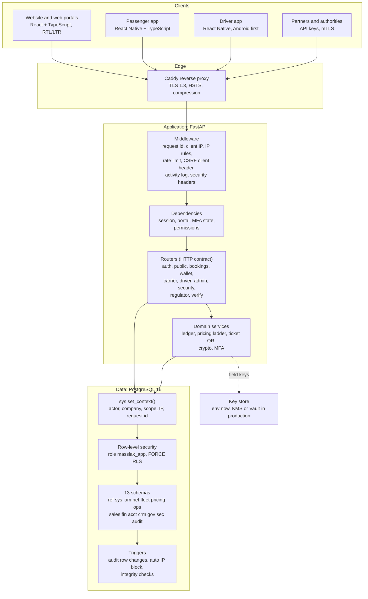
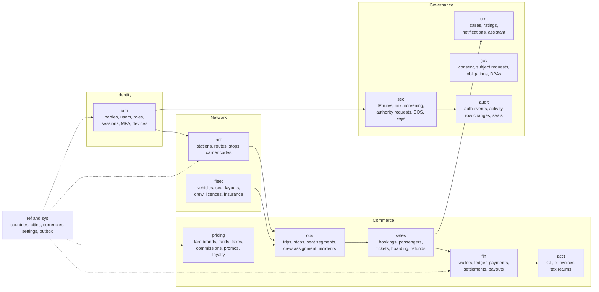
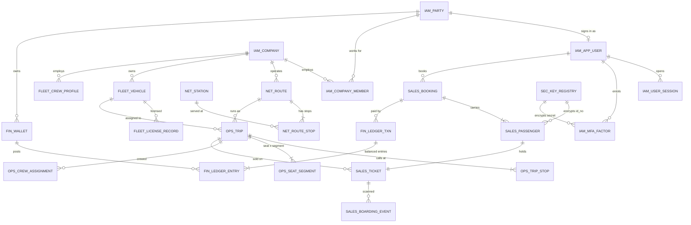
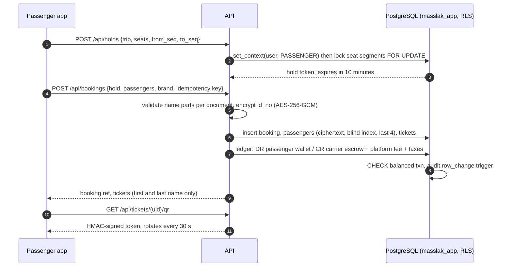
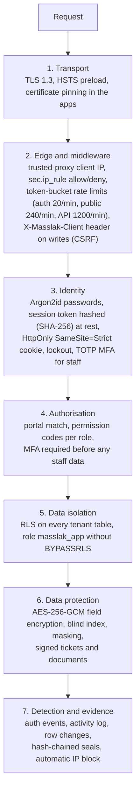
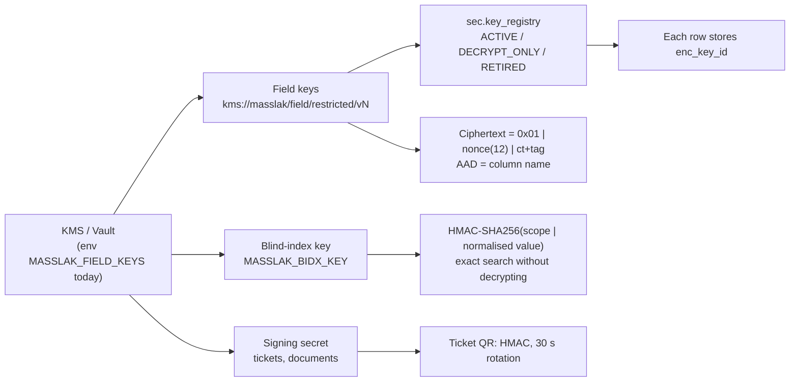
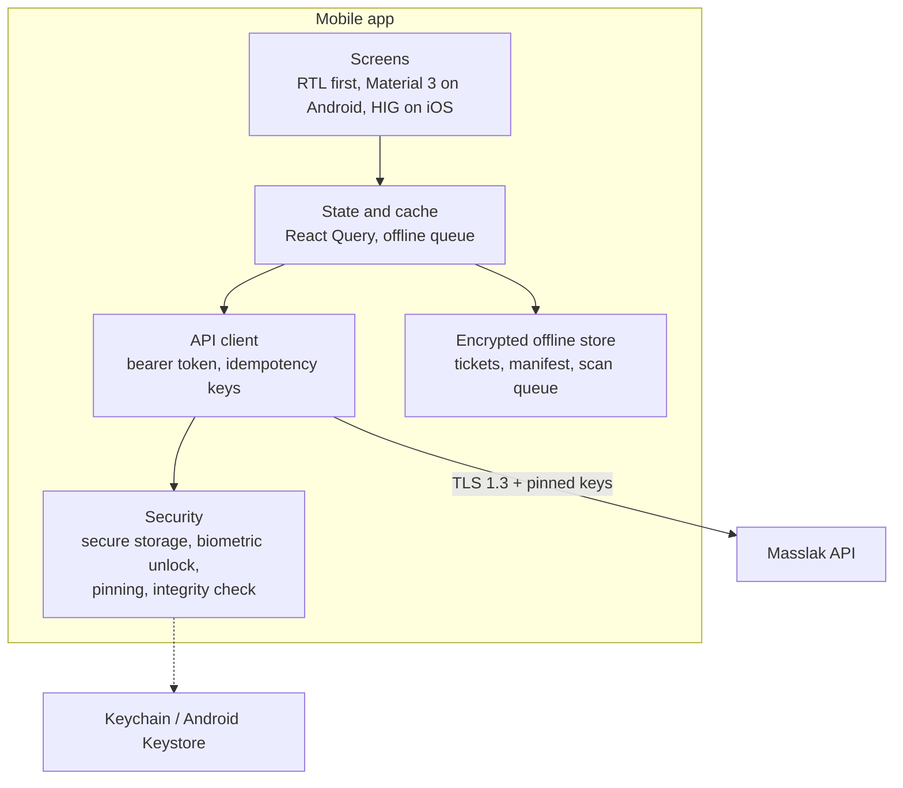

# Masslak system architecture

Version 1.0, 4 October 2026. Based on the Analysis and Design Study v2.5 (English), the Use Case and Data Flow Diagrams v1.0 and the repository as it stands on branch `claude/land-shipping-development-dz68oz`.

This document answers four questions:

1. How the system is layered, and which module owns which data.
2. How the modules connect to the database (the integration map).
3. How data is protected: encryption, identity, isolation, audit and abuse control.
4. What is built, what is missing for Phase 1, and how the web system and the mobile apps are finished.

Code, database objects and this document are in English only. Arabic exists only in the interface locale files (`frontend/src/i18n/ar.ts`, and later the mobile locale files), rendered right to left.

---

## 1. Layers



### Responsibilities per layer

| Layer | Owns | Must never |
| --- | --- | --- |
| Client | Presentation, locale and direction, offline cache of tickets | Hold secrets other than its own session; compute prices or balances |
| Edge (Caddy) | TLS termination, HSTS, request size limits, `X-Forwarded-For` | Make access decisions |
| Middleware (`app/middleware.py`) | Request id, trusted client IP, IP allow/deny (`sec.ip_rule`), rate limits (`app/ratelimit.py`), client header for writes, activity log | Read business tables |
| Dependencies (`app/deps.py`) | Loading the principal from the hashed session token; portal, MFA and permission checks | Trust anything the client claims about its role |
| Routers (`app/routers/*`) | Input validation (Pydantic), HTTP status and error codes, one transaction per request | Build SQL from strings; call another router |
| Domain services (`app/ledger.py`, `app/crypto.py`, `app/mfa.py`, `app/security.py`, `app/util.py`) | Rules shared across routers: double-entry posting, encryption, OTP, signed tokens, ticket names | Know about HTTP |
| Database | The final word on isolation (RLS), integrity (constraints, exclusion constraints), and audit (triggers) | Depend on the application to enforce tenant isolation |

The rule that makes the layers hold: every query runs inside `db.transaction(context)`, which connects as the low-privilege role `masslak_app` and first calls `sys.set_context()`. If an application bug forgets a `WHERE company_id = ...`, RLS still returns only the caller's rows.

### Target code structure for new modules

The first modules put SQL directly in the routers. That was fine for proving the flows. From now on, every new module and every module that grows past one screen follows this structure, and existing modules move to it as they are touched:

```
backend/app/
  modules/
    <module>/
      api.py          # router: request and response models, status codes, permission checks
      service.py      # use cases: one function per use case, takes a connection and a principal
      repository.py   # SQL only, returns records; no business decisions
      models.py       # Pydantic input and output models
      errors.py       # module error codes (stable, used by the UI locale files)
  core/               # config, db, deps, middleware, errors, crypto, mfa, ratelimit, security
```

Dependencies only point inward: `api -> service -> repository -> db`. Services of one module call another module only through that module's `service.py`, never its repository or tables. That keeps data ownership (section 2) enforceable in code review.

---

## 2. Modules and data ownership

Each module owns its schema. Other modules read through views or service calls and never write another module's tables.



| Module | Schema | API prefix | Portal(s) | State |
| --- | --- | --- | --- | --- |
| Identity and access | `iam` | `/api/auth` | all | Built: register, login, sessions, lockout, TOTP MFA, recovery codes |
| Reference data | `ref`, `sys` | `/api/ref`, `/api/admin/stations` | public, admin | Built |
| Carrier onboarding | `iam.company`, `iam.document` | `/api/admin/companies` | admin | Partly built: create and approve; document review missing |
| Network | `net` | `/api/carrier/routes`, `/stations` | carrier | Built: routes with fare ladders |
| Fleet and crew | `fleet` | `/api/carrier/vehicles`, `/crew` | carrier | Built: vehicles with insurance checks, drivers |
| Scheduling | `ops` | `/api/carrier/trips`, `/api/driver/*` | carrier, driver | Built: create, publish, manifest, stop events, location, complete |
| Search | `ops` (read) | `/api/trips/search` | public | Built: segment search with pair fares |
| Booking and tickets | `sales` | `/api/holds`, `/api/bookings`, `/api/tickets` | passenger | Built: holds, booking, cancel and refund by brand, rotating QR |
| Wallet and ledger | `fin` | `/api/wallet` | passenger, carrier | Built: wallet, double-entry ledger, escrow release on completion |
| Settlements and payouts | `fin.settlement_*`, `fin.payout*` | — | carrier, finance | Not built |
| Payments (gateways) | `fin.payment*` | `/api/payments/*` | passenger | Not built (sandbox top-up only) |
| Agency sales | `iam.company` (AGENCY), `pricing.commission_*` | `/api/agency/*` | agency | Not built |
| Notifications | `crm.notification*`, `sys.outbox_event` | — | all | Not built |
| Support cases | `crm.case*` | — | passenger, admin | Not built |
| Privacy | `gov.consent`, `gov.subject_request` | — | passenger, admin | Not built |
| Security hub | `sec`, `audit` | `/api/security/*` | platform security | Built: summary, IP rules, auth events, activity |
| Regulator | views over `ops`, `sales`, `fin` | `/api/regulator/*` | regulator | Built: read-only dashboard |
| Verification | signed tokens | `/api/verify` | public | Built: ticket and document authenticity |
| Accounting and e-invoice | `acct` | — | finance | Schema only (Phase 1 sprint c to e) |

---

## 3. Database integration map

The schema has 13 business schemas and 183 tables in 16 migrations (`db/schema/000` to `980`). The diagram shows the relationships that the Phase 1 flows use.



### How a booking touches the database



### Integration rules

* **One transaction per request.** Holds, bookings, refunds and ledger postings commit or roll back together.
* **Seat inventory is per segment.** `ops.seat_segment` has one row per seat and segment, so a seat sold Damascus to Homs is still sold Homs to Aleppo.
* **Money is integers in the minor unit** (`bigint`, SYP x 100), posted only as balanced double entries in `fin.ledger_entry`.
* **Idempotency keys** on bookings and top-ups, so a mobile retry on a weak network never charges twice.
* **Exclusion constraints** stop a vehicle or a driver being assigned to overlapping trips.
* **Events leave through `sys.outbox_event`**, written in the same transaction as the change, and are published by a worker. Notifications, webhooks and ERP sync all read the outbox; nothing calls an external system inside a request.
* **Extensible lists are reference tables** (`ref.party_role_type`, `ref.trip_type`, `ref.vehicle_class`, `ref.station_subtype`, `ref.cargo_category`), referenced by foreign keys. The platform adds a value as a row; system values cannot be deleted (schema file 1003, study annex D.4).

### Readiness for later modules (study annex D, schema file 1003)

* **Passenger transit across Syria:** trip type `TRANSIT_PAX`, `net.corridor` and `net.approved_rest_stop`, `ops.trip_crossing_plan` (border entry and exit points, border stations only), append-only `ops.crossing_event`, `ops.transit_reconciliation`, and `sales.ticket.travel_category`.
* **Contracted transport for schools, universities and employers:** its own schema `ctr` (contracts, routes, riders, authorised receivers, attendance, invoices), visible only to the carrier and the client institution.
* **Transit trucks:** `ref.cargo_category` with hazard and temperature flags.
* All of it is disabled by the `transit_passengers`, `contract_transport` and `cargo` feature flags until its phase.

---

## 4. Security architecture

### 4.1 Defence in depth



### 4.2 Data classification and handling

| Class | Examples | At rest | In responses | In logs |
| --- | --- | --- | --- | --- |
| Restricted | Identity document numbers, MFA secrets, recovery codes, biometric templates | AES-256-GCM per field, key id per row, column bound as associated data | Last 4 digits only | Never |
| Confidential | Names, phone, email, trips taken, wallet balance | Disk encryption, RLS | Only to the owner and the operating carrier | Hashed identifiers only (`identifier_hash`) |
| Internal | Fleet, routes, tariffs | Disk encryption, RLS by company | Company members | Yes |
| Public | Stations, published trips, verification result | — | Anyone | Yes |

### 4.3 Encryption and keys



* The database stores key references only. Key material never enters PostgreSQL, backups or logs.
* Rotation: register vN+1 as `ACTIVE`, move vN to `DECRYPT_ONLY`, re-encrypt in the background, then retire vN. Rows always name their own key, so rotation needs no downtime.
* Binding the column name as associated data means a ciphertext copied into another column fails authentication.
* The test `test_document_number_never_reaches_the_database_in_plaintext` proves that the document number does not appear anywhere in the passenger row.

### 4.4 Identity and sessions

* Passwords: Argon2id; at least 12 characters and a deny list of common passwords, with no composition rules (NIST 800-63B, `password_problem`). A breached-password check is planned.
* Sessions: 256-bit random tokens; only their SHA-256 hash is stored in `iam.user_session`. A database leak gives no usable session.
* Web: HttpOnly, Secure, SameSite=Strict cookie, plus a mandatory `X-Masslak-Client` header on every write, which a cross-site form cannot send.
* Mobile: the same token as a bearer header, held in the Keychain or Android Keystore (section 6), never in plain storage.
* MFA: TOTP (RFC 6238), secret encrypted at rest, replay refused by remembering the last used step, 10 single-use recovery codes stored hashed, session revoked after 5 wrong codes. Mandatory for platform staff outside the sandbox and for any account flagged `mfa_required`.
* Lockout and automatic blocking: repeated failures lock the account; 30 failed sign-ins from one address in 60 minutes create a temporary deny rule (`sec.auto_block_ip`).

### 4.5 Audit and evidence

* `audit.auth_event`: every sign-in, failure, MFA step and revocation.
* `audit.activity_log`: every API call with actor, IP, request id, status and duration.
* `audit.row_change`: trigger-written before and after images for sensitive tables, with a SHA-256 row hash.
* `audit.log_seal`: blocks of log rows are sealed in a signed hash chain, so deletion or editing is detectable. Retention drops partitions only after sealing and archiving.

### 4.6 Secure development rules

1. Parameterised SQL only (`$1`, `$2`). No string-built queries.
2. Every input has a Pydantic model with length and pattern limits.
3. Error responses carry a stable code and no stack trace or SQL.
4. Secrets come from the environment; `.env*` files are never committed.
5. Dependencies are pinned. A CI pipeline (not set up yet, part of increment 7) will run `pip-audit`, `npm audit`, a SAST scan and the end-to-end suite on each push.
6. Every security control has a test: headers, portal mismatch, RLS cross-tenant read, lockout, MFA, encryption at rest, QR forgery and rate limiting.

---

## 5. Gap analysis for Phase 1 and build increments

Phase 1 is planned as five sprints (study section 22.2). The table compares the repository with each sprint goal.

| Sprint | Goal | Built | Missing |
| --- | --- | --- | --- |
| a: core | Identity, roles, companies, documents, audit | Auth, roles, sessions, MFA, company create and approve, audit and seals, IP rules | Company document upload and review, user management in the carrier portal, voluntary MFA settings page |
| b: fleet | Fleet, stations, routes, trip patterns | Vehicles, crew, routes with fare ladders, trips, publishing | Seat layout editor, trip templates (recurring), licence expiry alerts |
| c: booking and money | Search, holds, pricing, tickets, wallet, ledger | Segment search, holds, booking, refund by brand, wallet, ledger, escrow | Payment gateway adapter, settlements and payouts, tax and commission allocation, promo codes |
| d: operations | Driver app, QR boarding, manifest, reports | Driver web screens, scan, stop events, location, manifest | Native driver app with offline scan queue, incidents and SOS, carrier reports |
| e: hardening | Review, performance, security testing | Security headers, rate limits, encryption, repeatable tests | Load test, penetration test, backup and restore drill, monitoring and alerting |

### Increments to finish the web system

Each increment ends with green tests and a pushed commit.

1. **Agency portal.** Agency company type, quota, sell on behalf of a passenger, commission posting to the ledger, statements.
2. **Settlements and payouts.** Daily settlement batch per carrier from released escrow, payout requests with four-eyes approval, bank reconciliation import.
3. **Company documents and approvals.** Upload (virus-scanned, size and type limits, stored outside the database with a hash), admin review queue, expiry tracking.
4. **Notifications through the outbox.** Booking, cancellation, trip change and payout events to email, SMS and push; templates in English and Arabic locale files.
5. **Account security page.** Voluntary MFA for passengers, active sessions with remote sign-out, device list.
6. **Privacy self-service.** Consent records, data export and deletion requests (`gov.subject_request`).
7. **Hardening pass.** Move routers to the module structure in section 1, a CI pipeline with dependency and SAST scans, OpenAPI contract tests, load test on search and booking.

---

## 6. Mobile apps

### 6.1 Choice

Two apps from one React Native (TypeScript) code base, built with Expo:

* **Masslak** for passengers and shuttle riders (iOS and Android).
* **Masslak Driver** for drivers and hosts (Android first).

Reasons: the web front end is React and TypeScript, so API types, error codes, locale files and validation rules are shared; one mobile team can ship both platforms; Expo gives secure storage, camera scanning, biometrics and over-the-air updates with code signing.



### 6.2 Mobile security controls

| Threat | Control |
| --- | --- |
| Token theft from the device | Session token in Keychain (iOS) or Keystore-backed EncryptedSharedPreferences (Android); never in AsyncStorage |
| Stolen unlocked phone | Biometric or PIN unlock for the wallet and tickets after 5 minutes in the background; remote sign-out from the web |
| Network interception | TLS 1.3 with public-key pinning of the API certificate (with a backup pin) |
| Tampered or repackaged app | Play Integrity and App Attest checks on sign-in and payment; server refuses unattested clients for money operations |
| Rooted or jailbroken device | Warning for passengers; the driver app refuses to run boarding |
| Offline ticket forgery | Tickets stored encrypted; the QR still carries the server HMAC so a copied screenshot expires within 30 seconds once online verification is used, and the driver app checks signatures offline with a public verification key |
| Replay of payments | Idempotency key per payment, generated on the device and stored until confirmed |
| Data left behind | Cache cleared on sign-out; screenshots blocked on the wallet and recovery code screens |
| Location misuse | Location requested with the explanation from the study; used only for shuttle fare and driver tracking; never sold or shared outside the legal basis |

### 6.3 Backend changes the apps need

1. Bearer-token sign-in for `X-Masslak-Client: ios` or `android`, alongside the web cookie, with a device record in `iam.device` and push tokens in `iam.push_token`.
2. Refresh tokens bound to the device, short-lived access tokens (15 minutes).
3. Offline ticket verification: tickets also signed with an Ed25519 key, so the driver app can verify without the server secret.
4. Driver offline scan queue endpoint that accepts a batch with device timestamps and resolves duplicates.
5. Attestation verification endpoint for money operations.

### 6.4 Screens (from the prototype canvas)

Passenger: Home, Search results, Seat selection, Passenger details and checkout, Ticket, Trips, Wallet, Account, Shuttle live ride. Driver: Today, Boarding scan, Route, Incidents and SOS, Profile.

### 6.5 Status

Built (`mobile/`, see `mobile/README.md`): backend items 1 to 4 of 6.3; passenger search, seat selection on the
carrier's real layout, names, wallet payment, bookings, offline ticket; driver trips, offline pack, camera boarding
online and offline with a synced queue; app lock, screen-capture blocking, pinning, root detection, keystore-only
storage; English and Arabic. Layers: `core` (pure, Node-tested), `platform`, `ui`, `app` (routes), `i18n`.

Not yet built: attestation (6.3 item 5, Play Integrity and App Attest), push notification delivery to devices,
shuttle live ride, incidents and SOS, the driver route screen. The apps have been type-checked, unit-tested and
bundled for both platforms in CI, but have not yet been run on physical devices.

---

## 7. Running and testing

```
docker compose up            # PostgreSQL, API, web, Caddy
cd backend && pytest tests   # 83 tests: unit and end to end against a running API
db/tests/run.sh              # 87 schema checks
cd mobile && npm test        # core unit tests of the apps
```

The end-to-end suite is self-sufficient: each run uses its own test address and publishes its own trip when the demo week runs out.
