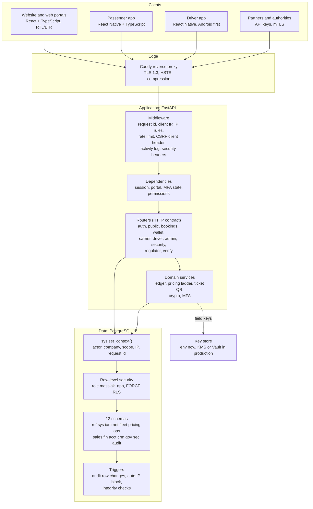
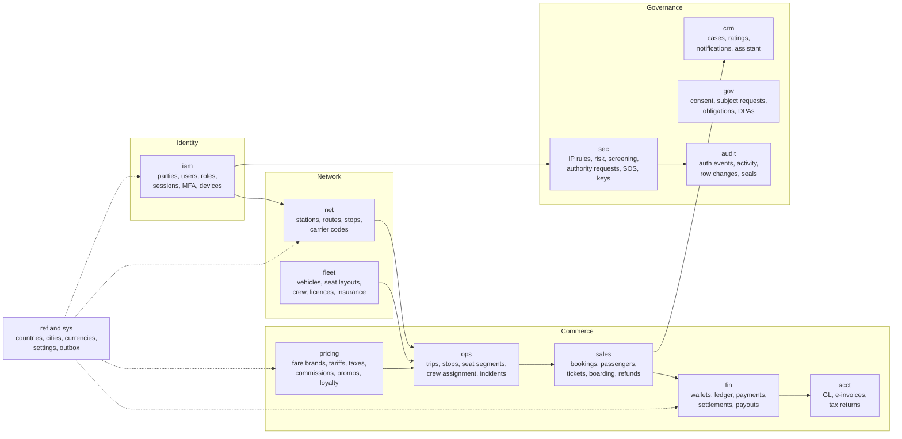
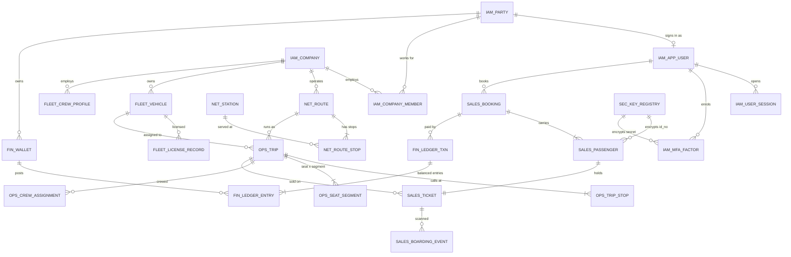
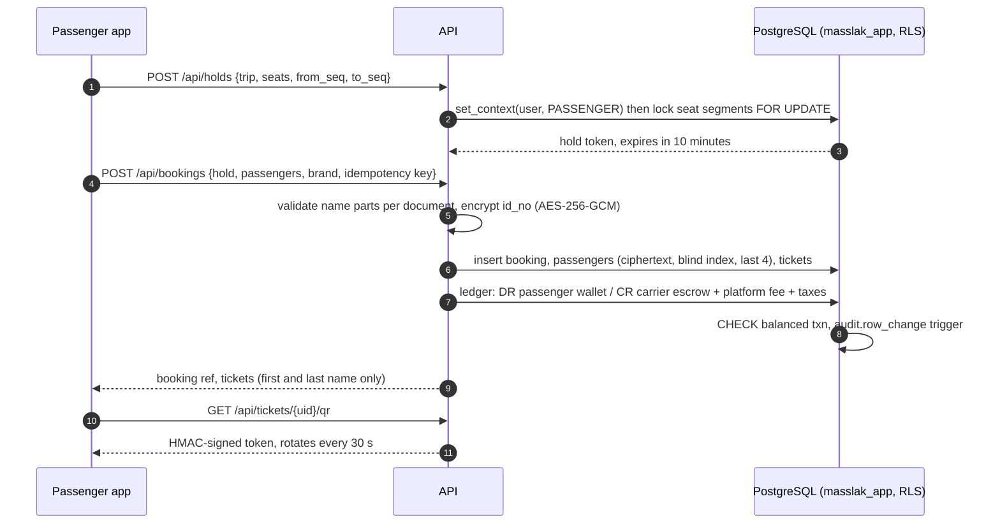
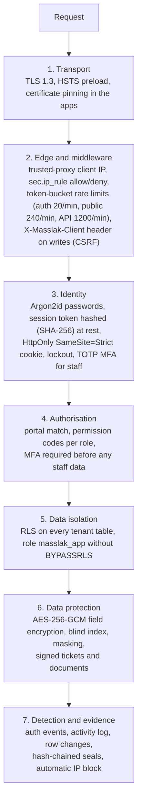
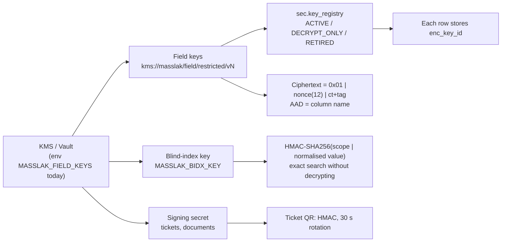
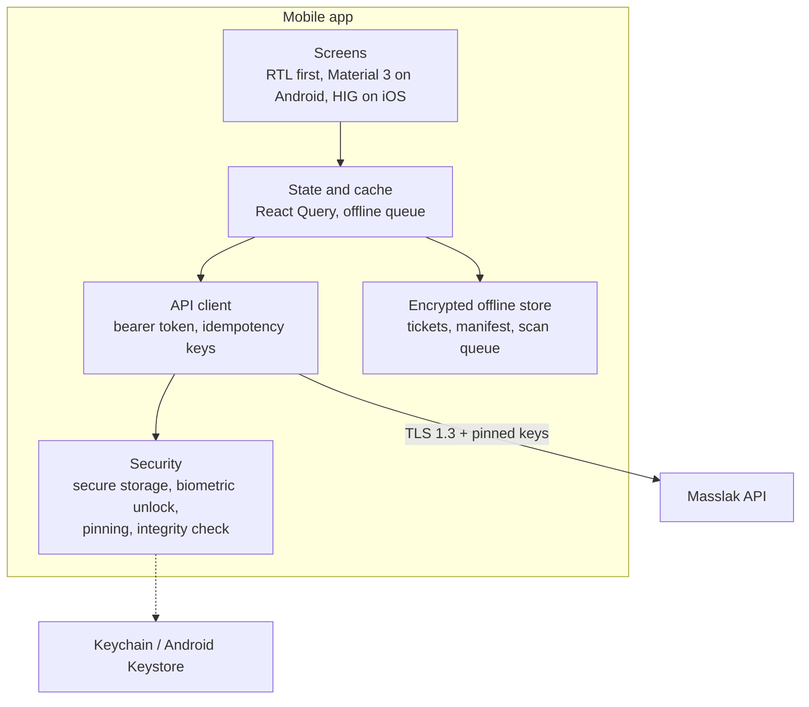

# Masslak system architecture

Version 1.0, 4 October 2026. Based on the Analysis and Design Study v2.6 (English; v2.5 plus appendix D, additional phases 13 to 15), the Use Case and Data Flow Diagrams v1.0 and the repository as it stands on branch `claude/land-shipping-development-dz68oz`.

This document answers four questions:

1. How the system is layered, and which module owns which data.
2. How the modules connect to the database (the integration map).
3. How data is protected: encryption, identity, isolation, audit and abuse control.
4. What is built, what is missing for Phase 1, and how the web system and the mobile apps are finished.

Code, database objects and this document are in English only. Arabic exists only in the interface locale files (`frontend/src/i18n/ar.ts`, and later the mobile locale files), rendered right to left.

---

## 1. Layers



### Responsibilities per layer

| Layer | Owns | Must never |
| --- | --- | --- |
| Client | Presentation, locale and direction, offline cache of tickets | Hold secrets other than its own session; compute prices or balances |
| Edge (Caddy) | TLS termination, HSTS, request size limits, `X-Forwarded-For` | Make access decisions |
| Middleware (`app/middleware.py`) | Request id, trusted client IP, IP allow/deny (`sec.ip_rule`), rate limits (`app/ratelimit.py`), client header for writes, activity log | Read business tables |
| Dependencies (`app/deps.py`) | Loading the principal from the hashed session token; portal, MFA and permission checks | Trust anything the client claims about its role |
| Routers (`app/routers/*`) | Input validation (Pydantic), HTTP status and error codes, one transaction per request | Build SQL from strings; call another router |
| Domain services (`app/ledger.py`, `app/crypto.py`, `app/mfa.py`, `app/security.py`, `app/util.py`) | Rules shared across routers: double-entry posting, encryption, OTP, signed tokens, ticket names | Know about HTTP |
| Database | The final word on isolation (RLS), integrity (constraints, exclusion constraints), and audit (triggers) | Depend on the application to enforce tenant isolation |

The rule that makes the layers hold: every query runs inside `db.transaction(context)`, which connects as the low-privilege role `masslak_app` and first calls `sys.set_context()`. If an application bug forgets a `WHERE company_id = ...`, RLS still returns only the caller's rows.

### Target code structure for new modules

The first modules put SQL directly in the routers. That was fine for proving the flows. From now on, every new module and every module that grows past one screen follows this structure, and existing modules move to it as they are touched:

```
backend/app/
  modules/
    <module>/
      api.py          # router: request and response models, status codes, permission checks
      service.py      # use cases: one function per use case, takes a connection and a principal
      repository.py   # SQL only, returns records; no business decisions
      models.py       # Pydantic input and output models
      errors.py       # module error codes (stable, used by the UI locale files)
  core/               # config, db, deps, middleware, errors, crypto, mfa, ratelimit, security
```

Dependencies only point inward: `api -> service -> repository -> db`. Services of one module call another module only through that module's `service.py`, never its repository or tables. That keeps data ownership (section 2) enforceable in code review.

---

## 2. Modules and data ownership

Each module owns its schema. Other modules read through views or service calls and never write another module's tables.



| Module | Schema | API prefix | Portal(s) | State |
| --- | --- | --- | --- | --- |
| Identity and access | `iam` | `/api/auth` | all | Built: register, login, sessions, lockout, TOTP MFA, recovery codes |
| Reference data | `ref`, `sys` | `/api/ref`, `/api/admin/stations` | public, admin | Built |
| Carrier onboarding | `iam.company`, `iam.document` | `/api/admin/companies` | admin | Partly built: create and approve; document review missing |
| Network | `net` | `/api/carrier/routes`, `/stations` | carrier | Built: routes with fare ladders |
| Fleet and crew | `fleet` | `/api/carrier/vehicles`, `/crew` | carrier | Built: vehicles with insurance checks, drivers |
| Scheduling | `ops` | `/api/carrier/trips`, `/api/driver/*` | carrier, driver | Built: create, publish, manifest, stop events, location, complete |
| Search | `ops` (read) | `/api/trips/search` | public | Built: segment search with pair fares |
| Booking and tickets | `sales` | `/api/holds`, `/api/bookings`, `/api/tickets` | passenger | Built: holds, booking, cancel and refund by brand, rotating QR |
| Wallet and ledger | `fin` | `/api/wallet` | passenger, carrier | Built: wallet, double-entry ledger, escrow release on completion |
| Settlements and payouts | `fin.settlement_*`, `fin.payout*` | — | carrier, finance | Not built |
| Payments (gateways) | `fin.payment*` | `/api/payments/*` | passenger | Not built (sandbox top-up only) |
| Agency sales | `iam.company` (AGENCY), `pricing.commission_*` | `/api/agency/*` | agency | Not built |
| Notifications | `crm.notification*`, `sys.outbox_event` | — | all | Not built |
| Support cases | `crm.case*` | — | passenger, admin | Not built |
| Privacy | `gov.consent`, `gov.subject_request` | — | passenger, admin | Not built |
| Security hub | `sec`, `audit` | `/api/security/*` | platform security | Built: summary, IP rules, auth events, activity |
| Regulator | views over `ops`, `sales`, `fin` | `/api/regulator/*` | regulator | Built: read-only dashboard |
| Verification | signed tokens | `/api/verify` | public | Built: ticket and document authenticity |
| Accounting and e-invoice | `acct` | — | finance | Schema only (Phase 1 sprint c to e) |

---

## 3. Database integration map

The schema has 26 schemas and 502 tables in the files `db/schema/000` to `1079` (release 1.48.0; later-phase modules are disabled behind feature flags and phase gates). The full design, with an ERD per module in the study's colours, is `docs/database/Masslak_Database_Design_and_ERD_v3.12.docx`; file 1033 enforces its relationship rules (primary keys, declared and indexed foreign keys), checked by db/tests. The diagram shows the relationships that the Phase 1 flows use.



### How a booking touches the database



### Integration rules

* **One transaction per request.** Holds, bookings, refunds and ledger postings commit or roll back together.
* **Seat inventory is per segment.** `ops.seat_segment` has one row per seat and segment, so a seat sold Damascus to Homs is still sold Homs to Aleppo.
* **Money is integers in the minor unit** (`bigint`, SYP x 100), posted only as balanced double entries in `fin.ledger_entry`.
* **Idempotency keys** on bookings and top-ups, so a mobile retry on a weak network never charges twice.
* **Exclusion constraints** stop a vehicle or a driver being assigned to overlapping trips.
* **Events leave through `sys.outbox_event`**, written in the same transaction as the change, and are published by a worker. Notifications, webhooks and ERP sync all read the outbox; nothing calls an external system inside a request.
* **Extensible lists are reference tables** (`ref.party_role_type`, `ref.trip_type`, `ref.vehicle_class`, `ref.station_subtype`, `ref.cargo_category`), referenced by foreign keys. The platform adds a value as a row; system values cannot be deleted (schema file 1003, study appendix D.4).

### Readiness for later modules (study appendix D, schema file 1003)

* **Passenger transit across Syria:** trip type `TRANSIT_PAX`, `net.corridor` and `net.approved_rest_stop`, `ops.trip_crossing_plan` (border entry and exit points, border stations only), append-only `ops.crossing_event`, `ops.transit_reconciliation`, and `sales.ticket.travel_category`.
* **Contracted transport for schools, universities and employers:** its own schema `ctr` (contracts, routes, riders, authorised receivers, attendance, invoices), visible only to the carrier and the client institution.
* **Transit trucks:** `ref.cargo_category` with hazard and temperature flags.
* All of it is disabled by the `transit_passengers`, `contract_transport` and `cargo` feature flags until its phase.

---

## 4. Security architecture

### 4.1 Defence in depth



### 4.2 Data classification and handling

| Class | Examples | At rest | In responses | In logs |
| --- | --- | --- | --- | --- |
| Restricted | Identity document numbers, MFA secrets, recovery codes, biometric templates | AES-256-GCM per field, key id per row, column bound as associated data | Last 4 digits only | Never |
| Confidential | Names, phone, email, trips taken, wallet balance | Disk encryption, RLS | Only to the owner and the operating carrier | Hashed identifiers only (`identifier_hash`) |
| Internal | Fleet, routes, tariffs | Disk encryption, RLS by company | Company members | Yes |
| Public | Stations, published trips, verification result | — | Anyone | Yes |

### 4.2a Row-level security coverage

Every table that holds company or booking rows has a policy, and `db/tests` fails the build if a new one does not.
Policies follow five patterns (helpers in `1010_model_helpers.sql`, coverage completed in `1037_rls_coverage.sql`):

| Pattern | Who sees the rows | Examples |
| --- | --- | --- |
| Tenant | The owning company and the platform | fleet, settlements, GL periods, carrier codes |
| Parent | Whoever sees the parent row | passengers, tickets, allocations and refunds of a booking |
| Trip operations | The trip's company and the platform | crew, stop events, trip changes, manifests |
| Catalog | Everyone reads, only the platform writes | reference lists, tax schemes, payment providers |
| Platform | Platform staff only | governance registers, screening, watchlists, fraud cases |

Since file 1039 (database architecture review, study 16.27) no table is left to the application layer: every table has
row-level security and a data class in `sys.table_class` (public catalog, platform confidential, company private,
personal, restricted security, append-only audit, system), and `sys.v_security_inventory` shows class, owner path, RLS,
owner and privileges in one query. Sign-in reads accounts, factors and sessions in a narrow `AUTH` scope; an empty
context sees no account, session or person. Timetable rows of published trips are public through their trip; a passenger
may take a free seat or free their own hold, and only the sale marks a seat sold. Ledger rows follow their wallet.
Reporting has no access to restricted tables, and row security is forced on credentials, factors and biometrics.
Validation triggers run as the owner with a fixed search path, so a rule sees the rows it checks. Tables of a module
whose switch is off are closed by a restrictive policy (`sys.module_gate`). Reads of restricted values (document numbers
for authorities, IBANs for payouts) pass `sec.authorize` (`backend/app/policy.py`), which records purpose, reason and
decision in `sec.policy_decision`. Sources of truth (study 16.28): seats live only in PostgreSQL, and the ledger stays in
schema `fin` of the same database, written in the booking's transaction.

File 1040 (integrity audit, `docs/database/INTEGRITY_AUDIT.md`) makes related rows agree: a ticket, its booking, its
passenger and its sold seats share one trip (composite foreign keys); manifests list tickets of their own trip; a cargo
leg rides its carrier's trip; a payment draws only on the payer's own wallet; a vehicle serves its owner or an active
lessee. Concurrent transactions lock seats, then the booking, the payment and wallets in ascending id, so they queue
instead of deadlocking (`docs/database/STANDARDS.md`).

File 1041 divides the model by project phase: every table carries the phase that brings it into use (`sys.table_phase`,
releases 1A and 1B before launch, phases 2 to 14 after it). Data only depends backwards: every later phase needs only 1A
and 1B (phase 8 also needs phase 3), so the order of the phases after launch is a business decision. File 1042 records
the owner's decisions: the contact center and the AI assistant come in a later phase (support starts on cases from
WhatsApp and email), and the shuttle is a phase of its own opened city by city (`sys.city_rollout`).
Files 1043 to 1045 add route compliance and school transport (`docs/database/ROUTE_COMPLIANCE_AND_SCHOOL.md`). Every
licence, tracking source and reporting duty a regulator may impose is registered in `sys.compliance_requirement` and
switched OFF, OPTIONAL or REQUIRED by configuration, so a new government rule needs no release. Shuttle vehicles are
bound to their approved line; deviations are detected by the tracking service from the driver's phone, confirmed with
PostGIS (`ops.route_distance_m`) and reported to authorities only when required and only while the vehicle is in
service. School transport is its own phase (schema `sch`), with hand-over and empty-bus rules held by the database.
File 1046 answers the third-party technical audit (`docs/database/THIRD_PARTY_AUDIT.md`): phone numbers of passengers and
family members are encrypted and a person's contact lives only on their account; every polymorphic reference is
registered and swept weekly for orphans; and every table of a phase whose switch is off is closed in the database itself
(`phase_gate`), not only by the application.
File 1047 closes the remaining audit items: schema changes are logged and security-relevant ones made outside a migration
raise an alert; every JSONB column has a registered contract or kind, and sold prices are frozen; the lifecycle matrix
drives purging; and the permission matrix documents every policy. Operations procedures (restore, failover, migrations,
key rotation, the audit archive with object lock, load testing) are in `docs/operations/RUNBOOKS.md`.
File 1048 answers the technical audit of design 3.7 (`docs/database/DESIGN_AUDIT_T3.md`):
- **References:** signatures, ledger transactions, family spending and legal holds check the row they name when written.
- **Break-glass:** access expires on its own, needs a second person and cannot be rewritten.
- **Positions:** daily partitions match the 7-day retention; each position carries device evidence and a trust grade,
  and a violation on low-trust evidence needs a person's review.
- **Requirements:** a regulatory requirement changes only with a second administrator's approval.
- **Files:** uploads stay in quarantine until the scanner clears them.
- **Events:** outbox events carry a schema version, correlation id and per-record sequence (`docs/integration/EVENTS.md`).

File 1049 and the operations tooling answer the re-audit of design 3.8 (`docs/database/DESIGN_AUDIT_T3_RECHECK.md`):
- **Outbound traffic:** leaves only through an egress proxy (`deploy/egress`).
- **Monitoring:** `/api/metrics` feeds alert rules and SLOs (`deploy/monitoring`, `docs/operations/SLO.md`).
- **Recovery and migrations:** both are rehearsed and measured (`db/tools/restore_drill.py`,
  `db/tools/migration_rehearsal.py`).
- **Sensitive reports:** they travel as personal links.
- **Positions:** they carry the device that sent them.
- **Resends of money events:** they need a second person's approval.

Company isolation (study 16.26, file 1038): `backend/tests/test_isolation.py` signs in as every company under the
application role and counts the rows of other companies in every table that has a company column. The only rows allowed
are listed in the test with the reason (public catalog data, or the two parties of one deal); a new table without a
policy fails it. Carriers reach the freight market through `frt.open_loads()`, which hides the shipper until award.

### 4.3 Encryption and keys



* The database stores key references only. Key material never enters PostgreSQL, backups or logs.
* Rotation: register vN+1 as `ACTIVE`, move vN to `DECRYPT_ONLY`, re-encrypt in the background, then retire vN. Rows always name their own key, so rotation needs no downtime.
* Binding the column name as associated data means a ciphertext copied into another column fails authentication.
* The test `test_document_number_never_reaches_the_database_in_plaintext` proves that the document number does not appear anywhere in the passenger row.

### 4.4 Identity and sessions

* Passwords: Argon2id; at least 12 characters and a deny list of common passwords, with no composition rules (NIST 800-63B, `password_problem`). A breached-password check is planned.
* Sessions: 256-bit random tokens; only their SHA-256 hash is stored in `iam.user_session`. A database leak gives no usable session.
* Web: HttpOnly, Secure, SameSite=Strict cookie, plus a mandatory `X-Masslak-Client` header on every write, which a cross-site form cannot send.
* Mobile: the same token as a bearer header, held in the Keychain or Android Keystore (section 6), never in plain storage.
* MFA: TOTP (RFC 6238), secret encrypted at rest, replay refused by remembering the last used step, 10 single-use recovery codes stored hashed, session revoked after 5 wrong codes. Mandatory for platform staff outside the sandbox and for any account flagged `mfa_required`.
* Lockout and automatic blocking: repeated failures lock the account; 30 failed sign-ins from one address in 60 minutes create a temporary deny rule (`sec.auto_block_ip`).

### 4.5 Audit and evidence

* `audit.auth_event`: every sign-in, failure, MFA step and revocation.
* `audit.activity_log`: every API call with actor, IP, request id, status and duration.
* `audit.row_change`: trigger-written before and after images for sensitive tables, with a SHA-256 row hash.
* `audit.log_seal`: blocks of log rows are sealed in a signed hash chain, so deletion or editing is detectable. Retention drops partitions only after sealing and archiving.

### 4.6 Secure development rules

1. Parameterised SQL only (`$1`, `$2`). No string-built queries.
2. Every input has a Pydantic model with length and pattern limits.
3. Error responses carry a stable code and no stack trace or SQL.
4. Secrets come from the environment; `.env*` files are never committed.
5. Dependencies are pinned. A CI pipeline (not set up yet, part of increment 7) will run `pip-audit`, `npm audit`, a SAST scan and the end-to-end suite on each push.
6. Every security control has a test: headers, portal mismatch, RLS cross-tenant read, lockout, MFA, encryption at rest, QR forgery and rate limiting.

---

## 5. Gap analysis for Phase 1 and build increments

Phase 1 is planned as five sprints (study section 22.2). The table compares the repository with each sprint goal.

| Sprint | Goal | Built | Missing |
| --- | --- | --- | --- |
| a: core | Identity, roles, companies, documents, audit | Auth, roles, sessions, MFA, company create and approve, audit and seals, IP rules | Company document upload and review, user management in the carrier portal, voluntary MFA settings page |
| b: fleet | Fleet, stations, routes, trip patterns | Vehicles, crew, routes with fare ladders, trips, publishing | Seat layout editor, trip templates (recurring), licence expiry alerts |
| c: booking and money | Search, holds, pricing, tickets, wallet, ledger | Segment search, holds, booking, refund by brand, wallet, ledger, escrow | Payment gateway adapter, settlements and payouts, tax and commission allocation, promo codes |
| d: operations | Driver app, QR boarding, manifest, reports | Driver web screens, scan, stop events, location, manifest | Native driver app with offline scan queue, incidents and SOS, carrier reports |
| e: hardening | Review, performance, security testing | Security headers, rate limits, encryption, repeatable tests | Load test, penetration test, backup and restore drill, monitoring and alerting |

### Increments to finish the web system

Each increment ends with green tests and a pushed commit.

1. **Agency portal.** Agency company type, quota, sell on behalf of a passenger, commission posting to the ledger, statements.
2. **Settlements and payouts.** Daily settlement batch per carrier from released escrow, payout requests with four-eyes approval, bank reconciliation import.
3. **Company documents and approvals.** Upload (virus-scanned, size and type limits, stored outside the database with a hash), admin review queue, expiry tracking.
4. **Notifications through the outbox.** Booking, cancellation, trip change and payout events to email, SMS and push; templates in English and Arabic locale files.
5. **Account security page.** Voluntary MFA for passengers, active sessions with remote sign-out, device list.
6. **Privacy self-service.** Consent records, data export and deletion requests (`gov.subject_request`).
7. **Hardening pass.** Move routers to the module structure in section 1, a CI pipeline with dependency and SAST scans, OpenAPI contract tests, load test on search and booking.

---

## 6. Mobile apps

### 6.1 Choice

Two apps from one React Native (TypeScript) code base, built with Expo:

* **Masslak** for passengers and shuttle riders (iOS and Android).
* **Masslak Driver** for drivers and hosts (Android first).

Reasons: the web front end is React and TypeScript, so API types, error codes, locale files and validation rules are shared; one mobile team can ship both platforms; Expo gives secure storage, camera scanning, biometrics and over-the-air updates with code signing.



### 6.2 Mobile security controls

| Threat | Control |
| --- | --- |
| Token theft from the device | Session token in Keychain (iOS) or Keystore-backed EncryptedSharedPreferences (Android); never in AsyncStorage |
| Stolen unlocked phone | Biometric or PIN unlock for the wallet and tickets after 5 minutes in the background; remote sign-out from the web |
| Network interception | TLS 1.3 with public-key pinning of the API certificate (with a backup pin) |
| Tampered or repackaged app | Play Integrity and App Attest checks on sign-in and payment; server refuses unattested clients for money operations |
| Rooted or jailbroken device | Warning for passengers; the driver app refuses to run boarding |
| Offline ticket forgery | Tickets stored encrypted; the QR still carries the server HMAC so a copied screenshot expires within 30 seconds once online verification is used, and the driver app checks signatures offline with a public verification key |
| Replay of payments | Idempotency key per payment, generated on the device and stored until confirmed |
| Data left behind | Cache cleared on sign-out; screenshots blocked on the wallet and recovery code screens |
| Location misuse | Location requested with the explanation from the study; used only for shuttle fare and driver tracking; never sold or shared outside the legal basis |

### 6.3 Backend changes the apps need

1. Bearer-token sign-in for `X-Masslak-Client: ios` or `android`, alongside the web cookie, with a device record in `iam.device` and push tokens in `iam.push_token`.
2. Refresh tokens bound to the device, short-lived access tokens (15 minutes).
3. Offline ticket verification: tickets also signed with an Ed25519 key, so the driver app can verify without the server secret.
4. Driver offline scan queue endpoint that accepts a batch with device timestamps and resolves duplicates.
5. Attestation verification endpoint for money operations.

### 6.4 Screens (from the prototype canvas)

Passenger: Home, Search results, Seat selection, Passenger details and checkout, Ticket, Trips, Wallet, Account, Shuttle live ride. Driver: Today, Boarding scan, Route, Incidents and SOS, Profile.

### 6.5 Status

Built (`mobile/`, see `mobile/README.md`): backend items 1 to 4 of 6.3; passenger search, seat selection on the
carrier's real layout, names, wallet payment, bookings, offline ticket; driver trips, offline pack, camera boarding
online and offline with a synced queue; app lock, screen-capture blocking, pinning, root detection, keystore-only
storage; English and Arabic. Layers: `core` (pure, Node-tested), `platform`, `ui`, `app` (routes), `i18n`.

Added since: a third variant, **Masslak Business** (`APP_VARIANT=operator`, OPERATOR portal): the carrier's day, trips
with the passenger manifest, publish and complete, and every module the role can work in through the generic resource
engine (section 8), with the website's interface names; in the passenger app, a services tab (shuttle passes with QR,
parcels and tracking, taxi, car rental, each shown only when its module is on) and every wallet top-up method of
section 10.

Not yet built: attestation (6.3 item 5, Play Integrity and App Attest), push notification delivery to devices,
shuttle live ride, incidents and SOS, the driver route screen. The apps have been type-checked, unit-tested and
bundled for both platforms in CI, but have not yet been run on physical devices.

---

## 7. Running and testing

```
docker compose up            # PostgreSQL, API, web, Caddy
cd backend && pytest tests   # 151 tests: unit and end to end against a running API
db/tests/run.sh              # 122 schema checks
cd mobile && npm test        # core unit tests of the apps
```

The end-to-end suite is self-sufficient: each run uses its own test address and publishes its own trip when the demo week runs out.

---

## 8. Switchable modules

Every service beyond the Phase 1 core can be switched on or off by a platform administrator at **Administration → Modules**.
The switch is one key of the `sys.setting` document `features`; changing it needs the `modules.manage` permission and a reason,
and is written to the audit log. A switched-off module:

- answers `404 MODULE_DISABLED` on every endpoint (the check runs before any query; switches are cached for five seconds);
- disappears from the menus of every portal (`GET /api/modules` returns only what the signed-in person may use);
- keeps all its tables and data, so switching it back on restores it exactly as it was.

### Generic resource engine

Most module screens are generated from declarative specs (`backend/app/modular/specs/`). A spec names the table, the list and
form columns, the portals with the permission each needs, ownership columns and state-machine actions. The engine reads column
types, `CHECK` choices, foreign keys and primary keys from the PostgreSQL catalog, so the API and the web forms follow the schema.

- Identifiers come only from specs; every value is a bound parameter.
- Queries run inside the caller's transaction with `sys.set_context`, so row-level security decides what each company sees.
- Company, owner, user and creator columns are filled from the session and cannot be set from the request.
- Actions declare the states they start from (`409 INVALID_STATE` otherwise); four-eyes actions refuse the record's author
  (`409 FOUR_EYES`).
- Money columns are integer minor units; the web shows pounds.

| Endpoint | Purpose |
| --- | --- |
| `GET /api/features` | public list of switched-on modules |
| `GET /api/modules` | modules and screens for the signed-in portal |
| `GET`/`PUT /api/admin/modules[/{key}]` | module switches (with reason) |
| `GET /api/r/{res}/_spec` | columns, types, choices, references, actions |
| `GET /api/r/{res}` | list with `q`, `f_<column>`, `limit`, `offset` |
| `POST /api/r/{res}`, `GET`/`PATCH`/`DELETE /api/r/{res}/{key}` | records |
| `POST /api/r/{res}/{key}/do/{action}` | state-machine action |
| `GET /api/r/{res}/lookup/{column}` | options for a reference column |
| `GET /api/m/{module}/dashboard` | dashboard of a module for the signed-in portal |

### Module dashboards

Every module opens on a dashboard (`backend/app/modular/dashboards.py`): three to five headline tiles (counts or money
totals with an optional status filter and time window), status breakdowns, a 30-day daily trend and the five latest
records. A portal sees only the widgets whose resource it may read, and every query runs under row-level security, so a
carrier sees its own numbers and the platform sees the whole market. Tiles open the screen they summarise.

### Workflows

Beyond record keeping, the modules carry the steps people take (`backend/app/modular/workflows.py`, screens in
`frontend/src/modules/workflows/`). Rules are checked in the caller's scope; bookkeeping the caller may not touch (the
operator's wallet, pass inventory) runs in the platform scope of the same transaction, with the caller still audited.

| Module | Who | Workflow |
| --- | --- | --- |
| Shuttle subscriptions | passenger | buy a plan from the wallet; subscription starts today and a QR pass is issued; one active subscription per plan |
| Cargo | passenger, public | quote by zone and weight from the published rate table, send and pay from the wallet, public tracking without names or phone numbers (`/track`) |
| Taxi | passenger | fare estimate from the city's approved meter tariff, request now or later (20 minutes to 7 days ahead), cancel while searching |
| Car rental | passenger | classes, prices and available cars at a branch for a period, booking for the rental company to confirm, cancel |
| Freight | passenger, carrier | post a load, carriers bid once each from the load board, the shipper awards one bid: the others are declined and a contract is drafted |

Parcels sent from the site record the recipient and contents (file 1031).

### Travel documents on international trips (study 11.9, revised in v2.7)

A trip segment that ends in, or stops on the way in, another country is international. Every passenger on it needs a
valid passport (by default valid 180 days after departure, `sys.setting` `travel.international_default`), unless an active
entry rule accepts other documents for that destination or transit country and the passenger's nationality: national ID,
residence permit, laissez-passer or travel document (file 1032, `backend/app/modules/sales/documents.py`).

- Rules are looked up most specific first: the passenger's nationality, then any nationality, then the default. Across
  several borders the passenger needs a document accepted at every one of them.
- An exception cites its legal basis, may be limited to a period and carries a note shown at checkout. One platform
  officer drafts it and another approves it; approving a version retires the previous one, retiring restores the passport rule.
- Bookings check every passenger before payment (`DOCUMENT_REQUIRED`, `DOCUMENT_NOT_ACCEPTED`, `PASSPORT_EXPIRY_REQUIRED`,
  `PASSPORT_EXPIRES_TOO_SOON`) and record a `sales.ticket_doc` per international ticket with the rule and document used.
- `GET /api/trips/{uid}/documents` tells the checkout what each nationality needs; the platform manages rules in
  International travel → Travel documents (`/api/w/travel-rules`), with a tester for any destination and nationality.

### Demo data

`backend/scripts/seed_modules.py` fills every module table on a test server (about 3,000 rows in 219 tables, spread over
the last 30 days) after `seed_demo.py`. It reads each table from the catalog, so required columns, references and
`CHECK` lists are satisfied, and it respects the business rules enforced by the schema (one open ride per passenger,
one accepted bid per request, one active version per line). `install.sh --demo` and CI run it.

### Module catalogue

| Module | Key | Study phase | Portals | Screens |
| --- | --- | --- | --- | --- |
| Approved lines | `approved_lines` | 2 | Platform, Operator | 9 |
| Shuttle rides | `shuttle_rides` | 2 | Platform, Operator, Passenger, Driver | 3 |
| Shuttle subscriptions | `shuttle_subscriptions` | 2 | Platform, Operator, Passenger | 5 |
| Cargo and parcels | `cargo` | 3 | Platform, Operator, Passenger | 52 |
| International travel | `international` | 4 | Platform, Operator | 2 |
| Border manifests | `border_manifest` | 4-6 | Platform, Operator | 9 |
| Trip manifests | `trip_manifests` | 4-6 (v2.8) | Platform, Operator | 3 |
| Passenger categories | `passenger_categories` | 1 (v2.8) | Platform, Operator | 3 |
| Family accounts | `family_accounts` | 1 (v2.8) | Platform, Passenger | 2 |
| Government links | `gov_adapters` | 5 | Platform | 2 |
| Stations and tracking | `tracking_stations` | 7 | Platform, Operator | 9 |
| Freight | `freight` | 8 | Platform, Operator, Passenger | 18 |
| Sales channels | `intermediary_platforms` | 9 | Platform, Agency | 9 |
| Rail | `rail` | 10 | Platform, Operator | 5 |
| Taxi | `taxi` | 11 | Platform, Operator, Passenger | 7 |
| Car rental | `car_rental` | 12 | Platform, Operator, Passenger | 14 |
| Transit passengers | `transit_passengers` | 13 | Platform, Operator | 5 |
| Contract transport | `contract_transport` | 14 | Platform, Operator | 6 |
| Carrier billing | `carrier_billing` | core | Platform, Operator, Agency | 6 |
| Service partners | `service_partners` | core | Platform, Operator, Passenger | 13 |
| Loyalty partners | `loyalty_partners` | core | Platform, Passenger | 8 |
| Campaigns | `campaigns` | core | Platform | 5 |
| Accounting operations | `accounting_ops` | core | Platform, Operator, Agency | 12 |
| Contact centre | `contact_center` | core | Platform | 10 |

Interface names for every screen, column, value and action are in `frontend/src/i18n/en.ts` and `ar.ts`; English falls back to
readable column names.


---

## 9. Reports

`backend/app/modules/reports` (schema file 1034, `rpt` schema).

* **Datasets** (`datasets.py`): 20 vetted SQL sources, each with typed columns that say whether they can be grouped,
  filtered or totalled, which portals may read them, and the company and agency columns that scope rows. Columns marked
  personal are never offered to the regulator. Audit datasets are read through the read-only audit connection.
* **Catalog** (`catalog.py`): 38 ready reports per portal (sales, operations, finance, shipping, services, fleet,
  international, platform, security).
* **Engine** (`engine.py`): turns a spec (columns, filters, grouping, totals, sort) into parameterised SQL; only
  dataset columns and whitelisted operators reach SQL; a 25 s statement timeout; preview 500 rows, export 50,000, PDF 5,000.
* **Custom reports** are saved definitions (`report.custom`), private or shared within the company.
* **Exports** (`export.py`): PDF (right-to-left Arabic with the brand fonts), XLSX, CSV (UTF-8 with BOM), TXT
  (tab-separated, for other systems) and JSON. Every run and export is logged in `rpt.report_run` with its SHA-256.
* **Schedules** (`report.schedule`): daily, weekly or monthly e-mail with the file attached, run by the notify worker with
  the owner's current rights (a schedule stops when those rights are gone).

## 10. Payments and wallet top-up

`backend/app/modules/payments` (schema file 1035). Every way money enters a wallet goes through a provider adapter:

| Adapter | How it works | Credited when |
| --- | --- | --- |
| `HOSTED_CARD` | the payer is sent to the bank's hosted page | the gateway's signed server notification arrives |
| `PARTNER_WALLET` | payment request on the payer's e-wallet mobile, confirmed by a one-time code | the partner confirms the code |
| `BANK_TRANSFER` | a unique reference (`MSL` + 9 digits + mod-97 check) and the platform IBAN | the line is matched on the imported bank statement |
| `CASH_AGENT` | cash at an agency counter | at once, from the agency's prepaid balance |
| `API_PARTNER` | a bank or e-wallet credits the wallet through the integration API (section 11) | at once; the partner owes the amount through its clearing account |
| `SANDBOX` | simulated gateway (refused unless `MASSLAK_SANDBOX=true`) | on approval in the test page |

Rules: the browser never decides a payment; notifications are HMAC-signed with a five-minute window and stored even when
rejected; a payment is credited once (row lock and ledger idempotency key); one-time codes are limited; provider secrets
live in the environment, never in the database. Finance imports bank statements (CSV), matches or ignores lines, and
refunds card and e-wallet payments to their source. Passenger, finance desk and agency counter screens are on the web and
the passenger app.

## 11. Integration API v1

`backend/app/modules/integration` (schema file 1036), served at `/api/v1`, described in `/api/v1/openapi.json`.

* **Clients and keys**: `iam.api_client` (kind, company, scopes, rate limit, IP allowlist, optional mTLS, acting staff
  account, payment provider or authority link) and `iam.api_key` (SHA-256 only, shown once, at most two active, expiry
  from `security.api_key_rotation_days`). Company owners create clients for their company; platform security creates
  bank, e-wallet and authority clients; approval is four-eyes. Keys travel in `X-Api-Key`; `/api/v1` never reads cookies.
* **Scopes by kind**: carrier (trips, bookings, manifests, shipments, reports), sales channel (also holds, sales and
  cancellations from the agency balance), bank or e-wallet partner (passenger lookup, idempotent wallet credits,
  reconciliation listing), authority (border manifests of its own border points with full document numbers, and
  decisions on them; regulator reports), integration (bookings and reports for ERP and accounting).
* **Acting account**: scopes that touch company data run as the client's staff account and its current permissions,
  so removing a person's rights also cuts the API. Calls carry the client id into the database context and the activity
  log; reads of personal data are logged.
* **Webhooks**: the notify worker fans outbox events out to subscribed endpoints of clients allowed to see them (own
  company, own agency sales, own credits, own border points); personal fields are removed unless approved. Deliveries are
  signed (`X-Masslak-Signature: t=..,v1=HMAC-SHA256`), retried for about two hours and kept as dead letters; the target
  address is checked against private ranges at every attempt (SSRF). Secrets are encrypted with
  `kms://masslak/webhook/v1`.
* **Console**: `/admin/integrations` (platform security), `/carrier/integrations` and `/agency/integrations` (owners):
  keys, scopes, allowed addresses, webhooks, deliveries and daily usage.


---

## 12. Passenger categories, families and carrier-issued manifests (study v2.8)

Schema file 1038 (migration 1.21.0). Feature flags `passenger_categories`, `family_accounts`, `trip_manifests`.

* **Categories (4.19)**: `pricing.passenger_age_band` (platform defaults with `company_id` NULL, replaced by a carrier's
  own bands; overlaps refused by an exclusion constraint) and `pricing.category_fare_rule` (percentage of the adult fare,
  fixed or free). `backend/app/modules/fares/categories.py` decides the category from the date of birth on the travel
  date and prices it. `POST /api/bookings/quote` prices every traveller before payment; booking prices again on the server.
  Lap infants have no seat and are linked to an adult of the booking (`sales.passenger.accompanied_by_passenger_id`).
* **Family offers**: `pricing.family_offer`, applied automatically when enough travellers come from the buyer's family
  register; the discount is spread over the family's tickets (`lines[].fare` after, `lines[].list_fare` before).
* **Families (4.20)**: `iam.family` (head, FAMILY wallet for trips), `iam.family_member` (encrypted document number),
  `iam.family_link_request` (one-time code hashed with HMAC, 24 hours, rate limited at `/api/family/join`),
  `iam.family_travel_rule` (times, routes, lines) and the append-only `iam.family_spend`. API under `/api/family`
  (`backend/app/modules/family`). A member's purchase on the family's money is checked against the rules and the limits
  before payment; refunds go back to the wallet that paid. Screens: web `/family`, mobile Services → My family, and the
  family picker in booking on both.
* **Manifests (11.10)**: the carrier issues versions (`POST /api/carrier/trips/{uid}/manifests`: before departure, final,
  amendment, cancellation); each is a snapshot with a SHA-256 of its content. `brd.manifest_route` rules (four-eyes) send
  each version to one or several authorities as `brd.manifest_delivery`: authorities pull through
  `/api/v1/manifests/deliveries` (scope `manifests:receive`) and acknowledge, or receive a signed `manifest.available`
  webhook (six attempts, then failed). Webhooks of authority clients carry only their own deliveries.
