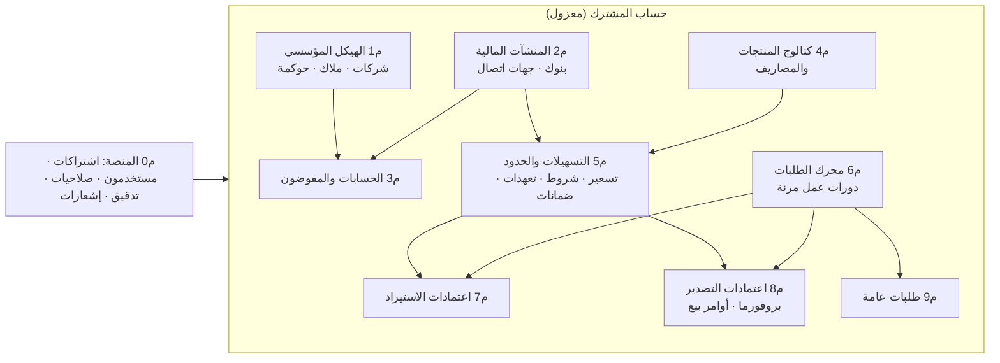
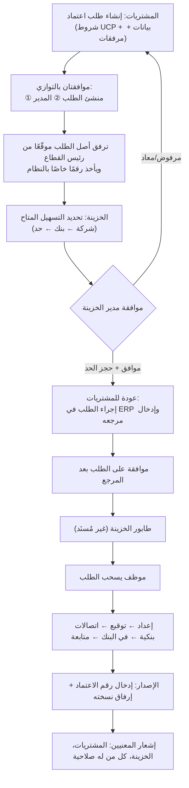
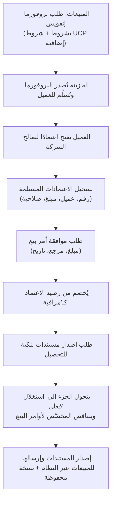

# الدراسة الأولية — منصة إدارة الخزينة (اسم مؤقت: TMP)

| البند | القيمة |
|---|---|
| الحالة | **دراسة أولية — القرارات D-1 إلى D-13 مقبولة (2026-10-10)، والباقي قيد التثبيت** |
| التاريخ | 2026-10-10 |
| المصدر | وصفك الأخير (يلغي المخطط السابق «نظام تسهيلات بنكية لشركة واحدة») |
| الغرض | تثبيت الفهم، كشف الفجوات، واقتراح ترتيب البناء، قبل أي تصميم تفصيلي أو قاعدة بيانات |
| المخرجات القادمة (بعد موافقتك) | وثيقة تحليل تفصيلية ← وثيقة قاعدة البيانات ← تصميم الواجهات |

## 0. سجل التثبيت (محدَّث 2026-10-10)

| البند | الحالة |
|---|---|
| D-1 … D-13 | ✅ **مقبولة** (مع تعديل D-8 أدناه) |
| س-13 (دورات العمل) | ✅ **تُبنى مسبقًا كقوالب افتراضية قابلة للتعديل لاحقًا.** نصمّم الدورات كإعدادات (بيانات) من البداية، وتأتي شاشة التعديل في مرحلة لاحقة |
| س-27 (الأولوية) | ✅ **أولًا: نظام التسهيلات** (شروطها وخصائصها ومبالغها مع المنشآت المالية) **ثم: نظام التتبع** بديلًا عن المتابعة بالبريد. تفاصيل أنواع الطلبات وشروطها وجهاتها تأتي لاحقًا |
| س-21 (الحجز) | ⏳ شرحتُه أدناه (القسم 5) وأنتظر تأكيدك |
| باقي الأسئلة | 🟡 تُعتمد افتراضاتي إلى أن تُعدَّل |
| النماذج المرفقة | 📎 حُلِّلت في `02-forms-analysis-ucp600.md` (طلب بروفورما + طلب اعتماد بنكي) |

**D-8 بعد التعديل:** دورات خطّية بموافقات، تُقدَّم كـ**قوالب افتراضية جاهزة قابلة للتعديل**، وليست محرر BPM كاملًا في البداية.

**الترتيب بعد قرارك:** S0 المنصة ← **S1 المراجع اللازمة للتسهيلات** (شركات، منشآت مالية وجهات اتصال، حسابات، كتالوجات) ← **S2 التسهيلات** ← **S3 التتبع + الاعتمادات** ← S4 التصدير ← S5. أما تفاصيل الملكية والحوكمة والمفوّضين فتُفصل في **S1-ب** وتأتي بعد S2 أو بالتوازي معه (🔴 يُؤكَّد).

### تحديث 2026-10-10 (الجولة الثالثة)

| البند | الحالة |
|---|---|
| F-1 … F-14 (من تحليل النماذج) | ✅ **مقبولة** |
| ربط أنظمة أخرى (ERP وغيره) | ✅ **خارج النطاق الآن**، يُدرس لاحقًا. تبقى المراجع الخارجية نصية يدوية |
| سياسة الإصدارات | ✅ **اعتماد آخر إصدار دائمًا** (القسم 13) |
| قنوات التعامل مع البنك | ✅ نوعان: **نظام البنك مباشرة** أو **نموذج يدوي** (القسم 8 في `02`) |
| النموذج (ج) البروفورما الصادرة | 📎 حُلِّل في `02` القسم 7 |
| **القوائم المالية، متوسط الأرصدة الشهري، المبالغ المحوَّلة للبنك** | ✅ **مضافة** — وثيقة جديدة `03-financial-data-and-covenant-verification.md` (شريحة **S2-ب**)، وتعدّل D4 |
| الأسئلة الجديدة | ✅ ن-9، ن-10، ق-5، ق-9 **حُسمت (2026-10-10 مساءً)** · المتبقي ق-1 … ق-4، ق-6 … ق-8 (في `03`) |
| Δ1 … Δ12 (من تحليل الاتفاقيات) | ✅ **مقبولة** — وأُضيف Δ13 (مكتبة شروط قابلة للمقارنة بين البنوك) وΔ14 (بيانات الأشخاص والكفلاء كاملة) |
| قرارات الجولة السابعة (2026-10-10) | ✅ العنوان الفرعي لكل مشترك على **`bankfas.com`** · استضافة **VPS خاص** (وخادم محلي لاحقًا) · **الإنجليزية الأساس** والعربية لاحقًا · **تحذير بإقرار مسجَّل** لفحص شروط العملية · المنشئ والمدقق والمعتمد أدوار بالصلاحيات (`10-detailed-analysis/00` §10.4-ب) · نماذج KYC الأربعة محلَّلة (`05-kyc-forms-analysis.md`) · ✅ **مسودة وثيقة قاعدة البيانات v0.2** `20-database-design.md` (194 جدولًا؛ لم تُنفَّذ على SQL Server بعد؛ إقفال دورة العمل بيد إدارة الخزينة) |
| قرارات الجولة الخامسة | ✅ الهويات الكاملة لـ **مدير الخزينة ومسؤول التسهيلات فقط** · **صور** الوثائق تُحفظ · مرجع بيانات الكفيل: نموذج **KYC** البنكي · أولويات المقارنة: **التسعير ← المدد ← الضمانات** (`04` §9.4) · **بدأت وثيقة التحليل التفصيلية** (`10-detailed-analysis/`) |
| بيانات الكفلاء | ✅ **تُخزَّن كاملة** (هوية، إقامة، جواز، هوية خليجية، عناوين، بيانات إضافية بحسب البنك) مع ضوابط حساسية — `04` القسم 9 |
| اتفاقيات التسهيلات الأربع | ✅ حُلِّلت (ق-6): `04-facility-agreements-analysis.md`. **ثلاثة تصحيحات لتصميمي**: (1) الحدود الجزئية «سقف مشترك» لا «تجزئة»؛ (2) «التعرفة» جدول رسوم لا سعر واحد؛ (3) أهم ما يُراقَب **أجندة التقارير** لا النسب. المقترحات Δ1–Δ12 بانتظار تقييمك |

## كيف تقرأ هذه الدراسة

كل نقطة موسومة بمصدرها حتى تحكم عليها بسرعة:

| الوسم | المعنى |
|---|---|
| 🟢 **منك** | ذكرتَه صراحة |
| 🟡 **افتراض** | استنتجتُه أو اخترتُه أنا، ويحتاج تأكيدك |
| 🔴 **سؤال** | لم يُذكر ولا يمكن الافتراض بأمان |

في آخر الوثيقة (القسم 10) قائمة موحّدة بالقرارات والأسئلة لتجيب عنها بأرقامها.

---

## 1. تعريف المنتج

**منصة ويب بنظام الاشتراك (SaaS)** تنظّم عمل إدارة الخزينة في الشركات.

- 🟢 كل مشترك (شركة أو مجموعة) له **حساب خاص معزول** وبوابة دخول لموظفيه.
- 🟢 داخل الحساب يعرّف المشترك شركاته (قابضة أو تابعة أو مستقلة)، وبنوكه، وتسهيلاته، ثم يدير **طلبات الخزينة** عبر دورة عمل.
- 🟢 الطلبات تبدأ من أقسام أخرى (المشتريات، المبيعات، أي جهة) وتنتهي عند الخزينة والبنك.
- 🟡 **تتغير طبيعة المنتج** عن النسخة السابقة: لم يعد «سجلًا للتسهيلات» فقط، بل **نظام تشغيل لعمل الخزينة** (سجلات مرجعية + محرك طلبات + دورة اعتمادات مستندية). هذا يرفع التعقيد بوضوح، ويستدعي البناء على مراحل (القسم 9).
- 🟢 لا ربط مع ERP حاليًا، ويمكن إضافته لاحقًا.
- 🟢 الواجهة بالعربية (RTL) والبيئة ويندوز. 🔴 الإنجليزية مطلوبة أم اختيارية؟

### الرؤية في صورة واحدة

---

## 2. الجهات والأدوار

| الجهة | الدور في المنصة | المصدر |
|---|---|---|
| مشغّل المنصة (نحن) | إنشاء المشتركين، الباقات، دعم، إدارة قوائم النظام | 🟡 |
| مدير حساب المشترك | الشركات، المستخدمون، الصلاحيات، إعدادات دورات العمل | 🟡 |
| مدير الخزينة | فحص التسهيلات، الموافقة على الطلبات، توزيع العمل | 🟢 |
| موظف الخزينة | سحب الطلب والعمل عليه (إعداد، توقيع، بنك، متابعة) وتحديث حالته | 🟢 |
| المشتريات | طلب اعتماد استيراد، إدخال مرجع ERP، طلب تعديل/وثيقة/سويفت | 🟢 |
| المبيعات | طلب بروفورما، طلب موافقة أوامر بيع، طلب مستندات تحصيل | 🟢 |
| رئيس قطاع / مدير إداري | توقيع أصل الطلب (ورقيًا) | 🟢 |
| أي جهة طالبة | طلبات عامة تُعرَّف لاحقًا | 🟢 |

🔴 **س-1:** هل يشترك في المنصة أكثر من شركة *غير مرتبطة ببعضها* فعلًا (مثل شركات مختلفة تمامًا) أم مجموعات تجارية بشركاتها فقط؟ (يؤثر على العزل والتسعير).
🔴 **س-2:** من يدخل البيانات المرجعية (البنوك مثلًا): فريق المشترك، أم نوفّر **دليل بنوك عامًا** من المنصة يختار منه المشترك؟

---

## 3. الوحدات الوظيفية

لكل وحدة: ما فهمته، ما أقترحه، وما أحتاجه.

### م0 — المنصة والاشتراكات 🟡 (لم تُذكر تفصيلًا)
- **المشترك (Tenant)** له رمز، باقة، حالة (تجريبي/نشط/موقوف)، وحدات مفعّلة.
- بوابة دخول للموظفين، مستخدمون بأدوار وصلاحيات دقيقة، ونطاق بيانات (أي الشركات يراها المستخدم).
- سجل تدقيق (من، متى، ماذا)، إشعارات داخلية وبريدية، أرقام تسلسلية لكل مشترك.
- 🔴 **س-3:** هل المطلوب الآن **فوترة وبوابة دفع** للاشتراكات، أم نكتفي بإنشاء المشتركين يدويًا من لوحة المشغّل؟ (أقترح الثاني في البداية).
- 🔴 **س-4:** الدولة/الدول المستهدفة؟ وهل هناك متطلبات **إقامة البيانات** (Data Residency) أو أمن سيبراني نظامي؟ (يحدد الاستضافة).

### م1 — الهيكل المؤسسي (الشركات والملاك والحوكمة) 🟢

**المفهوم:**
- شركة لها **شركة أم** اختيارية (هرم المجموعة)، ولها **نوع كيان قانوني** (مساهمة، قابضة، محدودة، مساهمة مبسطة، مركز إقليمي، شخص واحد… حسب المعترف به).
- **الشركاء/المساهمون** وحصة كل منهم (أفراد أو شركات من داخل الحساب أو خارجه).
- **الحوكمة:** مجلس إدارة (مساهمة)، أو مجلس مديرين، أو مدير/مديرون (محدودة وشخص واحد)، مع **صلاحيات** كل عضو/مدير.
- **مستندات رسمية** بأنواع تُعرَّف في شاشة مستقلة، ويمكن رفعها من شاشة الشركة نفسها.

**اقتراحاتي:**
1. 🟡 فصل «**الشكل القانوني**» عن «**صفة قابضة**»: في أنظمة كثيرة القابضة صفة نشاط/ملكية لشركة مساهمة أو محدودة وليست شكلًا مستقلًا. أقترح قائمة أشكال قانونية قابلة للتعديل لكل مشترك + علم «قابضة». *(يُتحقق منه مع مستشار قانوني للدولة المستهدفة.)*
2. 🟡 كيان واحد «**شخص/جهة**» (Party) يُعاد استخدامه: نفس الشخص قد يكون شريكًا ومديرًا ومفوّضًا بالتوقيع **وكفيلًا** وجهة اتصال، فلا يُدخل مرتين. ✅ ويحمل **وثائق هوية متعددة** (وطنية، إقامة، جواز، خليجية) وعناوين متعددة وحقولًا إضافية بحسب البنك (`04` Δ14).
3. 🟡 ملكية الشركة تُسجَّل كجدول حصص بفترات سريان (تتغير الملكية)، ومجموع الحصص الحالية يجب أن يساوي 100% (تقرير تحقق).
4. 🟡 **الصلاحيات** نموذجها: (من: عضو أو هيئة) + (نوع صلاحية من قائمة: توقيع عقود، فتح حسابات، الاقتراض، منح ضمانات، تمثيل أمام الجهات…) + (سقف مبلغ اختياري) + (يلزم توقيع مشترك؟) + (فترة سريان) + (مستند المصدر).
5. 🟡 تنبيهات انتهاء المستندات ومدد المجالس والتفويضات.

🔴 **س-5:** هل تتطلب المنصة دعم **شركات في دول متعددة** (قوائم أشكال قانونية مختلفة، عملات وظيفية، سنوات مالية)؟
🔴 **س-6:** هل الملاك الذين من خارج الحساب أفراد فقط أم قد يكونون شركات أجنبية أيضًا؟
🔴 **س-7:** هل نحتاج «**خريطة الهيكل**» مرسومة (شجرة المجموعة بنسب الملكية)؟ (تحسين عرض، ليس أساسيًا).

### م2 — المنشآت المالية (البنوك وغيرها) 🟢

- **أنواع المنشأة:** بنك، شركة تمويل، شركة استثمارية، شركة مالية، فرد، ويُميَّز **محلي/أجنبي**.
- جهات التواصل على **طبقتين:**
  - **الطبقة الأولى (علاقة العميل):** مدير علاقة، مدير فريق، مدير إقليمي، مدير إدارة — مرتبة بالأولوية.
  - **الطبقة الثانية (هيكل البنك):** إدارات ← أقسام ← جهات اتصال (هاتف، بريد، موقع، عنوان).
- 🟡 **ملاحظة تصميمية:** الطبقة الأولى **خاصة بكل شركة عميلة** (مدير علاقة الشركة س في البنك أ ليس مدير علاقة الشركة ص). لذلك أقترح كيانًا اسمه «**علاقة شركة–بنك**» يحمل: رقم العميل لدى البنك، حالة العلاقة، مديري العلاقة، والمنتجات المتعامل بها (للحد من الشاشات عند إعداد البنك).
- 🟡 اقتراح «**معالج إعداد البنك**»: تعريف البنك ← اختيار الشركات المتعاملة ← اختيار المنتجات ← تعيين جهات الاتصال، في تدفق واحد.

🔴 **س-8:** هل تتطلب المنصة «دليل منشآت مالية» مشتركًا (SWIFT، العناوين العامة) أم كل مشترك يدخل بياناته؟
🔴 **س-9:** حين تكون الجهة الممولة **فردًا**: ما البيانات الإضافية الحساسة المطلوبة؟ (هوية، حسابات…). يؤثر على الخصوصية.

### م3 — الحسابات البنكية والمفوّضون بالتوقيع 🟢

- حساب بنكي: شركة + بنك + رقم + IBAN + عملة + نوع (جاري، رواتب، افتراضي، تحصيل نقاط بيع، قرض…). 🟡 الحسابات الافتراضية تتبع حسابًا رئيسيًا.
- **المفوّض بالتوقيع:** شخص مفوّض لدى بنك معيّن عن شركة، بفئة توقيع (أ، ب…)، مدة التفويض، ومستند التفويض.
- **صلاحية كل مفوّض على كل حساب** ونوعها: سحب، إيداع، شيكات، نقد، تسهيلات، اعتمادات، تمويلات، تمثيل الشركة… مع سقوف لكل عملية.
- 🟡 قاعدة التوقيع للحساب (مثل «أ + ب» أو «أي اثنين»): في المرحلة الأولى نصية + حد أدنى لعدد التوقيعات، وليست محركًا يتحقق آليًا.
- 🟡 صلاحية على مستوى البنك (كل الحسابات) أو على مستوى حساب محدد.

🔴 **س-10:** هل تقارن المنصة صلاحيات المفوّض بـ**صلاحيات الحوكمة في م1** (مثلًا المفوّض بالتوقيع ليس مديرًا مخوَّلًا بالاقتراض) وتنبّه للتعارض؟ (قيمة عالية، تكلفة متوسطة).
🔴 **س-11:** هل تُحفظ أرقام الحسابات و**نماذج التوقيع** (صور)؟ هذه بيانات حساسة تحتاج تشفيرًا.

### م4 — كتالوج المنتجات والمصاريف 🟢

- **منتجات بنكية** بأنواع وتصنيفات: نقاط بيع، تمويل موظفين، تسهيلات، اعتمادات (استيراد/تصدير)، ضمانات، رواتب، بطاقات ائتمانية، حسابات افتراضية، تحصيلات بنكية…
- **أنواع المصاريف** كثيرة وترتبط بالمنتج: عمولة إصدار اعتماد، تحويل، نقاط بيع، رواتب (داخل البنك/خارجه/بطاقات)، تبليغ، تعديل اعتماد، تعديل ضمان، رسوم إدارية…
- 🟡 المنتجات والمصاريف **تُزرع جاهزة** عند إنشاء المشترك (قوالب افتراضية) ثم يعدّلها كما يشاء.
- 🟡 المنتج يحمل علمًا: «**يستهلك حدًّا ائتمانيًا**» (اعتماد، ضمان، تمويل) أو لا (رواتب، نقاط بيع). هذا يحدد أي المنتجات تدخل في فحص التسهيلات.

### م5 — التسهيلات الائتمانية 🟢 (مثبَّتة تفصيلًا في النسخة السابقة)

يبقى النموذج السابق (راجع `bank-facilities/docs`) **مع التصحيحات الواردة في `04-facility-agreements-analysis.md`** (نمط توزيع الحدود الجزئية، وجدول التعرفة، وشروط العملية على خط المنتج، وأجندة التقارير):
- تسهيل ← حدود رئيسية وجزئية (شجرة) ← توزيع على الشركات ← منتجات مسموحة بكل حد.
- **تسعير** لكل منتج/حد/شركة بقاعدة «الأكثر تحديدًا يفوز» + وراثة (INHERIT/OWN) + سعر أساس (SIBOR، سعر البنك TARIFF) + هامش.
- شروط، تعهدات (نسب مسجَّلة الآن، وقوائم مالية لاحقًا)، ضمانات، حسابات مرتبطة، تمويل مشترك من عدة بنوك.

**الجديد في هذه المرحلة:**
1. 🟡 ربط التسهيل بـ**حسابات م3** (بدل أرقام نصية).
2. 🟡 **حجز الحد (Reservation):** ربط التسهيلات بالطلبات الحية، انظر القسم 5 — وهو أهم قرار تصميمي في المشروع.
3. 🟢 كلمة «الاعتماد» في وصفك تأتي بمعنيين (موافقة ائتمانية / اعتماد مستندي). سأستخدم **«موافقة ائتمانية»** للأول و**«اعتماد مستندي (LC)»** للثاني منعًا للّبس. 🔴 **س-12:** هل هذا التمييز مناسب؟

### م6 — محرك الطلبات (قلب المنصة) 🟢

- 🟢 **نظام مرن**: أنواع الطلبات تُعرَّف لاحقًا، لكل نوع **دورة عمل** مختلفة.
- مكوّنات المحرك المقترحة 🟡:

| المكوّن | الوصف |
|---|---|
| **نوع الطلب** | الاسم، الوحدة (استيراد/تصدير/عام)، دورة العمل، حقول إضافية، هل يتطلب مبلغًا أو اعتمادًا قائمًا |
| **دورة العمل** | مراحل + انتقالات + شروط، ولها إصدارات |
| **المرحلة** | من يعمل عليها، من يوافق (واحد/الكل)، المهلة الزمنية (SLA)، **المرحلة الظاهرة للطالب** |
| **الطلب** | رقم تسلسلي، الطالب، الشركة، المبلغ، المرحلة الحالية، المسؤول الحالي، مراجع خارجية |
| **الإجراءات** | سجل لكل تغيير: من، متى، من أي مرحلة إلى أي مرحلة، تعليق |
| **الموافقات** | مطلوبة بالتوازي أو بالتسلسل |
| **المراجع الخارجية** | أرقام ERP وغيرها تُدخل يدويًا وتصلح للبحث |
| **الإشعارات** | عند كل حدث لكل من له صلة وصلاحية |

- 🟢 **مبدأ مهم:** الحالة التفصيلية داخل الخزينة (إعداد، توقيع، اتصالات بنكية، في البنك، متابعة) **تخص الخزينة**؛ أما الجهة الطالبة فترى **حالة مجمّعة فقط** («تحت الإجراء»…). سنفصل «الحالة الداخلية» عن «الحالة الظاهرة».
- 🟢 «**السحب**»: الطلب يبقى في طابور الخزينة حتى **يسحبه** موظف مختص فيصبح هو المسؤول.
- 🟡 المحرك **لا يكون عامًّا إلى حد مفرط** (مثل أدوات BPM الكاملة): دورات خطّية مع تفرعات بسيطة وموافقات، وهذا يكفي ما وصفتَ ويخفّض المخاطر.

🔴 **س-13:** هل يحتاج المشترك **تصميم دورات العمل بنفسه** من شاشة (رسم المراحل)، أم نحن نبنيها له ونعدّلها بطلب؟ (فرق هائل في الجهد؛ أقترح: نبني القوالب الأولى ونفتح المحرر لاحقًا).
🔴 **س-14:** هل نحتاج **مهام بديلة/تفويض** عند غياب موظف، وتصعيد عند تجاوز المهلة؟

### م7 — اعتمادات الاستيراد (المشتريات) 🟢

تفصيل الدورة في القسم 4.1. ما يُسجَّل في الاعتماد: المستفيد (المورّد)، المبلغ والعملة والتسامح، نوع الاعتماد (اطلاع/آجل/قبول…)، الشحن الجزئي والنقل، المنافذ، **Incoterms**، آخر موعد شحن وانتهاء الصلاحية ومكانها، فترة التقديم، المستندات المطلوبة بنسخها، الشروط الإضافية، من يتحمل العمولات، تعليمات التعزيز، مراجع ERP، البنك المُصدِر، رقم الاعتماد بعد الإصدار.

### م8 — اعتمادات التصدير (المبيعات) 🟢

تفصيل الدورة في القسم 4.2. محورها: **بروفورما إنفويس** بشروط ← اعتماد من العميل لصالح الشركة ← **أوامر بيع** تُراقَب مقابل قيمة الاعتماد ← **مستندات تحصيل** تُستهلك فعليًا.

### م9 — الطلبات العامة 🟢

أي جهة تطلب من الخزينة (مبالغ، اشتراطات…). تُعرَّف الأنواع نقطة نقطة لاحقًا. المحرك (م6) هو الأساس، فلا نبني شيئًا خاصًّا الآن.

---

## 4. دورات العمل كما فهمتُها

### 4.1 اعتماد مستندي استيراد (المشتريات ← الخزينة)

بعد الإصدار تُفتح **طلبات فرعية تحت الاعتماد**: تعديل، طلب وثيقة، طلب سويفت، أو أي نوع مخصص. البحث عن الاعتماد بـ: **رقم الاعتماد، مرجع ERP، رقم الطلب في النظام**.

**ملاحظات تحليلية:**
- 🟡 «الموافقة من طرفين» = موافقتان متوازيتان لازمتان (منشئ + مدير). المحرك يدعمها بنمط «الكل يوافق».
- 🟡 «رقم خاص بالنظام» = تسلسل لكل مشترك ولكل نوع طلب، قابل للتهيئة (بادئة، سنة).
- 🔴 **س-15:** «ترفق بأصل الطلب موقعًا من رئيس القطاع»: مجرد مرفق ممسوح ضوئيًا، أم نحتاج **توقيعًا/موافقة إلكترونية** لرئيس القطاع داخل النظام؟
- 🔴 **س-16:** هل يمكن أن يطلب اعتماد واحد **أكثر من تسهيل/بنك** (تجزئة بين بنكين)؟
- 🔴 **س-17:** الإجراء في ERP يتم **قبل** أم **بعد** موافقة الخزينة على التسهيل؟ فهمتُه «بعد» ولكن أريد تأكيدًا.

### 4.2 اعتماد مستندي تصدير (المبيعات ← الخزينة)

**البحث لاحقًا بـ:** رقم الاعتماد، مرجع ERP، رقم العميل في ERP، اسم العميل ← تظهر **الاعتمادات النشطة** للعميل.

**ملاحظات:**
- 🟡 رصيد اعتماد التصدير له ثلاثة مكونات: **قيمة الاعتماد − المخصَّص لأوامر بيع − المستغَل فعليًا**، والعلاقة بينها كما شرحتَ. يُحسب آليًا ويعرض للمبيعات.
- 🔴 **س-18:** هل مبلغ أمر البيع يُخصم من الاعتماد **بالكامل** عند الموافقة، أم قد يُغطّى أمر البيع الواحد من أكثر من اعتماد؟
- 🔴 **س-19:** ماذا عن **التعديلات** و**المستندات المخالفة** (Discrepancies) في التصدير؟ هل تدخل في المرحلة الأولى؟
- 🔴 **س-20:** البروفورما: شكل مطبوع محدد (قالب بشعار الشركة)؟ وبأي لغات؟

### 4.3 الطلبات العامة

يُعاد استخدام المحرك. يحتاج كل نوع جديد: نموذج حقول، دورة عمل، من يطلب ومن يوافق. **لا نبني شيئًا مسبقًا.**

---

## 5. أهم قرار تصميمي: ربط الطلبات بالتسهيلات (استهلاك الحدود)

### ما المقصود بـ«الحجز»؟

**الحجز = تخصيص جزء من الحد لطلب معيّن حتى لا يُوعَد به طلب آخر.** مثل حجز غرفة فندق: الغرفة لم تُستخدم بعد، لكنها لم تعد متاحة لغيرك.

مثال: حد الاعتمادات 10 مليون، المستخدم 6 ← المتاح 4.
1. المشتريات تطلب اعتمادًا بـ 3 م، فيوافق مدير الخزينة **← يُحجز 3 م**، والمتاح لباقي الطلبات يصبح 1 م.
2. طلب آخر بـ 2 م في الأثناء **يُنبَّه** أن المتاح 1 م فقط (أو يُرفض) ولا يُوعَد بما لا نملكه.
3. إذا أصدر البنك الاعتماد ← يتحول الحجز إلى **اعتماد قائم** ويبقى مستهلكًا للحد.
4. إذا رُفض الطلب أو أُلغي أو انتهى الاعتماد دون استخدام ← **يُفك الحجز** ويعود المبلغ إلى المتاح.

**بدون حجز:** قد يوافق مدير الخزينة على طلبين كلٌّ منهما يرى المتاح 4 م، فيتجاوز المجموع الحد ولا ندري إلا عند رفض البنك، وهذا بالضبط ما يحدث حين تُتابَع الأمور بالبريد.

**اقتراحي:** الحجز عند **موافقة مدير الخزينة** (وليس عند الإصدار). والبديل: الحجز عند الإصدار فقط، وهو أبسط لكنه لا يمنع الوعد المزدوج. *(الأمر بيدك، وتأكيدك مطلوب في س-21.)*

### تفصيل الدورة

وصفك يتضمن أن الخزينة «تحدد التسهيل المتاح» للطلب، وأن الاعتمادات المصدرة تستهلك الحدود. هنا تلتقي م5 بـ م6/م7/م8، وأي خطأ فيه يُفقد المنصة موثوقيتها.

**المقترح 🟡 — دورة حياة الحجز:**

| الحدث | أثره على الحد |
|---|---|
| موافقة الخزينة على الطلب | **حجز** مبلغ الاعتماد على حد محدد (وشركة) |
| إصدار الاعتماد | يتحول الحجز إلى **اعتماد قائم** (Outstanding) |
| تعديل بزيادة/نقص | تعديل الحجز بفرق المبلغ |
| سداد/استغلال (استيراد) أو تحصيل (تصدير) | يقل القائم |
| انتهاء الصلاحية أو إلغاء | **فك الحجز** |
| رفض الطلب | لا حجز |

**المتاح للشركة = الحد (أو المخصَّص لها) − الحجوزات والاعتمادات القائمة − أي استخدام يدوي لمنتجات لا تُدار بالمنصة.**

القرارات المعلّقة:
- 🔴 **س-21:** هل الحجز عند **موافقة الخزينة** (كما فهمت) أم عند **الإصدار فقط**؟
- 🔴 **س-22:** الاعتماد بعملة تختلف عن عملة الحد: من يحدد **سعر التحويل** وهل يُثبَّت؟
- 🔴 **س-23:** هل كل المنتجات (ضمانات، تمويل مرابحة…) ستُدار بدورات عمل أيضًا لاحقًا لتدخل في الحجز، أم يبقى المستخدم منها **إدخالًا يدويًا** إلا الاعتمادات؟ (فهمتُ: الاعتمادات فقط الآن).

---

## 6. المتطلبات العابرة للوحدات

| المحور | التوصية الأولية |
|---|---|
| **العزل بين المشتركين** | 🟡 قاعدة بيانات واحدة، وعمود مشترك في كل جدول، مع **أمان على مستوى الصف** (RLS) وفحوصات في التطبيق. البديل (قاعدة لكل مشترك) أنظف عزلًا ولكن أغلى تشغيلًا وترحيلًا. 🔴 **س-24:** هل هناك عملاء كبار يشترطون قاعدة مستقلة؟ |
| **الهوية والدخول** | 🟡 حسابات داخل المنصة + كلمة مرور قوية + MFA + قفل الحساب. دعم SSO مع Microsoft Entra ID خيار لاحق لكل مشترك. (Windows Authentication لا يناسب منصة اشتراك عبر الإنترنت). |
| **الصلاحيات** | 🟡 أدوار قابلة للتخصيص + نطاق شركات + صلاحيات على مستوى الإجراء (موافقة، سحب، عرض سري). |
| **المستندات** | 🟡 تخزين الملفات خارج قاعدة البيانات (مشاركة ملفات/تخزين كائنات) + بصمة SHA-256 + نسخ احتياطي، وإصدارات للمستند. |
| **التدقيق** | 🟡 سجل غير قابل للتعديل لكل تغيير، وسجل منفصل لأحداث الدخول والتصدير. |
| **الإشعارات** | 🟡 داخل النظام أولًا، والبريد لاحقًا؛ قواعد من يُبلَّغ حسب الحدث والصلاحية. |
| **الأرقام التسلسلية** | 🟡 لكل مشترك ونوع طلب، دون فجوات مقبولة. |
| **اللغة** | 🟢 عربية RTL، 🟡 أسماء ثنائية اللغة في الكتالوجات. |
| **البيانات الحساسة** | 🟢 **تُخزَّن الآن** هويات وإقامات وجوازات وعناوين الكفلاء والأشخاص (قرارك). 🟡 تشفير على مستوى العمود، **عرض مقنَّع** وكشف كامل بصلاحية خاصة مع تسجيل كل كشف، تصدير مقيَّد، سياسة احتفاظ، وإنذار انتهاء الوثائق. 🔴 الامتثال لحماية البيانات يُراجَع مع مختص. |
| **التهيئة (Configuration)** | 🟡 كل ما ذكرتَه «يُعرَّف لاحقًا» يُصمَّم كإعداد لا ككود: أنواع الطلبات، المصاريف، المنتجات، الشروط. |
| **الجاهزية للربط الخارجي** | 🟢 **لا ربط الآن، وكل الإجراءات على المنصة؛ ويُبنى الربط لاحقًا** مع جهات خارجية (بنوك وأنظمة ERP) إن أمكن. 🟡 مبادئ التهيئة: مراجع خارجية نصية عامة (النظام، النوع، القيمة)، **API أولًا** (كل وظيفة متاحة عبر واجهة برمجية موثّقة)، **أحداث وطابور إرسال** للتغييرات المهمة، **محوّل (Adapter) لكل جهة** يمكن إضافته دون المساس بالنواة، وقناة «ربط مباشر» ثالثة بجانب «بوابة البنك» و«النموذج اليدوي». |

---

## 7. معمارية أولية مقترحة (بيئة ويندوز)

- 🟡 **Modular monolith** (تطبيق واحد مقسَّم إلى وحدات بحدود واضحة) لا خدمات مصغّرة: فريق صغير، ومعاملات مترابطة (الحجز والطلبات).
- **الخادم:** ASP.NET Core على Windows Server / IIS (أو Azure App Service).
- **القاعدة:** Microsoft SQL Server (يدعم RLS والتشفير وJSON والتدقيق).
- **الواجهة:** تطبيق ويب يدعم RTL: Blazor (مناسب لفريق .NET) أو React. 🔴 **س-25:** تفضيل الفريق؟
- **المهام الخلفية:** تنبيهات الاستحقاق، إرسال البريد، إغلاق الصلاحيات المنتهية.
- **الملفات:** مخزن ملفات مشفّر بمسارات معزولة لكل مشترك.
- 🔴 **س-26:** الاستضافة: سحابة (Azure/AWS/محلية) أم خوادم الشركة؟ تؤثر على الإقامة والتكلفة.

---

## 8. المخاطر الرئيسية

| # | الخطر | الأثر | المعالجة المقترحة |
|---|---|---|---|
| R1 | اتساع النطاق: هيكل شركات + حوكمة + بنوك + تسهيلات + محرك طلبات + اعتمادات | تأخير طويل | بناء على شرائح رأسية (القسم 9) |
| R2 | محرك الطلبات «المرن» يتحول إلى مشروع BPM كامل | تكلفة وتعقيد | دورات خطّية + موافقات؛ قوالب أولية؛ محرر لاحقًا |
| R3 | أخطاء في حساب المتاح من الحدود | قرارات ائتمانية خاطئة | قواعد الحجز (القسم 5)، اختبارات صارمة، تقارير مطابقة |
| R4 | تسريب بيانات بين المشتركين | فقدان الثقة والمسؤولية القانونية | RLS + اختبارات عزل آلية + مراجعة أمنية |
| R5 | بيانات حساسة (تفويضات، حسابات، هويات) | التزام نظامي | تشفير، صلاحيات، تدقيق |
| R6 | المحتوى القانوني (UCP 600، شروط البروفورما) | مسؤولية عن نصوص خاطئة | النظام يوفّر **قوالب** تراجعها جهة قانونية، ولا يقدّم استشارة |
| R7 | تنوّع الأشكال القانونية بين الدول | تعقيد | قوائم قابلة للتهيئة لكل مشترك |
| R8 | اعتماد المستخدمين (تحول من الورق/البريد) | فشل تشغيلي | واجهات بسيطة للمشتريات/المبيعات، تدريب |

---

## 9. ترتيب البناء المقترح (شرائح رأسية)

الفكرة: **لا نبني كل وحدة كاملة ثم ننتقل**، بل نبني شريحة تعمل من البداية للنهاية لنتحقق مبكرًا.

| الشريحة | المحتوى | ما نتحقق منه |
|---|---|---|
| **S0** | م0 المنصة: مشترك، مستخدمون، أدوار، تدقيق، عزل | العزل والدخول يعملان بشكل سليم |
| **S1** | م1 + م2 + م3 + م4: الشركات، البنوك، الحسابات، المفوضون، الكتالوجات | القاعدة المرجعية جاهزة وسريعة الإدخال |
| **S2** | م5: التسهيلات والحدود والتسعير والشروط والتعهدات والضمانات | تمثيل واقع التسهيلات عندكم |
| **S2-ب** | القوائم المالية، متوسط الأرصدة الشهري، المبالغ المحوَّلة للبنك، التحقق من الشروط والخروقات (إدخال يدوي) | الالتزام بشروط البنوك مقاسًا لا مفترضًا |
| **S3** | م6 محرك الطلبات + م7 اعتمادات الاستيراد من البداية للنهاية (بما فيها الحجز) | **أهم اختبار للمنصة** |
| **S4** | م8 اعتمادات التصدير: بروفورما، أوامر البيع، المستندات | ضبط منطق الرصيد |
| **S5** | م9 + التقارير + الإشعارات البريدية + التقارير الإدارية | جاهزية الإطلاق التجريبي |
| لاحقًا | ربط ERP، قوائم مالية وحساب التعهدات، عمولات متقاضاة وتقاريرها، فوترة الاشتراكات | — |

🟡 **بديل أقترحه للنقاش:** إذا كان ألم العمل الأكبر في **تتبّع الطلبات** وليس في السجلات المرجعية، فنقدّم **S3** بنسخة مبسّطة (مع بيانات مرجعية قليلة) قبل S1/S2 لنحصل على أثر مبكر. 🔴 **س-27:** ما الأكثر إلحاحًا لديكم؟

---

## 10. القرارات والأسئلة المجمّعة

### أ) قرارات أقترحها (اقبل / عدّل / ارفض)

| # | القرار المقترح |
|---|---|
| D-1 | منصة SaaS متعددة المشتركين بقاعدة واحدة وعزل على مستوى الصف |
| D-2 | كيان «شخص/جهة» موحّد يُعاد استخدامه (شريك، مدير، مفوّض، جهة اتصال) |
| D-3 | فصل «الشكل القانوني» عن علم «قابضة» |
| D-4 | علاقة «شركة–بنك» تحمل مديري العلاقة والمنتجات |
| D-5 | صلاحيات الحوكمة والمفوّضين كنموذج (صلاحية + سقف + توقيع مشترك + فترة) |
| D-6 | الحالة الداخلية للخزينة منفصلة عن الحالة الظاهرة للجهة الطالبة |
| D-7 | الطلب يُسحب من طابور الخزينة بواسطة موظف مختص |
| D-8 | دورات خطّية بموافقات (وليس محرك BPM كاملًا) |
| D-9 | حجز الحدود وتحويله إلى قائم عند الإصدار، وفكه عند الانتهاء |
| D-10 | المراجع الخارجية (ERP) بنمط عام نصي بلا ربط |
| D-11 | Modular monolith على ASP.NET Core + SQL Server |
| D-12 | البناء بالشرائح الرأسية S0 ← S5 |
| D-13 | تسمية: «موافقة ائتمانية» للأولى، و«اعتماد مستندي» للثانية |

### ب) أسئلة مفتوحة (رقمها في النص)

**المنصة:** س-1 … س-4، س-24 … س-26
**الهيكل المؤسسي:** س-5 … س-7
**البنوك والحسابات:** س-8 … س-11
**الطلبات والاعتمادات:** س-12 … س-23
**الأولويات:** س-27

> أجب بأرقام الأسئلة التي تهمك الآن؛ أما الباقية فأعتمد افتراضي فيها وأعيد عرضها عند التفصيل. **ولن أنتقل إلى قاعدة البيانات أو الواجهات قبل توجيهك.**

---

## 11. العلاقة بالعمل السابق

- مجلد `bank-facilities/` (الإصدار 0.2) يغطي **م5 فقط** (التسهيلات) لشركة واحدة/مجموعة، بقاعدة بيانات SQL Server غير متعددة المشتركين.
- **ما سيُعاد استخدامه:** نموذج الحدود والتسعير والتعهدات والضمانات والتمويل المشترك، والعروض (سلامة الحدود، التعهدات).
- **ما سيتغير:** إضافة بُعد المشترك لكل جدول، والارتباط بالشركات والحسابات والبنوك من م1–م3، وربط الحدود بالحجوزات.
- 🟡 لن أحذف شيئًا من المجلد القديم قبل اعتماد هذه الدراسة.

---

## 12. تقدير أولي لحجم الجهد (للمقارنة فقط، لا للالتزام)

| الشريحة | الحجم النسبي |
|---|---|
| S0 المنصة | متوسط |
| S1 المراجع | كبير (كثرة الشاشات) |
| S2 التسهيلات | كبير (مبني على تصميم قائم) |
| S3 المحرك + استيراد | **الأكبر والأعلى مخاطرة** |
| S4 التصدير | متوسط–كبير |
| S5 التقارير والإشعارات | متوسط |

الأرقام الزمنية بعد حسم الأسئلة وحجم الفريق.

---

## 13. سياسة الإصدارات: «آخر إصدار دائمًا» 🟢

**القاعدة المقرَّة:** كل مكوّن (برمجي أو مرجعي) يُعتمد بآخر إصدار مستقر (GA) وقت البدء، ثم يُراجع عند كل إصدار جديد.

🟡 **ضابطان أقترحهما:**
1. **المستقر لا التجريبي:** لا نعتمد نسخًا Preview/RC في الإنتاج.
2. ✅ **قرارك (ق-9): الأحدث دائمًا حتى لو كان قصير الدعم (STS).** نعتمد آخر إصدار GA مستقر؛ ويترتب عليه **جدول ترقية منتظم** (مراجعة كل إصدار جديد خلال فترة محددة) لأن دعم الإصدارات القصيرة أقصر.

### سجل الإصدارات (تحقّقتُ من المصادر بتاريخ 2026-10-10)

| المكوّن | الإصدار المعتمد | الحالة والمصدر |
|---|---|---|
| **.NET** | **.NET 10 (LTS)** | الإصدار الحالي طويل الدعم؛ آخر تحديث أمني 10.0.12؛ الدعم حتى 14 نوفمبر 2028. وإصداران 8 و9 ينتهي دعمهما **10 نوفمبر 2026** فلا يُعتمدان. [سياسة دعم .NET](https://dotnet.microsoft.com/en-us/platform/support/policy) |
| **SQL Server** | **SQL Server 2025** (الإصدار 17.0.x) | متاح عامًا منذ نوفمبر 2025، ودعم رئيسي حتى 6 يناير 2031. [الإعلان](https://kurtsh.com/2025/11/25/release-microsoft-sql-server-2025-is-now-generally-available/) |
| **Windows Server** | آخر إصدار (يُتحقَّق منه عند التجهيز) | لم أتحقق منه بعد، وأدرجه في قائمة التجهيز |
| **UCP 600** | **UCP 600** (2007) | لا نسخة أحدث؛ هو المعمول به. [ICC](https://library.iccwbo.org/content/tfb/dcw/DCW_2023vol27n07/DCW_2023vol27n07-updates-03.htm) |
| **ISBP** (ممارسة فحص المستندات) | **ISBP 821** (3 يوليو 2023)، ويحل محل ISBP 745 | المرجع الحالي لفحص المستندات. [ICC](https://2go.iccwbo.org/international-standard-banking-practice-isbp-1.html) |
| **eUCP** (التقديم الإلكتروني) | **eUCP 2.1** (29 يونيو 2023) | يُعتمد عند إضافة تقديم إلكتروني للمستندات |
| **URDG** (ضمانات الطلب) | **URDG 758** | لا نسخة أحدث ظهرت في البحث؛ تلزم عند بناء الضمانات لاحقًا |
| **Incoterms** | **Incoterms 2020** | الأحدث؛ ولم يُعلن بديل بعد (الدورة عشرية، فالمتوقع نحو 2030 وهذا استنتاج لا إعلان رسمي). [ICC](https://iccwbo.org/news-publications/news/icc-prepares-launch-incoterms-2020/) |

⚠️ هذه مراجع **عند تاريخ اليوم**. سأعيد التحقق منها عند بدء التطوير الفعلي وعند كل إصدار جديد؛ وفي الأنظمة التنظيمية (UCP وISBP…) يرجع المختص إلى النص الرسمي الكامل.

### أثر القرار على ما كتبته سابقًا
- وثيقة التحليل السابقة (`bank-facilities/`) كانت على SQL Server 2019+؛ **تُرفع إلى SQL Server 2025** عند إعادة الاستخدام.
- ربط Incoterms بالقائمة الجديدة (2020) كما اقترحتُ في F-8.
