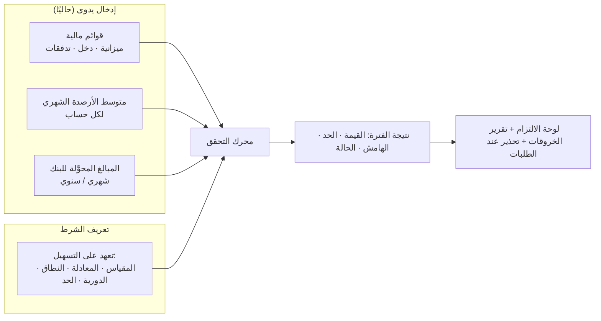

# البيانات المالية والتحقق من شروط التسهيلات

| البند | القيمة |
|---|---|
| الحالة | **دراسة أولية للتقييم** — تُثبَّت نقطة نقطة بعد ملاحظاتك |
| التاريخ | 2026-10-10 |
| الطلب (🟢 منك) | إضافة بيانات الميزانية والقوائم المالية للتحقق من أي إجراء يخرق شروط التسهيلات · إضافة **متوسط الأرصدة البنكية شهريًا** إن كان شرطًا من البنك · إضافة **قيمة المبالغ المحوَّلة للبنك شهريًا أو سنويًا** إن كانت مطلوبة |
| قيد منك (🟢) | **كل البيانات بإدخال يدوي** الآن، دون ربط بأنظمة أخرى |
| يعدّل | قرار D4 السابق («النسب فقط الآن، والقوائم لاحقًا»): القوائم المالية تدخل الآن ضمن الشريحة S2-ب |

وسوم المصدر: 🟢 منك · 🟡 افتراض مني · 🔴 سؤال.

---

## 1. الفكرة في جملة

تعريف **الشرط** على التسهيل (مثلًا «نسبة التداول ≥ 1.2» أو «متوسط الرصيد الشهري ≥ 500 ألف» أو «تحويلات لا تقل عن 20 مليون سنويًا») ثم إدخال **البيانات الخام** (ميزانية، قائمة دخل، رصيد، تحويلات) لكل فترة، فيحسب النظام **القيمة الفعلية** ويقارنها بالحد ويصدر تقرير **التزام / مخالفة / هامش الأمان** — ويحذّر قبل أي إجراء جديد قد يخرق الشروط.

---

## 2. أنواع الشروط التي يغطيها النظام

| # | النوع | مثال | مصدر البيانات | المصدر |
|---|---|---|---|---|
| T1 | **نسبة مالية** | نسبة التداول ≥ 1.2 · الرافعة (الدين/حقوق الملكية) ≤ 2.5 · تغطية خدمة الدين ≥ 1.25 | القوائم المالية | 🟢 |
| T2 | **مبلغ مطلق** | الحد الأدنى لصافي الثروة · أقصى دين إجمالي | القوائم المالية | 🟡 |
| T3 | **متوسط رصيد بنكي** | متوسط رصيد شهري لا يقل عن X في حساباتنا لدى البنك | إدخال شهري لكل حساب | 🟢 |
| T4 | **حجم التحويلات (حركة الحسابات)** | تحويلات واردة للبنك لا تقل عن X شهريًا أو Y سنويًا | إدخال شهري لكل حساب | 🟢 |
| T5 | **نسبة التحويلات من الإيراد** | 60% من المبيعات تُحوَّل عبر البنك | T4 ÷ الإيراد من القوائم | 🟡 |
| T6 | **تقديم قوائم/تقارير** | قوائم مدققة خلال 120 يومًا من نهاية السنة | تاريخ التقديم | 🟢 (قائم) |
| T7 | **تشغيلي غير قابل للقياس** | عدم توزيع أرباح، عدم تغيير الملكية | تأكيد يدوي | 🟢 (قائم) |

🟡 كل شرط يُعرَّف **بشرط واحد قابل للقياس** (مقياس + مشغّل + حد). الشرط المركّب («أو» بين شرطين) يُعرَّف كشرطين مرتبطين (🔴 هل توجد شروط مركّبة في اتفاقياتكم؟).

---

## 3. البيانات المراد إدخالها

### 3.1 القوائم المالية والميزانية 🟢

**الرأس:** الشركة · الفترة (تاريخ النهاية) · نوع الفترة (سنوية/ربع سنوية/شهرية) · الأساس (**منفردة/موحّدة**) · الحالة (**مدققة**، مراجَعة، إدارية/غير مدققة) · العملة والوحدة (بالألف؟) · المعيار المحاسبي · مَن أدخلها ومَن اعتمدها · إصدار (تعديل/إعادة عرض Restated).

**البنود:** نعتمد **قائمة بنود موحدة (Standard Line Catalog)** تُملأ يدويًا من الميزانية والقوائم، بدل بناء دليل حسابات كامل.

| المجموعة | البنود المقترحة |
|---|---|
| الميزانية — الأصول | النقد وما في حكمه · الذمم المدينة · المخزون · أصول متداولة أخرى · **إجمالي الأصول المتداولة** · الأصول الثابتة · الأصول غير الملموسة · أصول غير متداولة أخرى · **إجمالي الأصول** |
| الميزانية — الخصوم | قروض قصيرة الأجل · الجزء المتداول من القروض طويلة الأجل · الذمم الدائنة · خصوم متداولة أخرى · **إجمالي الخصوم المتداولة** · قروض طويلة الأجل · التزامات الإيجار · خصوم غير متداولة أخرى · **إجمالي الخصوم** |
| الميزانية — حقوق الملكية | رأس المال · الأرباح المبقاة · حقوق أخرى · حقوق الأقلية · **إجمالي حقوق الملكية** |
| قائمة الدخل | الإيرادات · تكلفة المبيعات · **مجمل الربح** · المصاريف التشغيلية · الاستهلاك والإطفاء · **EBITDA** · **الربح التشغيلي** · تكاليف التمويل (الفوائد/الأرباح المدفوعة) · إيرادات أخرى · الزكاة والضريبة · **صافي الربح** |
| التدفقات (اختياري) | صافي التدفق التشغيلي · النفقات الرأسمالية · أقساط أصل الدين المسددة · الفوائد المسددة · توزيعات الأرباح |

🟡 البنود الإجمالية (الأصول المتداولة، الخصوم…) **تُحسب آليًا وتُقارَن** بما أُدخل لاكتشاف أخطاء الإدخال (الميزانية لا تتوازن).

🔴 **ق-1:** هل تُدخل القوائم بنفس هذا التفصيل، أم نكتفي ببنود أقل للبدء؟
🔴 **ق-2:** هل تتوفر القوائم **بملف Excel بصيغة ثابتة** يمكن لصقها دفعة واحدة (نسخ/لصق من الجدول لا يُعدّ ربطًا)؟ يوفّر ساعات إدخال.
🔴 **ق-3:** هل تُطلب النسب على **الشركة المقترضة وحدها** أم على **القوائم الموحّدة للمجموعة**؟ (الشرط يحدد النطاق).

### 3.2 متوسط الأرصدة البنكية الشهري 🟢

لكل **حساب بنكي** (من وحدة الحسابات) ولكل **شهر**:

| الحقل | الوصف |
|---|---|
| متوسط الرصيد اليومي | القيمة المطلوبة غالبًا في الشرط |
| أدنى رصيد / رصيد نهاية الشهر | اختياري، تتطلبه بعض الاتفاقيات |
| مصدر الرقم | «كشف الحساب» / «إشعار البنك» / «حساب داخلي» + مرجع |
| ملاحظة | مثل «تخطّى اليوم 28 بسبب…» |

🟡 يُعرَّف في الشرط: **أي الحسابات** تدخل (كل حسابات الشركة لدى البنك، أو حسابات محددة، أو حسابات مجموعة شركات)، و**طريقة التجميع**: مجموع متوسطات الحسابات، أو متوسط الفترة.
🔴 **ق-4:** هل يُقاس «المتوسط» **يوميًا** (متوسط الأرصدة اليومية) أم على **نهاية الشهر**؟ وهل تُحتسب الحسابات بالعملات الأجنبية بسعر تحويل محدد؟

### 3.3 المبالغ المحوَّلة للبنك ✅ (حُسم بإجابتك)

**بيان تُدخله إدارة الخزينة** لتجميعه **سنويًا** ومراقبة أداء الشركة مع البنك: هل تلتزم بالتحويل إليه بالمبالغ التي تشترطها شروط التسهيلات (إن اشترطتها).

| الحقل | الوصف |
|---|---|
| الشركة · البنك (· التسهيل اختياريًا) | بمستوى العلاقة، لا بالضرورة لكل حساب |
| الشهر | الإدخال شهري، والتجميع السنوي آلي |
| المبلغ المحوَّل | رقم تقرره الخزينة وفق تعريف الشرط |
| ملاحظة/أساس الاحتساب | نص حر (مثل «إيداعات العملاء فقط») |

🟡 لا تتحقق المنصة من تعريف «المحوَّل» (تدخله الخزينة بحسب نص الشرط)، بل **تقارنه** بالالتزام وتعرض الإنجاز التراكمي والمتبقي.
🟡 يمكن أيضًا قياسه كنسبة من الإيراد (مثال: التزام بإيداع 15% من الإيرادات السنوية) إذا أُدخلت القوائم المالية.

---

## 4. تعريف الشرط (ما يحمله كل تعهد)

| الحقل | الوصف |
|---|---|
| التسهيل / الحد | يرتبط بتسهيل كامل أو بحد معين |
| نوع الشرط | T1–T7 |
| **المقياس** | اسم (نسبة التداول…) + **المعادلة** بدلالة بنود القوائم |
| النطاق | الشركة المختبَرة · منفرد/موحّد · الحسابات المشمولة |
| الدورية ونافذة القياس | شهري · ربع سنوي · سنوي · **متحرك 12 شهرًا** |
| المشغّل والحد | ≥ · ≤ · > · < · = وقيمة |
| تاريخ أول اختبار ومهلة التقديم | مثل «بعد 90 يومًا من نهاية الفترة» |
| مدة السماح / العلاج | عدد الأيام للتصحيح قبل اعتبارها مخالفة |
| الأثر عند المخالفة | نص (سحب التسهيل، رفع الهامش، إيقاف الاستخدام…) |
| **مرجع البند في الاتفاقية** | رقم البند وتاريخ الاتفاقية، لإثبات «التعريف حسب الاتفاقية» |

🟡 **المعادلة تتبع الاتفاقية لا المعيار:** «إجمالي الدين» يشمل أحيانًا التزامات الإيجار وأحيانًا لا، لذا نحفظ **تعريف المقياس مع الشرط نفسه** ويُختار من **مكتبة معادلات** جاهزة قابلة للتعديل (نسخة لكل اتفاقية).

أمثلة معادلات مبدئية:

| المقياس | الصيغة |
|---|---|
| نسبة التداول | إجمالي الأصول المتداولة ÷ إجمالي الخصوم المتداولة |
| النسبة السريعة | (النقد + الذمم المدينة) ÷ إجمالي الخصوم المتداولة |
| الرافعة المالية | إجمالي الدين ÷ إجمالي حقوق الملكية |
| صافي الدين إلى EBITDA | (إجمالي الدين − النقد) ÷ EBITDA |
| تغطية خدمة الدين | (EBITDA − الضرائب والزكاة) ÷ (أصل الدين المسدد + تكاليف التمويل) |
| صافي الثروة الملموسة | إجمالي حقوق الملكية − الأصول غير الملموسة |
| تحويلات/إيراد | حركة دائنة عبر البنك ÷ الإيراد |

🔴 **ق-6:** من اتفاقياتكم الحالية: أرسل **بنود التعهدات والشروط** لـ 2–3 تسهيلات (نص البند) لنبني المكتبة من واقعكم، لا من افتراضي.

---

## 5. منطق التحقق

1. **توليد جدول الاختبارات** عند حفظ الشرط: تواريخ نهاية الفترات حتى انتهاء التسهيل (مع مهلة التقديم).
2. **جمع المدخلات للفترة:** قائمة مالية معتمدة (الأحدث للفترة، أو «مدققة تُقدَّم على الإدارية»)، أو إحصاءات الحسابات للأشهر ضمن النافذة.
3. **الحساب:** المعادلة ← القيمة الفعلية. تُحفظ **لقطة المدخلات** (أي قائمة وأي أشهر استُخدمت) لتبقى النتيجة قابلة للتفسير حتى لو عُدِّلت البيانات لاحقًا.
4. **الحكم:** مقارنة بالحد ← `ملتزم / مخالف / تحذير / بيانات ناقصة`. 
   - **هامش الأمان (Headroom)** = المسافة إلى الحد بالقيمة والنسبة.
   - **تحذير مبكر** عند اقتراب القيمة من الحد (نسبة قابلة للتهيئة، مثل 10%).
   - **بيانات ناقصة** إن لم تُدخل بعد موعدها.
5. **المخالفة** تتطلب إجراءً مسجَّلًا: إخطار، تنازل (Waiver) برقم مرجع وتاريخ وجهة، أو تصحيح.
6. **الاختبار بأثر رجعي** عند تعديل بيانات سابقة (نسخة معادة العرض Restated): يُعاد الحساب ويُسجَّل الفرق.

### أمثلة (للتأكيد على الفهم)

| الشرط | البيانات | الحساب | النتيجة |
|---|---|---|---|
| نسبة التداول ≥ 1.20 | أصول متداولة 12.0م، خصوم متداولة 10.5م | 12.0 ÷ 10.5 = 1.14 | **مخالف** (الهامش −0.06) |
| متوسط الرصيد الشهري ≥ 500 ألف | يناير 620، فبراير 480، مارس 700 (ألف) | الحد الأدنى للأشهر = 480 | **مخالف في فبراير** إن كان الشرط «كل شهر»؛ **ملتزم** إن كان «متوسط الربع» (600) |
| تحويلات سنوية ≥ 20 مليون | الحركة الدائنة الشهرية مجموعها 18.7م | 18.7 < 20 | **مخالف** (متبقٍ 1.3م) — ويظهر كم ينقص قبل نهاية السنة |

⚠️ المثال الثاني يُظهر أن **صياغة الشرط** (كل شهر أم متوسط ربع) تغيّر النتيجة، لذلك نحفظ نص الاتفاقية ومرجع البند.

---

## 6. ربطه ببقية المنصة

| الربط | التفصيل |
|---|---|
| **التسهيلات (م5)** | الشروط جزء من التسهيل؛ لوحة التسهيل تعرض «حالة الالتزام» |
| **الحسابات (م3)** | أرصدة وحركة كل حساب تُدخل على الحساب نفسه |
| **الطلبات (م6/م7)** | 🟡 عند موافقة مدير الخزينة على طلب اعتماد/حد: **تحذير** إذا وُجد تعهد مخالف أو قريب من الحد، وسياسة اختيارية «إيقاف الاستخدام عند المخالفة» لكل تسهيل |
| **الإشعارات** | قبل موعد الاختبار وقبل مهلة التقديم، وعند أي مخالفة |
| **التقارير** | لوحة الالتزام، سجل الخروقات، الهامش، البيانات الناقصة |
| **الحوكمة (م1)** | القوائم تخص شركة؛ والتعهد الموحّد يشمل شركات المجموعة (انظر ق-3) |

🟡 **لاحقًا (غير مطلوب الآن):** «ماذا لو؟» لاختبار أثر قرض جديد على النسب قبل أخذه.

---

## 7. الصلاحيات والرقابة

- 🟡 إدخال القوائم والأرصدة بصلاحية مستقلة عن الاعتماد (المُعِدّ ≠ المعتمِد).
- 🟡 البيانات المالية **سرّية**: عرضها بصلاحية «بيانات مالية».
- 🟡 كل تعديل على قائمة معتمدة يُنشئ **إصدارًا جديدًا** ويسجَّل في التدقيق.

---

## 8. أثره على الترتيب

| الشريحة | المحتوى |
|---|---|
| S2 | التسهيلات والحدود والتسعير والشروط والضمانات (كما اتُّفق) |
| **S2-ب** | **القوائم المالية، أرصدة الحسابات الشهرية، حركة التحويلات، محرك التحقق، لوحة الالتزام** — بإدخال يدوي |
| S3 | محرك الطلبات والاعتمادات (يستفيد من تحذيرات الالتزام) |

🟡 S2-ب تلي S2 مباشرة لأنها تعتمد على الشروط المعرَّفة على التسهيلات، وتسبق التتبع ما دمتَ قد جعلتَ التسهيلات وشروطها الأولوية الأولى.

---

## 9. الأسئلة المجمّعة (ق-1 إلى ق-8)

| # | السؤال |
|---|---|
| ق-1 | مستوى تفصيل بنود القوائم: التفصيل المقترح أم أقل للبدء؟ |
| ق-2 | هل يوجد قالب Excel ثابت للقوائم يمكن لصقه دفعة واحدة؟ |
| ق-3 | النسب على الشركة منفردة أم على القوائم الموحدة؟ (وأيهما أكثر في اتفاقياتكم) |
| ق-4 | تعريف «متوسط الرصيد»: يومي أم نهاية شهر؟ وكيف تُعامل العملات الأجنبية؟ |
| ق-5 | ✅ **محسوم:** بيان تدخله الخزينة سنويًا/شهريًا للمراقبة (انظر 3.3) |
| ق-6 | نصوص بنود التعهدات من 2–3 اتفاقيات تسهيلات فعلية |
| ق-7 | هل توجد شروط مركّبة («أو») أو **شرائح** (يتغير الحد حسب المبلغ المستخدم أو السنة)؟ |
| ق-8 | ما الأثر الفعلي لخرق الشرط عندكم (إيقاف، رفع الهامش…) وهل نريده يتحكم آليًا بالطلبات؟ |
