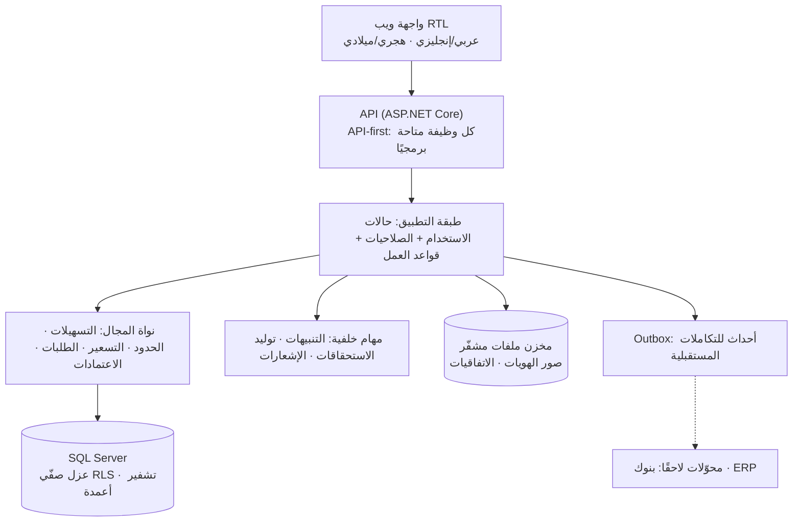
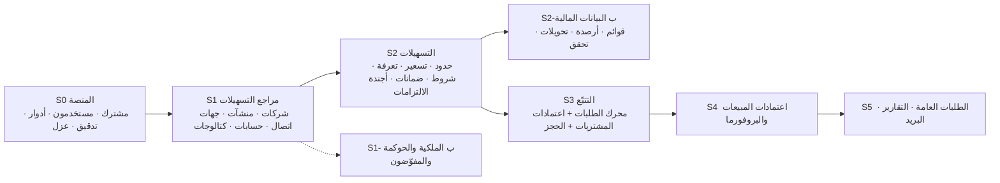

# وثيقة التحليل التفصيلية — الإطار العام والمتطلبات المشتركة

| البند | القيمة |
|---|---|
| الإصدار | 0.1 — مسودة للتقييم |
| التاريخ | 2026-10-10 |
| الحالة | **بدأت بطلبك الصريح** («ابدأ بوثيقة التحليل التفصيلية الآن»). لا قاعدة بيانات بعد؛ تأتي وثيقتها بعد اعتماد هذا التحليل |
| الوثائق السابقة (مرجعية) | `../01-preliminary-analysis.md` · `../02-forms-analysis-ucp600.md` · `../03-financial-data-and-covenant-verification.md` · `../04-facility-agreements-analysis.md` |
| الوثائق التالية | `10…14` مواصفات الوحدات · ثم وثيقة قاعدة البيانات · ثم تصميم الواجهات |

وسوم المصدر في كل الوثائق: 🟢 ذكرتَه أنت أو ورد في وثائقك · 🟡 اقتراح مني · 🔴 سؤال مفتوح.

---

## 1. مجموعة الوثائق وكيف تُقرأ

| الملف | المحتوى | الرمز |
|---|---|---|
| `00-overview-and-cross-cutting.md` | هذا الملف: النطاق، الأدوار، المسرد، المعمارية، المتطلبات المشتركة، الشرائح، التتبّع | — |
| `10-m0-m1-platform-organization.md` | م0 المنصة والمشتركون · م1 الهيكل المؤسسي · نموذج الأشخاص (الكفلاء) | PLT · ORG · PTY |
| `11-m2-m4-institutions-accounts-catalogs.md` | م2 المنشآت المالية · م3 الحسابات والمفوّضون · م4 الكتالوجات | INS · ACC · CAT |
| `12-m5-facilities-pricing-collateral-obligations.md` | م5 التسهيلات والحدود والتسعير والتعرفة والضمانات والالتزامات والبيانات المالية ومكتبة الشروط | FAC · PRC · COL · OBL · FIN · CMP |
| `13-m6-workflow-engine-notifications.md` | م6 محرك الطلبات ودورات العمل والإشعارات | WFL · REQ · NTF |
| `14-m7-m8-letters-of-credit.md` | م7 اعتمادات المشتريات · م8 اعتمادات المبيعات والبروفورما · شروط الاعتماد والنماذج | LCI · LCE · LCT |

**بنية كل مواصفة:** 15 قسمًا موحّدًا (الغرض، الصلاحيات، المفاهيم، المتطلبات `FR-xxx-nnn`، قواعد العمل `BR-xxx-nnn`، المتطلبات المعلوماتية، الشاشات، الحالات، التنبيهات، التقارير، جاهزية الربط، الأمن، الاعتماديات، الأسئلة `Q-xxx-nn`، سيناريوهات القبول).

---

## 2. النطاق والحدود

### 2.1 داخل النطاق (من 01–04)
1. **منصة اشتراك** متعددة المشتركين بعزل كامل، وبوابة دخول للموظفين 🟢.
2. **الهيكل المؤسسي:** شركات قابضة وتابعة ومستقلة، أشكال قانونية، شركاء وحصصهم، مجالس إدارة/مديرون وصلاحياتهم، مستندات رسمية 🟢.
3. **المنشآت المالية:** بنوك وشركات تمويل وغيرها، جهات اتصال على طبقتين، علاقة شركة–بنك 🟢.
4. **الحسابات البنكية والمفوّضون بالتوقيع** وصلاحية كل منهم على كل حساب 🟢.
5. **الكتالوجات:** منتجات، مصاريف، تمويل، حدود، ضمانات، التزامات، أسعار أساس 🟢.
6. **التسهيلات:** حزمة الاتفاقية، الحدود بأنماط توزيع، تسعير وتعرفة، شروط العملية، ضمانات وكفلاء، أجندة الالتزامات والتعهدات، تمويل مشترك 🟢.
7. **البيانات المالية والتحقق من الشروط:** قوائم مالية، متوسط أرصدة شهري، مبالغ محوَّلة للبنك (إدخال يدوي) 🟢.
8. **محرك الطلبات** بقوالب دورات عمل جاهزة قابلة للتعديل لاحقًا، **اعتمادات المشتريات والمبيعات**، البروفورما، الطلبات العامة، الإشعارات 🟢.
9. **مكتبة شروط منظّمة** تمهّد لمقارنة البنوك لاحقًا (التسعير ثم المدد ثم الضمانات) 🟢.

### 2.2 خارج النطاق الآن
- ربط أي نظام آخر (ERP أو بوابات البنوك أو القوائم المالية الآلية) — **يُبنى لاحقًا**، والتصميم يهيّئ له 🟢.
- فوترة الاشتراكات وبوابة الدفع 🟡 (تُنشأ المشتركون يدويًا من لوحة المشغّل).
- محرر رسومي لدورات العمل (الدورات تُقدَّم قوالب بيانات؛ المحرر لاحقًا) 🟢.
- احتساب الفوائد والعمولات المستحقة وحركاتها المحاسبية، وتسجيل العمولات المتقاضاة وتقاريرها الشهرية (مرحلة لاحقة) 🟢 (من النسخة السابقة).
- تقارير المقارنة بين البنوك (البيانات تُجهَّز الآن، والتقارير لاحقًا) 🟢.
- مساعد استخراج آلي للاتفاقيات الممسوحة 🟡 (فكرة، غير مطلوبة).

---

## 3. الأدوار الرئيسية (كتالوج مبدئي قابل للتخصيص لكل مشترك)

| الدور | من هو | ما يفعله أساسًا |
|---|---|---|
| **مشغّل المنصة** | فريقنا | إنشاء المشتركين والباقات والدعم؛ لا يرى بيانات مشترك إلا بإذنه |
| **مدير حساب المشترك** | مسؤول عند المشترك | الشركات، المستخدمون، الأدوار، الإعدادات، قوالب دورات العمل |
| **مدير الخزينة** | رئيس الخزينة | فحص التسهيلات واعتماد الطلبات ورؤية الهويات كاملة 🟢 |
| **مسؤول التسهيلات** | موظف الخزينة المسؤول عنها | إدخال التسهيلات والحدود والتسعير والضمانات والالتزامات؛ رؤية الهويات كاملة 🟢 |
| **موظف الخزينة** | منفّذ الطلبات | يسحب الطلب ويعمل عليه ويحدّث حالته |
| **مقدّم الطلب – مشتريات** و**مدير المشتريات** | قسم المشتريات | طلب اعتماد استيراد وموافقاتها، وإدخال مرجع ERP |
| **مقدّم الطلب – مبيعات** ومدقّقه ومعتمده | قسم المبيعات | طلب بروفورما وأوامر بيع وطلبات تحصيل |
| **جهة طالبة أخرى** | أي قسم | طلبات عامة |
| **محلل مالي** 🟡 | مالية | إدخال القوائم المالية ومراجعة الالتزام |
| **مدقق/قارئ** | داخلي أو خارجي | عرض فقط |

**مبدأ الصلاحيات** 🟡: أدوار تُركَّب من **صلاحيات دقيقة** (permission) لا من أدوار ثابتة في الكود، مع **نطاق شركات** لكل مستخدم. صلاحيات حساسة مستقلة: «رؤية أرقام الهوية كاملة»، «تصدير بيانات الأشخاص»، «اعتماد الطلب»، «تعديل قوالب دورات العمل»، «إدخال/اعتماد القوائم المالية». التفصيل في كل مواصفة.

---

## 4. المسرد

| المصطلح | المعنى |
|---|---|
| **المشترك (Tenant)** | الشركة/المجموعة المشتركة في المنصة، ولها حساب معزول |
| **الشركة (Company)** | منشأة قانونية داخل حساب المشترك، قابضة أو تابعة أو مستقلة |
| **الشخص (Party)** | فرد أو جهة اعتبارية يُعاد استخدامه: شريك، مدير، مفوّض، كفيل، جهة اتصال، عميل |
| **المنشأة المالية (Institution)** | بنك أو شركة تمويل أو جهة ممولة أخرى |
| **العلاقة (Relationship)** | ارتباط شركة بمنشأة مالية: رقم العميل، مديرو العلاقة، المنتجات |
| **التسهيل (Facility)** | حزمة اتفاقية ائتمانية: رأس، وثائق، حدود، أسعار، ضمانات، التزامات |
| **الحد (Limit)** | جزء من التسهيل: رئيسي أو جزئي بنمط توزيع |
| **نمط التوزيع** | **سقف مشترك** (الجزئي سقف داخل الأب) · **تجزئة** (تجمع الأجزاء إلى الأب) · **خارج المجموع** |
| **خط المنتج (Limit Product Line)** | سطر منتج داخل حد، برمز المنتج لدى البنك وشروطه |
| **شروط العملية (Product-line Terms)** | معاملات تُفحص عند الطلب: أقصى مدة، غطاء نقدي، نسبة تمويل… |
| **التعرفة (Tariff Schedule)** | جدول رسوم البنك بشرائح وحدود دنيا وبنود داخل/خارج البنك |
| **أجندة التقارير** | استحقاقات مولَّدة من قواعد مثل «210 يوم بعد نهاية السنة المالية» |
| **التعهد (Covenant)** | التزام قابل للقياس، وحده اختياري (قد يكون فارغًا في الاتفاقية) |
| **الحجز (Limit Reservation)** | تخصيص جزء من الحد لطلب حتى لا يُوعد به غيره |
| **نموذج الاعتماد (LcTerms)** | حزمة شروط الاعتماد المعاد استخدامها في البروفورما والطلب والاعتماد والتعديل |
| **الحالة الظاهرة (External Phase)** | الحالة المجمَّعة التي تراها الجهة الطالبة |
| **حالة داخلية** | المرحلة التفصيلية داخل الخزينة (إعداد، توقيع، بنك…) |
| **مرجع خارجي** | رقم من نظام آخر (ERP…) يُدخل يدويًا ويصلح للبحث |
| **Incoterms 2020** | قائمة مصطلحات التسليم المعتمدة + نقطة التسمية |
| **موافقة / اعتماد مستندي (LC)** | **«موافقة»** للإجراء الإداري (موافقة المدير، موافقة مدير الخزينة)، و**«اعتماد مستندي (LC)»** للخطاب نفسه؛ لا يُستعمل «اعتماد» وحده إلا حيث لا لبس (قرار D-13) |
| **ExposureAmount** | المبلغ الذي يُمرَّر إلى خدمات الحدود: مبلغ الاعتماد × (1 + نسبة التسامح) إن فُعِّل إعداد `lc.reserve.include_tolerance` (الافتراضي مفعّل) وإلا مبلغ الاعتماد |
| **CheckMode** | سلوك فحص شروط خط المنتج: `OFF` يخفيه · `WARN` يتطلب إقرارًا مسجَّلًا (الافتراضي) · `BLOCK` يمنع الإرسال/الموافقة |
| **RQM / RM** | `RQM` مدير مقدّم الطلب (دورات العمل) · `RM` مدير العلاقة لدى المنشأة المالية |

---

## 5. المعمارية المنطقية (مقترح 🟡)

| المحور | القرار المقترح |
|---|---|
| **النمط** | Modular monolith بحدود وحدات واضحة (D-11 ✅) |
| **العزل** | قاعدة واحدة، عمود المشترك في كل جدول مشترك، **RLS** وتحققات التطبيق، ومفاتيح مركّبة تمنع الربط عبر المشتركين (D-1 ✅) |
| **الهوية** | حسابات داخل المنصة + كلمة مرور قوية + **MFA** + قفل الحساب؛ SSO (Microsoft Entra ID) خيار لاحق لكل مشترك |
| **الإعدادات كبيانات** | قوالب دورات العمل، أنواع الطلبات، الكتالوجات، قواعد الاستحقاق، الأدوار — كلها بيانات لا كود (قرار س-13 ✅) |
| **الملفات** | مخزن ملفات خارج القاعدة، تشفير، بصمة SHA-256، إصدارات، صلاحية بحسب نوع الوثيقة |
| **اصطلاحات التسمية** | **الأحداث (Outbox):** نقطي بحروف صغيرة `domain.event_name` (مثل `tenant.status_changed`، `request.submitted`، `lc.issued`). **المعرّفات:** `FR-xxx-nnn` متطلب · `BR-xxx-nnn` قاعدة · `Q-xxx-nn` سؤال · `AC-xxx-n` سيناريو قبول (مسبوق برمز الوحدة) · `SVC-xxx-nn` خدمة · `SCR-xxx-nn` شاشة · `NTF-xxx-nn` حدث إشعار · `F-xxx-n` تدفق. **صلاحيات:** تملك وحدة 10 كل أكواد الصلاحيات، وتستشهد بها الوحدات الأخرى بنصها الحرفي |
| **الأحداث والربط** | **outbox** للأحداث المهمة (طلب مُعتمد، اعتماد صادر…) + API موثّق + **محوّل لكل جهة** + قناة «ربط مباشر» مستقبلية (✅ قرار الجاهزية) |
| **الاستضافة** | Windows Server (IIS)، SQL Server بآخر إصدار، .NET بآخر إصدار (سياسة 01 §13) |
| **البيئات** | تطوير ← اختبار ← تجريبي (UAT) ← إنتاج؛ بيانات تجريبية مجهّلة |

---

## 6. المتطلبات المشتركة بين الوحدات

### 6.1 الأمن
| # | المتطلب | المصدر |
|---|---|---|
| X-SEC-1 | MFA لكل المستخدمين، وسياسة كلمات مرور، وقفل بعد محاولات فاشلة، وجلسات بمهلة | 🟡 |
| X-SEC-2 | تشفير النقل (TLS) والتخزين، وتشفير **أعمدة أرقام الهوية/الإقامة/الجواز** وصورها | 🟢 (قرار) |
| X-SEC-3 | **عرض مقنَّع** (آخر 4 خانات)؛ الكشف الكامل لـ**مدير الخزينة ومسؤول التسهيلات فقط**، وكل كشف وتصدير يُسجَّل | 🟢 |
| X-SEC-4 | عزل المشتركين بـRLS + اختبارات عزل آلية في كل إصدار | 🟡 |
| X-SEC-5 | حماية من الثغرات الشائعة (معيار OWASP ASVS المستوى 2 هدفًا) ومراجعة أمنية قبل الإطلاق | 🟡 |
| X-SEC-6 | إدارة المفاتيح (تدوير، فصل صلاحيات، نسخ احتياطي للمفاتيح) | 🟡 |
| X-SEC-7 | فصل المهام: المُعِدّ ≠ المعتمِد في التسهيلات والقوائم المالية والطلبات | 🟡 |

### 6.2 التدقيق والخصوصية
| # | المتطلب |
|---|---|
| X-AUD-1 | سجل تدقيق **للإضافة فقط**: من، متى، ماذا (قبل/بعد)، من أي عنوان |
| X-AUD-2 | أحداث خاصة: كشف هوية، تصدير بيانات، تغيير صلاحيات، دخول فاشل |
| X-AUD-3 | سياسة احتفاظ وإتلاف للبيانات الشخصية، وتقارير عن وصول المستخدمين للبيانات الحساسة |
| X-AUD-4 | 🔴 مراجعة الامتثال لحماية البيانات الشخصية في كل دولة مع مختص قانوني (المشترك مسؤول بيانات، والمنصة معالج) |

### 6.3 اتفاقيات البيانات
| # | الاتفاق |
|---|---|
| X-DAT-1 | المبالغ: `DECIMAL(19,4)` مع **عملة** إلزامية؛ النسب `DECIMAL(9,6)` بنقاط مئوية |
| X-DAT-2 | التواريخ: ميلادي أساسًا، وعرض **هجري** حيث يلزم (حقل هجري نصي عند الإدخال من وثيقة) |
| X-DAT-3 | **التواريخ السارية:** كل سعر/شرط/صلاحية يحمل فترة سريان، ولا يُكتب فوق التاريخ (يُغلَق ويُفتح جديد) |
| X-DAT-4 | **المصدر لكل قيمة مأخوذة من وثيقة:** وثيقة + صفحة + «قُرئت من مسح» + علامة تعارض + النص الأصلي |
| X-DAT-5 | لا حذف فعلي لبيانات ائتمانية: تعطيل/إلغاء/إغلاق فقط |
| X-DAT-6 | الأسماء ثنائية اللغة في الكتالوجات |
| X-DAT-7 | **المرجع الخارجي** نص مفتوح (النظام، النوع، القيمة) ويصلح للبحث ولا يُتحقق منه |
| X-DAT-8 | **الترقيم** تسلسلي لكل مشترك ونوع وسنة، بصيغة قابلة للتهيئة (مثال البروفورما: `001-SA05-26`) |

### 6.4 غير وظيفية (أهداف مقترحة 🟡)
| المحور | الهدف |
|---|---|
| الأداء | الشاشات الرئيسية < 2 ثانية بحجم عشرات آلاف السجلات لكل مشترك |
| التوفر | 99.5% شهريًا في المرحلة الأولى |
| التعافي | RPO ≤ 15 دقيقة · RTO ≤ 4 ساعات؛ نسخ كامل يومي + تفاضلي + سجل معاملات |
| قابلية التوسع | مئات المشتركين في قاعدة واحدة قبل الحاجة إلى التقسيم |
| الجودة | تغطية اختبارات تلقائية للقواعد الحرجة (الحدود، الحجز، التسعير، العزل) |
| إمكانية الوصول | واجهة تدعم لوحة المفاتيح وقارئات الشاشة بحدود معقولة، وعربية RTL كاملة |
| قابلية الدعم | سجلات تشغيل مركزية، تتبّع أخطاء، لوحة صحة النظام للمشغّل |

---

## 7. خطة الإصدارات (الشرائح)

الترتيب الذي اعتمدتَه: **التسهيلات أولًا ثم التتبّع**.

| الشريحة | تسلّم | شرط الإنجاز (Exit) |
|---|---|---|
| **S0** | مشترك معزول، دخول، MFA، أدوار وصلاحيات، تدقيق، ترقيم، تهيئة المشترك | اختبار عزل ناجح بين مشتركين، وتأهيل مشترك جديد آليًا |
| **S1** | شركات، منشآت مالية وجهات اتصال وعلاقات، حسابات، كتالوجات مزروعة | إدخال بنك بمعالج واحد، وإدخال شركة بمستنداتها |
| **S2** | تسهيل كامل بحدوده وتسعيره وتعرفته وشروط خطوطه وضماناته وأجندته | **إدخال الاتفاقيات الأربع الفعلية** بلا قيد خارج النموذج، وإنذار الانتهاء يعمل |
| **S2-ب** | قوائم مالية، متوسط أرصدة، تحويلات، تحقق وخروقات | لوحة التزام لتسهيل واحد بمقاييسه |
| **S1-ب** | ملكية، مجالس وصلاحياتها، مفوّضون وصلاحياتهم | تقرير تعارض الصلاحيات |
| **S3** | محرك الطلبات + اعتماد مشتريات من البداية للنهاية + الحجز | **طلب اعتماد حقيقي** يمر كل مراحله ويظهر في حدود التسهيل |
| **S4** | بروفورما، اعتمادات التصدير، أوامر البيع والتحصيل | رصيد اعتماد التصدير يتطابق مع الحساب اليدوي |
| **S5** | طلبات عامة، تقارير إدارية، بريد، لوحات | إطلاق تجريبي لمشترك واحد |

🟡 **S1-ب شرط لميزات محددة في S3 لا للشريحة كلها:** التحقق من توقيع المفوّضين على نموذج الطلب اليدوي (FR-ACC-016) لا يعمل إلا حين تتوفر بيانات المفوّضين؛ فإن لم تُدخل بعد، يعمل الطلب بلا هذا الفحص ويُسجَّل أنه «لم يُفحص».

🟡 **«الشريحة الرأسية الرقيقة» قبل الاتساع:** بعد S1 مباشرة نبني نسخة رقيقة جدًا من S2 + S3 (تسهيل واحد، اعتماد واحد) للتحقق المبكر من المفاهيم قبل توسيعها.

---

## 8. استراتيجية الاختبار والتسليم 🟡

| المستوى | المحتوى |
|---|---|
| وحدات | قواعد الحجز، توزيع الحدود، حل التسعير، حساب الاستحقاقات والالتزام |
| تكامل | عزل المشتركين، الصلاحيات، تدفقات الطلبات، الإشعارات |
| سيناريوهات قبول | تُستخرج من كل مواصفة (15 قسمًا، قسم 15) وتُنفَّذ آليًا حيث أمكن |
| بيانات حقيقية | إدخال الاتفاقيات الأربع والنماذج الثلاثة كاختبار قبول S2/S3/S4 |
| أمان | اختبار اختراق قبل الإطلاق، ومراجعة ضوابط الهويات |
| قبول المستخدم (UAT) | مع الخزينة والمشتريات والمبيعات على بيانات مجهّلة |
| الهجرة والتأهيل | قوالب Excel لتحميل الشركات والبنوك والحسابات، وكتالوجات افتراضية عند إنشاء المشترك |

---

## 9. الافتراضات والقيود
1. كل البيانات إدخال يدوي في المرحلة الأولى 🟢.
2. أرقام مواد UCP 600 مرجع هندسي **يلزم تدقيقه على النص الرسمي**، والقوالب القانونية تُراجَع من مختص 🟡.
3. بيئة ويندوز، وآخر إصدار من كل مكوّن (01 §13) 🟢.
4. قرارات الجولات السابقة D-1…D-13 وΔ1…Δ14 نهائية ما لم تُعدَّل 🟢.
5. بنود فارغة في اتفاقيات حقيقية (قيم نسب) تُعامل بحالة «غير محددة» لا خطأ 🟢.

---

## 9-ب. رموز الوحدات (ModuleCode) واعتمادياتها

وحدة الاشتراك في المنصة (`TenantModule.ModuleCode`) تفعّل مجموعات صلاحيات وشاشات. التسمية الموحدة بعد المراجعة:

| الرمز | يغطي بادئات | يتطلب |
|---|---|---|
| `CORE` | PLT · ORG · PTY · CAT · NTF | — |
| `INSTITUTIONS` | INS · ACC | CORE |
| `FACILITIES` | FAC · PRC · COL · CMP | INSTITUTIONS |
| `COVENANTS` | OBL · FIN | FACILITIES |
| `WORKFLOW` | WFL | CORE |
| `REQUESTS` | REQ | WORKFLOW (+ FACILITIES للفحص اختياريًا) |
| `LC_PURCHASE` | LCT · LCI | WORKFLOW · FACILITIES |
| `LC_SALES` | LCE | LC_PURCHASE (لمكوّن LCT) · WORKFLOW |
| `REPORTS` | RPT | بحسب التقرير |

**ملاحظة على أرقام الأسئلة:** `س-n` وحدها **غامضة** لأن الوثيقتين `01` و`04` تستعملان الأرقام نفسها لأسئلة مختلفة؛ لذا تُكتب دائمًا مسبوقة بمصدرها (مثل `04 س-10`، `01 س-10`).

---

## 10. التتبّع وسجل الأسئلة المجمّع

> يُستكمل هذا القسم بعد اكتمال مواصفات الوحدات والمراجعة: **جدول التتبّع** (قرار ← متطلبات) و**سجل أسئلة موحّد** من كل الوحدات مع التوصية الافتراضية لكلٍّ منها.
