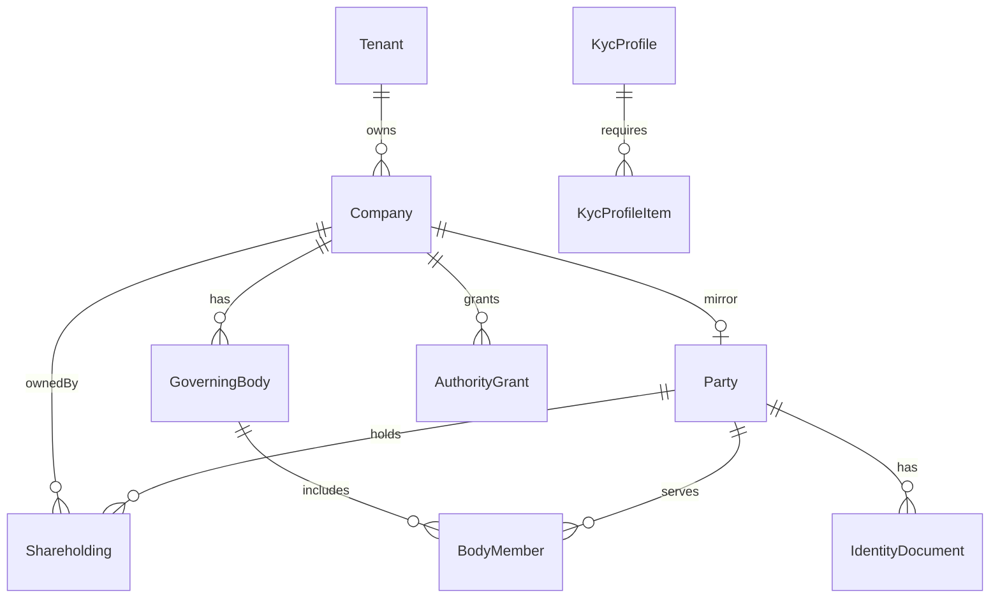
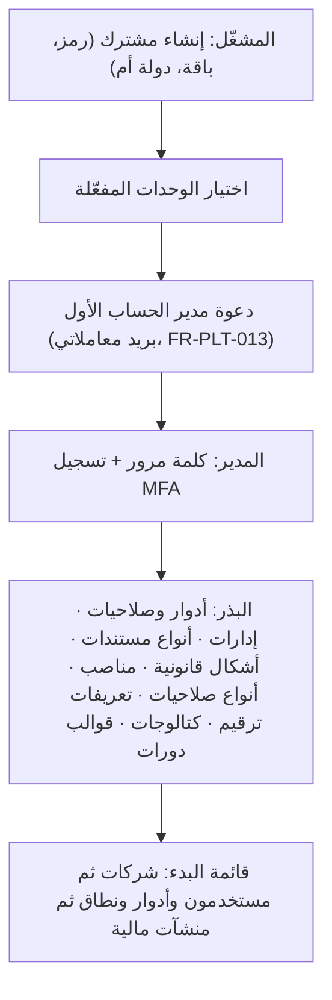
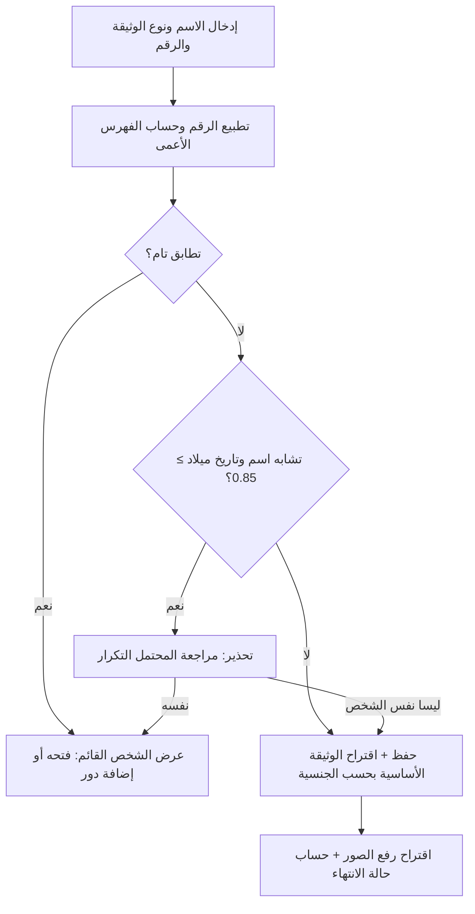
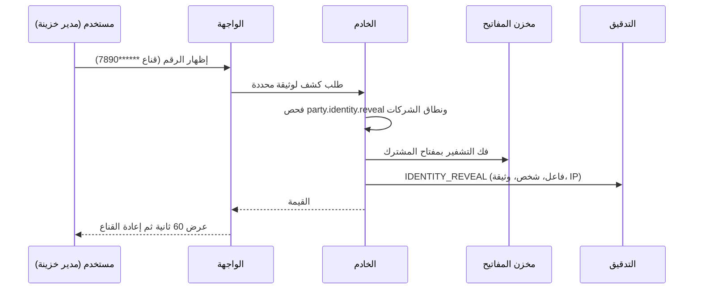
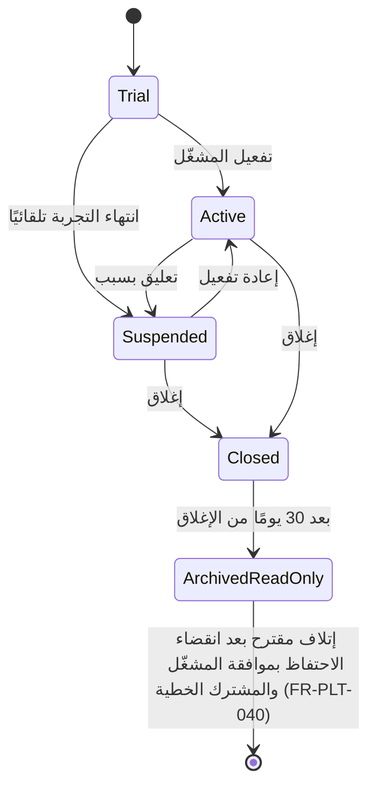
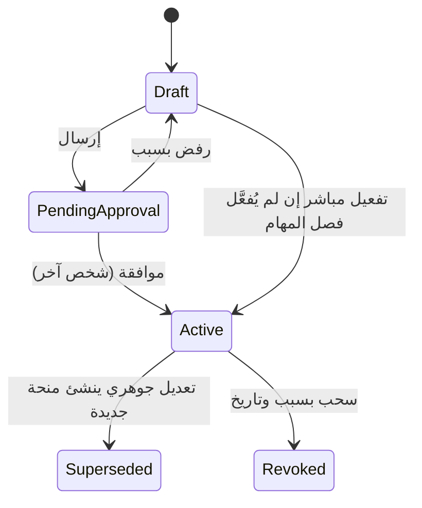

# التحليل التفصيلي — م0 المنصة والاشتراكات · م1 الهيكل المؤسسي · النموذج المشترك «الشخص/الجهة» (Party)

| البند | القيمة |
|---|---|
| البادئات | PLT (المنصة) · ORG (الهيكل المؤسسي) · PTY (الأشخاص والجهات) |
| الحالة | مسودة تحليل تفصيلي للمراجعة — 2026-10-10 |
| المصادر | `01` (D-1…D-13، القسمان 6 و13) · `02` (F-9, F-10, F-13) · `03` (القسم 7) · `04` (Δ14 والقسم 9.4) · وثيقة `bank-facilities/01` للأفكار القابلة لإعادة الاستخدام (نطاق الشركات، فصل المهام) |
| وسوم المصدر | 🟢 ذكره المستخدم أو وردت في الوثائق · 🟡 اقتراح (له افتراضي ويُعدَّل) |
| محسوم (الجولة الخامسة) | الهويات الكاملة لمدير الخزينة ومسؤول التسهيلات فقط (04 س-10) وتُقفل صلاحياتها منصةً على هذين الدورين (BR-PLT-019) · صور الوثائق تُحفظ مع الأرقام (04 س-11) · مرجع قائمة الاكتمال هو نموذج «اعرف عميلك» (KYC) من البنوك (04 س-12؛ لم يُرفع بعد) |
| ترقيم الأسئلة | `س-n` وحدها غامضة لأن `01` و`04` تستعملان الأرقام نفسها لأسئلة مختلفة؛ تُكتب دائمًا مسبوقة بمصدرها (مثل 04 س-10 و01 س-10) |
| خصوصية الوثيقة | لا تتضمن أسماء أشخاص ولا أرقام هويات ولا أسماء شركات ولا سجلات تجارية؛ الأمثلة الرقمية افتراضية |

## 1. الغرض والنطاق (داخل/خارج النطاق)

**الغرض.** هذه الوحدات هي الأساس الذي تقوم عليه بقية المنصة. **م0** تعزل كل مشترك (Tenant) وتدير دخول موظفيه وصلاحياتهم وتدقيق أفعالهم وتخزّن مستنداتهم وترقّم سجلاتهم. **م1** تمثّل الهيكل المؤسسي للمشترك: الشركات والملاك والحوكمة والتفويضات والإدارات. **النموذج المشترك (Party)** يوحّد «الشخص/الجهة» فلا يُدخل الشخص نفسه مرتين أيًّا كان دوره (مالك، عضو مجلس، مفوَّض، كفيل، جهة اتصال)، ويحمي بيانات الهوية التي تُخزَّن كاملة بقرار 2026-10-10.

| داخل النطاق | الشريحة |
|---|---|
| المشتركون والباقات والوحدات المفعّلة ولوحة المشغّل وتهيئة المشترك الأولية | S0 |
| الدخول المحلي مع MFA والقفل؛ البريد المعاملاتي لرسالتي الدعوة وإعادة تعيين كلمة المرور فقط (FR-PLT-013)؛ المستخدمون والأدوار والصلاحيات ونطاق الشركات؛ سجل التدقيق؛ الترقيم؛ مخزن المستندات؛ التوطين والهجري؛ العزل وRLS والتشفير؛ سياسة الإصدارات (FR-PLT-045)؛ التصدير والاحتفاظ | S0 |
| الشركات وأشكالها القانونية وهرمها وإعداداتها الضريبية والمالية؛ الإدارات؛ المستندات الحكومية وتنبيهات انتهائها | S1 |
| الأشخاص والجهات: وثائق الهوية وصورها، العناوين، وسائل الاتصال، الحقول المخصصة، منع التكرار والدمج، تنبيهات الانتهاء، الأدوار المشتقة | S1 |
| الملكية (حصص بفترات سريان) وهيئات الحوكمة وأعضاؤها ومنح الصلاحيات (AuthorityGrant) | S1-ب |
| قوائم اكتمال KYC لكل بنك وحزمة بيانات الكفيل القابلة للطباعة | S2 |

| خارج النطاق | المالك أو الموعد |
|---|---|
| الفوترة وبوابة الدفع (يُنشأ المشتركون يدويًا من لوحة المشغّل) | لاحقًا؛ 01 س-3 |
| تفعيل SSO فعليًا (تُهيَّأ نقطة الربط فقط) ومزامنة المستخدمين مع HR/AD | لاحقًا (الفقرة 11) |
| المنشآت المالية والحسابات البنكية والمفوَّضون لدى البنوك | `11` (INS, ACC) |
| التسهيلات والكفالات نفسها (الكفيل هنا Party فقط) | `12` (FAC, COL) |
| محرك الدورات وتسليم الإشعارات: `13` تملك Notification وواجهة الإصدار Emit وكتالوج الأحداث وبريد الإشعارات (S5) (هنا: توليد أحداث التنبيه فقط، والبريد المعاملاتي للدعوة وإعادة التعيين منفصل عنها) | `13` (WFL, NTF) |
| صيغة ترقيم البروفورما ومحتوى الاعتمادات المستندية (LC) (هنا: آلية التخصيص فقط) | `14` |
| التوقيع الإلكتروني، الاستخراج الآلي من المسح (OCR)، الرسم البياني للهيكل | لاحقًا (Could) |
| الاستشارة القانونية: القوائم البذرية للأشكال القانونية وأنواع المستندات والتفويضات اقتراحات تراجعها جهة قانونية | خارج المنصة |

## 2. الجهات والصلاحيات (role matrix: role x action)

الرموز: ✔ مسموح · ◐ مقيّد (نطاق الشركات، أو كتابة بلا قراءة، أو مقنَّع) · — غير مسموح. الأدوار الافتراضية قابلة للتخصيص (FR-PLT-018) **عدا** الصلاحيات الحساسة المقفلة 🔒 (الصفوف 18 و19 و20 والجزء المقيّد من الصفين 24 و25): هي لمدير الخزينة (TM) ومسؤول التسهيلات (FO) **فقط** 🟢، وقفلها على هذين الدورين قفل منصة لا يستطيع مدير الحساب رفعه (BR-PLT-019).

| # | الإجراء | مشغّل المنصة | مدير الحساب (TA) | مدير الخزينة (TM) | مسؤول التسهيلات (FO) | موظف الخزينة | مدير قسم / رئيس قطاع | جهة طالبة | مدقق |
|---|---|---|---|---|---|---|---|---|---|
| 1 | إنشاء المشتركين وتعليقهم وإدارة الباقات والوحدات | ✔ | — | — | — | — | — | — | — |
| 2 | دخول بيانات مشترك للدعم (جلسة مؤقتة، دون بيانات مقيّدة) | ◐ | — | — | — | — | — | — | — |
| 3 | إدارة المستخدمين والأدوار ونطاق الشركات | — | ✔ | — | — | — | — | — | — |
| 4 | إعدادات الأمان والترقيم وقواعد التنبيه والاحتفاظ (وأنواع المستندات من كتالوجات `11`) | — | ✔ | ◐ | — | — | — | — | — |
| 5 | عرض سجل التدقيق | — | ✔ | ◐ | — | — | — | — | ✔ |
| 6 | تصدير سجل التدقيق | — | ✔ | — | — | — | — | — | ✔ |
| 7 | إنشاء الشركات وتعديل هيكلها وإعداداتها | — | ✔ | ✔ | ◐ | — | — | — | — |
| 8 | عرض الشركات (ضمن نطاق المستخدم) | — | ✔ | ✔ | ✔ | ✔ | ◐ | ◐ | ✔ |
| 9 | تسجيل الملكية وتغييرها | — | — | ✔ | ✔ | — | — | — | — |
| 10 | إدارة هيئات الحوكمة وأعضائها | — | — | ✔ | ✔ | — | — | — | — |
| 11 | إنشاء منح الصلاحيات (AuthorityGrant) | — | — | ✔ | ✔ | — | — | — | — |
| 12 | الموافقة على منح الصلاحيات (شرط: الموافِق غير المنشئ) | — | — | ✔ | ✔ | — | — | — | — |
| 13 | رفع المستندات الحكومية وإدارتها | — | ◐ | ✔ | ✔ | ◐ | — | — | — |
| 14 | عرض المستندات غير المقيّدة (ضمن النطاق) | — | ◐ | ✔ | ✔ | ✔ | ◐ | ◐ | ✔ |
| 15 | إنشاء الأشخاص وتعديل بياناتهم غير المقيّدة | — | — | ✔ | ✔ | ◐ | — | — | — |
| 16 | إدخال/استبدال أرقام الهويات وصورها (كتابة فقط) | — | — | ✔ | ✔ | ◐ | — | — | — |
| 17 | استعراض الأشخاص (الأرقام مقنَّعة) | — | — | ✔ | ✔ | ✔ | — | — | ◐ |
| 18 | **كشف أرقام الهويات كاملة** 🟢 🔒 `party.identity.reveal` | — | — | ✔ | ✔ | — | — | — | — |
| 19 | **عرض صور وثائق الهوية** 🟢 🔒 `party.identity.image.view` | — | — | ✔ | ✔ | — | — | — | — |
| 20 | طباعة/تصدير حزمة الكفيل بأرقام كاملة وصور 🔒 `party.pack.export` | — | — | ✔ | ✔ | — | — | — | — |
| 21 | طباعة مسودة الحزمة بأرقام مقنَّعة | — | — | ✔ | ✔ | ✔ | — | — | — |
| 22 | دمج الأشخاص المكرَّرين | — | — | ✔ | ✔ | — | — | — | — |
| 23 | إدارة قوائم الاكتمال (KycProfile) | — | — | ✔ | ✔ | — | — | — | — |
| 24 | تصدير قوائم الأشخاص (الأعمدة المقيّدة بصلاحية 🔒 `party.export.sensitive` مع صلاحيتي 18 و20) | — | — | ✔ | ✔ | — | — | — | — |
| 25 | تصدير بيانات المشترك الكاملة وتنفيذ الاحتفاظ والإتلاف | — | ✔ | ◐ | ◐ | — | — | — | — |

ملاحظات: (أ) مدير الحساب لا يملك صلاحيات الأعمال تلقائيًا؛ إسناده أي صلاحية حساسة لنفسه يُسجَّل بشدة عالية ويُشعَر به المديرون الآخرون (BR-PLT-008)؛ والصلاحيات المقفلة 🔒 لا تُنقل إلى أي دور آخر ولا يمنحها مدير الحساب إلا بإسناد دور TM أو FO لمستخدم، وهو إسناد مدقَّق بشدة عالية. (ب) الصف 25: الجزء المقيّد من التصدير (أرقام الهويات والصور) يلزمه موافقة حامل صلاحية الكشف (BR-PLT-016). (ج) الجهة الطالبة تشمل المشتريات والمبيعات؛ أدوارها التفصيلية تعرّفها وحدات الطلبات (`13`). (د) الصف 5: ◐ لمدير الخزينة تعني `audit.view.treasury` (أحداث بيانات الخزينة وكشف الهويات فقط)؛ مسؤول التسهيلات لا يملك أي صلاحية عرض تدقيق؛ و`audit.view` لمدير الحساب والمدقق وحدهما (BR-PLT-008). (هـ) مشترك في حالة ARCHIVED_READ_ONLY لا يملك مدير حساب فعّالًا: يوافق المشغّل على اقتراح الإتلاف بموافقة المشترك الخطية (BR-PLT-002، FR-PLT-040). (و) أكواد الصلاحيات كلها مملوكة لهذه الوحدة (FR-PLT-017) وتستشهد بها الملفات الأخرى بنصها الحرفي.

## 3. المفاهيم والمسرد

| المصطلح | التعريف في هذه الوثيقة |
|---|---|
| المشترك (Tenant) | شركة أو مجموعة مشتركة في المنصة، بياناتها معزولة تمامًا عن غيرها |
| الوحدة (Module) | حزمة وظائف قابلة للتفعيل لكل مشترك (TenantModule) برمز ModuleCode؛ الوحدة CORE (PLT وORG وPTY ومعها CAT وNTF بحسب `00` §9-ب) لا تُعطَّل |
| موافقة / اعتماد مستندي (LC) | «موافقة» للإجراء الإداري (موافقة المدير، موافقة مدير الخزينة)، و«اعتماد مستندي (LC)» للخطاب نفسه؛ لا يُستعمل «اعتماد» وحده إلا حيث لا لبس (قرار D-13، `00` §4) |
| الصلاحية المقفلة 🔒 | صلاحية حساسة لا تُسند منصةً إلا لدوري النظام TM وFO؛ لا يضيفها مدير الحساب لدور آخر ولا لدور مخصص (BR-PLT-019) |
| مسؤول المشغّل (Operator) | موظف المنصة (نحن)؛ هويته منفصلة عن مستخدمي المشتركين |
| فئات الحساسية | عامة (Public) · داخلية (Internal) · سرّية (Confidential: بيانات شخصية وعناوين ومالية) · مقيَّدة (Restricted: أرقام الهويات وصورها وأسرار الدخول والمفاتيح) |
| الكشف (Reveal) | إظهار قيمة مقيّدة غير مقنَّعة لمستخدم يملك الصلاحية؛ كل كشف يُسجَّل |
| القناع (Mask) | عرض آخر 4 خانات فقط (`******7890`) دون فك تشفير القيمة |
| الفهرس الأعمى (Blind index) | بصمة HMAC للرقم المطبَّع تتيح البحث بالتطابق التام وكشف التكرار دون تخزين الرقم مكشوفًا |
| RLS | أمان على مستوى الصف في SQL Server يفرض عزل المشترك من القاعدة نفسها |
| نطاق الشركات | قائمة الشركات التي يراها المستخدم (UserCompanyScope) |
| التسلسل بلا فجوات | ترقيم لا يُعاد استخدام رقم فيه ولا يُترك فيه رقم محجوز دون استعمال إلا بإلغاء موثَّق |
| الهجري / ميلادي | يُخزَّن الميلادي أصلًا، ويُعرض الهجري (أم القرى) ويُدخل في حقول محددة مع حفظ النص المُدخل |
| منح الصلاحية (AuthorityGrant) | تفويض: من + نوع الصلاحية + سقف اختياري + توقيع مشترك + فترة + مستند المصدر (D-5) |
| الوثيقة الأساسية | وثيقة الهوية المعتمدة أولًا للشخص بحسب جنسيته وإقامته (BR-PTY-004) |
| ملف الاكتمال (KycProfile) | قائمة بما يطلبه بنك معيّن عن شخص بدور معيّن، مبنية على نموذج KYC الخاص به |
| مزوّد الاستخدام (Usage provider) | واجهة تسجّلها كل وحدة تشير إلى Party، فتكشف أدوار الشخص المشتقة وتتيح الدمج؛ القائمة المعتمدة في BR-PTY-001 |
| البذرة (Seed) | بيانات افتراضية تُزرع عند إنشاء المشترك وتُعلَّم بـ SeedKey ليمكن تحديثها دون إلغاء تعديلات المشترك |
| وصول الدعم (Break-glass) | دخول مؤقت للمشغّل إلى بيانات مشترك بموافقة مديره وتحت التدقيق |

## 4. المتطلبات الوظيفية

الأولوية: Must = لازم للشريحة · Should = مهم ويمكن تأجيله داخل الشريحة · Could = تحسين. الأرقام الافتراضية الواردة في المعايير اقتراحات 🟡 قابلة للتعديل من إعدادات المشترك (FR-PLT-043).

### 4.1 المنصة والاشتراكات (PLT)

| المعرّف | المتطلب | الأولوية | الشريحة | المصدر | معيار القبول |
|---|---|---|---|---|---|
| FR-PLT-001 | إنشاء مشترك برمز فريد (لاتيني وأرقام وشرطة) وأسماء Ar/En وباقة ودولة أم ولغة وتوقيت افتراضيين | Must | S0 | 🟢 | إنشاء مشترك بحالة TRIAL وتاريخ نهاية تجريبي (الافتراضي 30 يومًا)؛ رمز مكرر يُرفض |
| FR-PLT-002 | دورة حياة المشترك Trial / Active / Suspended / Closed / ArchivedReadOnly بانتقالات مسجَّلة بالسبب والفاعل (BR-PLT-002) | Must | S0 | 🟢 | كل انتقال يُنتج حدث تدقيق وحدث `tenant.status_changed`؛ انتقال غير مسموح (Closed إلى Active) يُرفض؛ مشترك ARCHIVED_READ_ONLY يرفض أي كتابة |
| FR-PLT-003 | تفعيل الوحدات لكل مشترك (TenantModule) من الباقة مع إمكان التخصيص، ومنع تعطيل النواة أو وحدة يعتمد عليها غيرها بحسب الاعتماديات في `00` §9-ب | Must | S0 | 🟢 | تعطيل وحدة CORE (PLT وORG وPTY وCAT وNTF) يُرفض؛ وحدة معطّلة تختفي من الواجهة وتُرجع 403 من API دون حذف بياناتها |
| FR-PLT-004 | حدود الباقة الناعمة (مستخدمون، شركات، تخزين) تنبّه ولا تمنع، ولا فوترة | Should | S0 | 🟡 | عند 90% من حد يظهر تنبيه لمدير الحساب والمشغّل؛ لا يُمنع إنشاء سجل |
| FR-PLT-005 | لوحة المشغّل: قائمة المشتركين وحالاتهم وعدّادات الاستخدام فقط، مع تعليق وإعادة تفعيل وإغلاق | Must | S0 | 🟢 | لا تعرض أي بيانات أعمال؛ اختبار: استعلامات المشغّل لا تلمس جداول بيانات المشترك |
| FR-PLT-006 | حسابات المشغّل في مخزن هوية منفصل (PlatformOperator) مع MFA إلزامي وأدوار OPERATOR_ADMIN وOPERATOR_SUPPORT | Must | S0 | 🟡 | لا يدخل حساب مشغّل بوابة مشترك ولا العكس |
| FR-PLT-007 | وصول الدعم المؤقت: يفعّله مدير حساب المشترك لمدة محددة (الافتراضي معطّل) ويُسجَّل كل ما يراه المشغّل ولا يرى بيانات مقيّدة أبدًا | Should | S0 | 🟡 | ينتهي الوصول تلقائيًا؛ محاولة كشف رقم هوية من جلسة دعم تُرفض وتُسجَّل |
| FR-PLT-008 | تهيئة المشترك: بذر آلي قابل للتكرار ومُرقَّم الإصدار للأدوار والصلاحيات والإدارات وأنواع المستندات والأشكال القانونية وأنواع الصلاحيات والمناصب وتعريفات الترقيم والكتالوجات (`11`) وقوالب الدورات (`13`) عبر عقد بذر (ITenantSeeder) تسجّل به كل وحدة حزمتها | Must | S0 | 🟢 | تشغيل البذر مرتين لا يكرر شيئًا؛ صف عدّله المشترك لا يُستبدل عند ترقية البذرة ويُعرض الفرق للمراجعة |
| FR-PLT-009 | قائمة بدء لمدير الحساب (شركات، مستخدمون وأدوار ونطاق، منشآت مالية) بنسبة إنجاز | Could | S0 | 🟡 | تُحسب الخطوات المنجزة من البيانات الفعلية لا من علامات يدوية |
| FR-PLT-010 | الدخول المحلي بالبريد وكلمة مرور بسياسة قوية، مُجزَّأة بخوارزمية بطيئة مملّحة؛ يشدّد المشترك السياسة ولا يخففها عن حد المنصة | Must | S0 | 🟢 | كلمة أقصر من الحد أو واردة في قوائم التسريبات تُرفض؛ لا تُخزَّن ولا تُسجَّل نصًا |
| FR-PLT-011 | مصادقة متعددة العوامل بتطبيق TOTP، إلزامية افتراضيًا للجميع، مع 10 رموز استرداد لمرة واحدة | Must | S0 | 🟢 | مستخدم بلا MFA لا يكمل الدخول؛ رمز الاسترداد يُستهلك مرة واحدة |
| FR-PLT-012 | قفل الحساب بعد محاولات فاشلة متتالية، وفك القفل بالمدير، ورسائل خطأ موحّدة لا تكشف وجود المستخدم | Must | S0 | 🟢 | المحاولة السادسة خلال 15 دقيقة لا تُقبل حتى بكلمة صحيحة؛ الرسالة واحدة لمستخدم غير موجود |
| FR-PLT-013 | دعوة المستخدمين وإعادة تعيين كلمة المرور برابط لمرة واحدة ومحدود المدة (48 ساعة للدعوة، 30 دقيقة للإعادة)، يُرسَل بخدمة بريد معاملاتي (Transactional e-mail) تقدّمها هذه الوحدة في S0 لهاتين الرسالتين فقط عبر مرحّل SMTP تهيّئه الاستضافة، **منفصلة تمامًا** عن بريد الإشعارات في S5 (`13` FR-NTF-013) ولا تعتمد على Notification ولا على كتالوج الأحداث؛ الرابط مجزّأ في القاعدة ولا يحمل بيانات مقيّدة | Must | S0 | 🟡 | رابط مستعمل أو منتهٍ يُرفض؛ الاستجابة لا تكشف هل البريد مسجَّل؛ دعوة مدير الحساب الأول تصل بالبريد في S0 والوحدة `13` غير مفعّلة؛ فشل الإرسال يُسجَّل في التدقيق |
| FR-PLT-014 | إدارة الجلسات: مهلة خمول (30 دقيقة) ومطلقة (12 ساعة)، عرض الجلسات وإنهاؤها، وإعادة مصادقة قبل التصدير الحساس | Should | S0 | 🟡 | بعد 30 دقيقة بلا نشاط يُطلب دخول جديد؛ إنهاء جلسة من المدير يسري خلال دقيقة |
| FR-PLT-015 | جاهزية SSO: ربط هوية خارجية (OIDC / Microsoft Entra ID) بالمستخدم لكل مشترك مع حساب محلي طارئ للمدير | Could | S5 | 🟢 | (لاحقًا) نقطة الربط موثّقة؛ تفعيله لا يغيّر نموذج الصلاحيات |
| FR-PLT-016 | إدارة المستخدمين: إنشاء/دعوة/تعطيل/أرشفة، الإدارة، المدير المباشر، نطاق الشركات؛ ولا يُترك المشترك بلا مدير حساب فعّال | Must | S0 | 🟢 | تعطيل آخر مدير حساب فعّال يُرفض |
| FR-PLT-017 | كتالوج الصلاحيات (Permission) تملكه المنصة: رمز، وحدة، وصف Ar/En، علم «حساسة»، وقائمة الأدوار المقفلة عليها إن وُجدت (LockedToRoleCodes)؛ تملك هذه الوحدة كل أكواد الصلاحيات (party.* وaudit.* وغيرها) وتقترح كل وحدة رموز صلاحياتها (ins.* وacc.* وcat.* وfac.* وغيرها) فتُسجَّل في الكتالوج بنصها الحرفي، ولا تستشهد الملفات الأخرى إلا بالرموز الحرفية الموجودة فيه؛ يتحدّث مع الإصدارات | Must | S0 | 🟢 | لا يضيف المشترك صلاحية؛ صلاحية جديدة تظهر غير ممنوحة لأحد؛ اختبار آلي: كل رمز صلاحية يرد في مصفوفة أدوار أي ملف وحدة موجود في الكتالوج وإلا يفشل البناء |
| FR-PLT-018 | الأدوار: أدوار نظام مبذورة ومخصصة، ربط الدور بالصلاحيات، ومستخدم بأكثر من دور (اتحاد الصلاحيات)؛ عدا الصلاحيات المقفلة (FR-PLT-019) | Must | S0 | 🟢 | تعديل دور يسري على مستخدميه في الطلب التالي؛ لا توجد صلاحية «منع» |
| FR-PLT-019 | الصلاحيات الحساسة المقفلة 🔒 (`party.identity.reveal` كشف الهويات، `party.identity.image.view` صور الوثائق، `party.pack.export` تصدير الحزمة، `party.export.sensitive` الأعمدة المقيّدة) **لا تُسند إلا لدوري النظام مدير الخزينة (TM) ومسؤول التسهيلات (FO)** قفلَ منصة: لا يضيفها مدير الحساب لدور آخر ولا يُنشئ دورًا مخصصًا يحملها (BR-PLT-019). دمج الأشخاص (`party.merge`) افتراضيًا لـ TM وFO. عرض التدقيق لمدير الحساب والمدقق (`audit.view`) ولمدير الخزينة `audit.view.treasury`؛ ولا عرض تدقيق لمسؤول التسهيلات. كل إسناد لدور TM أو FO أو سحب منه ومحاولة إسناد مرفوضة مدقَّق بشدة عالية ويُشعَر المديرون | Must | S0 | 🟢 | موظف الخزينة لا يرى زر الكشف؛ محاولة مدير الحساب إضافة `party.identity.reveal` إلى دور «موظف خزينة» (أو إلى دور مخصص جديد) **تُرفض** برمز PERMISSION_LOCKED ويبقى الزر غائبًا ويُدقَّق الرفض بشدة عالية؛ إسناد دور TM لمستخدم جديد يُولِّد إشعارات المنح |
| FR-PLT-020 | نطاق الشركات (UserCompanyScope): الكل أو قائمة مختارة مع خيار تضمين التابعات، يُطبَّق في كل استعلام وبحث وتقرير | Must | S0 | 🟢 | مستخدم نطاقه شركة (س) لا يجد بيانات شركة (ص) في القوائم ولا البحث ولا بالمعرّف المباشر (404) |
| FR-PLT-021 | ترتيب تقييم الصلاحية: حالة المشترك ثم المصادقة ثم الصلاحية ثم نطاق الشركة ثم قواعد السجل، والرفض هو الأصل | Must | S0 | 🟡 | اختبار على كل نقطة API: بلا صلاحية = 403؛ خارج النطاق = 404 |
| FR-PLT-022 | سجل التدقيق للإدراج فقط: CRUD على الكيانات المتتبَّعة، الدخول والخروج والفشل والقفل، تغييرات الصلاحيات، الكشف، التصدير، التنزيل | Must | S0 | 🟢 | لا يملك حساب التطبيق UPDATE/DELETE على الجدول؛ كل نوع حدث مذكور يُولِّد صفًا |
| FR-PLT-023 | محتوى الحدث: الفاعل والنوع والكيان والمشترك والشركة والقيم قبل/بعد والارتباط والعنوان والنتيجة؛ والقيم المقيّدة لا تُسجَّل مكشوفة أبدًا | Must | S0 | 🟢 | تعديل رقم هوية يسجّل «تغيّر» وآخر 4 خانات قبل/بعد فقط |
| FR-PLT-024 | عارض التدقيق بتصفية (فاعل، كيان، فترة، نوع، شركة) وتصدير؛ ومشاهدة التدقيق وتصديره مدقَّقان | Must | S0 | 🟡 | فتح العارض يضيف حدث AUDIT_VIEWED |
| FR-PLT-025 | سلامة التدقيق: سلسلة بصمات لكل مشترك وفحص دوري يكشف العبث | Should | S2 | 🟡 | تعديل صف يدويًا في بيئة اختبار يفشّل فحص السلسلة ويولّد تنبيهًا |
| FR-PLT-026 | الترقيم (NumberSequence): تعريف لكل مشترك/نوع/نطاق (شركة اختياريًا)/سنة بصيغة بوسوم، تخصيص ذرّي بلا فجوات، وإلغاء موثَّق لا يُعاد استخدامه | Must | S0 | 🟢 | طلبان متزامنان لا يأخذان رقمًا واحدًا؛ الصيغة `{seq:000}-{erp}-{yy}` تنتج `001-XX01-26` |
| FR-PLT-027 | مخزن مستندات مشفَّر بمسارات معزولة لكل مشترك، بصمة SHA-256 يحسبها الخادم، وإصدارات ثابتة لا تُستبدل | Must | S0 | 🟢 | رفع نسخة جديدة ينشئ إصدارًا ولا يعدّل السابق؛ البصمة المخزّنة تطابق إعادة الحساب |
| FR-PLT-028 | بيانات المستند (الرقم، الإصدار، الانتهاء، جهة الإصدار) وربطه بأي كيان (DocumentLink) مع الصفحة المرجعية، وتفرض PLT أعلام DocumentType التي تعرّفها `11` (RequiresExpiry وIsSensitive وAllowedMime وMaxSizeMb) | Must | S0 | 🟢 | المستند الواحد يُربط بعدة كيانات؛ نوع RequiresExpiry يمنع الحفظ بلا تاريخ انتهاء؛ ونوع IsSensitive يقيّد العرض والتنزيل بصلاحية الكشف |
| FR-PLT-029 | فحص الرفع: قبول الأنواع المسموحة بفحص المحتوى لا الامتداد، حد حجم (25 ميغابايت)، فحص برمجيات خبيثة قبل الإتاحة، وتنبيه عند تطابق البصمة مع ملف سابق | Must | S0 | 🟡 | ملف تنفيذي بامتداد pdf يُرفض؛ ملف مشبوه يبقى في الحجر ولا يُنزَّل |
| FR-PLT-030 | التنزيل والمعاينة عبر نقطة مصرَّحة فقط؛ المستندات المقيّدة (صور الهوية) تتطلب صلاحية الكشف وتُدقَّق، بلا روابط مباشرة ولا مصغّرات لغير المخوَّلين | Must | S0 | 🟢 | بلا صلاحية: 403 للصورة والمصغّرة؛ كل تنزيل يُسجَّل |
| FR-PLT-031 | فحص سلامة الملفات: مهمة دورية تعيد حساب البصمات وتبلّغ بأي اختلاف | Should | S2 | 🟡 | تغيير بايت في ملف مخزَّن يظهر في تقرير السلامة في أول دورة |
| FR-PLT-032 | واجهة **إنجليزية (LTR) لغةً أساسية** والعربية (RTL) تُضاف لاحقًا بملفات موارد دون تعديل الكود (قرار 2026-10-10)؛ تُصمَّم الصفحات منذ البداية لتحمّل الاتجاهين (خصائص CSS منطقية) فلا إعادة بناء عند إضافة العربية؛ أسماء الكتالوجات بلغتين | Must | S0 | 🟢 | كل نص مرئي مأخوذ من الموارد؛ تبديل لغة تجريبية إلى RTL لا يكسر تخطيط أي صفحة (اختبار آلي) |
| FR-PLT-033 | التقويم المزدوج: تخزين ميلادي، عرض هجري (أم القرى)، وإدخال هجري في حقول معلَّمة مع حفظ النص المُدخل | Must | S0 | 🟢 | إدخال تاريخ هجري يُخزِّن الميلادي المكافئ ويعرض النص المُدخل؛ تاريخ هجري غير موجود يُرفض |
| FR-PLT-034 | تنسيقات الأرقام والتواريخ والعملات بتفضيل المستخدم والمشترك؛ الأوقات تُخزَّن بالتوقيت العالمي وتُعرض بتوقيت المشترك؛ ولكل مستخدم لغة مفضّلة (AppUser.PreferredLanguage) يقرؤها `13` (FR-NTF-024) لاختيار لغة الإشعار، والفارغ يعني لغة المشترك الافتراضية | Should | S0 | 🟡 | الأرقام الغربية (0-9) افتراضية؛ تفضيل المستخدم يغيّر العرض لا التخزين؛ مستخدم PreferredLanguage=en تُحلّ لغته `en` عند إصدار الإشعار، ومستخدم بلا قيمة تُحلّ لغته إلى لغة المشترك الافتراضية |
| FR-PLT-035 | تقويم العطل: عطلة الأسبوع لكل دولة (Country.WeekendDays في `11`) وقائمة أيام غير العمل، وخدمة حساب أيام العمل AddWorkingDays وساعات العمل AddBusinessHours (نافذة work.start–work.end من FR-PLT-043) تستعملها كل الوحدات دالةً واحدة | Must | S2 | 🟡 | إضافة 3 أيام عمل إلى الخميس 2026-10-08 (عطلة الأسبوع الجمعة والسبت) تعطي الثلاثاء 2026-10-13؛ الاثنين 2026-10-12 09:00 + 24 ساعة عمل = الأربعاء 2026-10-14 15:00 (BR-PLT-014) |
| FR-PLT-036 | العزل: عمود TenantId في كل جدول مملوك للمشترك وسياسة RLS (تصفية ومنع كتابة) بسياق الجلسة، وفشل مغلق عند غياب السياق؛ ويشمل ذلك فئة «الكتالوج المختلط النطاق» (TenantId اختياري، صفوفه العامة للقراءة فقط، سياسة RLS مستقلة) كما في BR-PLT-001 | Must | S0 | 🟢 | اختبار آلي في التكامل المستمر: سياق المشترك A لا يعيد أي صف للمشترك B من أي جدول يحمل TenantId (مكتشف من الميتاداتا)؛ وللجداول المختلطة: A يرى صفوفه والصفوف العامة ولا يرى صفوف B، وكتابة A على صف عام أو بـ TenantId لـ B تُرفض، وبلا سياق 0 صفوف، وجدول بـ TenantId اختياري غير مسجَّل في قائمة المختلطة يفشل البناء |
| FR-PLT-037 | إدارة مفاتيح التشفير: مفتاح بيانات لكل مشترك ملفوف بمفتاح رئيسي منفصل التخزين، وتدوير دون توقف وسجل أحداث المفاتيح، وخدمة تشفير وتقنيع مشتركة تستعملها كل الوحدات | Must | S0 | 🟡 | بعد التدوير تُقرأ البيانات القديمة والجديدة؛ استعادة نسخة احتياطية بلا المفتاح الرئيسي لا تكشف الأعمدة المشفَّرة |
| FR-PLT-038 | إطار تنبيهات الانتهاء: قواعد (ExpiryAlertRule) لكل نوع عنصر بعتبات أيام ومستلمين بالدور والنطاق، ومهمة يومية تُنتج حدثًا واحدًا لكل (عنصر، عتبة) | Must | S1 | 🟢 | تجديد التاريخ يعيد ضبط العتبات؛ التشغيل المكرر في اليوم نفسه لا يكرر التنبيه |
| FR-PLT-039 | تصدير بيانات المشترك (JSON/CSV + ملفات) بطلب مدير الحساب، والبيانات المقيّدة بحسب الصلاحية، في حزمة مختومة بكلمة يحددها الطالب | Should | S5 | 🟢 | الطالب بلا صلاحية الكشف يحصل على حزمة بلا أرقام هويات كاملة ولا صور؛ الحدث مدقَّق ببصمة الحزمة |
| FR-PLT-040 | سياسات الاحتفاظ وسير الإتلاف (تقرير ثم موافقة ثم إتلاف أو إخفاء) بلا حذف تلقائي؛ وللمشترك المؤرشف (ARCHIVED_READ_ONLY) لا يُقترح الإتلاف إلا بعد انقضاء مدة الاحتفاظ النظامية ويوافق عليه المشغّل بموافقة المشترك الخطية المرفقة بالطلب (BR-PLT-002) | Should | S5 | 🟡 | لا حذف دون موافقة؛ كل إتلاف يُدقَّق بعدد السجلات وبصمة التقرير؛ اقتراح إتلاف لمشترك مؤرشف قبل انقضاء المدة أو بلا موافقة خطية مرفقة يُرفض |
| FR-PLT-041 | واجهات برمجية أولًا: كل وظيفة متاحة عبر REST موثّق تستهلكه الواجهة نفسها، بمعرّفات GUID خارجية وإصدار للواجهة | Must | S0 | 🟢 | كل شاشة تعمل باستدعاءات موثّقة فقط؛ وثيقة OpenAPI تُولَّد في البناء |
| FR-PLT-042 | أحداث النطاق وطابور الإرسال (Outbox) بتسليم مرة واحدة على الأقل، دون بيانات مقيّدة في الحمولة؛ أسماؤها نقطية بحروف صغيرة `domain.event_name` (`00` §5) كما في الفقرة 11 | Should | S1 | 🟢 | حدث `company.created` يدخل الطابور في معاملة الحفظ نفسها؛ حمولته بلا أرقام هويات |
| FR-PLT-043 | إعدادات المشترك (TenantSetting) بحدود دنيا تفرضها المنصة (كلمات المرور، المهل، عتبات التنبيه، مدة إعادة الإخفاء) وساعات العمل `work.start` و`work.end` (الافتراضي 08:00 و17:00 بتوقيت المشترك؛ الحدود: work.end بعد work.start بأربع ساعات على الأقل وبـ 12 ساعة على الأكثر) التي تعتمد عليها حسابات SLA والتذكير في `13` (BR-WFL-012) | Must | S0 | 🟡 | قيمة أضعف من حد المنصة تُرفض مع شرح السبب؛ ضبط work.start=08:00 وwork.end=10:00 يُرفض (أقل من 4 ساعات) وضبط 07:00–18:00 يُقبل |
| FR-PLT-044 | مهام خلفية لكل مشترك بإعادة محاولة وسجل آخر تشغيل ومدته ونتيجته ظاهر لمدير الحساب | Should | S0 | 🟡 | فشل مهمة التنبيه اليومية يظهر في شاشة المهام ويُعاد خلال ساعة |
| FR-PLT-045 | سياسة الإصدارات (قرار 01 §13: ويندوز وASP.NET Core على .NET وSQL Server بآخر إصدار GA مستقر دائمًا حتى لو كان قصير الدعم STS؛ جواب 01 ق-9 «الأحدث»): (1) **سجل إصدارات** في المستودع يثبّت إصدار .NET (GA عند بدء التنفيذ) وإصدار SQL Server (آخر GA) وإصدار Windows Server (يُتحقق منه عند تجهيز كل بيئة ويُسجَّل) وإصدارات الحزم الرئيسية؛ (2) **بوابة تكامل مستمر** تفشل البناء عند أي حزمة أو SDK أو صورة بوسم Preview أو RC أو Beta أو Alpha، وعند أي مشروع إطاره المستهدف أقدم من الإطار المثبّت في السجل؛ (3) **مراجعة موثَّقة** لكل إصدار GA جديد (بما فيه STS) لـ .NET وSQL Server خلال 30 يومًا من صدوره بقرار «ترقية» أو «تأجيل بسبب» يُحدَّث به السجل، ومهمة أسبوعية تقارن السجل بآخر إصدار منشور وتُنبّه فريق تشغيل المنصة (المشغّل) عند انقضاء المهلة بلا مراجعة؛ (4) لا نشر إنتاجي بإصدار Windows Server أو SQL Server مخالف للسجل | Must | S0 | 🟢 قرار 01 §13 (نافذة 30 يومًا 🟡) | بناء يشير إلى حزمة `x.y.z-preview.n` أو `-rc.n` يفشل بوابة التكامل المستمر برسالة تسمّي الحزمة؛ مشروع يستهدف إطارًا أقدم من المثبّت في السجل يفشل؛ صدور إصدار GA جديد دون سجل مراجعة بعد 30 يومًا يُنتج تنبيه المهمة الأسبوعية؛ نشر على خادم إصداره غير مطابق للسجل يُرفض؛ تغيير الإطار المثبّت في السجل بلا سجل مراجعة مرتبط يرفضه فحص المستودع |
| FR-PLT-046 | **النطاق والعناوين:** كل مشترك على عنوان فرعي `{رمز-المشترك}.bankfas.com` (النطاق `bankfas.com`)، وشهادة TLS شاملة (wildcard) أو شهادة لكل عنوان، وصفحة دخول واحدة على الموقع؛ رمز المشترك فريد وغير قابل للتغيير بعد التفعيل، ومحجوزة العناوين النظامية (`www`، `admin`، `api`، `app`…) | Must | S0 | 🟢 | الدخول عبر `acme.bankfas.com` يحمل سياق المشترك acme فقط؛ عنوان غير معروف يعطي صفحة محايدة بلا كشف عن وجود المشترك |
| FR-PLT-047 | **الاستضافة والنقل:** النشر الأول على **خادم VPS خاص لدى مزوّد استضافة** (بلا ضغط تشغيلي)، وتُجهَّز **حزمة نشر قابلة للنقل** إلى خادم محلي لدى مشترك يطلب خدمة خاصة به لاحقًا (إعدادات بيئية فقط، دون تغيير الكود) | Should | S5 | 🟢 | نشر الحزمة نفسها على بيئتين مختلفتين بإعدادات مختلفة يعمل دون تعديل الكود |

### 4.2 الهيكل المؤسسي (ORG)

| المعرّف | المتطلب | الأولوية | الشريحة | المصدر | معيار القبول |
|---|---|---|---|---|---|
| FR-ORG-001 | تعريف الشركة: رمز داخلي فريد، اسم Ar/En، دولة، حالة (نشطة/خاملة/مصفّاة/مؤرشفة)، تاريخ التأسيس | Must | S1 | 🟢 | رمز مكرر في المشترك يُرفض؛ مؤرشفة لا تظهر في القوائم المنسدلة وتبقى في السجلات |
| FR-ORG-002 | كتالوج الأشكال القانونية (LegalEntityType) لكل مشترك ودولة، مبذور وقابل للتعديل، مع هيئات الحوكمة الافتراضية للشكل | Must | S1 | 🟢 | إضافة شكل لدولة لا تغيّر الشركات القائمة؛ تعطيل شكل مستخدم لا يمسّ شركاته |
| FR-ORG-003 | علم «قابضة» مستقل عن الشكل القانوني | Must | S1 | 🟢 | تعليم شركة محدودة وشركة مساهمة كقابضة دون تغيير شكلهما |
| FR-ORG-004 | الشركة الأم والتابعات: شجرة، ومنع الحلقات المباشرة وغير المباشرة | Must | S1 | 🟢 | تعيين شركة أمًّا لأحد أسلافها يُرفض |
| FR-ORG-005 | المعرّفات الرسمية: السجل التجاري وتاريخه (ميلادي/هجري)، الرقم الضريبي، رمز الشركة في ERP كنص يدوي قابل للبحث؛ وتفرّد الرمز بين الشركات غير المؤرشفة **شرط** حين يكون ترقيم PROFORMA مفعّلًا للمشترك لأن رقم البروفورما `{seq:000}-{erp}-{yy}` يحمل الرمز (BR-ORG-001) | Must | S1 | 🟢 | البحث برمز ERP يعيد الشركة؛ تكرار الرمز بين شركات غير مؤرشفة **خطأ يمنع الحفظ** إن كان ترقيم PROFORMA مفعّلًا و**تحذير** إن لم يكن |
| FR-ORG-006 | نهاية السنة المالية (شهر ويوم أو «آخر الشهر») واشتقاق الفترات المالية | Must | S1 | 🟢 | نهاية 30 يونيو: السنة المالية 2026 = 2025-07-01 إلى 2026-06-30 |
| FR-ORG-007 | إعدادات الضريبة (CompanyTaxRate) بنسبة وتاريخ سريان لكل شركة مع افتراضي للمشترك، بلا أرقام مضمَّنة في الكود | Must | S1 | 🟢 | تغيير النسبة بتاريخ سريان لا يغيّر مستندات صدرت قبله |
| FR-ORG-008 | العملة الأساسية للشركة من قائمة العملات | Should | S1 | 🟡 | عملة غير معرّفة تُرفض |
| FR-ORG-009 | عناوين الشركة وجهات اتصالها عبر Party المرآة نفسها لا بحقول مكرَّرة | Should | S1 | 🟡 | تعديل عنوان الشركة يظهر في كل ما يستعمله من ملفات |
| FR-ORG-010 | أرشفة الشركة مع منعها عند وجود استخدام نشط (تسهيل ساري، طلب مفتوح، مستخدم نطاقه) | Should | S1 | 🟡 | أرشفة شركة لها تسهيل ساري تُرفض مع ذكر السبب |
| FR-ORG-011 | سجل المستندات الحكومية: شاشة مستقلة عبر الشركات بتصفية (نوع، شركة، حالة الصلاحية)، والرفع أيضًا من تبويب شاشة الشركة؛ البيانات واحدة | Must | S1 | 🟢 | مستند مرفوع من شاشة الشركة يظهر في السجل العام وبالعكس |
| FR-ORG-012 | أنواع المستندات المؤسسية (سجل تجاري COMMERCIAL_REGISTRATION، نظام أساسي ARTICLES_OF_ASSOCIATION، شهادة ضريبية TAX_CERTIFICATE، شهادة زكاة ZAKAT_CERTIFICATE، شهادة تأمينات GOSI_CERTIFICATE، رخصة COMMERCIAL_LICENSE، عنوان وطني NATIONAL_ADDRESS_CERT، قرارات مجلس BOARD_RESOLUTION، وكالات POWER_OF_ATTORNEY) تملك `11` (CAT) بذورها كـ DocumentType بعلمَي «يشترط انتهاء» و«مقيَّد»، وتعرضها ORG في شاشة الرفع | Must | S1 | 🟡 | نوع يضيفه المشترك في الكتالوج يظهر في شاشة الرفع دون نشر جديد |
| FR-ORG-013 | حالات المستندات المؤسسية (سارية/تنتهي قريبًا/منتهية) وتنبيهات انتهائها | Must | S1 | 🟢 | مستند ينتهي بعد 25 يومًا يظهر «تنتهي قريبًا» ويولّد تنبيه عتبة 30 |
| FR-ORG-014 | الإدارات (Department): رمز، اسم Ar/En، وظيفة (مشتريات/مبيعات/خزينة/مالية/أخرى)، شركة اختيارية، رئيس، علم «خزينة» | Must | S1 | 🟢 | تعطيل إدارة فيها مستخدمون يُرفض |
| FR-ORG-015 | تسجيل الملكية عبر معالج «تغيير ملكية» بتاريخ سريان يغلق صفوفًا ويفتح أخرى في معاملة واحدة | Must | S1-ب | 🟢 | حفظ توزيع مجموعه 98% يُرفض ويُعرض الفرق 2% |
| FR-ORG-016 | فحص مجموع الحصص = 100% لأي تاريخ، وتقرير بالشركات المخالفة | Must | S1-ب | 🟢 | شركة مجموعها 100% بدقة 6 خانات تمر؛ تقرير يسرد غيرها |
| FR-ORG-017 | المالك فرد أو جهة (من داخل المشترك أو خارجه) عبر Party، بنسبة، واختياريًا عدد الأسهم والقيمة الاسمية | Must | S1-ب | 🟢 | شركة من المشترك تظهر مالكًا ببياناتها دون إدخال ثانٍ |
| FR-ORG-018 | عرض الملكية بتاريخ مختار وسجل التغييرات، وحساب الملكية الفعلية غير المباشرة | Should | S1-ب | 🟡 | A تملك 60% من B وB تملك 50% من C فملكية A الفعلية في C = 30% |
| FR-ORG-019 | هيئات الحوكمة لكل شركة (مجلس إدارة، مجلس مديرين، إدارة، جمعية عمومية) بتاريخ تشكيل ومدة وقاعدة نصاب نصية ومستند المصدر | Must | S1-ب | 🟢 | لا تُقبل هيئتان فعّالتان من النوع نفسه لشركة واحدة |
| FR-ORG-020 | أعضاء الهيئة: شخص (Party) ومنصب وبداية ونهاية مدة وممثل عن عضو اعتباري ومستند التعيين | Must | S1-ب | 🟢 | منصب «رئيس» لا يشغله شخصان في الفترة نفسها |
| FR-ORG-021 | كتالوج المناصب (Position) مبذور وقابل للتعديل؛ **تعرّف ORG وحدها سماته** (ApplicableBodyTypes وIsSingleHolder وSortOrder، §6.2) وتكتفي `11` بصفوف البذر (مثل CHAIRMAN منصبًا أحادي الشاغل) | Must | S1-ب | 🟢 | منصب مستخدم يُعطَّل ولا يُحذف؛ بذر منصب الرئيس بـ IsSingleHolder=true يمنع شاغلَين له في الفترة نفسها (BR-ORG-010) |
| FR-ORG-022 | تنبيهات انتهاء مدد الهيئات والأعضاء وشغور منصب مطلوب | Should | S1-ب | 🟡 | عضو تنتهي مدته بعد 28 يومًا يولّد تنبيه عتبة 30 |
| FR-ORG-023 | منح الصلاحيات (AuthorityGrant): المانَح (عضو أو هيئة أو شخص بوكالة)، نوع الصلاحية، سقف اختياري بعملة، توقيع مشترك، فترة سريان، مستند المصدر وصفحته | Must | S1-ب | 🟢 | منح بسقف صفر يُرفض؛ منح بلا مستند مصدر لا يُفعَّل إلا باستثناء موثَّق |
| FR-ORG-024 | كتالوج أنواع الصلاحيات (PowerType): توقيع عقود، فتح حسابات، اقتراض، منح ضمانات، تمثيل أمام الجهات، وبذور مقترحة (إصدار سندات لأمر، رهن أصول، اعتمادات مستندية (LC))؛ **تعرّف ORG وحدها سماته** (Category وAllowsCeiling، §6.2) وتكتفي `11` بصفوف البذر وبربط عمليات الأنواع بها (OperationTypePowerType) | Must | S1-ب | 🟢 | نوع جديد يُستخدم في المنح دون تعديل الكود |
| FR-ORG-025 | استعلام الصلاحية: «من يملك صلاحية X بمبلغ Y في تاريخ D لشركة Z» (ومرشح اختياري InstitutionId لبنك معيّن) ويعيد المنح المؤهلة وشروطها (توقيع مشترك، مراجعة يدوية عند اختلاف العملة)؛ ونمط ثانٍ بالحامل (Party + مجموعة أنواع صلاحية + تاريخ + InstitutionId اختياري) يعيد المنح الصالحة والمنتهية بسقفها وعملتها وتوقيعها المشترك ليبني عليه `11` مقارنة الحوكمة (منح الهيئة الجماعية لا تُنسب لشخص)؛ مع المرشح تُعاد المنح ذات InstitutionId الفارغ (عامة) أو المطابق فقط | Should | S1-ب | 🟡 | سقف 5,000,000 ريال لشخص: استعلام بـ 7,000,000 لا يعيده منفردًا؛ منحة مقيّدة بالبنك A تُعاد عند الاستعلام بـ A أو بلا مرشح ولا تُعاد عند الاستعلام بالبنك B |
| FR-ORG-026 | فصل المهام للمنح (إعداد المشترك): مُنشئ المنح غير الموافِق عليها، مفعّل افتراضيًا | Should | S1-ب | 🟡 | المُنشئ لا يرى زر الموافقة على منحه |
| FR-ORG-027 | مصفوفة الصلاحيات لكل شركة (أشخاص × أنواع صلاحيات) بتاريخ مختار وقابلة للطباعة | Should | S1-ب | 🟡 | الطباعة تطابق الحالة الفعلية في التاريخ المختار |
| FR-ORG-028 | تنبيهات انتهاء المنح، وسحب منحة بسبب وتاريخ، ووسم منح من خرج من منصبه | Must | S1-ب | 🟢 | المنحة المسحوبة حالتها «مسحوبة» وتبقى في التقارير التاريخية |
| FR-ORG-029 | تقرير تكامل الهيكل (ملكية ≠ 100%، شركة بلا مستندات أساسية، هيئة بلا أعضاء، منح لمن خرج من منصبه، أم ليست مالكة) | Should | S1-ب | 🟡 | كل بند بعدده وقائمته وربط للمعالجة |
| FR-ORG-030 | **مؤشر:** التحقق المتقاطع بين منح الحوكمة وصلاحيات المفوَّضين لدى البنوك (01 س-10) مالكه الوحيد **FR-ACC-018 في `11`** (S1-ب، Should) وقاعدته BR-ACC-015؛ تقدّم ORG له استعلام الصلاحية بالحامل (FR-ORG-025) فقط ولا تكرّر المتطلب | Should | S1-ب | 🟡 | انظر معيار قبول FR-ACC-018 في `11`؛ لا معيار مستقل هنا |
| FR-ORG-031 | رسم الهيكل بيانيًا بنسب الملكية | Could | S5 | 🟡 | (01 س-7) يُرسم من بيانات الشجرة نفسها |

### 4.3 الأشخاص والجهات (PTY)

| المعرّف | المتطلب | الأولوية | الشريحة | المصدر | معيار القبول |
|---|---|---|---|---|---|
| FR-PTY-001 | سجل Party من نوعين (فرد / جهة اعتبارية) برمز داخلي وأسماء Ar/En وجنسية أو دولة تأسيس | Must | S1 | 🟢 | الحفظ يتطلب اسمًا واحدًا على الأقل؛ كلاهما موصى به |
| FR-PTY-002 | البحث بالاسم (عربي مطبَّع) وبرقم الوثيقة بتطابق تام عبر الفهرس الأعمى دون فك تشفير | Must | S1 | 🟢 | البحث برقم هوية يعيد الشخص ولا يُنتج فك تشفير في سجل المفاتيح |
| FR-PTY-003 | Party «مرآة» لكل شركة من المشترك تُنشأ آليًا ويُزامَن اسمها وسجلها من الشركة وتبقى للقراءة | Must | S1 | 🟡 | إنشاء شركة ينشئ Party مرتبطة؛ تعديل الاسم يحدّثها؛ لا تُدمج ولا تُحذف |
| FR-PTY-004 | وثائق هوية متعددة لكل شخص (هوية وطنية، إقامة، جواز، هوية خليجية؛ وسجل تجاري لجهة اعتبارية) بدولة وجهة إصدار وتاريخي إصدار وانتهاء | Must | S1 | 🟢 | شخص بإقامة وجواز يحمل وثيقتين بتواريخ مستقلة |
| FR-PTY-005 | الوثيقة الأساسية بحسب الجنسية والإقامة مع إمكان التجاوز بسبب | Must | S1 | 🟢 | مواطن: الهوية الوطنية · أجنبي مقيم: الإقامة · خليجي: الهوية الخليجية + الجواز · غير مقيم: الجواز |
| FR-PTY-006 | تشفير رقم الوثيقة على مستوى العمود بمفتاح المشترك مع الفهرس الأعمى والقيمة المقنَّعة المحسوبة عند الكتابة | Must | S1 | 🟢 | فحص قاعدة البيانات لا يُظهر الرقم؛ عرض القناع لا يستدعي فك التشفير |
| FR-PTY-007 | العرض الافتراضي مقنَّع (آخر 4 خانات)، والكشف الكامل بصلاحية خاصة وبزر صريح لكل وثيقة يعيد الإخفاء تلقائيًا بعد مهلة | Must | S1 | 🟢 | مدير الخزينة يضغط «إظهار» فيرى الرقم 60 ثانية ثم يعود القناع؛ موظف الخزينة لا يرى الزر |
| FR-PTY-008 | تسجيل كل كشف وتصدير وتنزيل صورة: الفاعل والشخص والوثيقة والوقت والعنوان | Must | S1 | 🟢 | عدد أحداث IDENTITY_REVEAL يساوي عدد ضغطات الكشف |
| FR-PTY-009 | حفظ صور الوثيقة (وجه/ظهر/أخرى) مستندات مقيَّدة مشفَّرة بنفس صلاحية الكشف مع إصدارات | Must | S1 | 🟢 | استبدال صورة يحفظ السابقة إصدارًا؛ بلا صلاحية لا ترى الصورة ولا مصغّرتها |
| FR-PTY-010 | تحقق شكل الأرقام لكل نوع وثيقة ودولة بأنماط قابلة للتعديل (تحذير أو منع) مع بذور للسعودية | Should | S1 | 🟡 | رقم هوية وطنية بتسع خانات يُنتج تحذيرًا (الافتراضي) وفق نمط المشترك |
| FR-PTY-011 | عناوين متعددة لكل مالك (Party، أو منشأة/وحدة/جهة اتصال من `11` عبر OwnerType): وطني (مبنى، شارع، حي، مدينة، رمز بريدي، رقم إضافي، رمز مختصر)، سكن، عمل، صندوق بريد، تسجيلي، مع عنوان أساسي | Must | S1 | 🟢 | عنوان وطني بلا رمز بريدي يُرفض حين يكون النمط مفعّلًا |
| FR-PTY-012 | وسائل اتصال متعددة لكل مالك (جوال، هاتف، بريد، فاكس…) مع واحدة أساسية لكل نوع | Must | S1 | 🟢 | تعيين بريد ثانٍ أساسيًا يلغي الأساسي السابق تلقائيًا |
| FR-PTY-013 | تعريف حقول مخصصة (CustomFieldDefinition) بنوع وحساسية ونطاق بنك اختياري، وقيمها لكل شخص (PartyCustomField) دون تعديل الهيكل | Must | S1 | 🟢 | إضافة حقل «جهة العمل» تظهر في كل ملف شخص ويمكن اشتراطها في ملف اكتمال |
| FR-PTY-014 | الحقول المخصصة المقيَّدة (مثل الدخل ومصدر الأموال) مشفَّرة ومقنَّعة وتتبع صلاحية الكشف | Should | S1 | 🟡 | حقل مصنَّف مقيَّدًا لا يظهر لغير حامل الصلاحية |
| FR-PTY-015 | منع التكرار: حظر التطابق التام لرقم الوثيقة (النوع + الدولة + الرقم المطبَّع) وتحذير تشابه الاسم مع تاريخ الميلاد قبل الحفظ | Must | S1 | 🟢 | إدخال رقم موجود (حتى بأرقام عربية وفراغات) يحيل إلى الشخص القائم بدل إنشاء جديد |
| FR-PTY-016 | دمج شخصين: اختيار الباقي وحسم التعارضات وإعادة توجيه كل المراجع عبر مزوّدي الاستخدام المعتمدين (BR-PTY-001) في معاملة واحدة مع أثر تدقيق | Should | S1 | 🟡 | بعد الدمج لا يبقى مرجع للمعرّف المدموج لدى أي مزوّد مسجَّل؛ فتحه يحوّل إلى الباقي |
| FR-PTY-017 | الأدوار مشتقة من الاستخدام لا مخزَّنة (مالك، عضو هيئة، صاحب منحة صلاحية، مفوَّض بنكي، ممول فرد، كفيل، مالك ضمان، موقّع سند لأمر، وطرف مقابل مُرقّى) بحسب المزوّدين المعتمدين في BR-PTY-001، بأعدادها وروابط السجلات | Must | S1 | 🟢 | مالك في شركتين وكفيل في اتفاقية: ثلاث شارات بأعدادها دون إدخال مزدوج |
| FR-PTY-018 | تعطيل Party عند انتفاء الاستخدام النشط فقط، وإخفاؤه من الاختيار مع بقاء سجله | Should | S1 | 🟡 | تعطيل كفيل له كفالة سارية يُرفض |
| FR-PTY-019 | قواعد الرؤية: يرى المستخدم Party إن ملك صلاحية العرض وكان نطاقه الكل أو للشخص استخدام ضمن شركات نطاقه أو هو منشئه ولا استخدام له بعد | Must | S1 | 🟡 | مستخدم نطاقه شركة (س) لا يجد كفيل شركة (ص) |
| FR-PTY-020 | علامة «تم التحقق من الأصل» على الوثيقة (المستخدم والتاريخ) | Should | S1 | 🟡 | تعديل الرقم أو التاريخ بعد التحقق يمسح العلامة |
| FR-PTY-021 | حالات الوثيقة (سارية، تنتهي قريبًا، منتهية، مستبدلة، انتهاء غير معروف) وتنبيهات الانتهاء للأشخاص ذوي الاستخدام النشط فقط | Must | S1 | 🟢 | إقامة تنتهي 2026-11-05 تُعلَّم «تنتهي قريبًا» في 2026-10-10 (26 يومًا) وتولّد عتبة 30 |
| FR-PTY-022 | تجديد الوثيقة ينشئ وثيقة جديدة تستبدل القديمة التي تبقى للتاريخ | Must | S1 | 🟢 | مرجع كفالة قديمة يشير إلى الوثيقة القديمة نفسها لا الجديدة |
| FR-PTY-023 | ملف اكتمال (KycProfile) لكل بنك ودور مبني على نموذج KYC، كبيانات قابلة للتحرير، مع ملف أساس افتراضي ريثما تُرفع النماذج | Must | S2 | 🟢 | إنشاء ملف لبنك بـ 12 بندًا إلزاميًا دون تعديل الكود |
| FR-PTY-024 | تقييم الاكتمال لشخص مقابل ملف: حالة كل بند (مكتمل، ناقص، منتهٍ، ينتهي قريبًا، لا ينطبق) ونسبة الاكتمال و«جاهز للتقديم» | Must | S2 | 🟢 | من 12 بندًا: تسعة مكتمل وواحد ينتهي قريبًا واثنان ناقصان = 83.3% وغير جاهز |
| FR-PTY-025 | لوحة اكتمال الكفلاء لكل بنك أو تسهيل بترتيب الأكثر نقصًا | Should | S2 | 🟡 | تعرض كل كفيل لاتفاقية مختارة بنسبته وأقرب انتهاء |
| FR-PTY-026 | حزمة بيانات الكفيل PDF عربي RTL بحسب ملف البنك: بيانات وعناوين واتصال ووثائق وصور اختيارية؛ نسخة كاملة أو مسودة مقنَّعة بعلامة مائية | Must | S2 | 🟢 | بلا صلاحية الكشف لا يُنتج إلا المسودة المقنَّعة؛ كل توليد مدقَّق |
| FR-PTY-027 | تصدير قوائم الأشخاص Excel/CSV بأعمدة غير مقيّدة افتراضيًا، والمقيّدة بصلاحيتها وإعادة مصادقة | Should | S2 | 🟡 | التصدير بلا صلاحية يحذف أعمدة الأرقام الكاملة ويذكر ذلك في الملف |
| FR-PTY-028 | نظرة شاملة للشخص (Party 360): الأدوار والملفات والوثائق والاكتمال وسجل التغييرات ضمن نطاق المستخدم | Should | S1 | 🟡 | تعرض الاستخدامات المسموحة للمستخدم فقط |
| FR-PTY-029 | إخفاء هوية الأشخاص غير المستخدمين بعد انقضاء مدة الاحتفاظ (إزالة الأرقام والصور وإبقاء الاسم والتاريخ) | Could | S5 | 🟡 | لا يُنفَّذ إلا بعد موافقة؛ سجلات الكفالات التاريخية تبقى مفهومة |

## 5. قواعد العمل

### 5.1 المنصة (PLT)

| المعرّف | القاعدة | مثال |
|---|---|---|
| BR-PLT-001 | **ثلاث فئات جداول.** (1) **مملوك للمشترك:** يحمل TenantId إلزاميًا يُفرض من سياق الجلسة لا من معاملات الطلب؛ غياب السياق يعيد صفرًا (فشل مغلق). (2) **مرجعي عالمي** بلا TenantId، والقائمة مغلقة: Country وCurrency (يملك `11` تعريفهما) وPermission وPlan وPlatformOperator. (3) **كتالوج مختلط النطاق (Mixed-scope):** TenantId اختياري (فارغ = صف عام تنشره المنصة)؛ الصفوف العامة للقراءة فقط لكل المشتركين ولا يكتبها إلا المشغّل بمسار المنصة، وصفوف المشترك مقيّدة بـ TenantId؛ سياسة RLS مستقلة: القراءة `TenantId = سياق الجلسة أو فارغ`، والكتابة `TenantId = سياق الجلسة` فقط، وغياب السياق يعيد 0 صفوف حتى للعام. تشمل الفئة LookupList/LookupItem وIncoterm وLC_TYPE وUcpArticle (تعرّفها `11` و`14`) وNonWorkingDay (§6.1)، وأي جدول بـ TenantId اختياري يُسجَّل في قائمة الفئة وإلا يفشل البناء (FR-PLT-036). صفوف AuditLog ذات TenantId الفارغ (أحداث المنصة) لا يراها أي مستخدم مشترك | طلب بلا سياق مشترك يعيد 0 صفوف لا خطأ يكشف البنية؛ مشترك يعدّل صف LookupItem عامًا فيُرفض ويعدّل صفه الخاص بنجاح |
| BR-PLT-002 | Trial تنتهي بعد 30 يومًا (يمدّدها المشغّل) فتتحول آليًا إلى Suspended؛ في Suspended لا دخول لمستخدمي المشترك عدا مدير الحساب (قراءة وتصدير فقط)؛ Closed: تصدير فقط 30 يومًا، وبعدها يصير المشترك ARCHIVED_READ_ONLY (قراءة فقط، بلا كتابة ولا حذف)؛ **لا جدولة إتلاف تلقائية**: الإتلاف يُقترح فقط بسير FR-PLT-040 بعد انقضاء مدة الاحتفاظ النظامية (BR-PLT-016) ويوافق عليه المشغّل بموافقة المشترك الخطية لعدم وجود مدير حساب فعّال؛ تنبيه نهاية التجربة قبل 7 و3 و1 أيام | بدأت التجربة 2026-10-10 فتنتهي 2026-11-09؛ أُغلق مشترك في 2026-12-01 فيصير ARCHIVED_READ_ONLY في 2026-12-31 ولا يظهر له اقتراح إتلاف قبل انقضاء مدد الاحتفاظ |
| BR-PLT-003 | لا تُفعَّل وحدة قبل تفعيل الوحدات التي تعتمد عليها (اعتمادياتها)؛ رموز الوحدات واعتمادياتها في `00` §9-ب ويعدّد كل ملف وحدة متطلباته السابقة برمز وحدته في فقرته 13؛ تعطيل وحدة يخفيها دون حذف بياناتها | لا تفعيل للتسهيلات (FACILITIES) والمنشآت المالية (INSTITUTIONS) معطّلة |
| BR-PLT-004 | سياسة كلمة المرور الافتراضية: 12 خانة فأكثر، منع الشائعة والمسرّبة، بلا قواعد تركيب إلزامية، بلا انتهاء دوري (تغيير عند الاشتباه)، منع آخر 5 كلمات؛ أدنى حد للمنصة 10 خانات | كلمة من 9 خانات تُرفض وفق أدنى حد للمنصة |
| BR-PLT-005 | القفل: 5 محاولات فاشلة خلال 15 دقيقة تقفل الحساب 15 دقيقة؛ ثالث قفل خلال 24 ساعة يحتاج فك المدير؛ النجاح يصفّر العداد؛ تقييد معدل لكل عنوان IP؛ كل محاولة تُسجَّل بحدث: كلمة خاطئة FAILED_PASSWORD · محاولة على حساب مقفل DENIED_LOCKED · رمز MFA خاطئ FAILED_MFA · القفل LOCKOUT · النجاح LOGIN_SUCCESS؛ ومحاولة ببريد غير موجود تُسجَّل فاشلة بلا مستخدم منسوب وبالرسالة الموحّدة نفسها | محاولات خاطئة 10:00 إلى 10:04 تقفل حتى 10:19؛ محاولة 10:10 بكلمة صحيحة تُرفض (DENIED_LOCKED) |
| BR-PLT-006 | MFA مطلوبة للجميع افتراضيًا؛ إعادة تعيينها بيد مدير الحساب وتُجبر المستخدم على التسجيل من جديد وتُسجَّل بشدة عالية؛ رموز الاسترداد تُخزَّن مُجزَّأة | استهلاك رمز استرداد يلغيه ويُنبَّه المستخدم بعدد الباقي |
| BR-PLT-007 | الصلاحية الفعلية = اتحاد صلاحيات أدوار المستخدم، ثم تقاطع مع نطاق الشركات لكل سجل يحمل CompanyId. السجل المرتبط بعدة شركات تحدد وحدته المالكة قاعدة رؤيته، والافتراضي: يُرى إن تقاطع النطاق مع أي منها | مستخدم نطاقه شركة (س) يرى اعتمادًا مستنديًا (LC) مرتبطًا بـ (س) و(ص) |
| BR-PLT-008 | الصلاحيات الحساسة: `party.identity.reveal`، `party.identity.image.view`، `party.pack.export`، `party.export.sensitive`، `party.merge`، `audit.view`. الأربع الأولى **مقفلة** على TM وFO فقط 🟢 (BR-PLT-019) و`party.merge` افتراضيًا لهما؛ و`audit.view` لمدير الحساب والمدقق وحدهما، ولمدير الخزينة `audit.view.treasury` لأحداث بيانات الخزينة وكشف الهويات فقط، ولا عرض تدقيق لمسؤول التسهيلات. إسناد دور حامل لها لمستخدم أو سحبه ومنح `party.merge` أو `audit.view` يُشعر كل مدير حساب وكل حامل لها ويُدقَّق بشدة عالية. يبقى مدير حساب فعّال واحد على الأقل دائمًا | محاولة إضافة `party.identity.reveal` لدور «موظف خزينة» تُرفض وتُدقَّق بشدة عالية (PERMISSION_LOCKED)؛ وإسناد دور TM لمستخدم جديد يولّد إشعارًا لمديري الحساب ولمدير الخزينة |
| BR-PLT-009 | التدقيق للإدراج فقط؛ بصمة الصف = SHA-256(بصمة السابق ‖ تمثيل قانوني للصف) على مستوى المشترك؛ القيم المقيّدة تُسجَّل مقنَّعة؛ أحداث الشدة العالية: كشف، تصدير، منح صلاحية حساسة، إعادة تعيين MFA، أحداث مفاتيح، وصول دعم | تعديل رقم من `…7890` إلى `…1234` يُسجَّل بالقناعين فقط |
| BR-PLT-010 | مفتاح التسلسل = (مشترك، نوع، نطاق شركة اختياري، فترة). التخصيص داخل معاملة المستدعي بقفل صف فلا يضيع رقم عند التراجع؛ الإلغاء يحوّل الرقم إلى «ملغى» بسبب إلزامي ولا يُعاد. الفترة سنة ميلادية بتوقيت المشترك (الافتراضي) أو سنة الشركة المالية. تجاوز عرض القالب يوسّع العرض ولا يقتطع | الصيغة `{seq:000}-{erp}-{yy}`، الشركة XX01: التخصيص الثالث في 2026 = `003-XX01-26`، وأول تخصيص في 2027-01-01 = `001-XX01-27` |
| BR-PLT-011 | بصمة SHA-256 تُحسب من البايتات المستلمة في الخادم؛ الإصدار الجديد يرفع الرقم ويصير الحالي والقديم غير قابل للتعديل؛ الحذف منطقي بسبب وصلاحية ولا يجوز لمستند هو مصدر منحة فعّالة أو وثيقة هوية سارية؛ الإتلاف الفعلي عبر الاحتفاظ فقط؛ الافتراضي حين لا يحدد DocumentType غيره: 25 ميغابايت وأنواع PDF وJPEG وPNG وTIFF وDOCX وXLSX | رفع الملف نفسه مرتين ينبّه «مرفوع سابقًا كمستند …» ولا يمنع |
| BR-PLT-012 | الأصل الميلادي (date). الحقل المعلَّم HijriInput يقبل يومًا وشهرًا وسنة هجرية يُحوَّل بتقويم أم القرى ويُخزَّن النص المُدخل مع الميلادي؛ يُعرض النص المُدخل إن وُجد وإلا الهجري المحسوب؛ الفرز والتصفية بالميلادي؛ تاريخ غير موجود في التقويم يُرفض. قد يختلف إعلان الشهر الفعلي عن أم القرى بيوم، فيُحفظ النص كما في الوثيقة | وثيقة تاريخها بالهجري يُدخَل كما هو ويظهر كما كُتب |
| BR-PLT-013 | عتبات تنازلية افتراضية: مستندات الشركة 90/60/30/7 · الهويات 90/30/7 · مدد الهيئات 90/30 · المنح 60/30/7. حدث واحد لكل (عنصر، عتبة)؛ إن وُجد التقييم الأول وقد تجاوز عدة عتبات يُرسَل تنبيه واحد بأقربها؛ بعد الانتهاء حدث «منتهٍ» ثم تذكير أسبوعي؛ تجديد التاريخ يمسح المرسَل؛ المستلمون بالدور داخل نطاق الشركة؛ لا تنبيه لمؤرشف أو لشخص بلا استخدام نشط | عنصر ينتهي 2026-11-05 يُقيَّم أول مرة في 2026-10-10 (26 يومًا) فيُرسل تنبيه عتبة 30 فقط |
| BR-PLT-014 | يوم العمل ليس عطلة الأسبوع للدولة (Country.WeekendDays؛ الافتراضي للسعودية الجمعة والسبت، يُراجع) ولا في NonWorkingDay. AddWorkingDays(d, n) تبدأ العدّ من اليوم التالي. **AddBusinessHours(t, h)** هي الدالة الوحيدة لساعات العمل في كل الوحدات (SLA والتذكير): تعدّ الساعات داخل نافذة العمل [work.start، work.end] بتوقيت المشترك في أيام العمل فقط، فإن وقع t خارج النافذة أو في يوم غير عمل انتقل العدّ إلى بداية أقرب نافذة؛ وساعات اليوم الواحد = work.end − work.start (9 ساعات بالافتراضي 08:00–17:00) | الخميس 2026-10-08 + 3 أيام عمل = الثلاثاء 2026-10-13 (الأحد 11، الاثنين 12، الثلاثاء 13). الاثنين 2026-10-12 09:00 + 24 ساعة عمل = الأربعاء 2026-10-14 15:00 (8 ساعات الاثنين + 9 الثلاثاء + 7 الأربعاء)؛ الخميس 2026-10-08 15:00 + 9 ساعات عمل = الأحد 2026-10-11 15:00 (ساعتان ثم عطلة الجمعة والسبت ثم 7 ساعات) |
| BR-PLT-015 | مفتاح بيانات AES-256 لكل مشترك ملفوف بمفتاح رئيسي في مخزن مفاتيح منفصل عن القاعدة ونسخها؛ الفهرس الأعمى HMAC-SHA-256 بمفتاح مستقل لكل مشترك؛ تدوير مفتاح البيانات يعيد التشفير تدريجيًا بمهمة خلفية؛ تدوير مفتاح الفهرس يعيد حساب كل البصمات بمهمة مراقبة؛ فقد المفتاح الرئيسي يعني فقد الأعمدة المشفَّرة، لذا نسخة مؤمَّنة منه إلزامية | استعادة نسخة القاعدة على خادم آخر بلا المخزن لا تكشف أي رقم هوية |
| BR-PLT-016 | التصدير الكامل يستثني الأرقام الكاملة والصور ما لم يملك الطالب صلاحية الكشف أو يوافق حاملها؛ الحزمة مختومة بكلمة. الاحتفاظ بلا إتلاف تلقائي: تقرير بالمستحق ثم موافقة مدير الحساب (وحامل الكشف للمقيّد) ثم إتلاف مع أثر؛ وللمشترك المؤرشف يوافق المشغّل بموافقة المشترك الخطية (BR-PLT-002). الافتراضات المقترحة (يحسمها مختص): التدقيق 10 سنوات · المستندات 10 سنوات بعد انتفاء الاستخدام · هويات الأشخاص وصورها 5 سنوات بعد آخر استخدام نشط | مدير الحساب بلا صلاحية الكشف يستلم تصديرًا بلا أرقام كاملة |
| BR-PLT-017 | وصول الدعم يفعّله مدير الحساب لمدة من ساعة إلى 72 ساعة (الافتراضي 4)؛ يرى المشغّل ما يراه دور «دعم» محدود بلا صلاحيات حساسة؛ كل صفحة تُسجَّل ويرى مدير الحساب سجل الجلسة | بعد 4 ساعات يسقط الوصول دون تدخل |
| BR-PLT-018 | لكل مفتاح إعداد حد أدنى وأقصى تفرضه المنصة؛ التغيير الأضعف من الحد مرفوض؛ كل تغيير أمني يُدقَّق بالقيمة القديمة والجديدة. مفتاحا ساعات العمل `work.start` (08:00 افتراضيًا) و`work.end` (17:00 افتراضيًا) يُقبلان إن كان الفارق بينهما من 4 إلى 12 ساعة (FR-PLT-043) | خفض مهلة إعادة الإخفاء إلى 5 ثوان مرفوض (الحد الأدنى 15)؛ work.start=08:00 مع work.end=11:00 مرفوض (3 ساعات) |
| BR-PLT-019 | **قفل الصلاحيات الحساسة.** `party.identity.reveal` و`party.identity.image.view` و`party.pack.export` و`party.export.sensitive` غير قابلة للإسناد منصةً إلى أي دور عدا دوري النظام TM وFO (LockedToRoleCodes في كتالوج الصلاحيات)؛ يُفرض في خدمة ربط الدور بالصلاحية لا في الواجهة وحدها: محاولة إضافتها إلى دور آخر (نظام أو مخصص) أو إنشاء دور مخصص يحملها تُرفض برمز PERMISSION_LOCKED وتُدقَّق بشدة عالية، ولا يرفع القفل مدير الحساب ولا إعداد المشترك ولا استيراد أدوار؛ ويُغطّي القفل بذور الأدوار وتحديثاتها. لا موافقة ثانية لهذه الصلاحيات (أُغلق Q-PLT-10) | محاولة مدير الحساب منح `party.pack.export` لدور «موظف خزينة» ترفضها الخدمة؛ وإنشاء دور مخصص «محلل» وإضافة `party.export.sensitive` إليه يُرفض كذلك |

### 5.2 الهيكل المؤسسي (ORG)

| المعرّف | القاعدة | مثال |
|---|---|---|
| BR-ORG-001 | CompanyCode فريد في المشترك. ErpCompanyCode نص حر (حتى 20 خانة) يُحفظ كما أُدخل بعد التقليم، ومقارنته على الصيغة المطبَّعة ErpCodeNormalized (تقليم وحروف كبيرة وحذف الفراغات، وهي صيغة `14` BR-LCE-002 نفسها). تكراره بين شركات غير مؤرشفة: **خطأ يمنع الحفظ** إن كان ترقيم PROFORMA مفعّلًا للمشترك (تعريف NumberSequenceDefinition بمفتاح PROFORMA فعّال) لأن رقم البروفورما `{seq:000}-{erp}-{yy}` يحمل الرمز ولكل شركة عدّاد مستقل فيتكرر الرقم نفسه للعميل؛ و**تحذير** فقط إن لم يكن مفعّلًا. وتفعيل ترقيم PROFORMA مع وجود رمز مكرر قائم يُرفض بقائمة الشركات المتعارضة. السجل التجاري فريد ضمن (دولة، مشترك) للشركات غير المؤرشفة | `xx01` و`XX01` يُعدّان رمزًا واحدًا: خطأ إن كان PROFORMA مفعّلًا وتحذير إن لم يكن |
| BR-ORG-002 | لا حلقات في الهرم (استعلام عودي عند الحفظ) والعمق الأقصى 10. الأم غير المالك؛ يُحذَّر إن لم تكن الأم مالكًا مباشرًا أو غير مباشر | ضبط (أ) أمًّا لـ (ب) و(ب) أمًّا لـ (أ) مرفوض |
| BR-ORG-003 | «قابضة» علم منطقي لا أثر له على الشكل القانوني ولا يلزمه وجود تابعات | شركة قابضة بلا تابعات مقبولة |
| BR-ORG-004 | السنة المالية: شهر 1–12 ويوم 1–31 أو «آخر الشهر»؛ تُسمّى السنة المالية بسنة نهايتها. موعد الاستحقاق = نهاية الفترة + N يومًا تقويميًا أو أيام عمل (تعريفه في OBL) | نهاية 2026-12-31 + 120 يومًا = 2027-04-30؛ + 6 أشهر = 2027-06-30 |
| BR-ORG-005 | لكل (شركة، رمز ضريبة) صفوف غير متداخلة؛ النسبة في تاريخ D = الصف ذو أكبر EffectiveFrom ≤ D؛ صف جديد يغلق السابق بيوم قبل بدايته؛ نسبة الشركة تتقدم على افتراضي المشترك؛ المستند الصادر يلتقط النسبة لحظة إصداره | مثال توضيحي: 5% حتى 2026-06-30 و15% من 2026-07-01؛ مستند 2026-06-15 يبقى 5% |
| BR-ORG-006 | النسبة في (0,100] بست خانات عشرية؛ مجموع الصفوف السارية في أي تاريخ لشركة نشطة = 100.000000 بالضبط؛ لا تداخل بين صفين لنفس المالك والشركة. إن أُدخلت الأسهم لكل المالكين فالنسبة = الأسهم ÷ الإجمالي مقرَّبة لست خانات والباقي على الأكبر | 60% + 40% مقبول · 55% + 35% + 8% = 98% مرفوض (فرق 2%) |
| BR-ORG-007 | تاريخ السريان ≥ تاريخ آخر تغيير ما لم يُسمح بتصحيح رجعي (صلاحية + سبب)؛ الصفوف القديمة تُغلق بيوم قبل التاريخ؛ التاريخ المستقبلي «مخطَّط» يظهر في تبويب مستقل؛ لا حذف للصفوف؛ المعاملة كلها أو لا شيء | تغيير سريانه 2027-01-01 يغلق الصفوف القديمة في 2026-12-31 |
| BR-ORG-008 | الملكية الفعلية EO(A إلى C) = مجموع حواصل ضرب النسب على كل مسار؛ تُتجاهل الدورات مع تحذير | A تملك 60% من B وB تملك 50% من C وA تملك 10% من C مباشرة: EO = 10% + 30% = 40% |
| BR-ORG-009 | هيئة فعّالة واحدة لكل (شركة، نوع)؛ استبدالها بمدة جديدة يغلق السابقة؛ الشكل القانوني يقترح أنواع الهيئات ولا يفرضها | هيئتا «مجلس إدارة» فعّالتان للشركة نفسها مرفوضتان |
| BR-ORG-010 | لا تداخل لمدتي الشخص في المنصب نفسه بالهيئة نفسها؛ المنصب أحادي الشاغل (مثل الرئيس) لا يشغله اثنان في فترة؛ نهاية المدة الافتراضية = نهاية مدة الهيئة؛ العضو فعّال إن كان اليوم داخل الفترة ولم يستقل | رئيس جديد بتاريخ 2027-03-01 يغلق مدة السابق في 2027-02-28 |
| BR-ORG-011 | المنحة فعّالة ⇔ موافَق عليها (أو الموافقة غير مطلوبة) ∧ ValidFrom ≤ اليوم ≤ ValidTo (فارغ = مفتوحة) ∧ غير مسحوبة ∧ (إن كان المانَح عضوًا) العضو فعّال. السقف الفارغ = «غير محدد» وهو غير الصفر (الصفر مرفوض)؛ السقف لكل عملية وبعملته؛ عملة مختلفة = «يحتاج مراجعة يدوية» دون تحويل | سقف 5,000,000 ريال: طلب 7,000,000 لا تؤهله المنحة المنفردة |
| BR-ORG-012 | RequiresJoint يلزمه حد أدنى للموقّعين ≥ 2 (الافتراضي 2) ونص الشرط («مع رئيس المجلس»)؛ نتيجة الاستعلام تضع المنفردة أولًا ثم المشتركة بنص شرطها؛ لا تحقق آلي من الموقّع الثاني (نص كما في `01` م3) | منحتان لشخصين، كلٌّ بسقف 3,000,000 مشتركتين: تؤهلان 3,000,000 مشتركتين لا 6,000,000 |
| BR-ORG-013 | التفعيل يتطلب ربط مستند مصدر (وكالة، قرار مجلس…) مع رقم الصفحة، أو استثناء بسبب يوافق عليه مدير الخزينة؛ يمتنع حذف المستند المرتبط بمنحة فعّالة | منحة بلا مستند تبقى Draft حتى الربط أو الاستثناء |
| BR-ORG-014 | بتفعيل فصل المهام (الافتراضي) تمر المنحة بـ Draft ثم PendingApproval ثم Active والموافِق غير المُنشئ؛ تعديل جوهري (سقف، فترة، نوع) على منحة فعّالة ينشئ منحة جديدة تحل محلها وتحفظ القديمة Superseded | رفع السقف من 5 إلى 8 ملايين ينشئ منحة جديدة تنتظر موافقة |
| BR-ORG-015 | مستند الشركة: منتهٍ إن انقضى تاريخ انتهائه، تنتهي قريبًا إن بقي ≤ أول عتبة، سارٍ، أو «بلا انتهاء». رفع مستند من النوع نفسه للشركة نفسها يعرض «يحل محل السابق» (فيصير Superseded) أو «إضافي» | رخصة فرع ثانٍ تُرفع «إضافي» فلا تستبدل رخصة الفرع الأول |
| BR-ORG-016 | رمز الإدارة فريد في المشترك؛ يُنصح بإدارة واحدة على الأقل بعلم «خزينة» (تحذير)؛ يجب توافق دولة الشكل القانوني مع دولة الشركة أو كونه عامًا | شركة بدولة أخرى لا تقبل شكلًا مخصصًا لدولة غيرها |

### 5.3 الأشخاص والجهات (PTY)

| المعرّف | القاعدة | مثال |
|---|---|---|
| BR-PTY-001 | لا أدوار مخزَّنة: الدور = ما يعيده مزوّدو الاستخدام المسجَّلون، وقائمتهم المعتمدة تسعة: ORG: **Shareholding** و**BodyMember** و**AuthorityGrant** · ACC (`11`): **Signatory** · INS (`11`): **Institution** حين يكون الممول فردًا (Institution.PartyId) · COL (`12`): **Guarantee** و**Collateral owner** (مالك الضمان) و**PromissoryNote signer** (موقّع السند لأمر) · LCI/LCE (`14`): **Counterparty** عند ترقيته إلى Party. كل وحدة من `11` و`12` و`14` تنص في فقرة اعتمادياتها على المزوّدين الذين تسجّلهم، وتضيف مزوّدها عند تقديمها دون تعديل PTY. المرجع الاختياري إلى Party في سجل خفيف (مثل Contact.PartyId أو Counterparty.PartyId) لا يصير مزوّدًا إلا حين تُنفَّذ الترقية (Q-PTY-03، Q-PTY-04) | شخص مالك في شركتين وكفيل في اتفاقية: ثلاث شارات |
| BR-PTY-002 | التطبيع قبل التخزين والتجزئة: الأرقام العربية-الهندية إلى 0-9، حذف الفراغات والشرطات، الحروف اللاتينية كبيرة، تقليم الأطراف. الفهرس = HMAC(مفتاح المشترك، النوع ‖ الدولة ‖ الرقم المطبَّع) | «١٢٣٤ ٥٦٧٨٩٠» و`1234567890` ينتجان الفهرس نفسه |
| BR-PTY-003 | التفرّد: (مشترك، نوع الوثيقة، دولة الإصدار، الفهرس) فريد بين الوثائق غير المستبدلة لأشخاص غير مدموجين. محاولة التكرار تحيل إلى الشخص القائم لفتحه أو إضافة دور دون إنشاء آخر | إدخال رقم هوية موجود يعرض بطاقة الشخص ويعرض «استخدام السجل القائم» |
| BR-PTY-004 | تطبيع الاسم العربي (حذف التشكيل والتطويل، توحيد الألف والياء والتاء المربوطة والهمزات)؛ درجة تشابه ≥ 0.85 مع تطابق تاريخ الميلاد = تحذير «محتمل تكرار» يُحال إلى شاشة المراجعة؛ العتبة قابلة للضبط؛ لا يُحظر الإدخال بالاسم وحده | اسمان يختلفان في همزة فقط وتاريخ ميلاد واحد: تحذير لا منع |
| BR-PTY-005 | الوثيقة الأساسية بالترتيب: (1) جنسية = دولة المشترك الأم: الهوية الوطنية · (2) جنسية خليجية (Country.IsGcc من كيان Country في `11`): الهوية الخليجية/الوطنية لبلده + جواز مطلوب · (3) أجنبي بإقامة سارية في دولة المشترك: الإقامة · (4) غير ذلك: الجواز. الخليجي يسبق المقيم. أساسية واحدة لكل شخص بين الوثائق غير المستبدلة؛ التجاوز بصلاحية وسبب | خليجي مقيم: أساسيته هويته الخليجية ويُطلب جوازه |
| BR-PTY-006 | التجديد لا يعدّل الوثيقة: تُنشأ وثيقة جديدة بنفس النوع وتصير القديمة «مستبدلة» بصورها وأرقامها؛ المراجع الموقّعة (كفالة) تشير إلى الوثيقة القديمة. تصحيح خطأ إدخال في الرقم نفسه مسموح بصلاحية ويُدقَّق | جواز مجدَّد: وثيقتان، القديمة Superseded |
| BR-PTY-007 | الحالة: منتهية إن ExpiryDate < اليوم · تنتهي قريبًا إن ExpiryDate − اليوم ≤ 90 · سارية · «انتهاء غير معروف» إن شُرط الانتهاء ولم يُدخل. التنبيه لذي استخدام نشط فقط ويذكر الاستخدامات المتأثرة (كفالات، منح…) | إقامة تنتهي 2026-11-05، اليوم 2026-10-10: 26 يومًا، تنتهي قريبًا؛ عتبة 7 في 2026-10-29 |
| BR-PTY-008 | القناع: `*` لكل الخانات عدا آخر 4؛ الطول ≤ 4 يُقنَّع كليًا؛ يُحسب عند الكتابة ويُخزَّن مع الرقم المشفَّر فلا يُفك التشفير لعرضه | رقم من 10 خانات ينتهي بـ 7890 يظهر `******7890` |
| BR-PTY-009 | الكشف: زر لكل وثيقة؛ الخادم يتحقق من `party.identity.reveal` ثم يفك التشفير ثم يسجّل IDENTITY_REVEAL (فاعل، شخص، وثيقة، وقت، IP) ثم يعيد القيمة؛ تُخفى بعد 60 ثانية (قابلة للضبط 15–300) ولا تُخزَّن في المتصفح ولا تظهر في قائمة أو تقرير؛ شذوذ: أكثر من 20 كشفًا للمستخدم في ساعة يُشعر مدير الحساب ومدير الخزينة | موظف خزينة ينادي واجهة الكشف مباشرة: 403 وحدث مرفوض في التدقيق |
| BR-PTY-010 | الصور مستندات مقيَّدة مرتبطة بالوثيقة بدور FRONT/BACK/OTHER؛ الصلاحية نفسها؛ المصغّرات والمعاينات بالشرط ذاته؛ النسخ الاحتياطية والتصدير تحملها مشفَّرة فقط | مستخدم بلا صلاحية يطلب الرابط المباشر: 403 |
| BR-PTY-011 | الحزمة بأرقام كاملة تتطلب `party.identity.reveal` ∧ `party.pack.export`؛ وإلا تُنتج مسودة بعلامة «مسودة — أرقام مقنَّعة». يُدقَّق: الشخص، الملف، النسخة، تضمين الصور، بصمة PDF؛ لا تُخزَّن الحزمة افتراضيًا | موظف خزينة يطبع مسودة مقنَّعة فقط |
| BR-PTY-012 | بند B في ملف P لشخص X: ينطبق إن تحقق شرطه؛ OK إن وُجد الوثيقة/القيمة وبقي ≥ MinValidityDays · EXPIRING إن وُجدت وبقي أقل · EXPIRED · MISSING · N/A. النسبة = (OK + EXPIRING) ÷ البنود الإلزامية المنطبقة؛ «جاهز» ⇔ لا MISSING ولا EXPIRED في الإلزامية | 12 بندًا: 9 OK + 1 EXPIRING + 2 MISSING = 10/12 = 83.3%، غير جاهز |
| BR-PTY-013 | ملف الأساس (🟡 حتى رفع KYC): الأسماء Ar/En، الجنسية، تاريخ ومكان الميلاد، الحالة الاجتماعية، الوثيقة الأساسية سارية 90 يومًا فأكثر بصورتيها، الجواز للخليجي، عنوان وطني، جوال وبريد، جهة العمل، المهنة؛ يُستبدل بملف البنك عند رفع نموذجه | الدخل ومصدر الأموال لا تدخل الأساس إلا إن طلبها نموذج البنك |
| BR-PTY-014 | الحقل المخصص: مفتاحه فريد في المشترك؛ الأنواع TEXT/NUMBER/DATE/LIST/BOOLEAN/AMOUNT (نص/رقم/تاريخ/قائمة/منطقي/مبلغ)؛ تعريف له قيم يُعطَّل لا يُحذف؛ حقل بنطاق بنك يظهر في ملفات غيره بخيار «إظهار الكل»؛ المقيَّد يُشفَّر ويتبع BR-PTY-008 و009 | حقل «الدخل السنوي» مقيَّد: يظهر مقنَّعًا لغير TM وFO |
| BR-PTY-015 | المالك OwnerType ∈ {PARTY, INSTITUTION, UNIT, CONTACT} قابل للتوسعة بتسجيل مزوّد مالك من الوحدة المعنية، ويُتحقق من وجود المالك وتتبع الرؤية والحساسية المالك (عنوان فرد سرّي، عنوان منشأة داخلي). عنوان أساسي فعّال واحد لكل مالك. بذور العنوان الوطني (السعودية 🟡 يُتحقق من الصيغة الرسمية): مبنى 4 خانات، رقم إضافي 4، رمز بريدي 5. الهاتف يُطبَّع E.164 (برمز الاتصال Country.DialCode من `11`) ويُعرض كما أُدخل؛ واحدة أساسية لكل نوع اتصال | رمز بريدي بأربع خانات يُنتج تحذيرًا وفق نمط المشترك |
| BR-PTY-016 | الدمج: لا يُدمج شخصان من نوعين مختلفين ولا Party مرآة؛ المعاملة تعيد توجيه كل مراجع المدموج عبر المزوّدين وتوحّد الوثائق (إزالة المكرر بالفهرس) والعناوين والاتصال، والباقي يغلب في التعارض إلا الفارغ؛ يبقى صف المدموج بـ MergedIntoPartyId؛ لا تراجع آلي؛ التدقيق بعدد المراجع المنقولة لكل وحدة | دمج شخصين: 2 منح و1 كفالة تنتقل للباقي في معاملة واحدة |
| BR-PTY-017 | التعطيل ممنوع مع وجود استخدام نشط؛ المعطّل لا يُقترح في الاختيار ويبقى في السجلات التاريخية | تعطيل كفيل له كفالة سارية مرفوض |
| BR-PTY-018 | المرآة: لكل شركة Party جهة اعتبارية؛ الاسم والسجل للقراءة ويُحدَّثان من الشركة؛ العنوان والاتصال والوثائق تُدار من Party؛ أرشفة الشركة تؤرشف مرآتها | تعديل اسم الشركة يظهر في مرآتها فورًا |
| BR-PTY-019 | أدنى جمع للبيانات: لا يُجمع إلا ما يطلبه ملف اكتمال أو يلزمه الدور؛ حقول مثل الدخل ومصدر الأموال حقول مخصصة تُفعَّل عند الطلب لا في النموذج الأساس | نموذج الشخص الأساس بلا حقل «الجنس» حتى يطلبه نموذج بنك |

## 6. المتطلبات المعلوماتية (Conceptual data)

وصف مفاهيمي يغذّي وثيقة قاعدة البيانات لاحقًا، وليس DDL، وتتبع اتفاقيات `00` §6.3 (المبالغ `dec(19,4)` بعملة إلزامية، والنسب `dec(9,6)` بنقاط مئوية، والتواريخ السارية تُغلق ولا يُكتب فوقها). **الرموز:** النوع: `guid` · `str(n)` · `text` · `int` · `dec(p,s)` · `bool` · `date` · `ts` (توقيت عالمي) · `enum{…}` · `json` · `→الكيان` (مرجع). **م** = إلزامي، **خ** = اختياري. **سمات مشتركة لا تتكرر أدناه:** المعرّف `guid` · `TenantId` (م لكل كيان مملوك للمشترك) · `CreatedAt/By` · `UpdatedAt/By` · `RowVersion` · `SeedKey` (خ، للمبذور) · `IsActive` حيث يلزم. **الحساسية:** عامة / داخلية / سرّية / مقيّدة. الكيانات الجديدة غير الواردة في القائمة المعتمدة موسومة (جديد) وتُجمع في نهاية القسم.

### 6.1 المنصة

| الكيان | الغرض والسمات الرئيسية | العلاقات والتفرّد | الحساسية |
|---|---|---|---|
| Tenant | جذر العزل. Code `str(30)` م · NameAr/NameEn `str(200)` م · PlanId →Plan م · Status `enum{TRIAL,ACTIVE,SUSPENDED,CLOSED,ARCHIVED_READ_ONLY}` م · TrialEndsOn `date` خ · HomeCountryId →Country م · DefaultLanguage `enum{ar,en}` م · TimeZone `str(64)` م · CalendarDisplay `enum{GREGORIAN,HIJRI,BOTH}` م · DataRegion `str(30)` خ · SuspendedReason `text` خ · ClosedAt `ts` خ · ArchivedAt `ts` خ (= ClosedAt + 30 يومًا) | 1:N إلى TenantModule وAppUser وCompany. فريد: Code. بلا TenantId لأنه الجذر | داخلية |
| Plan | حزمة وحدات وحدود ناعمة. Code م · NameAr/NameEn م · IncludedModules `json` م · MaxUsers/MaxCompanies/MaxStorageGb `int` خ | 1:N إلى Tenant. فريد: Code. عالمي | عامة |
| TenantModule | الوحدات المفعّلة. ModuleCode `enum{CORE,INSTITUTIONS,FACILITIES,COVENANTS,WORKFLOW,LC_PURCHASE,LC_SALES,REQUESTS,REPORTS}` م (البادئات التي يغطيها كل رمز واعتمادياته في `00` §9-ب؛ LC_PURCHASE وLC_SALES تسمية موحدة بحسب تصنيف مشتريات/مبيعات) · IsEnabled م · EnabledAt `ts` · EnabledBy →PlatformOperator | فريد (TenantId, ModuleCode) | داخلية |
| TenantSetting (جديد) | إعدادات المشترك (سياسات الأمان، المهل، العتبات). Key `str(100)` م · ValueJson `json` م | فريد (TenantId, Key) | داخلية |
| AppUser | مستخدم بوابة المشترك. Email `str(254)` م · DisplayNameAr/En · Status `enum{INVITED,ACTIVE,LOCKED,DISABLED,ARCHIVED}` م · PasswordHash م (مقيّد) · MfaEnabled `bool` م · MfaSecretEnc (مقيّد) · RecoveryCodesHash `json` · FailedAttempts `int` · LockedUntil `ts` خ · LastLoginAt `ts` · DepartmentId →Department خ · LineManagerUserId →AppUser خ · CompanyScopeMode `enum{ALL,SELECTED}` م · DigitsPreference خ · PreferredLanguage `enum{ar,en}` خ (فارغ = DefaultLanguage للمشترك؛ تقرؤه `13` لاختيار لغة الإشعار) | N:M إلى Role عبر UserRole · 1:N إلى UserCompanyScope. فريد (TenantId, Email) | سرّية (الأسرار مقيّدة) |
| Role | دور تخصصه المشترك. Code `str(50)` م · NameAr/NameEn م · IsSystem `bool` م · Description `text` خ | N:M إلى Permission عبر RolePermission. فريد (TenantId, Code) | داخلية |
| Permission | صلاحية تملكها المنصة وهذه الوحدة المالكة لكل أكوادها. Code `str(100)` م (مثل `party.identity.reveal`) · ModuleCode م (من قائمة TenantModule.ModuleCode) · NameAr/NameEn م · IsSensitive `bool` م · LockedToRoleCodes `json` خ (مثل `["TM","FO"]`: الأدوار الوحيدة التي يجوز إسناد الصلاحية إليها، BR-PLT-019) | عالمي. فريد: Code | عامة |
| RolePermission (جديد) / UserRole (جديد) | ربط دور–صلاحية ومستخدم–دور (مع AssignedBy/At) | فريد (RoleId, PermissionId) و(UserId, RoleId) | داخلية |
| UserCompanyScope | شركات يراها المستخدم. UserId م · CompanyId م · IncludeDescendants `bool` م | فريد (UserId, CompanyId). يُهمل إن كان CompanyScopeMode=ALL | داخلية |
| AuditLog | سجل للإدراج فقط. AuditId `bigint` م · TenantId (فارغ لأحداث المنصة) · OccurredAt `ts` م · ActorType `enum{USER,OPERATOR,SYSTEM,JOB}` م · ActorId `guid` · Action `str(60)` م · Severity `enum{INFO,HIGH}` م · EntityType/EntityId · CompanyId خ · BeforeJson/AfterJson `json` خ (مقنَّعة) · CorrelationId · IpAddress · UserAgent · Result `enum{SUCCESS,DENIED,FAILED}` م · PrevHash/RowHash `binary(32)` | مراجع الكيانات قيم لا مفاتيح أجنبية. فهرسان: (TenantId, OccurredAt) و(EntityType, EntityId) | سرّية |
| NumberSequenceDefinition (جديد) | تعريف نوع الترقيم. SequenceKey `str(50)` م · Pattern `str(100)` م · ScopeLevel `enum{TENANT,COMPANY}` م · PeriodBasis `enum{CALENDAR_YEAR,FISCAL_YEAR,NONE}` م · GapPolicy `enum{GAP_FREE,ALLOW_GAPS}` م · MinWidth `int` | فريد (TenantId, SequenceKey) | داخلية |
| NumberSequence | عدّاد. DefinitionId م · CompanyId خ · PeriodKey `str(10)` م · NextValue `bigint` م | فريد (DefinitionId, CompanyId, PeriodKey) | داخلية |
| NumberIssue (جديد) | الأرقام الصادرة. SequenceId م · IssuedNumber `str(60)` م · Status `enum{ISSUED,VOID}` م · VoidReason `text` خ · EntityType/EntityId خ | فريد (SequenceId, IssuedNumber). الملغى لا يُعاد | داخلية |
| Document | المستند المنطقي. DocumentTypeId →DocumentType م (يعرّفه `11` ويحمل RequiresExpiry وIsSensitive وAllowedMime وMaxSizeMb) · Title `str(200)` م · DocumentNumber `str(100)` خ · IssueDate/ExpiryDate `date` خ مع IssueDateHijriText/ExpiryDateHijriText · IssuingAuthority خ · Status `enum{ACTIVE,SUPERSEDED,SOFT_DELETED}` م · CurrentVersionId →DocumentVersion · SupersededByDocumentId خ | 1:N إلى DocumentVersion وDocumentLink | مقيّدة إن كان النوع IsSensitive وإلا بحسب الكيان المرتبط |
| DocumentVersion (جديد) | إصدار ثابت. DocumentId م · VersionNo `int` م · StorageKey `str(300)` م · FileName · ContentType · SizeBytes `bigint` · Sha256 `binary(32)` م · KeyId (مفتاح التشفير) · ScanStatus `enum{PENDING,CLEAN,QUARANTINED}` م | فريد (DocumentId, VersionNo) | بحسب المستند |
| DocumentLink (جديد) | ربط مستند بأي كيان. DocumentId م · EntityType/EntityId م · LinkRole `enum{SOURCE,ATTACHMENT,IMAGE_FRONT,IMAGE_BACK,IMAGE_OTHER}` م · PageRef `str(30)` خ | فريد (DocumentId, EntityType, EntityId, LinkRole) | بحسب المستند |
| ExpiryAlertRule (جديد) | قاعدة تنبيه انتهاء. ItemType `str(60)` م · LeadDays `json` م (مثل `[90,60,30,7]`) · RecipientRoles `json` م · ScopeByCompany `bool` · ReminderAfterExpiryDays `int` خ | فريد (TenantId, ItemType) | داخلية |
| DataExportJob (جديد) | طلب تصدير. RequestedBy/At · Scope `enum{FULL,PARTIAL}` · IncludesRestricted `bool` · ApprovedBy خ · Status `enum{REQUESTED,APPROVED,RUNNING,READY,EXPIRED,FAILED}` · PackageDocumentId خ · PackageSha256 | N:1 إلى Tenant | سرّية |
| NonWorkingDay (جديد) | يوم غير عمل. TenantId خ (فارغ = للمنصة) · CountryId →Country م · OnDate `date` م · NameAr/NameEn · Kind `enum{HOLIDAY,BRIDGE,OTHER}`. المرجعان العالميان Country وCurrency **تملك `11` (CAT) تعريفهما وبذورهما** ولا تعرّفهما هذه الوحدة؛ وتعتمد عليهما هنا: من Country السمات ISO2 وISO3 وIsGcc `bool` وWeekendDays `str(20)` وDialCode وIsActive (تستعملها BR-PTY-005 وBR-PTY-015 وBR-PLT-014). جدول مختلط النطاق (BR-PLT-001): TenantId الفارغ = عطلة المنصة للقراءة فقط | فريد (CountryId, OnDate, TenantId) | عامة |
| PlatformOperator (جديد) / SupportAccessGrant (جديد) | حساب المشغّل: Email م · Role `enum{OPERATOR_ADMIN,OPERATOR_SUPPORT}` م · MfaEnabled م · Status. ومنح الدعم: TenantId م · OperatorId م · GrantedBy →AppUser م · StartsAt/EndsAt `ts` م · Reason م · RevokedAt خ | مخزن هوية منفصل عن AppUser. فريد: Email | سرّية |

(الإشعار Notification وواجهة الإصدار Emit وكتالوج الأحداث NotificationEventType تملكها `13` NTF؛ تكتفي هذه الوحدات بإصدار أحداث التنبيه. أما رسالتا الدعوة وإعادة التعيين فخدمة بريد معاملاتي مستقلة في FR-PLT-013 لا تمر بـ Notification.)

### 6.2 الهيكل المؤسسي

| الكيان | الغرض والسمات الرئيسية | العلاقات والتفرّد | الحساسية |
|---|---|---|---|
| LegalEntityType | كتالوج الأشكال القانونية (تعرّف ORG كيانه وتبذره `11`؛ البذور من `01` §3: JOINT_STOCK · SIMPLIFIED_JOINT_STOCK · LLC · ONE_PERSON_LLC · REGIONAL_HQ، ويقترح `11` 🟡 إضافة PARTNERSHIP وFOREIGN_BRANCH). Code م · NameAr/NameEn م · AbbreviationAr/En خ · CountryId →Country خ (فارغ = عام) · DefaultBodyTypes `json` خ | 1:N إلى Company. فريد (TenantId, Code, CountryId) | داخلية |
| Company | الشركة. CompanyCode `str(20)` م · NameAr/NameEn `str(200)` م · PartyId →Party م (المرآة) · LegalEntityTypeId م · IsHolding `bool` م · ParentCompanyId →Company خ · CountryId م · Status `enum{ACTIVE,DORMANT,LIQUIDATED,ARCHIVED}` م · EstablishedOn `date` خ · CrNumber `str(30)` خ · CrDate مع CrDateHijriText خ · TaxNumber `str(30)` خ · ErpCompanyCode `str(20)` خ (مرجع يدوي) · ErpCodeNormalized `str(20)` خ (مشتق: تقليم وحروف كبيرة وحذف فراغات) · FiscalYearEndMonth `int` م · FiscalYearEndDay `int` خ (فارغ = آخر الشهر) · BaseCurrencyCode →Currency خ · OwnershipStatus `enum{COMPLETE,UNDOCUMENTED}` م | ذاتية (الأم). 1:N إلى Shareholding وGoverningBody وCompanyTaxRate وAuthorityGrant. فريد (TenantId, CompanyCode) و(TenantId, CountryId, CrNumber) لغير المؤرشفة؛ و(TenantId, ErpCodeNormalized) لغير المؤرشفة **حين يكون ترقيم PROFORMA مفعّلًا** (تحذير وإلا، BR-ORG-001) | داخلية |
| CompanyTaxRate (جديد) | نسبة ضريبة بتاريخ سريان. CompanyId خ (فارغ = افتراضي المشترك) · TaxCode `str(20)` م (مثل VAT) · RatePercent `dec(9,6)` م · EffectiveFrom `date` م · EffectiveTo `date` خ | فريد (CompanyId, TaxCode, EffectiveFrom). بلا تداخل | داخلية |
| Department | الإدارة. Code `str(20)` م · NameAr/NameEn م · Function `enum{PROCUREMENT,SALES,TREASURY,FINANCE,OTHER}` م · IsTreasury `bool` م · CompanyId خ · ParentDepartmentId خ · HeadUserId →AppUser خ | فريد (TenantId, Code) | داخلية |
| Shareholding | حصة ملكية. CompanyId م · HolderPartyId →Party م · SharePercent `dec(9,6)` م · SharesCount `dec(19,4)` خ · NominalValue `dec(19,4)` خ · EffectiveFrom `date` م · EffectiveTo `date` خ · SourceDocumentId →Document خ | N:1 إلى Company وParty. بلا تداخل لنفس (CompanyId, HolderPartyId) | سرّية |
| GoverningBody | هيئة حوكمة. CompanyId م · BodyType `enum{BOARD_OF_DIRECTORS,BOARD_OF_MANAGERS,MANAGEMENT,GENERAL_ASSEMBLY}` م · NameAr/NameEn خ · TermStart/TermEnd `date` خ · QuorumRuleText/DecisionRuleText `text` خ · Status `enum{ACTIVE,CLOSED}` م · SourceDocumentId خ | هيئة ACTIVE واحدة لكل (CompanyId, BodyType) | داخلية |
| Position | منصب. **ORG هي الجهة الوحيدة المعرِّفة لسماته؛ و`11` تقدّم صفوف البذر فقط** (مثل CHAIRMAN بـ IsSingleHolder=true). Code م · NameAr/NameEn م · ApplicableBodyTypes `json` (قيم GoverningBody.BodyType) · IsSingleHolder `bool` م · SortOrder `int` | فريد (TenantId, Code) | داخلية |
| BodyMember | عضوية. BodyId م · PartyId م · PositionId م · TermStart `date` م · TermEnd خ · RepresentedPartyId →Party خ (ممثل عن عضو اعتباري) · ResignedOn خ · AppointmentDocumentId خ | بلا تداخل لـ (BodyId, PartyId, PositionId) | سرّية |
| PowerType | نوع صلاحية. **ORG هي الجهة الوحيدة المعرِّفة لسماته؛ و`11` تقدّم صفوف البذر وربط OperationTypePowerType فقط.** Code م · NameAr/NameEn م · Category `enum{CONTRACTS,ACCOUNTS,BORROWING,GUARANTEES,TRADE,REPRESENTATION,ASSETS,OTHER}` · AllowsCeiling `bool` م | فريد (TenantId, Code) | داخلية |
| AuthorityGrant | تفويض. CompanyId م · GranteeKind `enum{BODY,BODY_MEMBER,PARTY}` م · BodyId / BodyMemberId / PartyId (واحد فقط بحسب النوع) · PowerTypeId م · InstitutionId →Institution خ (تقييد ببنك؛ يرشّح به استعلام FR-ORG-025 وتقارن به BR-ACC-015 في `11`: الفارغ = عام) · CeilingAmount `dec(19,4)` خ (أكبر من صفر) · CeilingCurrency →Currency خ · RequiresJoint `bool` م · JointMinSignatories `int` خ (≥2) · JointNote `text` خ · ValidFrom `date` م (+HijriText) · ValidTo خ · Status `enum{DRAFT,PENDING_APPROVAL,ACTIVE,SUPERSEDED,REVOKED}` م · ApprovedBy/At · RevokedAt/Reason · SourceDocumentId خ · SourcePage · ExceptionReason خ · SupersedesGrantId خ | N:1 إلى Company وPowerType. الحالات المشتقة (منتهية، تنتهي قريبًا) لا تُخزَّن | سرّية |

### 6.3 الأشخاص والجهات

| الكيان | الغرض والسمات الرئيسية | العلاقات والتفرّد | الحساسية |
|---|---|---|---|
| Party | شخص أو جهة. PartyCode `str(20)` م (مُولَّد) · Kind `enum{INDIVIDUAL,ORGANIZATION}` م · NameAr/NameEn `str(200)` (أحدهما على الأقل) · CountryId →Country خ (جنسية أو تأسيس) · ResidencyStatus `enum{CITIZEN,RESIDENT,NON_RESIDENT,UNKNOWN}` للأفراد · BirthDate مع HijriText خ · BirthPlace خ · MaritalStatus خ · LinkedCompanyId →Company خ (المرآة) · IsActive · MergedIntoPartyId →Party خ | 1:N إلى IdentityDocument وAddress وContactMethod وPartyCustomField. فريد: PartyCode. بلا حقل دور | سرّية |
| IdentityDocument | وثيقة هوية. PartyId م · DocKind `enum{NATIONAL_ID,RESIDENCE,PASSPORT,GCC_ID,COMMERCIAL_REG,OTHER_ORG}` م · IssuingCountryId م · IssuingAuthority خ · NumberEnc م (مشفّر) · NumberHash `binary(32)` م · NumberMasked `str(30)` م · IssueDate / ExpiryDate مع HijriText · IsPrimary `bool` م · Status (مشتقة) · SupersededById →IdentityDocument خ · VerifiedAt/By خ | الصور عبر DocumentLink (IMAGE_*) بمستندات من أنواع حساسة تبذرها `11` (مثل صورة الهوية). فريد (TenantId, DocKind, IssuingCountryId, NumberHash) لغير المستبدلة. أساسية واحدة لكل Party | مقيّدة (الرقم والصور) وسرّية (الباقي) |
| Address | عنوان. OwnerType `enum{PARTY,INSTITUTION,UNIT,CONTACT}` م (قابل للتوسعة بمزوّد مالك) · OwnerId م · AddressType `enum{NATIONAL,RESIDENTIAL,WORK,PO_BOX,REGISTERED,OTHER}` م · IsPrimary · CountryId م · Region · City · District · Street · BuildingNumber · UnitNumber · PostalCode · AdditionalNumber · ShortCode · PoBoxNumber · FreeText · IsCurrent | N:1 إلى المالك. عنوان أساسي فعّال واحد لكل مالك | سرّية لعناوين الأفراد وداخلية للمؤسسية |
| ContactMethod | وسيلة اتصال. OwnerType م · OwnerId م · Kind `enum{MOBILE,PHONE,EMAIL,FAX,WEBSITE,OTHER}` م · Value `str(200)` م · NormalizedValue · Label · IsPrimary | فريد (OwnerType, OwnerId, Kind, NormalizedValue). أساسية واحدة لكل نوع | سرّية للأفراد وداخلية للمؤسسية |
| CustomFieldDefinition (جديد) | تعريف حقل. FieldKey `str(60)` م · LabelAr/LabelEn م · DataType `enum{TEXT,NUMBER,DATE,LIST,BOOLEAN,AMOUNT}` م · ListValues `json` خ · Sensitivity `enum{CONFIDENTIAL,RESTRICTED}` م · InstitutionId →Institution خ · AppliesToKind | فريد (TenantId, FieldKey) | داخلية |
| PartyCustomField | قيمة حقل. PartyId م · DefinitionId م · ValueText أو ValueEnc (للمقيَّد) | فريد (PartyId, DefinitionId) | بحسب التعريف |
| KycProfile (جديد) | قائمة اكتمال. InstitutionId →Institution م · NameAr/NameEn م · AppliesToRole `enum{GUARANTOR,SHAREHOLDER,SIGNATORY,ANY}` م · AppliesToKind · Version `int` م · Status `enum{DRAFT,ACTIVE,RETIRED}` م · IsBaseline `bool` · SourceDocumentId →Document خ (نموذج KYC الممسوح) | 1:N إلى KycProfileItem. فريد (InstitutionId, AppliesToRole, Version) | داخلية |
| KycProfileItem (جديد) | بند اكتمال. ProfileId م · ItemKind `enum{PARTY_FIELD,IDENTITY_DOC,DOCUMENT_TYPE,ADDRESS_TYPE,CONTACT_KIND,CUSTOM_FIELD}` م · RefCode `str(60)` م · ConditionJson `json` خ · IsMandatory `bool` م · MinValidityDays `int` خ · RequiresImage `bool` · SortOrder · HelpTextAr/En | فريد (ProfileId, ItemKind, RefCode) | داخلية |

**الكيانات الجديدة غير الواردة في القائمة المعتمدة (16):** RolePermission · UserRole · DocumentVersion · DocumentLink · NumberSequenceDefinition · NumberIssue · NonWorkingDay · PlatformOperator · SupportAccessGrant · TenantSetting · ExpiryAlertRule · DataExportJob · CompanyTaxRate · CustomFieldDefinition · KycProfile · KycProfileItem.

## 7. الشاشات وتدفقات المستخدم

### 7.1 قائمة الشاشات

| # | الشاشة | المحتوى والحقول | الإجراءات | الشريحة |
|---|---|---|---|---|
| 1 | الدخول | البريد، كلمة المرور، رمز MFA، رمز الاسترداد، نسيان كلمة المرور | دخول، استرداد، إعادة تعيين | S0 |
| 2 | قائمة المشتركين (المشغّل) | الرمز، الاسم، الباقة، الحالة، عدّادات المستخدمين والشركات والتخزين، نهاية التجربة | إنشاء، تعليق، إعادة تفعيل، إغلاق، تمديد التجربة | S0 |
| 3 | تفاصيل المشترك (المشغّل) | الوحدات المفعّلة، المدير الأول، إصدارات البذور المطبّقة، جلسات الدعم | تفعيل وحدة، دعوة مدير، إعادة بذر | S0 |
| 4 | المراجع العالمية (المشغّل) | الباقات، الدول وعطلة الأسبوع (كيان Country تملكه `11`)، العملات، العطل الرسمية، كتالوج الصلاحيات (عرض) | إضافة وتعديل | S0 |
| 5 | المستخدمون | بحث، الحالة، الأدوار، الإدارة، المدير المباشر، نطاق الشركات، آخر دخول | دعوة، تعطيل، فك قفل، إعادة MFA، إنهاء الجلسات | S0 |
| 6 | الأدوار والصلاحيات | مصفوفة دور × صلاحية مجمّعة بالوحدات، علامة على الحساسة وعلامة 🔒 على المقفلة (خانتها معطّلة لغير TM وFO مع سبب القفل) | إنشاء/نسخ دور، منح وسحب (تأكيد مضاعف للحساسة؛ المقفلة مرفوضة خدمةً BR-PLT-019) | S0 |
| 7 | نطاق الشركات للمستخدم | شجرة الشركات مع اختيار وخيار تضمين التابعات | حفظ النطاق | S0 |
| 8 | الأمان والإعدادات | سياسة كلمة المرور، MFA، الجلسات، مدة إعادة الإخفاء، العتبات، ساعات العمل (work.start/work.end)، وصول الدعم | حفظ مع التحقق من الحدود الدنيا | S0 |
| 9 | الترقيم | التعريفات، معاينة الصيغة، الأرقام الصادرة والملغاة | تعريف، إلغاء رقم بسبب | S0 |
| 10 | قواعد تنبيه الانتهاء | العتبات والمستلمون لكل نوع عنصر (أنواع المستندات نفسها في كتالوجات `11`) | ضبط، تعطيل | S1 |
| 11 | سجل التدقيق | مرشحات (فاعل، كيان، فترة، نوع، شركة، شدة) وتفاصيل قبل/بعد | تصفية، تصدير | S0 |
| 12 | التصدير والاحتفاظ | طلبات التصدير وحالاتها، تقرير المستحق للإتلاف | طلب، موافقة، تنزيل | S5 |
| 13 | الشركات | قائمة وشجرة؛ الرمز، الاسم، الشكل، قابضة، الأم، الحالة، نسبة اكتمال الملكية | إنشاء، أرشفة، تصفية | S1 |
| 14 | شاشة الشركة | تبويبات: عام · المالية والضريبة · العناوين والاتصال · المستندات · الملكية · الحوكمة · الصلاحيات · السجل | تعديل، رفع مستند من التبويب | S1 / S1-ب |
| 15 | معالج تغيير الملكية | تاريخ السريان، جدول المالكين الجدد بالنسب، مجموع حي، الفرق، المستند | حفظ إن كان المجموع 100% | S1-ب |
| 16 | الهيئات وأعضاؤها | هيئات الشركة، الأعضاء، المناصب، المدد، الممثل، مستند التعيين | إنشاء هيئة، إضافة/إنهاء عضو | S1-ب |
| 17 | الصلاحيات | قائمة المنح، مصفوفة أشخاص × أنواع، استعلام «من يستطيع؟» (نوع، مبلغ، عملة، تاريخ، بنك اختياري) | إنشاء، موافقة، سحب، طباعة | S1-ب |
| 18 | سجل المستندات الحكومية | عبر الشركات: النوع، الشركة، الرقم، الانتهاء، الحالة | تصفية، رفع، استبدال، تنزيل | S1 |
| 19 | الكتالوجات المؤسسية | الأشكال القانونية، المناصب، أنواع الصلاحيات، الإدارات | إضافة، تعطيل | S1 |
| 20 | تقرير تكامل الهيكل | بنود FR-ORG-029 بأعدادها وقوائمها | فتح السجل للمعالجة | S1-ب |
| 21 | الأشخاص والجهات | قائمة: الاسم، النوع، الأدوار المشتقة، أقرب انتهاء، حالة الاكتمال (الأرقام مقنَّعة دائمًا) | بحث، إنشاء، استيراد، تصدير | S1 |
| 22 | ملف الشخص | تبويبات: البيانات · الوثائق والصور · العناوين · الاتصال · حقول إضافية · الأدوار والاستخدام · جاهزية البنوك · السجل | تعديل، إظهار الرقم، رفع صورة، تجديد وثيقة | S1 / S2 |
| 23 | مراجعة التكرار والدمج | أزواج محتملة بدرجة التشابه ومقارنة جنبًا إلى جنب | دمج، «ليسا نفس الشخص» | S1 |
| 24 | ملفات الاكتمال (KycProfile) | البنك، الدور، الإصدار، البنود وشروطها، النموذج الممسوح المرجعي | إنشاء، تفعيل، سحب | S2 |
| 25 | حزمة بيانات الكفيل | اختيار البنك/الملف، تضمين الصور، نسخة كاملة أو مسودة مقنَّعة، معاينة | توليد PDF، طباعة | S2 |
| 26 | لوحة انتهاء الوثائق | وثائق الأشخاص ومستندات الشركات ومنح الصلاحيات حسب الأقرب مع الاستخدامات المتأثرة | تصفية، فتح السجل | S1 |

### 7.2 التدفقات الرئيسية

**تدفق الدخول (FR-PLT-010…012):**
1. المستخدم يدخل البريد وكلمة المرور على عنوان المشترك. 2. يتحقق الخادم من حالة المشترك وحالة الحساب وعدّاد القفل. 3. عند النجاح يطلب رمز MFA (أو رمز استرداد). 4. تُنشأ الجلسة بمهلتيها ويُسجَّل الدخول. 5. الفشل يعيد رسالة موحّدة ويزيد العدّاد ويُسجَّل؛ عند بلوغ الحد يُقفل الحساب ويُشعَر المدير.

**تهيئة مشترك جديد (FR-PLT-008):**

**تغيير الملكية (FR-ORG-015):** 1. المستخدم يفتح تبويب الملكية ويختار «تغيير ملكية» ويحدد تاريخ السريان. 2. يعرض المعالج الجدول الحالي فيعدّله (إضافة مالك من Party قائم أو جديد، تغيير النسب). 3. يعرض المجموع الحي والفرق عن 100%. 4. يربط مستند المصدر (سجل الشركاء/قرار). 5. عند الحفظ: يغلق الصفوف القديمة بيوم قبل التاريخ ويفتح الجديدة في معاملة واحدة ويُدقَّق. 6. يُشعَر المعنيون إن كان لشركة تسهيلات سارية (بند «إخطار تغيير الملكية» في `04` §2.2 ينتقل إلى أجندة التقارير في `12`).

**إنشاء شخص مع فحص التكرار (FR-PTY-015):**

**كشف رقم الهوية (FR-PTY-007):**

**منح صلاحية (FR-ORG-023): ** 1. المنشئ يختار الشركة والمانَح (عضو/هيئة/شخص) ونوع الصلاحية. 2. يدخل السقف والعملة (أو يتركه «غير محدد») وخيار التوقيع المشترك ونصه. 3. يحدد الفترة (ميلادي وهجري اختياري) ويربط مستند المصدر وصفحته. 4. يرسل للموافقة (إن فُعِّل فصل المهام). 5. الموافِق (شخص آخر) يوافق أو يرفض بسبب. 6. تصبح Active ويظهر أثرها في الاستعلام والمصفوفة.

**فحص جاهزية الكفيل وطباعة الحزمة (FR-PTY-024…026):** 1. من ملف الشخص أو لوحة الاكتمال يختار المستخدم البنك. 2. يعرض النظام الملف الفعّال وحالة كل بند ونسبة الاكتمال. 3. ينقر على بند ناقص فينتقل لإدخاله. 4. حين يصير «جاهز» يولّد الحزمة: كاملة إن ملك الصلاحيتين وإلا مسودة مقنَّعة. 5. يُسجَّل التوليد في التدقيق دون تخزين الملف.

## 8. الحالات ودورة الحياة

حالة «منتهية» و«تنتهي قريبًا» لمنحة Active مشتقتان من ValidTo ولا تُخزَّنان (BR-ORG-011).

| الكيان | الحالات | الانتقالات والملاحظات |
|---|---|---|
| Tenant | Trial · Active · Suspended · Closed · ArchivedReadOnly | Closed إلى ArchivedReadOnly آليًا بعد 30 يومًا (BR-PLT-002)؛ ArchivedReadOnly للقراءة فقط ولا إتلاف إلا باقتراح بموافقة المشغّل والمشترك الخطية بعد انقضاء الاحتفاظ (FR-PLT-040) |
| AppUser | Invited · Active · Locked · Disabled · Archived | Invited إلى Active بإكمال الدعوة وMFA · Active إلى Locked بالمحاولات (BR-PLT-005) وتعود Active بانقضاء المدة أو بالمدير · Disabled قابلة للعودة · Archived نهائية (للتاريخ) |
| Company | Active · Dormant · Liquidated · Archived | الأرشفة ممنوعة مع استخدام نشط (FR-ORG-010) · Liquidated تبقي بياناتها وتُخفي من الاختيار |
| GoverningBody | Active · Closed | استبدال بهيئة بمدة جديدة يغلق السابقة (BR-ORG-009) |
| BodyMember | مشتقة: Upcoming · Active · Ended · Resigned | من تاريخ البداية والنهاية وتاريخ الاستقالة |
| Shareholding | مشتقة: Planned · Effective · Closed | من EffectiveFrom/EffectiveTo مقابل اليوم |
| Document | Active · Superseded · SoftDeleted · (Purged عبر الاحتفاظ) | الحذف المنطقي ممنوع لمصدر منحة فعّالة أو وثيقة سارية (BR-PLT-011) |
| DocumentVersion | Pending · Clean · Quarantined | لا يُنزَّل إلا Clean؛ Quarantined تنتظر قرار المدير |
| IdentityDocument | مشتقة: Valid · Expiring · Expired · ExpiryUnknown · Superseded (مخزَّنة) | Superseded تُخزَّن عند التجديد؛ البقية تُحسب يوميًا (BR-PTY-007) |
| Party | Active · Inactive · Merged | Merged لا تعود؛ Inactive بلا استخدام نشط فقط |
| KycProfile | Draft · Active · Retired | تفعيل نسخة جديدة لنفس (بنك، دور) يسحب السابقة؛ الحسابات التاريخية تحتفظ بإصدارها |
| DataExportJob | Requested · Approved · Running · Ready · Expired · Failed | الجزء المقيّد يحتاج Approved من حامل الكشف؛ Ready تنتهي بعد 7 أيام |

## 9. التحقق والتنبيهات والإشعارات

### 9.1 قواعد التحقق

| المجال | القاعدة | الاستجابة |
|---|---|---|
| الشركة | رمز الشركة فريد · السجل التجاري فريد ضمن الدولة · لا حلقة في الهرم | منع |
| الشركة | رمز ERP مكرر بين شركات غير مؤرشفة إن كان ترقيم PROFORMA مفعّلًا (BR-ORG-001) · تفعيل PROFORMA مع رمز مكرر قائم | منع |
| الشركة | رمز ERP مكرر بين شركات غير مؤرشفة إن لم يكن ترقيم PROFORMA مفعّلًا · الأم ليست مالكة | تحذير |
| الصلاحيات | إسناد صلاحية مقفلة 🔒 لدور غير TM وFO أو لدور مخصص (BR-PLT-019) | منع وتدقيق بشدة عالية |
| الملكية | مجموع الحصص السارية = 100% عند الحفظ بالمعالج · لا تداخل لنفس المالك | منع (والمخالفات القديمة تقرير) |
| الهيئات | هيئة فعّالة واحدة لكل نوع · منصب أحادي الشاغل · عدم تداخل المدد | منع |
| المنح | السقف أكبر من صفر · الحد الأدنى للتوقيع المشترك ≥ 2 · ValidTo ≥ ValidFrom | منع |
| المنح | التفعيل بلا مستند مصدر أو استثناء | منع التفعيل |
| الوثائق | تاريخ الانتهاء بعد تاريخ الإصدار · تاريخ الإصدار ليس مستقبليًا · الانتهاء إلزامي عند اشتراط النوع | منع |
| الوثائق | تطابق تام للرقم (النوع + الدولة + الرقم المطبَّع) | منع (يحيل للقائم) |
| الوثائق | شكل الرقم مخالف للنمط · تشابه اسم وتاريخ ميلاد | تحذير (قابل للتحويل لمنع) |
| الأشخاص | وثيقة أساسية واحدة · عنوان أساسي واحد · اتصال أساسي لكل نوع | منع |
| التواريخ | تاريخ هجري غير موجود في التقويم | منع |
| الملفات | نوع غير مسموح (بالمحتوى) · حجم أكبر من الحد · ملف مشبوه | منع/حجر |
| الدخول | كلمة مرور دون الحد أو مسرّبة · رمز MFA خاطئ | منع |

### 9.2 تنبيهات الانتهاء (ExpiryAlertRule — الافتراضيات 🟡)

| العنصر | الحدث | العتبات (أيام) | المستلمون الافتراضيون | الشريحة |
|---|---|---|---|---|
| مستند مؤسسي | اقتراب الانتهاء · انتهى (ثم تذكير أسبوعي) | 90 / 60 / 30 / 7 | مدير الخزينة ومسؤول التسهيلات ضمن نطاق الشركة | S1 |
| وثيقة هوية لشخص ذي استخدام نشط | اقتراب الانتهاء · انتهت | 90 / 30 / 7 | مدير الخزينة ومسؤول التسهيلات (الرسالة تذكر الاستخدامات المتأثرة ولا تحمل الرقم) | S1 |
| مدة هيئة أو عضو | اقتراب الانتهاء · شغور منصب | 90 / 30 | مدير الخزينة ومسؤول التسهيلات | S1-ب |
| منح صلاحية | اقتراب انتهاء ValidTo · انتهت · منح لمن خرج من منصبه | 60 / 30 / 7 | مدير الخزينة ومسؤول التسهيلات | S1-ب |
| ملكية | مجموع الحصص ≠ 100% (عند الحفظ وفي التقرير اليومي) | فوري | مدير الخزينة ومسؤول التسهيلات | S1-ب |
| ملف اكتمال | بنود ناقصة أو منتهية لكفيل في تسهيل ساري | عند الحدوث | مسؤول التسهيلات | S2 |

### 9.3 الإشعارات الأمنية والتشغيلية (فورية)

| الحدث | المستلم | الشدة |
|---|---|---|
| قفل حساب (القفل الثالث خلال 24 ساعة) | مدير الحساب | عالية |
| إسناد دور حامل لصلاحية حساسة أو سحبه، ومحاولة إسناد صلاحية مقفلة مرفوضة | مديرو الحساب وحاملو الصلاحية | عالية |
| إعادة تعيين MFA لمستخدم | المستخدم ومديرو الحساب | عالية |
| شذوذ الكشف (أكثر من 20 كشفًا في ساعة) | مدير الحساب ومدير الخزينة | عالية |
| تفعيل وصول دعم أو انتهاؤه | مديرو الحساب | متوسطة |
| قرب نهاية التجربة (7/3/1 أيام) · تجاوز 90% من حد الباقة · فشل فحص سلامة الملفات أو سلسلة التدقيق | مدير الحساب (والمشغّل لحد الباقة والسلامة) | متوسطة إلى عالية |

التسليم (داخل المنصة في S1–S4 والبريد في S5) تتولاه `13` (NTF) التي تملك Notification وواجهة الإصدار Emit وكتالوج الأحداث؛ هذه الوحدات تُصدر حدثًا بمعرّف العنصر والعتبة وقالب رسالة Ar/En كبيانات، ولا تُدرج في الرسائل أرقام الهويات ولا القيم المقيّدة. رموز الكتالوج المقابلة في `13` §9.2: DOC.EXPIRY · IDDOC.EXPIRY · BODY.TERM_EXPIRY · GRANT.EXPIRY · OWN.TOTAL_MISMATCH · KYC.INCOMPLETE (للجدول 9.2 أعلاه)، وSEC.LOCKOUT · SEC.SENSITIVE_PERMISSION_CHANGED · SEC.MFA_RESET · SEC.REVEAL_ANOMALY · SEC.SUPPORT_ACCESS · PLT.TRIAL_ENDING · PLT.QUOTA · PLT.INTEGRITY_FAIL (للجدول 9.3)؛ وكل رمز مذكور هنا يجب أن يوجد في الكتالوج (قاعدة التحقق المتقاطع في FR-NTF-001). رسالتا الدعوة وإعادة تعيين كلمة المرور خارج الكتالوج (FR-PLT-013).

## 10. التقارير والاستعلامات

| # | التقرير أو الاستعلام | المحتوى | الجمهور |
|---|---|---|---|
| R-PLT-1 | استخدام المنصة | عدّادات المشتركين والمستخدمين والتخزين وحالات التجربة (دون بيانات أعمال) | المشغّل |
| R-PLT-2 | من يملك ماذا | الأدوار × الصلاحيات، والمستخدمون الحاملون للصلاحيات الحساسة، وآخر منح | مدير الحساب، المدقق |
| R-PLT-3 | سجل الكشف والتصدير | من كشف أو صدّر أو نزّل صورة، متى، لأي شخص، بالأعداد لكل مستخدم | مدير الحساب، المدقق، مدير الخزينة (بصلاحية `audit.view.treasury`: أحداث الخزينة وكشف الهويات فقط) |
| R-PLT-4 | الحسابات والأرقام والسلامة | الحسابات المقفلة وغير النشطة وبلا MFA · الأرقام الصادرة والملغاة لكل تعريف بأسبابها · آخر تشغيل للمهام ونتائج فحص الملفات وسلسلة التدقيق | مدير الحساب، المدقق |
| R-ORG-1 | شجرة المجموعة | الشركات بالأم والشكل وقابضة والحالة | الخزينة |
| R-ORG-2 | سجل الملكية | بتاريخ مختار، ومقارنة بين تاريخين، وفحص 100% | الخزينة |
| R-ORG-3 | مصفوفة الصلاحيات واستعلام «من يستطيع؟» | بتاريخ مختار وقابلة للطباعة | الخزينة |
| R-ORG-4 | مستندات الشركات | المنتهية والقريبة والناقصة حسب النوع المطلوب | الخزينة |
| R-ORG-5 | تكامل الهيكل | البنود في FR-ORG-029 | الخزينة |
| R-ORG-6 | الهيئات والأعضاء | المدد المنتهية والمناصب الشاغرة | الخزينة |
| R-PTY-1 | وثائق الأشخاص | المنتهية والقريبة مع الاستخدامات المتأثرة (بلا أرقام) | الخزينة |
| R-PTY-2 | اكتمال الكفلاء | لكل بنك أو تسهيل: النسبة والبنود الناقصة | مسؤول التسهيلات |
| R-PTY-3 | المحتمل تكراره | أزواج بدرجة التشابه | الخزينة |
| R-PTY-4 | أشخاص بلا استخدام نشط | المرشحون للتعطيل أو الإخفاء بعد الاحتفاظ | مدير الحساب، مدير الخزينة |

كل تقرير يحترم نطاق الشركات والحساسية (الأرقام مقنَّعة)، وأي تصدير منه يُدقَّق (FR-PLT-022).

## 11. نقاط الجاهزية للربط الخارجي

لا ربط بأي نظام الآن؛ كل ما يلي بنية جاهزة (قرار D-10 وقسم 6 في `01`).

| النقطة | التصميم الحالي | المستفيد لاحقًا |
|---|---|---|
| واجهة REST أولًا | موارد: users · roles · companies · parties (+ identity-documents مقنَّعة) · authority-grants · authority-query · documents · kyc-profiles · audit-events (قراءة)؛ إصدار للواجهة، Idempotency-Key على الإنشاء، RowVersion للتزامن، تحديد معدل لكل مشترك | بوابات البنوك، ERP |
| أحداث وطابور إرسال | بتسمية `domain.event_name` نقطية بحروف صغيرة (`00` §5): `tenant.status_changed` · `user.created` · `user.disabled` · `company.created` · `company.updated` · `company.archived` · `ownership.changed` · `authority.granted` · `authority.revoked` · `party.created` · `party.merged` · `identity_document.expiring` (معرّفات فقط) · `document.uploaded`؛ الحمولة معرّفات وإصدارات بلا بيانات مقيّدة | ERP، البنوك، التنبيهات |
| مراجع خارجية | `ErpCompanyCode` نص يدوي الآن ويهاجر إلى بنية المراجع العامة (نظام، نوع، قيمة) عند إضافة محوّل ERP | محوّل ERP |
| هوية خارجية | ربط OIDC لكل مشترك؛ مطابقة المطالبات بأدوار بلا منح تلقائي لصلاحية حساسة؛ التزويد الفوري معطّل افتراضيًا | Entra ID، SCIM |
| مزامنة المستخدمين والإدارات | محوّل قراءة من الدليل أو CSV يُنشئ دعوات لا حسابات فعّالة | HR/AD |
| حزمة الكفيل المنظّمة | إضافة إلى PDF: تمثيل JSON بالمخطط نفسه لملف الاكتمال | قناة «ربط مباشر» مع البنوك |
| رموز الخدمة | حسابات خدمة بنطاق ضيق، مجزّأة الرمز، بانتهاء، منفصلة عن المستخدمين، مدقَّقة | كل المحوّلات |
| خطافات ويب | نقاط تسجيل بتوقيع HMAC وإعادة محاولة وصندوق رسائل ميتة (Should لاحقًا) | أنظمة المشترك |

## 12. الأمن والتدقيق والخصوصية

| المحور | الضابط |
|---|---|
| تصنيف البيانات | عامة (مراجع المنصة) · داخلية (بيانات المشترك العادية) · سرّية (بيانات شخصية وعناوين وملكية وصلاحيات) تُحمى بالصلاحية والنطاق والتدقيق · مقيّدة (أرقام الهويات وصورها، أسرار الدخول، المفاتيح) تُشفَّر ولا تُكشف إلا بصلاحية خاصة وتدقيق |
| التشفير | TLS 1.2 فأعلى (1.3 مفضّل) مع HSTS · TDE لقاعدة البيانات · تشفير أعمدة المقيّد بمفتاح المشترك · تشفير ملفات المخزن · نسخ احتياطية مشفَّرة ومفتاحها منفصل · الفهرس الأعمى بمفتاح مستقل |
| الفصل بين الأدوار | مدير القاعدة لا يملك المفتاح الرئيسي · المشغّل لا يكشف مقيّدًا ولو في جلسة دعم · مدير حساب المشترك لا يملك صلاحيات الأعمال تلقائيًا ولا يرفع قفل الصلاحيات الحساسة (BR-PLT-019) · فصل المنشئ والموافِق للمنح |
| العزل | TenantId + RLS فشل مغلق + اختبارات آلية مستمرة + معرّفات GUID غير قابلة للتخمين + مسارات ملفات معزولة |
| الجلسات والتطبيق | ملفات تعريف ارتباط آمنة وSameSite، حماية CSRF، سياسة CSP، تقييد المعدل، تحقق إدخال من جهة الخادم، عدم وضع الأسرار في الروابط |
| السجلات | سجلات التطبيق بلا أرقام هويات أو كلمات مرور أو رموز؛ كل قيمة حساسة تُسجَّل مقنَّعة |
| التدقيق | للإدراج فقط وبسلسلة بصمات؛ يغطي الدخول والصلاحيات والكشف والتصدير والتنزيل والدمج والمفاتيح ووصول الدعم؛ مشاهدته مدقَّقة؛ الاحتفاظ لا يقل عن المقترح في BR-PLT-016 |
| الخصوصية | افتراض: المشترك «مسؤول البيانات» والمنصة «معالج» 🟡 (يُتحقق من نظام حماية البيانات الشخصية في كل دولة مع مختص قانوني، `04` §9) · أدنى جمع للبيانات (BR-PTY-019) · الغرض: متطلبات KYC للبنوك فقط · استخراج كل بيانات شخص عند الطلب (FR-PTY-028) · تصحيح وإخفاء هوية بعد الاحتفاظ (FR-PTY-029) · إقامة البيانات والنقل عبر الحدود حسب الاستضافة (Q-PLT-03) |
| الإصدارات | استضافة ويندوز وSQL Server وASP.NET Core على .NET بآخر إصدار GA مستقر دائمًا (01 §13، 01 ق-9)؛ سجل إصدارات وبوابة تكامل مستمر تمنع Preview/RC ومراجعة موثَّقة لكل إصدار جديد خلال 30 يومًا (FR-PLT-045) |
| الاستمرارية | نسخ احتياطي واستعادة تُختبر دوريًا (استعادة العمود المشفَّر تتطلب المفتاح)؛ الأهداف المقترحة RPO ≤ 15 دقيقة وRTO ≤ 4 ساعات (`00` §6.4) وتُثبَّت مع الاستضافة (01 س-26) |
| الاختبار | هدف التحقق OWASP ASVS المستوى 2 (X-SEC-5 في `00`)، واختبار اختراق ومراجعة أمنية قبل التجربة (S5)؛ اختبارات عزل المشتركين في كل بناء (R4 في `01`) |
| الشدة العالية في التدقيق | كشف، تصدير، منح/سحب صلاحية حساسة ومحاولة إسناد صلاحية مقفلة، إعادة MFA، أحداث مفاتيح، وصول دعم، فشل سلامة، دمج أشخاص |

## 13. الاعتماديات على الوحدات الأخرى

**رمز الوحدة (ModuleCode) لهذا الملف:** `CORE` (PLT · ORG · PTY، ومعها CAT وNTF بحسب `00` §9-ب) — **المتطلب السابق: لا شيء** (CORE جذر الاعتماديات ولا تُعطَّل). الارتباطات الاختيارية بوحدات أعلى (Institution في AuthorityGrant.InstitutionId وCustomFieldDefinition.InstitutionId، ومزوّدو الاستخدام) لا تجعل CORE تعتمد عليها: تُخفى عند تعطيل INSTITUTIONS أو FACILITIES أو LC_PURCHASE أو LC_SALES؛ أما KycProfile (InstitutionId إلزامي) وحزمة الكفيل (S2) فلا تعملان إلا بتفعيل INSTITUTIONS. ترتيب الشرائح: S0 المنصة ثم S1 الشركات والأشخاص ثم S1-ب الملكية والحوكمة والمنح؛ وتعتمد على منح S1-ب هذه مقارنة الحوكمة FR-ACC-018 في `11` (S1-ب أيضًا).

| الوحدة (الملف) ورمزها | ما تقدمه هذه الوحدات | ما تعتمد عليه منها |
|---|---|---|
| م2–م4 (`11`: INS, ACC, CAT) — INSTITUTIONS (INS، ACC) وCORE (CAT) | Company وParty وDocument وNumberSequence؛ Address وContactMethod بملكية متعددة الأنواع (PARTY وINSTITUTION وUNIT وCONTACT)؛ شاشة الأشخاص لاختيار الموقّعين؛ استعلام الصلاحية بالحامل مع مرشح InstitutionId لمقارنة الحوكمة (FR-ORG-025)؛ أحداث `authority.granted` و`authority.revoked`؛ **ORG هي المعرِّفة الوحيدة لسمات Position وPowerType وLegalEntityType** | **`11` تملك** كيان Country (ISO2/ISO3 وIsGcc وWeekendDays وDialCode وIsActive) وCurrency وبذور DocumentType (بما فيها أنواع المستندات المؤسسية وصور الهوية) وصفوف بذر Position وPowerType وLegalEntityType وOperationTypePowerType؛ Institution (لـ KycProfile وAuthorityGrant.InstitutionId وCustomFieldDefinition.InstitutionId)؛ مزوّدا استخدام Party: **Signatory** (ACC) و**Institution** حين يكون الممول فردًا (INS)؛ المقارنة الوحيدة بين الحوكمة وصلاحيات المفوَّضين هي FR-ACC-018 (S1-ب، Should) |
| م5 (`12`: FAC, PRC, COL, OBL, FIN, CMP) — FACILITIES (FAC، PRC، COL، CMP) وCOVENANTS (OBL، FIN) | Company (مقترض ومسموح) · Party للكفلاء مع مرجع IdentityDocumentId الثابت · السنة المالية وأيام العمل لقواعد الاستحقاق · Document وDocumentLink للمصدر والصفحة · ExpiryAlertRule لأجندة الالتزامات · استعلام اكتمال الكفلاء وحزمة الكفيل | مزوّدا استخدام Party: **Guarantee** و**Collateral owner** و**PromissoryNote signer** (COL)؛ عرض الاكتمال في شاشات الضمانات |
| م6 (`13`: WFL, REQ, NTF) — WORKFLOW (WFL) وREQUESTS (REQ) وCORE (NTF) | Department وAppUser.LineManagerUserId (حل «المدير» في الموافقات المتوازية) · AppUser.PreferredLanguage للغة الإشعار · Role كمصدر للموافقين · UserCompanyScope · NumberSequence لترقيم الطلبات · إعدادا work.start/work.end ودالة AddBusinessHours لـ SLA والتذكير | **`13` (NTF) تملك** Notification وواجهة الإصدار Emit وكتالوج الأحداث NotificationEventType وتوصيل الإشعارات والتنبيهات (هنا إصدار الأحداث فقط) · بذور قوالب الدورات عند التهيئة (WFL) |
| م7–م8 (`14`: LCI, LCE, LCT) — LC_PURCHASE (LCT، LCI) وLC_SALES (LCE) | Company.ErpCompanyCode (فريد بين غير المؤرشفة حين يُفعَّل ترقيم PROFORMA) وCompanyTaxRate · NumberSequence لصيغة `{seq:000}-{erp}-{yy}` (الصيغة تعرّفها `14` والتخصيص هنا) · Document للمرفقات | مزوّد استخدام Party: **Counterparty** عند ترقيته إلى Party (Q-PTY-03)؛ لا شيء آخر مباشر |

**المتوقع من الملفات الأخرى (بلا أرقام نهائية بعد):** FR-INS-* لكيان Institution · FR-ACC-* وFR-COL-* لتسجيل مزوّدي الاستخدام · FR-NTF-* لتسليم التنبيهات · FR-WFL-* لتحليل الموافقين من الإدارة والمدير المباشر. كل ملف من `11` و`12` و`14` يذكر في فقرة اعتمادياته مزوّدي Party الذين يسجّلهم (BR-PTY-001).

## 14. أسئلة مفتوحة

لكل سؤال افتراض موصى به يُعتمد إلى أن يُعدَّل؛ ما أُحيل إلى `01` أو `04` يحمل رقمه الأصلي مسبوقًا برقم وثيقته (مثل 01 س-4 و04 س-10)، و`س-n` وحدها غامضة لتكرار الأرقام بين الوثيقتين.

| المعرّف | السؤال | الافتراض الموصى به |
|---|---|---|
| Q-PLT-01 | كيف يصل المستخدم إلى مشتركه: عنوان فرعي لكل مشترك أم إدخال رمز المشترك عند الدخول؟ | ✅ **محسوم (2026-10-10):** عنوان فرعي لكل مشترك على `bankfas.com` (FR-PLT-046) |
| Q-PLT-02 | طرق MFA المتاحة: هل يتوفر مزوّد رسائل نصية؟ | TOTP إلزامي؛ البريد للاسترداد فقط (رابط الدعوة وإعادة التعيين عبر بريد معاملاتي في S0، FR-PLT-013)؛ لا رسائل نصية الآن |
| Q-PLT-03 | إقامة البيانات والاستضافة وأي نقل عبر الحدود (01 س-4، 01 س-26) | ✅ **محسوم (2026-10-10):** VPS خاص لدى مزوّد استضافة على النطاق `bankfas.com` (بلا ضغط حاليًا)، وخادم محلي لمشترك يطلبه لاحقًا بحزمة نشر قابلة للنقل (FR-PLT-047)؛ يبقى سؤال إقامة البيانات/حماية البيانات الشخصية للمراجعة القانونية |
| Q-PLT-04 | مدد الاحتفاظ النظامية للتدقيق والمستندات وهويات الأشخاص وصورها | 10 / 10 / 5 سنوات مقترحة تُعدَّل برأي قانوني؛ بلا إتلاف تلقائي |
| Q-PLT-05 | هل الإنجليزية مطلوبة في الواجهة (سؤال `01` §1 غير المرقّم)؟ | ✅ **محسوم (2026-10-10):** **الإنجليزية الأساس** والعربية لاحقًا (FR-PLT-032)؛ الوثائق ونماذج الاعتماد تبقى بحسب لغتها |
| Q-PLT-06 | سياسة وصول الدعم المؤقت | معطّلة افتراضيًا ويفعّلها مدير الحساب (4 ساعات) |
| Q-PLT-07 | الأرقام: غربية أم عربية-هندية؟ | غربية (0-9) مع تفضيل لكل مستخدم |
| Q-PLT-08 | معنى «دون فجوات» في الترقيم (`01` §6): هل يُسمح بأرقام متروكة؟ | بلا فجوات للطلبات والبروفورما؛ الفجوات مسموحة لغيرها بخيار GapPolicy |
| Q-PLT-09 | مصدر العطل الرسمية وعطلة الأسبوع | يدخلها المشغّل لكل دولة ويضيف المشترك عطله؛ للسعودية الجمعة والسبت (يُراجع) |
| Q-PLT-10 | هل يلزم موافقة ثانية لمنح الصلاحيات الحساسة؟ **مغلق:** الصلاحيات الأربع (`party.identity.reveal` · `party.identity.image.view` · `party.pack.export` · `party.export.sensitive`) مقفلة منصةً على دوري TM وFO ولا تُسند لغيرهما (BR-PLT-019) تنفيذًا لـ 04 س-10 «فقط»، فلا موضع لموافقة ثانية؛ وإسناد دور TM أو FO يُشعر المديرين ويُدقَّق بشدة عالية | مغلق — لا موافقة ثانية؛ القفل بدلًا منها |
| Q-PLT-11 | هل يُمنع تجاوز حدود الباقة أم يُنبَّه؟ (01 س-3) | تنبيه فقط ولا فوترة |
| Q-PLT-12 | حفظ المفتاح الرئيسي واستعادته ومن يملك نسخته | مسؤولان مستقلان بنسخة مختومة؛ الإجراء يوثّقه فريق التشغيل |
| Q-ORG-01 | شركات من دول متعددة داخل مشترك واحد؟ (01 س-5) | النموذج يدعمها؛ واجهة S1 تركز على دولة المشترك الأم |
| Q-ORG-02 | الملاك من الخارج: أفراد فقط أم شركات أجنبية أيضًا؟ (01 س-6) | كلاهما عبر Party |
| Q-ORG-03 | هل يلزم رسم الهيكل بيانيًا؟ (01 س-7) | Could في S5؛ الشجرة الجدولية تكفي الآن |
| Q-ORG-04 | هل السنة المالية لبعض الشركات أسبوعية (52/53 أسبوعًا)؟ | لا؛ شهر ويوم نهاية فقط |
| Q-ORG-05 | فئات أسهم وحقوق تصويت مختلفة؟ | فئة واحدة؛ النسبة هي نسبة الملكية |
| Q-ORG-06 | سقف المنحة: لكل عملية فقط أم تراكمي أيضًا؟ | لكل عملية وبعملة واحدة؛ التراكمي نص في الملاحظة حتى يُطلب |
| Q-ORG-07 | فصل المهام على الملكية والحوكمة كذلك؟ | للمنح فقط (مفعّل)، وللباقي اختياري |
| Q-ORG-08 | مستندات إلزامية لكل شكل قانوني؟ | لا إلزام؛ قائمة مقترحة تُراجع قانونيًا |
| Q-ORG-09 | الإدارات على مستوى المشترك أم الشركة؟ | المشترك مع شركة اختيارية |
| Q-ORG-10 | القائمة البذرية للأشكال القانونية للدولة المستهدفة | القائمة الواردة في `01` §3 (مساهمة JOINT_STOCK، مساهمة مبسطة SIMPLIFIED_JOINT_STOCK، محدودة LLC، شخص واحد ONE_PERSON_LLC، مركز إقليمي REGIONAL_HQ؛ والقابضة علم) وتُراجع مع مختص؛ وما يقترحه `11` زيادة عليها (PARTNERSHIP وFOREIGN_BRANCH) اقتراح 🟡 غير وارد في `01` ولا يُبذر إلا بعد الإقرار |
| Q-PTY-01 | أي نماذج KYC سترفعونها أولًا وماذا يطلب كل بنك بحسب الدور؟ (04 س-12) | ملف الأساس (BR-PTY-013) حتى الرفع |
| Q-PTY-02 | نسبة الملكية التي يُطلب عندها KYC للمالك | لا حد عام؛ يحدده KycProfile لكل بنك |
| Q-PTY-03 | هل المورّدون والعملاء (أطراف الاعتمادات المستندية) Party؟ | لا؛ طرف مقابل خفيف تعرّفه `14` (Counterparty.PartyId اختياري) ويُحوَّل إلى Party عند الحاجة لهوية فيصير مزوّد استخدام عندئذٍ (BR-PTY-001) |
| Q-PTY-04 | هل جهات اتصال البنوك (`11`) تُنشأ Party؟ | لا؛ Contact خفيف بلا هوية في `11` بحقل PartyId اختياري (فارغ افتراضيًا) للترقية إلى Party عند الحاجة، ويصير مزوّد استخدام حين يُملأ؛ يقابله سؤال Q-INS في `11` يشير إلى هذا السؤال |
| Q-PTY-05 | هل يُشترط سبب عند كشف رقم الهوية؟ | لا يُطلب؛ يُسجَّل كل كشف ويمكن تفعيل السبب لكل مشترك |
| Q-PTY-06 | التحقق الصارم من أرقام الهوية بخوارزمية الفحص الرسمية | تحذير شكل فقط حتى تُوثَّق الصيغة الرسمية |
| Q-PTY-07 | حزمة الكفيل: ملء نماذج PDF الخاصة بالبنوك آليًا أم PDF قياسي؟ | PDF قياسي بترتيب ملف البنك الآن؛ ملء نماذج البنك لاحقًا |
| Q-PTY-08 | أين تُخزَّن صور نماذج التوقيع (01 س-11)؟ | لدى المفوَّض البنكي في `11` كمستند مقيَّد بالصلاحية نفسها |
| Q-PTY-09 | هل تُخزَّن حقول حساسة مخصصة (الدخل، مصدر الأموال)؟ | مقيَّدة وفقط إن طلبها KYC بنك |
| Q-PTY-10 | من يصحح رقم هوية قائمًا؟ | مدير الخزينة ومسؤول التسهيلات؛ موظف الخزينة يضيف ولا يعدّل |

## 15. سيناريوهات قبول

المعرّفات مسبوقة برمز الوحدة (`00` §5): AC-PLT-n للمنصة وAC-ORG-n للهيكل المؤسسي وAC-PTY-n للأشخاص والجهات.

**AC-PLT-1 عزل المشتركين (FR-PLT-036، FR-PLT-020، BR-PLT-001)**
- **Given** مشتركان A وB لكلٍّ منهما شركة، ومستخدم (س) في A نطاقه «الكل»، وصف LookupItem عام (TenantId فارغ) وصف خاص بكل من A وB.
- **When** يطلب (س) شركة B بمعرّفها مباشرة ثم يبحث باسمها، ثم يقرأ قائمة LookupItem ثم يحاول تعديل الصف العام ثم تعديل الصف الخاص بـ B، ثم تُنفَّذ استعلامات بجلسة بلا سياق مشترك.
- **Then** الطلبان الأولان يعيدان 404 وبلا نتائج؛ القراءة تعيد الصف العام وصف A فقط (لا صف B)؛ تعديل الصف العام وتعديل صف B كلاهما مرفوض؛ والاستعلامات بلا سياق تعيد 0 صفوف (حتى الصف العام)؛ ويُسجَّل الوصول المرفوض في التدقيق.

**AC-PLT-2 القفل وMFA (FR-PLT-011، FR-PLT-012، BR-PLT-005)**
- **Given** مستخدم مفعّل MFA وساعة الجدار 10:00.
- **When** يدخل كلمة خاطئة خمس مرات بين 10:00 و10:04 ثم كلمة صحيحة في 10:10، ثم في 10:20 كلمة صحيحة مع رمز TOTP خاطئ ثم رمزًا صحيحًا؛ وفي أثناء ذلك يحاول شخص الدخول ببريد غير مسجَّل.
- **Then** محاولة 10:10 مرفوضة والحساب مقفل حتى 10:19؛ محاولة 10:20 بالرمز الخاطئ مرفوضة والصحيح يفتح الجلسة؛ ومحاولة البريد غير المسجَّل تعيد الرسالة الموحّدة ذاتها ولا تكشف وجود الحساب؛ وسجل التدقيق للمستخدم يحمل بالضبط 9 أحداث: **5 FAILED_PASSWORD** (10:00–10:04) و**1 LOCKOUT** (عند الخامسة 10:04) و**1 DENIED_LOCKED** (10:10) و**1 FAILED_MFA** (10:20) و**1 LOGIN_SUCCESS**؛ وتُسجَّل محاولة البريد غير المسجَّل حدث دخول فاشلًا مستقلًا بلا مستخدم منسوب فلا يدخل في أحداث المستخدم.

**AC-ORG-1 مجموع الملكية (FR-ORG-015، FR-ORG-016، BR-ORG-006، BR-ORG-007)**
- **Given** شركة مالكاها A بنسبة 60% وB بنسبة 40% منذ 2024-01-01.
- **When** يسجّل المستخدم تغييرًا بتاريخ سريان 2027-01-01: A 55% وB 35% وC 8%، ثم يصحّحه إلى C 10%.
- **Then** الأول مرفوض برسالة «المجموع 98% والفرق 2%»؛ الثاني يُحفظ فتُغلق الصفوف القديمة في 2026-12-31 وتُفتح الجديدة من 2027-01-01، والعرض بتاريخ 2026-12-31 يُظهر 60/40 وبتاريخ 2027-01-01 يُظهر 55/35/10، وحدث تدقيق واحد.

**AC-PTY-1 كشف الهوية وقفل الصلاحية (FR-PTY-007، FR-PTY-008، FR-PLT-019، BR-PTY-008، BR-PTY-009، BR-PLT-019)**
- **Given** شخص رقم هويته ينتهي بـ 7890، ومستخدمون: مدير خزينة، مسؤول تسهيلات، موظف خزينة، مدير حساب.
- **When** يفتح موظف الخزينة الملف ويحاول استدعاء واجهة الكشف والصورة مباشرة، ثم يضغط مدير الخزينة «إظهار»، ثم يحاول مدير الحساب إضافة `party.identity.reveal` إلى دور «موظف خزينة».
- **Then** الموظف يرى `******7890` بلا زر ويتلقى 403 للكشف وللصورة مع حدثين مرفوضين؛ المدير يرى الرقم الكامل 60 ثانية ثم يعود القناع، وفي التدقيق حدث IDENTITY_REVEAL بهوية المدير والشخص والوثيقة، وفحص القاعدة لا يُظهر غير نص مشفَّر؛ ومحاولة مدير الحساب **تُرفض** برمز PERMISSION_LOCKED ويُدقَّق الرفض بشدة عالية ويبقى الزر غائبًا عن الموظف.

**AC-PTY-2 التكرار والدمج (FR-PTY-015، FR-PTY-016، BR-PTY-001 إلى BR-PTY-004، BR-PTY-016)**
- **Given** شخص P1 رقم هويته الوطنية مسجّل وهو كفيل في اتفاقية، وشخص P2 أُدخل قبلًا برقم مختلف ويشبهه في الاسم وتاريخ الميلاد (درجة 0.90) وله حصة ملكية ومنحة صلاحية.
- **When** يُدخل مستخدم رقم P1 بأرقام عربية-هندية وفراغات لشخص جديد، ثم يدمج مدير الخزينة P2 في P1.
- **Then** الإدخال الأول يُحجب ويعرض P1 للاستخدام؛ شاشة المراجعة تُدرج الزوج (P1، P2)؛ بعد الدمج ينتقل الحصة والمنحة إلى P1 في معاملة واحدة ويعرض P1 ثلاث شارات دور، وفتح معرّف P2 يحوّل إلى P1.

**AC-PTY-3 انتهاء الإقامة والاكتمال (FR-PTY-021، FR-PTY-024، FR-PTY-026، BR-PTY-007، BR-PTY-012)**
- **Given** اليوم 2026-10-10، كفيل أجنبي مقيم أساسيته إقامة تنتهي 2026-11-05 وله كفالة سارية، وملف بنك فيه 12 بندًا إلزاميًا منطبقًا: 9 مكتملة والإقامة (حد الصلاحية الأدنى 90 يومًا) وبندان ناقصان.
- **When** يعمل التنبيه اليومي ثم يطبع موظف الخزينة الحزمة ثم يطبعها مسؤول التسهيلات، وبعدها تُستكمل البندان الناقصان.
- **Then** يُرسَل تنبيه عتبة 30 مرة واحدة لمدير الخزينة ومسؤول التسهيلات يذكر الكفالة دون الرقم؛ الاكتمال 10/12 = 83.3% وغير جاهز؛ موظف الخزينة يحصل على مسودة مقنَّعة ومسؤول التسهيلات على الحزمة الكاملة، وكلاهما في التدقيق؛ بعد استكمال البندين يصير الاكتمال 100% وجاهزًا مع تحذير الإقامة.

**AC-ORG-2 استعلام الصلاحية (FR-ORG-023، FR-ORG-025، BR-ORG-011، BR-ORG-012)**
- **Given** لشركة منح في «الاقتراض»: G1 للشخص X بسقف 5,000,000 ريال توقيع منفرد صالح حتى 2026-12-31 · G2 للشخص Y بسقف 4,500,000 ريال توقيع مشترك «مع الرئيس» مفتوح · G3 للشخص Z بلا سقف مسحوب في 2026-09-01.
- **When** يستعلم المستخدم عن 4,000,000 ريال في 2026-10-10، ثم 7,000,000 ريال، ثم 4,000,000 ريال في 2027-01-05، ثم 4,000,000 دولار.
- **Then** الأول يعيد G1 منفردة ثم G2 مع نص الشرط؛ الثاني لا يعيد شيئًا ويقترح مراجعة الجمع المشترك يدويًا؛ الثالث يعيد G2 فقط لانتهاء G1؛ الرابع يعيد G1 وG2 بوسم «يحتاج مراجعة يدوية للعملة»؛ ولا تظهر G3 في أي نتيجة.

**AC-PLT-3 الترقيم بلا فجوات (FR-PLT-026، BR-PLT-010)**
- **Given** تعريف PROFORMA بالصيغة `{seq:000}-{erp}-{yy}` على مستوى الشركة بلا فجوات، والشركة رمزها XX01 صدر لها رقمان في 2026.
- **When** يطلب مستخدمان رقمًا في اللحظة نفسها، ثم يُلغى الرقم الرابع بسبب موثَّق، ثم يُطلب رقم جديد، ثم يُطلب أول رقم في 2027-01-01.
- **Then** يحصلان على `003-XX01-26` و`004-XX01-26` دون تكرار؛ الملغى يصير VOID بسببه ولا يُعاد؛ الجديد `005-XX01-26`؛ وأول رقم في 2027 هو `001-XX01-27`.

**AC-ORG-3 تفرّد رمز ERP وترقيم البروفورما (FR-ORG-005، BR-ORG-001، FR-PLT-026)**
- **Given** مشترك فيه شركتان غير مؤرشفتين: الأولى رمز ERP لها `XX01` والثانية `XX02`، وتعريف PROFORMA غير مفعّل بعد.
- **When** يغيّر المستخدم رمز الثانية إلى ` xx01 ` فيحفظ، ثم يحاول مدير الحساب تفعيل تعريف PROFORMA، ثم يصحّح المستخدم الرمز إلى `XX02` فيفعّل مدير الحساب التعريف، ثم يحاول تغيير الرمز إلى `xx01` مجددًا.
- **Then** الحفظ الأول يُقبل بتحذير «رمز ERP مكرر» (الصيغة المطبَّعة XX01 للشركتين)؛ تفعيل PROFORMA مع التكرار القائم يُرفض بقائمة الشركتين؛ بعد التصحيح يُفعَّل التعريف؛ ومحاولة التكرار الأخيرة تُرفض خطأً يمنع الحفظ، فلا يصدر رقم بروفورما واحد (مثل `001-XX01-26`) من شركتين.

**AC-PLT-4 سياسة الإصدارات وبوابة التكامل المستمر (FR-PLT-045)**
- **Given** سجل إصدارات يثبّت إطار .NET بالإصدار X، وآخر إصدار GA منشور هو X، ومشروع الخادم يستهدف X.
- **When** يُضاف إلى المشروع مرجع حزمة `1.2.0-rc.1`، ثم يُحذف، ثم يُغيَّر الإطار المستهدف لمشروع فرعي إلى إصدار أقدم من X، ثم يصدر إصدار GA جديد Y ويمرّ 31 يومًا دون سجل مراجعة.
- **Then** البناء الأول يفشل بوابة التكامل المستمر برسالة تسمّي الحزمة؛ بعد الحذف ينجح؛ المشروع الفرعي الأقدم يفشل؛ وأول تشغيل للمهمة الأسبوعية بعد انقضاء الـ 30 يومًا يُنبّه فريق التشغيل بأن Y بلا مراجعة؛ وبعد تسجيل مراجعة «ترقية إلى Y» وتحديث السجل يعود البناء إلى النجاح ويصير الإطار المثبَّت Y.
