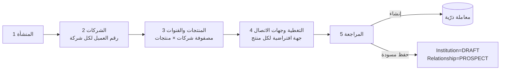
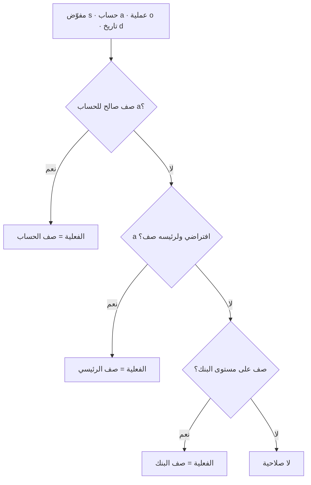
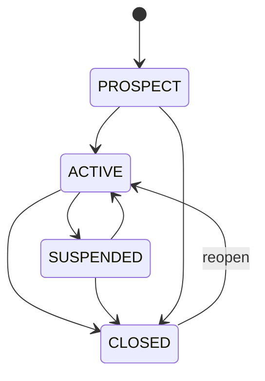
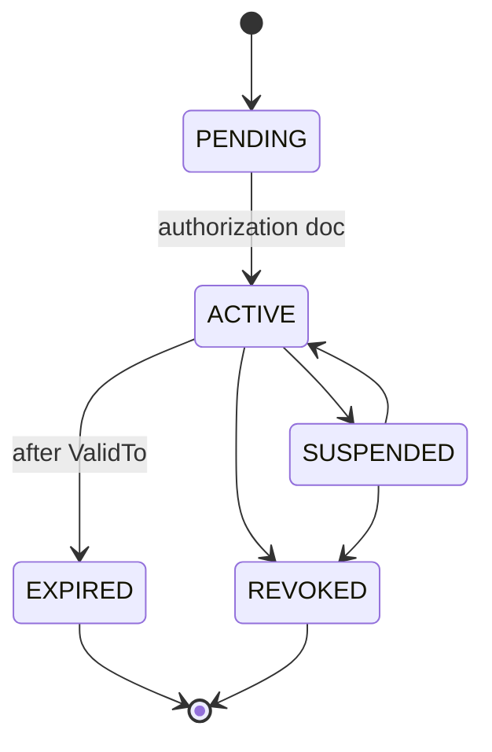

# م2–م4: المنشآت المالية، الحسابات والمفوّضون، الكتالوجات (INS · ACC · CAT)

| البند | القيمة |
|---|---|
| الملف | `10-detailed-analysis/11-m2-m4-institutions-accounts-catalogs.md` |
| الحالة | مسودة تحليل تفصيلي للمراجعة (جزء من وثيقة التحليل التفصيلية) |
| التاريخ | 2026-10-10 |
| البادئات | `INS` (م2 المنشآت المالية) · `ACC` (م3 الحسابات والمفوّضون) · `CAT` (م4 الكتالوجات) |
| الشرائح | S1 (الأساس) · S1-ب (مقارنة الحوكمة) · S2 (أغراض حسابات التسهيل وتغذية التسعير) · S2-ب (ربط إحصاءات الحسابات) · S3/S4 (خدمات تستهلكها الطلبات والاعتمادات) |
| المصادر | `01` §3 (م2–م4) و§10 (D-1…D-13) و§13 · `02` §2.2 وF-3/F-5/F-6/F-8 و§7–§8 · `03` §3.2 · `04` §3 وΔ2–Δ14 و§9.4 · `bank-facilities/docs/01-system-analysis.md` (إعادة استخدام الأفكار مع تصحيحات `04`) |
| الوسوم | 🟢 مذكور من المستخدم أو في الوثائق · 🟡 اقتراح (له افتراض مُعلَن) · أرقام مواد UCP وقوائم Incoterms مراجع هندسية تُطابَق على النص الرسمي لـ ICC، والمنصة توفّر قوالب لا استشارة قانونية |

---

## 1. الغرض والنطاق (داخل/خارج النطاق)

**الغرض.** توفير القاعدة المرجعية التي تقوم عليها التسهيلات (م5) ثم الطلبات والاعتمادات: (1) من هي المنشآت المالية وكيف نتواصل معها ولكل شركة من شركات المشترك، (2) أين تقع حسابات الشركات وكيف تُمنح صلاحيات التوقيع عليها، (3) القوائم المحكومة (الكتالوجات) التي تبقى بيانات قابلة للتعديل لا كودًا (01 §6 «التهيئة»). تسري هنا القرارات D-1 (عزل بصف المشترك) وD-2 (كيان Party موحّد للمفوّض والفرد الممول) وD-4 (علاقة شركة–بنك) وD-5 (نموذج الصلاحيات) وسياسة الجاهزية للربط الخارجي.

### 1.1 داخل النطاق
| المجال | المحتوى |
|---|---|
| INS | أنواع المنشآت، تعريف المنشأة (محلي/أجنبي)، هيكل الجهة (إدارات ← أقسام ← جهات اتصال)، التسلسل «يتبع لـ»، العلاقة شركة–بنك (رقم العميل، الحالة)، تغطية العلاقة (الطبقة الأولى)، المنتجات لكل علاقة وجهة الاتصال الافتراضية والقناة المفضلة، معالج إعداد البنك |
| ACC | الحسابات البنكية (بما فيها الافتراضية)، أغراض الحساب على التسهيل، المفوّضون وفئات التوقيع، صلاحيات المفوّض لكل عملية على حساب أو على البنك كله بسقوف وتوقيع مشترك، خدمات الصلاحية الفعلية وكفاية التوقيعات، مقارنة الصلاحيات بالحوكمة (Should)، تنبيهات الانتهاء |
| CAT | إطار الكتالوجات الموحّد والبذر عند التهيئة، كتالوجات: المنتجات وتصنيفاتها، المصاريف، أنواع التمويل، روابط المنتج، أنواع التسهيلات والحدود، أنواع الضمانات (Collateral) بقوالب سمات، أنواع الالتزامات، أسعار الأساس وقيمها التاريخية، أنواع الوثائق، المناصب، أنواع الصلاحيات والعمليات، أنواع الحسابات، قوائم القيم، المرجع العالمي (العملات، الدول، Incoterms 2020، أنواع الاعتماد) |

### 1.2 خارج النطاق (مع الجهة المالكة)
| البند | المالك |
|---|---|
| التسهيلات والحدود والتسعير و**جدول التعرفة (TariffSchedule/TariffItem)** و**كتالوج أنواع الشروط (TermType) وبذره** | `12` (FAC/PRC) |
| قوائم البنود المالية (LineCatalogItem) وإدخال `AccountMonthlyStat` والتحقق من الشروط | `12` (FIN/CMP) — هنا مراجع وخطافات فقط |
| Party والوثائق الهوية والعناوين ووسائل الاتصال وقائمة الاكتمال حسب البنك، وAuthorityGrant والحوكمة | `10` (PTY/ORG) |
| أنواع الطلبات وقوالب الدورات والإشعارات (المحرك) | `13` |
| نموذج شروط الاعتماد LcTerms ومكتبة بنود المستندات وقوالب النماذج | `14` |
| أي اتصال حي ببوابات البنوك أو كشوف الحسابات أو أسعار السوق؛ أرصدة الحسابات وحركاتها؛ تحقق آلي من قاعدة التوقيع؛ أسعار صرف العملات | غير مطلوب الآن (القسم 11) |
| دليل منشآت مشترك على مستوى المنصة | سؤال مفتوح Q-INS-01 |

---

## 2. الجهات والصلاحيات (role matrix: role x action)

الرموز: ✔ كامل (عرض وتعديل) · R قراءة · M قراءة مقنَّعة (آخر 4 خانات) · — لا صلاحية. الأدوار: **PO** مشغّل المنصة · **TA** مدير حساب المشترك · **TM** مدير الخزينة · **FO** مسؤول التسهيلات · **TE** موظف الخزينة · **RQ** الجهة الطالبة (مشتريات/مبيعات…) · **AU** مدقق/قراءة فقط (دور 🟡 مقترح). الأدوار قابلة للدمج لمستخدم واحد، والصلاحيات قابلة للتخصيص (01 §6). لا يصل PO إلى بيانات مشترك إلا بدخول دعم مدقَّق تعرّفه `10`.

| الإجراء | الصلاحية | PO | TA | TM | FO | TE | RQ | AU |
|---|---|---|---|---|---|---|---|---|
| عرض المنشآت وجهات الاتصال والعلاقات | `ins.view` | — | R | R | R | R | — | R |
| إنشاء/تعديل المنشآت ووحداتها | `ins.manage` | — | ✔ | ✔ | ✔ | — | — | — |
| إنشاء/تعديل جهات الاتصال | `ins.contacts.manage` | — | ✔ | ✔ | ✔ | ✔ | — | — |
| إدارة العلاقة (رقم العميل، التغطية، المنتجات، القناة) | `ins.relationship.manage` | — | ✔ | ✔ | ✔ | — | — | — |
| تشغيل معالج إعداد البنك | `ins.wizard.run` | — | ✔ | ✔ | ✔ | — | — | — |
| تعطيل منشأة / إغلاق علاقة | `ins.deactivate` | — | ✔ | ✔ | — | — | — | — |
| طباعة ورقة التصعيد | `ins.export` | — | — | ✔ | ✔ | ✔ | — | — |
| عرض الحسابات البنكية | `acc.view` | — | M | R | R | R | — | M |
| كشف رقم الحساب/IBAN كاملًا (يُسجَّل في التدقيق) | `acc.reveal` | — | — | ✔ | ✔ | ✔ | — | — |
| إنشاء/تعديل الحسابات | `acc.manage` | — | — | ✔ | ✔ | — | — | — |
| تجميد/إغلاق حساب | `acc.close` | — | — | ✔ | — | — | — | — |
| ربط الحسابات بالتسهيل وتحديد أغراضها (S2) | `acc.facility_link` | — | — | ✔ | ✔ | — | — | — |
| عرض المفوّضين وصلاحياتهم | `sig.view` | — | R | R | R | R | — | R |
| إدارة المفوّضين وصلاحياتهم وتصدير المصفوفة | `sig.manage` | — | — | ✔ | ✔ | — | — | — |
| مراجعة تعارضات الحوكمة وتسجيل القرار | `sig.conflict.review` | — | — | ✔ | ✔ | — | — | R |
| رؤية أرقام الهويات كاملة (قرار س-10: TM وFO فقط) | `party.id.reveal` (`10`) | — | — | ✔ | ✔ | — | — | — |
| قراءة الكتالوجات للاختيار في النماذج | `cat.view` | R | R | R | R | R | R | R |
| إدارة الكتالوجات العامة (وثائق، مناصب، صلاحيات، أنواع حسابات، قوائم) | `cat.manage.general` | — | ✔ | R | R | R | — | R |
| إدارة الكتالوجات المالية (منتجات، مصاريف، تمويل، حدود، ضمانات، التزامات) | `cat.manage.financial` | — | ✔ | ✔ | ✔ | R | — | R |
| إدخال قيم أسعار الأساس | `cat.baserate.enter` | — | — | ✔ | ✔ | R | — | R |
| إدارة المرجع العالمي وحزم البذور الافتراضية | `cat.global.manage` | ✔ | — | — | — | — | — | — |
| عرض سجل التدقيق لهذه الكيانات | `audit.view` (`10`) | — | R | R | R | — | — | R |

ملاحظات: (1) «R» لـ TM/FO/TE في عرض الحسابات لأنهم يملكون `acc.reveal`؛ أما TA وAU فيرون المقنَّع ما لم تُمنح الصلاحية (Q-ACC-02). (2) صور نماذج التوقيع (إن حُفظت، Q-ACC-01) تتبع قيد وثائق الهوية: TM وFO فقط. (3) RQ لا يرى بيانات البنوك والحسابات؛ يرى ما يخصه من الطلب في `13`.

---

## 3. المفاهيم والمسرد

| المصطلح | التعريف |
|---|---|
| المنشأة المالية (Institution) | جهة تمنح تمويلًا أو خدمة مصرفية: بنك، شركة تمويل، شركة استثمارية، شركة مالية، فرد؛ محلية أو أجنبية |
| العلاقة (Relationship) | ارتباط شركة واحدة من شركات المشترك بمنشأة واحدة؛ تحمل رقم العميل لدى البنك والحالة والتغطية والمنتجات (D-4) |
| الطبقة الأولى (التغطية) | أشخاص البنك المسؤولون عن **علاقة محددة**: مدير علاقة، مدير فريق، مدير إقليمي، مدير إدارة، بترتيب أولوية (RelationshipContact) |
| الطبقة الثانية (الهيكل) | هيكل البنك العام: وحدات (إدارات/أقسام/فروع) وجهات الاتصال داخلها (InstitutionUnit، Contact) |
| الجهة الافتراضية للمنتج | جهة اتصال تُستخدم افتراضيًا لمنتج معيّن ضمن علاقة معيّنة |
| القناة المفضلة | طريقة التعامل الافتراضية للمنتج في العلاقة: **بوابة البنك** أو **نموذج يدوي**؛ و«ربط مباشر» محجوز للمستقبل (`02` §8) |
| الحساب الافتراضي (Virtual) | حساب فرعي تابع لحساب رئيسي لدى المنشأة نفسها |
| قاعدة التوقيع | نص حر («أ مع ب») وحد أدنى لعدد التوقيعات؛ ليست محركًا آليًا في المرحلة الأولى (01 §3 م3) |
| المفوّض (Signatory) | شخص (Party) مخوَّل لدى بنك معيّن عن شركة معيّنة بفئة توقيع ووثيقة تفويض وفترة سريان |
| فئة التوقيع | تصنيف (A/B/C…) يُستخدم في صياغة قواعد التوقيع المشترك؛ لا يحمل سقفًا بذاته |
| صلاحية المفوّض (SignatoryAuthority) | حق المفوّض في نوع عملية على حساب محدد أو على كل حسابات البنك، بسقوف وتوقيع مشترك وفترة |
| سقف العملية / السقف اليومي | أقصى مبلغ للعملية الواحدة / لليوم؛ **يُسجَّل ولا يُتتبَّع استخدامه** (المنصة لا ترى حركات الحسابات) |
| صلاحية الحوكمة | AuthorityGrant في `10`: ما يخوَّله الشخص نظاميًا (اقتراض، تمثيل…) بسقف وتوقيع مشترك |
| غرض الحساب على التسهيل | دور الحساب في تسهيل: تسهيل، هامش وتسوية، رسوم بنكية، سداد، تحصيل متحصلات اعتماد (FacilityAccount) |
| الكتالوج | قائمة محكومة مملوكة للمشترك (أو عالمية) بحقول موحّدة: رمز، اسم ع/إن، نشط، نظام، ترتيب |
| البذرة / SeedKey | نسخة افتراضية تُنسخ للمشترك عند التهيئة؛ يربط SeedKey الصف بأصله في حزمة المنصة |
| صف نظام / مقفل | **نظام**: لا يُحذف ولا يتغيّر رمزه؛ **مقفل**: لا يُعطَّل أيضًا لأن المنطق يعتمد عليه |
| يستهلك حدًّا ائتمانيًا | علم المنتج الذي يُدخله في فحص التسهيلات (اعتمادات، ضمانات، تمويل) مقابل ما لا يدخل (رواتب، نقاط بيع) |
| متغيّر إسلامي/تقليدي | امتثال المنتج (CONVENTIONAL/ISLAMIC/NEUTRAL) ومجموعة متغيّرات تزاوج النسختين (مثلًا اعتماد تقليدي واعتماد بالمرابحة) |
| سعر الأساس وأسماؤه البديلة | مؤشر مرجعي بفترة (3M…) مع مرادفات (SAIBOR≡SIBOR) وقيم تاريخية بتواريخ سريان |
| مرجع عالمي | قائمة يملكها مشغّل المنصة وتقرؤها كل المشتركين (عملات، دول، Incoterms، أنواع الاعتماد) |
| قالب سمات | تعريف حقول إضافية لنوع ضمان (رقم الصك، المساحة…) |
| الكشف (Reveal) | إظهار قيمة حساسة كاملة بصلاحية خاصة مع تسجيل تدقيق |

---

## 4. المتطلبات الوظيفية

### 4.1 المنشآت المالية والعلاقات (INS)
| المعرّف | المتطلب | الأولوية | الشريحة | المصدر | معيار القبول |
|---|---|---|---|---|---|
| FR-INS-001 | كتالوج أنواع المنشآت (بنك، شركة تمويل، شركة استثمارية، شركة مالية، فرد) قابل للتوسعة بعلم «يتطلب Party» لنوع الفرد | Must | S1 | 🟢 | بعد التهيئة يظهر 5 أنواع؛ نوع مضاف يظهر في قائمة التعريف فورًا؛ حفظ منشأة من نوع فرد بلا Party يُرفض |
| FR-INS-002 | تعريف منشأة: رمز، اسم ع/إن، النوع، الدولة، BIC اختياري، موقع، حالة | Must | S1 | 🟢 | رمز مكرر في المشترك يُرفض؛ BIC بغير 8 أو 11 خانة يُرفض؛ اسم مشابه أو BIC موجود يُنبَّه إليه قبل الحفظ |
| FR-INS-003 | تمييز محلي/أجنبي يُشتق من دولة المنشأة مقابل دولة المشترك، مع تصفية | Must | S1 | 🟢 | مشترك دولته SA: منشأة AE تظهر «أجنبي» وSA «محلي»؛ التصفية تعيد الصحيح |
| FR-INS-004 | منشأة النوع «فرد» تُربط بسجل Party (موجود أو يُنشأ من الشاشة) ولا تُكرَّر بيانات الهوية فيها | Must | S1 | 🟡 | لا حقول هوية في بطاقة المنشأة؛ رقم الهوية يظهر عبر Party مقنَّعًا لغير TM وFO |
| FR-INS-005 | هيكل الجهة: وحدات (إدارة/قسم/فرع) متداخلة حتى 4 مستويات | Must | S1 | 🟢 | إنشاء إدارة وقسم تحتها يعمل؛ المستوى الخامس والحلقة يُرفضان |
| FR-INS-006 | بيانات الوحدة: هاتف، بريد، موقع إلكتروني، عنوان (عبر ContactMethod وAddress) | Must | S1 | 🟢 | تُحفظ وتُعرض كلها؛ صيغة البريد والموقع تُتحقق |
| FR-INS-007 | جهات اتصال (الطبقة الثانية): الاسم ع/إن، المسمى، الوحدة، وسائل الاتصال؛ وسيلة واحدة على الأقل | Must | S1 | 🟢 | جهة بلا هاتف وبلا بريد تُرفض؛ جهة بجوال فقط تُقبل |
| FR-INS-008 | تسلسل «يتبع لـ» بين جهات اتصال المنشأة نفسها مع عرض شجري | Must | S1 | 🟢 | منع الذات والحلقة وجهة من منشأة أخرى؛ الشجرة تعرض 3 مستويات صحيحة |
| FR-INS-009 | العلاقة شركة–بنك: رقم العميل لدى البنك، الحالة، تاريخ البدء، ملاحظات | Must | S1 | 🟢 | علاقة واحدة لكل (شركة، منشأة)؛ المحاولة الثانية تفتح العلاقة القائمة؛ رقم عميل مكرر في المنشأة ينبّه |
| FR-INS-010 | تغطية العلاقة (الطبقة الأولى): مدير علاقة/فريق/إقليمي/إدارة بترتيب أولوية وفترة سريان وتاريخ | Must | S1 | 🟢 | الترتيب فريد بين الصفوف النشطة؛ استبدال مدير علاقة يغلق الصف القديم بتاريخ ويفتح جديدًا ويبقى السجل |
| FR-INS-011 | المنتجات المتعامل بها لكل علاقة من كتالوج المنتجات | Must | S1 | 🟢 | منتج غير نشط لا يُقبل؛ تكرار المنتج في العلاقة مرفوض |
| FR-INS-012 | جهة اتصال افتراضية لكل (علاقة، منتج) من جهات المنشأة نفسها | Must | S1 | 🟢 | اختيار جهة منشأة أخرى مرفوض؛ الحل الفعلي وفق BR-INS-009 |
| FR-INS-013 | القناة المفضلة لكل (علاقة، منتج): بوابة البنك أو نموذج يدوي؛ الافتراضي «نموذج يدوي»؛ «ربط مباشر» محجوز | Must | S1 | 🟢 القنوات · 🟡 الافتراضي | القيمة تُعاد عبر SVC-02؛ اختيار «ربط مباشر» يُرفض برسالة «غير مفعّل» |
| FR-INS-014 | معالج إعداد البنك: المنشأة ← الشركات ← المنتجات والقنوات ← جهات الاتصال والتغطية ← المراجعة، بمعاملة ذرّية | Must | S1 | 🟢 | سيناريو 1 |
| FR-INS-015 | حفظ المعالج كمسودة واستئنافه | Could | S1 | 🟡 | الحفظ ينشئ منشأة DRAFT وعلاقات PROSPECT؛ الاستئناف يعيد المستخدم لآخر خطوة |
| FR-INS-016 | تعطيل المنشأة/جهة الاتصال وإغلاق العلاقة مع فحص الأثر (حسابات، تسهيلات، جهة افتراضية) | Must | S1 | 🟡 | الإغلاق مع حساب غير مغلق يُرفض بقائمة المراجع؛ تعطيل جهة افتراضية يطلب بديلًا |
| FR-INS-017 | ورقة تصعيد قابلة للطباعة لكل علاقة (الطبقة الأولى بالأولوية مع هواتف وبريد) | Should | S1 | 🟡 | الطباعة تعرض الصفوف النشطة بترتيب Rank |
| FR-INS-018 | مؤشرات جودة: علاقة بلا مدير علاقة، منتج بلا جهة افتراضية، جهة بلا وسيلة اتصال | Should | S1 | 🟡 | التقرير R-INS-04 يطابق بيانات الاختبار حالةً بحالة |
| FR-INS-019 | بحث موحّد في المنشآت وجهات الاتصال (اسم، هاتف، بريد، BIC، رقم العميل) | Should | S1 | 🟡 | بحث بجزء من رقم هاتف يعيد الجهة؛ الهدف أقل من ثانيتين على 5000 جهة |
| FR-INS-020 | حقل «مرجع الدليل» محجوز لدليل منشآت مشترك لاحقًا (بلا شاشة الآن) | Could | S1 | 🟡 | الحقل في الواجهة البرمجية ولا يظهر في الشاشات |

### 4.2 الحسابات والمفوّضون (ACC)
| المعرّف | المتطلب | الأولوية | الشريحة | المصدر | معيار القبول |
|---|---|---|---|---|---|
| FR-ACC-001 | كتالوج أنواع الحسابات بعلم «افتراضي» (جاري، رواتب، افتراضي، نقاط بيع، قرض، تحصيل اعتمادات، هامش، وديعة) | Must | S1 | 🟢 | 8 أنواع بعد التهيئة؛ علم الافتراضي على VIRTUAL وحده |
| FR-ACC-002 | تعريف حساب: شركة، منشأة، رقم الحساب، IBAN، عملة، نوع، حالة، تاريخ الفتح، اسم داخلي، فرع | Must | S1 | 🟢 | حساب بلا عملة أو نوع أو رقم يُرفض؛ يظهر ضمن الشركة والمنشأة |
| FR-ACC-003 | اشتراط وجود علاقة (شركة، منشأة)؛ وإن لم توجد يُعرض إنشاؤها بنقرة | Must | S1 | 🟡 | الحفظ دون علاقة ينشئ علاقة ACTIVE بعد تأكيد صريح |
| FR-ACC-004 | التحقق من IBAN وفق ISO 13616 (طول الدولة + باقي القسمة على 97 يساوي 1) | Must | S1 | 🟡 | IBAN المثال الصحيح في BR-ACC-002 يُقبل وتعديل خانة منه يُرفض؛ الحقل اختياري |
| FR-ACC-005 | فرادة رقم الحساب لكل منشأة وIBAN لكل مشترك بعد التطبيع | Must | S1 | 🟡 | الرقم نفسه بمسافات/شرطات مختلفة يُرفض |
| FR-ACC-006 | حسابات افتراضية تحت حساب رئيسي (مستوى واحد؛ الشركة والمنشأة والعملة نفسها) | Must | S1 | 🟢 | سيناريو 3 |
| FR-ACC-007 | قاعدة التوقيع للحساب: نص حر + حد أدنى لعدد التوقيعات (≥ 1)، دون محرك تحقق آلي | Must | S1 | 🟢 | حفظ «أ مع ب» والقيمة 2؛ القيمة 0 تُرفض |
| FR-ACC-008 | حالات الحساب: نشط، خامل، مجمّد، مغلق مع تاريخ وسبب | Must | S1 | 🟢 | الإغلاق يتطلب تاريخًا وسببًا؛ المغلق غير قابل للتعديل عدا الملاحظات |
| FR-ACC-009 | تقنيع رقم الحساب وIBAN والكشف بصلاحية وتسجيل كل كشف وتصدير | Must | S1 | 🟡 | المقنَّع يطابق BR-ACC-016؛ كل كشف يترك سجل تدقيق (مستخدم، وقت، حساب) |
| FR-ACC-010 | أغراض الحساب على التسهيل: تسهيل، هامش وتسوية، رسوم بنكية، سداد، تحصيل متحصلات اعتماد (FacilityAccount) | Must | S2 | 🟢 | حساب افتراضي واحد لكل (تسهيل، غرض، عملة)؛ ربط حساب مجمّد يُرفض |
| FR-ACC-011 | خدمة بحث عن حساب «تحصيل اعتمادات» لشركة وعملة لاستخدامه في البروفورما | Should | S4 | 🟡 | SVC-06 تعيد الحسابات النشطة من النوع LC_COLLECTION |
| FR-ACC-012 | سجل المفوّضين: شخص (Party)، شركة، منشأة، فئة توقيع (A/B/C قابلة للتوسعة)، وثيقة التفويض، فترة السريان | Must | S1 | 🟢 | تفعيل مفوّض بلا وثيقة تفويض يُرفض ويبقى PENDING |
| FR-ACC-013 | صلاحية المفوّض لكل نوع عملية (11 نوعًا افتراضيًا) على حساب محدد أو على البنك كله | Must | S1 | 🟢 | صف بلا نوع عملية مرفوض؛ صف بحساب من علاقة أخرى مرفوض |
| FR-ACC-014 | سقف للعملية وسقف يومي بعملة، وعلم توقيع مشترك (فئات مطلوبة وعدد أدنى للمشاركين) | Must | S1 | 🟢 | السقف اليومي الأقل من سقف العملية يُرفض؛ عملية بلا سقف (مثل خدمات الإنترنت) لا تطلب مبلغًا |
| FR-ACC-015 | خدمة الصلاحية الفعلية: الحساب ثم رئيسه ثم البنك (الأكثر تحديدًا يفوز) | Must | S1 | 🟡 | SVC-03 وسيناريو 4 |
| FR-ACC-016 | خدمة كفاية التوقيعات لعملية ومبلغ وعملة | Should | S3 | 🟡 | SVC-04 وسيناريو 4 |
| FR-ACC-017 | تاريخ التغييرات: تعديل الصلاحية يغلق الصف القديم ويفتح جديدًا؛ التجديد ينسخ الصلاحيات | Must | S1 | 🟡 | بعد تعديل السقف يعرض السجل الصفين بفترتين متتاليتين دون فجوة |
| FR-ACC-018 | مقارنة صلاحيات المفوّض بصلاحيات الحوكمة وتنبيه عند التعارض مع تسجيل قرار المراجع | Should | S1-ب | 🟡 | سيناريو 5 |
| FR-ACC-019 | تنبيهات انتهاء المفوّض والصلاحية ووثيقة التفويض قبل 30/15/7 أيام وعند الانتهاء | Must | S1 | 🟡 | سيناريو 6 |
| FR-ACC-020 | مصفوفة الصلاحيات (مفوّض × عملية × حساب) قابلة للطباعة لكل بنك | Should | S1 | 🟡 | الطباعة تطابق الصلاحيات الفعلية في تاريخ محدد |
| FR-ACC-021 | خطافات إحصاءات الحساب الشهرية (`12`): تبويب وروابط وتاريخا الفتح والإغلاق والعملة والحالة فقط | Must | S2-ب | 🟢 | الحساب المغلق يمرّر ClosedOn لـ FIN؛ لا حقول إحصاءات في هذه الوحدة |
| FR-ACC-022 | إرفاق صورة نموذج التوقيع اختياريًا بقيود صور الهوية | Could | S1 | 🟡 | تتوقف على Q-ACC-01؛ الكشف لـ TM وFO ويُدقَّق |

### 4.3 الكتالوجات (CAT)
| المعرّف | المتطلب | الأولوية | الشريحة | المصدر | معيار القبول |
|---|---|---|---|---|---|
| FR-CAT-001 | إطار كتالوج موحّد: رمز ثابت، اسم ع/إن، وصف، نشط، نظام، مقفل، ترتيب، SeedKey | Must | S1 | 🟢 | كل كتالوجات 6.3 تدعم الحقول نفسها |
| FR-CAT-002 | بذر الكتالوجات من حزمة افتراضية عند تهيئة المشترك بنسخة يملكها المشترك | Must | S1 | 🟢 | الأعداد بعد التهيئة تطابق جدول 6.4؛ إعادة التشغيل لا تكرر الصفوف |
| FR-CAT-003 | إشعار «افتراضيات جديدة متاحة» بتطبيق اختياري لا يستبدل تعديلات المشترك | Should | S5 | 🟡 | صف معدَّل لا يُكتب فوقه؛ الصف الجديد يُضاف بعد موافقة TA |
| FR-CAT-004 | التعطيل بدل الحذف عند الاستخدام؛ حماية صفوف النظام والمقفلة | Must | S1 | 🟢 | حذف صف مستخدم أو نظام يُرفض؛ تعطيله يخفيه من الاختيار ويبقيه في السجلات |
| FR-CAT-005 | شاشة موحّدة لأي كتالوج: إضافة، تعديل، ترتيب بالسحب، تعطيل، بحث، إظهار المعطَّل | Must | S1 | 🟡 | الترتيب المحفوظ ينعكس في القوائم المنسدلة |
| FR-CAT-006 | «أين يُستخدم» وعدد المراجع قبل التعطيل | Should | S1 | 🟡 | تعطيل مصروف مستخدم في 3 قواعد تسعير يعرض الرقم 3 |
| FR-CAT-007 | تصنيفات المنتجات والمنتجات بأعلام: يستهلك حدًّا، تمويل تجاري، عائلة المنتج، الامتثال، مجموعة المتغيرات | Must | S1 | 🟢 | منتجا اعتماد (تقليدي/مرابحة) في مجموعة واحدة؛ ثالث بالامتثال نفسه يُرفض |
| FR-CAT-008 | أنواع المصاريف بطبيعة: رسم، أو عقوبة غير إيرادية (للأعمال الخيرية) | Must | S1 | 🟢 | تقرير الإيراد يستثني نوع العقوبة (يتحقق في `12`) |
| FR-CAT-009 | أنواع التمويل بعلم إسلامي وتسمية العائد (ربح/فائدة) | Must | S1 | 🟢 | النوع الإسلامي يعرض «ربح» في الواجهة والتقليدي «فائدة» |
| FR-CAT-010 | ربط المنتج بأنواع المصاريف وأنواع التمويل المسموحة | Must | S1 | 🟢 | SVC-08 تعيد القوائم المسموحة؛ الربط المكرر مرفوض |
| FR-CAT-011 | أنواع التسهيلات | Must | S1 | 🟢 | 6 أنواع بعد التهيئة |
| FR-CAT-012 | أنواع الحدود (رئيسي/جزئي) والمنتجات المسموحة لكل نوع | Must | S1 | 🟢 | الجزئي بلا أب مرفوض؛ الرئيسي بأب مرفوض |
| FR-CAT-013 | أنواع الضمانات (CollateralType) بنوع بنية وقالب سمات مرتّبة | Must | S1 | 🟢 | قالب العقار يحوي 7 سمات؛ مفتاح سمة مكرر في النوع مرفوض |
| FR-CAT-014 | أنواع الالتزامات بأربع عائلات (تقارير، تعهد قابل للقياس، قيد عملية، بند ثابت) وعلم وصفي | Must | S1 | 🟢 | 30 نوعًا بعد التهيئة؛ التعهد الوصفي لا يطلب مقياسًا |
| FR-CAT-015 | أسعار الأساس: رمز العائلة، الفترة، أسماء بديلة (SAIBOR≡SIBOR)، النوع (سوق/داخلي لبنك) | Must | S1 | 🟢 | البحث بـ «SIBOR» يعيد SAIBOR؛ الداخلي بلا منشأة مرفوض |
| FR-CAT-016 | قيم أسعار الأساس التاريخية بإدخال يدوي دون حذف؛ والاستعلام «القيمة في تاريخ» | Must | S1 | 🟢 | سيناريو 8 |
| FR-CAT-017 | تنبيه تقادم قيمة سعر أساس مرتبط بقاعدة تسعير نشطة | Should | S2 | 🟡 | NTF-CAT-01 بعد StaleAfterDays |
| FR-CAT-018 | أنواع الوثائق بأعلام: يتطلب انتهاءً، حساسة، الكيانات المسموحة، الصيغ والحجم | Must | S1 | 🟢 | رفع وثيقة حساسة يخضع لقيد TM/FO (في `10`) |
| FR-CAT-019 | المناصب وأنواع الصلاحيات وأنواع العمليات مع ربط العملية بنوع/أنواع صلاحية | Must | S1 | 🟢 الكتالوجات · 🟡 الربط | الربط الافتراضي يطابق 6.4؛ عملية بلا ربط تُنتج NOT_MAPPED في المقارنة |
| FR-CAT-020 | قوائم القيم (LookupList/LookupItem): عالمية للقراءة أو قابلة للإضافة من المشترك | Must | S1 | 🟢 | إضافة بند لقائمة عالمية مرفوضة؛ قائمة المشترك تقبل |
| FR-CAT-021 | مرجع عالمي للقراءة فقط: العملات، الدول، Incoterms 2020 (القديمة بحالة LEGACY)، أنواع الاعتماد | Must | S1 | 🟢 | 11 قاعدة Incoterms نشطة و5 قديمة غير قابلة للاختيار |
| FR-CAT-022 | قفل تغيير العلم ذي الأثر (يستهلك حدًّا، طبيعة المصروف) بعد الاستخدام إلا بتأكيد TM | Must | S1 | 🟡 | التغيير بلا تأكيد مرفوض؛ مع التأكيد يُدقَّق بالقيمتين |
| FR-CAT-023 | تفعيل مجموعة جزئية من العملات للمشترك | Could | S1 | 🟡 | عملة غير مفعّلة لا تظهر في الاختيار وتبقى ظاهرة في السجلات |
| FR-CAT-024 | استيراد/تصدير الكتالوجات (CSV/Excel) | Could | S5 | 🟡 | الاستيراد يعرض معاينة الأخطاء قبل الحفظ ولا يغيّر الرموز |
| FR-CAT-025 | تدقيق كل تغيير كتالوجي وكل قيمة سعر أساس بالقيمتين القديمة والجديدة | Must | S1 | 🟡 | تعديل اسم ينتج سطر تدقيق بالقيمتين والمستخدم والوقت |

---

## 5. قواعد العمل

### 5.1 المنشآت والعلاقات
| المعرّف | القاعدة | مثال |
|---|---|---|
| BR-INS-001 | الرمز يُطبَّع (أحرف كبيرة بلا مسافات) وفريد لكل مشترك؛ BIC يطابق `^[A-Z]{4}[A-Z]{2}[A-Z0-9]{2}([A-Z0-9]{3})?$` | `aaaasari` يصبح `AAAASARI` (8 خانات) صحيح؛ `AAAASA` مرفوض |
| BR-INS-002 | Locality مشتقة: LOCAL إذا الدولة = دولة المشترك وإلا FOREIGN ولا تُدخل يدويًا | دولة المشترك SA، منشأة AE ← FOREIGN |
| BR-INS-003 | نوع `RequiresParty` ⇒ PartyId إلزامي وفريد بين منشآت المشترك؛ وسائر الأنواع تمنع PartyId | منشأة فرد بلا Party ← رفض |
| BR-INS-004 | الوحدة: الأب من المنشأة نفسها؛ العمق ≤ 4؛ لا حلقات؛ القسم تحت إدارة أو فرع، والإدارة تحت فرع أو جذر | قسم تحت قسم ← رفض |
| BR-INS-005 | «يتبع لـ»: ليس الذات، من المنشأة نفسها، بلا حلقة (السير في الأسلاف ≤ 20). تعطيل مدير له تابعون يستلزم تحديد مدير بديل لهم أو تركه فارغًا بتحذير | X←Y، Y←Z، ثم Z←X ← رفض |
| BR-INS-006 | جهة الاتصال تتطلب هاتفًا أو جوالًا أو بريدًا. الهاتف يُطبَّع بصيغة دولية والبريد يُتحقق شكله | جهة بلا وسائل ← رفض |
| BR-INS-007 | العلاقة فريدة لكل (شركة، منشأة) مهما كانت حالتها؛ إعادة الفتح من CLOSED تحفظ التاريخ. رقم العميل المكرر داخل المنشأة **تنبيه** لا منع | شركتان برقم عميل واحد لدى البنك نفسه ← تحذير |
| BR-INS-008 | RelationshipContact: جهة الاتصال من منشأة العلاقة؛ Rank فريد بين الصفوف النشطة؛ إن تُرك فارغًا يُملأ افتراضيًا (مدير علاقة 1، فريق 2، إقليمي 3، إدارة 4)؛ لا يتداخل صفان نشطان لنفس (علاقة، دور، أساسي) | تغيير مدير العلاقة بتاريخ 2026-11-01 ← القديم ينتهي 2026-10-31 |
| BR-INS-009 | **الجهة الفعلية** لـ (علاقة، منتج، تاريخ): (1) الجهة الافتراضية للمنتج إن كانت نشطة، (2) وإلا مدير العلاقة النشط ذو أقل Rank، (3) وإلا «لا جهة» | منتج LC بلا افتراضية ومدير علاقة Rank 1 ← مدير العلاقة |
| BR-INS-010 | RelationshipProduct فريد لكل (علاقة، منتج)؛ المنتج نشط؛ القناة ∈ {BANK_PORTAL, MANUAL_FORM}؛ فارغة تعني MANUAL_FORM؛ DIRECT_INTEGRATION يُرفض ما لم يفعّل المشترك محوّلًا (غير موجود الآن) | ضبط الربط المباشر ← رفض |
| BR-INS-011 | إغلاق العلاقة ممنوع مع حساب غير مغلق أو تسهيل نشط (`12`)؛ عند الإغلاق تُنهى فترات التغطية وتُعطَّل المنتجات | علاقة بحسابين نشطين ← رفض |
| BR-INS-012 | تعطيل المنشأة يتطلب أن تكون كل علاقاتها CLOSED؛ المنشأة المعطّلة لا تظهر في اختيار تسهيل جديد وتبقى في القديم | |
| BR-INS-013 | المعالج ذرّي: كل شيء أو لا شيء. مخرجاته: منشأة واحدة + علاقة لكل شركة مختارة + RelationshipProduct لكل خلية مختارة في المصفوفة + صفوف التغطية المدخلة | 3 شركات: 4 و2 و2 منتجات ← 1 + 3 + 8 صفوف |

### 5.2 الحسابات والمفوّضون
| المعرّف | القاعدة | مثال |
|---|---|---|
| BR-ACC-001 | رقم الحساب يُطبَّع (إزالة المسافات والشرطات، أحرف كبيرة) وفريد لكل (مشترك، منشأة)؛ IBAN فريد لكل مشترك. الحساب المغلق يحجز رقمه | `1234-567` و`1234567` مكرران |
| BR-ACC-002 | IBAN: الطول وفق جدول الدولة (SA = 24)؛ ينقل أول 4 خانات إلى النهاية ويحوّل الحروف إلى أرقام (A=10…Z=35) ويجب أن يكون الباقي على 97 يساوي 1 | `SA03 8000 0000 6080 1016 7519` صحيح؛ `...7518` مرفوض (مثال السجل العام) |
| BR-ACC-003 | الحساب يتبع علاقة (شركة، منشأة) فعّالة؛ عند غيابها تُنشأ بتأكيد المستخدم. الشركة ضمن نطاق UserCompanyScope للمستخدم | |
| BR-ACC-004 | الحساب الافتراضي: النوع IsVirtual، والرئيسي ليس افتراضيًا وغير مغلق، من الشركة والمنشأة والعملة نفسها (🟡)؛ مستوى واحد؛ إغلاق الرئيسي ممنوع مع افتراضي غير مغلق | رئيسي SAR وافتراضي USD ← رفض |
| BR-ACC-005 | MinSignatures ≥ 1؛ إن زاد على عدد المفوّضين النشطين لهم صلاحية السحب ظهر تحذير | |
| BR-ACC-006 | الحالات: ClosedOn ≥ OpenedOn؛ CLOSED نهائي (حساب جديد بدل إعادة الفتح)؛ إغلاق حساب هو الافتراضي لغرض في تسهيل نشط يُرفض حتى يُحدَّد حساب بديل لذلك الغرض | |
| BR-ACC-007 | FacilityAccount: حساب نشط من شركة ضمن شركات التسهيل؛ منشأته إحدى المموّلين (تحذير في التمويل المشترك)؛ افتراضي واحد لكل (تسهيل، غرض، عملة) | غرضان BANK_CHARGES افتراضيان بعملة SAR ← رفض |
| BR-ACC-008 | المفوّض: Party من نوع شخص طبيعي؛ فريد لكل (علاقة، Party، فئة) بفترات لا تتداخل؛ التجديد صف جديد بوثيقة وفترة جديدتين ينسخ الصلاحيات | |
| BR-ACC-009 | حالات المفوّض: PENDING حتى إرفاق وثيقة التفويض وتاريخ البدء؛ تنتقل ACTIVE تلقائيًا بالتفعيل؛ EXPIRED تلقائيًا في اليوم التالي لـ ValidTo | |
| BR-ACC-010 | الصلاحية: AccountId فارغ = على كل حسابات العلاقة؛ فريدة لكل (مفوّض، حساب أو فارغ، عملية) بفترات لا تتداخل؛ فترتها ضمن فترة المفوّض (وتحذير إن تجاوزت انتهاء وثيقة التفويض) | |
| BR-ACC-011 | السقف: CeilingMode ∈ {LIMITED, UNLIMITED, UNSPECIFIED}؛ LIMITED يتطلب مبلغًا > 0 وعملة؛ اليومي ≥ سقف العملية إن ذُكرا؛ عمليات SupportsCeiling=false لا سقف لها | |
| BR-ACC-012 | **الصلاحية الفعلية** (مفوّض s، حساب a، عملية o، تاريخ d): صف a الصالح؛ وإلا صف الحساب الرئيسي إن كان a افتراضيًا (🟡 Q-ACC-04)؛ وإلا صف مستوى البنك؛ وإلا «لا صلاحية». الصف الأخص يفوز ولو كان سقفه أدنى | بنكي تحويلات 1,000,000 وصف للحساب X بـ 250,000: X ← 250,000، Y ← 1,000,000، افتراضي تحت X بلا صف ← 250,000 |
| BR-ACC-013 | **التوقيع المشترك**: يتحقق إذا وُجد في مجموعة الموقّعين المختارة T ما لا يقل عن JointMinCosigners مفوّضًا آخر من الفئات المطلوبة (إن حُدّدت) | صلاحية تتطلب مشاركًا من الفئة B ولا يوجد ← غير مستوفاة |
| BR-ACC-014 | **كفاية التوقيعات** (حساب a، عملية o، مبلغ M، عملة c): S = المفوّضون النشطون الذين صلاحيتهم الفعلية تغطي M (مبلغ ≥ M بالعملة نفسها، أو UNLIMITED)؛ نتيجة SUFFICIENT إذا وُجدت T ⊆ S بحجم ≥ MinSignatures وكل عضو مستوفٍ لشرطه المشترك داخل T؛ INSUFFICIENT غير ذلك؛ وNOT_COMPARABLE إن اختلفت العملات أو كان السقف UNSPECIFIED (لا تحويل عملات) | MinSignatures=2: المفوّضون بسقوف 2,000,000 وب1,000,000 وبـ5,000,000؛ M=3,000,000 ← S=1 ← INSUFFICIENT |
| BR-ACC-015 | **مقارنة الحوكمة** لصف الصلاحية r وعملية o: P = أنواع الصلاحية المربوطة بـ o (يكفي أحدها)؛ التعارض: NO_GRANT (لا AuthorityGrant صالح لحامل Party)، CEILING_EXCEEDS (سقف الحوكمة < سقف r بالعملة نفسها)، JOINT_MISMATCH (الحوكمة تشترط التوقيع المشترك وr منفردة)، GRANT_EXPIRED، GRANT_CEILING_UNSPECIFIED، NOT_COMPARABLE_CURRENCY، NOT_MAPPED. الخطورة تحذير؛ التعارض يُسجَّل AuthorityConflict ويُحسب عند الحفظ وليليًا وعند حدث تغيّر AuthorityGrant | LC بـ 3,000,000 مقابل حوكمة 2,000,000 ← CEILING_EXCEEDS |
| BR-ACC-016 | التقنيع: يُظهر رمز الدولة (حرفان) وآخر 4 خانات؛ الباقي نقاط. الكشف أو تصدير الكامل يترك سجلًا (مستخدم، وقت، كيان، سبب اختياري) | `SA•• •••• •••• •••• •••• 7519` |
| BR-ACC-017 | تنبيهات الانتهاء عند T-30 وT-15 وT-7 وفي يوم الانتهاء لأبكر تاريخ من (ValidTo للمفوّض، للصلاحية، لوثيقة التفويض)؛ التكرار ممنوع لنفس (الهدف، العتبة) | ValidTo = 2026-12-15 ← 11-15، 11-30، 12-08 |

### 5.3 الكتالوجات
| المعرّف | القاعدة | مثال |
|---|---|---|
| BR-CAT-001 | Code يطابق `^[A-Z][A-Z0-9_]{1,39}$`، فريد لكل (مشترك، كتالوج)، ولا يتغيّر بعد الإنشاء. NameAr إلزامي؛ NameEn إلزامي لصفوف النظام وموصى به لغيرها؛ تكرار NameAr بين النشطة تحذير | |
| BR-CAT-002 | البذر: لكل صف في الحزمة يُنشأ للمشترك صف بـ SeedKey؛ المفتاح (مشترك، كتالوج، SeedKey) فريد فيكون البذر متكرر الأمان | إعادة التشغيل تترك 22 منتجًا لا 44 |
| BR-CAT-003 | الحذف الفيزيائي فقط لصف غير مستخدم وغير نظام؛ وإلا التعطيل. المقفل لا يُعطَّل. المعطّل لا يُقبل في اختيار جديد ويظهر في السجلات القديمة | |
| BR-CAT-004 | المنتج: مجموعة المتغيرات تسمح بمنتج واحد لكل امتثال؛ تغيير ConsumesCreditLimit بعد وروده في أي سطر منتج للحد (`12`) يتطلب تأكيد TM لأنه يغيّر حساب المتاح | |
| BR-CAT-005 | FeeType.Nature ∈ {FEE, PENALTY_NON_INCOME}؛ لا يتغيّر بعد الاستخدام إلا بتأكيد TM (BR-CAT-004). عقوبات الأعمال الخيرية غير إيرادية في التقارير | LATE_PENALTY ← PENALTY_NON_INCOME |
| BR-CAT-006 | FinancingType.IsIslamic يحدّد تسمية العائد (ربح/فائدة) في الواجهة فقط ولا يغيّر الحساب | |
| BR-CAT-007 | ProductFeeType وProductFinancingType فريدان لكل (منتج، نوع)؛ IsExpected تقرير نقص تسعير لا منع؛ تعطيل الربط لا يمس قواعد تسعير قائمة (تحذير) | |
| BR-CAT-008 | LimitType.Kind: MAIN بلا أب، SUB بأب MAIN؛ المنتجات المسموحة فارغة تعني «أي منتج» مع علامة ظاهرة؛ سطر منتج الحد (`12`) يُتحقق أنه ضمن المسموح | حد اعتمادات يقبل منتجي اعتماد فقط |
| BR-CAT-009 | قالب السمات: مفتاح السمة فريد في النوع؛ DataType ∈ {TEXT, NUMBER, DATE, AMOUNT, BOOL, LIST, REFERENCE}؛ تغيير القالب لا يمس القيم المخزَّنة؛ السمة المحذوفة تُرمَّز Retired وتبقى مقروءة | |
| BR-CAT-010 | ObligationType: Family ∈ {REPORTING, COVENANT, TRANSACTION_RESTRICTION, STATIC_CLAUSE}؛ التعهد بلا مقياس (MeasureKind=NONE) = وصفي؛ العتبة اختيارية دائمًا (`04` Δ6)؛ التقارير تحمل DefaultDeadlineBasis | |
| BR-CAT-011 | BaseRate فريد لكل (FamilyCode، Tenor)؛ الأسماء البديلة فريدة في المشترك وتُبحث بلا حساسية حالة؛ Kind=MARKET بلا منشأة، وKind=BANK_INTERNAL بمنشأة إلزامية | SIBOR 3M ≡ SAIBOR 3M |
| BR-CAT-012 | قيمة السعر: (BaseRate، EffectiveDate) فريدة بين VALID؛ تُقبل صفرية وسالبة (أرضية الصفر في التسعير `12`)؛ لا حذف؛ التصحيح ينشئ صفًا جديدًا ويجعل القديم SUPERSEDED | |
| BR-CAT-013 | **قيمة سعر في تاريخ asOf** = قيمة VALID ذات أكبر EffectiveDate ≤ asOf؛ إن لم توجد فالنتيجة NO_VALUE ولا تعويض بقيمة لاحقة | |
| BR-CAT-014 | OperationType.SupportsCeiling يحدّد ظهور السقوف في الصلاحيات؛ ربط OperationTypePowerType بمنطق «أي واحد يكفي»؛ الربط الافتراضي في 6.4 مراجَع بشريًا (Q-ACC-05) | |
| BR-CAT-015 | المرجع العالمي: TenantId فارغ، للقراءة فقط للمشتركين، يُنشر بإصدار؛ Incoterm بحالة LEGACY غير قابل للاختيار ويبقى للعرض | DAT/DAF/DES/DEQ/DDU قديمة |
| BR-CAT-016 | DocumentType.RequiresExpiry ⇒ وثيقة بلا تاريخ انتهاء تُرفض (تطبّقه `10`)؛ IsSensitive ⇒ قيد TM/FO للعرض والتنزيل | صور الهوية والإقامة والجواز حساسة |

---

## 6. المتطلبات المعلوماتية (Conceptual data)

**اصطلاحات.** ★ إلزامي · ○ اختياري. كل كيان مملوك للمشترك يحمل `TenantId` (RLS) وأعمدة التدقيق (CreatedAt/By, UpdatedAt/By, RowVersion) ولا تتكرر أدناه. المبلغ = رقم عشري + `CurrencyId`. التواريخ تُخزَّن ميلادية وتُدخَل/تُعرض هجرية عبر مكوّن `10`. الأنواع الاعتبارية: `FK→X` مفتاح أجنبي، `set` قائمة.

### 6.1 INS — الكيانات
| الكيان | الغرض والعلاقات | السمات الرئيسية | الفرادة والحساسية |
|---|---|---|---|
| **Institution** | منشأة مالية؛ 1..* InstitutionUnit/Contact/Relationship/BankAccount؛ تُشير إليها BaseRate الداخلية وTariffSchedule وFacilityLender (`12`) | Code ★ text40 · NameAr ★ · NameEn ○ · InstitutionTypeId ★ FK · CountryCode ★ · Locality ★ enum{LOCAL,FOREIGN} مشتقة · SwiftBic ○ text11 · Website ○ · PartyId ○ FK→Party (للفرد فقط) · Status ★ enum{DRAFT,ACTIVE,INACTIVE} · DirectoryRef ○ محجوز · Notes ○ | فريد (Tenant,Code)؛ (Tenant,PartyId)؛ تنبيه على BIC المكرر. الحساسية عادية، وللفرد تتبع Party |
| **InstitutionType** | نوع المنشأة (كتالوج) | RequiresParty ★ bool (+ أساس الكتالوج 6.3) | فريد (Tenant,Code) |
| **InstitutionUnit** | وحدة في هيكل المنشأة (إدارة/قسم/فرع)؛ شجرة ذاتية؛ تحوي Contact | InstitutionId ★ · ParentUnitId ○ · UnitTypeId ★ FK→LookupItem(UNIT_TYPE) · NameAr ★ · NameEn ○ · Phone/Email/Website/Address ○ عبر ContactMethod وAddress (OwnerType=UNIT) · IsActive ★ | فريد (Institution,Parent,NameAr)؛ عادية |
| **Contact** | شخص لدى البنك؛ يتبع وحدة ومدير (ذاتيًا)؛ يُسنَد لأدوار التغطية | InstitutionId ★ · UnitId ○ · FullNameAr ★ · FullNameEn ○ · JobTitleAr/En ○ · ReportsToContactId ○ FK · وسائل الاتصال والعنوان عبر ContactMethod/Address (≥ 1) · Status ★ enum{ACTIVE,INACTIVE} · InactiveReason ○ enum{LEFT_BANK,TRANSFERRED,OTHER} · Notes ○ | لا فرادة صارمة (تنبيه تشابه الاسم/الجوال). بيانات شخصية لطرف ثالث، عمل فقط وبلا هوية |
| **Relationship** | ارتباط شركة بمنشأة (D-4)؛ 1..* RelationshipContact/RelationshipProduct؛ تُشير إليها BankAccount وSignatory وFacility | CompanyId ★ FK · InstitutionId ★ FK · CustomerNoAtBank ○ text40 · Status ★ enum{PROSPECT,ACTIVE,SUSPENDED,CLOSED} · StartedOn ○ · ClosedOn ○ · ClosureReason ○ · Notes ○ | فريد (Tenant,Company,Institution). نطاق الرؤية بـ UserCompanyScope |
| **RelationshipContact** | تغطية الطبقة الأولى بفترة وأولوية | RelationshipId ★ · ContactId ★ · RoleId ★ FK→LookupItem(CONTACT_ROLE) · Rank ★ int · IsPrimary ★ bool · ValidFrom ★ · ValidTo ○ · Notes ○ | فريد بين النشطة: (Relationship,Rank) و(Relationship,Contact,Role) وأساسي واحد لكل (Relationship,Role) |
| **RelationshipProduct** | منتج يُتعامل به ضمن علاقة، مع جهة افتراضية وقناة | RelationshipId ★ · ProductId ★ · DefaultContactId ○ FK→Contact · PreferredChannel ★ enum{BANK_PORTAL,MANUAL_FORM,DIRECT_INTEGRATION(محجوز)} الافتراضي MANUAL_FORM · ChannelNotes ○ · IsActive ★ · SinceDate ○ | فريد (Relationship,Product) |

### 6.2 ACC — الكيانات
| الكيان | الغرض والعلاقات | السمات الرئيسية | الفرادة والحساسية |
|---|---|---|---|
| **BankAccount** | حساب شركة لدى منشأة؛ ذاتي للحساب الافتراضي؛ يُشير إليه AccountMonthlyStat (`12`) وFacilityAccount | CompanyId ★ · InstitutionId ★ · RelationshipId ★ مشتقة · AccountTypeId ★ · MasterAccountId ○ FK ذاتي · Nickname ○ · AccountNo ★ مشفّر + AccountNoHash (فهرس أعمى) + Last4 · Iban ○ مشفّر + IbanHash · CurrencyId ★ · Status ★ enum{ACTIVE,DORMANT,FROZEN,CLOSED} · OpenedOn ○ · ClosedOn ○ · ClosureReason ○ · BranchUnitId ○ · SigningRuleText ○ text500 · MinSignatures ★ int ≥ 1 | فريد (Tenant,Institution,AccountNoHash) و(Tenant,IbanHash). **سري**: تشفير عمود، تقنيع، كشف مدقَّق |
| **AccountType** | نوع الحساب (كتالوج) | IsVirtual ★ bool | فريد (Tenant,Code) |
| **FacilityAccount** *(جديد)* | ربط حساب بتسهيل بغرض (S2)؛ يُملأ من شاشة التسهيل | FacilityId ★ FK→Facility (`12`) · BankAccountId ★ · PurposeId ★ FK→LookupItem(ACCOUNT_PURPOSE) · IsDefault ★ bool · ValidFrom/ValidTo ○ · Notes ○ | فريد (Facility,BankAccount,Purpose)؛ افتراضي واحد لكل (Facility,Purpose,Currency). عادية |
| **Signatory** | تفويض شخص لدى علاقة؛ 1..* SignatoryAuthority | RelationshipId ★ · PartyId ★ FK→Party · SignatureClassId ★ FK→LookupItem(SIGNATURE_CLASS) · PositionId ○ · AuthorizationDocumentId ○ FK→Document · SpecimenDocumentId ○ · ValidFrom ★ · ValidTo ○ · Status ★ enum{PENDING,ACTIVE,SUSPENDED,EXPIRED,REVOKED} · Notes ○ | فريد (Relationship,Party,SignatureClass) بفترات غير متداخلة. بيانات شخصية؛ الهوية عبر Party؛ صورة التوقيع حساسة |
| **SignatoryAuthority** | صلاحية المفوّض لعملية على حساب أو على البنك؛ تُقارَن بـ AuthorityGrant | SignatoryId ★ · BankAccountId ○ (فارغ = البنك) · OperationTypeId ★ · CeilingMode ★ enum{LIMITED,UNLIMITED,UNSPECIFIED} · MaxPerTransaction ○ مبلغ · DailyLimit ○ مبلغ · CurrencyId ○ (★ مع LIMITED) · IsJoint ★ bool · JointMinCosigners ○ int · JointClassIds ○ set · ValidFrom ★ · ValidTo ○ · SourceDocumentId ○ · SupersededById ○ | فريد (Signatory,Account أو فارغ,Operation) بفترات غير متداخلة. مالية سرية |
| **AuthorityConflict** *(جديد)* | نتيجة المقارنة مع الحوكمة وقرار المراجع | SignatoryAuthorityId ★ · ConflictCode ★ enum · Fingerprint ★ (نسخة الصلاحية+نسخة المنحة) · Status ★ enum{OPEN,ACKNOWLEDGED,RESOLVED} · Reason ○ · ReviewedBy/On ○ · DetectedOn ★ | فريد (Authority,ConflictCode,Fingerprint). عادية |

### 6.3 CAT — أساس مشترك وكتالوجات محددة
**CatalogBase (يرثه كل كتالوج مملوك للمشترك):** Id · TenantId ○ (فارغ للعالمي) · Code ★ · NameAr ★ · NameEn ★/○ · Description ○ · IsActive ★ · IsSystem ★ · IsLocked ★ · SortOrder ★ int · SeedKey ○ · ExternalCode ○ (ربط لاحق). فرادة (Tenant,Catalog,Code) و(Tenant,Catalog,SeedKey).

| الكيان | سمات إضافية على الأساس | العلاقات والفرادة |
|---|---|---|
| **ProductCategory** | — (مسطّح) | 1..* Product |
| **Product** | ProductCategoryId ★ · ProductFamily ★ enum{LC,GUARANTEE,FINANCING,COLLECTION,FX,PAYMENT,CARD,ACCOUNT_SERVICE,OTHER} · ConsumesCreditLimit ★ bool · IsTradeFinance ★ bool · Compliance ★ enum{CONVENTIONAL,ISLAMIC,NEUTRAL} · VariantGroupCode ○ | فريد (VariantGroupCode,Compliance) حين الأولى غير فارغة |
| **FeeType** | Nature ★ enum{FEE,PENALTY_NON_INCOME} · CalcHint ○ enum{PERCENT,FIXED,PER_MILLION,TIERED} | تُشير إليها TariffItem/PricingRule (`12`) |
| **FinancingType** | IsIslamic ★ bool · ReturnLabel ○ (ربح/فائدة) | — |
| **ProductFeeType** | ProductId ★ · FeeTypeId ★ · IsExpected ★ bool | فريد (Product,FeeType) |
| **ProductFinancingType** | ProductId ★ · FinancingTypeId ★ · IsDefault ★ bool | فريد (Product,FinancingType) |
| **FacilityType** | Compliance ★ enum | تُشير إليها Facility (`12`) |
| **LimitType** | Kind ★ enum{MAIN,SUB} · ParentLimitTypeId ○ (SUB ★) · DefaultDistributionMode ○ enum{SHARED_CAP,PARTITION,OUTSIDE_TOTAL} · DefaultIsRevolving ○ bool | تُشير إليها Limit (`12`) |
| **LimitTypeProduct** *(جديد)* | LimitTypeId ★ · ProductId ★ | فريد (LimitType,Product) |
| **CollateralType** | StructureKind ★ enum{GUARANTEE,PROMISSORY_NOTE,INSURANCE_ASSIGNMENT,CASH_MARGIN,REAL_ESTATE,SET_OFF,NEGATIVE_PLEDGE,GENERIC} | 1..* CollateralTypeAttribute؛ تُشير إليها Collateral |
| **CollateralTypeAttribute** *(جديد)* | CollateralTypeId ★ · AttrKey ★ · LabelAr/En ★ · DataType ★ · IsRequired ★ · ListOptions ○ · SortOrder ★ · IsRetired ★ | فريد (CollateralType,AttrKey) |
| **ObligationType** *(جديد)* | Family ★ enum{REPORTING,COVENANT,TRANSACTION_RESTRICTION,STATIC_CLAUSE} · MeasureKind ○ enum{RATIO,AMOUNT,PERCENT_OF_REVENUE,AVERAGE_BALANCE,FLOW_VOLUME,NONE} · IsQualitative ★ · DefaultDeadlineBasis ○ enum{AFTER_PERIOD_END,AFTER_FISCAL_YEAR_END,BEFORE_EVENT,AFTER_EVENT,ON_DEMAND} · DefaultUnit ○ | تُشير إليها Obligation/Covenant (`12`) |
| **BaseRate** | Kind ★ enum{MARKET,BANK_INTERNAL} · InstitutionId ○ (★ للداخلي) · FamilyCode ★ · Tenor ★ enum{ON,1M,3M,6M,12M} · Aliases ○ set · CurrencyId ○ · StaleAfterDays ○ int | فريد (FamilyCode,Tenor,Institution)؛ الأسماء البديلة فريدة |
| **BaseRateValue** | BaseRateId ★ · EffectiveDate ★ · ValuePct ★ decimal(9,6) · Source ★ enum{MANUAL,FEED} · SourceNote ○ · Status ★ enum{VALID,SUPERSEDED} · SupersedesId ○ · EnteredBy/On ★ | فريد (BaseRate,EffectiveDate) بين VALID |
| **DocumentType** | AppliesTo ★ set{COMPANY,PARTY,INSTITUTION,FACILITY,ACCOUNT,SIGNATORY,REQUEST,LC,GENERAL} · RequiresExpiry ★ · IsSensitive ★ · AllowedMime ○ set · MaxSizeMb ○ · RetentionYears ○ | تستعملها Document (`10`) |
| **Position** · **PowerType** | Position: BodyKind ○ enum{BOARD,MANAGERS,EXECUTIVE,OTHER} · PowerType: RequiresCeilingHint ○ bool | تستعملها GoverningBody/BodyMember/AuthorityGrant (`10`) |
| **OperationType** | SupportsCeiling ★ bool · OperationGroup ★ enum{MONEY,CREDIT,REPRESENTATION,CHANNEL} | تستعملها SignatoryAuthority |
| **OperationTypePowerType** *(جديد)* | OperationTypeId ★ · PowerTypeId ★ | فريد (Operation,Power) |
| **LegalEntityType** | (كتالوج تملك كيانه `10`؛ يُبذر بالآلية نفسها) | — |
| **LookupList** *(جديد)* | Scope ★ enum{GLOBAL,TENANT} · AllowTenantItems ★ bool · AttributeSchema ○ | فريد (Tenant,Code) |
| **LookupItem** *(جديد)* | LookupListId ★ · Status ★ enum{ACTIVE,LEGACY} · Attributes ○ (JSON مطابق للمخطط) | فريد (LookupList,Code) |
| **Currency** *(جديد، عالمي)* | Code ★ (ISO alpha-3) · NumericCode ★ · NameAr/En ★ · Decimals ★ 0–3 · Symbol ○ · IsActive ★ | فريد Code |

**الحساسية.** الكتالوجات غير حساسة، عدا أن `DocumentType.IsSensitive` يقيّد ما يُرفع تحتها وأن قيم أسعار الأساس الداخلية للبنك معلومة تجارية تتبع صلاحيات المالية.

### 6.4 المحتوى الافتراضي لكل كتالوج (حزمة بذر مقترحة 🟡 إلا ما ورد في الوثائق)
| الكتالوج | العدد | المحتوى الافتراضي (رموز) | ملاحظات ومصدر |
|---|---|---|---|
| InstitutionType | 5 | BANK · FINANCE_CO · INVESTMENT_CO · FINANCIAL_CO · INDIVIDUAL (RequiresParty) | 🟢 01 §3 م2 |
| UNIT_TYPE | 3 | DEPARTMENT · SECTION · BRANCH | مقفل |
| CONTACT_ROLE | 7 | RM · TEAM_LEAD · REGIONAL_MGR · DEPT_HEAD · TRADE_OPS · CREDIT_ANALYST · OTHER | الأربعة الأولى مقفلة (ترتيب 1–4) 🟢 |
| AccountType | 8 | CURRENT · PAYROLL · VIRTUAL · POS · LOAN · LC_COLLECTION · MARGIN · DEPOSIT | VIRTUAL مقفل؛ LC_COLLECTION من `02` §7 |
| ACCOUNT_PURPOSE | 5 | FACILITY · MARGIN_SETTLEMENT · BANK_CHARGES · REPAYMENT · LC_PROCEEDS_COLLECTION | 🟢 مقفلة |
| SIGNATURE_CLASS | 3 | A · B · C | 🟢 قابلة للإضافة |
| OperationType | 11 | WITHDRAW · DEPOSIT · CHEQUES · CASH · FACILITIES · LC · FINANCING · REPRESENT_COMPANY · TRANSFERS · ONLINE_BANKING · CARDS | 🟢؛ SupportsCeiling=✔ لـ WITHDRAW، CHEQUES، CASH، FACILITIES، LC، FINANCING، TRANSFERS (7) |
| PowerType | 10 | SIGN_CONTRACTS · OPEN_CLOSE_ACCOUNTS · OPERATE_ACCOUNTS · BORROW_FACILITIES · GRANT_GUARANTEES_PLEDGES · SIGN_PROMISSORY_NOTES · REPRESENT_BEFORE_AUTHORITIES · DELEGATE_AUTHORITY · DISPOSE_ASSETS · TRADE_INSTRUMENTS | 01 §3 م1 (أمثلة) |
| OperationTypePowerType | 13 صفًا (11 عملية) | WITHDRAW/DEPOSIT/CHEQUES/CASH/TRANSFERS/ONLINE_BANKING/CARDS ← OPERATE_ACCOUNTS · FACILITIES/FINANCING ← BORROW_FACILITIES · LC ← TRADE_INSTRUMENTS أو BORROW_FACILITIES · REPRESENT_COMPANY ← REPRESENT_BEFORE_AUTHORITIES أو SIGN_CONTRACTS | 🟡 يراجعه المختص (Q-ACC-05) |
| Position | 12 | CHAIRMAN · VICE_CHAIRMAN · BOARD_MEMBER · MANAGING_DIRECTOR · CEO · GENERAL_MANAGER · CFO · MANAGER · MANAGERS_BOARD_CHAIR · MANAGERS_BOARD_MEMBER · AUTHORIZED_SIGNATORY · ATTORNEY_IN_FACT | |
| LegalEntityType | 6 | JOINT_STOCK · SIMPLIFIED_JOINT_STOCK · LLC · ONE_PERSON_LLC · PARTNERSHIP · FOREIGN_BRANCH | «قابضة» علم لا نوع (D-3)؛ مسودة تُراجَع قانونيًا (Q-CAT-03) |
| DocumentType | 27 | COMMERCIAL_REGISTRATION* · ARTICLES_OF_ASSOCIATION · BOARD_RESOLUTION · POWER_OF_ATTORNEY* · SIGNATORY_AUTHORIZATION* · SIGNATURE_SPECIMEN† · NATIONAL_ID_IMAGE*† · RESIDENCE_PERMIT_IMAGE*† · PASSPORT_IMAGE*† · GCC_ID_IMAGE*† · KYC_FORM† · FACILITY_AGREEMENT · FACILITY_ADDENDUM · TARIFF_ANNEX · DEBT_ACKNOWLEDGEMENT · PROMISSORY_NOTE · GUARANTEE_DEED · INSURANCE_POLICY* · VALUATION_REPORT* · AUDITED_FINANCIAL_STATEMENTS · ZAKAT_CERTIFICATE* · GOSI_CERTIFICATE* · SIGNED_REQUEST_ORIGINAL · LC_COPY · BANK_ACKNOWLEDGEMENT · PROFORMA_ISSUED · OTHER | * يتطلب انتهاءً · † حساس (TM/FO)؛ صور الهوية 🟢 `04` §9.4 |
| ProductCategory | 8 | TRADE_FINANCE · FINANCING · GUARANTEES · COLLECTIONS · FX_TREASURY · PAYMENTS_PAYROLL · CARDS_POS · ACCOUNTS_CASH_MGMT | 01 §3 م4 |
| Product | 22 | **يستهلك حدًّا (14):** LC_IMPORT_CONV · LC_IMPORT_MURABAHA · COLLECTION_IMPORT · LG_BID · LG_PERFORMANCE · LG_ADVANCE_PAYMENT · DIRECT_CREDIT_SUBSTITUTE · MURABAHA_FINANCING · TAYSEER_TAWARRUQ · IJARA_FINANCING · TERM_LOAN_CONV · REVOLVING_OVERDRAFT_CONV · FX_LINE · CORPORATE_CREDIT_CARDS. **لا يستهلك (8):** LC_EXPORT_RECEIVED · COLLECTION_EXPORT · POS_COLLECTION · PAYROLL_SERVICE · PAYROLL_CARDS · EMPLOYEE_FINANCING · VIRTUAL_ACCOUNTS · CASH_MANAGEMENT | علم التمويل التجاري ✔ لـ LC_IMPORT_CONV وLC_IMPORT_MURABAHA وCOLLECTION_IMPORT وLC_EXPORT_RECEIVED وCOLLECTION_EXPORT (5)؛ اعتماد التصدير المستلَم لا يستهلك حد الشركة 🟡؛ EMPLOYEE_FINANCING 🟡 يُؤكَّد؛ الاعتمادان في مجموعة LC_DOCUMENTARY_IMPORT (F-5) |
| ProductFeeType / ProductFinancingType | — | اعتمادات: ISSUANCE · COMMISSION · ACCEPTANCE · DEFERRAL · LC_AMENDMENT · ADVISING · NEGOTIATION_PAYMENT · CONFIRMATION · LATE_PENALTY · ضمانات: ISSUANCE · COMMISSION · GUARANTEE_AMENDMENT · تمويل: ARRANGEMENT · ADMIN · LATE_PENALTY · رواتب/نقاط بيع: ما يقابلها. التمويل: LC_IMPORT_MURABAHA←MURABAHA · TAYSEER←TAYSEER_TAWARRUQ+WAKALA · IJARA←IJARA · المرابحة←MURABAHA/DECLINING_MURABAHA · التقليدية←CONVENTIONAL | روابط مبدئية مفصّلة في ملف البذور |
| FeeType | 19 | ISSUANCE · COMMISSION · TRANSFER · POS · PAYROLL_INTERNAL · PAYROLL_EXTERNAL · PAYROLL_CARDS · ADVISING · LC_AMENDMENT · GUARANTEE_AMENDMENT · ARRANGEMENT · ADMIN · LATE_PENALTY (غير إيرادي، مقفل) · DEFERRAL · ACCEPTANCE · TREASURY · COLLECTION_DOCS · NEGOTIATION_PAYMENT · CONFIRMATION | الأول 13 من طلبك 🟢؛ الباقي من `04` §3 🟢. مستوى فئة لا بند تعرفة (Q-CAT-10) |
| FinancingType | 6 | MURABAHA · DECLINING_MURABAHA · TAYSEER_TAWARRUQ · IJARA · WAKALA (عمولة وكالة) · CONVENTIONAL | الخمسة الأولى إسلامية 🟢 |
| FacilityType | 6 | CREDIT_FACILITIES · ISLAMIC_FINANCING · MURABAHA_FRAMEWORK · TRADE_FINANCE · SYNDICATED · FX_TREASURY_LINE | مستنتجة من عناوين الاتفاقيات الأربع 🟡 |
| LimitType | 9 | MAIN: TOTAL_FACILITY. SUB: DOCUMENTARY_CREDITS · GUARANTEES · MURABAHA_TAYSEER · DIRECT_CREDIT_SUBSTITUTES · FX_LIMIT (OUTSIDE_TOTAL) · INWARD_COLLECTIONS · OVERDRAFT_REVOLVING · CARDS | المنتجات المسموحة لكل نوع في ملف البذور |
| CollateralType | 9 | PERSONAL_GUARANTEE · CORPORATE_GUARANTEE · PROMISSORY_NOTE · INSURANCE_ASSIGNMENT · CASH_MARGIN · REAL_ESTATE (قالب 7 سمات: DEED_NO, AREA_SQM, CITY, DISTRICT, OWNER_NAME, ESTIMATED_VALUE, VALUATION_DATE) · SET_OFF · NEGATIVE_PLEDGE · OTHER (قالب فارغ) | 🟢 `04` §4 وΔ5 |
| ObligationType | 30 | **تقارير (10):** AUDITED_ANNUAL_FS · INTERNAL_SEMIANNUAL_FS · QUARTERLY_FS · ZAKAT_CERT · GOSI_CERT · NOTICE_OWNERSHIP_CHANGE · NOTICE_BREACH · VALUATION_CERT · PROMISSORY_RENEWAL · INSURANCE_RENEWAL. **تعهدات قابلة للقياس (9):** MIN_TANGIBLE_NET_WORTH · DEBT_TO_EQUITY · CURRENT_RATIO · DSCR · NET_DEBT_TO_EBITDA · REVENUE_CHANNELLING_PCT · CAPITAL_PRESERVATION · MIN_AVG_BALANCE · MIN_INFLOW. **وصفية (5):** NO_DIVIDENDS · NO_OWNERSHIP_CHANGE · SALES_PROCEEDS_DIRECTION · CASH_MGMT_SHARE · FIRST_OFFER_RIGHT. **قيود عملية (3):** BENEFICIARY_COMPANY_RESTRICTION · SHIPMENT_MODE_APPROVAL · INSURANCE_DOC_CONDITION. **بنود ثابتة (3):** LATE_PAYMENT_GRACE_DAYS · EARLY_SETTLEMENT_NOTICE_DAYS · CREDIT_BUREAU_LISTING_DAYS | 🟢 `04` §2.2–2.4 وΔ6/Δ7؛ لا أرقام معتمدة في البذر (القيم خاصة بكل اتفاقية) |
| BaseRate | 9 | SAIBOR 1M/3M/6M/12M (بديل SIBOR) · EIBOR 1M/3M/6M · SOFR ON وSOFR 3M | 🟢 أسماؤها من `01`/`04`؛ بلا قيم؛ الداخلية تُنشأ لكل بنك |
| Currency (عالمي) | ISO 4217 | القائمة الكاملة؛ المفعّل افتراضيًا للمشترك: SAR · USD · EUR · GBP · AED | Q-CAT-08 |
| Country (عالمي) | ISO 3166 | القائمة الكاملة | — |
| Incoterm (عالمي) | 11+5 | نشطة (2020): EXW · FCA · CPT · CIP · DAP · DPU · DDP · FAS · FOB · CFR · CIF. قديمة LEGACY: DAT · DAF · DES · DEQ · DDU | `02` F-8 |
| LC_TYPE (عالمي) | 5 | SIGHT · DEFERRED_PAYMENT · ACCEPTANCE · NEGOTIATION · MIXED | 🟢 `02` B13 |
| LC_CONFIRMATION (عالمي) | 3 | CONFIRMED · MAY_ADD · WITHOUT | 🟢 `02` B5 |
| PRESENTATION_PERIOD_BASIS | 5 | DELIVERY_NOTE_DATE · INVOICE_DATE · SHIPMENT_DATE · DOCUMENTS_RECEIPT_DATE · ACCEPTANCE_DATE | 🟡 تُؤكَّد (ن-8 في `02`) |
| CHARGE_CATEGORY / CHARGE_PAYER | 6 / 3 | ISSUING_BANK_LOCAL · ADVISING · CONFIRMATION · NEGOTIATION_SETTLEMENT · AMENDMENT · OTHER_OUTSIDE_ISSUING / APPLICANT · BENEFICIARY · SHARED | 🟢 `02` §7.3 |
| GOODS_CATEGORY | 11 | GRAINS · FRUIT · SUGAR_TEA · LIVESTOCK · OTHER_FOOD · TEXTILES · BUILDING_MATERIALS · VEHICLES · MACHINERY · DEVICES · OTHER | 🟢 `02` B26 |
| UNIT_OF_MEASURE | 8 | LOT · PCS · M · M2 · KG · TON · LITRE · SET | 🟡 LOT والمتر والطن ظهرت في `02` §7 |

كتالوجات `TermType` و`TariffSchedule` و`LineCatalogItem` تُبذر من `12`؛ وقوائم LC الأخرى (حقول LcTerms) تُعرَّف في `14` بالآلية نفسها.

---

## 7. الشاشات وتدفقات المستخدم

### 7.1 الشاشات
| الشاشة | الحقول والإجراءات الرئيسية |
|---|---|
| SCR-INS-01 قائمة المنشآت | بحث/تصفية (النوع، محلي/أجنبي، الحالة)؛ إضافة؛ تشغيل المعالج؛ عدد العلاقات |
| SCR-INS-02 بطاقة المنشأة | تبويبات: البيانات · الهيكل وجهات الاتصال (شجرة الوحدات + شجرة «يتبع لـ») · العلاقات · أسعار الأساس الداخلية · التعرفة (مرجع `12`) · الوثائق · السجل |
| SCR-INS-03 معالج إعداد البنك | خمس خطوات (7.2)؛ حفظ مسودة؛ ملخص التحذيرات قبل الإنشاء |
| SCR-INS-04 بطاقة العلاقة | رقم العميل، الحالة، التغطية (إضافة/استبدال/ترتيب)، المنتجات (جهة افتراضية، قناة)، الحسابات والمفوّضون المرتبطون |
| SCR-INS-05 مصفوفة التغطية | شركات × منشآت: الحالة، مدير العلاقة، عدد المنتجات، مؤشرات الجودة |
| SCR-INS-06 ورقة التصعيد | طباعة الطبقة الأولى بالأولوية |
| SCR-ACC-01 سجل الحسابات | تصفية (شركة، منشأة، نوع، عملة، حالة)؛ الأرقام مقنَّعة؛ زر «كشف» مدقَّق |
| SCR-ACC-02 بطاقة الحساب | البيانات، الحساب الرئيسي/الافتراضيات، قاعدة التوقيع، المفوّضون ذوو الصلاحية، أغراض التسهيل، تبويب إحصاءات شهرية (`12`)، السجل |
| SCR-ACC-03 سجل المفوّضين | شخص، شركة، بنك، فئة، الحالة، الصلاحية، تقارب الانتهاء |
| SCR-ACC-04 بطاقة المفوّض | البيانات والوثيقة وشبكة الصلاحيات (عملية × حساب/البنك) بسقوف وتوقيع مشترك؛ «تجديد مع نسخ»؛ حالة التعارض مع الحوكمة |
| SCR-ACC-05 مصفوفة الصلاحيات | مفوّض × عملية لبنك/حساب في تاريخ؛ طباعة/تصدير |
| SCR-ACC-06 تعارضات الحوكمة | قائمة AuthorityConflict؛ إقرار بسبب؛ فتح الصلاحية أو منحة الحوكمة |
| SCR-CAT-01 مركز الكتالوجات | بطاقات الكتالوجات مجمّعة (عامة/مالية/مراجع عالمية) بعدد العناصر |
| SCR-CAT-02 محرر كتالوج عام | جدول: رمز، اسمان، وصف، نشط، ترتيب بالسحب، «أين يُستخدم»، إظهار المعطَّل |
| SCR-CAT-03 محرر المنتج | الأعلام، مجموعة المتغيرات، تبويب المصاريف المسموحة، تبويب أنواع التمويل |
| SCR-CAT-04 محرر نوع الحد / الضمان | منتجات مسموحة؛ محرر قالب السمات بالسحب |
| SCR-CAT-05 أسعار الأساس | قائمة الأسعار (أسماء بديلة)؛ جدول القيم بالتواريخ؛ إدخال قيمة؛ تصحيح؛ «القيمة في تاريخ» |
| SCR-CAT-06 افتراضيات جديدة | مقارنة المشترك بالحزمة (S5) |

### 7.2 التدفقات الرئيسية
**F-INS-1 معالج إعداد البنك**

1. يختار المستخدم النوع ويدخل الرمز والاسمين والدولة وBIC؛ يتحقق النظام من التكرار.
2. يختار الشركات ضمن نطاقه ويدخل رقم العميل لكل منها (اختياري).
3. يعلّم خلايا المصفوفة (مع «تطبيق على الكل» لكل منتج) ويحدد القناة (الافتراضي نموذج يدوي).
4. يضيف أو يختار جهات الاتصال: مدير علاقة/فريق/إقليمي/إدارة لكل علاقة، ثم الإدارات والأقسام وجهات الاتصال (اختياري)، ثم الجهة الافتراضية لكل (علاقة، منتج).
5. تعرض المراجعة الأعداد والتحذيرات (منتج بلا جهة، علاقة بلا مدير علاقة)؛ «إنشاء» ينفّذ BR-INS-013 في معاملة واحدة، أو «حفظ مسودة».

**F-INS-2 تغيير مدير علاقة.** من بطاقة العلاقة ← «استبدال» ← اختيار الجهة الجديدة وتاريخ السريان ← النظام يغلق الصف القديم ويفتح الجديد بالرتبة نفسها ← تحدَّث الجهات الافتراضية التي كانت تشير إلى القديم بعد تأكيد.

**F-ACC-1 إضافة حساب.** اختيار الشركة والمنشأة ← (إنشاء العلاقة إن لزم) ← النوع والعملة والرقم وIBAN (تحقق فوري) ← إن كان افتراضيًا اختيار الرئيسي ← قاعدة التوقيع والحد الأدنى ← حفظ.

**F-ACC-2 إضافة مفوّض وصلاحياته.** اختيار Party (أو إنشاء) ← الفئة والفترة ← إرفاق وثيقة التفويض (تتحول الحالة إلى ACTIVE) ← شبكة الصلاحيات: عملية، نطاق (البنك/حساب)، السقوف، التوقيع المشترك ← فحص تعارض الحوكمة (تحذير) ← حفظ.

**F-ACC-3 حل الصلاحية الفعلية (خدمة)**

**F-CAT-1 البذر.** تهيئة المشترك (`10`) تستدعي خدمة البذر بحزمة الدولة ← تنسخ الصفوف بـ SeedKey ← تسجل تدقيقًا بالأعداد. **F-CAT-2 إدخال قيمة سعر أساس.** SCR-CAT-05 ← اختيار السعر والتاريخ والقيمة والمصدر ← حفظ؛ وإن وُجدت قيمة بالتاريخ نفسه يُعرض التصحيح بسبب. **F-CAT-3 تعطيل عنصر.** «أين يُستخدم» ← تأكيد ← يختفي من الاختيار.

---

## 8. الحالات ودورة الحياة

| الكيان | الحالات | الانتقالات (الشرط) |
|---|---|---|
| Institution | DRAFT · ACTIVE · INACTIVE | DRAFT←→ACTIVE بإنهاء المعالج؛ ACTIVE→INACTIVE (جميع العلاقات CLOSED، BR-INS-012)؛ INACTIVE→ACTIVE (TM/TA) |
| Relationship | PROSPECT · ACTIVE · SUSPENDED · CLOSED | PROSPECT→ACTIVE (تأكيد)؛ ACTIVE↔SUSPENDED؛ أي حالة→CLOSED (BR-INS-011، سبب)؛ CLOSED→ACTIVE «إعادة فتح» (TM، سبب) |
| Contact | ACTIVE · INACTIVE | ACTIVE→INACTIVE (سبب؛ بديل إن كان جهة افتراضية)؛ العودة مسموحة |
| BankAccount | ACTIVE · DORMANT · FROZEN · CLOSED | ACTIVE↔DORMANT؛ ACTIVE↔FROZEN؛ أي→CLOSED (TM، BR-ACC-004/006)؛ CLOSED نهائي |
| Signatory | PENDING · ACTIVE · SUSPENDED · EXPIRED · REVOKED | PENDING→ACTIVE (وثيقة + تاريخ)؛ ACTIVE↔SUSPENDED؛ ACTIVE→EXPIRED آلي بعد ValidTo؛ ACTIVE/SUSPENDED→REVOKED (نهائي)؛ التجديد صف جديد |
| SignatoryAuthority | مشتقة: SCHEDULED · EFFECTIVE · EXPIRED · SUPERSEDED | تُحسب من التواريخ وSupersededById؛ لا تُحذف |
| AuthorityConflict | OPEN · ACKNOWLEDGED · RESOLVED | OPEN→ACKNOWLEDGED (TM/FO + سبب)؛ →RESOLVED آليًا عند زوال السبب؛ بصمة جديدة تفتح مثيلًا جديدًا |
| BaseRateValue | VALID · SUPERSEDED | VALID→SUPERSEDED عند تصحيح القيمة بالتاريخ نفسه |
| عنصر كتالوج | ACTIVE · INACTIVE (والعالمي: ACTIVE · LEGACY) | ACTIVE↔INACTIVE (غير المقفل)؛ LEGACY يضعه مشغّل المنصة فقط |

---

## 9. التحقق والتنبيهات والإشعارات

### 9.1 نقاط التحقق (E خطأ يمنع الحفظ · W تحذير يسمح بالمتابعة)
| الرمز | السياق | القاعدة | النوع |
|---|---|---|---|
| V-INS-01 | منشأة | رمز/BIC (BR-INS-001) | E |
| V-INS-02 | منشأة | اسم مشابه أو BIC مكرر | W |
| V-INS-03 | وحدة/جهة | عمق، حلقة، منشأة مختلفة (BR-INS-004/005) | E |
| V-INS-04 | جهة اتصال | وسيلة اتصال واحدة على الأقل (BR-INS-006) | E |
| V-INS-05 | علاقة | تكرار (شركة، منشأة)؛ رقم عميل مكرر | E / W |
| V-INS-06 | منتج العلاقة | منتج غير نشط، قناة غير متاحة، جهة افتراضية من منشأة أخرى | E |
| V-ACC-01 | حساب | تكرار الرقم/IBAN، IBAN غير صحيح، عملة ناقصة | E |
| V-ACC-02 | افتراضي | الرئيسي افتراضي أو مغلق أو مختلف الشركة/المنشأة/العملة | E |
| V-ACC-03 | قاعدة التوقيع | MinSignatures < 1 | E |
| V-ACC-04 | MinSignatures | يفوق عدد المفوّضين المؤهلين | W |
| V-ACC-05 | صلاحية | سقف ناقص أو عملة ناقصة أو يومي < عملية أو تداخل فترات | E |
| V-ACC-06 | صلاحية | تتجاوز انتهاء وثيقة التفويض | W |
| V-ACC-07 | مقارنة الحوكمة | أي رمز تعارض (BR-ACC-015) | W |
| V-CAT-01 | كتالوج | رمز/تكرار/حذف مستخدم أو نظام أو مقفل (BR-CAT-001/003) | E |
| V-CAT-02 | منتج | تغيير علم ذي أثر بعد الاستخدام دون تأكيد | E |
| V-CAT-03 | سعر أساس | تكرار تاريخ بين VALID؛ منشأة ناقصة للداخلي | E |

### 9.2 التنبيهات (تُسجَّل كأحداث في Notification؛ قناة التطبيق من S1 والبريد من S5 عبر `13`)
| الرمز | الحدث | المستلمون | التوقيت والمنع من التكرار |
|---|---|---|---|
| NTF-INS-01 | علاقة ACTIVE بلا مدير علاقة نشط | TM، FO | عند الحدوث ثم ملخص أسبوعي؛ يزول بإضافته |
| NTF-ACC-01 | اقتراب انتهاء مفوّض/صلاحية/وثيقة تفويض | TM، FO | مهمة يومية؛ T-30/T-15/T-7 ويوم الانتهاء؛ مرة لكل (هدف، عتبة) |
| NTF-ACC-02 | حساب نشط بلا مفوّض نشط، أو انتهاء آخر مفوّض | TM، FO | عند الحدوث |
| NTF-ACC-03 | حساب مرتبط بتسهيل يصبح مجمّدًا أو مغلقًا | TM، FO | فوري |
| NTF-ACC-04 | تعارض حوكمة جديد أو محلول | TM، FO | عند الحفظ/الحدث + ملخص ليلي |
| NTF-CAT-01 | قيمة سعر أساس متقادمة لسعر مستخدم في تسعير نشط | FO، TM | بعد StaleAfterDays (افتراضي 35 🟡)؛ مرة لكل قيمة |
| NTF-CAT-02 | افتراضيات جديدة متاحة | TA | عند نشر حزمة جديدة |

المهام الخلفية: `JOB-ACC-EXPIRY` (يومية، توقيت المشترك)، `JOB-ACC-GOV` (ليلية وعند حدث AuthorityGrant)، `JOB-CAT-STALE` (يومية)، وانتقال المفوّض إلى EXPIRED.

---

## 10. التقارير والاستعلامات

### 10.1 التقارير
| الرمز | التقرير | المرشحات | الصلاحية |
|---|---|---|---|
| R-INS-01 | دليل المنشآت وجهات الاتصال | النوع، محلي/أجنبي، الحالة، بحث | `ins.view` |
| R-INS-02 | مصفوفة التغطية: شركة × بنك (الحالة، مدير العلاقة، المنتجات، القنوات) | الشركة، البنك، المنتج | `ins.view` |
| R-INS-03 | ورقة التصعيد (طباعة) | العلاقة | `ins.export` |
| R-INS-04 | جودة البيانات: علاقة بلا مدير علاقة، منتج بلا جهة، جهة بلا وسيلة، منشأة بلا علاقة نشطة | — | `ins.view` |
| R-ACC-01 | سجل الحسابات (مقنَّع؛ التصدير الكامل يتطلب `acc.reveal` ويُدقَّق) | شركة، منشأة، نوع، عملة، حالة | `acc.view` |
| R-ACC-02 | سجل المفوّضين وفتراتهم وحالة الوثائق | شركة، بنك، فئة، الحالة | `sig.view` |
| R-ACC-03 | مصفوفة الصلاحيات في تاريخ محدد | بنك، حساب، تاريخ | `sig.view` |
| R-ACC-04 | تعارضات الحوكمة المفتوحة والمُقَرّة | شركة، رمز التعارض | `sig.conflict.review` |
| R-ACC-05 | حسابات بلا مفوّضين أو بكفاية غير مستوفاة لعملية ومبلغ | العملية، المبلغ | `sig.view` |
| R-ACC-06 | الانتهاءات القادمة خلال 90 يومًا | الشركة | `sig.view` |
| R-CAT-01 | استخدام الكتالوجات (العناصر غير المستخدمة والمعطَّلة والعدد) | الكتالوج | `cat.view` |
| R-CAT-02 | تاريخ سعر الأساس + قيمته في تاريخ | السعر، الفترة | `cat.view` |
| R-CAT-03 | انحراف المشترك عن حزمة البذر الحالية | — | `cat.manage.general` |

### 10.2 خدمات استعلام داخلية (عقود تستهلكها الوحدات الأخرى؛ تُوثَّق بـ API)
| الرمز | الخدمة | المدخلات ← المخرجات | المستهلك |
|---|---|---|---|
| SVC-01 | ResolveContact | علاقة (أو شركة+منشأة)، منتج، تاريخ ← جهة + المصدر (DEFAULT/RM/NONE) | `13`، `14` |
| SVC-02 | GetPreferredChannel | شركة، منشأة، منتج ← القناة + (CONFIGURED/DEFAULT) | `13`، `14` |
| SVC-03 | GetEffectiveAuthority | مفوّض، حساب؟، عملية، تاريخ ← السقوف والعملة والتوقيع المشترك والمستوى (ACCOUNT/MASTER/BANK/NONE) | `14` |
| SVC-04 | CheckSignatureSufficiency | حساب، عملية، مبلغ، عملة، تاريخ ← SUFFICIENT/INSUFFICIENT/NOT_COMPARABLE + المرشحون والأسباب | `13`، `14` |
| SVC-05 | ResolveBaseRate | سعر أو (اسم بديل+فترة)، asOf ← القيمة وتاريخها أو NO_VALUE | `12` |
| SVC-06 | FindAccounts | شركة، منشأة؟، نوع؟، عملة؟، غرض؟ ← حسابات (حقول مقنَّعة) | `12`، `14` |
| SVC-07 | GetCatalog | نوع الكتالوج، نشط فقط، اللغة ← عناصر للاختيار | الجميع |
| SVC-08 | AllowedItems | نوع حد ← منتجات؛ منتج ← مصاريف/أنواع تمويل | `12` |

---

## 11. نقاط الجاهزية للربط الخارجي

لا ربط الآن؛ كل شيء يدوي على المنصة. نقاط التهيئة:

| النقطة | الآن | لاحقًا |
|---|---|---|
| API أولًا | كل وظيفة REST موثّقة (OpenAPI): `/institutions`، `/relationships`، `/bank-setup` (أمر واحد للمعالج)، `/accounts`، `/signatories/{id}/authorities`، `/services/*` (SVC-01…08)، `/base-rates/{id}/values`، `/catalogs/{kind}` | تستهلكها محوّلات خارجية |
| الأحداث (Outbox) | `institution.*`، `relationship.activated/suspended/closed`، `relationship.coverage.changed`، `bankaccount.created/status_changed/closed`، `signatory.activated/expired/revoked`، `signatory.authority.changed`، `authority.conflict.opened/resolved`، `baserate.value.recorded/corrected`، `catalog.item.changed`. الحمولة معرّفات وحقول متغيّرة بلا رقم حساب/IBAN | مشتركون خارجيون عبر طابور الإرسال |
| مفاتيح طبيعية | SwiftBic، IBAN، CustomerNoAtBank، ExternalCode على الكتالوجات | مطابقة مع البنوك وERP |
| محوّلات مستقبلية | محوّل كشف الحسابات ← AccountMonthlyStat (`12`) · محوّل خلاصة أسعار الأساس ← BaseRateValue بـ Source=FEED · محوّل دليل المنشآت ← DirectoryRef · محوّل قناة البنك ← PreferredChannel=DIRECT_INTEGRATION · محوّل ERP لتطابق رموز الكتالوجات | تُضاف دون مساس بالنواة |
| الاستقرار | RowVersion لكل صف، إصدار للأحداث، رموز كتالوجات ثابتة، SeedKey | تحمّل الترقية |
| إعدادات | علم تفعيل «ربط مباشر» لكل مشترك مغلق افتراضيًا (BR-INS-010) | يُفتح مع أول محوّل |

---

## 12. الأمن والتدقيق والخصوصية

| الجانب | الضابط |
|---|---|
| العزل | `TenantId` في كل جدول مملوك + RLS + اختبارات عزل آلية (D-1)؛ العالمية للقراءة فقط عبر سياسة مستقلة |
| تصنيف البيانات | **سري:** رقم الحساب، IBAN، صور التوقيع (إن حُفظت)، صلاحيات المفوّضين وسقوفهم، أي هوية عبر Party. **داخلي:** المنشآت وجهات الاتصال والعلاقات والتغطية وقيم أسعار الأساس. **عام داخل المنصة:** المرجع العالمي |
| التشفير | AccountNo وIban مشفّران على مستوى العمود (Always Encrypted أو ما يعادله) مع فهرس أعمى للفرادة (BR-ACC-001)؛ المفاتيح لكل مشترك تديرها `10` |
| التقنيع والكشف | BR-ACC-016؛ الكشف والتصدير الكامل بـ `acc.reveal` ويُسجَّلان (مستخدم، وقت، كيان، سبب اختياري)؛ الهويات والصور وفق قرار س-10/س-11: TM وFO فقط |
| سلامة الصلاحيات | لا تعديل في مكانه: تعديل الصلاحية يغلق القديم ويفتح جديدًا (FR-ACC-017)؛ الاعتماد المزدوج للتغييرات اختياري لاحقًا (Q-ACC-07) |
| بيانات الأطراف الثالثة | جهات اتصال البنك بيانات عمل فقط بلا هوية؛ تعطيل لا حذف؛ إخفاء الهوية عند الطلب (Q-INS-04). بيانات مراجعة قانونية في كل دولة (01 §6) |
| التدقيق | يُسجَّل في AuditLog: إنشاء/تعديل/تعطيل لكل كيان (القيمتان القديمة والجديدة بلا قيم سرية)، تغيّر التغطية والجهة الافتراضية والقناة، تغيّر حالة الحساب، تغيّر الصلاحيات والمفوّضين، قرارات AuthorityConflict، قيم أسعار الأساس وتصحيحها، البذر وتطبيق الافتراضيات، كل كشف/تصدير |
| الاحتفاظ | لا حذف فيزيائي للحسابات المغلقة والمفوّضين والمنتهية صلاحياتهم؛ مدد الاحتفاظ تُحدَّد مع مختص (Q-CAT-06) |
| التصدير | R-ACC-01 الكامل وR-ACC-03 يتطلبان الصلاحية ويحملان علامة مائية بالمستخدم والوقت (🟡) |

---

## 13. الاعتماديات على الوحدات الأخرى

| الوحدة | نعتمد عليها في | توفره هذه الوحدة لها |
|---|---|---|
| `10` PLT | Tenant، AppUser، Role، Permission، UserCompanyScope، AuditLog، Notification، Document (رفع/بصمة/قيد الحساس)، خدمة التشفير والتقنيع، خطاف التهيئة والبذر، مكوّن الهجري | خدمة البذر وحزم الكتالوجات؛ تعريفات الصلاحيات `ins.*`/`acc.*`/`sig.*`/`cat.*` |
| `10` ORG | Company، LegalEntityType، Department (داخلي)، Position، GoverningBody/BodyMember، AuthorityGrant (الحقول: حامل، نوع صلاحية، سقف+عملة، توقيع مشترك، فترة، وثيقة) | كتالوجات Position وPowerType وLegalEntityType؛ OperationTypePowerType |
| `10` PTY | Party (شخص/جهة)، IdentityDocument، Address وContactMethod بملكية متعددة الأنواع (OwnerType يشمل: UNIT، CONTACT، INSTITUTION) | Signatory وInstitution(فرد) يشيران إلى Party؛ ويلزم من PTY قبول OwnerType الإضافي |
| `12` FAC/PRC/COL/OBL/FIN/CMP | Facility وLimit وLimitProductLine وPricingRule وTariffItem وCollateral وObligation وAccountMonthlyStat وFacilityLender | Product، FeeType، FinancingType، FacilityType، LimitType، CollateralType، ObligationType، BaseRate/Value، BankAccount، FacilityAccount، SVC-05/06/08 |
| `13` WFL/REQ/NTF | محرك الإشعارات (قنوات التطبيق/البريد)، قوالب الدورات | RelationshipProduct.PreferredChannel (SVC-02)، SVC-01/04، أحداث التنبيه |
| `14` LCI/LCE/LCT | LcTerms وLetterOfCredit وLcFormTemplate | المرجع العالمي (LC_TYPE، Incoterm، الرسوم، الوحدات)، SVC-03/04/06، DocumentType |

---

## 14. أسئلة مفتوحة

| المعرّف | السؤال | الافتراضي الموصى به |
|---|---|---|
| Q-INS-01 | هل نبني دليل منشآت مشتركًا على مستوى المنصة (SWIFT/عناوين عامة) يختار منه المشترك؟ (01 س-8) | لا في S1: كل مشترك يدخل بياناته؛ يبقى DirectoryRef محجوزًا؛ إن بُني لاحقًا فالاختيار ينسخ ولا يربط |
| Q-INS-02 | حين يكون الممول **فردًا**: ما البيانات الإضافية المطلوبة غير ما في Party؟ | لا بيانات إضافية؛ بطاقة Party كاملة بقيود الحساسية |
| Q-INS-03 | هل تُمثَّل فروع البنك وحدات داخل منشأة واحدة أم منشآت مستقلة؟ | وحدات من نوع BRANCH؛ ولا فروع منفصلة إلا لكيان قانوني مستقل |
| Q-INS-04 | سياسة بيانات جهات اتصال البنك (موافقة، مدة بقاء، الإخفاء عند الطلب) بحسب نظام حماية البيانات المعمول به | بيانات عمل فقط، تعطيل لا حذف، إخفاء الهوية عند الطلب، وتُراجَع قانونيًا |
| Q-INS-05 | هل تلزم أدوار تغطية أخرى غير الأربعة (محلل ائتمان، مسؤول عمليات…) ومن يحدد الرتبة؟ | تُبذر 3 أدوار إضافية قابلة للتعديل؛ الرتبة 1–4 للأربعة الأساسية |
| Q-INS-06 | هل يجوز لشركة أكثر من رقم عميل لدى البنك نفسه (مثلًا حسب القطاع)؟ | رقم عميل واحد لكل علاقة، والتعدد ملاحظة نصية الآن |
| Q-ACC-01 | هل تُحفظ صور **نماذج التوقيع** مع الحساب؟ (01 س-11) | نعم اختياريًا، بقيد صور الهوية (TM وFO)، وتُدقَّق |
| Q-ACC-02 | من يرى أرقام الحسابات وIBAN كاملة؟ | TM وFO وTE؛ ويُقنَّع لغيرهم؛ TA/AU بمنح صريح |
| Q-ACC-03 | مقارنة السقوف بعملات مختلفة بلا أسعار صرف؟ (01 س-22) | لا تحويل: تعاد NOT_COMPARABLE مع تحذير |
| Q-ACC-04 | هل يرث الحساب الافتراضي صلاحيات حسابه الرئيسي؟ | نعم ما لم تُعرَّف صلاحية خاصة للافتراضي |
| Q-ACC-05 | هل الربط الافتراضي بين العمليات وأنواع الصلاحيات (6.4) صحيح؟ | يُعتمد كمسودة تراجعها الخزينة ومستشار قانوني قبل الإنتاج |
| Q-ACC-06 | هل يُمنع حفظ صلاحية تتجاوز الحوكمة أم يُكتفى بالتحذير؟ (01 س-10) | تحذير + قرار مدوَّن؛ والمنع خيار لاحق لكل مشترك |
| Q-ACC-07 | هل يلزم اعتماد مزدوج (مُعِدّ/معتمِد) لتغيير المفوّضين وصلاحياتهم؟ | لا في S1 (تدقيق فقط)؛ يُضاف عبر قالب دورة في S3/S5 |
| Q-ACC-08 | هل نتتبع استهلاك السقف اليومي؟ | لا، تسجيل السقوف فقط (لا حركات حسابات) |
| Q-CAT-01 | الدول المستهدفة وحزم البذر لكل دولة (أشكال قانونية، عملات، أسعار أساس)؟ (01 س-5) | حزمة واحدة للسعودية/الخليج الآن |
| Q-CAT-02 | سياسة تحديث الافتراضيات بعد التهيئة | إشعار + تطبيق اختياري دون استبدال تعديلات المشترك (FR-CAT-003) |
| Q-CAT-03 | قائمة الأشكال القانونية: من يعتمدها؟ | تُبذر مسودة وتُراجَع من مختص قبل الإنتاج |
| Q-CAT-04 | من يدخل قيم أسعار الأساس وبأي دورية؟ | FO أو TM يدويًا، شهريًا على الأقل (StaleAfterDays=35)، وتوصية بتغذية لاحقة |
| Q-CAT-05 | معنى الرموز المحلية FH وUN وNR في قائمة التسليم بنموذج المبيعات (`02` A9)؟ | لا تُبذر إلى أن يُوضَّح معناها |
| Q-CAT-06 | مدد الاحتفاظ بأنواع الوثائق (الهويات، التفويضات، الاتفاقيات)؟ | تبقى فارغة؛ لا إتلاف قبل رأي مختص |
| Q-CAT-07 | هل يلزم اسم/رمز خاص بالبنك للمنتج على مستوى الكتالوج؟ | لا؛ رمز منتج البنك على سطر الحد (`04` Δ2) |
| Q-CAT-08 | حصر العملات المفعّلة لكل مشترك | SAR وUSD وEUR وGBP وAED، قابلة للتوسعة |
| Q-CAT-09 | هل يبقى «الاعتماد» منتجين (تقليدي/مرابحة) أم منتجًا واحدًا بمتغير؟ (F-5) | منتجان في مجموعة متغيرات واحدة |
| Q-CAT-10 | هل FeeType فئات عريضة أم بند لكل رسم في تعرفة البنك؟ (`04` س-5) | فئات عريضة (19)؛ البند الدقيق في TariffItem (`12`) يشير إلى FeeType |

---

## 15. سيناريوهات قبول

**سيناريو 1 — معالج إعداد البنك وقناة الربط.** *Given* مشتركًا بثلاث شركات نشطة C1 وC2 وC3 ومنتجات LC_IMPORT_CONV وLG_PERFORMANCE وPOS_COLLECTION وPAYROLL_SERVICE، ومستخدمًا TM. *When* ينفّذ المعالج: BANK، رمز `BNK1`، دولة المشترك، الشركات الثلاث برقم عميل 10001 و10002 و10003، المصفوفة: C1 بالمنتجات الأربعة وC2 وC3 بـ LC وLG فقط، مدير علاقة لكل علاقة (رتبة 1) وجهة افتراضية لمنتج LC فقط، القناة BANK_PORTAL لـ LC والباقي بلا اختيار. *Then* تظهر مراجعة بتحذير «5 منتجات بلا جهة افتراضية»؛ بعد «إنشاء» يوجد 1 منشأة ACTIVE و3 علاقات ACTIVE و8 RelationshipProduct و3 صفوف تغطية؛ SVC-02 تعيد BANK_PORTAL لـ LC وMANUAL_FORM لغيره؛ محاولة ضبط DIRECT_INTEGRATION تُرفض؛ وإن كان `BNK1` موجودًا فلا يُنشأ أي صف.

**سيناريو 2 — «يتبع لـ» وتعطيل جهة افتراضية.** *Given* جهات X وY وZ في منشأة واحدة وX يتبع Y وY يتبع Z. *When* يُضبط Z ليتبع X. *Then* يُرفض (V-INS-03). *Given* Y جهة افتراضية لمنتجين. *When* يُعطَّل Y. *Then* يُطلب بديل للمنتجين ولمرؤوسه X (أو تركه فارغًا بتحذير)، وبعد التحديد ينجح التعطيل وتُحل SVC-01 للمنتجين على البديل.

**سيناريو 3 — الحساب وIBAN والافتراضي والتقنيع.** *Given* علاقة بين C1 و`BNK1`. *When* يُنشأ حساب رئيسي CURRENT بعملة SAR وIBAN `SA03 8000 0000 6080 1016 7519`. *Then* يُقبل (الطول 24 وباقي 97 يساوي 1)، ويُرفض `...7518`. *When* يُنشأ حساب افتراضي بعملة USD تحته. *Then* يُرفض؛ وبعملة SAR يُقبل، ويُرفض إغلاق الرئيسي حتى يُغلق الافتراضي. *When* يدخل TA السجل. *Then* يرى `SA•• •••• •••• •••• •••• 7519`؛ وعند كشف TM للرقم الكامل يُسجَّل حدث تدقيق (مستخدم، وقت، حساب)؛ وإدخال الرقم نفسه بشرطات ومسافات مختلفة يُرفض.

**سيناريو 4 — الصلاحية الفعلية وكفاية التوقيعات.** *Given* بنكًا وحسابين X وY وحسابًا افتراضيًا V تحت X؛ ولـ S1 صلاحية TRANSFERS على مستوى البنك بسقف 1,000,000 SAR وصف خاص بالحساب X بسقف 250,000. *Then* SVC-03 تعيد لـ S1: 250,000 على X، و1,000,000 على Y، و250,000 على V (المستوى MASTER). *Given* حسابًا ثالثًا Z (MinSignatures=2) عليه صفوف TRANSFERS بالريال: S1 (فئة A، سقف 2,000,000، توقيع مشترك مع فئة B)، S2 (فئة A، سقف 1,000,000)، S3 (فئة B، سقف 5,000,000). *When* تُفحص عملية بـ 1,500,000 SAR. *Then* المؤهلان S1 وS3 والنتيجة SUFFICIENT لأن S3 من الفئة B فيستوفي شرط S1. *When* المبلغ 3,000,000 SAR. *Then* المؤهل S3 وحده والنتيجة INSUFFICIENT. *When* المبلغ 1,500,000 USD. *Then* NOT_COMPARABLE.

**سيناريو 5 — تعارض الحوكمة.** *Given* صلاحية LC لـ S1 بسقف 3,000,000 SAR، ومنحة حوكمة TRADE_INSTRUMENTS للشخص نفسه بسقف 2,000,000 SAR. *When* تُحفظ الصلاحية. *Then* تُحفظ بتحذير وينشأ AuthorityConflict برمز CEILING_EXCEEDS وحالة OPEN وإشعار لـ TM وFO. *When* يقرّ TM بسبب مدوَّن. *Then* الحالة ACKNOWLEDGED. *When* ترتفع منحة الحوكمة إلى 3,500,000 SAR. *Then* تتحول آليًا إلى RESOLVED. ولو كانت المنحة بالدولار تظهر NOT_COMPARABLE_CURRENCY.

**سيناريو 6 — تنبيهات الانتهاء.** *Given* مفوّضًا ACTIVE وصلاحية ValidTo=2026-12-15 ووثيقة تفويض بلا انتهاء. *When* تعمل المهمة اليومية. *Then* يصل التنبيه لـ TM وFO في 2026-11-15 و2026-11-30 و2026-12-08 ويوم 2026-12-15؛ وتكرار تشغيل المهمة في اليوم نفسه لا يكرر التنبيه؛ وفي 2026-12-16 تصبح الحالة EXPIRED ويظهر الحساب في R-ACC-05 إن لم يبقَ مفوّض نشط (وتصل NTF-ACC-02).

**سيناريو 7 — البذر والتعطيل والعزل.** *Given* مشتركًا جديدًا. *When* تكتمل التهيئة. *Then* يوجد 22 منتجًا و19 نوع مصروف و9 أنواع ضمانات و30 نوع التزام و27 نوع وثيقة؛ وإعادة تشغيل البذر لا تضيف صفوفًا. *When* يُعطَّل ADVISING المستخدم في 3 قواعد تسعير. *Then* يُعرض الرقم 3 قبل التأكيد، وتبقى القواعد الثلاث تعرض الاسم، ولا يظهر في اختيار قاعدة جديدة، ويُرفض حذفه. *When* يُحاول تعديل رمز منتج نظام أو تعطيل صف مقفل. *Then* يُرفض. ومشترك آخر لا يرى منتجًا مخصصًا أضافه الأول (RLS).

**سيناريو 8 — سعر الأساس في تاريخ.** *Given* SAIBOR 3M بقيمتين توضيحيتين (لا بيانات سوق): 2026-01-01 → 5.40 و2026-04-01 → 5.55. *Then* SVC-05 بـ asOf=2026-03-31 تعيد 5.40، وبـ 2026-04-01 تعيد 5.55، وبـ 2025-12-31 تعيد NO_VALUE. *When* يُدخل بأثر رجعي 2026-02-01 → 5.45. *Then* asOf=2026-03-31 تعيد 5.45. *When* يُصحَّح 2026-04-01 إلى 5.60 بسبب خطأ إدخال. *Then* الصف القديم SUPERSEDED ويبقى في السجل، وasOf=2026-04-01 تعيد 5.60؛ والبحث بـ `SIBOR` يصل إلى السعر نفسه؛ وقيمة صفرية أو سالبة تُقبل.
