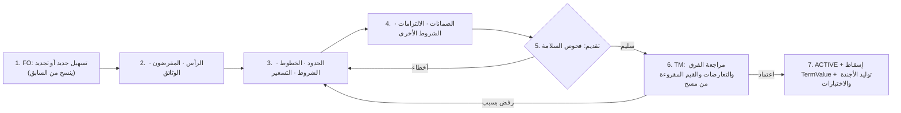
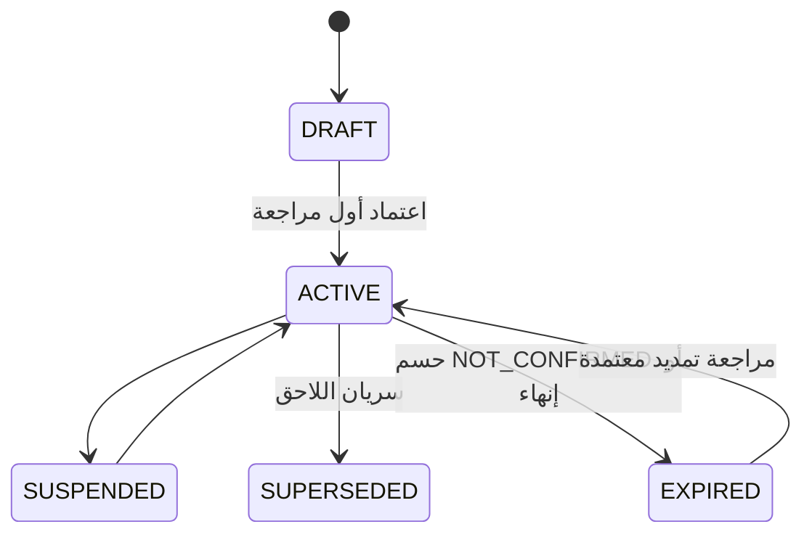

# م5: التسهيلات والتسعير والضمانات والالتزامات والبيانات المالية ومكتبة الشروط (FAC · PRC · COL · OBL · FIN · CMP)

| البند | القيمة |
|---|---|
| الملف | `10-detailed-analysis/12-m5-facilities-pricing-collateral-obligations.md` |
| الحالة | مسودة تحليل تفصيلي للمراجعة (جزء من وثيقة التحليل التفصيلية) |
| التاريخ | 2026-10-10 |
| البادئات | `FAC` التسهيلات والحدود · `PRC` التعرفة والتسعير · `COL` الضمانات والكفلاء · `OBL` الالتزامات والتعهدات · `FIN` البيانات المالية والتحقق · `CMP` مكتبة الشروط القابلة للمقارنة |
| الشرائح | S2 (FAC، PRC، COL، OBL، CMP) · S2-ب (FIN وتشغيل التحقق من التعهدات القابلة للقياس) · S3/S4 (خدمات الإتاحة والحجز والفحص والتسعير تستهلكها الطلبات والاعتمادات) · S5 (تقارير المقارنة والبريد) |
| المصادر | `01` §5 و§10 (D-1…D-13) و§13 · `03` كاملة · `04` كاملة (Δ1…Δ14 و§9.4) · `02` B2 وB45 وF-6 · `bank-facilities/docs/01-system-analysis.md` §4.4–4.7 (أفكار معاد استخدامها مع تصحيحات `04`) · `11` (الكتالوجات وخدمات SVC-05/06/08 وFacilityAccount) · `00` §6 (X-SEC/X-AUD/X-DAT) |
| الوسوم | 🟢 مذكور من المستخدم أو في الوثائق · 🟡 اقتراح (له افتراض مُعلَن). الأمثلة الرقمية توضيحية ما لم يُذكر مصدرها، **ولا يُدخَل أي رقم مالي حقيقي قبل مطابقته بالأصل** (04 تحفّظ الدقة). الاتفاقيات الأربع تُسمّى A–D كما في `04`، ولا تُنقل أسماء أشخاص أو شركات أو هويات |

---

## 1. الغرض والنطاق (داخل/خارج النطاق)

**الغرض.** تمثيل الاتفاقيات الائتمانية كما وردت في الاتفاقيات الأربع (`04`) لا كما افترضه التصميم القديم: التسهيل **حزمة اتفاقية** بوثائقها وسلسلة تجديدها؛ حدودها لها **أنماط توزيع**؛ شروط العملية على **خطوط المنتجات** تُفحص عند الطلب؛ تسعيرها يستند إلى **جدول تعرفة البنك**؛ ضماناتها وكفلاؤها؛ **أجندة التزامات** وتعهدات قابلة للقياس أو وصفية؛ **بيانات مالية** تُدخَل يدويًا للتحقق من الالتزام؛ وكل قيمة بمصدرها وصفحتها. ثم تخزين الشروط بصيغة منظّمة تمهّد لمقارنة البنوك (التسعير ← المدد ← الضمانات، `04` §9.4). هذه الوحدة هي أولوية المشروع الأولى (`01` §0 س-27) وهي المرجع الذي تسأله الطلبات (`13`/`14`): ما المتاح؟ ما الشروط؟ ما السعر؟ ومنها يُحجز الحد.

### 1.1 داخل النطاق
| المجال | المحتوى |
|---|---|
| FAC | حزمة الاتفاقية (رأس، مقرضون، وثائق بأسبقية، سلسلة تجديد، تاريخان هجري وميلادي، لغة الأسبقية، حالة السريان و«السريان غير مؤكد»، لقطات الرصيد المعترف به) · شجرة الحدود وأنماط التوزيع والسقف كنسبة وخطوط المنتجات ورمز منتج البنك والاستحقاق وقيود الشركات والتخصيص · شروط العملية وفحصها · الاستخدام اليدوي والحجز وصيغة المتاح · ربط الحسابات (واجهة لـ FacilityAccount في `11`) · اعتماد السجل (معدّ/معتمِد) وفحوص السلامة وتعارض القيم |
| PRC | جدول تعرفة لكل بنك بشرائح وحدود ونطاق داخل/خارج · قواعد التسعير بنطاقاتها ووراثتها وطرقها · ثابت للعقد/متغيّر · أرضية · استبدال المؤشر · نافذة الاعتراض · أساس الاحتساب · الضريبة · عقوبات التأخر غير الإيرادية · التسعير بتواريخ سريان · محلّل التسعير |
| COL | سجل الضمانات: كفلاء (أفراد/شركات)، سند لأمر، تجيير تأمين، هامش نقدي، عقار وجدول تقييم، مقاصة، رهن سلبي · الربط بالتسهيلات · الفك · تقرير التغطية · حزمة بيانات الكفيل |
| OBL | عائلات الالتزام الأربع · أجندة التقارير وقواعد الاستحقاق · الإخطارات والشهادات · التعهدات القابلة للقياس بحد اختياري · الوصفية بحالة يدوية ودليل · السماح والعلاج · الاختبارات والحالات والهامش والإنذار المبكر · التنازلات وسجل الخروقات · لوحة امتثال التسهيل |
| FIN | القوائم المالية (كتالوج بنود، إدخال يدوي، لصق Excel اختياري، توازن، إصدارات، مدققة/إدارية، منفردة/موحدة) · متوسط الرصيد الشهري لكل حساب · المبالغ المحوَّلة للبنك · مكتبة الصيغ · محرك التحقق ولقطة المدخلات والبيانات الناقصة |
| CMP | كتالوج TermType وتخزين TermValue (مفتاح، قيمة، وحدة، نطاق، مصدر، نص أصلي، ثقة، تعارض) وأسلوب الالتقاط ومتطلبات بيانات المقارنة وثلاثة تخطيطات تقارير نموذجية |

### 1.2 خارج النطاق (مع الجهة المالكة)
| البند | المالك / الحالة |
|---|---|
| الكتالوجات (FacilityType، LimitType، CollateralType، ObligationType، BaseRate/BaseRateValue، Product، FeeType، FinancingType) وبذرها | `11` CAT؛ نستهلكها هنا. وتُبذر **TermType وTariffSchedule وLineCatalogItem** من هذه الوحدة |
| Party وIdentityDocument والعناوين وقائمة اكتمال بيانات الكفيل وقالب حزمة الكفيل · Company والسنة المالية · Document والتشفير وNumberSequence وNotification وAuditLog والمكوّن الهجري | `10` PTY/ORG/PLT؛ تعرضها COL ولا تكرر بياناتها |
| دورة الطلب والموافقات واستدعاء الحجز/التحويل/الفك، ونموذج الاعتماد LcTerms | `13` و`14`؛ نقدّم لهما الأوامر والخدمات (القسم 10.2) |
| احتساب الفوائد والعمولات المستحقة وتسجيل المتقاضى فعليًا وتقاريره الشهرية | مرحلة لاحقة (`00` §2.2)؛ العقوبات غير الإيرادية تُعرَّف هنا فقط |
| ربط حي بالبنوك أو كشوف الحسابات أو خلاصة SAIBOR أو القوائم المالية أو بوابات التقديم؛ تحويل العملات | غير مطلوب الآن (القسم 11) |
| تقارير المقارنة بين البنوك؛ سيناريو «ماذا لو»؛ مساعد استخراج من الاتفاقيات الممسوحة | البيانات الآن والتقارير لاحقًا (القسم 10.3 تخطيطات فقط)؛ الباقي أفكار لاحقة (`03` §6، `04` س-8) |
| صياغة نصوص البنود القانونية | قوالب يراجعها مختص؛ المنصة تحفظ ما يُدخَل ولا تقدّم استشارة |

---

## 2. الجهات والصلاحيات (role matrix: role x action)

الرموز: ✔ كامل · R قراءة · M مقنَّع · — لا صلاحية. الأدوار: **PO** مشغّل المنصة · **TA** مدير حساب المشترك · **TM** مدير الخزينة · **FO** مسؤول التسهيلات · **TE** موظف الخزينة · **FA** محلل مالي (🟡 `00` §3) · **RQ** الجهة الطالبة · **AU** مدقق/قراءة. الأدوار قابلة للدمج؛ **المُعِدّ ≠ المعتمِد** دائمًا (X-SEC-7). PO لا يصل إلى بيانات المشترك. بيانات هذه الوحدة سرية، فلا يراها TA ما لم تُمنح له الصلاحية.

| الإجراء | الصلاحية | PO | TA | TM | FO | TE | FA | RQ | AU |
|---|---|---|---|---|---|---|---|---|---|
| عرض التسهيلات والحدود والشروط والاستخدام | `fac.view` | — | — | R | R | R | R | — | R |
| إنشاء/تعديل مسودة مراجعة التسهيل وتقديمها (المُعِدّ) | `fac.edit` | — | — | ✔ | ✔ | — | — | — | — |
| اعتماد/رفض مراجعة (المعتمِد ≠ المُعِدّ) | `fac.approve` | — | — | ✔ | — | — | — | — | — |
| حسم تعارض القيم (04 س-7) | `fac.conflict.resolve` | — | — | ✔ | — | — | — | — | — |
| إدخال الاستخدام اليدوي ولقطات الرصيد المعترف به | `fac.util.manage` | — | — | ✔ | ✔ | — | — | — | — |
| خطافات الحجز عبر الطلبات (`fac.reserve_limit` وأخواتها) · تجاوز الإتاحة بسبب مدوَّن (يقابله `req.limit.override` في `13`) | `fac.reserve` · `fac.override_limit` | — | — | ✔ | — | — | — | — | — |
| إدارة التعرفة وقواعد التسعير · اعتماد جدول التعرفة | `prc.manage` · `prc.tariff.approve` | — | — | ✔/✔ | ✔/— | — | — | — | — |
| عرض التعرفة والتسعير · عرض الضمانات | `prc.view` · `col.view` | — | — | R | R | R | — | — | R |
| إدارة الضمانات · اعتماد سجل ضمان | `col.manage` · `col.approve` | — | — | ✔/✔ | ✔/— | — | — | — | — |
| كشف أرقام هوية الكفيل كاملة/تصديرها (قرار س-10) | `party.identity.reveal` (`10`) | — | — | ✔ | ✔ | M | M | — | M |
| طباعة حزمة الكفيل: كاملة بـ `party.pack.export` وإلا مسودة مقنَّعة (FR-PTY-026، BR-PTY-011) | `party.pack.export` (`10`) | — | — | ✔ | ✔ | M | — | — | — |
| عرض الالتزامات والأجندة ولوحة الامتثال | `obl.view` | — | — | R | R | R | R | — | R |
| إدارة الالتزامات والتعهدات وقواعد الأجندة | `obl.manage` | — | — | ✔ | ✔ | — | — | — | — |
| تسجيل تقديم تقرير/إخطار ومراجعة التعهد الوصفي | `obl.record` | — | — | ✔ | ✔ | ✔ | — | — | — |
| تسجيل خرق/تنازل · اعتماد التنازل | `obl.breach.manage` · `obl.waiver.approve` | — | — | ✔/✔ | ✔/— | — | — | — | — |
| عرض البيانات المالية والنتائج | `fin.view` | — | — | R | R | R* | R | — | R |
| إدخال القوائم المالية · اعتمادها | `fin.stmt.enter` · `fin.stmt.approve` | — | — | —/✔ | ✔/— | — | ✔/— | — | — |
| إدخال أرصدة الحسابات الشهرية والمبالغ المحوَّلة | `fin.stats.enter` | — | — | ✔ | ✔ | ✔ | — | — | — |
| إدارة مكتبة الصيغ · اعتمادها | `fin.formula.manage` · `fin.formula.approve` | — | — | ✔/✔ | ✔/— | — | R | — | R |
| تشغيل التحقق وإعادة التقييم | `fin.verify.run` | — | — | ✔ | ✔ | — | ✔ | — | — |
| عرض مكتبة الشروط والمقارنات · إدارة كتالوج TermType | `cmp.view` · `cmp.manage` | — | R/✔ | R/✔ | R/— | — | — | — | R/— |

ملاحظات: (1) *R\** لـ TE: يرى الأرصدة الشهرية والمبالغ المحوَّلة التي يدخلها فقط، لا القوائم. (2) RQ لا يرى بيانات التسهيلات؛ يصله من خلال الطلب (`13`) ما يخصه فقط («متاح/غير متاح» دون أرقام الحدود إلا بقرار لاحق). (3) النطاق: يظهر التسهيل لمن يشمل `UserCompanyScope` الخاص به الشركة المقترضة؛ وصفوف الحدود/التخصيص/الاستخدام لشركات خارج نطاقه تُخفى مبالغها (Q-FAC-11). (4) المعتمِد من لا شارك في تعديل المراجعة نفسها (BR-FAC-004).

---

## 3. المفاهيم والمسرد

| المصطلح | التعريف |
|---|---|
| حزمة الاتفاقية | التسهيل كوحدة: رأس + وثائق مرتبة بالأسبقية + حدود + تسعير + ضمانات + التزامات، لا ملف واحد (04 Δ1) |
| المراجعة (Revision) | نسخة مقترحة من شروط التسهيل تمر بالمعدّ ثم المعتمِد؛ المعتمدة غير قابلة للتعديل، والتغيير ينشئ مراجعة جديدة (BR-FAC-003) |
| سلسلة التجديد | تسهيل لاحق يشير إلى السابق ويحلّ محله عند سريانه؛ أما التعديل بملحق في المدة نفسها فمراجعة لا سلسلة |
| مؤشر السريان | قيمة مشتقة لتسهيل ACTIVE: ساري · يقترب انتهاؤه · **سريان غير مؤكد** (انتهى تاريخه ولا تمديد موثَّق) · لم يبدأ |
| نمط التوزيع | علاقة الحد الفرعي بأبيه: سقف مشترك (الأشيع) · تجزئة · خارج المجموع |
| خط المنتج وشروط العملية | سطر منتج داخل حد (رمز منتج البنك، سقف اختياري، دوار، استحقاق) تُنسب إليه معاملات تُفحص عند الطلب: أقصى مدة، تأجيل، صلاحية اعتماد، غطاء نقدي، نسبة تمويل، مهلة إخطار |
| اللقطة المعترف بها | رصيد قائم أقرّ به العميل أو البنك في تاريخ (عند التجديد غالبًا) |
| إضافة التعرفة (Add-on) | نقاط مئوية تُضاف إلى معدل بند التعرفة على أساسه نفسه («التعرفة + 0.5%») |
| ثابت للعقد / أرضية صفرية | سعر الأساس يُثبَّت عند بدء كل عقد تمويل بدل إعادة تسعيره / سعر الأساس الفعلي لا يقل عن الصفر (أو أرضية محددة) |
| عقوبة غير إيرادية | عقوبة تأخر تُصرف للأعمال الخيرية؛ لا تدخل إيرادًا في التقارير |
| أجندة التقارير | استحقاقات مولَّدة من قاعدة «N يومًا/شهرًا بعد نهاية فترة/سنة مالية» أو قبل/بعد حدث |
| التعهد القابل للقياس | مقياس + مشغّل + حد **اختياري**؛ الحد قد يكون فارغًا في الاتفاقية |
| مختوم المصدر (SourceStamp) | وثيقة + صفحة + «قُرئت من مسح» + النص الأصلي + الثقة + التحقق + علامة التعارض، تُرفق بكل قيمة آتية من وثيقة (X-DAT-4) |
| TermType / TermValue | تعريف مفتاح الشرط القابل للمقارنة / قيمته في تسهيل بنطاقها ومصدرها |
| الإسقاط (Projection) | نسخ مقروءة من حقول الكيانات المنمّطة إلى TermValue بأصل PROJECTED (BR-CMP-004) |

---

## 4. المتطلبات الوظيفية

المعرّف `FR-<PREFIX>-NNN`. المراجع `BR-` و`V-` و`NTF-` و`SVC-` و`R-` و«السيناريو n» تشير إلى الأقسام 5 و9 و10 و15 من هذا الملف. وحيثما كان الأساس مذكورًا من المستخدم فالإحالة إلى `04` Δ أو `03` §.

### 4.1 التسهيلات والحدود (FAC)
| المعرّف | المتطلب | الأولوية | الشريحة | المصدر | معيار القبول |
|---|---|---|---|---|---|
| FR-FAC-001 | تعريف التسهيل حزمةَ اتفاقية: رقم داخلي تلقائي، رقم مرجع البنك، رقم هيكل البنك، الشركة المقترضة، النوع، العملة، المبلغ الإجمالي، لغة الأسبقية | Must | S2 | 🟢 04 Δ1 · 🟡 الرقم الداخلي | حفظ بلا مقترض أو نوع أو عملة أو مبلغ أو تاريخ انتهاء يُرفض؛ الرقم `FAC-26-001` من NumberSequence؛ المرجعان نصيّان اختياريان بلا صيغة مفترضة (Q-FAC-01) |
| FR-FAC-002 | تواريخ الاتفاقية والسريان والانتهاء بالميلادي والهجري (إدخال أحدهما يحسب الآخر ويُحفظ النص الهجري وعلم التقويم المعتمد)، ولغة الأسبقية (عربي/إنجليزي/متساويان) ومرجع بندها | Must | S2 | 🟢 04 §5 | إدخال هجري يعرض المقابل الميلادي من مكوّن `10` (FR-PLT-033، BR-PLT-012)؛ تعديل المقابل يدويًا يتطلب سببًا ويحمل علم «معدَّل»؛ التنبيهات على الميلادي المخزَّن (BR-FAC-001)؛ تعارض النسختين يُسجَّل ValueConflict (FR-FAC-026) |
| FR-FAC-003 | المقرضون: مقرض واحد افتراضيًا، أو تمويل مشترك بأدوار ونسب مشاركة وجهة اتصال لكل مشارك | Must | S2 | 🟢 تصميم سابق (bank-facilities) D1 | 40/35/25 تُقبل وتُحسب الالتزامات؛ 40/35/20 تُرفض (V-FAC-02)؛ وكيلان يُرفضان؛ غير مشترك بمقرضين يُرفض |
| FR-FAC-004 | وثائق التسهيل بأنواعها (اتفاقية، ملحق، تعرفة، صرف، إقرار مديونية، سندات، كفالات) بتاريخ ولغة وأسبقية و«تعدّل وثيقة» | Must | S2 | 🟢 04 §5 | أسبقيات فريدة؛ إعادة الترتيب تُدقَّق؛ نوع لا يقبل AppliesTo=FACILITY يُرفض؛ حزمة بثماني وثائق مختلفة الأنواع تُحفظ |
| FR-FAC-005 | سلسلة التجديد: أمر «تجديد» ينشئ تسهيلًا مسودة مرتبطًا بالسابق وينسخ الحدود والتسعير والضمانات والالتزامات والشروط مسودةً للمراجعة | Must | S2 | 🟢 04 §5 · 🟡 النسخ للمسودة | يُنسخ كل صف فعّال بتواريخ تُدخَل؛ باعتماد اللاحق يصبح السابق SUPERSEDED من EffectiveFrom اللاحق؛ لاحق واحد لكل تسهيل؛ شاشة السلسلة تعرض F1→F2→F3 |
| FR-FAC-006 | التعديل في المدة نفسها (ملحق: سعر، حد، ضمان) مراجعةً جديدة بوثيقة ملحق وتاريخ نفاذ | Must | S2 | 🟢 04 §1 | مراجعة AMENDMENT بلا وثيقة ملحق تُرفض عند التقديم؛ المراجعة السابقة تبقى كاملة في السجل |
| FR-FAC-007 | حالة السريان: دورة حياة مخزَّنة + مؤشر مشتق يُحسب يوميًا (ساري، يقترب، **سريان غير مؤكد**، لم يبدأ) | Must | S2 | 🟢 04 Δ10 | السيناريو 6: ينتهي بعد 51 يومًا ← «يقترب»؛ انتهى بلا لاحق ولا تمديد ← «غير مؤكد» لا «منتهٍ» |
| FR-FAC-008 | حسم «السريان غير المؤكد» بتسجيل تمديد (تاريخ جديد + وثيقة أو إشعار البنك) أو تعليم «منتهٍ» أو «مُنهى» بسبب؛ وتنبيهات انتهاء التسهيل والحد والخط قبل 90/60/30/15/7 يومًا وفي اليوم، قابلة للضبط | Must | S2 | 🟢 04 Δ10 | الخيارات الثلاثة لـ FO وTM؛ دون حسم تذكير أسبوعي (NTF-FAC-02)؛ «منتهٍ» يمنع الحجز الجديد؛ تكرار المهمة في اليوم نفسه لا يكرر التنبيه؛ تغيير الانتهاء يعيد جدولة العتبات |
| FR-FAC-009 | لقطات الرصيد المعترف به: مبلغ وتاريخ ومصدر لتسهيل/حد/منتج، نسبته من الحد، ومقارنته بالمحسوب في المنصة | Must | S2 | 🟢 04 Δ9 | إدخال 39,520,000 على حد 45,000,000 يعرض 87.82%؛ فرق ≥ 0.005 نقطة عن النسبة المنصوص عليها يُعلَّم للمراجعة؛ الفرق عن المنصة في R-FAC-04 |
| FR-FAC-010 | شجرة الحدود حتى عمق 6: رئيسي/فرعي من LimitType، مبلغ مطلق أو نسبة من الأب، دوار/غير دوار، ملتزم أم لا، تواريخ | Must | S2 | 🟢 04 Δ2 | فرعي بلا أب يُرفض (`11` FR-CAT-012)؛ 95% من 45,000,000 تُخزَّن 42,750,000؛ تغيير سقف الأب يعيد حساب الفرعي بالنسبة |
| FR-FAC-011 | نمط التوزيع لكل حد: سقف مشترك (افتراضي) · تجزئة · خارج المجموع، والافتراضي من LimitType | Must | S2 | 🟢 04 §2.5 | السيناريو 1؛ الحد «خارج المجموع» لا يدخل مجموع التسهيل ولا المستخدم للأب (BR-FAC-010) |
| FR-FAC-012 | خط المنتج داخل الحد: المنتج من المسموح (SVC-08)، رمز منتج البنك، سقف اختياري (مطلق/نسبة)، دوار، تاريخ استحقاق | Must | S2 | 🟢 04 Δ2 | منتج غير مسموح يُرفض، وقائمة مسموحة فارغة = «أي منتج» بتحذير؛ 15 خطًا بسقف 40,000,000 لكلٍّ تحت حد 40,000,000 مقبولة |
| FR-FAC-013 | قيود الشركات على الحد: مسموح/مستثنى/تخصيص (مبلغ أو نسبة) وتوريثها للفروع | Must | S2 | 🟢 04 §2.6 | BR-FAC-012؛ استثناء شركتين يخفي الخط عنهما ببيان السبب؛ «مسموح» في الفرع خارج مسموحات الأب مرفوض |
| FR-FAC-014 | شروط العملية لخط المنتج بتواريخ سريان: أقصى مدة شاملة التأجيل، أقصى تأجيل، أقصى تمويل بعد التأجيل، صلاحية الاعتماد، غطاء نقدي أدنى %، نسبة تمويل أقصى %، مهلة إخطار | Must | S2 | 🟢 04 Δ3 | كل حقل اختياري وفارغه «غير محدد» لا صفر؛ نسبة خارج 0–100 تُرفض؛ التعديل صف بتاريخ جديد |
| FR-FAC-015 | الفحص الآلي لشروط العملية عند طلب اعتماد (SVC-FAC-02) بنتيجة لكل شرط (مطابق/مخالف/غير محدد) والقيمة الفعلية والمطلوبة | Must | S3 | 🟢 04 §2.6 · الوضع 🟡 | السيناريو 3؛ الافتراضي تحذير وقابل للضبط OFF/WARN/BLOCK لكل خط (Q-FAC-02)؛ لا «سليم» لشرط غير معرَّف |
| FR-FAC-016 | الاستخدام اليدوي: بند لكل أداة/عقد (وصف، مرجع، شركة، حد/خط، مبلغ، تواريخ) مع تعديل وفك بسبب | Must | S2 | 🟢 تصميم سابق (bank-facilities) D3 | البند RELEASED يخرج من المستخدم من تاريخه؛ لا حذف؛ تعديل المبلغ يترك تدقيقًا بالقيمتين |
| FR-FAC-017 | الحجز عبر خطافات `13` §5.4: `fac.reserve_limit` عند موافقة مدير الخزينة (upsert بـ RequestId)، `fac.convert_reservation` عند الإصدار، `fac.release_reservation` عند الرفض/الإلغاء، `fac.adjust_reservation(Delta)` عند تعديل معتمد؛ كلها متكررة الأمان بمفتاح، ويصدر `fac.reservation.expired` أو `released_externally` للمحرك عند الانتهاء أو الفك اليدوي | Must | S3 | 🟢 D-9 · 🟡 التعديل | إعادة الأمر بالمفتاح نفسه لا تنشئ حجزًا ثانيًا؛ إعادة اعتماد 3,000,000 بمبلغ 2,500,000 تعدّل الحجز الفعّال نفسه؛ السيناريو 2 |
| FR-FAC-018 | منع الوعد المزدوج: فحص المتاح والحجز في معاملة واحدة تقفل مسار الحدود وتشارك معاملة المستدعي (SYNC_TX في `13`) | Must | S3 | 🟢 01 §5 | طلبان متزامنان بـ 3,000,000 على متاح 4,000,000 ينجح أحدهما فقط ويرفض الآخر INSUFFICIENT_AVAILABLE والمتاح 1,000,000؛ وتعذّر القفل يُرجع CONCURRENT_RETRY |
| FR-FAC-019 | صيغة المتاح المراعية للأب والنمط وسقف الخط وتخصيص الشركة والحجوزات والاستخدام، مع تفسير القيد الملزِم | Must | S2 | 🟢 01 §5 | BR-FAC-014؛ لا يُعرض متاح موجب لتسهيل غير ساري؛ الناتج يسمّي العقدة الملزِمة |
| FR-FAC-020 | تجاوز الإتاحة: يُرفض الحجز فوق المتاح (السياسة الافتراضية BLOCK) إلا حيث فعّل المشترك التجاوز لمدير الخزينة بصلاحية وسبب، ويظهر في تقرير | Must | S3 | 🟡 | الحجز المتجاوز OverLimit=true ويظهر في R-FAC-03؛ غير TM يتلقى الرفض (Q-FAC-04) |
| FR-FAC-021 | محدد الخطوط المؤهلة (SVC-FAC-01) للخزينة: شركة + منتج + مبلغ + عملة + تاريخ ← خطوط مرتبة بالمتاح والسريان والامتثال وأسباب الاستبعاد | Must | S3 | 🟢 01 §4.1 · 🟡 الترتيب | شركة مستثناة تظهر بسبب «مستثناة»؛ الترتيب: ساري ثم المتاح الكافي ثم الأقل سعرًا إن توفر تسعير |
| FR-FAC-022 | ربط الحسابات بالتسهيل بأغراضها من تبويب التسهيل (FacilityAccount، `11` FR-ACC-010) | Must | S2 | 🟢 `02` B45 | تفعيل بلا حساب بغرض FACILITY ينبّه (W)؛ حساب مجمّد يُرفض؛ SVC-FAC-07 تعيد الحسابات الثلاثة (تسهيل، هامش وتسوية، رسوم) |
| FR-FAC-023 | حقوق البنك المنفردة (تمديد، تعديل التسعير، إلغاء، تخفيض الحدود) ومهلة الإخطار | Must | S2 | 🟢 04 §5 | تظهر في الرأس واللوحة؛ تفعيل «تعديل التسعير منفردًا» يتطلب بيان المهلة أو «بلا» |
| FR-FAC-024 | اعتماد السجل: مراجعات معدّ/معتمِد تشمل الرأس وكل أبنائه المنمّطة؛ المعتمدة ثابتة؛ الرفض بسبب يعيد للمسودة | Must | S2 | 🟢 تصميم سابق (bank-facilities) D5 | الاعتماد الذاتي يُرفض؛ التقديم بخطأ سلامة يُرفض؛ لا تعديل في صف معتمد؛ المسودة المهملة تبقى في التدقيق |
| FR-FAC-025 | فحوص سلامة تراعي النمط وتحل محل قاعدة «مجموع الفروع ≤ الأب» | Must | S2 | 🟢 04 §6 | V-FAC-04…09؛ حالة D (95% و95% تحت 45 م) بلا خطأ؛ فرع سقف مشترك أكبر من الأب خطأ |
| FR-FAC-026 | تعارض القيم: ValueConflict بين مصدرين (بيان/ملحق، عربي/إنجليزي) بقرار مدير الخزينة وسببه، وتبقى القيمة معلَّمة حتى الحسم | Must | S2 | 🟢 04 Δ8 · 🟡 الحاسم | رسم تأجيل 2% مقابل 1.5% ينشئ تعارضًا؛ لا اعتماد مع تعارض مفتوح على قيمة مالية دون إقرار المعتمِد؛ القرار يُدقَّق |
| FR-FAC-027 | التحقق من الأصل للقيم المقروءة من مسح: لا يُعتمد التسهيل بقيمة مالية/نسبة/أيام معلَّمة «قُرئت من مسح» ما لم يُوثَّق التحقق أو يقرّ المعتمِد بقبولها بسبب | Must | S2 | 🟡 04 تحفّظ | BR-FAC-018؛ قائمة جامعة في شاشة المراجعة؛ الإقرار يُدقَّق |
| FR-FAC-028 | لوحة التسهيل (الإجمالي/المستخدم/المحجوز/المتاح داخل المجموع وخارجه، السريان، الامتثال، المستحقات، التعارضات) وقائمة التسهيلات بالبحث والتصفية (شركة، بنك، حالة، مؤشر السريان، ينتهي خلال N) | Should | S2 | 🟡 | أرقام اللوحة تطابق R-FAC-02؛ أقل من ثانيتين لتسهيل بـ 100 حد وخط؛ «ينتهي خلال 60 يومًا» تعيد الصحيح فقط |
| FR-FAC-029 | سياسة اختيارية لكل تسهيل «إيقاف الاستخدام عند خرق» (مغلقة افتراضيًا): تحذير أو منع الحجز مع تجاوز TM | Should | S3 | 🟡 03 §6 | مع خرق مفتوح غير متنازَل عنه يرفض `fac.reserve_limit` برمز COVENANT_STOP_POLICY ويعرض SVC-FAC-01 الخط محجوبًا؛ إغلاقها يعيد التحذير فقط |

### 4.2 التعرفة والتسعير (PRC)
| المعرّف | المتطلب | الأولوية | الشريحة | المصدر | معيار القبول |
|---|---|---|---|---|---|
| FR-PRC-001 | جدول تعرفة لكل بنك (واختياريًا لتسهيل) بإصدارات وتواريخ سريان ومصدر (ملحق التعرفة) واعتماد مدير الخزينة | Must | S2 | 🟢 04 Δ4 | المعتمد غير قابل للتعديل والتغيير إصدار جديد؛ جدولان معتمدان متداخلان لنفس (بنك، تسهيل) يُرفضان |
| FR-PRC-002 | بند التعرفة: فئة الرسم، رمز، النوع (نسبة، مبلغ، لكل مليون، شرائح)، أساس المدة، حد أدنى وأعلى، داخل/خارج البنك، عملة، معاملة الضريبة | Must | S2 | 🟢 04 §3 | «لكل فترة» بلا طول فترة يُرفض؛ أدنى > أعلى يُرفض |
| FR-PRC-003 | شرائح البند بالمبلغ وبالمدة (نسبة للفترة الأولى ثم أخرى للاحقة) | Must | S2 | 🟢 04 §3 | تداخل شريحتين في المبلغ يُرفض؛ BR-PRC-002 |
| FR-PRC-004 | نطاق التعرفة: الرسوم المستخدمة فعلًا ابتداءً، مع إنشاء بند من شاشة قاعدة التسعير مباشرة | Must | S2 | 🟡 04 س-5 | الإشارة إلى بند غير موجود تفتح إنشاءه؛ مؤشر اكتمال يعرض بنودًا ناقصة لمنتجات الخطوط |
| FR-PRC-005 | الإشارة إلى سعر أساس من `11` بأسمائه البديلة وقيمته في تاريخ (SVC-05) بلا تعويض بقيمة لاحقة | Must | S2 | 🟢 04 §3 | NO_VALUE تنتج حالة INCOMPLETE؛ البحث بـ SIBOR يصل SAIBOR |
| FR-PRC-006 | قاعدة تسعير بنطاق (تسهيل، حد، خط منتج، منتج، شركة) بأي تركيب، ووضع تسعير الحد INHERIT/OWN | Must | S2 | 🟢 تصميم سابق (bank-facilities) FR-PR-04 | بلا نطاق = مستوى التسهيل؛ OWN يوقف الصعود إلى الأب (BR-PRC-010) |
| FR-PRC-007 | الطرق: بند تعرفة كما هو · بند + إضافة · سعر أساس + هامش · نسبة من المبلغ · مبلغ ثابت · لكل مليون · شرائح | Must | S2 | 🟢 04 Δ4 | إضافة على بند ثابت المبلغ تُرفض؛ لكل طريقة حقول إلزامية (V-PRC-02) |
| FR-PRC-008 | ثابت للعقد أو متغيّر (بدورية إعادة تسعير) | Must | S2 | 🟢 04 §3 | ثابت للعقد يستلزم تاريخ العقد عند الحل؛ المتغيّر يستلزم دورية |
| FR-PRC-009 | أرضية سعر الأساس (صفر أو محددة) وشرط استبدال المؤشر (لا يوجد/البنك يحدد/بديل مسمّى + نصه ومصدره) | Must | S2 | 🟢 04 §3 | السيناريو 5؛ الأرضية الفارغة = بلا أرضية؛ شرط الاستبدال يظهر في ورقة التسعير ولا أثر حسابيًا له في S2 |
| FR-PRC-010 | حق البنك في تغيير الهوامش والرسوم: لا / بإخطار ومهلة اعتراض / منفردًا؛ والمهلة بأيام تقويمية أو عمل؛ وتسجيل إخطار تغيير ينشئ موعد الاعتراض | Must | S2 | 🟢 04 §3 | إخطار بتاريخ D يولّد بند أجندة D + N يوم عمل (BR-OBL-004) |
| FR-PRC-011 | أساس الاحتساب 360/365، الضريبة خارج السعر، حد أدنى للرسم، لكل مليون | Must | S2 | 🟢 04 §3 | الضريبة سطر مستقل بمعدل الإعداد ولا تدخل السعر؛ الحد الأدنى يرفع الرسم عند انخفاضه (السيناريو 4) |
| FR-PRC-012 | قواعد عقوبات التأخر غير الإيرادية بحدث الإطلاق، موسومة «أعمال خيرية» من FeeType | Must | S2 | 🟢 04 Δ12 | FeeType بطبيعة PENALTY_NON_INCOME يفرض ComponentKind=PENALTY؛ لا تدخل تقرير إيراد؛ قائمة عقوبات التسهيل متاحة |
| FR-PRC-013 | الصيغ الإسلامية: ربط القاعدة بـ FinancingType وعمولة الوكالة رسمًا بمدى (حد أدنى وأعلى) | Must | S2 | 🟢 04 Δ11 | الصيغة الإسلامية تعرض «ربح»؛ 0.02%–0.05% تُخزَّن مدًى (BR-PRC-007) |
| FR-PRC-014 | التسعير بتواريخ سريان؛ التغيير نسخة جديدة تغلق السابقة ولا تُكتب فوقها؛ وإدخال بأثر رجعي بسبب | Must | S2 | 🟢 X-DAT-3 | BR-PRC-011؛ «السعر في تاريخ» يعيد نسخة ذلك التاريخ |
| FR-PRC-015 | محلّل التسعير ResolvePricing بتفسير: القاعدة الفائزة والمرفوضة وسببها، مكوّنات السعر، السعر الشامل، الرسم بالمبلغ والمدة | Must | S2 | 🟢 تصميم سابق (bank-facilities) FR-PR-05 | السيناريو 4؛ الناتج يسرد المرشحات؛ لا قاعدة ← NO_RULE |
| FR-PRC-016 | فحص اكتمال التسعير: خطوط بمنتجات لها رسوم متوقعة (ProductFeeType) بلا قاعدة | Should | S2 | 🟡 `11` BR-CAT-007 | R-PRC-02 يسرد النقص؛ لا منع |

### 4.3 الضمانات والكفلاء (COL)
| المعرّف | المتطلب | الأولوية | الشريحة | المصدر | معيار القبول |
|---|---|---|---|---|---|
| FR-COL-001 | سجل الضمانات: النوع (CollateralType)، الوصف، المالك، الحالة، السمات بحسب القالب، المصدر | Must | S2 | 🟢 04 Δ5 | سمات العقار السبع من القالب؛ سمة إلزامية ناقصة تُرفض عند الاعتماد |
| FR-COL-002 | ربط الضمان بتسهيل أو حد بمبلغ تغطية اختياري ورتبة؛ ضمان واحد لعدة تسهيلات | Must | S2 | 🟢 تصميم سابق (bank-facilities) FR-COL-02 | فك الربط يضع UnlinkedOn ولا يحذف؛ ضمان بلا ربط فعّال يظهر في تقرير الجودة |
| FR-COL-003 | الكفالة: كفيل فرد (Party) أو شركة (Party أو Company)، نوعها (غرم وأداء تضامنية…)، تضامن، مبلغ أو «غير محدد»، تاريخ التوقيع، سندها | Must | S2 | 🟢 04 §4 | مبلغ محدد بلا رقم يُرفض؛ «غير محدد» مع رقم يُرفض؛ كفيل من نوعين معًا يُرفض |
| FR-COL-004 | بيانات الكفيل تُقرأ من Party دون تكرار، مع شارة حالة وثائقه (ساري/يقترب/منتهٍ/ناقص، FR-PTY-004 وFR-PTY-021)؛ وتُسجَّل Guarantee مزوّد استخدام لـ Party (BR-PTY-001) | Must | S2 | 🟢 D-2 · Δ14 | كفيل واحد في أربع اتفاقيات = سجل Party واحد؛ لا رقم هوية في جداول هذه الوحدة؛ تجديد وثيقة الكفيل لا يغيّر الوثيقة المرجعية في كفالة موقّعة (BR-PTY-006) |
| FR-COL-005 | السند لأمر: مبلغ مستقل (قد يفوق الحد) ونسبته من الحد، دورة تجديد (لا/سنوية)، آخر تجديد وموعد التالي، موضع الحفظ | Must | S2 | 🟢 04 §4 | سند 44,000,000 على حد 40,000,000 يُقبل ويعرض 110%؛ التجديد السنوي يولّد بند أجندة |
| FR-COL-006 | تجيير وثيقة التأمين: قاعدة التغطية (نسبة من الحد/مبلغ/كامل الحدود)، رقم الوثيقة، المؤمِّن، مبلغ التأمين، بدء وانتهاء، تاريخ التجيير | Must | S2 | 🟢 04 §4 | السيناريو 8؛ النقص = المطلوب − مبلغ التأمين؛ انتهاء الوثيقة ينبّه قبل 60/30/7 يومًا |
| FR-COL-007 | الهامش النقدي الدائم (نسبة/مبلغ وحسابه) مميَّزًا عن الغطاء النقدي لكل عملية (شرط خط) | Must | S2 | 🟢 04 §4 | الحقلان لا يختلطان في التقارير؛ الحساب من النوع MARGIN أو الغرض MARGIN_SETTLEMENT |
| FR-COL-008 | الرهن العقاري وجدول التقييم (مراحل: سنة من/إلى، عدد المقيّمين، الدورية) وآخر تقييم وقيمته، وتوليد مواعيد التقييم القادمة في الأجندة | Must | S2 | 🟢 04 §4 | «3 مكاتب في السنة الأولى ثم مكتب سنويًا» يولّد موعدين بعددَي مقيّمين مختلفين؛ تقييم جديد يحدّث القيمة ويُدقَّق |
| FR-COL-009 | المقاصة ودمج الحسابات والرهن السلبي بنودَ علَم (نص ومصدر) تظهر في تقرير التغطية | Must | S2 | 🟢 04 §4 | ✔ لكل تسهيل في التقرير؛ لا مبلغ لها |
| FR-COL-010 | فك الضمان بتاريخ وسبب ووثيقة (لا حذف)؛ يخرج من التغطية من تاريخ الفك | Must | S2 | 🟢 تصميم سابق (bank-facilities) FR-COL-03 | RELEASED لا يظهر في التغطية بعد التاريخ ويبقى في السجل |
| FR-COL-011 | تقرير تغطية الضمانات لتسهيل: مصفوفة بحسب النوع مقابل الحد والمستخدم | Must | S2 | 🟢 تصميم سابق (bank-facilities) FR-COL-04 | R-COL-01 يطابق السيناريو 8؛ لا مجموع كلي مضلل (BR-COL-006) |
| FR-COL-012 | حزمة بيانات الكفيل بحسب ملف البنك تُستدعى من شاشة الضمان/التسهيل لكفيل أو لكل كفلاء تسهيل، والتوليد في `10` (FR-PTY-026) | Must | S2 | 🟢 04 Δ14 · §9.4 | الكاملة لمن يملك `party.identity.reveal` و`party.pack.export` (TM وFO) وإلا مسودة مقنَّعة بعلامة؛ كل توليد مدقَّق؛ الصور لـ TM وFO فقط |
| FR-COL-013 | اكتمال بيانات كل كفيل مقابل ملف اكتمال بنك التسهيل (KycProfile، FR-PTY-023 إلى FR-PTY-025) وتحذير عند الاعتماد، وتنبيهات تجديد السند وانتهاء التأمين وموعد التقييم وانتهاء وثيقة هوية الكفيل | Should | S2 | 🟡 | كفيل ناقص ينتج W لا منعًا (القائمة الفعلية بعد وصول نموذج KYC)؛ NTF-COL-01…02 |
| FR-COL-014 | اعتماد سجل الضمان (معدّ/معتمِد) مستقلًّا عن مراجعة التسهيل؛ التعديل ينشئ نسخة جديدة | Should | S2 | 🟡 | تعديل مبلغ كفالة معتمدة ينشئ نسخة DRAFT؛ التغطية تستخدم المعتمدة حتى اعتماد الجديدة (Q-COL-01) |

### 4.4 الالتزامات والتعهدات (OBL)
| المعرّف | المتطلب | الأولوية | الشريحة | المصدر | معيار القبول |
|---|---|---|---|---|---|
| FR-OBL-001 | الالتزام على التسهيل (أو حد/خط/شركة) بنوع من ObligationType وعائلته ومرحلته (شروط التسهيل السابقة/المستمرة/اللاحقة) ومرجع البند ونصه الأصلي والأثر عند المخالفة | Must | S2 | 🟢 04 Δ6 | العائلة تُشتق من النوع ولا تُحرَّر؛ التعهد الوصفي لا يطلب مقياسًا (BR-OBL-001) |
| FR-OBL-002 | قاعدة استحقاق التقارير: الدورية، المرساة، الإزاحة (أيام تقويمية/عمل/أشهر)، أساس القوائم، منفردة/موحدة، قناة التقديم (مثل منصة تنظيمية لقوائم الشركات)، والشهادات الدورية (الزكاة، التأمينات) بنودَ تقارير بتاريخ انتهاء الشهادة | Must | S2 | 🟢 04 §2.2 | السيناريو 6: 210 يومًا بعد 2025-12-31 ← 2026-07-29؛ 6 أشهر ← 2026-06-30؛ 45 يومًا بعد 2026-06-30 ← 2026-08-14؛ شهادة منتهية تفتح بندًا مستحقًا |
| FR-OBL-003 | توليد بنود الأجندة آليًا حتى أفق (24 شهرًا أو نهاية التسهيل) وإعادة توليد غير المقدَّمة المستقبلية عند تغيير القاعدة | Must | S2 | 🟢 04 §2.2 | تعديل 210 إلى 180 يعيد حساب غير المقدّمة اللاحقة فقط ويُبقي المقدَّمة |
| FR-OBL-004 | تسجيل التقديم: التاريخ، القناة، مرجع الاستلام، الدليل؛ واحتساب التأخير | Must | S2 | 🟢 04 §2.2 | تقديم بعد 4 أيام من الاستحقاق = SUBMITTED بتأخير 4 ويفتح خرق LATE_REPORT؛ الدليل إلزامي حيث ExpectsEvidence |
| FR-OBL-005 | الإخطارات المرتبطة بحدث (تغيير شكل/ملكية، مخالفة، تدهور المركز): تسجيل الحدث ينشئ موعدًا (قبل بـ N يوم عمل / فورًا / بعد بـ N يومًا) | Must | S2 | 🟢 04 §2.2 | حدث مخطط 2026-12-20 وإخطار قبله بـ 30 يوم عمل ← آخر موعد 2026-11-08 (BR-OBL-004) |
| FR-OBL-006 | التعهد القابل للقياس بحد اختياري: حالة الحد (محدد/لم يُحدَّد في الاتفاقية/يُحدَّد لاحقًا)، مشغّل، قيمة، وحدة، تواتر، نمط تجميع، الشركة المختبَرة، الصيغة | Must | S2 | 🟢 04 §2.1 | حد فارغ يُحفظ NOT_SPECIFIED_IN_AGREEMENT بلا خطأ؛ النتيجة NOT_ASSESSED (BR-OBL-006) |
| FR-OBL-007 | التعهد الوصفي بحالة يدوية (ملتزم/غير ملتزم/قيد المراجعة)، دليل، ملاحظة، مراجِع، موعد المراجعة التالية | Must | S2 | 🟢 04 Δ7 | مراجعة فائتة تجعل الحالة «مراجعة متأخرة» (AMBER) |
| FR-OBL-008 | البنود الثابتة بقيم رقمية قليلة، ومنها أرقام السماح وحالات التعثر (7 أيام للتأخر، 15 للتعجيل، 90 للقائمة الائتمانية) تُحفظ وتُعرض وتُسقَط إلى TermValue | Must | S2 | 🟢 04 Δ6 | ParamValue بوحدة؛ تظهر في بطاقة الالتزام وفي المقارنة |
| FR-OBL-009 | قيود العملية (شركات مستفيدة، طريقة الشحن، شرط وثيقة التأمين) مربوطة بحقل الاعتماد الذي تُقيَّم عليه وتظهر في فحص الطلب | Must | S3 | 🟢 04 §2.6 | «الشحن البري يلزمه موافقة مسبقة» يظهر تحذيرًا حين يكون النمط بريًّا (SVC-FAC-02) |
| FR-OBL-010 | السماح والعلاج: مهلة سماح للتعهد، ومهلة علاج للخرق، وإنذار قبل نهايتها | Must | S2 | 🟢 03 §4 | الخرق يحمل CureDeadline = الكشف + CureDays؛ تنبيه قبل 7 أيام |
| FR-OBL-011 | توليد اختبارات التعهد (CovenantTest) لكل فترة حتى الأفق بحسب التواتر والسنة المالية للشركة، وحالات النتيجة والهامش والإنذار المبكر | Must | S2-ب | 🟢 03 §5 | ربع سنوي لسنة تنتهي 31 ديسمبر ← نهايات 31/3 و30/6 و30/9 و31/12؛ نسخة تعهد جديدة تعيد توليد غير المقيَّمة المستقبلية؛ BR-OBL-007؛ السيناريو 7 |
| FR-OBL-012 | سجل الخروقات: كشف آلي من الاختبارات والتأخير وتسجيل يدوي، حالة، علاج، إخطار البنك، وتنازل بمرجع وتاريخ وجهة ووثيقة وشروط وصلاحية | Must | S2 | 🟢 03 §5.5 | التنازل يغيّر حالة الخرق إلى WAIVED ولا يغيّر نتيجة الاختبار؛ يتطلب `obl.waiver.approve` |
| FR-OBL-013 | لوحة امتثال التسهيل: عدّادات بحسب العائلة، المستحقات القادمة والمتأخرة، نتائج الاختبارات، الخروقات، الحالة المجمَّعة | Must | S2 | 🟢 03 §6 | BR-OBL-010؛ تطابق R-OBL-04 |
| FR-OBL-014 | التنبيهات: قبل الاستحقاق، التأخير، الخرق، الإنذار المبكر، البيانات الناقصة، المراجعة الوصفية المتأخرة | Must | S2 | 🟢 03 §6 | NTF-OBL-01…06 دون تكرار |
| FR-OBL-015 | خدمة حالة الامتثال للطلبات (SVC-FAC-06) تغذي تحذير مدير الخزينة | Must | S3 | 🟡 03 §6 | طلب على تسهيل أحمر يعرض التحذير بتفاصيل الخروقات |
| FR-OBL-016 | حساب مواعيد أيام العمل بخدمة `10` (AddWorkingDays وعدّ تنازلي لما قبل الحدث) بعطلة الأسبوع وقائمة العطل للدولة (FR-PLT-035، BR-PLT-014) دون تكرارها هنا | Should | S2 | 🟡 | تغيير العطلة أو إضافة يوم غير عمل يعيد حساب مواعيد أيام العمل غير المقدَّمة؛ الأسبوع الافتراضي الجمعة والسبت (Q-PLT-09) |

### 4.5 البيانات المالية والتحقق (FIN) — الشريحة S2-ب
| المعرّف | المتطلب | الأولوية | الشريحة | المصدر | معيار القبول |
|---|---|---|---|---|---|
| FR-FIN-001 | كتالوج بنود القوائم الموحَّد (39 بندًا مزروعًا: ميزانية، دخل، تدفقات اختيارية) بإجماليات محسوبة وإمكان إضافة بنود للمشترك | Must | S2-ب | 🟢 03 §3.1 | البنود النظامية في الصيغ لا تُحذف؛ البند المضاف يظهر في شبكة الإدخال |
| FR-FIN-002 | رأس القائمة (الشركة، نوع الفترة، تاريخ النهاية، السنة المالية، منفردة/موحدة، مدققة/مراجَعة/إدارية، العملة والوحدة، المعيار، المستند المصدر) وشبكة إدخال يدوي مقسّمة بالأقسام مع الإجماليات الحية | Must | S2-ب | 🟢 03 §3.1 | تكرار (شركة، فترة، أساس، تأكيد، إصدار) مرفوض؛ تعديل رقم يحدّث الإجماليات فورًا؛ حفظ مسودة ناقصة مسموح |
| FR-FIN-003 | لصق من Excel/الحافظة بمطابقة الرمز أو الاسم مع معاينة وبنود غير مطابقة | Should | S2-ب | 🟢 03 ق-2 | لصق 30 صفًا فيها اثنان مجهولان يعرضهما للربط ويستورد 28 بعد التأكيد؛ لا كتابة قبل التأكيد |
| FR-FIN-004 | فحوص الإجماليات والتوازن: المُدخل مقابل المحسوب، وأصول = خصوم + حقوق | Must | S2-ب | 🟡 03 §3.1 | BR-FIN-001؛ عدم التوازن يتطلب سببًا لتقديم القائمة ويظهر شعارًا أحمر للمعتمِد |
| FR-FIN-005 | الإصدارات وإعادة العرض: تعديل قائمة معتمدة إصدار جديد بسبب (إعادة عرض/تصحيح) والسابق SUPERSEDED | Must | S2-ب | 🟢 03 §5.6 | لا تعديل في المعتمدة؛ الإصدار الجديد DRAFT |
| FR-FIN-006 | فصل الإعداد عن الاعتماد (المُعِدّ ≠ المعتمِد) وصلاحية «بيانات مالية» مستقلة | Must | S2-ب | 🟢 03 §7 | الاعتماد الذاتي يُرفض |
| FR-FIN-007 | قاعدة اختيار القائمة المعتمدة لفترة لكل تعهد: مدققة فقط/المدققة مفضلة/أي، والأساس | Must | S2-ب | 🟢 03 §5.2 | BR-FIN-003؛ غياب الأساس المطلوب ← MISSING_DATA بلا بديل صامت |
| FR-FIN-008 | متوسط الرصيد الشهري لكل حساب (متوسط يومي إلزامي، أدنى ونهاية شهر اختياريان، المصدر والمرجع) بشبكة حسابات × أشهر، مع مؤشر نقص الأرصدة والتحويلات وتنبيه TE | Must | S2-ب | 🟢 03 §3.2 | حساب مغلق لا تُتوقَّع له أشهر بعد الإغلاق؛ شهر ناقص بنقطة حمراء؛ NTF-FIN-01 في اليوم السابع من الشهر التالي إن وُجد نقص |
| FR-FIN-009 | المبالغ المحوَّلة للبنك: إدخال شهري (شركة، بنك، تسهيل اختياريًا) وملاحظة الأساس وتجميع سنوي آلي | Must | S2-ب | 🟢 03 §3.3 | ثلاثة أشهر مدخلة تُجمع في السنة؛ تكرار (شركة، بنك، تسهيل، شهر) مرفوض |
| FR-FIN-010 | اختبار نسبة المحوَّل من الإيراد (مثل 15% سنويًا) مع الإنجاز التراكمي والمتبقي والمعدل الشهري المطلوب | Must | S2-ب | 🟢 04 §2.3 | السيناريو 7؛ بلا قائمة للسنة يُستخدم تقدير يدوي معلَّم أو تبقى PENDING_DATA |
| FR-FIN-011 | مكتبة صيغ: قوالب مزروعة (7) تُنسخ لكل اتفاقية وتُعدَّل بإصدارات، بنحو آمن وملاحظة تعريف (مثل: هل يشمل الدين التزامات الإيجار) | Must | S2-ب | 🟢 03 §4 | حرف غير مسموح أو قسمة على ثابت صفر تُرفض عند الحفظ؛ تعديل المعتمدة إصدار جديد؛ لا تنفيذ كود |
| FR-FIN-012 | محرك التحقق: يجمع المدخلات، يحسب، يحكم، يحفظ لقطة؛ يُشغَّل عند اعتماد قائمة/حفظ رصيد أو تحويل/موعد/يدويًا | Must | S2-ب | 🟢 03 §5 | BR-FIN-003 وBR-FIN-005 وBR-FIN-010؛ إعادة التشغيل تنتج EvaluationNo جديدًا |
| FR-FIN-013 | لقطة المدخلات (قائمة وإصدار وأشهر وأرصدة وصيغة) مع كل تقييم، ومعالجة النقص: PENDING_DATA قبل الموعد، MISSING_DATA بعده، NOT_COMPARABLE عند اختلاف العملة | Must | S2-ب | 🟢 03 §5.3–5.4 | تعديل رصيد لاحق لا يغيّر نتيجة قديمة؛ شاشة التفسير تعرض المدخلات؛ BR-FIN-010 |
| FR-FIN-014 | إعادة التقييم بعد إعادة العرض: تحديث الاختبارات المتأثرة وتسجيل الفرق وتعليم الخروقات المرتبطة «تحتاج مراجعة» | Must | S2-ب | 🟢 03 §5.6 | السيناريو 7؛ لا إغلاق آلي للخرق |

### 4.6 مكتبة الشروط القابلة للمقارنة (CMP)
| المعرّف | المتطلب | الأولوية | الشريحة | المصدر | معيار القبول |
|---|---|---|---|---|---|
| FR-CMP-001 | كتالوج TermType بمفاتيح موحّدة ووحدة وفئة مرتبة (تسعير ← مدد ← ضمانات ← تعهدات ← أخرى) واتجاه التفضيل ومجال النطاق | Must | S2 | 🟢 04 Δ13 · §9.4 | بذر 35 مفتاحًا؛ المفتاح النظامي لا يُحذف ولا تتغير وحدته |
| FR-CMP-002 | تخزين TermValue: التسهيل، النوع، النطاق (حد/خط/منتج/شركة)، القيمة بحسب النوع، الوحدة، الحدّ (تمامًا/أقصى/أدنى)، الحالة، المصدر، النص الأصلي، الثقة، التعارض، التاريخ | Must | S2 | 🟢 04 Δ13 | غطاء نقدي 5% بحدّ أدنى مصدره صفحة 12 يُحفظ بكل ذلك |
| FR-CMP-003 | الالتقاط عند الإدخال بشاشة واحدة: الحقل المنمّط يكتب الكيان المنمّط ويُسقَط إلى TermValue، وبقية الشروط في جدول «شروط أخرى» من الكتالوج | Must | S2 | 🟡 | تعديل هامش في قاعدة تسعير يحدّث TermValue المسقَط بعد الاعتماد؛ لا إدخال مزدوج |
| FR-CMP-004 | شرط خارج الكتالوج بمفتاح OTHER ونص حر، وترقيته إلى TermType جديد (اقتراح FO واعتماد TM/TA) مع إعادة ربط القيم | Must | S2 | 🟢 04 Δ13 | ترقية 3 قيم OTHER إلى مفتاح جديد تنقلها وتُبقي نصها الأصلي |
| FR-CMP-005 | حالة القيمة (محددة / غير محددة في الاتفاقية / لا ينطبق / غير معروفة) فلا تُعامل غير المحددة صفرًا، وختم المصدر والتحقق والتعارض على كل قيمة (X-DAT-4) | Must | S2 | 🟢 04 §5 · 🟡 الختم | «غير محددة» لا تدخل متوسطًا ولا ترتيب أفضل شرط؛ قيمة من وثيقة بلا صفحة تُرفض؛ «إدخال بلا وثيقة» يتطلب سببًا |
| FR-CMP-006 | تاريخ الشروط عبر التجديدات واستعلام اتجاه بنك واحد | Must | S2 | 🟢 04 Δ13 | هامش بنك عبر ثلاث حلقات يعيد ثلاث قيم مرتبة زمنيًا |
| FR-CMP-007 | تقرير جودة المقارنة: تسهيلات تنقصها شروط الأولوية (تسعير/مدد/ضمانات) ونسبة الاكتمال | Should | S2 | 🟡 | R-CMP-00 |
| FR-CMP-008 | واجهة قراءة للمقارنة (أنواع، نطاق، تاريخ، تسهيلات معتمدة) بعقد ثابت تُبنى عليه التقارير لاحقًا | Should | S2 | 🟡 | GET /terms/compare يعيد الخلايا بمصدرها وثقتها |

---

## 5. قواعد العمل

الأمثلة الرقمية توضيحية (لا بيانات سوق ولا بيانات اتفاقيات حقيقية) إلا ما أُسند إلى `04`.

### 5.1 التسهيلات والحدود والمتاح (FAC)
| المعرّف | القاعدة | مثال |
|---|---|---|
| BR-FAC-001 | الرقم الداخلي `FAC-YY-NNN` تسلسلي لكل مشترك وسنة (X-DAT-8، FR-PLT-026)؛ تكرار (المقرض الرئيسي، مرجع البنك) تنبيه لا منع. `AgreementDate ≤ EffectiveFrom ≤ ExpiryDate`؛ تواريخ الحد والخط داخل نافذة التسهيل (W)؛ استحقاق الخط ≤ نهاية حده؛ التنبيهات على الميلادي المخزَّن؛ الهجري يُحوَّل بمكوّن `10` ويُعلَّم «معدَّل» إن غُيِّر يدويًا | `FAC-26-001` ثم `FAC-26-002` |
| BR-FAC-002 | عملة واحدة لكل تسهيل لكل حدوده وخطوطه. الاستخدام والحجز بعملة أخرى يتطلب سعر تحويل يدويًا يُثبَّت: `AmountInFacilityCcy = Amount × Rate` مقرَّبًا لخانات العملة (نصف لأعلى) | 100,000 USD × 3.75 (سعر توضيحي) = 375,000 SAR |
| BR-FAC-003 | **المراجعات.** مراجعة مفتوحة واحدة على الأكثر لكل تسهيل. الصفوف المنمّطة في نطاقها (الرأس، FacilityDocument، FacilityLender، Limit، LimitProductLine، LimitCompanyRule، ProductLineTerm، PricingRule/PricingTier، CollateralLink، Obligation وأبناؤه، TermValue بأصل ENTERED) تحمل `FromRevision/ToRevision`؛ المعتمد ثابت؛ التعديل صف بـ `ApprovedRevisionNo+1`؛ القراءة (المتاح، الحل، الفحص) تستخدم `FromRevision ≤ ApprovedRevisionNo < ToRevision`. المراجعة تحكم **متى تصبح البيانات ملزِمة**، والسريان بالتاريخ يحكم **من أي يوم تُطبَّق**. خارجها بدورات اعتماد خاصة: TariffSchedule وCollateral وMeasureFormula وFinancialStatement. وتشغيلية بلا اعتماد وتُدقَّق: Utilization، LimitReservation، OutstandingSnapshot، AccountMonthlyStat، BankFlowEntry، ReportingInstance، CovenantTest، ObligationBreach | مراجعة 3 تغيّر الهامش 1.75→2.00 بنفاذ 2026-07-01: قبل الاعتماد يُحل 1.75؛ بعده v1 تنتهي 2026-06-30 وv2 تبدأ 2026-07-01 |
| BR-FAC-004 | المعتمِد يحمل `fac.approve` ولم يُعدِّل في المراجعة ولم يقدّمها. التقديم يشغّل فحوص السلامة: الخطأ (E) يمنع والتحذير (W) يُعرض ويُقرّ به المعتمِد. لا اعتماد ذاتي مطلقًا؛ لمشترك بشخص واحد يصلح معتمِدًا تُمنح `fac.approve` لمدير حساب المشترك (Q-FAC-08) | |
| BR-FAC-005 | **مؤشر السريان** (Lifecycle=ACTIVE، اليوم D): D < EffectiveFrom ← SCHEDULED؛ D ≤ ExpiryDate ← EXPIRING إن `ExpiryDate − D ≤ 90` (إعداد) وإلا VALID؛ D > ExpiryDate بلا لاحق معتمد ولا مراجعة تمديد معتمدة ← **NOT_CONFIRMED**؛ حسم المستخدم ينقل Lifecycle إلى EXPIRED أو TERMINATED | ينتهي 2026-11-30 واليوم 2026-10-10 ← 51 يومًا ← EXPIRING. انتهى 2025-02-28 بلا لاحق ← NOT_CONFIRMED |
| BR-FAC-006 | السلسلة خطية: `PreviousFacilityId` فريد بين اللاحقين، بلا حلقات. اعتماد اللاحق يجعل السابق SUPERSEDED من `EffectiveFrom` اللاحق (قبله يبقى صالحًا للحجز). تداخل أكثر من 31 يومًا تحذير | |
| BR-FAC-007 | المقرضون: SOLE ⇒ مقرض واحد بـ 100%. مشترك ⇒ ≥ 2 ومجموع `SharePct = 100.000000` وAGENT واحد على الأكثر. `CommitmentAmount = TotalAmount × SharePct ÷ 100` | 100م: 40/35/25 ← 40م/35م/25م |
| BR-FAC-008 | الأسبقية: الرقم الأصغر يغلب. عند تعارض قيمتين في وثيقتين تُقترح قيمة الأعلى أسبقية (والنسخة العربية إن كانت لغة الأسبقية عربية) ويقرّر مدير الخزينة ويدوّن السبب (04 س-7) | |
| BR-FAC-009 | **السقف الفعلي.** `Cap(Facility)=TotalAmount`. لحد n أبوه p (أو التسهيل للجذور): `Cap(n)=Amount` إن ABSOLUTE، وإلا `PctOfParent ÷ 100 × Cap(p)` مقرَّبًا؛ النسبة في (0,100] | 95% × 45,000,000 = 42,750,000 |
| BR-FAC-010 | **أنماط التوزيع** بالجدول 5.1.1 أدناه | |
| BR-FAC-011 | قواعد السلامة المراعية للنمط (V-FAC-04…09) تحل محل «مجموع الفروع ≤ الأب» وتُقيَّم عند التقديم وفي R-FAC-03 | أب 45م وفرعان 95% سقف مشترك (42.75م لكلٍّ) سليم؛ القاعدة القديمة كانت تعدّ 85.5م > 45م خطأً |
| BR-FAC-012 | **أهلية الشركة c للعقدة n.** (1) EXCLUDED لـ c على n أو أي سلف ← غير مؤهلة. (2) أقرب n′ (n أو سلف) له صفوف ALLOWED: إن وُجد فـ c ∈ مجموعته وإلا غير مؤهلة؛ وإن لم يوجد فمؤهلة. (3) مجموعة ALLOWED في فرع ⊆ مجموعة أقرب سلف له ALLOWED وإلا E | |
| BR-FAC-013 | **المستخدم والمحجوز.** `Used(n)` = Σ بنود Utilization الفعالة على n وخطوطه (بعملة التسهيل) + Σ `Used(c)` للأبناء بنمط SHARED_CAP أو PARTITION؛ OUTSIDE_TOTAL لا يدخل. `Reserved(n)` كذلك بالحجوزات الفعالة. `Used(Facility)` = Σ الجذور غير OUTSIDE_TOTAL | |
| BR-FAC-014 | **المتاح.** `Own(n)=Cap(n)−Used(n)−Reserved(n)`. `Avail(n)=Own(n)` إن OUTSIDE_TOTAL، وإلا `min(Own(n), Avail(p))` (التسهيل جذر افتراضي). خط l: `min(LineCap−Used(l)−Reserved(l), Avail(n))`. شركة c بتخصيص عند أقرب سلف: `min(·, Alloc−UsedBy(c)−ReservedBy(c))`. المعروض للطلب `max(0, Avail)` وتبقى السالبة للتقارير. تسهيل غير ACTIVE أو بلا أهلية ← 0 بسبب؛ NOT_CONFIRMED ← القيمة بعلم تحذير. تُرجع الخدمة العقدة الملزِمة (أصغر Own على المسار) | أب P=10م، فرعان سقف مشترك C1=8م وC2=6م؛ مستخدم C2=5م وC1=2م ⇒ Used(P)=7م؛ Avail(C1)=min(8−2, 10−7)=3م؛ Avail(C2)=min(6−5, 3)=1م |
| BR-FAC-015 | **الحجز (عقد `13` §5.4).** `fac.reserve_limit(RequestId، الخط، الشركة، المبلغ، العملة، ExpiresOn، إقرارات التحذيرات)` تعمل في معاملة المستدعي: تقفل التسهيل ثم الحدود من الجذر إلى الورقة بترتيب ثابت وتعيد حساب Avail **باستثناء حجز الطلب نفسه**؛ `Amount ≤ Avail` ← حجز ACTIVE (**upsert بـ RequestId**: إعادة الاعتماد بمبلغ آخر تعدّل الحجز ولا تنشئ ثانيًا)، وإلا رفض برمز من: INSUFFICIENT_AVAILABLE · LIMIT_NOT_ACTIVE · VALIDITY_UNCONFIRMED (سياسة التسهيل) · PRODUCT_NOT_ALLOWED · COMPANY_EXCLUDED · CURRENCY_NO_RATE · COVENANT_STOP_POLICY · CONCURRENT_RETRY. `fac.convert_reservation` عند الإصدار ينشئ Utilization (SourceType=LC بالمبلغ الفعلي) ويضع الحجز CONVERTED؛ الفعلي الأكبر من المحجوز يُفحص فرقه كحجز جديد. `fac.release_reservation` بأسباب REJECTED/CANCELLED/EXPIRED/SUPERSEDED/MANUAL. `fac.adjust_reservation(Delta)`: الزيادة تتطلب Avail ≥ Delta (01 §5). الحجز فوق Avail لا يقبله إلا `fac.override_limit` بسبب حيث فُعِّلت السياسة (الافتراضي BLOCK، Q-FAC-04): OverLimit=true، ويُنبَّه TM وFO، وتعرض اللوحة المتاح سالبًا بالأحمر | |
| BR-FAC-016 | **فحص شروط العملية** (القيم من ProductLineTerm الساري؛ كل فحص مستقل): TENOR: `deferralDays + postDeferralDays ≤ MaxTotalTenorDays` · DEFERRAL: `deferralDays ≤ MaxDeferralDays` · POST_DEFERRAL: `postDeferralDays ≤ MaxPostDeferralFinancingDays` · LC_VALIDITY: `validityDays ≤ LcValidityDays` · CASH_COVER: `providedCashPct ≥ CashCoverPct` · FINANCING_RATIO: `requestedFinancingPct ≤ FinancingRatioPct` · NOTICE: `businessDays(requestDate, plannedDrawDate) ≥ AdvanceNoticeDays`؛ شرط غير معرَّف ← NOT_DEFINED (INFO) لا «مطابق»؛ الشدة بحسب CheckMode: OFF يُخفي، WARN تحذير، BLOCK يمنع الإرسال لا الحجز، والنتيجة تُسجَّل مع الطلب | تأجيل 200 على حد أقصى 180 ← DEFERRAL مخالف بقيمتي 200/180 |
| BR-FAC-017 | **اللقطة المعترف بها.** `AckPct = AcknowledgedAmount ÷ Cap(الحد) × 100` (خانتان)؛ `Variance = Acknowledged − Σ Used(AsOf)`؛ فرق AckPct عن StatedPct ≥ 0.005 نقطة يُعلَّم | 39,520,000 ÷ 45,000,000 = 87.82% بينما `04` §4 يذكر 87.83% ← علم مراجعة |
| BR-FAC-018 | **ختم المصدر.** كل قيمة من وثيقة تحمل `SourceDocumentId` و`SourcePage` (إلزاميان) وReadFromScan وOriginalText؛ ويجوز `Confidence=ENTERED_NO_DOCUMENT` بسبب. قيمة مالية/نسبة/أيام بـ `ReadFromScan=true` وVerifiedBy فارغ تمنع الاعتماد (E) إلا بإقرار المعتمِد المدوَّن لكل قيمة؛ والنصية تحذير (FR-FAC-027)؛ والقيمة غير المؤكدة لا تُعرض كمؤكدة في CMP | |
| BR-FAC-019 | يُفتح ValueConflict تلقائيًا عند قيمتين متناقضتين للحقل نفسه من مصدرين، أو يدويًا؛ المفتوح على حقل مالي يظهر مظلَّلًا ويُستبعد من المقارنة إلى أن يحسمه TM | |

#### 5.1.1 أنماط التوزيع (BR-FAC-010)
| النمط | القيد | أثره على المستخدم | المتاح |
|---|---|---|---|
| SHARED_CAP (الأشيع) | `Cap(n) ≤ Cap(p)` | يُحتسب في Used(p) أيضًا | `min(Own(n), Avail(p))` |
| PARTITION | `Σ Cap` أشقاء PARTITION `≤ Cap(p)`؛ الباقي بلا توزيع تحذير | يُحتسب في Used(p) | `min(Own(n), Avail(p))`؛ خلط PARTITION مع SHARED_CAP تحت أب واحد تحذير ولا حماية لحصة الجزء من الأشقاء المشتركين (Q-FAC-06) |
| OUTSIDE_TOTAL | مستقل عن الأب والتسهيل | لا يُحتسب في Used(p) ولا في مجموع التسهيل | `Own(n)` |

### 5.2 التعرفة والتسعير (PRC)
| المعرّف | القاعدة | مثال |
|---|---|---|
| BR-PRC-001 | جدول التعرفة المعتمد السارِي في `asOf`: الخاص بالتسهيل أولًا ثم العام للبنك؛ لا يوجد ← NO_TARIFF | |
| BR-PRC-002 | `Fee = Rate × Amount × PeriodFactor`: FLAT=1 · PER_ANNUM=`Days ÷ Basis` (360/365) · PER_PERIOD_OR_PART=`⌈Days ÷ PeriodDays⌉`. شرائح المبلغ: BAND تُطبَّق على جزء المبلغ في كل شريحة (الافتراضي، Q-PRC-02) وWHOLE بمعدل شريحة المبلغ كله. شرائح المدة: الفترة الأولى بمعدلها واللاحقة بمعدل اللاحقة | 0.25% للفترة الأولى (90 يومًا) ثم 0.125% لكل لاحقة أو جزء، على 2,000,000 لمدة 200 يوم: ⌈200÷90⌉=3 ← 0.25+0.125+0.125=0.50% = 10,000 |
| BR-PRC-003 | `Final = min(max(Fee, Min), Max)` على **مجموع** رسم البند والإضافة (Q-PRC-03) | رسم 375 وحد أدنى 500 ← 500 |
| BR-PRC-004 | الإضافة نقاط مئوية على المعدل نفسه وأساس المدة نفسه: `EffRate = ItemRate + AddOn`؛ ممنوعة على بنود المبلغ الثابت (Q-PRC-01) | 0.25% + 1.00 = 1.25% لكل فترة |
| BR-PRC-005 | لكل مليون: `Fee = Amount ÷ 1,000,000 × PerMillionAmount` (تناسبي، Q-PRC-03) | 3,500,000 بـ 200 لكل مليون = 700 |
| BR-PRC-006 | `Rate = max(Base(asOf′), Floor) + Margin`؛ `asOf′` = تاريخ العقد إن FIXED_FOR_CONTRACT وإلا تاريخ التقييم؛ لا قيمة أساس ← INCOMPLETE. `Profit = Principal × Rate × Days ÷ Basis` ؛ الأرضية الصفرية `Floor=0` والفارغ بلا أرضية | 5.40+1.75=7.15%؛ 1,000,000 × 7.15% × 180÷360 = 35,750.00؛ أساس −0.10 مع أرضية 0 ← 1.75% |
| BR-PRC-007 | قاعدة بمدى (Low/High) تُرجع المدى بعلم RANGE ولا تحتسب مبلغًا إلا بنقطة يدخلها المستخدم؛ وتدخل المقارنة بحدّيها | عمولة وكالة 0.02%–0.05% |
| BR-PRC-008 | FeeType.Nature=PENALTY_NON_INCOME ⇒ ComponentKind=PENALTY، وتُمنع من أي مجموع إيراد/عمولة. `Penalty = Overdue × Rate × Days ÷ Basis` (أو أساس+هامش بالمثل) | 500,000 × 16% × 20÷360 = 4,444.44 (للأعمال الخيرية) |
| BR-PRC-009 | الأساس 360/365 إلزامي لكل مكوّن زمني بلا افتراض صامت. VatExclusive ⇒ الضريبة سطر مستقل بمعدل CompanyTaxRate (TaxCode=VAT، FR-ORG-007) للشركة المقترضة في asOf فوق الرسم ولا تؤثر في الحد الأدنى | |
| BR-PRC-010 | **المحلّل.** (1) السلسلة: الخط ← حده ← … ما دام PricingMode=INHERIT ثم التسهيل؛ OWN يقطعها عند ذلك الحد. (2) المرشحات: قواعد معتمدة سارية يطابق كل حقل نطاق غير فارغ فيها المدخل. (3) الترتيب: أقرب عقدة، ثم المحدَّدة بالشركة، ثم المحدَّدة بالمنتج، ثم الأحدث EffectiveFrom. (4) الفائزة تُقيَّم وتُرجَع مع المرفوضة وأسبابها؛ OWN بلا قاعدة للمكوّن المطلوب ← NO_RULE (لا صعود صامت) والجذر INHERIT يصعد إلى التسهيل | الأمثلة في السيناريو 4 |
| BR-PRC-011 | نسخة جديدة بـ `EffectiveFrom=F` تضبط `EffectiveTo` للسابقة `=F−1`؛ لا تداخل لنفس مفتاح النطاق؛ الفجوة تحذير؛ الأثر الرجعي (F قبل اليوم) بسبب وعلم Retroactive دون إعادة حساب شيء (لا احتساب في S2) | |

### 5.3 الضمانات (COL)
| المعرّف | القاعدة | مثال |
|---|---|---|
| BR-COL-001 | للكفالة كفيل واحد بالضبط (Party أو Company)؛ SPECIFIED ⇒ مبلغ > 0، وUNSPECIFIED ⇒ بلا مبلغ ويُعدّ ولا يُجمع | |
| BR-COL-002 | `PNRatio = NoteAmount ÷ Cap(الحد المربوط أو TotalAmount) × 100` ويجوز > 100. `NextRenewalDue = (LastRenewedOn أو IssuedOn) + 12 شهرًا` إن RenewalCycle=ANNUAL | 44,000,000 ÷ 40,000,000 = 110% |
| BR-COL-003 | `Required` = نسبة × Cap (PCT_OF_LIMIT) أو مبلغ ثابت أو Σ سقوف الحدود الرئيسية داخل المجموع (FULL_LIMITS). `Shortfall = max(Required − SumInsured, 0)`؛ `Coverage% = SumInsured ÷ Required × 100`؛ وثيقة منتهية ← 0 | FULL_LIMITS على 40م ومبلغ تأمين 30م ← 75% ونقص 10م |
| BR-COL-004 | مرحلة التقييم k تغطي السنوات [From,To] من ReferenceDate؛ الموعد الأول ReferenceDate ثم كل FrequencyMonths (0 = مرة)؛ كل موعد بند VALUATION_CERT بعدد المقيّمين المطلوب | 3 مقيّمين في السنة الأولى ثم 1 كل 12 شهرًا |
| BR-COL-005 | الهامش النقدي الدائم ضمان والغطاء النقدي % شرط عملية على الخط ولا يُجمعان؛ ويُحتسب الضمان في التغطية إن Collateral.Status=ACTIVE ومعتمد وCollateralLink فعّال في asOf؛ الفك لا يحذف | |
| BR-COL-006 | التغطية بحسب النوع بلا جمع قيم متداخلة: كفالات (Σ المحددة + عدد غير المحددة) · سندات (Σ ونسبة من الحد) · تأمين (النسبة والنقص) · هامش نقدي · عقار (آخر قيمة وتاريخها) · أعلام المقاصة والرهن السلبي. لا «إجمالي ضمانات» واحد (Q-COL-03) | |
| BR-COL-007 | حزمة الكفيل تُولَّد عند الطلب من Party (FR-PTY-026) بلا حفظ نسخة؛ الأرقام الكاملة لمن يملك `party.identity.reveal` و`party.pack.export` (BR-PTY-011) وإلا مسودة مقنَّعة؛ الصور لـ TM وFO فقط؛ وكل توليد مدقَّق (المصدِّر، الكفيل، التسهيل، هل الأرقام كاملة) | |

### 5.4 الالتزامات والتعهدات (OBL)
| المعرّف | القاعدة | مثال |
|---|---|---|
| BR-OBL-001 | REPORTING ⇒ ReportingObligation؛ COVENANT ⇒ Covenant (≥ نسخة)؛ TRANSACTION_RESTRICTION ⇒ نص + مفتاح تقييم اختياري؛ STATIC_CLAUSE ⇒ ParamValue/ParamUnit اختياريان. MeasureKind=NONE ⇒ وصفي بلا صيغة ولا حد | |
| BR-OBL-002 | الاستحقاق: AFTER_PERIOD_END وAFTER_FISCAL_YEAR_END: `Anchor + N` يومًا؛ MONTHS: `EDATE(Anchor,N)` بتثبيت نهاية الشهر؛ BUSINESS_DAYS: أيام ليست عطلة؛ BEFORE_EVENT: `EventDate − N` يوم عمل؛ AFTER_EVENT: `EventDate + N`؛ ON_DEMAND: `تاريخ الطلب + N`. يوم العمل ليس عطلة الأسبوع (الجمعة والسبت افتراضيًا) ولا عطلة مسجلة (BR-PLT-014، Q-PLT-09) | 31/12/2025 + 210 = 29/07/2026؛ EDATE(31/12/2025, 6) = 30/06/2026 |
| BR-OBL-003 | المشتقة لبند SCHEDULED: DUE_SOON إن `Due − today ≤` أكبر عتبة تنبيه؛ OVERDUE إن `today > Due`؛ التأخير `SubmittedOn − Due` إن > 0. التوليد بأفق 24 شهرًا وإعادة التوليد تمس SCHEDULED المستقبلية فقط | |
| BR-OBL-004 | مواعيد الأحداث: قبل الحدث بعدّ تنازلي لأيام العمل بلا عدّ يوم الحدث؛ والرد على إخطار البنك بعدّ تصاعدي بعد تاريخ الإخطار | حدث 2026-12-20 (أحد) و30 يوم عمل (الجمعة والسبت عطلة) ← 2026-11-08. إخطار تغيير هامش 2026-11-01 ومهلة اعتراض 30 يوم عمل ← 2026-12-13 |
| BR-OBL-005 | فترات الاختبار من نهاية السنة المالية للشركة (FR-ORG-006، BR-ORG-004): الفصل = FYE+3/6/9/12 شهرًا؛ ROLLING_12M يُقيَّم شهريًا بآخر 12 شهرًا؛ FACILITY_YEAR ذكرى EffectiveFrom. `DueDate = PeriodEnd + SubmissionLagDays` (الافتراضي 30 يومًا من إعداد المشترك) | |
| BR-OBL-006 | الحكم لا يصدر إلا لـ `ThresholdState=SET`؛ غيره ← NOT_ASSESSED_NO_THRESHOLD مع الفعلية إن أمكن، ولا يُعرض «ملتزم» أبدًا | نسبة دين إلى حقوق فارغة الحد وفعليتها 2.0 ← NOT_ASSESSED |
| BR-OBL-007 | `Headroom = a − t` (GE/GT) أو `t − a` (LE/LT)؛ `HeadroomPct = Headroom ÷ ABS(t) × 100`؛ BREACH إن لم يتحقق الشرط (GT/LT صارمان)؛ WARNING إن تحقق و`HeadroomPct ≤ EarlyWarningPct` (10%)؛ وإلا COMPLIANT؛ t=0 ← بلا نسبة ولا WARNING. المقارنة بالدقة الكاملة | نسبة التداول ≥ 1.20: 1.142857 ← −0.057143 (−4.76%) BREACH؛ 1.30 ← +8.33% WARNING؛ 1.50 ← COMPLIANT |
| BR-OBL-008 | الوصفي: MANUAL_COMPLIANT/MANUAL_NON_COMPLIANT/UNDER_REVIEW بمراجِع وتاريخ؛ `NextReviewOn` الفائت ← مراجعة متأخرة؛ NON_COMPLIANT يفتح خرقًا | |
| BR-OBL-009 | الخرق: OPEN ← IN_CURE (إن CureDays>0) ← CURED أو WAIVED أو CLOSED_NO_ACTION؛ `CureDeadline = DetectedOn + CureDays`؛ التنازل يتطلب WaiverRef وتاريخًا وجهة البنك ويعتمده TM | |
| BR-OBL-010 | الحالة المجمَّعة: **RED** = خرق OPEN/IN_CURE أو بند OVERDUE أو اختبار BREACH غير متنازَل · **AMBER** = لا RED مع WARNING أو MISSING_DATA أو DUE_SOON أو NOT_CONFIRMED أو مراجعة متأخرة · **GREY** = لا التزامات · **GREEN** غير ذلك. NOT_ASSESSED عدّاد معلومات لا يغيّر اللون | |
| BR-OBL-011 | اعتماد إصدار قائمة لفترة سابقة ينشئ EvaluationNo+1 للاختبارات المتأثرة ويسجّل (القديم ← الجديد) ويضع NeedsReview=true على الخروقات المرتبطة | |

### 5.5 البيانات المالية والتحقق (FIN)
| المعرّف | القاعدة | مثال |
|---|---|---|
| BR-FIN-001 | الإجماليات تُحسب من رموز مكوّناتها ويُقارَن المُدخل بالمحسوب بتفاوت مقبول وحدة إدخال واحدة (UnitScale)؛ والتوازن `ABS(TOTAL_ASSETS − (TOTAL_LIABS + TOTAL_EQUITY)) ≤ وحدة إدخال` وإلا تحذير يتطلب سببًا للتقديم | |
| BR-FIN-002 | المخزَّن = المُدخل × UnitScale (1/1,000/1,000,000) بعملة القائمة. الخانات الفارغة لغير الإلزامي تُحفظ صفرًا صريحًا عند التقديم؛ بنود IsRequired الفارغة تمنعه | إدخال 12,000 بالألف ← 12,000,000 |
| BR-FIN-003 | اختيار القائمة لاختبار (شركة، فترة، أساس) من APPROVED غير SUPERSEDED: AUDITED_ONLY ← المدققة؛ PREFER_AUDITED ← المدققة ثم المراجَعة ثم الإدارية؛ ANY ← الأحدث اعتمادًا. أساس مطلوب غير موجود ← MISSING_DATA (لا بديل صامت منفردة↔موحدة) | |
| BR-FIN-004 | الإصدار الجديد لا يؤثر قبل اعتماده؛ باعتماده يصبح السابق SUPERSEDED وتُعاد التقييمات (BR-OBL-011)؛ سبب الإصدار إلزامي | |
| BR-FIN-005 | `Bal(m)=Σ AvgDailyBalance(a,m)` على حسابات النطاق. EACH_MONTH_MIN ← `min Bal(m)` · PERIOD_AVERAGE ← متوسط `Bal(m)` · POINT_IN_TIME ← آخر شهر · PERIOD_SUM ← المجموع | يناير 620 وفبراير 480 ومارس 700 (ألف) والحد 500: كل شهر ← 480 BREACH (−20 = −4%)؛ متوسط الربع ← 600 COMPLIANT (+100 = +20%) |
| BR-FIN-006 | نطاق الحسابات: كل حسابات الشركة المختبَرة لدى البنك · محددة · حسابات المجموعة. تُستبعد الحسابات بعملة غير عملة التعهد بتحذير NOT_COMPARABLE؛ الشهر المتوقع بين OpenedOn وClosedOn فقط | |
| BR-FIN-007 | الإنجاز السنوي `Σ تحويلات نافذة AnnualWindowBasis` (سنة مالية/ميلادية/سنة التسهيل)؛ `المتبقي = max(Threshold − Σ, 0)` | حد 20,000,000 ومجموع 18,700,000 ← BREACH والمتبقي 1,300,000 |
| BR-FIN-008 | `Share% = Σ Flow ÷ Revenue × 100`؛ Revenue = REVENUE من القائمة المختارة (BR-FIN-003) للسنة المالية؛ RevenueBasisRule: SAME_PERIOD (الافتراضي) · PRIOR_YEAR · MANUAL_ESTIMATE (معلَّم تقديري) | 14,200,000 ÷ 100,000,000 = 14.2% < 15% ← BREACH والمتبقي 800,000؛ 15,900,000 ← 15.9% (هامش 0.9 نقطة = 6%) WARNING |
| BR-FIN-009 | نحو الصيغة مقيَّد: أرقام، رموز الكتالوج، AVG_BAL وMIN_BAL وEND_BAL وFLOW_TO_BANK، `+ − × ÷` وأقواس، ودوال `SUM/AVG/MIN/MAX(x,n)` و`PRIOR(x,k)` و`ABS`؛ يُحلَّل إلى شجرة ويُتحقق (رموز معروفة، أنواع، عمق ≤ 10) ولا يُنفَّذ نصًا؛ القسمة على صفر ← UNDEFINED = MISSING_DATA بسبب | `TOTAL_CA ÷ TOTAL_CL` |
| BR-FIN-010 | الاختبار PENDING_DATA حتى DueDate؛ بعده نقص أي مدخل مطلوب ← MISSING_DATA وتنبيه؛ إدخال المدخل لاحقًا يعيد التقييم آليًا؛ عملة مختلفة ← NOT_COMPARABLE. و`InputsSnapshot` = القوائم (المعرّف، الإصدار، الأساس) + (الحساب، الشهر، القيمة) + التحويلات + نسخة الصيغة + العتبة والمشغّل المطبَّقان؛ ثابتة بعد الحفظ | |
| BR-FIN-011 | تُخزَّن النسب بست خانات وتُعرض بخانتين، وبأربع إن كان الفرق عن العتبة أقل من 0.005؛ الحكم بالدقة الكاملة | 1.1996 ≥ 1.20؟ لا ← BREACH ويُعرض 1.1996 |

### 5.6 مكتبة الشروط (CMP)
| المعرّف | القاعدة | مثال |
|---|---|---|
| BR-CMP-001 | الرمز والوحدة ثابتان؛ لا تحويل عند الإدخال. `NormalizedValue` للمدد بالأيام (الشهر = 30 ويُعلَّم تقريبيًا) وللنسب نقاط مئوية | 6 أشهر ≈ 180 يومًا (تقريبي) |
| BR-CMP-002 | «غير محددة» و«لا ينطبق» و«غير معروفة» تُعرض بحالتها ولا تدخل ترتيبًا ولا متوسطًا ولا تُحتسب صفرًا | |
| BR-CMP-003 | الأفضل: الأدنى لـ LOWER_BETTER (هامش، رسم، غطاء نقدي) والأعلى لـ HIGHER_BETTER (أقصى مدة، نسبة تمويل، مهلة تقديم)؛ NEUTRAL بلا ترتيب | |
| BR-CMP-004 | كل حقل منمَّط له `SourceBinding` يُسقَط بعد اعتماد المراجعة إلى TermValue بأصل PROJECTED (للقراءة فقط) بمصدره؛ ينتهي الإسقاط بانتهاء الصف المصدر؛ التعديل اليدوي ممنوع | |
| BR-CMP-005 | الخلية = (TermType، النطاق المطابق للمنتج/الخط، الحدّ) لتسهيل ACTIVE معتمد في تاريخ المقارنة؛ لا مقارنة بحدّ أو وحدة مختلفين؛ احترام `UserCompanyScope` | |
| BR-CMP-006 | قيمة بتعارض مفتوح تُعلَّم وتُستبعد من الترتيب؛ الثقة تظهر في الخلية: ✔ مؤكدة · ◐ قُرئت من مسح · ○ بلا وثيقة | |

---

## 6. المتطلبات المعلوماتية (Conceptual data)

**اصطلاحات.** ★ إلزامي · ○ اختياري. كل كيان مملوك للمشترك يحمل `TenantId` وأعمدة التدقيق (CreatedAt/By، UpdatedAt/By، RowVersion) ولا تتكرر. **[R]** صف مراجَع: `FromRevision` ★ و`ToRevision` ○ و`SupersedesId` ○ (BR-FAC-003). **[S]** يضم **SourceStamp**: SourceDocumentId ○ · SourcePage ○ · ReadFromScan ★ · OriginalText ○ (≤ 2000) · Confidence ★ enum{CONFIRMED_AGAINST_ORIGINAL, READ_FROM_SCAN_UNVERIFIED, ENTERED_NO_DOCUMENT} · VerifiedBy/On ○ · ConflictId ○؛ وتُربط الوثيقة بالصفحة أيضًا عبر DocumentLink (LinkRole=SOURCE وPageRef، FR-PLT-028). المبلغ = عشري(19,4) + `CurrencyId`؛ النسبة عشري(9,6) بالنقاط المئوية. كيانات *(جديد)* أُضيفت إلى القائمة المعتمدة لحاجة هذه الوحدة (FacilityRevision، ValueConflict، CollateralLink، ReportingInstance، ObligationBreach، MeasureFormula) وتُراجَع مع وثيقة قاعدة البيانات. **FacilityAccount** معرَّف في `11` §6.2 ولا يُعاد تعريفه.

### 6.1 FAC — الكيانات
| الكيان | الغرض والعلاقات | السمات الرئيسية | الفرادة والحساسية |
|---|---|---|---|
| **Facility** | حزمة الاتفاقية؛ 1..* FacilityRevision/FacilityDocument/FacilityLender/Limit/OutstandingSnapshot؛ سلسلة ذاتية؛ تُشير إليها Obligation وPricingRule وCollateralLink وTermValue وFacilityAccount | FacilityNo ★ · BorrowerCompanyId ★ · FacilityTypeId ★ · CurrencyId ★ · TotalAmount ★ · BankReferenceNo ○ · BankStructureNo ○ · AgreementDate ○ + AgreementDateHijri ○ نص · EffectiveFrom ★ (+Hijri) · ExpiryDate ★ (+Hijri) · OperativeCalendar ★ enum{GREGORIAN,HIJRI} · PrecedenceLanguage ★ enum{AR,EN,EQUAL} + PrecedenceClauseRef ○ · IsSyndicated ★ · PreviousFacilityId ○ · LifecycleStatus ★ enum{DRAFT,ACTIVE,SUSPENDED,EXPIRED,TERMINATED,SUPERSEDED} · BankUnilateralRights ○ set{EXTEND,CHANGE_PRICING,CANCEL,REDUCE_LIMITS} + NoticeDays ○ · UsageBlockOnBreach ★ bool=false · UsageBlockOnUnconfirmed ★ bool=false · AlertLeadDays ○ set · ApprovedRevisionNo ★ | فريد (Tenant,FacilityNo)؛ PreviousFacilityId فريد؛ تنبيه (مقرض رئيسي،BankReferenceNo) المكرر. **سري مالي** |
| **FacilityRevision** *(جديد)* | مراجعة معدّ/معتمِد لشروط التسهيل | FacilityId ★ · RevisionNo ★ · ReasonKind ★ enum{INITIAL,AMENDMENT,EXTENSION,CORRECTION,RENEWAL_COPY} · Status ★ enum{DRAFT,SUBMITTED,APPROVED,REJECTED,DISCARDED} · EffectiveOn ★ · ChangeSummary ○ · SubmittedBy/On ○ · ApprovedBy/On ○ · RejectionReason ○ · IntegrityResult ○ JSON | فريد (Facility,RevisionNo)؛ مفتوحة واحدة لكل تسهيل |
| **FacilityDocument** [R] | ربط Document (`10`) بالتسهيل ضمن الحزمة | FacilityId ★ · DocumentId ★ · DocumentDate ○ + Hijri ○ · Language ★ enum{AR,EN,BILINGUAL} · PrecedenceRank ★ int · AmendsFacilityDocumentId ○ · PageCount ○ · IsSignedCopy ★ · IsScanned ★ | فريد (Facility,Document) و(Facility,PrecedenceRank) بين الفعالة. نوع الوثيقة من DocumentType |
| **FacilityLender** [R] | المقرضون وحصصهم؛ → Institution وContact (`11`) | FacilityId ★ · InstitutionId ★ · Roles ★ set{SOLE,LEAD,AGENT,ARRANGER,PARTICIPANT} · SharePct ★ · CommitmentAmount (مشتق) · ContactId ○ | فريد (Facility,Institution) |
| **OutstandingSnapshot** [S] | رصيد معترف به في تاريخ؛ → Facility وLimit/Product اختياريًا | FacilityId ★ · LimitId ○ · ProductId ○ · AsOfDate ★ · AcknowledgedAmount ★ · CurrencyId ★ · SourceKind ★ enum{RENEWAL_ACKNOWLEDGEMENT,BANK_STATEMENT,INTERNAL} · StatedPct ○ · PctOfLimit (مشتق) | فريد (Facility,Limit,Product,AsOfDate,SourceKind) |
| **Limit** [R][S] | عقدة شجرة الحدود؛ ذاتية؛ 1..* LimitProductLine/LimitCompanyRule؛ → LimitType (`11`) | FacilityId ★ · ParentLimitId ○ · LimitTypeId ★ · Code ★ · NameAr ★ · NameEn ○ · AmountBasis ★ enum{ABSOLUTE,PCT_OF_PARENT} · Amount ○ · PctOfParent ○ · EffectiveAmount (مخبأ) · DistributionMode ★ enum{SHARED_CAP,PARTITION,OUTSIDE_TOTAL} · IsRevolving ★ · IsCommitted ○ · StartDate/EndDate ○ · DueDate ○ · PricingMode ★ enum{INHERIT,OWN}=INHERIT · CompanyAllocationMode ★ enum{NONE,PARTITION,SHARED_CAP}=NONE | فريد (Facility,Code) بين الجاري؛ بلا حلقات؛ عمق ≤ 6. سري مالي |
| **LimitProductLine** [R][S] | خط منتج داخل حد؛ 1..* ProductLineTerm/Utilization | LimitId ★ · ProductId ★ · BankProductCode ○ · AmountBasis/Amount/PctOfParent ○ (سقف الخط، SHARED_CAP دائمًا) · IsRevolving ○ (يرث) · DueDate ○ · IsActive ★ | فريد (Limit,Product,BankProductCode) |
| **LimitCompanyRule** [R][S] | قيد شركة على حد: مسموح/مستثنى/تخصيص | LimitId ★ · CompanyId ★ · RuleKind ★ enum{ALLOWED,EXCLUDED,ALLOCATION} · AllocationAmount ○ / AllocationPct ○ (★ للتخصيص) · Reason ○ · ValidFrom ★ · ValidTo ○ | فريد (Limit,Company,RuleKind,ValidFrom)؛ لا ALLOWED وEXCLUDED لشركة واحدة على الحد نفسه |
| **ProductLineTerm** [R][S] | شروط العملية لخط المنتج بتواريخ | LimitProductLineId ★ · MaxTotalTenorDays ○ · MaxDeferralDays ○ · MaxPostDeferralFinancingDays ○ · LcValidityDays ○ · CashCoverPct ○ (أدنى) · FinancingRatioPct ○ (أقصى) · AdvanceNoticeDays ○ + AdvanceNoticeUnit ★ enum{BUSINESS,CALENDAR} · CheckMode ★ enum{OFF,WARN,BLOCK}=WARN · EffectiveFrom ★ · EffectiveTo ○ | فريد (Line,EffectiveFrom). الأختام لكل حقل في TermValue المسقَط |
| **Utilization** | بند استخدام فعّال (يدوي أو من اعتماد)؛ → Limit/Line وCompany | LimitId ★ · LimitProductLineId ○ · CompanyId ★ · Reference ★ · Description ○ · Amount ★ · CurrencyId ★ · RateToFacilityCcy ○ (★ إن اختلفت) · AmountInFacilityCcy (مشتق) · StartDate ★ · MaturityDate ○ · SourceType ★ enum{MANUAL,LC,OTHER_REQUEST} · SourceRefId ○ · Status ★ enum{ACTIVE,RELEASED} · ReleasedOn/Reason ○ | فريد (SourceType,SourceRefId) لغير اليدوي؛ لا حذف. سري مالي |
| **LimitReservation** | حجز مبلغ لطلب؛ → Limit/Line وCompany وRequest (`13`) | LimitId ★ · LimitProductLineId ○ · CompanyId ★ · RequestId ★ · Amount ★ · CurrencyId ★ · RateToFacilityCcy ○ · AmountInFacilityCcy · Status ★ enum{ACTIVE,CONVERTED,RELEASED} · ExpiresOn ○ · ConvertedUtilizationId ○ · ReleasedOn/Reason ○ enum{REJECTED,CANCELLED,EXPIRED,SUPERSEDED,MANUAL} · OverLimit ★ + OverrideReason ○ · AcknowledgedWarnings ○ JSON · IdempotencyKey ★ | فريد IdempotencyKey؛ حجز فعّال واحد لكل RequestId (upsert) |
| **ValueConflict** *(جديد)* | تعارض قيمتين لحقل واحد وحسمه | TargetEntity ★ · TargetId ★ · FieldName ★ · CandidateA/B ★ (قيمة + SourceStamp) · Status ★ enum{OPEN,RESOLVED} · ChosenSide ○ enum{A,B,OTHER} · ResolvedValue ○ · ResolutionReason ○ · ResolvedBy/On ○ | فريد مفتوح لكل (Target,Field) |

### 6.2 PRC — الكيانات (BaseRate وBaseRateValue من `11` §6.3)
| الكيان | الغرض والعلاقات | السمات الرئيسية | الفرادة والحساسية |
|---|---|---|---|
| **TariffSchedule** | إصدار جدول رسوم لبنك؛ → Institution وFacility اختياريًا؛ 1..* TariffItem | InstitutionId ★ · FacilityId ○ · NameAr ★ · VersionNo ★ · EffectiveFrom ★ · EffectiveTo ○ · Status ★ enum{DRAFT,APPROVED,SUPERSEDED} · SourceDocumentId ○ · ApprovedBy/On ○ | فريد (Institution,Facility,VersionNo)؛ لا تداخل معتمدين. سري مالي |
| **TariffItem** [S] | بند رسم؛ 0..* TariffTier؛ → FeeType وProduct | ScheduleId ★ · FeeTypeId ★ · ItemCode ★ · NameAr ★ · NameEn ○ · ProductId ○ · ChargeKind ★ enum{PERCENT,FIXED,PER_MILLION,TIERED} · Rate ○ · FixedAmount ○ · PerMillionAmount ○ · PeriodBasis ★ enum{FLAT,PER_ANNUM,PER_PERIOD_OR_PART} · PeriodDays ○ (★ للأخير) · MinAmount ○ · MaxAmount ○ · Locality ★ enum{ANY,INSIDE_BANK,OUTSIDE_BANK} · TierCalcMode ○ enum{BAND,WHOLE}=BAND · PerMillionMode ○ enum{PRORATA,STARTED_MILLION}=PRORATA · VatTreatment ★ enum{EXCLUSIVE,INCLUSIVE,EXEMPT}=EXCLUSIVE · CurrencyId ○ | فريد (Schedule,ItemCode) |
| **TariffTier** · **PricingTier** [R] | شريحة بند تعرفة / شريحة قاعدة TIERED بالمبلغ و/أو المدة | TariffTier: TariffItemId ★ · AmountFrom/To ○ · PeriodFromDays/ToDays ○ · Rate ○ · FixedAmount ○ · MinAmount ○ · SortOrder ★ — PricingTier: PricingRuleId ★ · AmountFrom/To ○ · PeriodFromDays/ToDays ○ · RatePct ○ · MarginPct ○ · FixedAmount ○ · SortOrder ★ | لا تداخل داخل البعد الواحد لكل بند/قاعدة |
| **PricingRule** [R][S] | قاعدة تسعير؛ → Facility وTariffItem وBaseRate وFeeType/FinancingType | FacilityId ★ · ScopeLimitId ○ · ScopeLimitProductLineId ○ · ScopeProductId ○ · ScopeCompanyId ○ · ComponentKind ★ enum{FEE,FINANCING_RETURN,PENALTY_NON_INCOME} · FeeTypeId ○ · FinancingTypeId ○ · Method ★ enum{TARIFF_AS_IS,TARIFF_PLUS_ADDON,BASE_PLUS_MARGIN,PERCENT_OF_AMOUNT,FIXED_AMOUNT,PER_MILLION,TIERED} · TariffItemId ○ · AddOnPct ○ · BaseRateId ○ · MarginPct ○ · BaseFloorPct ○ · RatePct ○ · RateRangeLowPct/HighPct ○ · FixedAmount ○ · PerMillionAmount ○ · PeriodBasis ○ · MinFeeAmount/MaxFeeAmount ○ · RateFixing ○ enum{FIXED_FOR_CONTRACT,FLOATING} (★ للأساس+هامش) · RepricingMonths ○ · DayCount ○ enum{ACT_360,ACT_365} (★ للزمني) · VatExclusive ★=true · BenchmarkReplacement ★ enum{NONE,BANK_DETERMINES,NAMED_FALLBACK} + ReplacementText ○ · BankMayChange ★ enum{NO,WITH_NOTICE_OBJECTION,UNILATERAL} · ObjectionDays ○ + ObjectionDaysKind ○ enum{CALENDAR,BUSINESS} · TriggerEvent ○ enum{LATE_PAYMENT,LATE_GUARANTEE_PAYMENT_AFTER_DEMAND,OTHER} · EffectiveFrom ★ · EffectiveTo ○ · Retroactive ★ bool | فريد بين الجاري (Facility,نطاق,ComponentKind,النوع,EffectiveFrom). سري مالي |

### 6.3 COL — الكيانات
| الكيان | الغرض والعلاقات | السمات الرئيسية | الفرادة والحساسية |
|---|---|---|---|
| **Collateral** [S] | سجل ضمان؛ → CollateralType (`11`)؛ 0..1 Guarantee/PromissoryNote/InsurancePolicyAssignment؛ 0..* ValuationSchedule/CollateralLink | CollateralTypeId ★ · TitleAr ★ · Description ○ · OwnerKind ○ enum{COMPANY,PARTY} · OwnerCompanyId ○ · OwnerPartyId ○ · Attributes ○ JSON (قالب النوع) · Status ★ enum{DRAFT,ACTIVE,RELEASED,EXPIRED} · ApprovalState ★ enum{DRAFT,APPROVED} · SupersedesId ○ · GrantedOn ○ · ReleasedOn ○ + ReleaseReason ○ + ReleaseDocumentId ○ | لا فرادة صارمة (تنبيه تشابه). سري مالي؛ بياناته الشخصية عبر Party |
| **CollateralLink** *(جديد)* [R] | ربط ضمان بتسهيل/حد | CollateralId ★ · FacilityId ★ · LimitId ○ · CoverageAmount ○ · LienRank ○ · LinkedOn ★ · UnlinkedOn ○ | فريد (Collateral,Facility,Limit) فعّال |
| **Guarantee** | كفالة (1:1 مع Collateral)؛ → Party أو Company | CollateralId ★ · GuarantorKind ★ enum{INDIVIDUAL,COMPANY} · GuarantorPartyId ○ · GuarantorCompanyId ○ (واحد بالضبط) · GuarantorIdentityDocumentId ○ (الوثيقة المقيَّدة وقت التوقيع، BR-PTY-006) · GuaranteeForm ★ enum{JOINT_SEVERAL_PAYMENT_PERFORMANCE,SIMPLE,OTHER} · IsJointSeveral ★ · AmountMode ★ enum{SPECIFIED,UNSPECIFIED} · Amount ○ + CurrencyId ○ · SignedOn ○ · ValidTo ○ · DeedDocumentId ○ | فريد (CollateralId). **لا أرقام هوية هنا** |
| **PromissoryNote** | سند لأمر (1:1) | CollateralId ★ · NoteAmount ★ · CurrencyId ★ · IssuedOn ★ · DueKind ★ enum{ON_DEMAND,FIXED_DATE} · DueDate ○ · RenewalCycle ★ enum{NONE,ANNUAL} · LastRenewedOn ○ · NextRenewalDue (مشتق) · CustodyKind ★ enum{BANK,COMPANY,OTHER} · SignerPartyIds ○ set · NoteDocumentId ○ | فريد (CollateralId) |
| **InsurancePolicyAssignment** | تجيير وثيقة تأمين (1:1) | CollateralId ★ · PolicyNo ★ · InsurerName ★ · AssignedToInstitutionId ★ · CoverageBasis ★ enum{PCT_OF_LIMIT,FIXED_AMOUNT,FULL_LIMITS} · CoveragePct ○ · CoverageAmount ○ · SumInsured ★ · PolicyStart ○ · PolicyExpiry ★ · AssignmentDate ○ · PolicyDocumentId ○ | فريد (CollateralId,PolicyNo) |
| **ValuationSchedule** | مراحل تقييم عقار | CollateralId ★ · PhaseNo ★ · FromYear ★ · ToYear ○ · RequiredValuerCount ★ · FrequencyMonths ★ (0 = مرة) · ReferenceDate ★ · LastValuationOn ○ · LastValuationAmount ○ | فريد (Collateral,PhaseNo) |

### 6.4 OBL — الكيانات
| الكيان | الغرض والعلاقات | السمات الرئيسية | الفرادة والحساسية |
|---|---|---|---|
| **Obligation** [R][S] | التزام على تسهيل؛ → ObligationType (`11`)؛ 0..1 ReportingObligation؛ 0..* Covenant | FacilityId ★ · ObligationTypeId ★ · TitleAr ★ · TitleEn ○ · Phase ★ enum{PRECEDENT,ONGOING,SUBSEQUENT}=ONGOING · ScopeLimitId ○ · ScopeProductLineId ○ · AppliesToCompanyIds ○ set · ClauseRef ○ · ClauseText ○ · ConsequenceText ○ · GraceDays ○ · CureDays ○ · ParamValue ○ + ParamUnit ○ enum{DAYS,BUSINESS_DAYS,MONTHS,PCT,AMOUNT} · TriggerField ○ + TriggerValues ○ (قيد عملية) · CheckMode ○ · Status ★ enum{ACTIVE,SUSPENDED,ENDED} · ValidFrom ★ · ValidTo ○ | تنبيه تكرار (Facility,Type,Scope,ValidFrom). سري |
| **ReportingObligation** [R] | قاعدة استحقاق تقرير/إخطار (1:1) | ObligationId ★ · Frequency ★ enum{ANNUAL,SEMIANNUAL,QUARTERLY,MONTHLY,ONE_TIME,EVENT_BASED,ON_DEMAND} · AnchorKind ★ enum{AFTER_PERIOD_END,AFTER_FISCAL_YEAR_END,BEFORE_EVENT,AFTER_EVENT,ON_DEMAND_REQUEST,FIXED_DATE} · OffsetValue ○ · OffsetUnit ★ enum{CALENDAR_DAYS,BUSINESS_DAYS,MONTHS} · Direction ★ enum{WE_SUBMIT,WE_RESPOND} · DocumentBasis ★ enum{AUDITED,INTERNAL,ANY,NOT_APPLICABLE} · StatementScope ○ enum{STANDALONE,CONSOLIDATED,ANY} · SubmissionChannelId ○ (LookupItem) + ChannelNote ○ · AlertLeadDays ○ set=[30,14,7,3,1] · FirstPeriodEnd ○ · HorizonMonths ○=24 · ExpectsEvidence ★ | فريد (ObligationId) |
| **ReportingInstance** *(جديد)* | بند أجندة مولَّد أو مسجَّل لحدث | ReportingObligationId ★ · PeriodStart/End ○ · EventDate ○ · DueDate ★ · DueDateOverrideReason ○ · Status ★ enum{SCHEDULED,SUBMITTED,WAIVED,NOT_APPLICABLE,CANCELLED} · SubmittedOn ○ · SubmissionChannelUsed ○ · SubmissionRef ○ · EvidenceDocumentId ○ · ReportedAmount ○ + CurrencyId ○ (نتيجة تقييم عقار مثلًا) · GeneratedBy ★ enum{JOB,MANUAL_EVENT} | فريد (Obligation,PeriodEnd أو EventDate) |
| **Covenant** [R] | نسخة تعهد بتواريخ (حدود متدرجة = عدة نسخ) | ObligationId ★ · MeasureKind ★ enum{RATIO,AMOUNT,PERCENT_OF_REVENUE,AVERAGE_BALANCE,FLOW_VOLUME,NONE} · FormulaId ○ (★ للثلاثة الأولى) · Operator ○ enum{GE,LE,GT,LT,EQ} · ThresholdState ★ enum{SET,NOT_SPECIFIED_IN_AGREEMENT,TO_BE_DETERMINED} · ThresholdValue ○ · ThresholdUnit ○ enum{RATIO,AMOUNT,PERCENT} + CurrencyId ○ · TestFrequency ★ enum{MONTHLY,QUARTERLY,SEMIANNUAL,ANNUAL,ROLLING_12M} · AggregationMode ○ enum{POINT_IN_TIME,PERIOD_AVERAGE,EACH_MONTH_MIN,PERIOD_SUM} · AnnualWindowBasis ○ enum{FISCAL_YEAR,CALENDAR_YEAR,FACILITY_YEAR} · StatementBasis ○ · RequiredAssurance ○ enum{AUDITED_ONLY,PREFER_AUDITED,ANY} · RevenueBasisRule ○ enum{SAME_PERIOD,PRIOR_YEAR,MANUAL_ESTIMATE} · AccountScopeKind ○ enum{ALL_COMPANY_ACCOUNTS_AT_BANK,SELECTED_ACCOUNTS,GROUP_ACCOUNTS} + AccountIds ○ set · TestedCompanyId ★ · SubmissionLagDays ○ · FirstTestPeriodEnd ★ · EarlyWarningPct ○ · ValidFrom ★ · ValidTo ○ | فريد (Obligation,ValidFrom) |
| **CovenantTest** | تقييم تعهد لفترة وإصدار تقييم | CovenantId ★ · PeriodStart/End ★ · DueDate ★ · EvaluationNo ★ · State ★ enum{SCHEDULED,PENDING_DATA,EVALUATED,REVIEWED} · Result ○ enum{COMPLIANT,WARNING,BREACH,MISSING_DATA,NOT_ASSESSED_NO_THRESHOLD,NOT_COMPARABLE,MANUAL_COMPLIANT,MANUAL_NON_COMPLIANT,UNDER_REVIEW} · ActualValue ○ · ThresholdApplied ○ + OperatorApplied ○ · Headroom ○ · HeadroomPct ○ · Method ★ enum{AUTO,MANUAL_VALUE,MANUAL_STATUS} · InputsSnapshot ★ JSON · FormulaVersion ○ · EvaluatedAt/By · EvidenceDocumentId ○ · ReviewNote ○ · ReviewedBy/On ○ · NextReviewOn ○ | فريد (Covenant,PeriodEnd,EvaluationNo)؛ المخزَّن لا يُعدَّل |
| **ObligationBreach** *(جديد)* | سجل خرق وعلاجه وتنازله | ObligationId ★ · Kind ★ enum{COVENANT_BREACH,LATE_REPORT,RESTRICTION_VIOLATION,OTHER} · CovenantTestId ○ · ReportingInstanceId ○ · DetectedOn ★ · Description ○ · Status ★ enum{OPEN,IN_CURE,CURED,WAIVED,CLOSED_NO_ACTION} · CureDeadline ○ · BankNotifiedOn ○ · WaiverRef ○ · WaiverDate ○ · WaiverBankContactId ○ · WaiverConditions ○ · WaiverValidUntil ○ · WaiverDocumentId ○ · ConsequenceApplied ○ · ResolvedOn ○ · NeedsReview ★ | واحد مفتوح لكل CovenantTestId |

### 6.5 FIN — الكيانات
| الكيان | الغرض والعلاقات | السمات الرئيسية | الفرادة والحساسية |
|---|---|---|---|
| **LineCatalogItem** | بند معياري للقوائم (كتالوج، `CatalogBase` من `11`) | Code ★ · NameAr ★ · NameEn ★ · Section ★ enum{BS_ASSET,BS_LIABILITY,BS_EQUITY,IS,CF} · IsTotal ★ · TotalFormula ○ · IsRequired ★ · Aliases ○ set | فريد (Tenant,Code) |
| **FinancialStatement** | رأس قائمة مالية؛ 1..* **StatementLine** (StatementId ★ · LineCatalogItemId ★ · EnteredAmount ○ · ComputedAmount ○ للإجماليات · Variance مشتق؛ فريد (Statement,Line)) | CompanyId ★ · PeriodType ★ enum{ANNUAL,SEMIANNUAL,QUARTERLY,MONTHLY} · PeriodStart ○ · PeriodEnd ★ · FiscalYear ★ · Basis ★ enum{STANDALONE,CONSOLIDATED} · Assurance ★ enum{AUDITED,REVIEWED,MANAGEMENT} · CurrencyId ★ · UnitScale ★ enum{1,1000,1000000} · AccountingStandard ○ · VersionNo ★ · VersionReason ★ enum{ORIGINAL,RESTATED,CORRECTION} · SupersedesId ○ · Status ★ enum{DRAFT,SUBMITTED,APPROVED,SUPERSEDED,REJECTED} · EntryMethod ★ enum{MANUAL,PASTE} · BalanceDifference (مشتق) + BalanceReason ○ · SourceDocumentId ○ · PreparedBy/On · ApprovedBy/On | فريد (Company,PeriodType,PeriodEnd,Basis,Assurance,VersionNo). **سري جدًا** |
| **AccountMonthlyStat** | رصيد شهري لحساب (`BankAccount` من `11`) | BankAccountId ★ · MonthEnd ★ · AvgDailyBalance ★ · MinBalance ○ · EndBalance ○ · SourceKind ★ enum{BANK_STATEMENT,BANK_NOTICE,INTERNAL_CALC} · SourceRef ○ · DocumentId ○ · Note ○ · Status ★ enum{DRAFT,CONFIRMED} | فريد (BankAccount,MonthEnd). سري مالي |
| **BankFlowEntry** | مبلغ محوَّل للبنك في شهر | CompanyId ★ · InstitutionId ★ · FacilityId ○ · MonthEnd ★ · FlowKind ★ (LookupItem)=TRANSFERRED_TO_BANK · Amount ★ · CurrencyId ★ · BasisNote ○ · DocumentId ○ | فريد (Company,Institution,Facility,MonthEnd,FlowKind) |
| **MeasureFormula** *(جديد)* | صيغة مقياس: قالب أو نسخة اتفاقية | Code ★ · NameAr ★ · NameEn ○ · Scope ★ enum{TEMPLATE,FACILITY_COPY} · FacilityId ○ · BaseTemplateId ○ · Expression ★ · InputKinds ★ set{STATEMENT,ACCOUNT_STATS,BANK_FLOWS} · ResultUnit ★ · DefinitionNote ○ · VersionNo ★ · Status ★ enum{DRAFT,APPROVED,SUPERSEDED} · ApprovedBy/On ○ · SourceStamp [S] | فريد (Tenant,Code,Facility,VersionNo) |

### 6.6 CMP — الكيانات
| الكيان | الغرض والعلاقات | السمات الرئيسية | الفرادة والحساسية |
|---|---|---|---|
| **TermType** | مفتاح شرط قابل للمقارنة (كتالوج) | Code ★ (مثل `PRC.MARGIN_PCT`) · NameAr/En ★ · Category ★ enum{PRICING=1,DURATION=2,COLLATERAL=3,COVENANT=4,OTHER=9} · ValueKind ★ enum{PERCENT,AMOUNT,DAYS,MONTHS,COUNT,BOOLEAN,ENUM,TEXT} · Unit ★ · DefaultBound ★ enum{EXACT,MAX,MIN} · Direction ★ enum{LOWER_BETTER,HIGHER_BETTER,NEUTRAL} · ScopeKinds ★ set{FACILITY,LIMIT,PRODUCT_LINE,PRODUCT,COMPANY} · SourceBinding ○ · EnumOptions ○ · IsComparable ★ | فريد (Tenant,Code) |
| **TermValue** [R][S] | قيمة شرط في تسهيل | FacilityId ★ · TermTypeId ★ (أو OTHER + OtherLabel ○) · LimitId ○ · LimitProductLineId ○ · ProductId ○ · CompanyId ○ · ValueState ★ enum{SPECIFIED,NOT_SPECIFIED_IN_AGREEMENT,NOT_APPLICABLE,UNKNOWN} · ValueNumber ○ · ValueText ○ · ValueBool ○ · ValueEnum ○ · Unit ★ · Bound ★ · NormalizedValue ○ · Origin ★ enum{ENTERED,PROJECTED} · ProjectedFrom ○ · EffectiveFrom ★ · EffectiveTo ○ | فريد بين الجاري (Facility,TermType,نطاق,Bound,EffectiveFrom). سري مالي |

**بذور من هذه الوحدة.** LineCatalogItem (39): أصول `CASH AR INVENTORY OTHER_CA TOTAL_CA* PPE INTANGIBLES OTHER_NCA TOTAL_ASSETS*` · خصوم `ST_LOANS CURRENT_PORTION_LTD AP OTHER_CL TOTAL_CL* LT_LOANS LEASE_LIABS OTHER_NCL TOTAL_LIABS*` · حقوق `SHARE_CAPITAL RETAINED_EARNINGS OTHER_EQUITY MINORITY_INTEREST TOTAL_EQUITY*` · دخل `REVENUE COGS GROSS_PROFIT* OPEX DEPR_AMORT EBITDA* OPERATING_PROFIT* FINANCE_COSTS OTHER_INCOME ZAKAT_TAX NET_PROFIT*` · تدفقات `OP_CASH_FLOW CAPEX PRINCIPAL_REPAID INTEREST_PAID DIVIDENDS` (* محسوب؛ `EBITDA = GROSS_PROFIT − OPEX` بافتراض أن OPEX لا يشمل الاستهلاك 🟡). قوالب الصيغ (7): CURRENT_RATIO · QUICK_RATIO · DEBT_TO_EQUITY (بنسختي التزامات الإيجار) · NET_DEBT_TO_EBITDA · DSCR · TANGIBLE_NET_WORTH · FLOW_TO_REVENUE_PCT (03 §4). TermType (35): تسعير 14 (`PRC.MARGIN_PCT`، `BASE_RATE_FAMILY`، `FIXED_FOR_CONTRACT`، `ZERO_FLOOR`، `DEFERRAL_FEE_PCT`، `LC_COMMISSION_ADDON_PCT`، `LC_COMMISSION_FIRST_PERIOD_PCT`، `TREASURY_FEE_PER_MILLION`، `ARRANGEMENT_FEE_PCT`، `AGENCY_FEE_PCT`، `LATE_PENALTY_PCT`، `DAY_COUNT`، `BANK_MAY_CHANGE_UNILATERALLY`، `OBJECTION_DAYS`) · مدد 9 (`DUR.FACILITY_TERM_MONTHS`، `MAX_TOTAL_TENOR_DAYS`، `MAX_DEFERRAL_DAYS`، `LC_VALIDITY_DAYS`، `ADVANCE_NOTICE_DAYS`، `AUDITED_FS_LAG_DAYS`، `INTERIM_FS_LAG_DAYS`، `STATEMENT_OBJECTION_DAYS`، `LATE_GRACE_DAYS`) · ضمانات 9 (`COL.CASH_COVER_PCT`، `FINANCING_RATIO_PCT`، `PN_PCT_OF_LIMIT`، `GUARANTORS_INDIVIDUAL`، `GUARANTORS_CORPORATE`، `INSURANCE_PCT`، `VALUERS_FIRST_YEAR`، `SET_OFF`، `NEGATIVE_PLEDGE`) · تعهدات 3 (`COV.REVENUE_CHANNELLING_PCT`، `CAPITAL_PRESERVATION_AMOUNT`، `MIN_AVG_BALANCE`). كلها 🟡 اقتراح بحسب الأنماط المرصودة في `04` ويراجعها TM.

---

## 7. الشاشات وتدفقات المستخدم

### 7.1 الشاشات
| الشاشة | الحقول والإجراءات الرئيسية |
|---|---|
| SCR-FAC-01 قائمة التسهيلات | بحث/تصفية (شركة، بنك، حالة، مؤشر السريان، ينتهي خلال N)؛ شارات السريان والامتثال والمراجعة المفتوحة؛ إنشاء/تجديد |
| SCR-FAC-02 بطاقة التسهيل | لوحة علوية (الإجمالي/المستخدم/المحجوز/المتاح، السريان، الامتثال) وتبويبات: الرأس · المقرضون · الوثائق · السلسلة · الحدود · التسعير · الضمانات · الالتزامات · الحسابات · الشروط · اللقطات · المراجعات · السجل |
| SCR-FAC-03 محرر الحدود والخطوط وشروط العملية | شجرة بأشرطة استخدام/حجز/متاح؛ النمط والنسبة والدوران والاستحقاق؛ قيود الشركات؛ الخطوط برمز البنك والسقف؛ شروط العملية بتواريخ وCheckMode و«جرّب الفحص» بطلب افتراضي؛ نتائج فحوص السلامة فورية |
| SCR-FAC-04 المتاح والاستخدام والحجوزات | جدول الاستخدام اليدوي والمرتبط بالاعتمادات والحجوزات؛ تفسير المتاح (العقدة الملزِمة)؛ تجاوز بسبب (TM) |
| SCR-FAC-05 مراجعة الاعتماد | فرق المراجعة عن المعتمدة؛ فحوص السلامة (E/W)؛ قائمة القيم المقروءة من مسح للتحقق؛ التعارضات المفتوحة؛ اعتماد/رفض بسبب |
| SCR-PRC-01 جداول التعرفة | الإصدارات؛ شبكة البنود والشرائح؛ المصدر؛ اعتماد |
| SCR-PRC-02 قواعد التسعير ومختبر المحلّل | شبكة القواعد بالنطاق؛ نموذج بحسب الطريقة؛ «ما السعر؟» (حد/منتج/شركة/مبلغ/مدة/تاريخ) يعرض الفائزة والمرفوضة |
| SCR-COL-01 سجل الضمانات والتغطية وحزمة الكفيل | قائمة بالنوع والحالة؛ محرر الكفالة (كفيل من Party مع شارة وثائقه)، السند، التأمين، العقار وجدول التقييم، الفك؛ مصفوفة التغطية؛ معاينة حزمة الكفيل (مقنَّعة/كاملة بحسب الصلاحية) وتصدير |
| SCR-OBL-01 الالتزامات | تبويبات العائلات الأربع؛ معالج «الالتزامات المعتادة»؛ بطاقة الالتزام (نص أصلي، مرجع، أثر) |
| SCR-OBL-02 أجندة التقارير | قائمة وشبكة شهرية؛ تسجيل التقديم؛ تسجيل حدث؛ تعديل موعد بسبب |
| SCR-OBL-03 التعهدات والاختبارات | الاختبارات بنتيجتها وهامشها؛ «لماذا هذه النتيجة؟» يعرض لقطة المدخلات؛ تقييم يدوي للوصفي مع الدليل |
| SCR-OBL-04 الخروقات ولوحة الامتثال | الخروقات بالحالة والعلاج؛ تسجيل التنازل واعتماده؛ إخطار البنك؛ لوحة التسهيل ولوحة المجموعة (R-OBL-04 وR-OBL-05) |
| SCR-FIN-01 القوائم المالية | قائمة بالإصدارات؛ شبكة الإدخال بالأقسام؛ اللصق مع معاينة المطابقة؛ التوازن؛ تقديم/اعتماد/إصدار جديد |
| SCR-FIN-02 الأرصدة والمبالغ المحوَّلة | شبكة حسابات × أشهر بنقاط النقص والمصدر لكل خلية؛ شبكة شهرية للمبالغ المحوَّلة (شركة/بنك/تسهيل) والتجميع السنوي والإنجاز والمتبقي |
| SCR-FIN-03 مكتبة الصيغ | القوالب ونسخ الاتفاقيات؛ محرر الصيغة بالتحقق الفوري ومعاينة على بيانات حقيقية |
| SCR-CMP-01 كتالوج الشروط وورقة شروط التسهيل | TermType بالفئات والاتجاه والوحدة، واقتراح مفتاح وترقية OTHER؛ كل TermValue في التسهيل مجمّعة بالفئة (تسعير ← مدد ← ضمانات ← تعهدات) مع المصدر والثقة والتعارض؛ إضافة «شرط آخر» |

### 7.2 التدفقات الرئيسية
**F-FAC-1 إدخال تسهيل واعتماده (وتجديده).**

**F-FAC-2 دورة الحجز.** الطلب (`13`/`14`) يستدعي `fac.check_availability` (SVC-FAC-01) لاختيار الخط وفحص الشروط ← `fac.reserve_limit` عند موافقة TM بمفتاح فيعود حجز ACTIVE أو رمز الرفض ← `fac.convert_reservation` عند الإصدار فيُنشأ Utilization من نوع LC ويصبح الحجز CONVERTED ← `fac.release_reservation` عند الرفض أو الإلغاء، و`fac.reservation.expired` للمحرك عند الانتهاء (BR-FAC-015).

**F-FIN-1 خط التحقق.** 1) حدث (قائمة معتمدة، رصيد، تحويل، موعد، يدوي) 2) تحديد الاختبارات المتأثرة 3) جمع المدخلات بحسب قاعدة التعهد 4) إن نقص مدخل: PENDING_DATA قبل الموعد وMISSING_DATA بعده مع تنبيه 5) وإلا حساب الصيغة ثم الحكم والهامش 6) حفظ اللقطة وEvaluationNo 7) خرق؟ سجل وتنبيه.

**F-COL-1 إدخال كفالة.** 1) تبويب الضمانات ونوع «كفالة فرد/شركة» 2) اختيار الكفيل من Party أو إنشاؤه بـ `10` 3) النوع والمبلغ أو «غير محدد» والتاريخ والسند 4) ربط بالتسهيل/الحد 5) تظهر شارة وثائق الكفيل واكتماله 6) حفظ ثم اعتماد السجل. **F-OBL-1 خرق وتنازل.** 1) الاختبار BREACH أو بند متأخر 2) ينشأ ObligationBreach OPEN وتنبيه 3) FO يسجّل إخطار البنك والعلاج 4) عند وصول تنازل يدخل المرجع والتاريخ والجهة والوثيقة 5) TM يعتمد فتصير WAIVED. **F-CMP-1 التقاط الشروط.** 1) الحقول المنمّطة تُكتب في شاشاتها وتُسقَط تلقائيًا 2) «شروط أخرى» تُختار من الكتالوج أو OTHER 3) كل قيمة بأيقونة المصدر (وثيقة، صفحة، نص أصلي، قُرئت من مسح).

---

## 8. الحالات ودورة الحياة

| الكيان | الحالات | الانتقالات (الشرط) |
|---|---|---|
| Facility.LifecycleStatus | DRAFT · ACTIVE · SUSPENDED · EXPIRED · TERMINATED · SUPERSEDED | DRAFT→ACTIVE باعتماد أول مراجعة؛ ACTIVE↔SUSPENDED (TM، سبب)؛ ACTIVE→EXPIRED/TERMINATED بحسم NOT_CONFIRMED أو يدويًا (سبب)؛ ACTIVE→SUPERSEDED آليًا عند سريان اللاحق؛ EXPIRED→ACTIVE بمراجعة تمديد معتمدة |
| مؤشر السريان (مشتق) | SCHEDULED · VALID · EXPIRING · NOT_CONFIRMED | BR-FAC-005؛ يُحسب يوميًا ولا يُخزَّن إلا للتقارير |
| FacilityRevision | DRAFT · SUBMITTED · APPROVED · REJECTED · DISCARDED | DRAFT→SUBMITTED (أخطاء السلامة = 0)؛ SUBMITTED→APPROVED/REJECTED (المعتمِد ≠ المُعِدّ)؛ REJECTED→DRAFT؛ DRAFT/REJECTED→DISCARDED |
| LimitReservation | ACTIVE · CONVERTED · RELEASED | ACTIVE→CONVERTED عند الإصدار؛ ACTIVE→RELEASED (رفض/إلغاء/انتهاء/استبدال/يدوي)؛ الحالتان الأخيرتان نهائيتان |
| TariffSchedule | DRAFT · APPROVED · SUPERSEDED | DRAFT→APPROVED (TM)؛ اعتماد إصدار أحدث لنطاقه يُسقط السابق |
| Collateral | DRAFT · ACTIVE · RELEASED · EXPIRED | DRAFT→ACTIVE باعتماد السجل؛ ACTIVE→RELEASED بفك موثَّق؛ ACTIVE→EXPIRED آليًا بانتهاء ValidTo/الوثيقة |
| ReportingInstance | SCHEDULED · SUBMITTED · WAIVED · NOT_APPLICABLE · CANCELLED (+ مشتقتان DUE_SOON/OVERDUE) | SCHEDULED→SUBMITTED بتسجيل التقديم؛ →WAIVED بتنازل؛ →NOT_APPLICABLE/CANCELLED بسبب |
| CovenantTest | State: SCHEDULED→PENDING_DATA→EVALUATED→REVIEWED؛ ثم Result مستقلة | تقييم جديد يضيف EvaluationNo ولا يعدّل القديم؛ REVIEWED لخرق أو وصفي بمراجِع |
| ObligationBreach | OPEN → IN_CURE → CURED / WAIVED / CLOSED_NO_ACTION | WAIVED باعتماد TM؛ NeedsReview لا يغيّر الحالة بل يطلب قرارًا |
| FinancialStatement | DRAFT → SUBMITTED → APPROVED → SUPERSEDED؛ SUBMITTED → REJECTED → DRAFT | الاعتماد من غير المُعِدّ؛ الإصدار الأحدث المعتمد يُسقط السابق |

---

## 9. التحقق والتنبيهات والإشعارات

### 9.1 نقاط التحقق (E خطأ يمنع الحفظ أو التقديم · W تحذير يسمح بالمتابعة)
| الرمز | السياق | القاعدة | النوع |
|---|---|---|---|
| V-FAC-01 | رأس التسهيل | الحقول الإلزامية وترتيب التواريخ (BR-FAC-001) | E |
| V-FAC-02 | المقرضون | مجموع الحصص 100% ووكيل واحد على الأكثر وSOLE بمقرض واحد (BR-FAC-007) | E |
| V-FAC-03 | الوثائق | أسبقيات فريدة؛ نوع وثيقة مسموح؛ مراجعة AMENDMENT بلا ملحق | E |
| V-FAC-04 | حد SHARED_CAP | `Cap(n) ≤ Cap(p)` (والتسهيل أب للجذور) | E |
| V-FAC-05 | حدود PARTITION | `Σ Cap ≤ Cap(p)`؛ الأقل ← «جزء غير موزع»؛ خلط PARTITION مع SHARED_CAP تحت أب | E · W |
| V-FAC-06 | OUTSIDE_TOTAL | يُستثنى من المجموع ويُعرض مجموعه منفصلًا؛ سقفه > 0 | W |
| V-FAC-07 | الشجرة | بلا حلقات؛ عمق ≤ 6؛ MAIN بلا أب وSUB بأب؛ نسبة في (0,100]؛ عملة التسهيل | E |
| V-FAC-08 | خط المنتج | `LineCap ≤ Cap(الحد)`؛ منتج مسموح (قائمة فارغة W)؛ استحقاق ≤ نهاية الحد | E · W |
| V-FAC-09 | قيود الشركات | ALLOWED ⊆ مسموحات الأب؛ لا ALLOWED وEXCLUDED معًا؛ `Σ` تخصيصات PARTITION `≤` السقف؛ كل تخصيص ≤ السقف | E |
| V-FAC-10 | شروط العملية | نسب 0–100؛ أيام ≥ 0؛ MaxTotalTenor ≥ MaxDeferral إن عُرّفا | E · W |
| V-FAC-11 | الاستخدام والحجز | مبلغ > 0؛ سعر التحويل عند اختلاف العملة؛ الحجز ≤ المتاح أو تجاوز مدوَّن | E |
| V-FAC-12 | الاعتماد | قيمة مقروءة من مسح بلا تحقق؛ تعارض مالي مفتوح؛ لا حساب بغرض FACILITY؛ كفيل ناقص البيانات؛ مرجع البنك مكرر | E · W |
| V-PRC-01 | التعرفة | لا تداخل معتمدين؛ شرائح غير متداخلة؛ أدنى ≤ أعلى | E |
| V-PRC-02 | قاعدة تسعير | الحقول الإلزامية حسب الطريقة (بند+إضافة: بند؛ أساس+هامش: أساس وهامش وتثبيت وأساس يوم)؛ إضافة على ثابت ممنوعة؛ لا تداخل نسخ المفتاح نفسه؛ وتحذير: لا قيمة أساس في تاريخ البدء، هامش سالب، بند تعرفة غير معتمد | E · W |
| V-COL-01 | الضمانات | كفيل واحد؛ المبلغ بحسب AmountMode؛ مبالغ > 0؛ PolicyExpiry ≥ PolicyStart؛ سمات القالب الإلزامية؛ مراحل تقييم بلا تداخل | E |
| V-OBL-01 | الالتزام | عائلة النوع؛ قاعدة استحقاق مكتملة؛ SET يتطلب مشغّلًا وقيمة؛ صيغة للمقاييس الرقمية؛ EventDate لـ EVENT_BASED؛ تنازل بلا مرجع | E |
| V-FIN-01 | قائمة مالية | تكرار المفتاح؛ بنود إلزامية؛ عدم التوازن (W + سبب)؛ المُعِدّ ≠ المعتمِد | E · W |
| V-FIN-02 | رصيد/تحويل/صيغة | تكرار الشهر؛ شهر مستقبلي؛ حساب خارج OpenedOn–ClosedOn؛ رصيد سالب (W)؛ الصيغة: النحو والرموز والعمق وقسمة على ثابت صفر ومدخلات تخالف MeasureKind (E) | E · W |
| V-CMP-01 | TermValue | وحدة النوع وقيمة بحسب ValueKind؛ تعديل PROJECTED ممنوع؛ مصدر مطلوب | E |

### 9.2 التنبيهات (أحداث في Notification؛ التطبيق من S2 والبريد من S5 عبر `13`؛ تُسجَّل مزوّدات `IExpiryProvider` (FR-NTF-017) والعتبات في ExpiryAlertRule (FR-PLT-038) والافتراضيات BR-NTF-012)
| الرمز | الحدث | المستلمون | التوقيت والمنع من التكرار |
|---|---|---|---|
| NTF-FAC-01 | اقتراب انتهاء تسهيل أو حد أو خط (`FAC.EXPIRY_DUE`) | TM، FO | T-90/60/30/15/7 ويوم الانتهاء؛ مرة لكل (هدف، عتبة) |
| NTF-FAC-02 | سريان غير مؤكد (`FAC.VALIDITY_UNCONFIRMED`) | TM، FO | عند الحدوث ثم أسبوعيًا حتى الحسم |
| NTF-FAC-03 | مراجعة بانتظار الاعتماد / اعتُمدت / رُفضت | TM / FO | فوري |
| NTF-FAC-04 | حجز متجاوز أو متاح سالب؛ حجز قارب `ExpiresOn` | TM، FO، TE | فوري؛ T-7 وT-1 للحجز |
| NTF-COL-01 | تجديد سند أو انتهاء تأمين أو موعد تقييم (`COL.RENEWAL_DUE`) | FO، TM | T-60/30/7 |
| NTF-COL-02 | وثيقة هوية كفيل تنتهي أو ناقصة (تملكه `10`: `IDDOC.EXPIRY` و`KYC.INCOMPLETE`؛ هنا السياق فقط) | FO، TM | 90/30/7 (BR-PLT-013) |
| NTF-OBL-01 | اقتراب استحقاق بند أجندة (`OBL.DUE`) | FO، TM | عتبات AlertLeadDays (30/14/7/3/1 افتراضيًا) |
| NTF-OBL-02 | بند متأخر (`OBL.OVERDUE`) | FO، TM | يوميًا بعد الاستحقاق |
| NTF-OBL-03 | خرق جديد (BREACH أو تقرير متأخر) (`CMP.BREACH`) | TM، FO | فوري |
| NTF-OBL-04 | إنذار مبكر WARNING | TM، FO | عند التقييم؛ مرة لكل اختبار وإصدار تقييم |
| NTF-OBL-05 | بيانات ناقصة MISSING_DATA (`FIN.DATA_MISSING`) | TE، FO، FA | عند الحدوث ثم أسبوعيًا |
| NTF-OBL-06 | مراجعة وصفية متأخرة؛ بقي 7 أيام من مهلة العلاج | FO، TM | يوميًا حتى المعالجة |
| NTF-FIN-01 | نقص أرصدة أو تحويلات شهر مضى | TE، FO | اليوم 7 من الشهر التالي ثم أسبوعيًا |
| NTF-FIN-02 | قائمة بانتظار الاعتماد؛ إعادة عرض غيّرت نتائج | TM، FA، FO | فوري |

المهام الخلفية (توقيت المشترك): `JOB-FAC-VALIDITY` (يومية: المؤشر والتنبيهات) · `JOB-FAC-RESERVATION` (كل ساعة: انتهاء الحجوزات) · `JOB-OBL-CALENDAR` (يومية: توليد البنود والاختبارات وحالاتها) · `JOB-FIN-EVAL` (يومية وعند الأحداث) · `JOB-COL-DUE` (يومية) · `JOB-CMP-SYNC` (ليلية: مطابقة الإسقاط).

---

## 10. التقارير والاستعلامات

### 10.1 التقارير
| الرمز | التقرير | المرشحات | الصلاحية |
|---|---|---|---|
| R-FAC-01 | سجل التسهيلات والانتهاءات ومؤشر السريان | شركة، بنك، حالة، ينتهي خلال | `fac.view` |
| R-FAC-02 | شجرة الحدود والمتاح (داخل المجموع وخارجه) بحسب الشركة والمنتج | تسهيل، شركة، منتج، تاريخ | `fac.view` |
| R-FAC-03 | مخالفات السلامة والحجوزات المتجاوزة والمتاح السالب | تسهيل | `fac.view` |
| R-FAC-04 | مطابقة اللقطات المعترف بها مع المحسوب؛ سجل الحجوزات وأعمارها وتحويلها؛ مقارنة مراجعتين/حلقتين | تسهيل، تاريخ، حالة | `fac.view` |
| R-PRC-01 | ورقة التسعير السارية في تاريخ (السعر الشامل لكل حد/منتج/شركة) وجدول التعرفة للطباعة | تسهيل، بنك، تاريخ | `prc.view` |
| R-PRC-02 | نقص التسعير مقابل الرسوم المتوقعة؛ قواعد عقوبات التأخر (أعمال خيرية) | تسهيل | `prc.view` |
| R-COL-01 | تغطية الضمانات لتسهيل (BR-COL-006) | تسهيل | `col.view` |
| R-COL-02 | سجل الضمانات وانتهاءاتها وتقييماتها؛ من يكفل ماذا (كفيل ← تسهيلات) | نوع، حالة، Party | `col.view` |
| R-OBL-01 | أجندة التقارير: قادمة، متأخرة، مقدَّمة بتأخير | فترة، تسهيل | `obl.view` |
| R-OBL-02 | نتائج التعهدات والهامش والإنذار؛ سجل الخروقات والتنازلات | تسهيل، فترة، نتيجة، حالة | `obl.view` |
| R-OBL-03 | جدول الاستحقاقات الموحَّد (تقارير، انتهاءات، تقييم، تجديد سند، تأمين) | نطاق زمني | `obl.view` |
| R-OBL-04 · 05 | لوحة امتثال تسهيل · لوحة امتثال المجموعة (BR-OBL-010) | تسهيل / شركة، بنك، لون | `obl.view` |
| R-FIN-01 | القوائم والمقارنة بين الفترات | شركة، فترة، أساس | `fin.view` |
| R-FIN-02 | مصفوفة الأرصدة الشهرية والنقص | حساب، سنة | `fin.view` |
| R-FIN-03 | التجميع السنوي للمبالغ المحوَّلة والإنجاز | شركة، بنك، سنة | `fin.view` |
| R-FIN-04 | البيانات الناقصة؛ أثر إعادة العرض على النتائج | فترة، قائمة | `fin.view` |
| R-CMP-00 | جودة بيانات المقارنة (اكتمال شروط الأولوية بحسب التسهيل) | — | `cmp.view` |

### 10.2 خدمات داخلية (عقود تستهلكها `13` و`14` و`10`؛ API موثّق ومتكررة الأمان حيث تكتب)
| الرمز | الخدمة | المدخلات ← المخرجات |
|---|---|---|
| SVC-FAC-01 | FindEligibleLines (= `fac.check_availability`) | شركة، منتج، عملة، مبلغ، تاريخ ← خطوط مرتبة (سقف، قائم، محجوز لغير الطلب، متاح، مؤشر السريان: VALID≙ACTIVE وEXPIRING وNOT_CONFIRMED≙UNCONFIRMED في `13`، ملخص الفحص، تحذيرات التعهدات، معاينة السعر) وأسباب الاستبعاد |
| SVC-FAC-02 | CheckProductLineTerms | خط + وقائع الطلب (تأجيل، بعد التأجيل، صلاحية، غطاء، نسبة، تواريخ، نمط شحن) ← نتائج لكل شرط وقيد عملية |
| SVC-FAC-03 | GetAvailability | حد/خط، شركة، تاريخ ← Cap/Used/Reserved/Avail والعقدة الملزِمة وأعلام السريان |
| SVC-FAC-04 | `fac.reserve_limit` · `fac.convert_reservation` · `fac.release_reservation` · `fac.adjust_reservation` | (طلب، خط، شركة، مبلغ، عملة، ExpiresOn، مفتاح) ← ReservationId وReservedAmount أو رمز الرفض (BR-FAC-015)؛ تحويل بمعرّف الاعتماد والمبلغ الفعلي؛ فك بسبب؛ تعديل بـ Delta |
| SVC-FAC-05 | ResolvePricing | BR-PRC-010 ← الفائزة والمرفوضة والمعدل الشامل والرسم |
| SVC-FAC-06 | GetComplianceStatus | تسهيل، تاريخ ← RED/AMBER/GREEN/GREY وأسبابه وسياسة الإيقاف |
| SVC-FAC-07 | GetFacilitySummary | تسهيل ← رقم مرجع البنك، المقرضون، الحسابات بأغراضها (لنموذج الاعتماد `02` B2/B45) |
| SVC-FAC-08 | GetPartyGuarantees | Party ← كفالاتها وتسهيلاتها (لـ PTY) |

### 10.3 تخطيطات نموذجية لتقارير المقارنة (لاحقًا؛ قيم توضيحية بتصرف من `04` §2–4 وغير محققة)
**(أ) مقارنة التسعير.** أعمدة = الاتفاقيات الفعالة، الخلايا بمصدر وثقة (✔ ◐ ○) وتظليل الأفضل، ⚠ تعارض.
| الشرط | A | B | C | D |
|---|---|---|---|---|
| هامش السايبور % | 1.75 ◐ | 1.75 ◐ | **1.50** ◐ | 2.25 (تورق) / 2.00 (دوار) ◐ |
| رسم التأجيل % سنويًا | 2.00 ⚠ | 1.50 ◐ | 1.50 ◐ | — |

- **(ب) مقارنة المدد:** صفوف = TermType وأعمدة = الاتفاقيات بـ `NormalizedValue` بالأيام وعلامة ≈ للتقريبي؛ مثال: أقصى مدة شاملة التأجيل A ≈180 · B 270 · C 180 · D 180؛ مهلة القوائم المدققة A **210** · B 120 · C 90 · D ≈180.
- **(ج) عبء الضمانات:** صفوف = الاتفاقيات وأعمدة = TermType الضمانات والاتجاه «الأقل أفضل»؛ مثال: كفلاء أفراد A 5 · C 6؛ سند % من الحد A 110 · C **107**؛ غطاء نقدي A — · C 5؛ مقاصة ورهن سلبي ✔ للاثنتين.

يلزم لكل خلية: TermType، النطاق، القيمة المنمّطة، الحدّ، الوحدة، الحالة، المصدر (وثيقة، صفحة)، النص الأصلي، الثقة، التعارض، تاريخ السريان، التسهيل والحلقة. وتتيحها واجهة FR-CMP-008.

---

## 11. نقاط الجاهزية للربط الخارجي

لا ربط الآن؛ كل شيء يدوي على المنصة (`01` §6). نقاط التهيئة:

| النقطة | الآن | لاحقًا |
|---|---|---|
| API أولًا | REST موثّق (OpenAPI): `/facilities` و`/facilities/{id}/revisions` و`/limits` و`/limits/{id}/lines` و`/utilizations` و`/reservations` (SVC-FAC-04) و`/availability` و`/tariff-schedules` و`/pricing-rules` و`/pricing/resolve` و`/collaterals` و`/obligations` و`/reporting-instances` و`/covenant-tests` و`/financial-statements` و`/account-stats` و`/bank-flows` و`/terms` و`/terms/compare` | تستهلكها محوّلات خارجية |
| الأحداث (Outbox) | `facility.revision.approved` · `facility.validity.changed` · `limit.availability.changed` · `reservation.created/converted/released` · `fac.reservation.expired/released_externally` (إلى محرك `13`) · `utilization.changed` · `pricing.rule.changed` · `tariff.approved` · `collateral.changed/released` · `obligation.instance.due/overdue/submitted` · `covenant.test.evaluated` · `breach.opened/waived` · `statement.approved` · `term.value.changed`. الحمولة معرّفات وحقول متغيّرة بلا أرقام هوية ولا نصوص بنود | مشتركون عبر طابور الإرسال |
| محوّلات مستقبلية | بوابة البنك ← Utilization وOutstandingSnapshot بمصدر FEED · كشوف الحسابات ← AccountMonthlyStat · خلاصة SAIBOR ← BaseRateValue (`11`) · القوائم من ERP أو منصة تنظيمية ← FinancialStatement بـ EntryMethod=IMPORT · قنوات التقديم ← ReportingInstance.SubmissionChannel · ERP لمطابقة المراجع | تُضاف دون مساس بالنواة |
| مفاتيح طبيعية وتصميم الآن | BankReferenceNo · BankStructureNo · BankProductCode · SourceRefId · IdempotencyKey لأوامر الحجز؛ وحقل Source/Origin/EntryMethod على القيم (MANUAL الآن) وRowVersion لكل صف وإصدار للأحداث؛ لا استدعاء خارجي من الوحدة | مطابقة مع البنوك وERP؛ يُفتح مع أول محوّل |

---

## 12. الأمن والتدقيق والخصوصية

| الجانب | الضابط |
|---|---|
| العزل | `TenantId` + RLS في كل جدول؛ اختبارات عزل آلية لكل خدمة SVC-FAC (D-1)؛ النطاق بـ `UserCompanyScope` على التسهيل والحد والاستخدام والقوائم والأرصدة |
| التصنيف | **سري جدًا:** FinancialStatement/StatementLine · أرقام هوية الكفلاء وصورها (في `10` فقط) · **سري:** التسهيلات والحدود والتسعير والتعرفة والضمانات والالتزامات والخروقات والأرصدة والتحويلات والاستخدام والحجوزات · **داخلي:** TermType والكتالوجات |
| فصل المهام | المُعِدّ ≠ المعتمِد في المراجعات والتعرفة والضمان والصيغ والقوائم؛ التنازل يعتمده TM؛ التجاوز والحسم لـ TM فقط (X-SEC-7) |
| الهويات والصور | لا تُنسخ أرقام الهوية إلى هذه الوحدة؛ الحزمة تُولَّد عند الطلب؛ الكشف والتصدير الكامل لـ TM وFO فقط وكل كشف/تصدير في AuditLog (قرارا س-10 وس-11) |
| محرك الصيغ | نحو مقيَّد يُحلَّل ولا يُنفَّذ نصًا ولا يصل إلى SQL؛ حدود عمق وزمن؛ الصيغة المعتمدة غير قابلة للتعديل؛ لقطة المدخلات تحفظ ما حُسب عليه |
| التدقيق | يُسجَّل: كل مراجعة وتقديمها واعتمادها ورفضها، حسم التعارض، إقرار قيم مقروءة من مسح، التجاوز، الحجز/التحويل/الفك، تعديل الاستخدام، اعتماد التعرفة، التنازل، تعديل موعد، إصدار قائمة جديدة، كل تقييم، الكشف والتصدير |
| الاحتفاظ والتصدير | لا حذف فعلي لبيانات ائتمانية (X-DAT-5)؛ مدد الاحتفاظ بوثائق الكفلاء والقوائم تُحدَّد مع مختص (Q-COL-04)؛ التصدير بعلامة مائية (المستخدم، الوقت) وصلاحية، والحمولات بلا أرقام حسابات كاملة |

---

## 13. الاعتماديات على الوحدات الأخرى

| الوحدة | نعتمد عليها في | توفره هذه الوحدة لها |
|---|---|---|
| `10` PLT | Tenant، AppUser، Role، Permission، UserCompanyScope، AuditLog، Notification، NumberSequence (FR-PLT-026)، Document وDocumentLink بالصفحة المرجعية (FR-PLT-028)، التشفير والتقنيع، التقويم المزدوج (FR-PLT-033)، تقويم أيام العمل (FR-PLT-035، BR-PLT-014)، إطار ExpiryAlertRule (FR-PLT-038)، TenantSetting (SubmissionLagDays، EarlyWarningPct، عتبة EXPIRING، CheckMode الافتراضي)، المهام الخلفية | صلاحيات `fac.*`/`prc.*`/`col.*`/`obl.*`/`fin.*`/`cmp.*`؛ مزوّدو IExpiryProvider |
| `10` ORG | Company والسنة المالية (FR-ORG-006، BR-ORG-004) وCompanyTaxRate للضريبة (FR-ORG-007)، AuthorityGrant (تحقق من تفويض توقيع الاتفاقية، لاحقًا) | شركات مقترضة/مسموحة/مستثناة؛ بيانات القوائم لكل شركة |
| `10` PTY | Party وIdentityDocument وحالة الوثائق (FR-PTY-004، FR-PTY-021)، ملف الاكتمال وتقييمه ولوحته (FR-PTY-023 إلى FR-PTY-025)، حزمة الكفيل (FR-PTY-026، BR-PTY-011)، دمج الأشخاص (FR-PTY-016) | SVC-FAC-08 (كفالات الشخص) ومزوّد استخدام Guarantee لـ Party (BR-PTY-001)؛ إعادة توجيه GuarantorPartyId عند الدمج |
| `11` | FacilityType، LimitType (+LimitTypeProduct)، CollateralType وقوالب السمات، ObligationType، Product، FeeType، FinancingType، ProductFeeType، BaseRate/BaseRateValue وSVC-05، Institution وRelationship وContact، BankAccount وFacilityAccount وAccountType، LookupList، العملات | Facility وLimit وLimitProductLine وPricingRule وTariffItem وCollateral وObligation وAccountMonthlyStat وFacilityLender التي تُشير إليها؛ بذر TermType وLineCatalogItem وTariffSchedule |
| `13` WFL/REQ/NTF | استدعاء خطافات `fac.*` في نقطة الحجز (§5.4، FR-WFL-022، FR-WFL-023، BR-WFL-016 إلى BR-WFL-018)، لوحة التوفر LIMIT_SELECTION (FR-REQ-013)، تحذيرات شروط العملية (FR-REQ-014)، إطار الإشعارات والبريد وIExpiryProvider (FR-NTF-017، BR-NTF-012) | SVC-FAC-01 إلى SVC-FAC-07 والخطافات الأربعة وحدث `fac.reservation.expired` |
| `14` LCI/LCE/LCT | LetterOfCredit ومبلغه الفعلي وانتهاؤه وتعديلاته؛ حقول الطلب المقيَّمة (نمط شحن…) | الإتاحة والفحص والتسعير والحساب بأغراضها (رقم مرجع البنك) لنموذج الاعتماد |

---

## 14. أسئلة مفتوحة

محسوم بقرارات هذه الجولة ولا يُعاد: س-9 (ترتيب المقارنة: التسعير ثم المدد ثم الضمانات) وس-10 (الهويات الكاملة لـ TM وFO) وس-11 (حفظ صور الوثائق) وس-12 (مرجع بيانات الكفيل: نموذج KYC).

| المعرّف | السؤال | الافتراضي الموصى به |
|---|---|---|
| Q-FAC-01 | ما المقصود بـ«رقم هيكل البنك»؟ معرّف للتسهيل كله أم لكل حد؟ وهل له صيغة؟ | نص حر على رأس التسهيل ويُسمح به اختياريًا على الحد؛ بلا تحقق صيغة إلى أن يوضَّح |
| Q-FAC-02 | فحص شروط العملية: تحذير أم منع؟ (04 س-2) | تحذير (WARN) وقابل للضبط OFF/WARN/BLOCK لكل خط |
| Q-FAC-03 | هل B وC مجدَّدتان بوثائق لم ترفعوها؟ (04 س-4) وهل يُمنع الحجز في «السريان غير المؤكد»؟ | تُسجَّلان NOT_CONFIRMED حتى ترفع وثيقة أو يحسم TM؛ الحجز مع تحذير ظاهر لا منع، والمنع (VALIDITY_UNCONFIRMED) خيار لكل تسهيل `UsageBlockOnUnconfirmed` |
| Q-FAC-04 | هل يُسمح لمدير الخزينة بالحجز فوق المتاح بسبب مدوَّن؟ (01 §5، Q-WFL-07) | السياسة الافتراضية منع (BLOCK) كما في `13`؛ ولمن يفعّلها: التجاوز بصلاحية `fac.override_limit` وسبب ويظهر في تقرير |
| Q-FAC-05 | عملات متعددة في التسهيل وسعر التحويل (01 س-22) | عملة واحدة للتسهيل؛ سعر تحويل يدوي يُثبَّت عند الحجز/الاستخدام |
| Q-FAC-06 | الخلط بين PARTITION وSHARED_CAP تحت أب واحد: هل تُحجز حصة الأجزاء ضد الأشقاء المشتركين؟ | لا الآن؛ تحذير فقط والحساب بـ min مع الأب |
| Q-FAC-07 | من يحسم التعارض بين البيان والملحق؟ (04 س-7) | مدير الخزينة مع سبب مدوَّن (`fac.conflict.resolve`) |
| Q-FAC-08 | من يعتمد إذا كانت الخزينة شخصًا واحدًا؟ | لا اعتماد ذاتي؛ تُمنح `fac.approve` لمدير حساب المشترك بديلًا |
| Q-FAC-09 | عتبات تنبيه انتهاء التسهيل (وعطلة الأسبوع والعطل: Q-PLT-09) | 90/60/30/15/7 ويوم الانتهاء (BR-NTF-012)؛ السريان غير المؤكد فورًا ثم أسبوعيًا |
| Q-FAC-10 | أي التاريخين يحكم إن اختلف الهجري والميلادي بيوم؟ | الميلادي المخزَّن بعد تحقق المستخدم؛ الهجري نص مع علم التحويل |
| Q-FAC-11 | هل تُخفى مبالغ شركات خارج نطاق المستخدم داخل تسهيل مشترك؟ | نعم تُخفى؛ ويرى المتاح الكلي المعتمدون فقط |
| Q-PRC-01 | تفسير «التعرفة + x%»: نقاط مئوية تُضاف إلى معدل البند على أساسه؟ | نعم؛ يُؤكَّد من نصوص الاتفاقيات (04 §3) |
| Q-PRC-02 | شرائح التعرفة: حدّية (BAND) أم الشريحة على المبلغ كله؟ | BAND، والعلم لكل بند |
| Q-PRC-03 | الحد الأدنى/الأعلى للرسم: على المجموع بعد الإضافة؟ والرسم «لكل مليون»: تناسبي أم لكل مليون بدأ؟ | على المجموع؛ وتناسبي (PRORATA) |
| Q-PRC-04 | نطاق جدول التعرفة (المستخدم فعلًا أم الكامل؟) وتتبع عقوبات التأخر للأعمال الخيرية (04 س-5 وس-6) | المستخدم فعلًا مع إضافة عند الحاجة؛ وسم وقائمة قواعد للعقوبات الآن وتتبع المبالغ لاحقًا |
| Q-PRC-05 | «سعر ثابت» في الاتفاقيات: ثابت لكل عقد تمويل أم لمدة التسهيل؟ | لكل عقد (FIXED_FOR_CONTRACT)؛ ومن يريد ثابتًا للتسهيل يستعمل RatePct |
| Q-COL-01 | هل يلزم اعتماد الضمان مستقلًّا عن مراجعة التسهيل؟ | نعم من TM (FR-COL-014) |
| Q-COL-02 | قائمة اكتمال بيانات الكفيل لكل بنك | تنتظر نموذج KYC (قرار س-12)؛ ملف الأساس الافتراضي في `10` (FR-PTY-023، BR-PTY-013) مؤقتًا |
| Q-COL-03 | كيف تُقاس التغطية مع تداخل قيم الضمانات؟ | مصفوفة بالنوع بلا إجمالي واحد؛ نسبة السند مؤشرًا رئيسيًا |
| Q-COL-04 | مدة الاحتفاظ ببيانات الكفلاء وقوائم الشركات بعد انتهاء الكفالة | لا إتلاف قبل رأي قانوني (X-AUD-3) |
| Q-OBL-01 | شروط مركّبة («أو») أو حدود متدرجة حسب السنة (03 ق-7) | خارج S2؛ التدرج بنسخ Covenant بتواريخ سريان |
| Q-OBL-02 | أين قيم الحد الفارغة (D)؟ (04 س-1) | NOT_SPECIFIED_IN_AGREEMENT إلى أن يصل ملحق |
| Q-OBL-03 | أثر الخرق الفعلي وهل يتحكم آليًا بالطلبات؟ (03 ق-8) | تحذير، وسياسة اختيارية `UsageBlockOnBreach` لكل تسهيل |
| Q-OBL-04 | المهلة الافتراضية لإدخال بيانات الاختبار بعد نهاية الفترة | 30 يومًا (SubmissionLagDays) وتُضبط لكل تعهد |
| Q-FIN-01 | مستوى تفصيل البنود وقالب Excel ثابت للصق (03 ق-1 وق-2) | الكتالوج الكامل 39 بندًا مع اختيارية تُحفظ صفرًا؛ لا قالب ثابت: المطابقة بالرمز أو الاسم مع معاينة |
| Q-FIN-02 | النسب على الشركة منفردة أم موحدة؟ (03 ق-3) | حقل في كل تعهد بحسب نصه؛ لا بديل تلقائي |
| Q-FIN-03 | تعريف المتوسط (يومي/نهاية شهر) والعملات الأجنبية (03 ق-4) | المتوسط اليومي حقل مدخل ونهاية الشهر اختياري؛ لا تحويل وتُستثنى الحسابات بعملة مغايرة بتحذير |
| Q-FIN-04 | نصوص التعهدات الفعلية لبناء المكتبة (03 ق-6) | القوالب السبعة مبدئيًا وتُعدَّل عند ورود النصوص |
| Q-FIN-05 | أساس «الإيراد» في اختبار نسبة الإيراد | قائمة السنة نفسها (المدققة مفضلة) وتقدير يدوي معلَّم للمتابعة أثناء السنة |
| Q-CMP-01 | هل نعدّ 6 أشهر = 180 يومًا في المقارنة؟ | نعم (30 يومًا للشهر) بعلم «تقريبي» |
| Q-CMP-02 | من يعتمد TermType جديدًا؟ | اقتراح FO واعتماد TM أو TA |

---

## 15. سيناريوهات قبول

- **سيناريو 1 — سلامة الحدود بأنماط التوزيع.** *Given* تسهيلًا بالريال إجماليه 45,000,000 وحدًّا رئيسيًا L0 بـ 45,000,000 تحته L1 وL2 كلٌّ بنسبة 95% من الأب (سقف مشترك) وL3 حد صرف أجنبي 1,500,000 بنمط خارج المجموع، وخمسة عشر خط منتج تحت L1 بسقف 40,000,000 لكلٍّ. *When* يقدّم FO المراجعة. *Then* يُقبل التقديم: L1 وL2 يساويان 42,750,000 (V-FAC-04)، المجموع داخل التسهيل 45,000,000 ويظهر 1,500,000 «خارج المجموع» منفصلًا، والخطوط الخمسة عشر سليمة (كلٌّ ≤ 42,750,000)؛ وقاعدة «مجموع الفروع ≤ الأب» القديمة كانت ستعدّ 85,500,000 خطأً. *When* يُعدَّل L2 إلى مبلغ مطلق 46,000,000. *Then* V-FAC-04 خطأ ويُمنع التقديم. *When* يصبح L1 وL2 PARTITION بـ 30,000,000 و10,000,000. *Then* يُقبل بتحذير «5,000,000 غير موزع»؛ وبـ 30,000,000 و20,000,000 يُرفض (V-FAC-05: 50,000,000 > 45,000,000).
- **سيناريو 2 — المتاح والحجز والتحويل والتزامن.** *Given* حدّ اعتمادات 10,000,000 ومستخدمًا يدويًا 6,000,000 لتسهيل ساري. *Then* المتاح 4,000,000. *When* يوافق TM على R1 بـ 3,000,000 فيُحجز. *Then* المتاح 1,000,000. *When* يصل R2 بـ 2,000,000. *Then* يُرفض INSUFFICIENT_AVAILABLE بالمتاح 1,000,000؛ وبتجاوز TM وسبب يُحجز بـ OverLimit=true ويظهر المتاح −1,000,000 في R-FAC-03 مع NTF-FAC-04. *When* يُصدر R1 بمبلغ فعلي 3,000,000. *Then* الحجز CONVERTED وينشأ Utilization من نوع LC؛ وعند إلغاء الاعتماد يُفك الاستخدام ويرتد 3,000,000 إلى المتاح. *Given* أبًا P=10,000,000 وفرعين مشتركين C1=8,000,000 وC2=6,000,000 باستخدام 2,000,000 و5,000,000. *Then* Used(P)=7,000,000 وAvail(C1)=3,000,000 وAvail(C2)=1,000,000. *When* يصل طلبان متزامنان بـ 3,000,000 على متاح 4,000,000. *Then* ينجح أحدهما فقط، وإعادة إرسال الأمر نفسه بمفتاحه لا تضاعف الحجز.
- **سيناريو 3 — فحص شروط العملية.** *Given* خطًّا بشروط: صلاحية الاعتماد 90 يومًا، أقصى تأجيل 180، أقصى مدة شاملة 270، غطاء نقدي أدنى 5%، نسبة تمويل أقصى 100%، مهلة إخطار يومَا عمل، ولا حد لما بعد التأجيل. *When* يطلب اعتمادًا بتأجيل 200 يوم وتمويل 90 يومًا بعده وصلاحية 90 وغطاء 3% وتمويل 100% وسحب مخطط بعد يوم عمل واحد. *Then* أربعة تحذيرات: DEFERRAL (200 > 180) وTENOR (290 > 270) وCASH_COVER (3 < 5) وNOTICE (1 < 2)؛ ومطابقان: LC_VALIDITY (90 ≤ 90) وFINANCING_RATIO (100 ≤ 100)؛ وPOST_DEFERRAL «غير محدد» (معلومة لا مطابقة)؛ ولا يُمنع الطلب لأن CheckMode=WARN، ومع BLOCK يُمنع الإرسال حتى التصحيح. *When* تكون الشركة الطالبة EXCLUDED على حد الخط. *Then* لا يظهر الخط في SVC-FAC-01 ويُعرض بسبب «مستثناة».
- **سيناريو 4 — حل التسعير بالأكثر تحديدًا.** *Given* بند تعرفة «عمولة إصدار» 0.25% لكل 90 يومًا أو جزء بحد أدنى 500؛ قاعدة R0 على التسهيل (بند + إضافة 1.00)؛ L1 بوضع OWN وقاعدة R1 (+0.75) وقاعدة R2 على L1 للشركة B (+0.50)؛ وL2 بوضع INHERIT وL3 بوضع OWN بلا قواعد. *When* يُحل اعتماد بـ 2,000,000 لمدة 90 يومًا. *Then* الشركة A على L1: R1 فقط (R0 خارج السلسلة وR2 لشركة أخرى) ← 1.00% = 20,000؛ الشركة B على L1: R1 وR2 بالمسافة نفسها فتفوز المحدَّدة بالشركة R2 ← 0.75% = 15,000؛ الشركة A على L2: السلسلة L2 ← التسهيل فـ R0 ← 1.25% = 25,000؛ مدة 91 يومًا لـ A على L1 ← ⌈91÷90⌉=2 ← 40,000؛ مبلغ 30,000 على L2 ← 375 فيُرفع إلى الحد الأدنى 500؛ L3 ← NO_RULE؛ وتظهر الضريبة سطرًا مستقلًا (3,000 على 20,000 إن كان معدل المشترك 15%). *When* تُسجَّل نسخة R1 جديدة (+0.90) بنفاذ 2026-07-01. *Then* القديمة تنتهي 2026-06-30، والسعر في 2026-06-30 هو 1.00% وفي 2026-07-01 هو 1.15% = 23,000.
- **سيناريو 5 — سعر الأساس والتثبيت والأرضية والعقوبة.** *Given* قاعدة مرابحة: SAIBOR 3M + هامش 1.75، FIXED_FOR_CONTRACT، أرضية 0، ACT_360؛ وقيمتان توضيحيتان لـ SAIBOR 3M (لا بيانات سوق): 2026-01-01 ← 5.40 و2026-04-01 ← 5.55. *When* يبدأ عقد 1,000,000 لمدة 180 يومًا في 2026-03-15. *Then* المعدل 7.15% والربح 35,750.00؛ وعقد آخر في 2026-04-15 ← 7.30% والربح 36,500.00 ولا يتغير الأول؛ وعقد بتاريخ 2025-12-31 ← INCOMPLETE (NO_BASE_VALUE) ولا يُستعمل 5.40؛ وإن كانت القيمة −0.10 تُرفع إلى 0 فيصير المعدل 1.75% والربح 8,750.00. *When* تُحل قاعدة عقوبة تأخر 16% سنويًا (PENALTY_NON_INCOME) على متأخر 500,000 لمدة 20 يومًا. *Then* 4,444.44 تُوسم «أعمال خيرية» ولا تظهر في أي تقرير إيراد.
- **سيناريو 6 — السريان والتجديد وأجندة التقارير.** *Given* اليوم 2026-10-10 وتسهيلًا X ينتهي 2026-11-30. *Then* المؤشر EXPIRING (51 يومًا) وتنبيها T-90 (2026-09-01) وT-60 (2026-10-01) أُرسلا والتالي T-30 في 2026-10-31. *Given* تسهيلًا Y انتهى 2025-02-28 بلا لاحق ولا تمديد. *Then* NOT_CONFIRMED (لا «منتهٍ») وتذكير أسبوعي؛ وإذا سجّل TM تمديدًا إلى 2026-12-31 بوثيقة واعتُمدت المراجعة صار EXPIRING (82 يومًا)، وإذا علّمه «منتهٍ» رُفض أي حجز جديد. *When* يُجدَّد X بتسهيل F2 يبدأ 2026-12-01 ويُعتمد. *Then* X ← SUPERSEDED من 2026-12-01 وتظهر السلسلة X ← F2. *Given* سنة مالية تنتهي 31 ديسمبر والتزامات: قوائم مدققة بعد 210 يومًا من نهاية السنة، وقوائم داخلية نصف سنوية بعد 45 يومًا من نهاية الفترة، وإخطار تغيير ملكية قبل 30 يوم عمل. *Then* المواعيد: 2026-07-29 و2026-08-14 وللحدث المخطط 2026-12-20 ← 2026-11-08 (الجمعة والسبت عطلة). *When* تُقدَّم المدققة في 2026-08-02. *Then* SUBMITTED بتأخير 4 أيام وينشأ خرق LATE_REPORT OPEN مع NTF-OBL-03؛ وتعديل 210 إلى 180 يعيد توليد غير المقدَّمة اللاحقة فقط.
- **سيناريو 7 — التحقق من التعهدات.** *Given* تعهد نسبة التداول ≥ 1.20 على قوائم مدققة منفردة. *When* تُعتمد قائمة بأصول متداولة 12,000,000 وخصوم متداولة 10,500,000. *Then* 1.142857 ← BREACH بهامش −0.057143 (−4.76%) ويُفتح خرق؛ وبتنازل مرجعه وتاريخه وجهته يعتمده TM يصير WAIVED وتبقى نتيجة الاختبار BREACH. *When* يُعتمد إصدار معاد العرض بأصول متداولة 12,800,000. *Then* EvaluationNo=2: 1.219048 ← WARNING (هامش 1.59% ≤ 10%) ويُعلَّم الخرق NeedsReview ولا يُغلق آليًا. *Given* حدًّا أدنى لمتوسط الرصيد 500,000 وأرصدة ربع: 620,000 و480,000 و700,000. *Then* نمط «كل شهر» ← 480,000 BREACH (−4%) ونمط «متوسط الربع» ← 600,000 COMPLIANT (+20%). *Given* تعهد إيداع 15% من الإيراد السنوي وإيراد 100,000,000. *Then* تحويلات 14,200,000 ← 14.2% BREACH والمتبقي 800,000؛ و15,900,000 ← 15.9% WARNING (هامش 6%). *Given* نسبة دين إلى حقوق ملكية بحد غير محدد في الاتفاقية وفعلية 2.0. *Then* NOT_ASSESSED_NO_THRESHOLD ولا يظهر «ملتزم» ولا يتغير لون اللوحة. *Given* اختبارًا لفترة تنتهي 2026-09-30 وSubmissionLagDays=30 بلا أرصدة. *Then* PENDING_DATA حتى 2026-10-30 ثم MISSING_DATA مع NTF-OBL-05 في 2026-10-31. ومحاولة المُعِدّ اعتماد قائمته تُرفض.
- **سيناريو 8 — تغطية الضمانات والإسقاط والمقارنة.** *Given* تسهيلًا بحدود 40,000,000 وضمانات: سند لأمر 44,000,000 بتجديد سنوي (آخر تجديد 2026-03-01)، وكفالة فرد محددة 40,000,000، وكفالة فرد «غير محدد»، وكفالة شركة 40,000,000، وتجيير تأمين FULL_LIMITS بمبلغ تأمين 30,000,000 ينتهي 2026-12-15، ومقاصة ورهن سلبي. *Then* R-COL-01: السند 110%، كفالات محددة 80,000,000 وواحدة غير محددة لا تُجمع، التأمين 75% بنقص 10,000,000، المقاصة والرهن السلبي ✔، ولا «إجمالي ضمانات» واحد؛ والسند يستحق التجديد 2027-03-01؛ وتنبيه التأمين T-60 يصل 2026-10-16. *When* يُفك ضمان الشركة بتاريخ ووثيقة. *Then* يخرج من التغطية من ذلك التاريخ ويبقى في السجل. *When* يُعتمد التسهيل. *Then* تُسقَط TermValue بأصل PROJECTED منها `COL.PN_PCT_OF_LIMIT=110` و`COL.GUARANTORS_INDIVIDUAL=2` بمصدرها، ولا يُعدَّل أي صف PROJECTED يدويًا. *When* تُقارَن بتسهيل ثانٍ سنده 100% وقيمة ضمانه الأخرى «غير محددة». *Then* الأفضل (الأدنى) هو 100% و«غير محددة» تظهر بحالتها خارج الترتيب. وشارة وثائق الكفيل تأتي من `10` ولا يرى TE الهوية إلا مقنَّعة.
