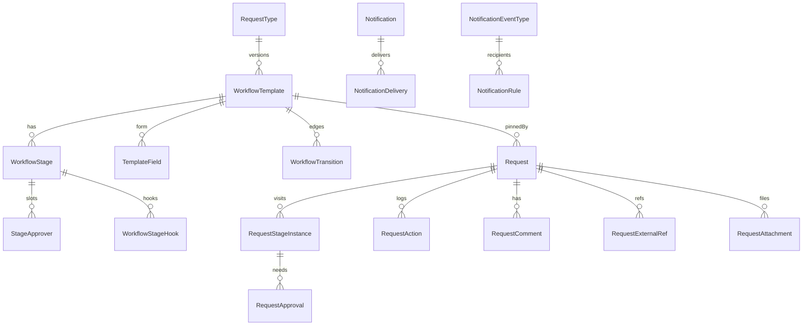
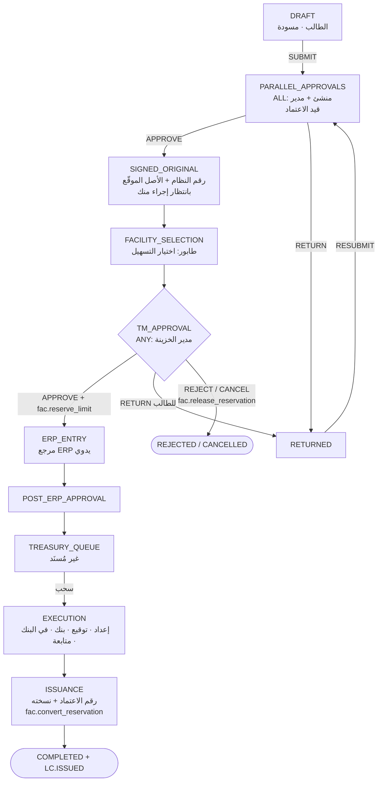
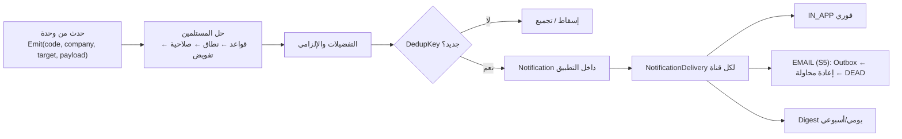
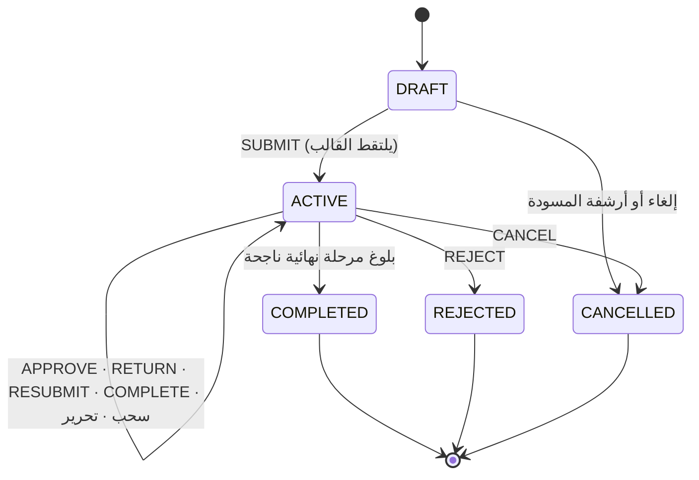

# م6: محرك الطلبات ودورات العمل، الطلبات العامة، الإشعارات (WFL · REQ · NTF)

| البند | القيمة |
|---|---|
| الملف | `10-detailed-analysis/13-m6-workflow-engine-notifications.md` |
| الحالة | مسودة تحليل تفصيلي للمراجعة (جزء من وثيقة التحليل التفصيلية) |
| التاريخ | 2026-10-10 |
| البادئات | `WFL` (محرك دورات العمل) · `REQ` (تعريف أنواع الطلبات والطلبات العامة) · `NTF` (الإشعارات) |
| الشرائح | NTF الأساس داخل التطبيق **S1** (لأن `10` و`11` تصدران تنبيهات منذ S1) · WFL وREQ **S3** (اعتماد المشتريات) · **S4** (قوالب المبيعات) · **S5** (طلبات عامة، بريد، ملخصات، مصمّم أنواع) |
| المصادر | `01` §3 م6 و§4 و§5 وD-6…D-10 وس-13…س-17 وس-21 · `02` §7–§8 وF-11 · `03` §6–§7 · `04` Δ3 وΔ10 · `00` §6 · `10` (FR-PLT-008/022/026/038/042/044 وBR-PLT-013/014) · `11` §9.2 وSVC-01…04 |
| الوسوم | 🟢 ذكره المستخدم أو وردت في الوثائق · 🟡 اقتراح (له افتراض مُعلَن ويُعدَّل) |
| الخصوصية | لا تتضمن الوثيقة أسماء أشخاص ولا أرقام هويات ولا أسماء شركات؛ الأرقام في الأمثلة افتراضية |
| ملاحظة قانونية | المنصة لا تقدّم استشارة قانونية؛ نصوص الاعتمادات وقوالبها تراجعها جهة مختصة (`14`). أرقام مواد UCP 600 مراجع هندسية تُطابَق على النص الرسمي لـ ICC |

---

## 1. الغرض والنطاق (داخل/خارج النطاق)

**الغرض.** م6 هي «نظام تشغيل العمل» في المنصة: تستبدل المتابعة بالبريد بطلبات مُرقَّمة تمر بدورات عمل **مبنية على بيانات** (قوالب افتراضية قابلة للتعديل لاحقًا، قرار س-13 ✅)، وتفصل **الحالة الداخلية للخزينة** عن **المرحلة الظاهرة للجهة الطالبة** (D-6)، وتُسحب فيها الطلبات من **طابور الخزينة** (D-7)، وتستدعي **حجز الحد** من م5 عند اعتماد مدير الخزينة (D-9). وتحمل `REQ` تعريف أنواع الطلبات ونماذجها بحيث تُضاف أنواع جديدة (طلبات عامة) **بلا كود**. وتحمل `NTF` الإشعارات (داخل التطبيق أولًا ثم البريد) وتوصيل كل تنبيهات الوحدات الأخرى.

| داخل النطاق | الشريحة |
|---|---|
| كتالوج الأحداث والإشعار داخل التطبيق وقواعد المستلمين والتفضيلات والقراءة وعدم التكرار وتوصيل تنبيهات `10` و`11` | S1 |
| مزوّدو تنبيهات الانتهاء والاستحقاق من م5 (تسهيل، سريان غير مؤكَّد، أجندة التقارير، وثائق الضمان) | S2 |
| نماذج الدورة: نوع الطلب، القالب بنسخه، المرحلة، الانتقال، الموافقون، الخطافات، الحقول والمرفقات؛ الإسناد والسحب والتحرير؛ الموافقات المتوازية والمتسلسلة؛ الإرجاع والرفض والإلغاء وإعادة التقديم؛ الحالات الفرعية؛ SLA؛ التفويض والتصعيد؛ الترقيم؛ المراجع الخارجية؛ البحث؛ الطلبات الفرعية؛ لوحات الطالب وموظف الخزينة ومدير الخزينة؛ خطاف الحجز | S3 |
| قوالب المبيعات (البروفورما وأوامر البيع ومستندات التحصيل) | S4 |
| الطلبات العامة وأنواع الأمثلة الثمانية (مخطط فقط) ومصمّم الأنواع العامة، البريد والملخصات، تفضيلات المشترك، تقارير الأداء | S5 |

| خارج النطاق | المالك أو الموعد |
|---|---|
| محتوى الاعتمادات وحقولها ونماذج البنك وUCP 600 وبروفورما وأوامر البيع (النموذج `LcTerms` وغيره) | `14` (LCI, LCE, LCT)؛ هنا فقط الهيكل الذي يستضيفها (حقل MODULE_FORM) |
| حساب المتاح من الحد وتخزين الحجز والاستغلال وشروط العملية وحالة التعهدات | `12` (FAC, OBL, CMP)؛ هنا فقط عقد الاستدعاء (§5.4 BR-WFL-016) |
| إطار فحص الانتهاء اليومي وجدولة المهام والتقويم والترقيم والمستندات | `10` (FR-PLT-038/044/035/026/027)؛ هنا ما يخص الإشعار |
| محرر رسومي لدورات العمل (يُسلَّم النموذج والتحقق والـ API الآن) | لاحقًا بعد S5 (س-13) |
| ميزات BPM الكاملة: تفرع متوازٍ غير الموافقات، مؤقتات حدثية، عمليات فرعية، حلقات مفتوحة | خارج النطاق (R2 في `01`) |
| توقيع إلكتروني لرئيس القطاع (الأصل الموقّع مرفق ممسوح الآن) | Could؛ س-15 |
| قنوات SMS وWhatsApp وTeams، واستقبال الردود بالبريد، والإسناد التلقائي بالتوزيع الدوري | لاحقًا (Q-NTF-04) |
| الربط مع ERP أو بوابات البنوك (المراجع الخارجية نصية يدوية، وقناة «ربط مباشر» محجوزة) | لاحقًا (§11) |

## 2. الجهات والصلاحيات (role matrix: role x action)

الرموز: ✔ مسموح · ◐ مقيّد (بجمهور النوع، أو بالمُسنَد إليه، أو بنطاق الشركات، أو بسياسة المشترك) · — غير مسموح. الأدوار كما في `10` و`11`: **PO** مشغّل المنصة · **TA** مدير الحساب · **TM** مدير الخزينة · **FO** مسؤول التسهيلات · **TE** موظف الخزينة · **RQ** الجهة الطالبة (مشتريات/مبيعات/أخرى) · **RM** مدير الطالب أو رئيس إدارته · **AU** مدقق. رئيس القطاع (HS) يوقّع ورقيًا ولا يشترط أن يكون مستخدمًا. الصلاحيات قابلة للتجميع في أدوار مخصصة (FR-PLT-018) ولا يعرّفها المشترك بنفسه (FR-PLT-017).

| # | الإجراء | الصلاحية | PO | TA | TM | FO | TE | RQ | RM | AU |
|---|---|---|---|---|---|---|---|---|---|---|
| 1 | إنشاء طلب وتحرير مسودته (نوع يسمح به جمهوره) | `req.create` | — | — | ◐ | ◐ | ◐ | ✔ | ✔ | — |
| 2 | عرض طلباتي (طالب أو منشئ) ولوحتي | `req.view.own` | — | ✔ | ✔ | ✔ | ✔ | ✔ | ✔ | ✔ |
| 3 | عرض طلبات إدارتي | `req.view.department` | — | — | — | — | — | — | ✔ | — |
| 4 | عرض كل الطلبات ضمن نطاق الشركات | `req.view.all` | — | — | ✔ | ✔ | ✔ | — | — | ✔ |
| 5 | رؤية المرحلة الداخلية والحالات الفرعية والتعليقات والمرفقات الداخلية | `req.view.internal` | — | — | ✔ | ✔ | ✔ | — | — | ✔ |
| 6 | تعليق ظاهر للطالب (ومن الطالب) | `req.comment` | — | — | ✔ | ✔ | ✔ | ✔ | ✔ | — |
| 7 | تعليق داخلي | `req.comment.internal` | — | — | ✔ | ✔ | ✔ | — | — | — |
| 8 | الموافقة أو الإرجاع أو الرفض كمُسنَد إليه بحسب قاعدة المرحلة | `req.approve` | — | — | ✔ | ◐ | ◐ | ◐ | ✔ | — |
| 9 | اعتماد مدير الخزينة في نقطة الحجز | `req.treasury.approve` | — | — | ✔ | — | — | — | — | — |
| 10 | اختيار التسهيل والحد وخط المنتج للطلب | `req.facility.select` | — | — | ✔ | ✔ | — | — | — | — |
| 11 | سحب طلب من الطابور وتحرير ما سحبه | `req.claim` | — | — | ✔ | ✔ | ✔ | — | — | — |
| 12 | تغيير الحالة الفرعية وتسجيل التنفيذ والإصدار (للمُسنَد) | `req.execute` | — | — | ✔ | ✔ | ✔ | — | — | — |
| 13 | إعادة إسناد أو إعادة للطابور (لما سحبه غيره) | `req.reassign` | — | — | ✔ | — | — | — | — | — |
| 14 | إلغاء طلب (الطالب في مراحل محددة؛ الخزينة في أي مرحلة) | `req.cancel` · `req.cancel.any` | — | — | ✔ | — | — | ◐ | — | — |
| 15 | إدخال المراجع الخارجية وتصحيحها | `req.extref.edit` | — | — | ✔ | ✔ | ✔ | ◐ | ◐ | — |
| 16 | إنشاء طلب فرعي تحت كائن (اعتماد صادر مثلًا) | `req.create.child` | — | — | ✔ | ✔ | ✔ | ◐ | — | — |
| 17 | تجاوز الحد عند الحجز (سياسة معطّلة افتراضيًا، BR-WFL-016) | `req.limit.override` | — | — | ◐ | — | — | — | — | — |
| 18 | تفويض مهامي (فترة ونطاق) | `req.delegate.own` | — | — | ✔ | ✔ | ✔ | ✔ | ✔ | — |
| 19 | إدارة تفويضات الآخرين | `req.delegate.manage` | — | ✔ | ◐ | — | — | — | — | — |
| 20 | لوحات المدير: SLA والمتأخرات والأحمال والموافقات المعلقة | `req.dashboard.manager` | — | ◐ | ✔ | — | — | — | — | ✔ |
| 21 | عرض الأنواع والقوالب ونسخها ومقارنتها | `wfl.template.view` | — | ✔ | ✔ | ◐ | — | — | — | ✔ |
| 22 | إنشاء نسخة قالب DRAFT وتعديلها (بعد ظهور المحرر) | `wfl.template.manage` | — | ✔ | — | — | — | — | — | — |
| 23 | نشر نسخة قالب (الناشر غير المحرِّر، Q-WFL-14) | `wfl.template.publish` | — | ✔ | ✔ | — | — | — | — | — |
| 24 | تفعيل الأنواع وتعطيلها وضبط جمهورها وترقيمها | `req.type.manage` | — | ✔ | ◐ | — | — | — | — | — |
| 25 | قواعد الإشعارات وقوالبها وافتراضيات المشترك | `ntf.manage` | — | ✔ | — | — | — | — | — | — |
| 26 | تفضيلاتي وإشعاراتي | `ntf.prefs` | — | ✔ | ✔ | ✔ | ✔ | ✔ | ✔ | ✔ |
| 27 | سجل الإشعارات وإخفاقات التسليم | `ntf.log.view` | — | ✔ | — | — | — | — | — | ✔ |
| 28 | تصدير الخط الزمني وقوائم الطلبات | `req.export` | — | — | ✔ | ✔ | — | — | — | ✔ |

ملاحظات: (أ) الرؤية دائمًا ضمن **نطاق الشركات** (FR-PLT-020) وخارجه 404. (ب) RQ لا يرى بيانات التسهيلات ولا لوحة توفر الحدود ولا اسم الموظف السّاحب (Q-WFL-12) ولا شيئًا داخليًا (BR-WFL-024). (ج) الصلاحية الحساسة `req.limit.override` و`req.treasury.approve` وحذف مرفق بعد اجتياز مرحلته تُدقَّق بشدة عالية. (د) الأدوار التفصيلية للمشتريات والمبيعات (مدقق مبيعات، معتمد مبيعات) أدوار مخصصة تُبذر مع قوالب S4 وتُعدَّل.

## 3. المفاهيم والمسرد

| المصطلح | التعريف في هذه الوثيقة |
|---|---|
| الطلب (Request) | سجل عمل تقدّمه جهة طالبة للخزينة، له رقم ونوع وشركة ومبلغ اختياري، ويمر بمراحل قالب محدد |
| نوع الطلب (RequestType) | تعريف دائم (رمز، جمهور، ترقيم، علم استهلاك الحد)؛ يُسقَط على قالب |
| القالب / نسخة القالب | WorkflowTemplate بمفتاح ثابت ورقم نسخة؛ المنشورة ثابتة لا تتغير، والطلب يحتفظ بالنسخة التي بدأ بها |
| المرحلة (Stage) | محطة في الدورة لها اسم داخلي ومرحلة ظاهرة ومُسنَد وSLA؛ ومثيلها (StageInstance) سجل دخول الطلب إليها |
| المرحلة الظاهرة (ExternalPhase) | الحالة المجمَّعة التي يراها الطالب (مسودة، قيد الاعتماد، معاد للتعديل، بانتظار إجراء منك، تحت الإجراء، مكتمل، مرفوض، ملغى) |
| الحالة الفرعية | حالة داخلية للخزينة ضمن مرحلة (إعداد، توقيع، اتصالات بنكية، في البنك، متابعة)، لا يراها الطالب |
| خانة الموافقة (Slot) | موافقة مطلوبة من جهة محددة (منشئ الطلب، المدير، دور)؛ المرحلة ذات نمط ALL تتطلب كل خاناتها |
| نمط الموافقة | NONE (مهمة) · ANY (أي مؤهل) · ALL (الكل بالتوازي) |
| الطابور والسحب (Claim) | مرحلة بلا مُسنَد تُعرض لمجموعة مؤهلة؛ من يسحب الطلب أولًا يصير المُسنَد (ذرّيًا) |
| المجموعة المؤهلة (Pool) | المستخدمون الذين يملكون الصلاحية ونطاق شركة الطلب |
| الدورة (Cycle) | رقم يزيد عند كل إعادة تقديم بعد إرجاع؛ الموافقات تبدأ من جديد في كل دورة |
| الإرجاع / الرفض / الإلغاء | إرجاع للتعديل (يستمر الطلب) · رفض نهائي · إلغاء نهائي (من الطالب أو الخزينة) |
| الخطاف (Hook) | استدعاء مسجَّل بالكود ينفَّذ عند دخول مرحلة أو خروجها أو إجراء، ويُعرَّف في القالب بمفتاحه ومعاملاته لا بشيفرة |
| نقطة الحجز | المرحلة التي يعتمد فيها مدير الخزينة فيُستدعى `fac.reserve_limit` |
| المُسنَد (Assignee) | المستخدم المسؤول الآن؛ يُحَل من قاعدة المرحلة ثم يُجمَّد ويُسجَّل مصدره |
| SLA وساعات العمل | مهلة المرحلة بساعات عمل حسب تقويم المشترك (أيام العطل من `10`) لا بساعات تقويمية |
| التفويض والتصعيد | نيابة مؤقتة عن مستخدم بنطاق وفترة، وتنبيه/إسناد أعلى عند تجاوز المهلة |
| كائن أب وطلب فرعي | الطلب الفرعي يُنشأ تحت كائن من وحدة أخرى (اعتماد صادر) أو طلب أب: تعديل، طلب وثيقة، سويفت، مخصص |
| المرجع الخارجي | (نظام، نوع، قيمة) نصوص حرة يدخلها المستخدم يدويًا، تصلح للبحث ولا يُتحقق منها (X-DAT-7) |
| الأصل الموقّع | صورة ممسوحة من طلب ورقي وقّعه رئيس القطاع، مرفق إلزامي في مرحلته |
| حدث الإشعار | واقعة بكود (`REQ.RETURNED`) تصدرها وحدة بمعرّفات فقط؛ تُحوَّل بقواعد إلى إشعارات |
| DedupKey | مفتاح يمنع تكرار إشعار لمستلم واحد (حدث + هدف + عتبة + نسخة) |
| الإجراء المطلوب | إشعار يستلزم عملًا من المستلم ويُحَل آليًا حين يُنجَز العمل |
| الملخص (Digest) | رسالة مجمَّعة يومية/أسبوعية بدل الإشعارات الفورية لحدث غير إلزامي |
| لوحة توفر الحدود | عرض لمدير الخزينة والمنفّذ بالمتاح لكل حد مؤهل وتحذيراته، يُجلب من م5 ولا يراه الطالب |

## 4. المتطلبات الوظيفية

الأولوية: Must لازم للشريحة · Should مهم ويمكن تأجيله داخلها · Could تحسين. الأرقام الافتراضية اقتراحات 🟡 تُضبط من إعدادات المشترك (FR-PLT-043).

### 4.1 محرك دورات العمل (WFL)

| المعرّف | المتطلب | الأولوية | الشريحة | المصدر | معيار القبول |
|---|---|---|---|---|---|
| FR-WFL-001 | أنواع الطلبات والقوالب والمراحل والانتقالات والموافقون **بيانات** في القاعدة لا ثوابت في الكود؛ والنواة تفسّرها فقط | Must | S3 | 🟢 | تغيير SlaHours لمرحلة في نسخة قالب جديدة منشورة يسري على الطلبات الجديدة دون نشر كود |
| FR-WFL-002 | بذر القوالب الافتراضية عند التهيئة (FR-PLT-008) بنسخة 1 منشورة وبـ SeedKey: PURCHASE_LC وCHILD_STANDARD وGENERIC_SIMPLE وGENERIC_APPROVAL (S3)؛ PROFORMA_REQUEST وSALES_ORDER_APPROVAL وCOLLECTION_DOCS_REQUEST (S4) | Must | S3/S4 | 🟢 | مشترك جديد يحمل القوالب PUBLISHED وIsCurrent؛ إعادة البذر لا تكرر ولا تستبدل ما عدّله المشترك |
| FR-WFL-003 | خصائص المرحلة: StageKey ثابت عبر النسخ، اسم داخلي Ar/En، المرحلة الظاهرة، قاعدة المُسنَد، نمط الموافقة، SlaHours، علم نهائي، سماح الإلغاء والإرجاع، مجموعة الحالات الفرعية، الحقول القابلة للتحرير | Must | S3 | 🟢 | نشر مرحلة بلا مرحلة ظاهرة أو بلا اسم يُرفض |
| FR-WFL-004 | أنواع المراحل: DRAFT · TASK · APPROVAL · TREASURY_QUEUE · TERMINAL | Must | S3 | 🟡 | مرحلة TREASURY_QUEUE تبدأ بلا مُسنَد وتُظهر «سحب» لأفراد المجموعة المؤهلة فقط |
| FR-WFL-005 | قواعد المُسنَد: ROLE · USER · DEPARTMENT · REQUESTER · REQUESTER_MANAGER · CLAIMER، مع قاعدة بديلة FallbackRule | Must | S3 | 🟢 | مدير الطالب بلا `LineManagerUserId` يُحَل إلى رئيس إدارته ثم الدور البديل، ويُسجَّل مصدر الحل |
| FR-WFL-006 | الانتقالات: Action ∈ {SUBMIT, APPROVE, COMPLETE, RETURN, REJECT, CANCEL, RESUBMIT} من مرحلة إلى أخرى بشرط ConditionJson اختياري وأولوية؛ دورة خطية مع تفرع شرطي بسيط (D-8) | Must | S3 | 🟢 | شرط Amount > 5,000,000 SAR يضيف مرحلة اعتماد لطلب 6,000,000 ولا يضيفها لطلب 4,000,000 |
| FR-WFL-007 | موافقة «الكل» بخانات StageApprover متوازية (منشئ الطلب + المدير)، والتسلسل بمراحل متتالية (إعداد ← تدقيق ← اعتماد) | Must | S3 | 🟢 | بعد خانة واحدة من اثنتين يبقى الطلب في المرحلة؛ بعد الثانية ينتقل في المعاملة نفسها |
| FR-WFL-008 | موافقة «أي واحد»: أول موافقة تكمل المرحلة وتُغلق الخانات الأخرى SUPERSEDED | Must | S3 | 🟢 | موافقان متزامنان: يُقبل الأول ويتلقى الثاني 409 «سبقت معالجة الطلب» |
| FR-WFL-009 | فصل المهام: لا يوافق شخص خانتين في مرحلة واحدة ولا على طلبه (عدا خانة ORIGINATOR المعرَّفة)، ولا يعتمد TM طلبًا أنشأه (يُحوَّل لبديل) | Must | S3 | 🟡 (X-SEC-7) | موافقة الطالب على خانة المدير تُرفض 403 مع حدث مرفوض في التدقيق |
| FR-WFL-010 | الإرجاع بسبب إلزامي إلى مرحلة إرجاع معرَّفة، يُبطل الخانات المعلَّقة (VOIDED) ويحفظ مرحلة الاستئناف | Must | S3 | 🟢 | إرجاع بلا سبب يُرفض؛ بعد الإرجاع لا تبقى خانة PENDING |
| FR-WFL-011 | إعادة التقديم ترفع CycleNo وتُنشئ خانات جديدة وتحفظ لقطة النموذج؛ تنبيه TM عند CycleNo ≥ 3 | Must | S3 | 🟢 | بعد إرجاعين وإعادتي تقديم: CycleNo=3 وثلاث لقطات وتنبيه واحد |
| FR-WFL-012 | الرفض نهائي بسبب؛ الإلغاء من الطالب في مراحل AllowRequesterCancel ومن TM في أي مرحلة غير نهائية؛ كلاهما يشغّل خطاف تحرير الحجز | Must | S3 | 🟢 | إلغاء طلب محجوز يحرر الحجز في معاملة الإلغاء؛ TE لا يملك الإلغاء |
| FR-WFL-013 | السحب من الطابور ذرّي: الأول يفوز ويصير المُسنَد؛ لحاملي `req.claim` ضمن نطاق شركة الطلب | Must | S3 | 🟢 (D-7) | سحبان متزامنان: أحدهما نجاح والآخر 409 «سُحب من زميل» |
| FR-WFL-014 | تحرير الطلب للطابور من المُسنَد، وإعادة الإسناد من TM لأي مؤهل بسبب مسجَّل | Must | S3 | 🟢 | بعد التحرير يظهر في «غير المُسنَد» وقِدَمه لا يُصفَّر |
| FR-WFL-015 | الحالات الفرعية الداخلية ضمن مرحلة بترتيب حر وسجل زمني، دون تغيير المرحلة الظاهرة | Must | S3 | 🟢 (D-6) | تغيير الحالة إلى «في البنك» يسجّل SUBSTATUS_CHANGED ولا يُشعر الطالب |
| FR-WFL-016 | المرحلة الظاهرة: يرى الطالب المرحلة الظاهرة وتعليقاته ومرفقاته الظاهرة فقط، لا الاسم الداخلي ولا الحالة الفرعية ولا التعليقات الداخلية؛ يُفرض في الخادم | Must | S3 | 🟢 (D-6) | استدعاء API الطالب لا يعيد الحقول الداخلية حتى لو طُلبت صراحة |
| FR-WFL-017 | SLA لكل مرحلة بساعات عمل (تقويم `10`) ومهلة سحب للطابور، وحالات ON_TRACK/AT_RISK/OVERDUE/PAUSED | Must | S3 | 🟡 | الحساب كما في BR-WFL-012 (مثال الخميس 15:00 ← الأحد 14:00) |
| FR-WFL-018 | مهمة JOB-WFL-SLA كل 5 دقائق تحدّث الحالات وتصدر AT_RISK وBREACHED مرة لكل (مثيل مرحلة، عتبة) | Must | S3 | 🟡 | تشغيلان متتاليان لا يكرران الإشعار |
| FR-WFL-019 | التصعيد: عند OVERDUE يُشعَر المُصعَّد إليه (TM افتراضيًا) ثم تذكير يومي؛ إعادة الإسناد التلقائي خيار معطّل افتراضيًا | Should | S3 | 🟡 (س-14) | طلب متأخر يظهر في لوحة المدير بعلامة ويصل إشعار واحد يوميًا |
| FR-WFL-020 | التفويض (UserDelegation): من/إلى بفترة ونطاق (الكل/الموافقات/نوع طلب)؛ يرى المفوَّض مهام المفوِّض وتُسجَّل «نيابةً عن»؛ بلا تفويض متسلسل | Should | S3 | 🟡 (س-14) | موافقة المفوَّض تُسجَّل ActedBy=المفوَّض وOnBehalfOf=المفوِّض؛ بعد EndsOn تختفي المهام |
| FR-WFL-021 | الخطافات: إجراءات مسجَّلة بالكود فقط (`fac.*`، `lc.*`، `req.*`، `ntf.*`) على ON_ENTER/ON_EXIT/ON_ACTION، بوضع SYNC_TX أو AFTER_COMMIT، وسياسة فشل BLOCK/WARN، ومفتاح عدم تكرار | Must | S3 | 🟡 | نشر قالب بخطاف غير مسجَّل يُرفض؛ تكرار الاستدعاء بالمفتاح نفسه يعيد النتيجة المخزَّنة |
| FR-WFL-022 | خطاف الحجز: في مرحلة IsReservationPoint يُستدعى `fac.reserve_limit` مع الموافقة في معاملة واحدة، ويفشل الاعتماد إن رُفض الحجز (BR-WFL-016) | Must | S3 | 🟢 (D-9) | الاعتماد والحجز يتمّان معًا أو لا يتمّ أيٌّ منهما |
| FR-WFL-023 | تحرير الحجز عند الرفض/الإلغاء، وتحويله إلى قائم عند الإصدار، وتعديله بفرق المبلغ عند تعديل معتمد (`fac.release/convert/adjust_reservation`) | Must | S3 | 🟢 (تحرير/تحويل) · 🟡 (تعديل) | مثال AC-3 |
| FR-WFL-024 | شروط مغادرة المرحلة: حقول إلزامية، مرفقات (TemplateAttachmentRule)، مراجع خارجية، تعليق إلزامي، موافقات مكتملة، خطافات سابقة ناجحة | Must | S3 | 🟢 | مغادرة مرحلة الأصل الموقّع بلا مرفق تُرفض برسالة تسمّي البند الناقص |
| FR-WFL-025 | الأصل الموقّع: مرفق ممسوح من نوع SIGNED_REQUEST_ORIGINAL إلزامي قبل مغادرة مرحلته، ولا يُحذف بعد اجتيازها (يُستبدل بإصدار جديد بسبب) | Must | S3 | 🟢 (01 §4.1) | حذف الأصل بعد اجتياز المرحلة مرفوض؛ الاستبدال ينشئ إصدارًا ويُدقَّق |
| FR-WFL-026 | ترقيم الطلب: يخصَّص الرقم عند دخول المرحلة NumberOnStageKey بتسلسل لكل نوع وسنة بلا فجوات (NumberSequence)؛ قبله رقم مسودة محلي لا يستهلك التسلسل | Must | S3 | 🟢 | بعد موافقتي المرحلة 2: `LCP-26-0001`؛ طلب رُفض قبلها لا يستهلك رقمًا |
| FR-WFL-027 | قناة التنفيذ ExecutionChannel (بوابة البنك/نموذج يدوي/ربط مباشر مستقبلًا) تُقترح من SVC-02 ويعدّلها المنفّذ قبل إكمال التنفيذ | Must | S3 | 🟢 (02 §8) | إكمال التنفيذ بلا قناة مرفوض؛ القناة المقترحة تطابق الإعداد في العلاقة |
| FR-WFL-028 | إصدارات القوالب: المنشورة ثابتة؛ التعديل نسخة DRAFT جديدة؛ نشرها يجعلها الحالية وتصير السابقة RETIRED؛ الطلب يبقى على نسخته | Must | S3 | 🟢 | AC-6 |
| FR-WFL-029 | تحقق النشر: بداية واحدة؛ نهاية ناجحة واحدة على الأقل؛ لا مراحل يتيمة؛ مخرج لكل مرحلة غير نهائية؛ خانة لكل APPROVAL؛ خطافات وأدوار موجودة؛ وللأنواع المستهلكة للحد: حجز قبل الإصدار وتحرير عند الرفض/الإلغاء | Must | S3 | 🟡 | قالب لنوع يستهلك حدًّا بلا خطاف تحرير يُرفض نشره |
| FR-WFL-030 | حماية البذور: تعديل المشترك لقالب مبذور ينشئ نسخة مملوكة له (IsTenantModified)؛ تحديث المنصة يصله نسخة مقترحة بمقارنة ولا يستبدل | Should | S5 | 🟡 | ترقية بذرة لا تغيّر نسخة معدَّلة؛ تظهر مقارنة الفروق |
| FR-WFL-031 | محرر القوالب الرسومي خارج S3–S5؛ يُسلَّم الآن النموذج والتحقق وAPI القراءة؛ وتصدير/استيراد JSON للقالب | Could | S5/لاحقًا | 🟢 (س-13) | قالب مُصدَّر يُستورد في مشترك آخر نسخة DRAFT تجتاز التحقق |
| FR-WFL-032 | نقل طلب جارٍ إلى نسخة أحدث بشرط وجود مفاتيح مراحله الحالية، بصلاحية وسبب | Could | S5 | 🟡 | نقل طلب في مرحلة محذوفة من النسخة الجديدة مرفوض |
| FR-WFL-033 | سجل الإجراءات RequestAction للإضافة فقط يغطي كل حدث (§6) بالفاعل والنيابة والمرحلة والدورة والتوقيت | Must | S3 | 🟢 | لا يملك حساب التطبيق UPDATE/DELETE على الجدول |
| FR-WFL-034 | كل إجراء ينتج أيضًا حدث AuditLog (FR-PLT-022)؛ شدة عالية: إلغاء من TM، تجاوز حد، إعادة إسناد، نشر قالب، تفويض | Must | S3 | 🟢 | عدد أحداث الإلغاء في التدقيق = عدد إجراءات CANCELLED |
| FR-WFL-035 | التزامن والتكرار: كل إجراء يحمل RowVersion وIdempotency-Key؛ التعارض 409 مع الحالة الحالية | Must | S3 | 🟡 | إعادة إرسال الإجراء بالمفتاح نفسه لا تنتج موافقة ثانية |
| FR-WFL-036 | صندوق المهام الموحّد (استعلام): موافقات لي، مُسندة لي، بانتظار إجراء مني كطالب، طابور أستطيع سحبه، بعدّادات | Must | S3 | 🟡 | تظهر مهام المفوِّض للمفوَّض في فترة التفويض فقط |
| FR-WFL-037 | معاينة قالب DRAFT (Dry-run) على بيانات تجريبية دون آثار جانبية | Could | S5 | 🟡 | المعاينة لا تستهلك رقمًا ولا حجزًا ولا إشعارًا |
| FR-WFL-038 | كل انتقال يكتب في Outbox حدثًا (`request.stage_changed` وغيره) في معاملته، حمولته معرّفات فقط (FR-PLT-042) | Should | S3 | 🟢 (D-10) | فشل المعاملة لا يترك حدثًا في الطابور |
| FR-WFL-039 | تعطيل مستخدم أو تغيير مديره يعيد حل الإسنادات المفتوحة ويُشعر TM بما أُعيد | Must | S3 | 🟡 | موافق عُطّل حسابه: خانته تنتقل للبديل خلال دقيقة مع سجل SYSTEM |
| FR-WFL-040 | لا حذف فعلي لطلب قُدِّم؛ المسودات غير المقدَّمة تُؤرشف؛ المنتهية تبقى قابلة للبحث والتصدير | Must | S3 | 🟢 (X-DAT-5) | لا توجد عملية DELETE للطلب المقدَّم في API |

### 4.2 تعريف الطلبات والطلبات العامة (REQ)

| المعرّف | المتطلب | الأولوية | الشريحة | المصدر | معيار القبول |
|---|---|---|---|---|---|
| FR-REQ-001 | تعريف نوع الطلب: رمز، اسم Ar/En، فئة، ParentEntityType، مفتاح القالب الافتراضي، مفتاح الترقيم، علم «يستهلك حدًّا» ووضع فحصه، مفتاحا حقلي المبلغ والمنتج، تفعيل | Must | S3 | 🟢 | لا يُفعَّل نوع بلا قالب منشور؛ رمز مكرر في المشترك يُرفض |
| FR-REQ-002 | تعريف الحقول (TemplateField) على نسخة القالب: مفتاح، تسمية Ar/En، قسم، ترتيب، نوع، إلزام، إظهار/تحرير بالمراحل، حساسية، دور فهرسة | Must | S3 | 🟢 | تعريف 12 حقلًا في 3 أقسام يولّد نموذجًا كاملًا دون كود واجهة جديد |
| FR-REQ-003 | أنواع الحقول: TEXT · LONGTEXT · INTEGER · DECIMAL · AMOUNT (قيمة+عملة) · PERCENT · DATE (ميلادي + هجري اختياري) · BOOLEAN · LIST · MULTILIST · CATALOG_REF · USER_REF · EXTERNAL_REF · FILE_SLOT · TABLE (صفوف بحقول فرعية) · MODULE_FORM (مكوّن تسجله وحدة، مثل نموذج شروط الاعتماد) · LIMIT_SELECTION (مكوّن م5) | Must | S3 (TABLE: S4) | 🟢 | حقل AMOUNT بلا عملة يُرفض؛ MODULE_FORM يحفظ معرّف الكيان المرتبط لا نسخة منه |
| FR-REQ-004 | الحقول الشرطية: VisibleWhen وRequiredWhen بتعبير JSON مقيَّد (eq, ne, in, gt, gte, lt, lte, empty + all/any/not) بلا شيفرة | Must | S3 | 🟡 | «مدة التأجيل» تظهر وتلزم فقط حين نوع الدفع = آجل |
| FR-REQ-005 | التحقق: طول، نطاق رقمي، نمط آمن، تاريخ نسبي، مقارنة حقلين، قائمة مسموحة؛ رسالة Ar/En؛ يُنفَّذ في الخادم دائمًا | Must | S3 | 🟡 | تاريخ انتهاء قبل آخر شحن يُرفض بمقارنة حقلين معرَّفة |
| FR-REQ-006 | قواعد المرفقات (TemplateAttachmentRule): نوع المستند، حد أدنى وأعلى، المرحلة المطلوبة قبل مغادرتها، شرط، رؤية للطالب | Must | S3 | 🟢 | قاعدة «نسخة اعتماد صادرة ≥ 1» تمنع إتمام مرحلة الإصدار |
| FR-REQ-007 | جمهور النوع (RequestTypeAudience): أدوار/إدارات/مستخدمون، والشركة من نطاق الطالب؛ غياب الصفوف يعني لا أحد (فشل مغلق) | Must | S3 | 🟢 | مستخدم خارج الجمهور لا يرى النوع في «طلب جديد» ويتلقى 403 مباشرة |
| FR-REQ-008 | المسودة: حفظ تلقائي كل 30 ثانية، إعادة فتح، وتعديلها لمنشئها وللطالب فقط؛ التقديم يشغّل كل التحققات | Must | S3 | 🟡 | إغلاق المتصفح أثناء الكتابة لا يفقد أكثر من 30 ثانية |
| FR-REQ-009 | حقول الفهرسة: Title وAmount وCurrency وCounterpartyName/Code وProduct وRequiredByDate تُنسخ من النموذج إلى أعمدة الطلب بحسب IndexRole للبحث والتقارير | Must | S3 | 🟢 | تغيير المبلغ في النموذج يحدّث عمود Amount في الحفظ نفسه |
| FR-REQ-010 | المراجع الخارجية RequestExternalRef: عدة لكل طلب، نظام ونوع وقيمة نصية حرة، تعديل بالإحلال (يبقى التاريخ)، بلا تحقق خارجي، مع تحذير تكرار على طلب نشط آخر | Must | S3 | 🟢 (D-10) | إدخال مرجع ERP يمكّن البحث به؛ تكراره على طلب آخر تحذير لا منع |
| FR-REQ-011 | البحث الموحّد: رقم الطلب، رقم الاعتماد (مزوّد `14`)، المراجع الخارجية، اسم/رمز العميل أو المورّد، العنوان، المبلغ، الشركة، الحالة؛ بتطبيع عربي وضمن النطاق | Must | S3 | 🟢 | AC-7؛ زمن الاستجابة < 2 ثانية بـ 100 ألف طلب |
| FR-REQ-012 | الطلبات الفرعية: أنواع فرعية (تعديل، طلب وثيقة، سويفت، مخصص) تُنشأ من صفحة الكائن الأب فقط عبر مزوّد الأب، وترث الشركة، وتُعرض في تبويب الأب | Must | S3 | 🟢 | لا يظهر «طلب تعديل» إلا على اعتماد حالته تسمح به مزوّد `14` |
| FR-REQ-013 | خطاف فحص الحد: للأنواع المستهلكة للحد تُعرض **لوحة توفر الحدود** (من م5) لمدير الخزينة والمنفّذ لا للطالب، وتُسجَّل نتيجتها لحظة الاعتماد | Must | S3 | 🟡 | اللوحة تعرض المتاح بالصيغة في BR-REQ-009 وتتجدد عند تغيير الاختيار |
| FR-REQ-014 | تحذيرات شروط العملية (أقصى مدة، تأجيل، غطاء نقدي، نسبة تمويل، مهلة إخطار) من م5 تُعرض **تحذيرًا لا منعًا** ويُسجَّل إقرار الموافق | Must | S3 | 🟢 (Δ3؛ س-2 معلّق) | مدة 200 يوم على خط حده 180: تحذير ظاهر وإقرار مسجَّل في الموافقة |
| FR-REQ-015 | الأولوية (عادي/عاجل بسبب) وتاريخ الاحتياج، ويحددان ترتيب الطابور (BR-REQ-011) | Should | S3 | 🟡 | عاجل يسبق العادي الأقدم في «غير المُسنَد» |
| FR-REQ-016 | قواعد الرؤية: الطالب والمنشئ، إدارة الطالب، الخزينة ضمن النطاق، المدقق؛ وإسقاط الحقول الداخلية في طبقة البيانات (BR-REQ-013) | Must | S3 | 🟡 | RQ لا يعيد له API أي حقل داخلي |
| FR-REQ-017 | التعليقات RequestComment: داخلي أو ظاهر للطالب، نص صِرف، غير قابلة للتعديل (سحب مع بقاء الأصل في التدقيق) | Must | S3 | 🟢 | تعليق داخلي لا يظهر للطالب في أي استجابة ولا في أي إشعار |
| FR-REQ-018 | لوحة الطالب «طلباتي»: ما قدّمتُه ومرحلته الظاهرة، ما ينتظر إجراءً مني، المرتجع، والمنتهي حديثًا | Must | S3 | 🟢 | تعرض المرحلة الظاهرة فقط وتاريخ آخر تغيير |
| FR-REQ-019 | لوحة موظف الخزينة: مهامي حسب الحالة الفرعية، غير المُسنَد (قابل للسحب)، المتأخر، بانتظار البنك | Must | S3 | 🟢 | تطابق العدّادات قوائمها؛ الترتيب وفق BR-REQ-011 |
| FR-REQ-020 | لوحة مدير الخزينة: موافقات تنتظرني مع لوحة توفر الحدود، خروقات SLA، قِدَم الطابور، حمل كل موظف، حجوزات قديمة | Must | S3 (اللوحة تتطلب S2) | 🟢 | الموافقة المعلقة تعرض المتاح والتحذيرات دون فتح الطلب |
| FR-REQ-021 | إضافة نوع جديد **بلا كود**: تعريف النوع ← قالب (نسخة من GENERIC_*) ← حقول ← جمهور ← موافقون ← مرفقات ← معاينة ← نشر ← تفعيل (§7.2 F5)؛ في S3–S4 عبر بذور/API وفي S5 عبر الشاشة | Must | S3 (API) | 🟢 | نوع تجريبي جديد يمر من التقديم إلى الإتمام دون نشر كود |
| FR-REQ-022 | بذور 8 أنواع أمثلة **للتفصيل لاحقًا** (§6.5): طلب تعديل، طلب وثيقة، طلب سويفت، طلب ضمان بنكي، طلب صرف أجنبي، اعتماد دفع/تحويل، طلب خطاب/شهادة بنكية، طلب سحب تمويل؛ غير مفعّلة حتى تُستكمل | Should | S5 | 🟡 | الأنواع الثمانية موجودة معطّلة، وتفعيل نوع بلا حقول معرَّفة مرفوض |
| FR-REQ-023 | مصمّم الأنواع العامة (واجهة) على قوالب GENERIC_*: حقول وجمهور وموافقون ومرفقات دون محرر مراحل كامل | Should | S5 | 🟡 | TA يُنشئ نوعًا من 5 حقول وموافقة المدير في أقل من 10 دقائق |
| FR-REQ-024 | الحقول المقيّدة (IBAN، أرقام الهوية) في النماذج: تشفير وتقنيع وكشف بصلاحية الكشف المناسبة وتدقيق (FR-PLT-037) | Should | S3 | 🟡 | حقل IBAN في نوع الدفع يظهر مقنَّعًا لغير حاملي `acc.reveal` |
| FR-REQ-025 | نسخ طلب سابق مسودة جديدة (حقول لا مرفقات ولا مراجع) | Could | S5 | 🟡 | النسخة بلا رقم ولا مراجع ولا مرفقات |
| FR-REQ-026 | تصدير الخط الزمني للطلب (PDF) وقوائم الطلبات (Excel) ضمن النطاق، مع تدقيق وعلامة مائية | Should | S5 | 🟡 | التصدير بلا `req.export` مرفوض؛ كل تصدير مدقَّق |

### 4.3 الإشعارات (NTF)

| المعرّف | المتطلب | الأولوية | الشريحة | المصدر | معيار القبول |
|---|---|---|---|---|---|
| FR-NTF-001 | كتالوج الأحداث NotificationEventType مبذور: رمز، مالك، مجموعة، شدة، إلزامي، قنوات افتراضية، حقول الحمولة المسموحة، نافذة منع التكرار | Must | S1 | 🟢 | كل حدث في §9.2 موجود بالرمز نفسه؛ حدث غير معرَّف يُرفض عند الإصدار |
| FR-NTF-002 | واجهة إصدار موحّدة `Emit(eventCode, companyId, target, payload, dedupKey)` تستدعيها كل الوحدات؛ الحمولة معرّفات وقيم غير مقيّدة | Must | S1 | 🟢 | محاولة تمرير رقم هوية في الحمولة تُرفض وتُسجَّل |
| FR-NTF-003 | قواعد المستلمين NotificationRule: دور، صلاحية، مستخدم، الطالب، مدير الطالب، المُسنَد، موافقو المرحلة، رئيس الإدارة، مع شرط ونطاق شركة وإلزام | Must | S1 | 🟢 | تعديل مستلمي حدث بقاعدة جديدة يسري على الأحداث التالية فقط |
| FR-NTF-004 | خوارزمية الحل (BR-NTF-001): مرشحون ← نشطون ← نطاق الشركة ← صلاحية عرض الهدف ← استبعاد الفاعل ← التفويض ← التفضيلات ← إزالة التكرار | Must | S1 | 🟢 | مستخدم نطاقه شركة (س) لا يصله تنبيه تسهيل شركة (ص) |
| FR-NTF-005 | الإشعار داخل التطبيق: جرس وعدّاد غير المقروء وصفحة بتصفية، وروابط عميقة إلى الهدف (تتحقق من الصلاحية عند الفتح) | Must | S1 | 🟢 | الضغط على إشعار طلب خارج نطاق المستخدم يعطي 404 لا تسريب |
| FR-NTF-006 | حالة القراءة: مقروء عند فتح الهدف، «تعليم الكل»، أرشفة، وعدّاد منفصل لـ «يلزم إجراء» | Must | S1 | 🟢 | فتح الطلب يقلل عدّاد غير المقروء بمقدار الإشعارات المرتبطة به |
| FR-NTF-007 | إشعارات «الإجراء المطلوب» تُحَل آليًا (RESOLVED) عند إنجاز المهمة ولو من مستخدم آخر أو مفوَّض، وتُستثنى من عدّاد «يلزم إجراء» | Must | S3 | 🟡 | موافقة أحد مؤهلي مرحلة ANY تُحل إشعارات بقية المؤهلين |
| FR-NTF-008 | منع التكرار بـ DedupKey ونافذة؛ تنبيهات العتبات مرة لكل (عنصر، عتبة، نسخة) كما في BR-PLT-013 | Must | S1 | 🟢 | AC-8 |
| FR-NTF-009 | تجميع الأحداث المتقاربة لهدف واحد في نافذة 15 دقيقة (STAGE_CHANGED وQUEUED) في إشعار واحد بعدّاد | Should | S3 | 🟡 | ثلاثة طلبات تدخل الطابور خلال 10 دقائق ترسل إشعارًا واحدًا «3 طلبات» |
| FR-NTF-010 | التفضيلات لكل مستخدم ولكل مجموعة أحداث وقناة: فوري/ملخص يومي/إيقاف؛ الإلزامي لا يُوقَف في التطبيق | Must | S1 (التطبيق) · S5 (البريد) | 🟢 | إيقاف مجموعة «التعليقات» لا يمس `REQ.APPROVAL_NEEDED` |
| FR-NTF-011 | افتراضيات المشترك للتفضيلات وقواعد المستلمين وتجاوز القوالب بيد TA ضمن حدود الإلزامي | Should | S5 | 🟡 | لا يستطيع TA إزالة مستلم حدث أمني إلزامي |
| FR-NTF-012 | قوالب الرسائل NotificationTemplate لكل (حدث، قناة، لغة) بعناصر نائبة مسموحة فقط؛ بذور Ar/En | Must | S1 | 🟢 | قالب بعنصر نائب غير مسموح (`{IdNumber}`) يُرفض حفظه |
| FR-NTF-013 | قناة البريد عبر Outbox: HTML ونص، رابط عميق يتطلب دخولًا، بلا بيانات مقيّدة، إعادة محاولة، معالجة الارتداد | Must | S5 | 🟢 | البريد لا يحوي رقم هوية ولا رقم حساب ولا رمز دخول في الرابط |
| FR-NTF-014 | الملخصات اليومية والأسبوعية (Digest) للأحداث غير الإلزامية بحسب التفضيل؛ لا يُرسَل ملخص فارغ | Should | S5 | 🟡 | ملخص 07:30 يضم ما لم يُحل ولم يُقرأ فقط |
| FR-NTF-015 | تذكير «الإجراء المطلوب» المتأخر: بعد 24 ثم 48 ثم 72 ساعة عمل كحد أقصى 3 | Should | S3 | 🟡 | يتوقف التذكير فور الحل أو القراءة مع الإنجاز |
| FR-NTF-016 | المهام الخلفية (§9.3) لكل مشترك بتوقيته، متكررة الأمان، تعوّض التوقف، وتسجَّل نتائجها (FR-PLT-044) | Must | S1/S3 | 🟡 | إيقاف المهمة 3 أيام ثم تشغيلها لا يرسل 3 نسخ من التنبيه نفسه |
| FR-NTF-017 | مزوّدو الانتهاء: واجهة `IExpiryProvider` تسجلها `12` و`14` (سريان التسهيل، سريان غير مؤكَّد، أجندة التقارير، سند لأمر، وثيقة تأمين، تقييم عقاري، صلاحية الاعتماد وآخر شحن) تغذي إطار FR-PLT-038 بعتبات قابلة للتعديل | Must | S2 | 🟢 (Δ10) | إضافة عتبة 45 يومًا لتسهيل تظهر في التشغيل التالي دون كود |
| FR-NTF-018 | الأحداث الأمنية والتشغيلية من `10` (§9.3 فيه) تُسلَّم فورًا وإلزاميًا إلى مستلميها | Must | S1 | 🟢 | قفل ثالث خلال 24 ساعة يصل مدير الحساب خلال دقيقة |
| FR-NTF-019 | سجل التسليم NotificationDelivery بحالاته وإعادة المحاولة بتراجع زمني وصندوق رسائل ميتة؛ وشاشة إخفاقات | Must | S1 (التطبيق) · S5 (البريد) | 🟡 | بعد 5 إخفاقات: DEAD وإشعار TA مرة واحدة |
| FR-NTF-020 | الاحتفاظ: أرشفة المقروء بعد 180 يومًا؛ لا حذف لما ارتبط بحدث تدقيق (FR-PLT-040) | Should | S5 | 🟡 | الأرشفة تخفي من القوائم وتبقى في سجل الإشعارات |
| FR-NTF-021 | حماية المحتوى: العنوان والنص من قالب بعناصر مسموحة؛ لا هويات ولا أرقام حسابات ولا مبالغ مقيّدة في الإشعار أو الحمولة | Must | S1 | 🟢 (X-SEC-3) | اختبار آلي يمسح كل قوالب البذور بحثًا عن عناصر محظورة |
| FR-NTF-022 | محوّلات القنوات: واجهة `INotificationChannel`؛ IN_APP وEMAIL الآن، وغيرها لاحقًا دون تعديل النواة | Must | S1 | 🟢 (D-10) | إضافة محوّل تجريبي لا تتطلب تعديل خدمة الإصدار |
| FR-NTF-023 | إشعارات الطالب عند تغيّر **المرحلة الظاهرة** فقط، لا عند كل مرحلة داخلية ولا حالة فرعية | Must | S3 | 🟢 (D-6) | الانتقال من اختيار التسهيل إلى اعتماد المدير لا يُشعر الطالب |
| FR-NTF-024 | لغة الإشعار = لغة المستلم المفضلة (الافتراضي العربية) مع رجوع للعربية عند غياب القالب | Should | S1 | 🟡 | مستخدم لغته en يتلقى القالب الإنجليزي |
| FR-NTF-025 | معاينة القالب وإرسال تجريبي لـ TA | Could | S5 | 🟡 | الإرسال التجريبي لا يُحتسب في تقارير الأحداث |

## 5. قواعد العمل

### 5.1 محرك دورات العمل (WFL)

| المعرّف | القاعدة | مثال |
|---|---|---|
| BR-WFL-001 | اختيار الانتقال: لكل (مرحلة، إجراء) تُقيَّم الانتقالات بترتيب Priority تصاعديًا ويُنفَّذ أول ما تحقق شرطه (الفارغ = دائمًا)؛ لا مطابق = الإجراء غير مسموح (422 بسببه). شرط المبلغ يحمل عملته؛ إن اختلفت عملة الطلب عنها فهو «غير قابل للمقارنة» فيُختار المسار الأشد (الذي يضيف موافقة) ويُسجَّل NOT_COMPARABLE | `Amount > 5,000,000 SAR`: طلب 6,000,000 SAR يضيف مرحلة اعتماد؛ طلب 1,000,000 USD يسلك المسار الأشد مع السجل |
| BR-WFL-002 | دخول المرحلة معاملة واحدة: إنشاء مثيل المرحلة ← حل المُسنَدين وإنشاء الخانات ← ضبط المرحلة الظاهرة والحالة الفرعية الافتراضية ← حساب DueAt ← خطافات ON_ENTER المتزامنة ← RequestAction وAuditLog وOutbox؛ ثم أحداث الإشعار بعد الإتمام | دخول TM_APPROVAL ينشئ خانة واحدة للدور TM بنمط ANY ويحسب DueAt |
| BR-WFL-003 | إكمال الموافقة: ALL تكتمل حين تكون كل الخانات APPROVED في الدورة الحالية؛ ANY بخانة واحدة؛ أي RETURN أو REJECT من خانة فعّالة ينهي المرحلة فورًا مهما كان النمط ويُبطل المتبقي. تُسجَّل الموافقة ببصمة SnapshotHash لما رآه الموافق، ولا تُعدَّل الحقول المعتمدة بعدها إلا بإرجاع | موافقة المدير ثم إرجاع من TM: تُبطَل موافقة المدير وتبدأ الدورة التالية بخانات جديدة |
| BR-WFL-004 | خانة ORIGINATOR: إن كان مقدِّم الطلب هو الطالب وAutoCompleteBySubmitter=true اكتملت عند التقديم (المصدر SUBMISSION)؛ وإن قدّمه نيابةً عنه موظف آخر بقيت PENDING للطالب (Q-WFL-03) | سكرتير يقدّم طلب مدير مشتريات: خانة المنشئ تنتظر المدير |
| BR-WFL-005 | حل المُسنَد: REQUESTER_MANAGER = `AppUser.LineManagerUserId` الفعّال ← `Department.HeadUserId` (إن لم يكن الطالب) ← FallbackRole ← TM. ROLE/DEPARTMENT تعطي **مجموعة مؤهلة** ضمن نطاق شركة الطلب لا شخصًا. يُجمَّد المُسنَد عند الدخول ويُعاد حله عند تعطيله أو تغيير مديره (FR-WFL-039) ويُسجَّل المصدر | الطالب بلا مدير مباشر ورئيس إدارته هو نفسه: يُحَل إلى FallbackRole ثم TM |
| BR-WFL-006 | فصل المهام: (أ) لا يشغل مستخدم خانتين في مرحلة واحدة، والثانية تنتقل لبديلها (ب) لا موافقة على طلب أنشأه الموافق عدا ORIGINATOR (ج) TM منشئ الطلب يُحوَّل اعتماده إلى TM آخر أو TA، وإن لم يوجد يُمنع الاعتماد برسالة | طلب صرف أنشأه TM: لا يعتمده هو ويظهر لـ TA |
| BR-WFL-007 | السحب: تحديث شرطي `AssigneeUserId IS NULL AND RowVersion = @v` والفائز يُسجَّل ClaimedAt. الحد الأقصى للمسحوب المفتوح لكل موظف إعداد (الافتراضي بلا حد). التحرير يفرّغ المُسنَد ويزيد ReleaseCount دون تصفير QueueEnteredAt (قِدَم الطابور تراكمي) | موظفان يضغطان «سحب» في الملّي ثانية نفسها: واحد ينجح والآخر 409 |
| BR-WFL-008 | الإرجاع يتطلب سببًا (ظاهر للطالب افتراضيًا + ملاحظة داخلية اختيارية) وهدفًا من انتقالات RETURN المعرّفة للمرحلة في القالب، ويُبطل الخانات PENDING ويحفظ ResumeStage. إعادة التقديم تعيد الطلب إلى ResumeStage (يحدده الانتقال؛ في PURCHASE_LC بعد إرجاع للطالب: PARALLEL_APPROVALS) بـ CycleNo+1 وخانات جديدة، ولا تبقى الموافقات السابقة (`ResetApprovalsOnResubmit`=true)؛ ويُطلب إصدار مرفق جديد للمرفقات الإلزامية في المراحل المعادة (الأصل الموقّع القديم يبقى إصدارًا سابقًا)؛ ولا يُعاد ترقيم الطلب | إرجاع من اعتماد TM إلى اختيار التسهيل (داخلي) لا يمر بالطالب ولا يزيد CycleNo؛ وإعادة التقديم بعد إرجاع للطالب تزيده |
| BR-WFL-009 | الإلغاء والرفض: الطالب يلغي ما دامت المرحلة AllowRequesterCancel (الافتراضي: حتى خروج الطلب من الطابور، أي قبل بدء التنفيذ لدى الخزينة؛ وبعده يطلب من TM)؛ TM يلغي في أي مرحلة غير نهائية. بعد الإصدار (تحويل الحجز) لا إلغاء من هنا بل بطلب فرعي على الاعتماد (`14`). الرفض والإلغاء ينهيان الطلب ويحرّران الحجز ويُغلقان الخانات المفتوحة VOIDED | إلغاء الطالب في ERP_ENTRY بعد الحجز يحرر الحجز |
| BR-WFL-010 | الحالات الفرعية: SubStatusSet للمرحلة (الافتراضي للتنفيذ: PREPARATION · SIGNING · BANK_COMMUNICATION · AT_BANK · FOLLOW_UP 🟢)، يغيّرها المُسنَد بأي ترتيب، وكل تغيير يسجّل مدة السابقة. خاصية PausesSla لكل حالة (الافتراضي AT_BANK فقط 🟡، Q-WFL-06) | الانتقال إلى AT_BANK يوقف عدّ SLA حتى مغادرتها |
| BR-WFL-011 | المرحلة الظاهرة = ExternalPhase للمرحلة الحالية؛ DRAFT في الدورة 1 «مسودة» وبعد إرجاع «معاد للتعديل». يرى الطالب فقط: المرحلة الظاهرة وتاريخ دخولها و«بانتظار» على مستوى الجهة (الخزينة/مديرك) لا الشخص (Q-WFL-12) والسبب الظاهر عند الإرجاع والرفض | في اختيار التسهيل واعتماد TM والتنفيذ والإصدار يرى الطالب «تحت الإجراء» |
| BR-WFL-012 | حساب SLA: W=[WorkStart, WorkEnd] في أيام العمل (BR-PLT-014)، الافتراضي 08:00–17:00 توقيت المشترك (9 ساعات/يوم). DueAt = AddBusinessHours(EnteredAt, SlaHours) مع استبعاد فترات الإيقاف. ON_TRACK حتى 80% من SlaHours، AT_RISK من 80% حتى DueAt، OVERDUE بعده. SlaMode=CALENDAR يتجاهل W. مهلة السحب ClaimSlaHours تُحسب بالطريقة نفسها من QueueEnteredAt | الدخول الخميس 2026-10-08 15:00 وSlaHours=8 وعطلة الجمعة والسبت: ساعتان الخميس (15–17) + 6 ساعات الأحد 08:00 ← DueAt=الأحد 2026-10-11 14:00؛ AT_RISK عند 6.4 ساعة = الأحد 12:24 |
| BR-WFL-013 | الترقيم: SequenceKey=`req:<TypeCode>`، النمط الافتراضي `{prefix}-{yy}-{seq:0000}` (LCP · PFR · SOA · CDR · AMD · DOC · SWF · BGR · FXR · PAY · GEN 🟡)، الفترة سنة ميلادية بتوقيت المشترك، GAP_FREE (Q-PLT-08)؛ يُخصَّص عند دخول NumberOnStageKey (الافتراضي في PURCHASE_LC: مرحلة الأصل الموقّع، Q-WFL-02). ما قبله يُعرف برقم مسودة `D-xxxxxx` خارج التسلسل؛ التخصيص مرة واحدة (إعادة دخول المرحلة بعد إرجاع لا تعيد الترقيم)؛ وإلغاء طلب بعد ترقيمه يُبقي الرقم بحالة «ملغى» ولا يُعاد | أول طلب اعتماد مشتريات في 2026: `LCP-26-0001`؛ أول طلب في 2027-01-01: `LCP-27-0001` |
| BR-WFL-014 | مغادرة المرحلة تتطلب بالترتيب: الحقول الإلزامية والتحقق ← المرفقات الإلزامية ← المراجع الخارجية الإلزامية ← التعليق الإلزامي ← اكتمال الموافقات ← الخطافات السابقة؛ أول إخفاق يوقف برسالة تسمّي البند | مرحلة ERP_ENTRY بلا مرجع ERP: «مرجع نظام ERP: طلب الشراء مطلوب» |
| BR-WFL-015 | عدم تكرار الخطافات: المفتاح (RequestId, HookKey, StageInstanceId, Trigger)؛ التكرار يعيد النتيجة المخزَّنة. SYNC_TX فاشل بسياسة BLOCK يلغي المعاملة كلها ويُسجَّل HOOK_FAILED في معاملة منفصلة؛ AFTER_COMMIT يُعاد حتى 5 مرات ثم يُنبَّه TM | تكرار ضغط «اعتماد» لا ينتج حجزين |
| BR-WFL-016 | قاعدة الحجز: عند الموافقة في مرحلة IsReservationPoint يلزم تخصيص (Facility/Limit/ProductLine) ومبلغ وعملة. تقرر م5 المتاح = سقف الحد (أو المخصص للشركة) − الحجوزات النشطة لطلبات أخرى − القائم − الاستخدام اليدوي (01 §5)؛ يُقبل الحجز إن كان المبلغ ≤ المتاح، وإلا يُرفض الاعتماد بـ INSUFFICIENT_AVAILABLE. السياسة `req.limit.over_reserve_policy`: BLOCK (افتراضي) أو WARN_AND_ALLOW بصلاحية `req.limit.override` وسبب (Q-WFL-07). الحجز **upsert** بـ RequestId فلا يتكرر عند إعادة الاعتماد (عقد §5.4) | AC-3 |
| BR-WFL-017 | تحرير الحجز: عند REJECT/CANCEL، وعند انتهاء الحجز في م5 (يصل `REQ.RESERVATION_LOST` فيُعلَّم الطلب LOST ويُنبَّه TM). الإرجاع بعد الحجز يُبقيه (الافتراضي) مع تنبيه بعد 14 يومًا (Q-WFL-08). تغيير المبلغ أو الشركة أو المنتج بعد الحجز يعيد الحجز عند الاعتماد التالي | حجز 3,000,000 ثم تعديل المبلغ إلى 2,500,000: الاعتماد التالي يعدّل الحجز لا ينشئ ثانيًا |
| BR-WFL-018 | التحويل والتعديل: عند الخروج من مرحلة الإصدار يُنفَّذ `fac.convert_reservation` بمبلغ الاعتماد الفعلي (إن اختلف ضمن تسامح الاعتماد سوّت م5 الفرق). طلب تعديل فرعي معتمد بفرق مبلغ يُنفِّذ `fac.adjust_reservation(delta)` على استغلال الأب بشرط توفر الفرق | تعديل +500,000 يتطلب متاحًا ≥ 500,000 |
| BR-WFL-019 | النسخ: الرقم تصاعدي لكل TemplateKey بلا فجوات؛ واحدة IsCurrent؛ نشر نسخة يجعل السابقة RETIRED ولا يمس الجارية؛ لا UPDATE على نسخة منشورة. المسودة تتبع IsCurrent وتُعاد مطابقتها عند التقديم بمفاتيح الحقول؛ **يلتقط الطلب TemplateId عند أول تقديم** | AC-6 |
| BR-WFL-020 | سلامة الرسم عند النشر: لا دورات إلا عبر RETURN/RESUBMIT؛ كل مفتاح مرحلة مزال في نسخة جديدة يُعلَّم «مزال» ويمنع نقل الطلبات المعلّقة فيه (FR-WFL-032)؛ وبيانات الحقول الحساسة لا تظهر في الشروط | شرط يشير إلى حقل محذوف يُرفض النشر |
| BR-WFL-021 | التفويض: فترة ≤ 90 يومًا (قابلة للضبط)، لا تفويض متسلسل، لا تفويض إلى الطالب لموافقات طلبه، صلاحيات الكشف الحساسة لا تُفوَّض، الإلغاء فوري، وكل إجراء يظهر فيه ActedBy وOnBehalfOf | AC-1 |
| BR-WFL-022 | التصعيد: عند OVERDUE يُرسل `REQ.SLA_BREACHED` للمُسنَد ثم لمديره ثم TM إن لم يوجد، ويتكرر صباح كل يوم عمل؛ عند 200% من SlaHours يُضاف TA 🟡؛ `AutoReassignOnOverdue` معطّل | مرحلة 8 ساعات بلا إنجاز بعد 16 ساعة عمل: يصل TA |
| BR-WFL-023 | التزامن: كل إجراء يتحقق من RowVersion للطلب؛ التعارض 409 مع الحالة الحالية؛ Idempotency-Key يُخزَّن 24 ساعة ويعيد الاستجابة نفسها | إعادة إرسال «اعتماد» بعد انقطاع الشبكة تعيد النتيجة السابقة |
| BR-WFL-024 | الفصل بين الداخلي والظاهر: إسقاطان في الخادم (RequesterView وStaffView)؛ المرحلة الداخلية والحالة الفرعية والمُسنَد والتخصيص والحجز والأفعال والتعليقات والمرفقات الداخلية لا تدخل RequesterView أبدًا، ومنه تُصاغ الإشعارات ورسائل الأخطاء | طلب الطالب بمعرّف تعليق داخلي يعيد 404 |
| BR-WFL-025 | كل رقم افتراضي في هذا القسم (مهل، عتبات، مدد) مفتاح إعداد مشترك TenantSetting بحد أدنى وأقصى (BR-PLT-018) | خفض مهلة التفويض إلى أقل من يوم مرفوض |

### 5.2 الطلبات العامة وتعريف الأنواع (REQ)

| المعرّف | القاعدة | مثال |
|---|---|---|
| BR-REQ-001 | تفعيل النوع يلزمه قالب منشور حالي وجمهور بصف واحد على الأقل ومفتاح ترقيم؛ تعطيله يمنع الجديد ولا يمس الجارية؛ تغيير الجمهور فوري | تعطيل «طلب سويفت» لا يوقف طلبًا مفتوحًا منه |
| BR-REQ-002 | الطالب RequesterUserId صاحب الحاجة؛ المنشئ CreatedByUserId قد يختلف؛ الشركة CompanyId إلزامية من نطاق المنشئ والطالب معًا؛ الإدارة تؤخذ من الطالب | سكرتير بنطاق شركة (س) لا ينشئ طلبًا لشركة (ص) |
| BR-REQ-003 | التخزين: النموذج في FormDataJson بمفاتيح الحقول؛ المبلغ `dec(19,4)` بعملته؛ النسبة `dec(9,6)` بنقاط مئوية؛ التاريخ ميلادي (X-DAT-2)؛ المقيّد مشفّر ولا يدخل SearchText | 12.5% تُخزَّن 12.500000 |
| BR-REQ-004 | الحقول المخفية شرطيًا لا تُتحقق ولا تُحفظ قيمها عند التقديم ما لم تُعلَّم KeepWhenHidden؛ الإلزام الشرطي يُتحقق فقط حين يتحقق شرطه | نوع الدفع «بالاطلاع» يُسقط حقل مدة التأجيل |
| BR-REQ-005 | المرفقات: 25 ميغابايت للملف و20 مرفقًا للطلب (Q-REQ-05)؛ الإصدار الجديد لفتحة SlotKey يحل محل الفعّال ويبقى السابق؛ مرفقات الخزينة داخلية ما لم تُعلَّم «مشاركة مع الطالب» أو تقرر القاعدة VisibleToRequester | نسخة الاعتماد المرفقة عند الإصدار تظهر للطالب |
| BR-REQ-006 | تطبيع المرجع: تقليم، الأرقام العربية-الهندية إلى 0-9، لاتينية كبيرة، حذف الفراغات والشرطات في NormalizedValue فقط؛ العرض بالنص المُدخل؛ لا تفرّد؛ التكرار على طلب نشط تحذير | `٤٥٠٠١٢٣٤٥٦` و`4500123456` و`4500-123-456` متطابقة في البحث |
| BR-REQ-007 | ترتيب البحث: مطابقة تامة لصيغة رقم الطلب ← تامة/بادئة للمراجع المطبَّعة ولرقم الاعتماد ← نص (اسم/رمز/عنوان) بتطبيع عربي (BR-PTY-004)؛ مجمَّعة بالنوع ومقيَّدة بالنطاق وبـ `req.view.*`؛ ما لا يراه المستخدم لا يدخل العدّاد | بحث يطابق طلبًا خارج نطاقه يعيد 0 نتائج لا «يوجد» |
| BR-REQ-008 | الطلب الفرعي يشترط تطابق ParentEntityType مع النوع وموافقة مزوّد الأب (`CanCreateChild`) ويرث CompanyId؛ لا يمنع إغلاق الأب لكنه يحذّر من الأبناء المفتوحة؛ مبلغ الأنواع التعديلية «فرق» Delta لا إجمالي | تعديل -200,000 يخفض الاستغلال ولا يتطلب متاحًا |
| BR-REQ-009 | لوحة التوفر تظهر حين ConsumesCreditLimit ∧ Product.ConsumesLimit ∧ الوضع ≠ NONE؛ لكل (حد، خط منتج) مؤهل: السقف، القائم، المحجوز لغير هذا الطلب، المتاح = السقف − القائم − المحجوز − الاستخدام اليدوي، المتاح بعد الاعتماد، ملاحظة السريان (قريب/غير مؤكَّد)، تحذيرات التعهدات؛ وما لا يملك المستخدم رؤيته لا يُعرض | سقف 10,000,000 وقائم 6,000,000 ومحجوز 3,000,000: المتاح 1,000,000 |
| BR-REQ-010 | تحذيرات شروط العملية تقارن حقول الطلب بـ ProductLineTerm (المدة، التأجيل، الغطاء النقدي، نسبة التمويل، مهلة الإخطار)؛ كل تجاوز تحذير برمز وقيمتين؛ يوافق المعتمد بإقرار مسجَّل (AckWarningsJson) ولا يُمنع (س-2) | مدة 200 يوم مقابل 180: `MAX_TENOR_EXCEEDED` (200 > 180) |
| BR-REQ-011 | ترتيب الطابور: URGENT أولًا ثم RequiredByDate الأقرب (الفارغ آخرًا) ثم الأقدم دخولًا؛ العاجل يتطلب سببًا ويراجعه TM في التقرير | عادي من 5 أيام بعد عاجل من ساعة |
| BR-REQ-012 | المسودة: الحفظ التلقائي لا يرقّم ولا يشعر؛ تذكير بعد 30 يوم خمول وأرشفة بعد 90 (Q-REQ-02)؛ المؤرشفة تُسترجع | مسودة آخر تعديل قبل 31 يومًا تصل صاحبها تذكيرًا |
| BR-REQ-013 | الرؤية: الطالب والمنشئ = إسقاط الطالب؛ RM = طلبات إدارته (إسقاط الطالب)؛ `req.view.all` = إسقاط الموظف ضمن النطاق؛ المُسنَد والموافق يقرأ ما أُسند إليه حتى بعد خروجه من المرحلة؛ المدقق قراءة بلا كتابة | |
| BR-REQ-014 | التعليق حتى 4000 حرف نصًا صِرفًا بلا HTML، لا يُعدَّل؛ رد متسلسل بمستوى واحد؛ تعليقات الإرجاع والرفض ظاهرة افتراضيًا؛ التعليق الظاهر يُشعر الطرف الآخر فقط | تعليق من الطالب يُشعر المُسنَد وليس TM إلا إن كان المُسنَد |
| BR-REQ-015 | الأنواع الثمانية الأمثلة تبقى غير مفعّلة حتى يُعرَّف لكل منها حقول ومرفقات وجمهور وموافقون وعلم استهلاك الحد؛ وأنواع التعديل والوثيقة والسويفت فرعية يفصّلها `14` | |
| BR-REQ-016 | عدّادات اللوحات: «تنتظرني» = خانات PENDING لي أو لمجموعة أنتمي إليها أو لمن فوّضني؛ «متأخر» = OVERDUE؛ «غير مُسنَد» = مرحلة طابور ∧ مُسنَد فارغ ∧ ضمن نطاقي؛ «بانتظار البنك» = الحالة الفرعية AT_BANK | |

### 5.3 الإشعارات (NTF)

| المعرّف | القاعدة | مثال |
|---|---|---|
| BR-NTF-001 | الحل: (1) مرشحون من القواعد (2) الفعّالون غير المؤرشفين (3) نطاق الشركة: يبقى من نطاقه يشمل شركة الحدث أو ALL، والحدث بلا شركة يتجاوز الخطوة (4) صلاحية عرض الهدف (الطلب: BR-REQ-013؛ الداخلي يتطلب `req.view.internal`) (5) استبعاد الفاعل ما لم يُفعَّل «أشعرني بأفعالي» (6) إضافة المفوَّضين النشطين (7) التفضيلات، والإلزامي يتجاوزها في التطبيق (8) إزالة التكرار بالمستخدم | تنبيه تسهيل شركة (ص) لا يصل TE نطاقه شركة (س) |
| BR-NTF-002 | DedupKey = `{EventCode}:{TargetType}:{TargetId}:{Threshold أو Cycle}:{ItemVersion}` فريد لكل مستخدم. إن تجاوزت عدة عتبات عند أول تقييم يُرسل تنبيه واحد بأقربها (BR-PLT-013)؛ تجديد التاريخ يغيّر ItemVersion فيعيد الضبط؛ بعد الانتهاء حدث «منتهٍ» ثم تذكير أسبوعي | AC-8 |
| BR-NTF-003 | الأحداث الإلزامية (لا إيقاف في التطبيق): `REQ.APPROVAL_NEEDED` · `REQ.RETURNED` · `REQ.ACTION_REQUIRED_REQUESTER` · `REQ.SLA_BREACHED` للمُصعَّد إليه · كل `SEC.*` · اقتراب انتهاء التسهيل والمفوّضين والمنح لـ TM وFO · `OBL.OVERDUE`؛ والإيقاف الفردي يخص البريد والملخص | إيقاف قناة البريد لا يخفي إشعار «يلزم اعتمادك» في التطبيق |
| BR-NTF-004 | الملخص: غير المقروء وغير المحلول من غير الإلزامي في المدة، مجمَّعًا بالمجموعة بعدّاد وأعلى 5 عناصر ورابط؛ لا يُرسل فارغًا؛ ما قُرئ أو حُل قبل وقت الإرسال يُستبعد؛ يوميًا 07:30 وأسبوعيًا الأحد 07:30 بتوقيت المشترك (Q-NTF-02) | |
| BR-NTF-005 | التجميع: أحداث النوع نفسه لمستلم واحد في نافذة 15 دقيقة تُدمج بـ CoalescedCount ويتحدّث العنوان «N طلبات»؛ الإلزامي وعالي الشدة لا يُجمَّع | |
| BR-NTF-006 | التذكير لإشعار ActionRequired مفتوح: بعد 24 ثم 48 ثم 72 ساعة عمل (3 كحد أقصى)، لا خارج ساعات العمل، ويتوقف بالحل | طلب ينتظر مرجع ERP منذ الاثنين 09:00: تذكير الثلاثاء 09:00 ثم الأربعاء 09:00 ثم الخميس 09:00 |
| BR-NTF-007 | دورة الإجراء المطلوب: OPEN عند الإنشاء ← RESOLVED بإنجاز المهمة أو سحبها أو إلغاء الطلب أو انتهاء التفويض؛ RESOLVED لا يُحتسب في «يلزم إجراء» | |
| BR-NTF-008 | المحتوى: عناصر نائبة من قائمة بيضاء للحدث (رقم الطلب، اسم النوع، اسم الشركة، المرحلة الظاهرة، المبلغ والعملة، تاريخ الاستحقاق، الأيام المتبقية). محظور: أرقام هوية/إقامة/جواز، رقم حساب/IBAN، نص التعليقات الداخلية، أسماء موظفي الخزينة لدى الطالب؛ نص التعليق الظاهر يُختصر 120 حرفًا | |
| BR-NTF-009 | إعادة محاولة التسليم الخارجي: 1د ثم 5د ثم 30د ثم 2س ثم 12س؛ بعد 5 إخفاقات DEAD وإشعار واحد لـ TA؛ ارتداد دائم يضع علامة على العنوان؛ إخفاق البريد لا يمس الإشعار داخل التطبيق | |
| BR-NTF-010 | المهام: لكل مشترك بتوقيته؛ تعتمد حدثًا محسوبًا مخزنًا لا حالة في الذاكرة؛ فشل مشترك لا يوقف غيره؛ مهلة قصوى للمهمة؛ تُسجَّل البداية والنهاية والعدّادات (FR-PLT-044)؛ ساعة قابلة للحقن في الاختبار | |
| BR-NTF-011 | القراءة: يقرأ المستخدم إشعاراته فقط؛ الأرشفة بعد 180 يومًا من القراءة؛ غير المقروء الإلزامي لا يُؤرشف آليًا | |
| BR-NTF-012 | العتبات الافتراضية 🟡 (تُعدَّل من ExpiryAlertRule؛ وما تملكه `12` و`14` يُثبَّت عند اعتمادهما، Q-NTF-06): سريان تسهيل 90/60/30/15/7 · سريان غير مؤكَّد فور الحدوث ثم أسبوعيًا · أجندة التقارير 30/14/7/3/1 ثم يوميًا بعد الاستحقاق · سند لأمر ووثيقة تأمين وتقييم عقاري 60/30/7 · صلاحية الاعتماد وآخر شحن 30/15/7 · الباقي كما في `10` §9.2 و`11` §9.2 | |
| BR-NTF-013 | إشعار الطالب يصل عند تغيّر المرحلة الظاهرة أو نشوء «إجراء مطلوب» أو تعليق ظاهر أو إرجاع/رفض/إكمال؛ لا يصله حدث داخلي (سحب، تحرير، إعادة إسناد، حالة فرعية، تعليق داخلي، SLA) | |
| BR-NTF-014 | القنوات: IN_APP دائمًا؛ EMAIL (S5) فوريًا للإلزامي افتراضيًا وللبقية بحسب التفضيل؛ مستلم بلا بريد مفعّل يُكتفى له بالتطبيق | |

### 5.4 عقد خطاف الحجز مع م5 (`12` FAC) — الأرقام النهائية للمتطلبات تحددها `12`

| الخطاف | يُستدعى عند | المدخلات | المخرجات والأخطاء |
|---|---|---|---|
| `fac.check_availability` (قراءة فقط) | فتح مرحلة اختيار التسهيل واعتماد TM، وعند تغيير الاختيار | الشركة، المنتج، العملة، المبلغ، asOf | قائمة (حد، خط منتج): سقف، قائم، محجوز لغيره، متاح، سريان (ACTIVE/EXPIRING/UNCONFIRMED)، تحذيرات شروط العملية والتعهدات |
| `fac.reserve_limit` (SYNC_TX، BLOCK) | ON_ACTION(APPROVE) في نقطة الحجز | RequestId، الشركة، خط المنتج، المبلغ، العملة، تاريخ انتهاء الحجز، إقرارات التحذيرات | ReservationId وReservedAmount؛ أو خطأ: INSUFFICIENT_AVAILABLE · LIMIT_NOT_ACTIVE · VALIDITY_UNCONFIRMED · PRODUCT_NOT_ALLOWED · COMPANY_EXCLUDED · CURRENCY_NO_RATE · COVENANT_STOP_POLICY · CONCURRENT_RETRY |
| `fac.release_reservation` (SYNC_TX) | ON_ACTION(REJECT أو CANCEL) | ReservationId، السبب | نجاح دائمًا؛ لا حجز = بلا أثر (idempotent) |
| `fac.convert_reservation` (SYNC_TX، BLOCK) | ON_EXIT لمرحلة الإصدار | ReservationId، المبلغ الفعلي، مرجع الاعتماد الصادر (`14`) | استغلال قائم Utilization؛ الحجز CONVERTED |
| `fac.adjust_reservation` (SYNC_TX، BLOCK) | ON_ACTION(APPROVE) لطلب تعديل فرعي | حجز/استغلال الأب، Delta | نجاح أو INSUFFICIENT_AVAILABLE |
| حدث من م5 إلى المحرك | `fac.reservation.expired` أو `released_externally` | ReservationId | يعلّم الطلب LOST ويصدر `REQ.RESERVATION_LOST` |

التزامن: تقفل م5 صف الحد (UPDLOCK/HOLDLOCK) داخل معاملة الاعتماد نفسها، ويعيد المحرك المحاولة عند الجمود حتى 3 مرات (تراجع 50 مللي ثانية). كل الاستدعاءات تحمل مفتاح عدم تكرار (BR-WFL-015).

### 5.5 القوالب الافتراضية المبذورة (بيانات قابلة للتعديل لاحقًا)

**PURCHASE_LC** (اعتماد مشتريات، 01 §4.1 🟢). نمط M: NONE/ANY/ALL. المراحل الظاهرة بين قوسين.

| المفتاح | النوع | المُسنَد | نمط | الظاهرة | SLA (ساعات عمل 🟡) | خطافات وشروط ومخارج |
|---|---|---|---|---|---|---|
| DRAFT | DRAFT | REQUESTER | — | مسودة | — | SUBMIT ← PARALLEL_APPROVALS بعد التحقق |
| PARALLEL_APPROVALS | APPROVAL | خانتان: ORIGINATOR (REQUESTER) وMANAGER (REQUESTER_MANAGER) | ALL | قيد الاعتماد | 16 | APPROVE ← SIGNED_ORIGINAL؛ RETURN ← RETURNED؛ REJECT ← REJECTED |
| SIGNED_ORIGINAL | TASK | REQUESTER | NONE | بانتظار إجراء منك | 24 | ON_ENTER `req.assign_number`؛ مرفق SIGNED_REQUEST_ORIGINAL ≥ 1؛ COMPLETE ← FACILITY_SELECTION |
| FACILITY_SELECTION | TREASURY_QUEUE | مجموعة `req.facility.select` | NONE | تحت الإجراء | سحب 4 · معالجة 8 | حقل LIMIT_SELECTION إلزامي واللوحة مفتوحة؛ COMPLETE ← TM_APPROVAL |
| TM_APPROVAL | APPROVAL | الدور TM | ANY | تحت الإجراء | 8 | **IsReservationPoint**: ON_ACTION(APPROVE) `fac.reserve_limit`؛ (REJECT/CANCEL) `fac.release_reservation`؛ RETURN ← FACILITY_SELECTION (داخلي) أو RETURNED (للطالب، ResumeStage=PARALLEL_APPROVALS) |
| ERP_ENTRY | TASK | REQUESTER | NONE | بانتظار إجراء منك | 24 | مرجع خارجي إلزامي (ERP / PURCHASE_REQUEST)؛ COMPLETE ← POST_ERP_APPROVAL |
| POST_ERP_APPROVAL | APPROVAL | REQUESTER_MANAGER (Q-WFL-04) | ANY | قيد الاعتماد | 8 | RETURN ← ERP_ENTRY |
| TREASURY_QUEUE | TREASURY_QUEUE | مجموعة `req.claim` | — | تحت الإجراء | سحب 4 | السحب يعيّن CLAIMER؛ الأقدم/الأعجل أولًا (BR-REQ-011) |
| EXECUTION | TASK | CLAIMER | NONE | تحت الإجراء | 40 | حالات فرعية: PREPARATION · SIGNING · BANK_COMMUNICATION · AT_BANK (يوقف SLA) · FOLLOW_UP؛ قناة التنفيذ إلزامية؛ COMPLETE ← ISSUANCE |
| ISSUANCE | TASK | CLAIMER | NONE | تحت الإجراء | 8 | MODULE_FORM `lc.issuance` (رقم الاعتماد + نسخته)؛ ON_EXIT `fac.convert_reservation` ثم `lc.record_issuance` ثم `ntf.emit LC.ISSUED` بعد الإتمام |
| RETURNED | TASK | REQUESTER | NONE | معاد للتعديل | — | RESUBMIT ← ResumeStage |
| COMPLETED · REJECTED · CANCELLED | TERMINAL | — | — | مكتمل · مرفوض · ملغى | — | — |

**قوالب أخرى (اختصار):**

| القالب | المراحل بالترتيب | ملاحظات |
|---|---|---|
| PROFORMA_REQUEST (S4) | DRAFT (إعداد) ← AUDIT (ANY: دور مدقق المبيعات) ← APPROVAL (ANY: دور معتمد المبيعات) ← TREASURY_QUEUE ← ISSUE_PROFORMA (خطاف `lc.issue_proforma` يخصّص رقم `NNN-<ERP>-YY`) ← COMPLETED | سلسلة «إعداد ← تدقيق ← اعتماد» (F-11 🟢) |
| SALES_ORDER_APPROVAL (S4) | DRAFT ← SALES_APPROVAL (ANY: مدير الطالب) ← TREASURY_QUEUE ← EARMARK (خطاف `lc.earmark_sales_order` يمنع التجاوز عن رصيد الاعتماد) ← COMPLETED | من يعتمد: Q-WFL-15 |
| COLLECTION_DOCS_REQUEST (S4) | DRAFT ← SALES_APPROVAL ← TREASURY_QUEUE ← EXECUTION ← DOCS_ISSUED (خطاف `lc.convert_earmark`) ← COMPLETED | يحوّل المخصَّص إلى استغلال فعلي (01 §4.2) |
| CHILD_STANDARD (S3) | DRAFT ← APPROVAL (ANY: مدير الطالب) ← TREASURY_QUEUE ← EXECUTION ← COMPLETED | يُستعمل للوثيقة والسويفت؛ التعديل يضيف انتقالًا شرطيًا `amountDelta > 0` ← TM_APPROVAL مع `fac.adjust_reservation` |
| GENERIC_SIMPLE · GENERIC_APPROVAL (S3؛ يبني عليهما مصمّم S5) | DRAFT ← (APPROVAL ANY: مدير الطالب في الثاني فقط) ← TREASURY_QUEUE ← EXECUTION ← COMPLETED | أساس الطلبات العامة ومصمّم الأنواع |

## 6. المتطلبات المعلوماتية (Conceptual data)

وصف مفاهيمي يغذّي وثيقة قاعدة البيانات، وليس DDL، ويتبع اتفاقيات `00` §6.3 ورموز `10` §6 (م = إلزامي · خ = اختياري · `guid` · `str(n)` · `dec(p,s)` · `enum{…}` · `json` · `→الكيان`). **سمات مشتركة لا تتكرر:** المعرّف · TenantId · CreatedAt/By · UpdatedAt/By · RowVersion · SeedKey (للمبذور). الكيانات المعلَّمة (جديد) ليست في القائمة المعتمدة وتُجمع في §6.4.

### 6.1 المحرك: الأنواع والقوالب

| الكيان | الغرض والسمات الرئيسية | العلاقات والتفرّد | الحساسية |
|---|---|---|---|
| RequestType | تعريف النوع. Code `str(40)` م · NameAr/NameEn م · Description خ · Category `enum{IMPORT,EXPORT,TREASURY,GENERAL,CHILD}` م · ParentEntityType `str(40)` خ · DefaultTemplateKey `str(60)` م · NumberSequenceKey `str(50)` م · AmountFieldKey/CurrencyFieldKey/ProductFieldKey خ · ConsumesCreditLimit `bool` م · LimitCheckMode `enum{NONE,ADVISORY,REQUIRED_SELECTION}` م · RequiresSignedOriginal `bool` · IsActive م · SortOrder | 1:N إلى WorkflowTemplate وRequestTypeAudience وRequest. فريد (TenantId, Code) | داخلية |
| RequestTypeAudience (جديد) | من يحق له الطلب. RequestTypeId م · SubjectKind `enum{ROLE,DEPARTMENT,USER}` م · SubjectId م | فريد (RequestTypeId, SubjectKind, SubjectId). غياب الصفوف = لا أحد | داخلية |
| WorkflowTemplate | نسخة قالب. TemplateKey `str(60)` م · VersionNo `int` م · RequestTypeId م · Status `enum{DRAFT,PUBLISHED,RETIRED}` م · IsCurrent `bool` م · NameAr/NameEn · NumberOnStageKey خ · ChangeNote `text` · PublishedAt/By · RetiredAt · IsTenantModified `bool` · SourceSeedVersion خ | 1:N إلى WorkflowStage وTemplateField وTemplateAttachmentRule. فريد (TenantId, TemplateKey, VersionNo) وواحد IsCurrent لكل مفتاح | داخلية |
| WorkflowStage | مرحلة. TemplateId م · StageKey `str(40)` م · NameAr/NameEn م (داخلي) · Kind `enum{DRAFT,TASK,APPROVAL,TREASURY_QUEUE,TERMINAL}` م · SeqNo · ExternalPhaseId →ExternalPhase م · AssigneeRule `enum{ROLE,USER,DEPARTMENT,REQUESTER,REQUESTER_MANAGER,CLAIMER}` · AssigneeRef خ · FallbackRule خ · ApprovalMode `enum{NONE,ANY,ALL}` م · SlaHours `dec(7,2)` خ · ClaimSlaHours خ · SlaMode `enum{BUSINESS,CALENDAR}` · IsTerminal م · TerminalOutcome `enum{COMPLETED,REJECTED,CANCELLED}` خ · AllowRequesterCancel · AllowReturn · RequiresComment · IsReservationPoint · SubStatusSetJson خ (مفتاح، اسم Ar/En، PausesSla) · EditableFieldKeysJson | فريد (TemplateId, StageKey) | داخلية |
| StageApprover | خانة موافقة. StageId م · SlotKey `str(30)` م · LabelAr/LabelEn · SubjectRule `enum{REQUESTER,REQUESTER_MANAGER,ROLE,USER,DEPARTMENT_HEAD}` م · SubjectRef خ · AutoCompleteBySubmitter `bool` · AllowDelegation `bool` · FallbackRule | فريد (StageId, SlotKey) | داخلية |
| WorkflowTransition | انتقال. TemplateId م · FromStageId م · Action `enum{SUBMIT,APPROVE,COMPLETE,RETURN,REJECT,CANCEL,RESUBMIT}` م · ToStageId م · Priority `int` م · ConditionJson خ · ResumeStageId خ · LabelAr/LabelEn · RequiresComment | فريد (FromStageId, Action, Priority) | داخلية |
| WorkflowStageHook (جديد) | خطاف. StageId م · Trigger `enum{ON_ENTER,ON_EXIT,ON_ACTION}` م · ActionFilter خ · HookKey `str(60)` م · ParamsJson · ExecMode `enum{SYNC_TX,AFTER_COMMIT}` م · OnFailure `enum{BLOCK,WARN}` م · SeqNo | HookKey من سجل الكود. فريد (StageId, Trigger, ActionFilter, HookKey) | داخلية |
| ExternalPhase (جديد) | مرحلة ظاهرة للطالب. Code م (DRAFT, IN_APPROVAL, RETURNED, AWAITING_REQUESTER, IN_PROGRESS, COMPLETED, REJECTED, CANCELLED) · NameAr/NameEn م · ColorKey · RequiresRequesterAction `bool` · IsFinal `bool` · SortOrder · IsSystem | فريد (TenantId, Code). الصفوف النظامية لا تُحذف | داخلية |
| TemplateField (جديد) | حقل في نسخة قالب. TemplateId م · FieldKey `str(60)` م · LabelAr/LabelEn م · HelpAr/HelpEn · SectionKey · SeqNo · DataType `enum` (FR-REQ-003) م · ConfigJson (قوائم، نطاق، كتالوج، ComponentKey) · IsRequired · RequiredWhenJson · VisibleWhenJson · VisibleStagesJson · EditableStagesJson · Sensitivity `enum{NORMAL,CONFIDENTIAL,RESTRICTED}` · IndexRole `enum{NONE,TITLE,AMOUNT,CURRENCY,COUNTERPARTY_NAME,COUNTERPARTY_CODE,PRODUCT,REQUIRED_BY_DATE}` · KeepWhenHidden · ValidationJson | فريد (TemplateId, FieldKey) | بحسب Sensitivity |
| TemplateAttachmentRule (جديد) | قاعدة مرفق. TemplateId م · SlotKey م · LabelAr/LabelEn · DocumentTypeId →DocumentType م · MinCount · MaxCount · RequiredBeforeStageKey خ · RequiredWhenJson · VisibleToRequester `bool` | فريد (TemplateId, SlotKey) | داخلية |

### 6.2 الطلب وتنفيذه

| الكيان | الغرض والسمات الرئيسية | العلاقات والتفرّد | الحساسية |
|---|---|---|---|
| Request | الطلب. DraftRef `str(20)` م · RequestNo `str(40)` خ (بعد الترقيم) · RequestTypeId م · TemplateId م (للمسودة: النسخة الحالية، ويُثبَّت عند أول تقديم) · CompanyId م · DepartmentId خ · RequesterUserId م · CreatedByUserId م · Title `str(200)` خ · Status `enum{DRAFT,ACTIVE,COMPLETED,REJECTED,CANCELLED}` م · CurrentStageInstanceId خ · ExternalPhaseId م · SubStatusKey خ · AssigneeUserId خ · QueueEnteredAt · ClaimedAt · DueAt · SlaState `enum{ON_TRACK,AT_RISK,OVERDUE,PAUSED,NONE}` · Priority `enum{NORMAL,URGENT}` · UrgentReason · RequiredByDate · CycleNo `int` م · SubmittedAt · CompletedAt · Amount `dec(19,4)` خ · CurrencyCode خ · CounterpartyName/Code خ · SearchText (مطبَّع) · FormDataJson · ParentEntityType/ParentEntityId خ · ParentRequestId خ · AllocFacilityId/AllocLimitId/AllocProductLineId/AllocInstitutionId خ · ExecutionChannel `enum{BANK_PORTAL,MANUAL_FORM,DIRECT_INTEGRATION}` خ · ReservationId →LimitReservation خ · ReservedAmount · ReservationState `enum{NONE,RESERVED,CONVERTED,RELEASED,LOST}` | N:1 إلى RequestType وCompany وAppUser. فريد (TenantId, RequestNo) وDraftRef. فهارس: (الحالة، المرحلة، المُسنَد) · الشركة · المبلغ · SearchText | سرّية (والحقول RESTRICTED مشفّرة) |
| RequestStageInstance (جديد) | دخول طلب إلى مرحلة. RequestId م · StageId م · CycleNo م · EnteredAt م · QueuedAt · ClaimedAt · ExitedAt · ExitAction · AssigneeUserId · DueAt · ClaimDueAt · SlaPausedSeconds `int` · SlaState · ReleaseCount · ReassignCount · ResumeStageId خ | 1:N من Request؛ مصدر مقاييس الأزمنة | داخلية |
| RequestApproval | خانة موافقة منشأة لكل دخول. RequestId م · StageInstanceId م · CycleNo م · SlotKey م · AssignedUserId خ · AssignedRoleId خ (مجموعة) · Decision `enum{PENDING,APPROVED,RETURNED,REJECTED,VOIDED,SUPERSEDED}` م · Source `enum{USER,SUBMISSION,DELEGATE,SYSTEM}` · ActedByUserId · OnBehalfOfUserId خ · ActedAt · Comment · SnapshotHash `binary(32)` · AckWarningsJson | فريد (StageInstanceId, SlotKey) | سرّية |
| RequestAction | سجل إجراءات للإضافة فقط. ActionId `bigint` م · RequestId م · StageInstanceId خ · CycleNo · ActionType `enum` (CREATED · SUBMITTED · RESUBMITTED · NUMBER_ASSIGNED · FIELD_EDITED · APPROVED · RETURNED · REJECTED · CANCELLED · STAGE_CHANGED · SUBSTATUS_CHANGED · CLAIMED · RELEASED · REASSIGNED · COMMENT_ADDED · ATTACHMENT_ADDED/REMOVED · EXTREF_ADDED/CHANGED · HOOK_EXECUTED/FAILED · SLA_AT_RISK/BREACHED · ESCALATED · DELEGATED_ACTION · CHILD_CREATED · PRIORITY_CHANGED · TEMPLATE_MIGRATED) م · FromStageKey/ToStageKey · ActorType/ActorId · OnBehalfOfUserId · OccurredAt م · Visibility `enum{INTERNAL,REQUESTER_VISIBLE}` م · Comment · MetaJson · SnapshotJson (للتقديم وإعادته) · CorrelationId | N:1 إلى Request. لا UPDATE/DELETE. غير AuditLog (الأمني) | سرّية |
| RequestComment | تعليق. RequestId م · StageInstanceId خ · Visibility `enum{INTERNAL,REQUESTER_VISIBLE}` م · Body `text` ≤ 4000 م · AuthorUserId م · ParentCommentId خ · RetractedAt/By خ | N:1 إلى Request | سرّية |
| RequestAttachment (جديد) | ربط مستند بطلب. RequestId م · DocumentId →Document م · SlotKey خ · StageInstanceId خ · Visibility `enum{INTERNAL,REQUESTER_VISIBLE}` م · IsActive | يُنشئ DocumentLink (EntityType=Request) ليسري عليه ضبط PLT. فريد (RequestId, DocumentId) | بحسب نوع المستند |
| RequestExternalRef | مرجع خارجي. RequestId م · SystemCode `str(40)` م (نص حر، مثل ERP) · RefType `str(60)` م (نص حر، مثل PURCHASE_REQUEST) · RefValue `str(100)` م · NormalizedValue م · EnteredAtStageKey · IsActive م · SupersededById خ · EnteredBy/At | N:1 إلى Request. بلا تفرّد؛ فهرس على NormalizedValue | داخلية |
| UserDelegation (جديد) | تفويض. FromUserId م · ToUserId م · StartsOn/EndsOn `date` م · Scope `enum{ALL,APPROVALS_ONLY,REQUEST_TYPE}` م · RequestTypeId خ · Reason · Status `enum{SCHEDULED,ACTIVE,ENDED,REVOKED}` م | بلا تداخل لنفس (FromUserId, Scope, RequestTypeId). فريد بلا ذاتي | سرّية |

### 6.3 الإشعارات

| الكيان | الغرض والسمات الرئيسية | العلاقات والتفرّد | الحساسية |
|---|---|---|---|
| NotificationEventType (جديد) | كتالوج الأحداث. Code `str(60)` م · OwnerModule م · GroupKey `str(30)` م · NameAr/NameEn · DefaultSeverity `enum{INFO,WARNING,HIGH}` · IsMandatory `bool` · IsActionRequired `bool` · DefaultChannels `json` · AllowedPlaceholdersJson · DedupWindowMinutes · CoalesceWindowMinutes | فريد (TenantId, Code) · تبذره الوحدات | داخلية |
| NotificationRule (جديد) | قاعدة مستلمين. EventTypeId م · RecipientKind `enum{ROLE,PERMISSION,USER,REQUESTER,REQUESTER_MANAGER,ASSIGNEE,STAGE_APPROVERS,DEPARTMENT_HEAD}` م · RecipientRef خ · ConditionJson خ · RequireCompanyScope `bool` م · ChannelsOverride خ · IsMandatory · IsActive | N:1 إلى النوع | داخلية |
| NotificationTemplate (جديد) | قالب رسالة. EventTypeId م · Channel `enum{IN_APP,EMAIL}` م · Lang `enum{ar,en}` م · SubjectTemplate م · BodyTemplate م · IsTenantOverride | فريد (EventTypeId, Channel, Lang, IsTenantOverride) | داخلية |
| NotificationPreference (جديد) | تفضيل المستخدم. UserId م · GroupKey م · Channel م · Mode `enum{IMMEDIATE,DIGEST_DAILY,OFF}` م | فريد (UserId, GroupKey, Channel) | داخلية |
| Notification | إشعار لمستخدم. UserId م · EventTypeId م · CompanyId خ · Severity م · Title/Body (بلغة المستلم، من القالب) م · TargetEntityType/TargetEntityId م · DeepLink `str(300)` · ActionRequired `bool` · ActionState `enum{NONE,OPEN,RESOLVED}` · ReadAt · ArchivedAt · DedupKey `str(200)` · CoalescedCount `int` · PayloadJson (معرّفات فقط) · SourceEventId · CreatedAt | فريد (TenantId, UserId, DedupKey) لغير الفارغ. فهرس (UserId, ReadAt, CreatedAt) | داخلية (بلا قيم مقيّدة) |
| NotificationDelivery (جديد) | تسليم لكل قناة. NotificationId م · Channel م · Status `enum{PENDING,SENT,FAILED,DEAD,SUPPRESSED,DIGESTED}` م · Attempts `int` · NextAttemptAt · SentAt · DigestBatchId خ · ProviderMessageId · LastError (بلا بيانات شخصية) | N:1 إلى Notification | داخلية |

### 6.4 الكيانات الجديدة غير الواردة في القائمة المعتمدة (13)

RequestTypeAudience · WorkflowStageHook · ExternalPhase · TemplateField · TemplateAttachmentRule · RequestStageInstance · RequestAttachment · UserDelegation · NotificationEventType · NotificationRule · NotificationTemplate · NotificationPreference · NotificationDelivery. وتعتمد على كيانات خارج الملف: LimitReservation وUtilization (`12`) وLetterOfCredit (`14`) وDocument/DocumentLink/NumberSequence/AuditLog (`10`).

### 6.5 أنواع الطلبات الأمثلة — مخطط فقط، **للتفصيل لاحقًا** 🟡 (غير مفعّلة، BR-REQ-015)

| الرمز | الغرض | الطالب المعتاد | الأب | يستهلك حدًّا؟ (Q-REQ-03) | حقول وموافقون مبدئية (تُعتمد لاحقًا) |
|---|---|---|---|---|---|
| LC_AMENDMENT | تعديل اعتماد صادر (مبلغ، تاريخ، شروط) | مشتريات/مبيعات | اعتماد (`14`) | نعم إن زاد المبلغ (تعديل الحجز) | الاعتماد، التعديل المطلوب، فرق المبلغ؛ مدير الطالب ثم TM إن Delta > 0 |
| LC_DOCUMENT_REQUEST | طلب وثيقة من اعتماد (مستندات تحصيل، نسخة) | مشتريات/مبيعات | اعتماد | لا | نوع الوثيقة، الغرض؛ بلا موافقة أو مدير الطالب |
| LC_SWIFT_REQUEST | طلب رسالة سويفت/تأكيد من البنك | مشتريات/مبيعات | اعتماد | لا | نوع الرسالة، المستلم؛ بلا موافقة |
| BANK_GUARANTEE | طلب ضمان بنكي (دخول مناقصة، أداء) | أي جهة | — | نعم (حد الضمانات) | المستفيد، المبلغ، المدة، النص؛ مدير الطالب ثم TM مع حجز |
| FX_REQUEST | شراء/بيع عملة أجنبية | مالية/مشتريات | — | حد الصرف إن وُجد (04: حد عملات خارج المجموع) | العملتان، المبلغ، تاريخ القيمة، الغرض؛ مدير الطالب ثم TM |
| PAYMENT_APPROVAL | اعتماد دفعة أو تحويل | مالية/مشتريات | — | لا | المستفيد، الحساب (مقيّد)، المبلغ؛ سلسلة موافقات بعتبات مبلغ (Q-WFL-16) |
| BANK_LETTER_REQUEST | طلب خطاب أو شهادة من البنك (رصيد، تعريف) | أي جهة | — | لا | الغرض، الجهة المستلمة؛ مدير الطالب |
| FACILITY_DRAWDOWN | طلب سحب من تمويل قائم (قرض/مرابحة) | مالية | — | نعم | الحد المستهدف، المبلغ، المدة، الحساب؛ TM مع حجز |

## 7. الشاشات وتدفقات المستخدم

### 7.1 قائمة الشاشات

| # | الشاشة | المحتوى والحقول | الإجراءات | الشريحة |
|---|---|---|---|---|
| 1 | صندوق المهام | موافقات لي · مُسندة لي · بانتظار إجراء مني · طابور أستطيع سحبه؛ عدّادات؛ تصفية بالنوع والشركة | فتح، موافقة سريعة، سحب | S3 |
| 2 | طلبات جديدة | بطاقات الأنواع المسموحة للجمهور مجمعة بالفئة؛ بحث | اختيار نوع | S3 |
| 3 | نموذج الطلب | أقسام الحقول من القالب، شروط ظاهرة، مرفقات بفتحاتها، مراجع خارجية، أولوية وتاريخ احتياج، حالة الحفظ التلقائي | حفظ، تقديم، إلغاء المسودة، طباعة الطلب (للتوقيع الورقي) | S3 |
| 4 | تفاصيل الطلب (الطالب) | المرحلة الظاهرة وخطها الزمني، البيانات، المرفقات والتعليقات الظاهرة، المراجع، الطلبات الفرعية | تعليق، إرفاق، إدخال مرجع/أصل موقّع عند طلبه، إلغاء (إن أُتيح)، إعادة تقديم | S3 |
| 5 | تفاصيل الطلب (الخزينة) | كل ما سبق + المرحلة الداخلية والحالة الفرعية والمُسنَد والتخصيص والحجز والخانات وسجل الإجراءات والتعليقات الداخلية ولوحة التوفر | سحب، تحرير، إعادة إسناد، تغيير الحالة، اعتماد/إرجاع/رفض، اختيار التسهيل، تسجيل التنفيذ | S3 |
| 6 | نافذة القرار | الإجراء، السبب (إلزامي للإرجاع والرفض)، رؤية السبب، هدف الإرجاع، إقرار التحذيرات | تأكيد | S3 |
| 7 | طابور الخزينة غير المُسنَد | الأعجل ثم تاريخ الاحتياج ثم الأقدم؛ قِدَم الطابور وSLA السحب | سحب (فردي/متعدد) | S3 |
| 8 | مهامي (موظف الخزينة) | مجمعة بالحالة الفرعية؛ متأخر؛ بانتظار البنك | تغيير الحالة، فتح التنفيذ | S3 |
| 9 | شاشة التنفيذ | قناة التنفيذ، مراجع البنك، جهة الاتصال (SVC-01)، تحقق التوقيع (SVC-04)، نموذج الإصدار (MODULE_FORM) | حفظ، إكمال، إرفاق نسخة | S3 |
| 10 | لوحة مدير الخزينة | موافقات تنتظرني مع لوحة التوفر · خروقات SLA · قِدَم الطابور · حمل الموظفين · حجوزات قديمة · الإرجاعات المتكررة | اعتماد من اللوحة، إعادة إسناد جماعية | S3 |
| 11 | لوحة توفر الحدود (مكوّن) | جدول (حد، خط منتج): السقف، القائم، المحجوز لغيره، المتاح، بعد الاعتماد، السريان، تحذيرات | اختيار خط، فتح الحد في `12` | S3 |
| 12 | لوحة الطالب «طلباتي» | مراحلي الظاهرة، ما ينتظر إجراءً مني، المرتجع، المنتهي حديثًا | فتح، نسخ (Could) | S3 |
| 13 | البحث الموحّد | حقل واحد ومرشحات (النوع، الشركة، الحالة، الفترة، المبلغ)؛ نتائج مجمعة | فتح، تصدير | S3 |
| 14 | الطلبات الفرعية (تبويب في صفحة الكائن الأب) | قائمة الأبناء بمراحلها؛ زر «طلب جديد» بالأنواع المسموحة | إنشاء، فتح | S3 |
| 15 | التفويضات | قائمة تفويضاتي، إنشاء بفترة ونطاق؛ للإدارة: كل التفويضات | إنشاء، إلغاء | S3 |
| 16 | تقارير الأداء والمتأخرات | R-WFL-01…09 | تصفية، تصدير | S3/S5 |
| 17 | القوالب والنسخ (قراءة) | الأنواع، النسخ، مراحل كل نسخة ومقارنة بين نسختين | عرض، تصدير JSON (S5) | S3 |
| 18 | أنواع الطلبات | القائمة، التفعيل، الجمهور، الترقيم؛ ومصمّم الأنواع العامة لاحقًا | تفعيل/تعطيل؛ تصميم (S5) | S3/S5 |
| 19 | مركز الإشعارات | جرس + صفحة: غير مقروء · يلزم إجراء · الكل؛ تصفية بالمجموعة | فتح الهدف، تعليم، أرشفة | S1 |
| 20 | تفضيلات الإشعارات | مجموعات الأحداث × (التطبيق، البريد): فوري/ملخص/إيقاف؛ اللغة | حفظ | S1/S5 |
| 21 | قواعد الإشعارات وقوالبها (TA) | الأحداث، المستلمون، القنوات، القوالب Ar/En، معاينة | تعديل ضمن الإلزامي | S5 |
| 22 | سجل الإشعارات والتسليم | الحالات والإخفاقات والصندوق الميت | إعادة محاولة، تصدير | S5 |

### 7.2 التدفقات الرئيسية

**F1 — اعتماد مشتريات من البداية إلى الإصدار** (القالب في §5.5):

**F2 — السحب والتنفيذ.**
1. يدخل الطلب TREASURY_QUEUE فيُصدر `REQ.QUEUED` لحاملي `req.claim` ضمن نطاق الشركة (مجمَّعًا، FR-NTF-009).
2. يفتح موظف الخزينة «غير المُسنَد» (مرتبًا بـ BR-REQ-011) ويضغط «سحب»؛ ينجح الأول (BR-WFL-007) ويصير الطلب في «مهامي».
3. يفتح شاشة التنفيذ فيحدد قناة التنفيذ (مقترحة من SVC-02) ويحدّث الحالة الفرعية (إعداد ← توقيع ← اتصالات بنكية ← في البنك ← متابعة)؛ كل تغيير يُسجَّل ولا يُشعر الطالب.
4. عند «توقيع» يتحقق من كفاية المفوّضين (SVC-04) ويطبع/يعبّئ النموذج في القناة اليدوية، أو يسجل مراجع البوابة وصورة الإشعار في قناة البوابة.
5. إن تعذّر إكماله يحرّره للطابور (بسبب) أو يعيد TM إسناده.
6. يكمل التنفيذ فينتقل إلى ISSUANCE: يدخل رقم الاعتماد ويرفق نسخته؛ يُنفَّذ التحويل ثم `REQ.COMPLETED` و`LC.ISSUED` للطالب ومن له صلاحية.

**F3 — اعتماد مدير الخزينة والحجز.**
1. يصل TM إشعار `REQ.APPROVAL_NEEDED`؛ يفتح الطلب من لوحته فتظهر لوحة التوفر وتحذيرات شروط العملية (FR-REQ-013/014).
2. يراجع التخصيص المختار؛ إن لزم يعيد الطلب لاختيار تسهيل آخر (RETURN داخلي).
3. يضغط «اعتماد» ويقرّ بالتحذيرات؛ يفتح المحرك معاملة واحدة: يسجل الموافقة وSnapshotHash ← يستدعي `fac.reserve_limit` (§5.4).
4. نجاح الحجز: تُحفظ ReservationId وReservedAmount وتنتقل المرحلة إلى ERP_ENTRY ويصل الطالب إشعار تغيّر المرحلة الظاهرة إن تغيّرت.
5. فشل الحجز (مثل INSUFFICIENT_AVAILABLE): تُلغى المعاملة ويرى TM رمز الفشل ومبلغي المطلوب والمتاح؛ يمكنه إرجاع الطلب أو الانتظار أو (إن فُعّل) التجاوز بسبب.

**F4 — الإرجاع وإعادة التقديم.** (1) يختار المعتمد «إرجاع» ويكتب السبب ويحدد الهدف (الطالب أو مرحلة داخلية). (2) تُبطل الخانات المعلقة ويُحفظ ResumeStage. (3) إن كان الهدف الطالب: المرحلة الظاهرة «معاد للتعديل» ويصله `REQ.RETURNED` (إلزامي) بالسبب الظاهر. (4) يعدّل الطالب الحقول المسموحة ويضغط «إعادة تقديم»: CycleNo+1 ولقطة جديدة وخانات جديدة. (5) يعود الطلب إلى ResumeStage ويُشعَر المعتمدون.

**F5 — إضافة نوع طلب جديد بلا كود** (FR-REQ-021): (1) تعريف النوع (رمز، فئة، ترقيم، علم الحد). (2) نسخ قالب GENERIC_* كمسودة نسخة 1. (3) تعريف الحقول والأقسام والشروط والتحقق. (4) قواعد المرفقات. (5) جمهور الطلب. (6) الموافقون (خانات ومراحل). (7) معاينة Dry-run (S5). (8) تحقق النشر (FR-WFL-029) ونشر النسخة. (9) تفعيل النوع. لا نشر كود إلا إن لزم **خطاف جديد** يسجله مطوّر.

**F6 — مسار الإشعار.**

## 8. الحالات ودورة الحياة

| الآلة | الحالات والانتقالات المسموحة | ملاحظات |
|---|---|---|
| مثيل المرحلة | `QUEUED` ⇄ `CLAIMED` (سحب/تحرير) · `AWAITING_APPROVAL` → `DONE` / `RETURNED` / `REJECTED` / `CANCELLED` | يُنشأ عند الدخول ويُغلق بالخروج؛ يحمل مقاييس الأزمنة |
| خانة الموافقة | `PENDING` → `APPROVED` · `RETURNED` · `REJECTED` · `VOIDED` (إرجاع أو إلغاء) · `SUPERSEDED` (نمط ANY) | لا رجوع من حالة نهائية؛ الدورة الجديدة تنشئ خانات جديدة |
| نسخة القالب | `DRAFT` → `PUBLISHED` → `RETIRED` | المنشورة غير قابلة للتعديل؛ مسودة متروكة تُؤرشف |
| SLA | `NONE` · `ON_TRACK` → `AT_RISK` → `OVERDUE` · `PAUSED` ⇄ السابقة | عند الخروج تُحسب النتيجة (قبل/بعد DueAt) في المثيل |
| التخصيص والحجز (من منظور الطلب، يملكها `12`) | `NONE` → `RESERVED` → `CONVERTED` · `RESERVED` → `RELEASED` / `LOST` | LOST عند إفراج م5 خارجيًا (BR-WFL-017) |
| التفويض | `SCHEDULED` → `ACTIVE` → `ENDED` · أي حالة → `REVOKED` | JOB-WFL-DELEGATION |
| الإشعار | القراءة: `UNREAD` → `READ` → `ARCHIVED` · الإجراء: `NONE` أو `OPEN` → `RESOLVED` | الإلزامي غير المقروء لا يُؤرشف آليًا |
| التسليم | `PENDING` → `SENT` · `FAILED` → إعادة → `DEAD` · `SUPPRESSED` · `DIGESTED` → `SENT` | DEAD ينبّه TA مرة |

## 9. التحقق والتنبيهات والإشعارات

### 9.1 نقاط التحقق (E خطأ يمنع · W تحذير يسمح)

| الرمز | السياق | القاعدة | النوع |
|---|---|---|---|
| V-WFL-01 | نشر قالب | بداية واحدة ونهاية ناجحة واحدة على الأقل ولا مراحل يتيمة ولا دورات إلا عبر RETURN | E |
| V-WFL-02 | نشر قالب | مرحلة ظاهرة لكل مرحلة، وخانة لكل APPROVAL، ومُسنَد قابل للحل، وخطاف مسجَّل بمعاملات كاملة | E |
| V-WFL-03 | نشر قالب | نوع يستهلك حدًّا بلا حجز قبل الإصدار أو بلا تحرير عند الرفض/الإلغاء؛ شرط يشير لحقل غير موجود أو RESTRICTED | E |
| V-WFL-04 | إجراء | انتقال غير مسموح، سبب إلزامي مفقود، فصل مهام، متطلبات مغادرة المرحلة (BR-WFL-014) | E |
| V-WFL-05 | إجراء | تعارض RowVersion أو سحب سابق (409) | E |
| V-WFL-06 | تفويض | فترة أطول من الحد، تداخل، تفويض لنفسه أو للطالب، أو المفوَّض خارج نطاق شركة الطلب | E / W |
| V-REQ-01 | نوع | تفعيل بلا قالب منشور أو جمهور أو ترقيم | E |
| V-REQ-02 | تقديم | شركة خارج نطاق الطالب · حقل إلزامي (حتى الشرطي) · AMOUNT بلا عملة · تاريخ هجري غير موجود · قاعدة تحقق الحقل | E |
| V-REQ-03 | مرفق | نوع غير مسموح بالمحتوى أو الحجم > 25 ميغابايت أو العدد > 20 أو ملف مشبوه (FR-PLT-029) | E |
| V-REQ-04 | مرجع خارجي | تكرار (نظام، نوع، قيمة) على طلب نشط آخر | W |
| V-REQ-05 | اعتماد | تحذيرات شروط العملية (BR-REQ-010) تتطلب إقرارًا · رفض الحجز بأحد رموز §5.4 | W / E |
| V-REQ-06 | طلب فرعي | حالة الأب لا تسمح · أبناء مفتوحة عند إغلاق الأب · عاجل بلا سبب | E / W / E |
| V-NTF-01 | قالب | عنصر نائب خارج القائمة البيضاء · حمولة تحوي حقلًا محظورًا | E |
| V-NTF-02 | قاعدة/تفضيل | إزالة مستلم إلزامي أو إيقاف إلزامي (يُتجاهل مع شرح) | E |
| V-NTF-03 | قناة | مستلم بلا بريد مفعّل لقناة EMAIL | W (يُكتفى بالتطبيق) |

### 9.2 كتالوج الأحداث (يُبذر كـ NotificationEventType؛ التطبيق من S1 والبريد من S5)

الاختصارات: **إ** إلزامي (لا إيقاف في التطبيق) · **ط** يتطلب إجراء (ActionRequired) · رموز `NTF-xxx-nn` بين قوسين هي رموز التنبيهات الأصلية في `11`. العتبات 🟡 تُعدَّل من ExpiryAlertRule (BR-NTF-012).

| الرمز | المالك | الحدث | المستلمون الافتراضيون | القناة والإلزام | التوقيت والتكرار |
|---|---|---|---|---|---|
| REQ.SUBMITTED | WFL | قُدِّم الطلب | الطالب (تأكيد) · مدير الطالب | تطبيق | مرة لكل (طلب، دورة) |
| REQ.APPROVAL_NEEDED | WFL | يلزم اعتمادك | موافقو المرحلة ومفوَّضوهم | إ · ط · تطبيق + بريد فوري | تذكير 24/48/72 ساعة عمل؛ يُحَل بالإنجاز من أي مؤهل |
| REQ.PHASE_CHANGED | WFL | تغيّرت المرحلة الظاهرة | الطالب والمنشئ | تطبيق (+ بريد حسب Q-NTF-03) | عند تغيّر الظاهرة فقط |
| REQ.RETURNED | WFL | أُعيد للتعديل بسبب ظاهر | الطالب والمنشئ | إ · ط · تطبيق + بريد | فوري |
| REQ.COMPLETED · REJECTED · CANCELLED | WFL | انتهى الطلب | الطالب · مدير الطالب · المُسنَد (للإلغاء) | تطبيق + بريد | فوري |
| REQ.QUEUED | WFL | طلب جديد في طابور الخزينة | حاملو `req.claim` ضمن نطاق الشركة | تطبيق | تجميع 15 دقيقة |
| REQ.CLAIMED · RELEASED · REASSIGNED · STAGE_CHANGED | WFL | أحداث داخلية للخزينة | المُسنَد الجديد · TM (اختياري، مطفأ افتراضيًا) — **لا الطالب** | تطبيق | فوري/تجميع |
| REQ.ACTION_REQUIRED_REQUESTER | WFL | يلزم إجراء منك (الأصل الموقّع، مرجع ERP…) | الطالب | إ · ط · تطبيق + بريد | تذكير 24/48/72 |
| REQ.COMMENT_VISIBLE · COMMENT_INTERNAL | REQ | تعليق ظاهر / داخلي | الظاهر: الطرف الآخر · الداخلي: المُسنَد وTM وحاملو `req.view.internal` فقط | تطبيق | فوري؛ تجميع 15 دقيقة |
| REQ.SLA_AT_RISK · SLA_BREACHED | WFL | معرَّض للتأخر / تجاوز المهلة | المُسنَد ← مديره ← TM (ثم TA عند 200%) | BREACHED: إ لـ TM · تطبيق + بريد | مرة لكل مثيل ثم تذكير يومي |
| REQ.CHILD_CREATED | REQ | طلب فرعي جديد | الطالب الأصلي · مُسنَد الأب · TM | تطبيق | عند الإنشاء |
| REQ.RESERVATION_LOST · RESERVATION_AGING | FAC/WFL | الحجز أُفرج عنه خارجيًا أو مضى عليه > 14 يومًا | TM · المُسنَد | LOST: إ · تطبيق | فوري · أسبوعيًا |
| REQ.DELEGATION · DRAFT_STALE | WFL/REQ | بدء/انتهاء تفويض · مسودة خاملة 30 يومًا | المفوِّض والمفوَّض · الطالب | تطبيق | عند الحدوث |
| LC.ISSUED · LC.AMENDED | LCI/LCE | صدور اعتماد أو تعديل | الطالب · مدير الطالب · TM وFO للشركة | إ للطالب · تطبيق + بريد | مرة لكل اعتماد/تعديل |
| LC.EXPIRY_DUE | LCI/LCE | اقتراب انتهاء الاعتماد أو آخر شحن | الطالب · المُسنَد · TM | تطبيق + بريد | 30/15/7 |
| FAC.EXPIRY_DUE | FAC | اقتراب انتهاء سريان تسهيل | TM · FO | إ · تطبيق + بريد | 90/60/30/15/7 |
| FAC.VALIDITY_UNCONFIRMED | FAC | انتهى السريان بلا وثيقة تمديد (04 Δ10) | TM · FO | إ · تطبيق + بريد | فور الحدوث ثم أسبوعيًا |
| OBL.DUE · OBL.OVERDUE | OBL | استحقاق أو تأخر تقرير/التزام (أجندة التقارير) | FO · TM · المسؤول المعيَّن | OVERDUE: إ · تطبيق + بريد | 30/14/7/3/1 ثم يوميًا بعد الاستحقاق |
| COL.RENEWAL_DUE | COL | تجديد سند لأمر أو وثيقة تأمين أو تقييم عقاري | FO · TM | تطبيق | 60/30/7 |
| CMP.BREACH · FIN.DATA_MISSING | CMP/FIN | خرق أو اقتراب تعهد · بيانات مالية ناقصة بعد موعدها | TM · FO | BREACH: إ · تطبيق + بريد | فوري عند التقييم · أسبوعيًا |
| DOC.EXPIRY · IDDOC.EXPIRY · BODY.TERM_EXPIRY · GRANT.EXPIRY | ORG/PTY | انتهاء مستند مؤسسي · وثيقة هوية (بلا الرقم) · مدة هيئة · منحة | TM · FO ضمن النطاق | إ · تطبيق | 90/60/30/7 · 90/30/7 · 90/30 · 60/30/7 |
| OWN.TOTAL_MISMATCH · KYC.INCOMPLETE | ORG/PTY | مجموع الحصص ≠ 100% · نقص KYC لكفيل في تسهيل ساري | TM · FO | تطبيق | فوري ثم يومي · عند الحدوث |
| ACC.SIGNATORY_EXPIRY (NTF-ACC-01) · ACC.NO_SIGNATORY (-02) · ACC.FACILITY_ACCOUNT_FROZEN (-03) · ACC.GOV_CONFLICT (-04) | ACC | مفوّض ينتهي · حساب بلا مفوّض · حساب تسهيل مجمّد · تعارض حوكمة | TM · FO | إ لأول ثلاثة · تطبيق + بريد | 30/15/7/0 · فوري · فوري · عند الحفظ + ملخص ليلي |
| INS.RELATIONSHIP_NO_RM (NTF-INS-01) · CAT.BASERATE_STALE (NTF-CAT-01) · CAT.DEFAULTS_AVAILABLE (NTF-CAT-02) | INS/CAT | علاقة بلا مدير علاقة · سعر أساس متقادم · افتراضيات جديدة | TM · FO · FO/TM · TA | تطبيق | عند الحدوث + أسبوعي · بعد 35 يومًا · عند النشر |
| SEC.LOCKOUT · SEC.SENSITIVE_PERMISSION_CHANGED · SEC.MFA_RESET · SEC.REVEAL_ANOMALY | PLT | أحداث أمنية (`10` §9.3) | TA · حاملو الصلاحية · المستخدم · TM حسب الحدث | إ · تطبيق + بريد | فوري |
| SEC.SUPPORT_ACCESS · PLT.TRIAL_ENDING · PLT.QUOTA · PLT.INTEGRITY_FAIL · JOB.FAILED · NTF.DELIVERY_DEAD | PLT/NTF | وصول دعم، نهاية تجربة (7/3/1)، حد باقة 90%، فشل سلامة، فشل مهمة، تعذّر تسليم | TA (والمشغّل لما يخصه) | تطبيق (+ بريد) | عند الحدوث |

### 9.3 المهام الخلفية (JOB-*) — بتوقيت كل مشترك، متكررة الأمان، تعوّض التوقف (BR-NTF-010)

| المهمة | الجدول | الأثر | مفتاح عدم التكرار |
|---|---|---|---|
| JOB-WFL-SLA | كل 5 دقائق | يحدّث SlaState ويصدر AT_RISK وBREACHED | (مثيل المرحلة، العتبة) |
| JOB-WFL-ASSIGN | عند تعطيل مستخدم/تغيير مدير + مسح كل ساعة | يعيد حل الإسنادات المفتوحة (FR-WFL-039) | (الطلب، الخانة، الدورة) |
| JOB-WFL-DELEGATION | كل ساعة وعند منتصف الليل | SCHEDULED ← ACTIVE ← ENDED ويحل إشعارات انتهت نيابتها | معرّف التفويض + الحالة |
| JOB-WFL-STALE | يوميًا 06:00 | مسودات خاملة 30/90 يومًا · حجوزات > 14 يومًا | (الطلب، النوع، الأسبوع) |
| JOB-NTF-EXPIRY | يوميًا 05:30 | يستدعي مزوّدي الانتهاء (FR-NTF-017) ويصدر أحداث العتبات | (العنصر، العتبة، ItemVersion) |
| JOB-NTF-DISPATCH | مستمرة (Outbox) | يسلّم القنوات ويعيد المحاولة (BR-NTF-009) | DeliveryId |
| JOB-NTF-REMIND | كل ساعة ضمن ساعات العمل | تذكير ActionRequired (حد 3) | (الإشعار، رقم التذكير) |
| JOB-NTF-DIGEST | يوميًا 07:30 وأسبوعيًا الأحد 07:30 | يجمع الملخصات ويرسلها | DigestBatchId |
| JOB-NTF-RETENTION | أسبوعيًا | أرشفة المقروء > 180 يومًا | الإشعار |

## 10. التقارير والاستعلامات

كل تقرير يحترم نطاق الشركات والحساسية، ويسجَّل تصديره في التدقيق (FR-PLT-022). المقاييس: **زمن الدورة** = CompletedAt − SubmittedAt بساعات عمل · **زمن السحب** = ClaimedAt − QueueEnteredAt · **الالتزام بـ SLA** = مثيلات خرجت قبل DueAt ÷ المثيلات المغلقة ذات SLA.

| الرمز | التقرير | المحتوى | الجمهور (الصلاحية) |
|---|---|---|---|
| R-WFL-01 | المتأخرات والمعرَّض للتأخر | لكل نوع/مرحلة/مُسنَد: العمر والحالة ونسبة الالتزام | `req.dashboard.manager` |
| R-WFL-02 | قِدَم الطابور وأزمنة السحب | عدد وعمر (متوسط/وسيط/أقصى) غير المُسنَد | TM |
| R-WFL-03 | أزمنة الدورة | لكل نوع ونسخة قالب ومرحلة: متوسط/وسيط/P90 | TM · AU |
| R-WFL-04 | الإرجاعات والدورات | الإرجاع لكل مرحلة ومعتمد وجهة طالبة؛ توزيع CycleNo | TM |
| R-WFL-05 | حمل الموظفين | مسحوب مفتوح ومنجز ومتأخر لكل موظف | TM |
| R-WFL-06 | الموافقات المعلقة | لكل موافق/دور وعمر الانتظار | TM · TA |
| R-WFL-07 | الحجوزات الناتجة عن الطلبات | الطلب والمبلغ والعمر والحالة (مع `12`) | TM · FO |
| R-WFL-08 | الخط الزمني للطلب | RequestAction كاملًا بالفاعل والنيابة (PDF) | `req.export` |
| R-REQ-01 | سجل الطلبات | بحث وتصفية وتصدير ضمن النطاق | `req.view.all` |
| R-REQ-02 | المراجع الخارجية | المرجع وطلبه وحالته وتحذيرات التكرار | TM · FO · TE |
| R-REQ-03 | استخدام الأنواع | عدد وأزمنة لكل نوع ونسخة | TA · TM |
| R-REQ-04 | الطلبات الفرعية لكل كائن | الأبناء ومراحلها | TM · TE |
| R-NTF-01 | سجل الإشعارات والتسليم | بالحدث والقناة والحالة | `ntf.log.view` |
| R-NTF-02 | إخفاقات التسليم | DEAD والارتدادات | TA |
| R-NTF-03 | إجراءات مطلوبة قديمة | OPEN > 72 ساعة عمل لكل مستخدم | TM |

## 11. نقاط الجاهزية للربط الخارجي

لا ربط بأي نظام الآن وكل الإجراءات على المنصة (قرار ن-9)؛ ما يلي بنية جاهزة (D-10، `01` §6).

| النقطة | التصميم الحالي | المستفيد لاحقًا |
|---|---|---|
| REST أولًا | `/request-types` · `/templates` · `/requests` و`/requests/{id}/actions/{action}` و`/claim` · `/inbox` · `/search` · `/notifications` · `/notification-preferences`؛ OpenAPI وIdempotency-Key وRowVersion وتحديد معدل | ERP، بوابات البنوك |
| الأحداث (Outbox) | `request.submitted` · `request.stage_changed` · `request.approved` · `request.returned` · `request.completed` · `request.cancelled` · `request.claimed` · `reservation.*` · `notification.created`؛ حمولة معرّفات فقط | ERP، مراقبة، خطافات ويب |
| المراجع الخارجية | (نظام، نوع، قيمة) نصية حرة الآن؛ يتيح محوّل ERP لاحقًا التحقق منها أو تعبئتها دون تغيير البنية | محوّل ERP |
| سجل الخطافات | مفاتيح مسجَّلة بالكود؛ يُضاف لاحقًا `erp.*` و`bank.*` (مثل دفع الطلب المعتمد إلى ERP) كخطافات بلا تغيير في المخطط أو القوالب القائمة | ERP، البنوك |
| قناة التنفيذ | `DIRECT_INTEGRATION` محجوزة؛ المحوّل يحدّث الحالة الفرعية وحقول البنك بصفة SERVICE مع ExternalEventId (فريد) عبر رموز خدمة `10` | بنوك ذات واجهات |
| محوّلات الإشعار | `INotificationChannel`: IN_APP وEMAIL الآن؛ SMS/Teams/WhatsApp لاحقًا؛ اشتراكات خطافات ويب موقّعة بـ HMAC (Should لاحقًا) | أنظمة المشترك |
| تدفقات واردة | لا ردود بريد ولا استيراد الآن؛ نقطة استقبال أحداث خارجية بتوقيع مؤجلة | ERP، البنوك |

## 12. الأمن والتدقيق والخصوصية

| المحور | الضابط |
|---|---|
| الوصول | ترتيب FR-PLT-021 (حالة المشترك ← المصادقة ← الصلاحية ← نطاق الشركة ← قواعد السجل)؛ خارج النطاق 404؛ اختبار آلي لكل نقطة API ضد IDOR وضد عبور المشتركين |
| الداخلي والظاهر | إسقاطان RequesterView وStaffView في الخادم (BR-WFL-024)؛ اختبار آلي يمسح استجابات الطالب بحثًا عن أعمدة داخلية ويمسح الإشعارات والأخطاء |
| فصل المهام وعدم الإنكار | FR-WFL-009؛ كل موافقة تحمل SnapshotHash وActedBy وOnBehalfOf وعنوان الشبكة والوقت؛ الاعتماد المرتبط بالحجز عالي الشدة |
| البيانات الحساسة | الحقول RESTRICTED مشفّرة ومقنّعة (FR-REQ-024)؛ لا قيمة مقيّدة في الإشعارات أو الحمولات أو سجلات التطبيق؛ الأصل الموقّع ونسخ الاعتمادات مستندات PLT بفحص برمجيات خبيثة وبصمة SHA-256 |
| سلامة القوالب | ConditionJson بمخطط صارم بلا تنفيذ شيفرة؛ أنماط التحقق آمنة بمهلة؛ الخطافات من سجل الكود فقط؛ نشر قالب مدقَّق بشدة عالية وبنسخة ثابتة |
| التدقيق | RequestAction (سجل أعمال للإدراج فقط) + AuditLog (أمني) لكل إجراء؛ شدة عالية: إلغاء TM، تجاوز حد، إعادة إسناد، نشر قالب، تفويض، حذف مرفق بعد اجتياز مرحلته |
| الإشعارات | رابط عميق يتطلب دخولًا ولا يحمل رمزًا؛ تقييد معدل الإصدار لكل مصدر؛ البريد بـ SPF/DKIM/DMARC وفصل أسرار الإرسال (S5)؛ لا كشف لوجود طلب خارج النطاق |
| الاحتفاظ والخصوصية | لا حذف للطلبات المقدَّمة؛ الاحتفاظ والإتلاف عبر FR-PLT-040 (مقترح 10 سنوات للطلبات 🟡، Q-PLT-04)؛ أدنى جمع: الطرف المقابل (مورّد/عميل) نص خفيف لا Party إلا عند الحاجة (Q-PTY-03)؛ إخفاق مراجعة الامتثال القانوني يُعالج مع مختص (X-AUD-4) |

## 13. الاعتماديات على الوحدات الأخرى

| الوحدة (الملف) | نعتمد عليها في | توفره م6 لها |
|---|---|---|
| م0/م1 (`10`: PLT, ORG, PTY) | AppUser (`LineManagerUserId`، `DepartmentId`) · Department (`HeadUserId`) · Role/Permission/UserCompanyScope · NumberSequence (FR-PLT-026) · Document/DocumentLink (FR-PLT-027…030) · التقويم وأيام العمل (FR-PLT-035، BR-PLT-014) · إطار المهام (FR-PLT-044) · Outbox (FR-PLT-042) · ExpiryAlertRule (FR-PLT-038) · البذر (FR-PLT-008) · التشفير (FR-PLT-037) · TenantSetting (FR-PLT-043) · AuditLog (FR-PLT-022) | كيان Notification وتسليم التنبيهات المنتظر من FR-PLT-038 وBR-PLT-013 · بذور القوالب والأنواع · أحداث الأمان |
| م2–م4 (`11`: INS, ACC, CAT) | SVC-01 ResolveContact · SVC-02 GetPreferredChannel · SVC-04 CheckSignatureSufficiency · Product.ConsumesLimit · Currency/Country · بذور DocumentType (مثل SIGNED_REQUEST_ORIGINAL) | واجهة Emit وتسليم NTF-INS/ACC/CAT · لا شيء آخر |
| م5 (`12`: FAC, OBL, CMP, COL, FIN) | الخطافات `fac.*` (§5.4) · خدمة التوفر وشروط العملية وحالة التعهدات · LimitReservation وUtilization · مكوّن LIMIT_SELECTION · IExpiryProvider · أحداث الاستحقاق والخرق · الأرقام FR-FAC-* المقابلة يحددها `12` | نقطة الحجز وأحداث `REQ.RESERVATION_LOST` · لوحة التوفر المضيفة |
| م7–م8 (`14`: LCI, LCE, LCT) | مكوّنات MODULE_FORM (`lc.terms` · `lc.issuance`) · خطافات `lc.*` · مزوّد الأب `CanCreateChild` ومزوّد البحث (رقم الاعتماد) · أحداث LC.* · تفصيل حقول نماذج PURCHASE_LC وPROFORMA_REQUEST والأنواع الفرعية | القوالب المبذورة (§5.5) · الطلبات الفرعية · السحب والتنفيذ · الإشعارات |
| `00` §6 | X-DAT-7 (مراجع خارجية) · X-DAT-8 (الترقيم) · X-SEC-7 (فصل المهام) · X-DAT-3 (الفترات السارية) | — |

## 14. أسئلة مفتوحة

لكل سؤال افتراض موصى به يُعتمد إلى أن يُعدَّل؛ وما أُحيل من `01` يحمل رقمه الأصلي.

| المعرّف | السؤال | الافتراض الموصى به |
|---|---|---|
| Q-WFL-01 | التفويض والتصعيد (س-14): ما نطاقهما المطلوب؟ | تفويض بفترة ونطاق (Should S3)، تصعيد بإشعار فقط، بلا إعادة إسناد تلقائي |
| Q-WFL-02 | متى يُمنح «رقم النظام» للطلب: عند التقديم أم بعد موافقة الطرفين (01 §4.1)؟ | بعد موافقة الطرفين عند دخول مرحلة الأصل الموقّع؛ `NumberOnStageKey` يبدّلها إلى التقديم بلا كود |
| Q-WFL-03 | هل موافقة «منشئ الطلب» تتم بالتقديم نفسه؟ | نعم إن كان المقدِّم هو الطالب؛ وإلا يوافق الطالب صراحة |
| Q-WFL-04 | من يوافق بعد إدخال مرجع ERP؟ | مدير الطالب (خانة واحدة) |
| Q-WFL-05 | من يختار التسهيل من الخزينة؟ | حاملو `req.facility.select` (TM وFO) بالسحب |
| Q-WFL-06 | مُهَل SLA وساعات العمل وإيقاف العدّ أثناء «في البنك»؟ | الأرقام في §5.5؛ 08:00–17:00 أحد–خميس؛ يتوقف العدّ في AT_BANK |
| Q-WFL-07 | سياسة اعتماد طلب يتجاوز المتاح من الحد (س-21 وما يتصل) | منع (BLOCK)؛ التجاوز بصلاحية وسبب إن فعّله المشترك |
| Q-WFL-08 | هل يبقى الحجز عند إرجاع الطلب بعد الاعتماد؟ | يبقى مع تنبيه بعد 14 يومًا ويعدَّل عند الاعتماد التالي |
| Q-WFL-09 | الأصل الموقّع من رئيس القطاع (س-15): مرفق ممسوح أم توقيع إلكتروني؟ | مرفق ممسوح؛ التوقيع الإلكتروني Could |
| Q-WFL-10 | هل يُقسَّم اعتمادٌ واحد على أكثر من تسهيل (س-16)؟ | تخصيص واحد لكل طلب؛ التقسيم بطلبين |
| Q-WFL-11 | هل الإجراء في ERP قبل أم بعد موافقة الخزينة (س-17)؟ | بعدها (كما في المخطط) |
| Q-WFL-12 | هل يرى الطالب اسم موظف الخزينة السّاحب؟ | لا؛ يرى «الخزينة» فقط (إعداد مشترك) |
| Q-WFL-13 | نقل الطلبات الجارية إلى نسخة قالب أحدث؟ | لا؛ تكمل على نسختها، والنقل اليدوي Could |
| Q-WFL-14 | من يحرّر القوالب وينشرها، ومتى يظهر المحرر؟ | TA يحرّر وآخر (TM/TA) ينشر؛ المحرر بعد S5 |
| Q-WFL-15 | من يعتمد أمر البيع: المبيعات أم الخزينة؟ | مدير الطالب ثم تنفيذ الخزينة للتخصيص |
| Q-WFL-16 | عتبات مبلغ تضيف موافقة (مثل دفعات كبيرة)؟ | لا عتبات مبذورة؛ الشرط جاهز لإضافتها |
| Q-REQ-01 | حقول وجهات الأنواع الثمانية الأمثلة | مخطط §6.5 غير مفعّل حتى تزوّدونا بنماذجها |
| Q-REQ-02 | مدة بقاء المسودات الخاملة | تذكير 30 يومًا وأرشفة 90 |
| Q-REQ-03 | أي الأنواع تستهلك حدًّا؟ | الضمان البنكي وسحب التمويل نعم؛ الصرف الأجنبي حسب حد الصرف إن وُجد؛ الدفع والخطابات لا |
| Q-REQ-04 | نطاق مصمّم الأنواع في S5 | حقول وجمهور وموافقون ومرفقات على قوالب GENERIC_* دون محرر مراحل |
| Q-REQ-05 | حدود المرفقات | 25 ميغابايت للملف و20 للطلب |
| Q-REQ-06 | الطلب بعملة تختلف عن عملة الحد (س-22) | لا تحويل تلقائي؛ يتطلب CURRENCY_NO_RATE سعرًا من م5 وإلا يمنع الحجز |
| Q-REQ-07 | فحص شروط العملية (س-2): تحذير أم منع؟ | تحذير مع إقرار مسجَّل |
| Q-NTF-01 | مزوّد البريد والمرسل (S5) | ترحيل SMTP للمنصة باسم عرض المشترك؛ نطاق المشترك لاحقًا |
| Q-NTF-02 | أوقات الملخص | يوميًا 07:30 وأسبوعيًا الأحد 07:30 |
| Q-NTF-03 | أحداث الطالب التي ترسل بريدًا | الإجراء المطلوب والإرجاع والرفض والإكمال فقط |
| Q-NTF-04 | قنوات أخرى (SMS/Teams/WhatsApp) | لا الآن؛ المحوّل جاهز |
| Q-NTF-05 | مدة الاحتفاظ بالإشعارات | أرشفة بعد 180 يومًا من القراءة |
| Q-NTF-06 | العتبات الافتراضية للتسهيلات والالتزامات والاعتمادات | جدول BR-NTF-012؛ تُثبَّت مع `12` و`14` |

## 15. سيناريوهات قبول

**AC-1 موافقتان متوازيتان وتفويض وترقيم وأصل موقّع (FR-WFL-007/020/025/026، BR-WFL-003/004/013/021)**
- **Given** قالب PURCHASE_LC نسخة 1؛ الطالب R ومديره M؛ M فوّض D من 2026-10-11 إلى 2026-10-15؛ لا طلبات سابقة هذه السنة.
- **When** يقدّم R بنفسه طلبًا بمبلغ 3,000,000 SAR؛ يحاول R الموافقة على خانة المدير؛ يوافق D نيابةً عن M في 2026-10-12؛ يحاول R إتمام مرحلة الأصل الموقّع بلا مرفق ثم يرفق الأصل.
- **Then** عند التقديم تكتمل خانة ORIGINATOR (SUBMISSION) وتبقى MANAGER معلّقة وتظهر لـ M وD؛ محاولة R تُرفض 403 مع حدث مرفوض؛ موافقة D تُسجَّل ActedBy=D وOnBehalfOf=M فينتقل الطلب إلى SIGNED_ORIGINAL ويُخصَّص `LCP-26-0001`؛ الإتمام بلا مرفق مرفوض برسالة «الأصل الموقّع مطلوب»؛ بعد الإرفاق يدخل FACILITY_SELECTION وتصير الظاهرة «تحت الإجراء».

**AC-2 سباق السحب والتحرير وإعادة الإسناد (FR-WFL-013/014، BR-WFL-007)**
- **Given** طلب في TREASURY_QUEUE؛ TE1 وTE2 حاملا `req.claim` في نطاق الشركة؛ TE3 نطاقه شركة أخرى.
- **When** يضغط TE1 وTE2 «سحب» في اللحظة نفسها؛ يحرر الفائز الطلب بسبب؛ يعيد TM إسناده إلى TE2.
- **Then** ينجح سحب واحد ويتلقى الآخر 409؛ TE3 لا يرى الطلب (404)؛ بعد التحرير يعود إلى «غير المُسنَد» وقِدَمه مستمر (ReleaseCount=1)؛ إعادة الإسناد تُسجَّل REASSIGNED بسبب وتُشعر TE2؛ ولا يصل الطالب أي إشعار من ذلك.

**AC-3 الحجز والتحرير والتحويل (FR-WFL-022/023، BR-WFL-016/017/018)**
- **Given** خط منتج اعتمادات سقفه 10,000,000 SAR وقائمه 6,000,000 ولا حجوزات؛ الطلبان A (3,000,000) وB (2,000,000) في TM_APPROVAL؛ السياسة BLOCK.
- **When** يعتمد TM الطلب A؛ يحاول اعتماد B؛ يلغي الطالب A في ERP_ENTRY؛ يعتمد TM الطلب B؛ يُصدر B بمبلغ 2,000,000.
- **Then** بعد A يصير المتاح 1,000,000؛ اعتماد B يُرفض INSUFFICIENT_AVAILABLE (المطلوب 2,000,000 والمتاح 1,000,000) دون أي موافقة مسجَّلة؛ إلغاء A يحرر 3,000,000 في معاملته فيعود المتاح 4,000,000؛ اعتماد B ينجح (المتاح 2,000,000)؛ الإصدار يحوّل الحجز: القائم 8,000,000 والمحجوز 0 والمتاح 2,000,000.

**AC-4 الإرجاع وإعادة التقديم وفصل الداخلي عن الظاهر (FR-WFL-010/011/016، BR-WFL-008/024)**
- **Given** طلب في TM_APPROVAL بدورة 1 وفيه تعليق داخلي «السقف قريب» وحالات فرعية سابقة.
- **When** يرجعه TM للطالب بالسبب «المبلغ يحتاج تعديلًا» ثم يعدّل الطالب المبلغ من 3,000,000 إلى 2,500,000 ويعيد التقديم.
- **Then** الطالب يرى «معاد للتعديل» والسبب الظاهر فقط، وطلبه لمعرّف التعليق الداخلي يعيد 404؛ بعد إعادة التقديم CycleNo=2 بخانات جديدة ولا تُحتسب موافقة المدير السابقة، ولقطتان محفوظتان؛ وصل الطالب `REQ.RETURNED` مرة واحدة ولم يصله `REQ.QUEUED` ولا أي حدث داخلي.

**AC-5 حساب SLA والتصعيد (FR-WFL-017/018/019، BR-WFL-012/022)**
- **Given** مرحلة TM_APPROVAL بـ SlaHours=8، ساعات العمل 08:00–17:00 أحد–خميس، عطلة الجمعة والسبت.
- **When** يدخلها الطلب الخميس 2026-10-08 الساعة 15:00 ولا يُنجَز.
- **Then** DueAt=الأحد 2026-10-11 14:00 (ساعتان الخميس + ست الأحد)؛ AT_RISK عند 12:24 فيصل TM `REQ.SLA_AT_RISK` مرة واحدة؛ OVERDUE عند 14:00 فيصل `REQ.SLA_BREACHED` مرة واحدة ويظهر في لوحة المدير؛ ويتكرر صباح الاثنين 08:00 ولا يتكرر قبله.

**AC-6 تثبيت نسخة القالب (FR-WFL-028، BR-WFL-019)**
- **Given** PURCHASE_LC نسخة 1 منشورة (SLA اعتماد TM = 8) وطلب R1 قُدِّم عليها.
- **When** يُنشر نسخة 2 بـ SLA=4 ثم يُقدَّم الطلب R2؛ وتُحاول تعديل النسخة 1 مباشرة.
- **Then** R1 يبقى على النسخة 1 وDueAt بلا تغيير؛ R2 يلتقط النسخة 2؛ النسخة 1 RETIRED والثانية الوحيدة IsCurrent؛ التعديل المباشر مرفوض.

**AC-7 البحث والمرجع الخارجي والطلب الفرعي (FR-REQ-010/011/012، FR-WFL-023، BR-REQ-006/008)**
- **Given** الطلب `LCP-26-0001` صدر اعتمادُه وحُوِّل حجزه إلى قائم 3,000,000، المتاح 1,000,000، ومرجعه الخارجي (ERP، PURCHASE_REQUEST) مُدخل بالأرقام العربية-الهندية `٤٥٠٠١٢٣٤٥٦`.
- **When** يبحث TE بـ `4500123456` ثم برقم الاعتماد؛ ثم يُنشئ الطالب طلب تعديل فرعيًا +500,000 ثم آخر +1,500,000 ويحاول TM اعتماد كل منهما.
- **Then** البحثان يعيدان الطلب نفسه؛ التعديل الأول يسلك الانتقال `amountDelta > 0` إلى TM_APPROVAL وينجح `fac.adjust_reservation` (المتاح بعده 500,000)؛ الثاني يُرفض INSUFFICIENT_AVAILABLE (المطلوب 1,500,000 والمتاح 500,000)؛ وصفحة الأب تعرض الابنين.

**AC-8 تنبيه الانتهاء وعدم التكرار والنطاق (FR-NTF-004/008/017، BR-NTF-001/002/003)**
- **Given** اليوم 2026-10-10 الساعة 05:30 بتوقيت المشترك؛ تسهيل ينتهي سريانه 2026-11-30 (51 يومًا) بعتبات 90/60/30/15/7؛ TM وFO نطاقهما الكل وTE نطاقه شركة أخرى؛ FO ضبط تفضيل البريد «إيقاف».
- **When** تعمل JOB-NTF-EXPIRY، ثم تعمل ثانيةً في اليوم نفسه، ثم يُسجَّل في 2026-10-20 تمديد إلى 2027-11-30، ثم تعمل المهمة في 2026-10-31.
- **Then** يصل TM وFO إشعار واحد بعتبة 60 (الأقرب بين 90 و60) داخل التطبيق لأن الحدث إلزامي فيه، ولا يصل TE؛ وبعد S5 يُرسل البريد لـ TM ولا يُرسل لـ FO بحسب تفضيله؛ التشغيل الثاني لا ينتج شيئًا (DedupKey)؛ بعد التمديد يتغير ItemVersion فلا يصل إشعار عتبة 30 في 2026-10-31.

