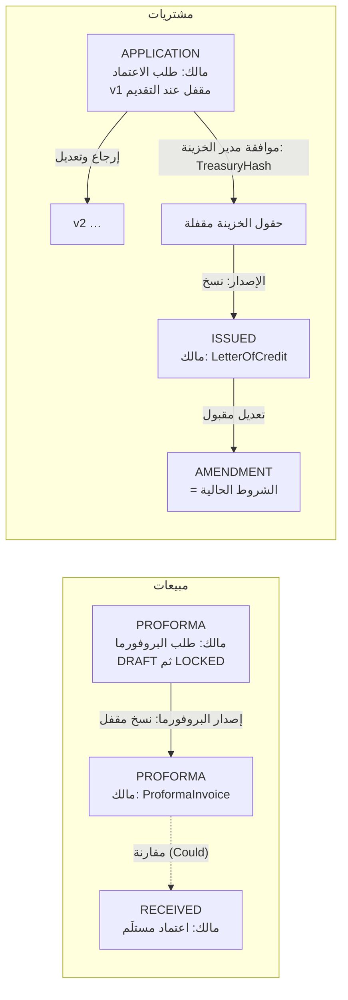
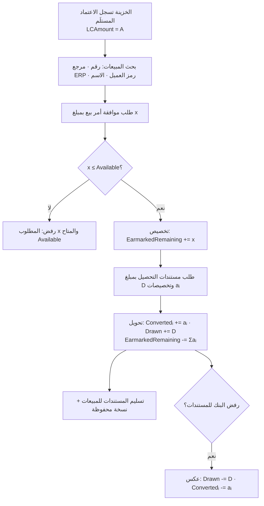
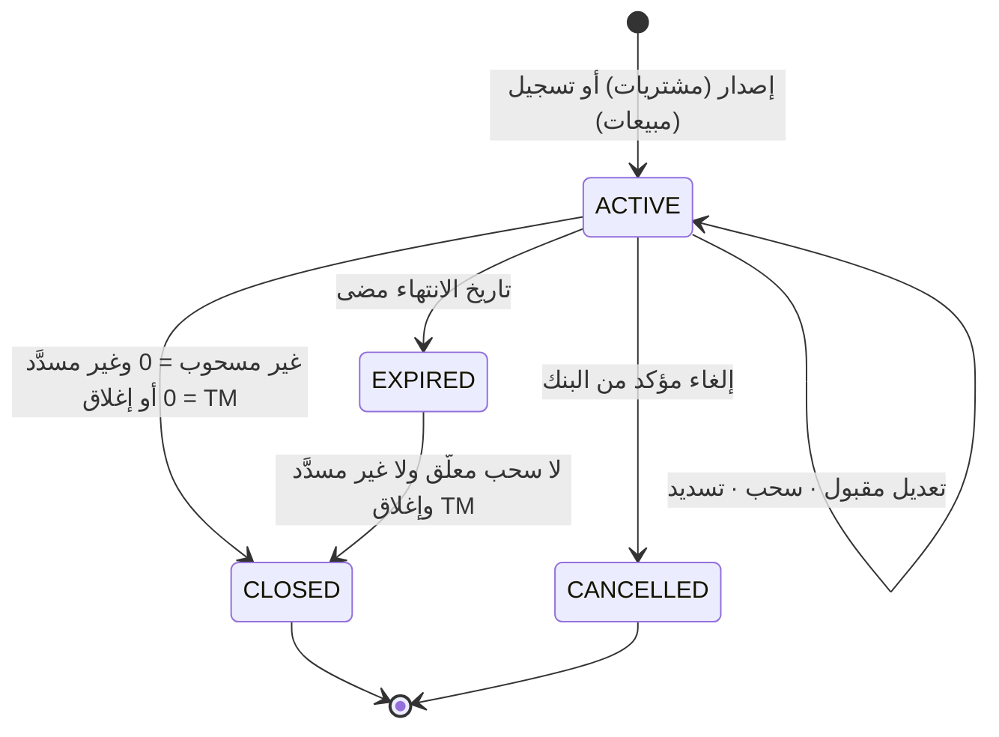

# م7 وم8: الاعتمادات المستندية (LC) للمشتريات والمبيعات والبروفورما وشروط الاعتماد والنماذج (LCI · LCE · LCT)

| البند | القيمة |
|---|---|
| الملف | `10-detailed-analysis/14-m7-m8-letters-of-credit.md` |
| الحالة | مسودة تحليل تفصيلي للمراجعة (جزء من وثيقة التحليل التفصيلية) |
| التاريخ | 2026-10-10 |
| البادئات | `LCT` (كتلة شروط الاعتماد ومكتبة البنود والرسوم والنماذج والطباعة) · `LCI` (م7 اعتمادات المشتريات) · `LCE` (م8 اعتمادات المبيعات والبروفورما وأوامر البيع) |
| الشرائح | LCT وLCI **S3** (وما يخص البروفورما من LCT **S4**) · LCE **S4** · التقارير **S5** |
| رمز الوحدة (ModuleCode) | `LC_PURCHASE` (LCT · LCI) · `LC_SALES` (LCE)، ومتطلباتهما في §13 (`00` §9-ب) |
| المصادر | `01` §3 م7/م8 و§4.1–4.2 و§5 وD-6…D-13 · `02` كاملًا (§2.2 وجدول §3 وF-1…F-14 و§7–§10) · `04` Δ3 · `00` §6 و§9-ب · `10` (FR-PLT-026…030/033/035/037/038/043، FR-ORG-005/007، BR-ORG-001، BR-PTY-001، Q-PTY-03) · `11` (FR-INS-013، FR-ACC-010/011/016، FR-CAT-007/018/020/021، §6.4) · `12` (BR-FAC-014…016 وBR-FAC-020، FR-FAC-017/030، §6.1، SVC-FAC-01…07) · `13` (§5.4 و§5.5 وFR-WFL/REQ/NTF، FR-REQ-025/027) |
| الوسوم | 🟢 ذكره المستخدم أو ورد في الوثائق · 🟡 اقتراح (له افتراض مُعلَن ويُعدَّل) |
| الخصوصية | لا تتضمن الوثيقة أسماء أشخاص ولا شركات ولا أرقام هويات أو سجلات؛ رموز الشركات (`XX05`) والأرقام في الأمثلة افتراضية وتوضيحية |
| تنبيه قانوني | **أرقام مواد UCP 600 الواردة في هذه الوثيقة مرجع هندسي مأخوذ من `02` §2.2 و§3 ويجب مطابقتها على النص الرسمي لـ ICC (Publication 600) ومراجعتها من مختص قبل الموافقة على الوثيقة (مُعلَّمة «غير مُتحقَّق» في النظام حتى يُسجَّل التحقق). المنصة توفّر قوالب ولا تقدّم استشارة قانونية؛ ونصوص البنود قوالب تراجعها جهة مختصة** |

---

## 1. الغرض والنطاق (داخل/خارج النطاق)

**الغرض.** تغطي هذه الوحدة الاعتماد المستندي (LC) من الطلب حتى الإصدار والتعديل والسحب والإغلاق، على جانبين: **م7 اعتمادات المشتريات** (شركتنا طالبة، والمورّد مستفيد) و**م8 اعتمادات المبيعات** (شركتنا مستفيدة، والعميل طالب) مع البروفورما التي تسبقها وأوامر البيع التي تستهلك قيمتها. وتحمل **LCT** كتلة «شروط الاعتماد» `LcTerms` الواحدة المعاد استخدامها في البروفورما وطلب الاعتماد والاعتماد الصادر/المستلَم والتعديل (`02` §7.2)، مع مكتبة بنود المستندات ومصفوفة الرسوم وقوالب نماذج البنوك والطباعة. التصنيف المعتمد: (**مشتريات/مبيعات**) × (**محلي/دولي**) (02 F-4). المصطلحات: «اعتماد مستندي (LC)» للخطاب نفسه (يُكتب «اعتماد» وحده حيث لا لبس) و«موافقة» لإجراءات الموافقة الإدارية (قرار D-13). محرك الدورات (الموافقات والسحب والحالات الفرعية والإشعارات) في `13`، وحساب المتاح والحجز وشروط خط المنتج في `12`، والبنوك والحسابات والقنوات في `11`.

| داخل النطاق | الشريحة |
|---|---|
| **LCT:** المكوّن `LcTerms` بإصداراته، قاموس الحقول (نوع، إلزام حسب النوع والغرض، قيم، تحقق، مرجع UCP)، جدول مواد UCP وحالة التحقق، قاعدتا الانتهاء المطلق/النسبي، فترة التقديم وأساسها، التسامح، Incoterms 2020 + نقطة التسمية، مكتبة بنود المستندات ومعاملاتها، مصفوفة الرسوم وقوالبها، الهامش والغطاء النقدي، حقل «الاعتماد السابق» اليدوي، القناة، قوالب نماذج البنوك وتعيين الحقول، طباعة الطلب والبروفورما، قواعد التحقق المشتقة من UCP ومن شروط خط المنتج، الطرف المقابل (مورّد/عميل) | S3 (البروفورما S4) |
| **LCI:** نموذج طلب اعتماد المشتريات، تحرير الشروط وقفلها، إضافات اختيار التسهيل والمنتج (تقليدي/مرابحة)، حساب ExposureAmount (مبلغ التعرّض) وانتهاء الحجز، تعديلات الخزينة بعد الموافقة، التنفيذ حسب القناة، تسجيل الإصدار وإنشاء الاعتماد، سجل الاعتمادات وبطاقة الاعتماد وحالاتها، التعديلات وطلبات الوثائق والسويفت كطلبات فرعية (الأنواع الثلاثة مفعّلة في S3 وحقولها ملك هذه الوثيقة، `13` FR-REQ-027)، السحوبات والمخالفات والتسديد (استيراد)، احتساب الاستغلال القائم لكل اعتماد، الانتهاء والإغلاق، التنبيهات، تسجيل الاعتمادات القائمة قبل الإطلاق | S3 |
| **LCE:** نموذج طلب البروفورما، إصدارها (ترقيم، ترويسة، حساب المتحصلات)، تسجيل الاعتماد المستلَم من العميل، البحث عن الاعتمادات النشطة، الرصيد، طلب الموافقة على أمر البيع والتخصيص، طلب مستندات التحصيل وتحويل التخصيص إلى استغلال فعلي، تسليم المستندات للمبيعات، التعديلات والمخالفات (Should)، مقارنة الاعتماد المستلَم بالبروفورما (Could) | S4 |
| التقارير الإدارية والتصدير والمطابقات | S5 |

| خارج النطاق | الجهة أو الموعد |
|---|---|
| الموافقات والإسناد والسحب والحالات الفرعية وSLA والترقيم الرئيسي للطلبات وقوالب `PURCHASE_LC` و`PROFORMA_REQUEST` و`SALES_ORDER_APPROVAL` و`COLLECTION_DOCS_REQUEST` و`CHILD_STANDARD` و`CHILD_AMENDMENT` | `13` (هنا حقولها ومكوّناتها وخطافاتها `lc.*` فقط) |
| حساب المتاح وتخزين الحجز والاستغلال (Utilization) وشروط خط المنتج وحسابات التسهيل | `12` |
| المنشآت والعلاقات والقنوات المفضلة والحسابات (نوع `LC_COLLECTION`) والمفوّضون وكتالوجات الاعتماد المبذورة | `11` |
| المستندات والترقيم والضريبة (`CompanyTaxRate`) والتقويم الهجري وأيام العمل والتشفير | `10` |
| احتساب العمولات والأرباح والقيود المحاسبية والرسوم المستقطعة فعليًا وتحويل العملات | لاحقًا (`00` §2.2؛ سعر التحويل من `12` BR-FAC-002) |
| توليد رسائل SWIFT والربط المباشر مع البنوك أو ERP، وتعبئة PDF البنك آليًا (غير ملتزَم به، 02 ن-6) | لاحقًا (§11)؛ التعبئة Could |
| فحص المستندات المقدَّمة فحصًا آليًا مقابل UCP/ISBP (يُسجَّل المخالفات يدويًا فقط) | خارج النطاق |
| الاعتماد القابل للتحويل والتنازل عن العائدات (تُحفظ كحقول Could فقط) والتقديم الإلكتروني eUCP والضمانات (URDG) | لاحقًا |
| بنود أصناف تفصيلية (كمية/سعر) داخل اعتماد المشتريات؛ يُوصف المورّد بنص (`goodsDescription`)، أما البروفورما ففيها بنود | لا يُبنى |
| الاستشارة القانونية ومراجعة نصوص البنود | مختص خارجي |

## 2. الجهات والصلاحيات (role matrix: role x action)

الرموز: ✔ مسموح · ◐ مقيّد (بملكية الطلب أو نطاق الشركات أو المرحلة) · — غير مسموح. الأدوار كما في `13` §2: **TA** مدير الحساب · **TM** مدير الخزينة · **FO** مسؤول التسهيلات · **TE** موظف الخزينة · **PR** المشتريات (مقدّم الطلب ومديره؛ ومدير الطالب في `13` بالرمز `RQM`، أما `RM` فمدير العلاقة لدى المنشأة المالية في `11`) · **SL** المبيعات (معدّ ومدقّق وموافِق، أدوار مخصصة تُبذر مع قوالب S4) · **AU** المدقق. مشغّل المنصة (PO) يملك وحده `lc.ucp.verify` (تحقق جدول UCP العالمي). الرؤية دائمًا ضمن نطاق الشركات (FR-PLT-020).

| # | الإجراء | الصلاحية | TA | TM | FO | TE | PR | SL | AU |
|---|---|---|---|---|---|---|---|---|---|
| 1 | إنشاء طلب اعتماد مشتريات وتحرير شروطه (حتى التقديم والإرجاع) | `req.create` + `lc.terms.edit` | — | ◐ | ◐ | ◐ | ✔ | — | — |
| 2 | إنشاء طلب بروفورما وتحريره (مرحلة الإعداد) | `req.create` + `lc.terms.edit` | — | ◐ | ◐ | ◐ | — | ✔ | — |
| 3 | تدقيق البروفورما والموافقة عليها (سلسلة المبيعات) | `req.approve` (`13`) | — | — | — | — | — | ✔ | — |
| 4 | عرض الاعتمادات الخاصة بطلباتي/إدارتي (إسقاط الطالب) | `lc.view.own` | — | ✔ | ✔ | ✔ | ✔ | ✔ | ✔ |
| 5 | سجل الاعتمادات كاملًا بالتفاصيل الداخلية (تسهيل، حجز، هامش، قناة) | `lc.view.all` + `lc.view.internal` | — | ✔ | ✔ | ✔ | — | — | ✔ |
| 6 | البحث في الاعتمادات المستلَمة النشطة وأرصدتها وطلب أوامر البيع عليها | `lc.export.view` | — | ✔ | ✔ | ✔ | — | ✔ | ✔ |
| 7 | تعديل حقول الخزينة في الشروط (هامش، حسابات، قناة، بنود خاصة بالبنك) | `lc.terms.treasury.edit` | — | ✔ | ✔ | ◐ | — | — | — |
| 8 | اختيار التسهيل والحد وخط المنتج | `req.facility.select` | — | ✔ | ✔ | — | — | — | — |
| 9 | موافقة مدير الخزينة (نقطة الحجز) | `req.treasury.approve` | — | ✔ | — | — | — | — | — |
| 10 | إدخال المراجع الخارجية (ERP) | `req.extref.edit` | — | ✔ | ✔ | ✔ | ✔ | ◐ | — |
| 11 | تنفيذ الطلب وتسجيل الإصدار | `req.execute` + `lc.issuance.record` | — | ✔ | ✔ | ✔ | — | — | — |
| 12 | إصدار البروفورما (ترقيم وطباعة وحساب المتحصلات) | `lc.proforma.issue` | — | ✔ | ✔ | ✔ | — | — | — |
| 13 | إبطال بروفورما صادرة (VOID) | `lc.proforma.void` | — | ✔ | — | — | — | — | — |
| 14 | تسجيل اعتماد مستلَم من العميل | `lc.export.record` | — | ✔ | ✔ | ✔ | — | — | — |
| 15 | إنشاء طلب فرعي من الاعتماد (تعديل/وثيقة/سويفت) | `req.create.child` + `lc.child.create` | — | ✔ | ✔ | ✔ | ◐ | ◐ | — |
| 16 | تسجيل التعديل الصادر/المستلَم وتطبيق أثره | `lc.amendment.record` | — | ✔ | ✔ | ✔ | — | — | — |
| 17 | تسجيل تقديم المستندات/السحب والتسديد | `lc.drawing.record` | — | ✔ | ✔ | ✔ | — | — | — |
| 18 | قرار المخالفات (قبول مع تنازل/رفض) | `lc.discrepancy.decide` | — | ✔ | ✔ | — | — | — | — |
| 19 | إغلاق/إلغاء اعتماد يدويًا وفك المتبقي | `lc.close` | — | ✔ | ◐ | — | — | — | — |
| 20 | إغلاق أمر بيع مخصَّص وفك الباقي | `lc.order.release` | — | ✔ | ✔ | — | — | — | — |
| 21 | تسجيل اعتماد قائم سابق (ترحيل أولي) | `lc.legacy.enter` | — | ✔ | ✔ | — | — | — | — |
| 22 | إدارة الموردين والعملاء (الطرف المقابل) | `lc.counterparty.manage` | ✔ | ✔ | ✔ | ✔ | ◐ | ◐ | — |
| 23 | إدارة مكتبة البنود ونشرها | `lc.clause.manage` | ✔ | ✔ | ✔ | — | — | — | — |
| 24 | إدارة قوالب نماذج البنوك وتعيين الحقول | `lc.template.manage` | ✔ | — | ✔ | — | — | — | — |
| 25 | ضبط تعريفات الحقول (إلزام، وسوم، تلميحات) | `lc.field.manage` | ✔ | — | — | — | — | — | — |
| 26 | طباعة الطلب/البروفورما/نموذج البنك | `lc.print` | — | ✔ | ✔ | ✔ | ◐ | ◐ | ✔ |
| 27 | مقارنة الاعتماد المستلَم بالبروفورما (Could) | `lc.compare` | — | ✔ | ✔ | ✔ | — | ◐ | — |
| 28 | عرض التقارير وتصديرها | `lc.report.view` · `lc.report.export` | ◐ | ✔ | ✔ | ◐ | ◐ | ◐ | ✔ |

ملاحظات: (أ) PR وSL يريان إسقاط الطالب فقط (BR-WFL-024): لا تسهيل ولا حجز ولا هامش ولا حسابات ولا قناة ولا مراجع بنكية ولا سويفت؛ تفصيله في BR-LCI-014 وBR-LCE-015. (ب) IBAN المستفيد وأرقام الحسابات حقول مقيّدة (FR-REQ-024): مقنَّعة لغير حاملي صلاحية الكشف (`acc.reveal`) وكل كشف أو طباعة تتضمنها تُدقَّق. (ج) `◐` في الصف 1–2: الإنشاء بحسب جمهور النوع (FR-REQ-007). (د) الأحكام الحساسة (إغلاق يدوي، إبطال بروفورما، تسجيل تصحيحي، تخطي تحذير) تُدقَّق بشدة عالية.

## 3. المفاهيم والمسرد

| المصطلح | التعريف في هذه الوثيقة |
|---|---|
| `LcTerms` | كتلة شروط اعتماد واحدة بإصدارات، تُملك بكيان (طلب، بروفورما، اعتماد، تعديل) وبغرض Purpose |
| الغرض Purpose | `PROFORMA` ما نطلبه من العميل · `APPLICATION` ما نطلبه من البنك لصالح مورّد · `ISSUED` ما صدر فعلًا · `RECEIVED` اعتماد العميل المستلَم · `AMENDMENT` لقطة ما بعد التعديل |
| التصنيف | `LcClass` (PURCHASE نحن الطالب، SALES نحن المستفيد) × `Scope` (DOMESTIC، INTERNATIONAL) |
| القفل والنسخ عند الانتقال | `LOCKED` ثابت بتجزئة `SnapshotHash`؛ ينتقل الطلب إلى كيان جديد بنسخة (copy-on-lock) فلا يتأثر السابق |
| مرجع UCP | رقم مادة بجوار الحقل من `UcpArticle`؛ حالة `UNVERIFIED/VERIFIED` تعلن أنه تُحقق من النص الرسمي أم لا |
| بند مستند (`LcDocumentClause`) | قالب نص لمستند مطلوب بمعاملات (أصول، نسخ، جهة تصديق، أجرة، إخطار، نسبة تأمين…) |
| مصفوفة الرسوم | (فئة الرسم × من يتحملها): 6 فئات × (الطالب · المستفيد · مناصفة بنسبة)، بقوالب جاهزة |
| القناة | `BANK_PORTAL` (إدخال في بوابة البنك) · `MANUAL_FORM` (نموذج مطبوع/PDF) · `DIRECT_INTEGRATION` (محجوزة) |
| قالب نموذج البنك | `LcFormTemplate`: تخطيط نموذج بنك/منتج/نوع نموذج بإصدار وفترة نفاذ وملحق عقدي ثابت وتعيين حقول |
| مبلغ التعرّض ExposureAmount | `Amount × (1 + PlusTol%)` إن `lc.reserve.include_tolerance` (الافتراضي مفعّل) وإلا `Amount`؛ تحسبه هذه الوحدة (BR-LCI-004) وهو **المبلغ الوحيد** الذي يُمرَّر إلى خدمات الحجز والاستخدام في `12` (reserve وconvert وadjust، BR-LCI-019) |
| غير المسحوب Undrawn · غير المسدَّد Unsettled | ExposureAmount ناقص المقدَّم · المقدَّم ناقص المسدَّد (استيراد) |
| الاستغلال القائم Outstanding | `Undrawn + Unsettled` (ما يستهلك الحد فعليًا من الاعتماد) |
| السحب Drawing | تقديم مستندات بمبلغ تحت اعتماد؛ ويشمل في التصدير تحويل التخصيص إلى استغلال فعلي |
| التخصيص Earmark | حجز جزء من رصيد اعتماد مستلَم لأمر بيع موافَق عليه (لا يقابله حد ائتماني) |
| المخصَّص المتبقي | `EarmarkedRemaining = Σ (Amount − Converted − Released)` لأوامر البيع الفعالة |
| الرصيد المتاح للتخصيص | `Available = LCAmount − EarmarkedRemaining − Drawn` |
| البروفورما | مستند تصدره الخزينة بشروط الاعتماد المطلوب من العميل، برقم `NNN-<رمز ERP>-YY` |
| الطرف المقابل Counterparty | مورّد/عميل خفيف (بلا هوية) يُستخدم في الاعتمادات والبروفورما (Q-PTY-03)؛ يُرقّى إلى Party عند الحاجة فيصير عندئذٍ مزوّد استخدام Party (FR-LCT-037، `10` BR-PTY-001) |
| الاعتماد السابق | بيان يدوي مطبوع مع الطلب: رقم، مبلغ، مستغَل، ونسبة محسوبة للعرض فقط |
| التسامح | `NONE` · `ABOUT` (حول، ±10% ثابتة) · `PLUS_MINUS` بنسبتين |
| حقل خزينة | حقل لا يظهر للجهة الطالبة (هامش، حسابات، قناة، بنود خاصة بالبنك) |
| CheckMode | سلوك فحص شروط خط المنتج الذي تعيده `12` (SVC-FAC-02) وهو الآلية الوحيدة: `OFF` يُخفي الفحص · `WARN` (الافتراضي) يتطلب إقرارًا مدوَّنًا · `BLOCK` يمنع SUBMIT وAPPROVE ويسمّي الشروط المخالفة (`13` BR-REQ-010) |
| الموافقة · الاعتماد المستندي (LC) | «موافقة» لأي إجراء إقرار إداري (موافقة المدير، موافقة مدير الخزينة، موافقة على أمر بيع)؛ و«اعتماد مستندي (LC)» للخطاب نفسه ويُكتب «اعتماد» وحده حيث لا لبس (قرار D-13) |

## 4. المتطلبات الوظيفية

الأولوية: Must لازم للشريحة · Should مهم ويمكن تأجيله داخلها · Could تحسين. الأرقام الافتراضية اقتراحات 🟡 تُضبط من إعدادات المشترك `lc.*` (FR-PLT-043) بحد أدنى وأقصى (BR-WFL-025).

### 4.1 شروط الاعتماد والنماذج (LCT)

| المعرّف | المتطلب | الأولوية | الشريحة | المصدر | معيار القبول |
|---|---|---|---|---|---|
| FR-LCT-001 | مكوّن `lc.terms` (MODULE_FORM، FR-REQ-003) واحد يُستخدم في طلب المشتريات وطلب البروفورما وتسجيل الاعتماد المستلَم والتعديل، بحقول قاموس §6.2 وأغراض Purpose الخمسة | Must | S3 | 🟢 02 §7.2(1)، 02 F-1 | يظهر المكوّن نفسه في الطلبات الثلاثة دون كود واجهة مستقل؛ حفظ شروط بغرض غير معرَّف يُرفض |
| FR-LCT-002 | الإصدارات: DRAFT قابل للتعديل · LOCKED عند التقديم أو الإصدار أو التسجيل بتجزئة SnapshotHash · التعديل بعد القفل نسخة DRAFT جديدة VersionNo+1 والسابقة SUPERSEDED؛ عرض الفروق بمفاتيح الحقول | Must | S3 | 🟡 | تعديل نسخة LOCKED يُرفض 409؛ بعد إرجاع وإعادة تقديم يصير VersionNo=2 وتعرض شاشة الفروق الحقول المتغيّرة فقط |
| FR-LCT-003 | التصنيف (مشتريات/مبيعات) × (محلي/دولي): `LcClass` من المالك و`Scope` يُشتق (BR-LCT-001) وتجاوزه بسبب مدوَّن | Must | S3 | 🟢 02 F-4 | مورّد في دولة الشركة ← DOMESTIC؛ في دولة أخرى ← INTERNATIONAL؛ التجاوز بلا سبب يُرفض |
| FR-LCT-004 | تعريفات الحقول بيانات `LcFieldDefinition` تُبذر لكل مشترك: التسمية Ar/En، النوع، مصفوفة الإلزام (REQUIRED/OPTIONAL/HIDDEN) بحسب (LcClass، Scope، Purpose)، الظهور للطالب، مراجع UCP، التحقق؛ يضبط TA ما ليس مقفلًا | Must | S3 | 🟢 02 §6(1) | جعل حقل غير مقفل REQUIRED يسري على المسودات الجديدة فقط؛ حقل مقفل (المبلغ، العملة، نوع الاعتماد) لا يقبل HIDDEN |
| FR-LCT-005 | شارة مرجع UCP بجوار كل حقل (رقم المادة) وتلميح بعنوان المادة، وطباعتها اختيارية (`lc.print.show_ucp`) | Must | S3 | 🟢 02 F-2، طلبك | حقل التسامح يعرض «30» وتلميحه عنوان المادة؛ إيقاف الإعداد يزيلها من الطباعة |
| FR-LCT-006 | جدول `UcpArticle` عالمي (مواد 02 §3) بحالة UNVERIFIED افتراضيًا؛ التحقق (من، متى، ملاحظة) بيد مشغّل المنصة بعد مراجعة مختص؛ تظهر شارة «غير مُتحقَّق» وحاشية طباعة ما دام أي مرجع مستخدم غير مُتحقَّق، ولا يمكن إيقاف الحاشية (`lc.print.ucp_disclaimer`) ما دام أي مادة مستخدمة UNVERIFIED (BR-LCT-018) | Must | S3 | 🟢 تنبيه 02 · 🟡 الآلية | كل المواد المبذورة UNVERIFIED؛ بعد تعليم المادة 14 VERIFIED تزول الشارة من الحقول التي لا تعتمد إلا عليها؛ كل تحقق مدقَّق؛ محاولة إيقاف الحاشية والمستند يستخدم مادة UNVERIFIED تُرفض ولا تُقبل إلا حين تكون كل المواد المستخدمة VERIFIED (AC-LCT-4) |
| FR-LCT-007 | كتلة نوع الاعتماد والاستحقاق: LC_TYPE (اطلاع، دفع آجل، قبول، تداول، مختلط) + أيام التأجيل وأساس الاحتساب + وصف المختلط + «متاح لدى/بواسطة» | Must | S3 | 🟢 02 B13–B14 | آجل بلا أيام يُرفض؛ اطلاع مع أيام تُفرَّغ؛ مختلط بلا وصف يُرفض |
| FR-LCT-008 | العملة والمبلغ والتسامح والمبلغ كتابةً بالعربية والإنجليزية يُولَّد آليًا ولا يُحرَّر | Must | S3 | 🟢 02 B10–B12، §9 | المبلغ 4,064,928.00 ريال يُولِّد النصين؛ تغيير العملة يعيد التوليد؛ «حول» يثبّت ±10% |
| FR-LCT-009 | قاعدة الانتهاء: مطلق أو N يومًا بعد الإصدار؛ يُحسب التاريخ حين يُعرف تاريخ الإصدار؛ مكان الانتهاء/التقديم إلزامي | Must | S3 | 🟢 02 §7.2(2)، B19–B20 | N=120 وإصدار 2026-11-01 ← 2027-03-01؛ تاريخ مطلق ماضٍ عند الطلب يُرفض |
| FR-LCT-010 | آخر شحن (مطلق أو نسبي) وأول شحن اختياري؛ إلزامي للدولي واختياري للمحلي | Must | S3 | 🟢 02 §9، B18 | دولي بلا آخر شحن ولا مدة يُرفض؛ محلي يُقبل |
| FR-LCT-011 | فترة تقديم المستندات بالأيام (افتراضي 21) وأساسها من قائمة محدودة | Must | S3 | 🟢 02 B21، §7.2(3) | افتراضي 21؛ أساس خارج المجموعة المسموحة يُرفض؛ 30 يومًا تحذير V-LCT-16 |
| FR-LCT-012 | الشحن والنقل: جزئي، دفعات، Transhipment، وسيلة النقل، ونقاط الإرسال والموانئ والمطارات والوجهة بحسب الوسيلة | Must | S3 | 🟢 02 B16–B24 | SEA دولي يطلب ميناءي التحميل والتفريغ؛ AIR مطارين؛ DOMESTIC_DELIVERY لا يطلب موانئ |
| FR-LCT-013 | Incoterms 2020 + نقطة التسمية إلزامية؛ القديمة (LEGACY) للعرض فقط؛ تنبيه عدم توافق مع الوسيلة | Must | S3 | 🟢 02 F-8، A9 | EXW بلا نقطة يُرفض؛ DAT لا يُختار في جديد ويُعرض في القديم؛ FOB مع AIR تحذير |
| FR-LCT-014 | الأطراف والبنوك: الطالب، المستفيد، البنك المبلّغ (اسم، عنوان، BIC)، التعزيز والبنك المعزِّز، مُسحوب عليه الكمبيالة، حساب المستفيد (IBAN) كحقل مستقل | Must | S3 | 🟢 02 B5–B9 · 🔴 B9 | مسحوب عليه = الطالب يُرفض؛ BIC بغير 8/11 خانة أو IBAN غير صحيح يُرفض |
| FR-LCT-015 | البضاعة: تصنيف (قائمة)، وصف حر، ومرجع بروفورما المورّد (رقم وتاريخ) | Must | S3 | 🟢 02 B26–B27 | وصف فارغ يُرفض؛ التصنيف إلزامي في طلب المشتريات |
| FR-LCT-016 | التأمين: المسؤول، نسبة دنيا (الافتراضي 110 حين لا ينصّ الاعتماد على نسبة؛ والنسبة المنصوص عليها في الاعتماد تحلّ محل الافتراضي، مادة 28-و-2)، شروط التغطية، تفويض البنك بترتيب بوليصة | Must | S3 | 🟢 02 B28، B33، §2.3(6) | نسبة أقل من 110 مع وثيقة تأمين: خطأ (V-LCT-04) لـ CIF/CIP حين لا ينصّ الاعتماد على نسبته الخاصة؛ وتحذير فقط لغيرهما أو حين ينصّ الاعتماد على نسبة؛ ونسبة 120 منصوص عليها لا تُرفض |
| FR-LCT-017 | مكتبة بنود المستندات `LcDocumentClause` بنص قالب Ar/En ومخطط معاملات ومادة UCP، وتُبذر بـ 13 بندًا (§6.3): البنود الـ11 من 02 B29–B39 مضافًا إليها DELIVERY_NOTE (02 §7.1) وMULTIMODAL_TD (🟡، مادة 19) | Must | S3 | 🟢 02 F-3 · 🟡 MULTIMODAL_TD | نشر بند بعنصر نائب غير معرَّف في مخططه يُرفض؛ البنود المبذورة 13 بعد التهيئة (11 + 2) ويحمل MULTIMODAL_TD وسم 🟡 |
| FR-LCT-018 | اختيار البنود وتعبئة معاملاتها (أصول، نسخ، جهة تصديق، أجرة مدفوعة/تدفع عند الوصول، إخطار، نسبة…) ومعاينة النص المولَّد وبند حر | Must | S3 | 🟢 02 B29–B39 | معاملة إلزامية ناقصة تُرفض؛ النص المصيَّر يُجمَّد عند القفل |
| FR-LCT-019 | حوكمة البنود: إصدارات، حالة مراجعة قانونية (UNREVIEWED/REVIEWED) ببيان المراجع وتاريخه، ولافتة طباعة عند استخدام بند غير مراجَع | Should | S3 | 🟡 01 R6 | طلب فيه بند UNREVIEWED يطبع لافتة «نصوص لم تُراجَع قانونيًا»؛ لا تغيير لبند مستخدم في نسخة مقفلة |
| FR-LCT-020 | مصفوفة الرسوم 6 فئات × (طالب/مستفيد/مناصفة) مع 4 قوالب جاهزة + «مخصّص» (§5.5) وتحويل إلى صيغ النماذج الثلاث (أ/ب/ج) | Must | S3 | 🟢 02 §7.3 | اختيار قالب يملأ 6 صفوف بنقرة؛ مناصفة بنسبة 50 تُحفظ؛ تعارض التمثيل يُنبَّه (V-LCT-13) |
| FR-LCT-021 | كتلة الخزينة: نسبة الهامش/الغطاء النقدي، تفويض الخصم (رسوم وهامش / 100% من القيمة)، عملة الاحتفاظ بالهامش، حسابات (تسهيل، هامش وتسوية، رسوم) من حسابات التسهيل؛ لا تظهر للطالب | Must | S3 | 🟢 02 B43–B45 | واجهة الطالب لا تعيد هذه الحقول حتى لو طُلبت (RequesterView)؛ 100% تفرض الهامش 100 |
| FR-LCT-022 | «الاعتماد السابق» يدوي: رقم، مبلغ وعملة، مستغَل، من فتحه (اختياري)، ونسبة الاستغلال محسوبة للعرض، دون ربط بالسجلات | Must | S3 | 🟢 02 §9 (02 ن-10) | 5,000,000 والمستغَل 3,500,000 ← 70.00%؛ المستغَل أكبر من المبلغ يُرفض؛ يُطبع حين يُملأ فقط |
| FR-LCT-023 | محرك تحقق مدفوع بالبيانات: قواعد §9.1 (E يمنع التقديم وW يسمح) تُنفَّذ في الخادم دائمًا، وتجاوز التحذير يحفظ تسويغًا مدوَّنًا | Must | S3 | 🟢 02 F-7 | الخطأ يمنع `lc.validate_terms`؛ التحذير المتجاوز يُسجَّل بالمستخدم والسبب |
| FR-LCT-024 | وقائع الشروط تُرسل إلى `SVC-FAC-02` (تأجيل، بعد التأجيل، صلاحية، غطاء، نسبة تمويل، تاريخ مخطط، نمط شحن) وتُعرض نتيجة كل شرط وفق CheckMode الذي تعيده الخدمة للخط (الآلية الوحيدة، `13` BR-REQ-010): `OFF` يُخفي الفحص · `WARN` (الافتراضي) تحذير يتطلب إقرارًا مدوَّنًا · `BLOCK` يمنع SUBMIT وAPPROVE ويسمّي الشروط المخالفة | Must | S3 | 🟢 04 Δ3، Q-REQ-07 | تأجيل 200 على حد 180 ← مخالفة DEFERRAL بالقيمتين؛ مع WARN تكون الموافقة ممكنة بإقرار مدوَّن، ومع BLOCK يُرفض SUBMIT وAPPROVE بقائمة الشروط المخالفة، ومع OFF لا تظهر نتيجة ولا إقرار (AC-LCT-3) |
| FR-LCT-025 | القناة: بوابة البنك أو نموذج يدوي (الربط المباشر محجوز)؛ الافتراضي من `SVC-02`؛ مخرجات القناة: ورقة بيانات مرتبة بحسب البوابة، أو نموذج مطبوع | Must | S3 | 🟢 02 §8، FR-INS-013 | اختيار «ربط مباشر» يُرفض بـ«غير مفعّل»؛ قناة البوابة تنتج ورقة بالترتيب المعيّن في تعيين الحقول |
| FR-LCT-026 | `LcFormTemplate`: نماذج لكل (منشأة، منتج، نوع نموذج، نطاق، قناة) بإصدار وفترة نفاذ وملحق عقدي ثابت بإصداره (02 F-14) وقالب موحّد احتياطي للمشترك | Must | S3 | 🟢 02 F-1، 02 F-14 | الحل بالأكثر تخصيصًا (BR-LCT-017)؛ تغيير إصدار الملحق لا يغيّر مطبوعًا سابقًا |
| FR-LCT-027 | `LcFormFieldMap`: تعيين حقل النظام (تعبير من قائمة بيضاء) إلى اسم حقل PDF أو بند في ورقة البوابة مع تحويل (تاريخ، مبلغ بالحروف، خانة اختيار…) | Should | S3 | 🟡 02 §2.3(2) | تعبير غير مسموح يُرفض؛ هدف إلزامي بلا مصدر يُنبَّه قبل الطباعة |
| FR-LCT-028 | طباعة الطلب PDF: النموذج الموحّد أو قالب البنك، يحمل رقم الطلب وتجزئة الشروط وإصدار القالب والملحق، وعلامة «مسودة» قبل القفل؛ يُحفظ مستندًا مرتبطًا | Must | S3 | 🟢 02 §8(ب) | الطباعة قبل القفل بعلامة مائية؛ بعده تطابق الشروط المقفلة بتجزئتها؛ تُسجَّل في التدقيق |
| FR-LCT-029 | طباعة البروفورما PDF: ترويسة الشركة، العميل، الرقم، البنود والإجماليات، الدفع بالاعتماد، التسليم، الرسوم، فترة التقديم، المستندات، الانتهاء، بيانات حساب المتحصلات وIBAN؛ عربي/إنجليزي/ثنائي | Must | S4 | 🟢 02 §7 (النموذج ج) | الناتج يطابق عناصر 02 §7.1 ويُحفظ مستندًا من نوع PROFORMA_ISSUED بتجزئة |
| FR-LCT-030 | تعبئة PDF قابل للتعبئة (AcroForm) آليًا من تعيين الحقول لنماذج بنوك محددة | Could | S5 | 🟡 02 ن-6 (غير ملتزَم) | عند وجود تعيين كامل يُنتج PDF معبّأً يُراجَع قبل التوقيع |
| FR-LCT-031 | مقارنة الاعتماد المستلَم بالبروفورما حقلًا حقلًا بحكم الاتجاه المصلحي (مطابق، أفضل للمستفيد، أسوأ، شرط مضاف، مفقود) وقرار لكل فرق | Could | S4 | 🟡 02 F-12 | انتهاء بروفورما 120 يومًا مقابل 90 في المستلَم ← LESS_FAVOURABLE؛ أصل + نسختان مقابل أصل + 3 نسخ للفاتورة ← LESS_FAVOURABLE؛ لا تعدّل الشروط المقفلة |
| FR-LCT-032 | الهجري: تخزين ميلادي وعرض هجري حسب إعداد المشترك، وإدخال هجري في حقول معلَّمة (انتهاء، آخر شحن، تاريخ السجل التجاري في الطباعة) مع حفظ النص المُدخل | Should | S3 | 🟢 02 F-13، FR-PLT-033 | إدخال تاريخ هجري غير موجود يُرفض؛ المطبوع يعرض ما أُدخل |
| FR-LCT-033 | لغة نص الاعتماد (إنجليزي/عربي/كلاهما) تحكم تصيير البنود والطباعة | Should | S3 | 🟡 | تغيير اللغة يعيد تصيير المعاينة ولا يغيّر المعاملات |
| FR-LCT-034 | تصدير/استيراد حزمة مكتبة البنود وقوالب النماذج (JSON) بين المشتركين نسخة DRAFT | Could | S5 | 🟡 | الحزمة المستوردة تجتاز تحقق النشر قبل التفعيل |
| FR-LCT-035 | تلميح وسم SWIFT (`SwiftTagHint`) على تعريفات الحقول لتهيئة ربط MT700/707 لاحقًا (§11) | Could | S5 | 🟡 | وجود الحقل في الواجهة البرمجية دون شاشة |
| FR-LCT-036 | الطرف المقابل `Counterparty` (مورّد/عميل) خفيف: رمز، اسم Ar/En، بلد ومدينة وعنوان وص.ب. ورمز بريدي وهاتف وفاكس وبريد، **رمز ERP** (حساب الذمم/المورّد) نصي قابل للبحث، رقم ضريبي؛ تحذير تكرار؛ ترقية إلى Party عند الحاجة | Must | S3 | 🟡 Q-PTY-03، 🟢 02 A4 | البحث برمز ERP أو الاسم (بتطبيع عربي) يعيد الطرف؛ تكرار (النوع، الرمز) تحذير لا منع؛ لا رقم هوية في السجل |
| FR-LCT-037 | مزوّد استخدام Party: تسجّل هذه الوحدة في مسجّل `10` (BR-PTY-001) مزوّدًا واحدًا هو **Counterparty**، ولا يعمل إلا للطرف المقابل المرقّى (`Counterparty.PartyId` غير فارغ)؛ يعيد لكل Party مرقّى مراجعه (الاعتمادات والبروفورمات التي هو مورّدها أو عميلها وحالتها) لشارات الأدوار المشتقة وللدمج (`10` FR-PTY-016)، فلا يبقى `PartyId` يشير إلى Party مدموج | Should | S3 | 🟡 `10` BR-PTY-001، Q-PTY-03 | طرف مقابل غير مرقّى لا يظهر في أدوار أي Party؛ بعد ترقيته يظهر لشخصه شارة «طرف مقابل» بعدد اعتماداته؛ دمج Party يعيد توجيه `Counterparty.PartyId` إلى الباقي في المعاملة نفسها |

### 4.2 اعتمادات المشتريات (LCI) — م7

| المعرّف | المتطلب | الأولوية | الشريحة | المصدر | معيار القبول |
|---|---|---|---|---|---|
| FR-LCI-001 | نموذج طلب اعتماد المشتريات (قالب `PURCHASE_LC`): الشركة الطالبة من نطاق الطالب، المورّد (`Counterparty`)، المبلغ والعملة، مكوّن `lc.terms`، الاعتماد السابق، المرفقات (بروفورما المورّد، أمر الشراء)، تاريخ الاحتياج والأولوية، المشروع/الغرض نصًا؛ وتُنسخ أعمدة الفهرسة (المبلغ، العملة، اسم/رمز المورّد، تاريخ الاحتياج) | Must | S3 | 🟢 01 §4.1، 02 F-11 | تقديم بلا مورّد أو مبلغ يُرفض؛ تغيير المبلغ في الشروط يحدّث `Request.Amount` في الحفظ نفسه (FR-REQ-009) |
| FR-LCI-002 | اختيار المورّد من الأطراف المقابلة مع إنشاء سريع داخل الطلب بحد أدنى (الاسم، البلد) وتنبيه الأسماء المشابهة | Must | S3 | 🟡 Q-PTY-03 | مورّد جديد يُنشأ من الشاشة ويظهر في الاختيار؛ اسم مشابه ينبّه قبل الحفظ |
| FR-LCI-003 | التقديم يستدعي الخطاف `lc.validate_terms` (ON_ACTION(SUBMIT/RESUBMIT) المبذور في قالبي `PURCHASE_LC` و`PROFORMA_REQUEST`، `13` §5.5 وFR-WFL-002؛ قواعد E في §9.1) ثم يقفل إصدار الشروط LOCKED وتدخل تجزئته في SnapshotHash الموافقات (BR-WFL-003)؛ التعديل بعد إرجاع نسخة DRAFT جديدة | Must | S3 | 🟢 FR-WFL-021 (الخطافات) · 🟡 `lc.validate_terms` | تقديم بخطأ E يُرفض بقائمة الأخطاء؛ بعد التقديم يرفض الخادم تعديل الطالب؛ إعادة التقديم تعطي VersionNo+1 |
| FR-LCI-004 | طلب مطبوع للتوقيع الورقي (رئيس القطاع) بعد منح الرقم: يحمل رقم النظام وتجزئة الشروط القصيرة (8 خانات) وتاريخ الموافقة؛ ويبقى الأصل الموقّع مرفقًا إلزاميًا (FR-WFL-025) | Must | S3 | 🟢 01 §4.1 · 🟡 التجزئة | المطبوع يحمل `LCP-26-NNNN` وتجزئة تطابق النسخة المقفلة؛ الطباعة قبل الرقم بعلامة «مسودة» |
| FR-LCI-005 | مرحلة اختيار التسهيل: لوحة التوفر (`LIMIT_SELECTION`، SVC-FAC-01) لمنتج الاعتماد والشركة والعملة وExposureAmount بسريانها، تعرض ما تعيده `12` وحده (Cap وUsed وReservedForOthers وAvail وBindingNode وValidityIndicator، ولا صيغة محلية: `12` BR-FAC-014)، مع نتيجة فحص شروط الخط وفق CheckMode (FR-LCT-024)؛ تخصيص واحد لكل طلب (Q-WFL-10)؛ ولا يراها الطالب | Must | S3 | 🟢 01 §4.1، FR-REQ-013 | خط شركته مستثناة يظهر محجوبًا بسبب؛ تغيير الاختيار يجدّد الفحص |
| FR-LCI-006 | المنتج: يحدد خط المنتج المختار منتج الاعتماد (`LC_PURCHASE_CONV` أو `LC_PURCHASE_MURABAHA`) فيحدد قالب النموذج والملحق العقدي ومسمى العائد (ربح/عمولة)؛ الاعتماد المحلي يستخدم المنتجين نفسيهما (Q-LCI-05) | Must | S3 | 🟢 02 §2.3(5)، 02 F-5 | منتج المرابحة يطبع الملحق بإصداره؛ تغيير الخط بعد موافقة TM يعيد الموافقة (BR-LCI-006) |
| FR-LCI-007 | إكمال حقول الخزينة (هامش، تفويض الخصم، الحسابات الثلاثة من SVC-FAC-07، القناة، بنود خاصة بالبنك) أثناء الاختيار والتنفيذ والافتراضيات من شروط الخط | Must | S3 | 🟢 02 B43–B45 | الهامش الافتراضي = CashCoverPct؛ قناة يدوية بلا الحسابات الثلاثة تحذير؛ الطالب لا يراها |
| FR-LCI-008 | ExposureAmount وتاريخ انتهاء الحجز عند موافقة مدير الخزينة يُحسبان بـ BR-LCI-004/005 ويُمرَّر ExposureAmount وحده (مع OverrideRequested وOverrideReason وAcknowledgedWarnings من موافقة TM) إلى `fac.reserve_limit` بتوقيعه الثابت (BR-LCI-019) | Must | S3 | 🟢 D-9 | 3,000,000 بتسامح ±5% ← ExposureAmount=3,150,000 ← حجز 3,150,000؛ إعادة الموافقة بعد تعديل تعدّل الحجز نفسه (upsert بـ RequestId)؛ `lc.reserve.include_tolerance=false` ← 3,000,000 |
| FR-LCI-009 | تعديل الخزينة للشروط بعد الموافقة: مسموح بلا إعادة موافقة لحقول محددة وممنوع لغيرها (BR-LCI-006)؛ كل تعديل نسخة جديدة بسبب وتعليق ظاهر للطالب | Must | S3 | 🟡 | زيادة المبلغ فوق المحجوز تُرفض باقتراح الإرجاع؛ تغيير عنوان البنك المبلّغ يُقبل بنسخة v+1 وسبب |
| FR-LCI-010 | التنفيذ: مخرجات القناة (ورقة البوابة أو النموذج المطبوع)، مراجع البنك (رقم طلب البوابة، تاريخ التسليم) وإرفاق الإيصال/الإقرار، وفحص كفاية التوقيعات (SVC-04: عملية LC، المبلغ، العملة) عند «توقيع» | Must | S3 | 🟢 02 §8، 13 F-WFL-2 | مبلغ فوق سقف المفوّضين يعيد INSUFFICIENT مع المرشحين؛ قناة البوابة تتطلب إيصالًا قبل إكمال التنفيذ (`lc.execution.require_receipt`=true 🟡) |
| FR-LCI-011 | نموذج الإصدار `lc.issuance`: رقم الاعتماد، تاريخ الإصدار، مبلغ وعملة الصادر، الانتهاء الفعلي وآخر الشحن، مرجع البنك، فرع الإصدار، نسخة الاعتماد (LC_COPY إلزامي) ونسخة سويفت اختيارية | Must | S3 | 🟢 01 §4.1 | الإتمام بلا رقم أو نسخة مرفوض برسالة تسمّي البند (BR-WFL-014) |
| FR-LCI-012 | إنشاء الاعتماد ذرّيًا عند الخروج من الإصدار: `fac.convert_reservation(ReservationId, ExposureAmount, LcNumberText)` بمبلغ التعرّض الصادر (BR-LCI-007) فينشئ Utilization (SourceType=LC) بـ SourceRefId فارغ مؤقتًا، ثم `lc.record_issuance` (ينشئ LetterOfCredit ACTIVE ونسخة شروط ISSUED مقفلة، **ويعبّئ `Utilization.SourceRefId = LcId` في المعاملة نفسها**، ويربط الطلب والمراجع الخارجية) ثم `LC.ISSUED` | Must | S3 | 🟢 13 §5.5 · 🟡 12 BR-FAC-015 | فشل أي خطوة يلغي كل المعاملة؛ إعادة التنفيذ بالمفتاح نفسه لا تنشئ اعتمادًا ثانيًا؛ بعد اكتمال المعاملة لا يبقى Utilization من نوع LC بـ SourceRefId فارغ ويساوي LcId الاعتمادَ المنشأ |
| FR-LCI-013 | سجل الاعتمادات والبحث الموحّد برقم الاعتماد ومرجع ERP ورقم الطلب والمورّد والمبلغ، وتصفية (شركة، بنك، منتج، حالة، ينتهي خلال N) | Must | S3 | 🟢 01 §4.1 | البحث بـ`٤٥٠٠١٢٣٤٥٦` يطابق `4500123456` (BR-REQ-006)؛ أقل من ثانيتين على 20 ألف اعتماد |
| FR-LCI-014 | بطاقة الاعتماد: ملخص، الشروط وإصداراتها، الاستغلال والحجز (داخلي)، السحوبات، التعديلات والطلبات الفرعية، المستندات، الخط الزمني | Must | S3 | 🟡 | كل تبويب يحترم `lc.view.internal`؛ الخط الزمني يطابق RequestAction وأحداث الاعتماد |
| FR-LCI-015 | حالات الاعتماد (§8) والإغلاق/الإلغاء اليدوي لـ TM بسبب مع فك المتبقي؛ لا حذف | Must | S3 | 🟢 X-DAT-5 | إغلاق مع سحب غير مسدَّد مرفوض؛ الإغلاق يفك غير المسحوب في معاملة واحدة |
| FR-LCI-016 | الاستغلال القائم لكل اعتماد (BR-LCI-008) وخدمة إعادة الاحتساب، ومطابقة ليلية مع Utilization المقابل | Must | S3 | 🟡 | سيناريو AC-LCI-1؛ الفرق ينتج `LC.RECONCILE_MISMATCH` |
| FR-LCI-017 | ربط دورة الحجز والاستخدام بأحداث الاعتماد (جدول BR-LCI-010) بمبلغ ExposureAmount وفروقه وحده: حجز `fac.reserve_limit`، تحويل `fac.convert_reservation`، وبعد الإصدار تعديل بفرق موقَّع وتخفيض بالتسديد والانتهاء والإغلاق عبر `fac.adjust_utilization`/`fac.release_utilization`، وفك الحجز بالرفض/الإلغاء قبل الإصدار `fac.release_reservation` | Must | S3 | 🟢 D-9، 13 BR-WFL-016…018 · 🟡 12 BR-FAC-020 | رفض الطلب بعد الحجز يفك كامل المحجوز في معاملة الرفض؛ لا يُستدعى `fac.adjust_reservation` على حجز CONVERTED (يُرفض RESERVATION_NOT_ACTIVE) بل `fac.adjust_utilization` |
| FR-LCI-018 | طلب فرعي `LC_AMENDMENT` (قالب `CHILD_AMENDMENT`، مفعّل في S3 وحقوله ملك هذه الوثيقة، `13` FR-REQ-027): أنواع التعديل (زيادة، تخفيض، تمديد انتهاء، تغيير آخر شحن، تعديل شروط، إلغاء)، الفرق Delta بإشارته (فرق ExposureAmount)، شروط معدّلة كإصدار AMENDMENT، السبب؛ زيادة المبلغ (`amountDelta > 0`) والإلغاء (`kind = CANCEL`، مقترح) تمران بمرحلة TM_APPROVAL الصريحة (انتقال شرطي من APPROVAL)، وتحمل خطاف رفع التعرّض عند الموافقة حين Delta > 0 فقط ولا استدعاء عند الإلغاء (`13` §5.5، BR-WFL-018) | Must | S3 | 🟢 01 §4.1 · 🟡 الإلغاء | +300,000 ← مسار TM و`fac.adjust_utilization(+300,000)` (الاعتماد صادر فلا حجز ACTIVE)؛ تمديد انتهاء بلا فرق مبلغ لا يستدعي TM ولا يستدعي خدمات الحد |
| FR-LCI-019 | تطبيق التعديل (`lc.apply_amendment`، ON_EXIT لمرحلة AMENDMENT_RESULT في قالب `CHILD_AMENDMENT` بنموذج `lc.amendment_result`): تسجيل إصدار البنك (مرجع، تاريخ) ثم رد المستفيد؛ القبول يحدّث الاعتماد (المبلغ، الانتهاء، آخر الشحن، AmendmentNo) ويجعل شروط التعديل الحالية؛ الرفض أو السحب يعكس زيادة التعرّض بـ `fac.adjust_utilization(−Delta)` | Must | S3 | 🟢 01 §4.1 · 🟡 الرد | سيناريو AC-LCI-2؛ التخفيض لا يُفك قبل القبول |
| FR-LCI-020 | طلب فرعي `LC_DOCUMENT_REQUEST` (قالب `CHILD_STANDARD`، مفعّل في S3 وحقوله ملك هذه الوثيقة، `13` FR-REQ-027): النوع (نسخة اعتماد، نسخة تعديل، إشعار بنك، تأكيد دفع، نسخة مستندات شحن، أخرى)، الغرض، تاريخ مطلوب؛ الإتمام بمرفق ظاهر للطالب | Should | S3 | 🟢 01 §4.1 · 🟡 الأنواع | الإتمام بلا مرفق مرفوض؛ المرفق يظهر للطالب |
| FR-LCI-021 | طلب فرعي `LC_SWIFT_REQUEST` (قالب `CHILD_STANDARD`، مفعّل في S3 وحقوله ملك هذه الوثيقة، `13` FR-REQ-027): نوع الرسالة (كتالوج SWIFT_MESSAGE_KIND)، الجهة المستلمة، الغرض، تاريخ مطلوب؛ الإتمام بنسخة الرسالة LC_SWIFT_COPY | Should | S3 | 🟢 01 §4.1 · 🟡 الأنواع | كتالوج النوع قابل للإضافة من المشترك (FR-CAT-020)؛ الإتمام بلا نسخة مرفوض |
| FR-LCI-022 | قواعد إنشاء الطلب الفرعي (`CanCreateChild`): تعديل لاعتماد ACTIVE فقط وتعديل مفتوح واحد؛ وثيقة وسويفت لـ ACTIVE/EXPIRED/CLOSED؛ لا شيء لـ CANCELLED | Must | S3 | 🟡 FR-REQ-012 | زر «طلب تعديل» لا يظهر لاعتماد EXPIRED؛ تعديل ثانٍ مع الأول مفتوح يُرفض |
| FR-LCI-023 | السحوبات: رقم تقديم، مبلغ، تاريخ التقديم، مرجع إشعار البنك، الحالة، الاستحقاق المحسوب للآجل، موعد انتهاء الفحص، علم المخالفة؛ وتُحدَّث الأرصدة آليًا | Must | S3 | 🟢 01 §3 م7 (دفع/استغلال) | BR-LCI-013؛ سحب فوق المتبقي الأقصى يُرفض |
| FR-LCI-024 | المخالفات `LcDiscrepancy`: وصف، مصدر، قرار (تنازل/رفض/تصحيح) بتاريخ وسبب، وتنبيه المهلة | Should | S3 | 🟡 | سحب DISCREPANT لا يصير ACCEPTED إلا بقرار مدوَّن لـ `lc.discrepancy.decide` |
| FR-LCI-025 | التسديد: مبلغ وتاريخ وحساب التسوية؛ تخفيض الاستغلال بـ`fac.adjust_utilization` بفرق سالب (`12` BR-FAC-020، FR-FAC-030)؛ التسديد الجزئي | Must | S3 | 🟡 12 | تسديد 1,000,000 يخفض الاستغلال بالمبلغ نفسه ولا يتطلب متاحًا؛ الفرق السالب لا يهبط بالرصيد تحت الصفر ويضع Utilization في RELEASED عند الصفر |
| FR-LCI-026 | معالجة الانتهاء: مهمة يومية تنقل ACTIVE إلى EXPIRED بعد تاريخ الانتهاء؛ ويُفك غير المسحوب آليًا عندئذٍ (`lc.auto_release_on_expiry` **مفعّل افتراضيًا** 🟢 D-9) فتعود إتاحته وتبقى غير المسدَّدة؛ والنمط اليدوي (false) خيار للمشترك يُبقي الاستغلال حتى إغلاق TM مع مهمة إغلاق وتذكير أسبوعي؛ ويبقى تذكير الإغلاق الإداري للمنتهي غير المغلق في النمطين (BR-LCI-015) | Must | S3 | 🟢 D-9 (01 §5) · 🟡 Q-LCI-03 | سيناريو AC-LCI-1؛ المفعّل يعيد الإتاحة عند الانتهاء (ويصير Utilization الاعتماد RELEASED إن لم يبقَ غير مسدَّد)؛ المطفأ يُبقي الاستغلال حتى الإغلاق اليدوي |
| FR-LCI-027 | تنبيهات انتهاء الاعتماد وآخر الشحن عبر `IExpiryProvider` (FR-NTF-017) بعتبات 30/15/7 للطالب والمُسنَد وTM (`LC.EXPIRY_DUE`) | Must | S3 | 🟢 BR-NTF-012 | اعتماد ينتهي بعد 20 يومًا يصدر عتبة 30 مرة واحدة ثم 15 عند اقترابها؛ التجديد بتعديل يعيد الضبط |
| FR-LCI-028 | تنبيهات استحقاق السداد (7/3/1 ويوم الاستحقاق) وموعد انتهاء فحص المستندات | Should | S3 | 🟡 | `LC.DRAWING_DUE` مرة لكل (سحب، عتبة) |
| FR-LCI-029 | تسجيل اعتماد قائم سابق (ترحيل أولي) بلا طلب: بياناته وشروطه الجوهرية ومسحوبه ومسدَّده؛ ينشئ سجل الاعتماد أولًا ثم Utilization (SourceType=LC، SourceRefId=LcId) في `12` بـ `fac.create_utilization(SourceType, SourceRefId, …)` بلا حجز، ويحمل علم LegacyEntry | Should | S3 | 🟡 Q-LCI-09 | يظهر أثره في المتاح فورًا؛ يُدقَّق بشدة عالية ويتطلب `lc.legacy.enter`؛ إعادة الإدخال بـ (LC، LcId) نفسه تُرفض DUPLICATE_SOURCE |
| FR-LCI-030 | إسقاط الطالب `RequesterView`: رقم الاعتماد، الحالة المبسّطة، المبلغ، المسحوب وغير المسحوب، التواريخ، المستفيد، التعديلات، المستندات المشاركة؛ ولا شيء من BR-LCI-014 | Must | S3 | 🟢 D-6 | استجابة PR لا تحمل التسهيل ولا الحجز ولا الهامش ولا الحسابات ولا مراجع البنك |
| FR-LCI-031 | التزامن والتكرار: كل كتابة على الاعتماد تحمل RowVersion وIdempotency-Key؛ التعارض 409 | Must | S3 | 🟡 FR-WFL-035 | إعادة إرسال «تسجيل سحب» بالمفتاح نفسه لا تنتج سحبين |
| FR-LCI-032 | الفروق المحلي/الدولي: افتراضيات وتحققات وقالب نموذج بحسب Scope (تعزيز WITHOUT، نقل داخلي، بلا موانئ) | Should | S3 | 🟢 02 §2.3(4) | تعيين Scope=DOMESTIC يضبط الافتراضيات ويخفي الحقول المخصصة للدولي |
| FR-LCI-033 | تقارير R-LCI-01…09 (§10) | Should | S5 | 🟡 | تطابق أرقامها مع بطاقات الاعتمادات |

### 4.3 اعتمادات المبيعات والبروفورما (LCE) — م8

| المعرّف | المتطلب | الأولوية | الشريحة | المصدر | معيار القبول |
|---|---|---|---|---|---|
| FR-LCE-001 | نموذج طلب البروفورما (قالب `PROFORMA_REQUEST`، مكوّن `lc.proforma`): رمز ERP للشركة (من الشركة)، الفرع (رمز/اسم نصًا)، المشروع (رمز/اسم/موقع نصًا)، العميل (رمز حساب الذمم)، البنود، شروط الدفع (نسبة الدفع بالاعتماد ونوعه)، شروط التسليم، الرسوم، الصلاحية، مكانا الاستلام والتسليم، المستندات المطلوبة، ومكوّن الشروط بغرض PROFORMA | Must | S4 | 🟢 02 §1 (A1–A14)، 02 ن-5 | تقديم بلا عميل أو بند أو عملة يُرفض؛ الفرع والمشروع نصان بلا كيان مرجعي |
| FR-LCE-002 | اختيار العميل من الأطراف المقابلة (CUSTOMER) برمز ERP أو الاسم، وإنشاء سريع | Must | S4 | 🟢 02 A4 | البحث برمز حساب الذمم يعيد العميل؛ مشابه ينبّه |
| FR-LCE-003 | جدول البنود: وصف، كمية، وحدة قياس (UNIT_OF_MEASURE)، سعر وحدة، إجمالي محسوب؛ الإجماليات والضريبة من `CompanyTaxRate` الساري (لا رقم مضمَّن) | Must | S4 | 🟢 02 A5–A6، 02 F-9 | 3,534,720 + 15% = 4,064,928 (BR-LCE-001)؛ غياب نسبة سارية يمنع التقديم |
| FR-LCE-004 | سلسلة المبيعات: إعداد ← تدقيق ← موافقة (ثلاث مراحل متسلسلة بأدوار مخصصة)، المدقّق يُرجع ولا يعدّل (الافتراضي)، فصل المهام | Must | S4 | 🟢 02 A14، 02 F-11 | معدّ الطلب لا يدقّقه ولا يوافق عليه (FR-WFL-009)؛ الإرجاع بسبب ظاهر |
| FR-LCE-005 | إصدار البروفورما من الخزينة (`lc.issue_proforma`): مراجعة الشروط واستكمالها، اختيار حساب المتحصلات من حسابات الشركة (SVC-06: `LC_COLLECTION`)، منح الرقم، توليد PDF بالترويسة، تخزينه، وتسليمه للمبيعات | Must | S4 | 🟢 02 §7 | الإصدار يتم في معاملة واحدة مع الرقم؛ تكراره بالمفتاح نفسه يعيد البروفورما ذاتها |
| FR-LCE-006 | ترقيم البروفورما `{seq:000}-{رمز ERP للشركة}-{yy}` تسلسلًا لكل (مشترك، شركة، سنة) بلا فجوات؛ يتصفّر سنويًا؛ يمنع غياب رمز ERP الإصدار؛ ولأن الرقم يحمل الرمز ولكل شركة عدّاد مستقل، يشترط تفعيل ترقيم PROFORMA رمز ERP **فريدًا بين الشركات غير المؤرشفة** (`10` BR-ORG-001 وFR-ORG-005) كي لا يتكرر الرقم نفسه للعميل | Must | S4 | 🟢 02 §7.1، FR-PLT-026 | `001-XX05-26` ثم `002-XX05-26` وشركة أخرى `001-XX02-26` و`001-XX05-27` في السنة التالية؛ شركتان بالرمز `XX05` غير مؤرشفتين والترقيم مفعّل ← يُمنع الحفظ في `10` (خطأ لا تحذير) فلا يصدر `001-XX05-26` مرتين؛ ويُرفض إدراج بروفورما بـ (TenantId، ProformaNo) مكرر |
| FR-LCE-007 | عدم تغيّر البروفورما بعد الإصدار؛ الإبطال VOID بسبب من TM مع بقاء الرقم، والاستبدال بإصدار جديد برقم جديد (طلب جديد يُنشأ بنسخ الطلب الأصلي، `13` FR-REQ-025 Should/S4 لـ PROFORMA_REQUEST) ويصير السابق SUPERSEDED | Must | S4 | 🟡 Q-LCE-01، `13` FR-REQ-025 | تعديل بروفورما صادرة مرفوض؛ لا إعادة استخدام رقم مُبطَل؛ نسخ بروفورما صادرة ينشئ مسودة بلا رقم تُصدر برقم جديد ويصير السابق SUPERSEDED |
| FR-LCE-008 | سجل البروفورمات والبحث (رقم، عميل برمزه أو اسمه، مشروع، شركة، حالة، هل وصل اعتمادها) | Must | S4 | 🟡 | البحث برمز العميل يعيد بروفورماته مع حالة وصول الاعتماد |
| FR-LCE-009 | تسجيل الاعتماد المستلَم (تدخله الخزينة): رقم الاعتماد، العميل، بنك العميل (نص + BIC)، البنك المبلّغ/المحصّل لدينا (علاقة)، تاريخ الاستلام، البروفورما المرتبطة (اختيارية)، الشروط بغرض RECEIVED، المرفقات (نسخة الاعتماد، SWIFT)، المراجع الخارجية | Must | S4 | 🟢 01 §4.2 (D) | تسجيل بلا رقم أو مبلغ أو عميل أو انتهاء يُرفض؛ الاعتماد يُسجَّل ACTIVE ويصدر `LC.RECEIVED` |
| FR-LCE-010 | تحذيرات التكرار: رقم اعتماد مكرر لعميل نفسه، ومبلغ أكبر من إجمالي البروفورما (+التسامح) | Should | S4 | 🟡 | الرقم المكرر تحذير يتطلب تأكيدًا مدوَّنًا |
| FR-LCE-011 | بحث المبيعات عن الاعتمادات النشطة برقم الاعتماد أو مرجع ERP أو رمز العميل أو اسمه، فتظهر الاعتمادات النشطة مع أرصدتها | Must | S4 | 🟢 01 §4.2 | AC-LCE-3؛ ترتيب المطابقة التامة ثم المرجع ثم الرمز ثم الاسم (BR-LCE-008) |
| FR-LCE-012 | الرصيد المعروض للمبيعات: قيمة الاعتماد، المخصَّص المتبقي، المسحوب، المتاح للتخصيص؛ تُحسب آليًا بالصيغة `Available = LCAmount − EarmarkedRemaining − Drawn` | Must | S4 | 🟢 01 §4.2 | الأرقام تطابق BR-LCE-009 والمطابقة الليلية؛ لا ظهور للبيانات الداخلية |
| FR-LCE-013 | طلب الموافقة على أمر بيع (`SALES_ORDER_APPROVAL`، مكوّن `lc.sales_order`): الاعتماد (من البحث)، مرجع أمر البيع (نص)، تاريخه، المبلغ (بعملة الاعتماد)، تاريخ التسليم، مرفق الأمر | Must | S4 | 🟢 01 §4.2 (E)، 01 س-18 | عملة مختلفة عن الاعتماد تُرفض؛ المبلغ أكبر من المتاح يُرفض عند التقديم (إرشاديًا) وعند التخصيص (إلزاميًا) |
| FR-LCE-014 | خطاف التخصيص `lc.earmark_sales_order` تحت قفل صف الاعتماد: يُنشئ LcSalesOrder (EARMARKED) إن كان المبلغ ≤ المتاح والاعتماد ACTIVE وغير منتهٍ | Must | S4 | 🟢 13 §5.5 | طلبان متزامنان على متاح 300,000 بـ200,000 لكلٍّ: ينجح أحدهما ويرفض الآخر `INSUFFICIENT_LC_BALANCE` |
| FR-LCE-015 | حياة أمر البيع: تحويل جزئي/كامل بمستندات التحصيل، إغلاق مع فك الباقي (`lc.order.release`)، إلغاء حين Converted=0 | Should | S4 | 🟡 | إغلاق أمر 400,000 محوَّل منه 350,000 يفك 50,000 فيزيد المتاح بها |
| FR-LCE-016 | طلب مستندات التحصيل (`COLLECTION_DOCS_REQUEST`، مكوّن `lc.collection_docs`): الاعتماد، جدول الأوامر والمبالغ المراد تحويلها، مبلغ المستندات الإجمالي، مراجع الفواتير/سندات التسليم نصًا، تاريخ الشحن، مرفقات المبيعات | Must | S4 | 🟢 01 §4.2 (G) | مجموع التخصيصات ≤ مبلغ المستندات وكل تخصيص ≤ متبقي أمره |
| FR-LCE-017 | خطاف التحويل `lc.convert_earmark` عند DOCS_ISSUED: ينشئ LcDrawing ويوزّع LcDrawingAllocation على الأوامر ويخفض المخصَّص المتبقي ويرفع المسحوب (BR-LCE-011) | Must | S4 | 🟢 13 §5.5 | سيناريو AC-LCE-2 بالأرقام؛ الجزء غير المخصَّص يُخصم من المتاح ويُرفض إن زاد عنه |
| FR-LCE-018 | تسليم مستندات التحصيل للمبيعات عبر المنصة: مرفقات مرحلة DOCS_ISSUED ظاهرة للطالب بنسخة محفوظة وتجزئة وإشعار | Must | S4 | 🟢 01 §4.2 (I) | الطالب يرى المستندات ويحمّلها؛ لا إكمال بلا مرفق COLLECTION_DOCS_PACKAGE |
| FR-LCE-019 | متابعة سحب التصدير بعد التسليم: PRESENTED ← ACCEPTED ← SETTLED أو REFUSED؛ الرفض يعيد المسحوب ويستعيد التخصيص (BR-LCE-013) | Should | S4 | 🟡 | الرفض يحافظ على الثابتة `LCAmount = EarmarkedRemaining + Drawn + Available` |
| FR-LCE-020 | تعديلات اعتماد التصدير (مستلَمة من العميل أو مطلوبة منه): تسجيل وتطبيق بعد قرارنا مع حارس يمنع خفض القيمة دون الالتزامات | Should | S4 | 🟢 01 س-19 · 🟡 الحارس | AC-LCE-3؛ التخفيض دون المخصَّص المتبقي + المسحوب مرفوض |
| FR-LCE-021 | المخالفات على مستنداتنا (يرفضها بنك العميل): وصف وقرار وتصحيح وصلة بالسحب | Should | S4 | 🟢 01 س-19 | رفض سحب بمخالفة يُسجَّل ويُنبَّه المبيعات والخزينة |
| FR-LCE-022 | تنبيهات انتهاء الاعتماد المستلَم وآخر شحنه للمبيعات (طالب الأوامر) والخزينة، وتقرير تخصيصات لم تتحول | Must | S4 | 🟢 BR-NTF-012 | `LC.EXPIRY_DUE` 30/15/7؛ الأوامر العالقة > N يومًا (إعداد) في R-LCE-02 |
| FR-LCE-023 | مقارنة الاعتماد المستلَم بالبروفورما (انظر FR-LCT-031) كإجراء من شاشة التسجيل | Could | S4 | 🟡 02 F-12 | يعرض الفروق مصنّفة ويسجّل القرار |
| FR-LCE-024 | تذكير بروفورمات بلا اعتماد بعد N يومًا (افتراضي 30) أو انتهاء صلاحية العرض | Could | S4 | 🟡 | `LC.PROFORMA_NO_LC` مرة لكل (بروفورما، عتبة) |
| FR-LCE-025 | مطابقة ليلية لثوابت الرصيد وعلم الاعتمادات التي تنتهك `LCAmount = EarmarkedRemaining + Drawn + Available` أو يصير فيها المتاح سالبًا | Must | S4 | 🟡 | الفرق ينتج `LC.RECONCILE_MISMATCH` ويظهر في R-LCE-08 |
| FR-LCE-026 | إسقاط الطالب للمبيعات: قائمة الاعتمادات النشطة بأرصدتها وأوامر الطالب وتحويلاتها؛ ولا شيء داخلي (بنك لدينا، مراجع، حسابات) | Must | S4 | 🟢 D-6 | استجابة SL لا تحمل الحسابات ولا IBAN ولا مراجع البنك |
| FR-LCE-027 | الاعتماد المستلَم لا يستهلك حدًّا ائتمانيًا ولا يُنشئ حجزًا في `12` (المنتج `LC_SALES_RECEIVED` بعلم `ConsumesCreditLimit` = false في `11`)؛ تأكيد المنتج وعلمه قبل الإطلاق | Must | S4 | 🟡 11 §6.4 · Q-LCE-06 | لا Utilization ولا LimitReservation لاعتماد مبيعات |
| FR-LCE-028 | تقارير R-LCE-01…08 (§10) | Should | S5 | 🟡 | تطابق أرقامها مع بطاقات الاعتمادات |
| FR-LCE-029 | طباعة خطاب إرسال المستندات للبنك من قالب (`COLLECTION_COVER`) | Could | S4 | 🟡 | يعبّأ من بيانات السحب والاعتماد |

## 5. قواعد العمل

الأمثلة الرقمية توضيحية (لا بيانات سوق ولا بيانات اتفاقيات حقيقية) إلا ما أُسند إلى `02` §7.

### 5.1 شروط الاعتماد والنماذج (LCT)

| المعرّف | القاعدة | مثال |
|---|---|---|
| BR-LCT-001 | **التصنيف.** `Scope = DOMESTIC` إذا تساوى بلد الطالب وبلد المستفيد (Company.CountryId مقابل Counterparty.CountryId)، وإلا `INTERNATIONAL`؛ يُستحث التجاوز بسبب إلزامي ويُدقَّق؛ يُنبَّه إن خالف Scope موانئ التحميل والتفريغ المُدخلة | شركة في SA ومورّد في SA ← DOMESTIC؛ مورّد في AE ← INTERNATIONAL |
| BR-LCT-002 | **الإلزام.** يُحلّ الحقل من `LcFieldDefinition.Applicability[LcClass][Scope][Purpose]`: REQUIRED يمنع التقديم فارغًا؛ OPTIONAL؛ HIDDEN لا يُعرض ولا تُحفظ قيمته. غير المعرَّف OPTIONAL. الحقول المقفلة (نوع الاعتماد، العملة، المبلغ، الانتهاء، المستندات، الرسوم) لا تقبل HIDDEN | آخر شحن: REQUIRED للدولي، OPTIONAL للمحلي |
| BR-LCT-003 | **المبلغ.** عشري(19,4) بخانات العملة (`Currency.Decimals`) وأكبر من الصفر؛ كتابته بالحروف تُولَّد من المبلغ واسم العملة Ar/En ولا تُحرَّر، وأي اختلاف عند الطباعة يُرفض | 4,064,928.00 SAR ← «SAUDI RIYAL FOUR MILLION SIXTY-FOUR THOUSAND NINE HUNDRED AND TWENTY-EIGHT ONLY» |
| BR-LCT-004 | **التسامح.** NONE: +0/−0 · ABOUT: +10/−10 ثابتة (مادة 30، غير مُتحقَّق) · PLUS_MINUS: 0–100 لكلٍّ. `MaxAmount = Amount × (1 + Plus/100)` و`MinAmount = Amount × (1 − Minus/100)` مقرَّبين لخانات العملة؛ ما فوق 10 تحذير `lc.warn.tolerance_pct`. تسامح الكمية وسعر الوحدة خارج النموذج (يُكتب في الوصف، Q-LCT-06) | 100,000 USD ±5% ← 95,000 إلى 105,000؛ «حول» ← 90,000 إلى 110,000 |
| BR-LCT-005 | **الانتهاء.** ABSOLUTE: التاريخ كما أُدخل · DAYS_AFTER_ISSUE: `ExpiryDate = IssueDate + N` أيامًا تقويمية ويُستثنى يوم الإصدار (مادة 3 «بعد»، غير مُتحقَّق). قبل الإصدار يُعرض «تقديري» من `expectedIssueDate`، وبعده يستبدله الفعلي. تنبيه إن وقع الانتهاء في يوم غير مصرفي (عطلة): المنصة لا تمدّد الانتهاء آليًا بل تنبّه فقط؛ المادة 29-أ تمدّد الانتهاء إلى أول يوم مصرفي تالٍ، والمادة 29-ج لا تمدّد آخر الشحن (المادتان غير مُتحقَّقتين) | N=120 والإصدار 2026-11-01 ← 2027-03-01 |
| BR-LCT-006 | **آخر الشحن.** كالانتهاء (مطلق/نسبي) ويلزم `EarliestShipment ≤ LatestShipment`؛ نسبيان معًا: `expiryDays ≥ shipmentDays`؛ مطلق ونسبي يُقيَّمان حين يُعرف تاريخ الإصدار (المتوقع قبله) | انتهاء 120 وآخر شحن 90 ← سليم؛ 80 وآخر شحن 90 ← خطأ |
| BR-LCT-007 | **نافذة التقديم.** `EffectiveWindowEnd = min(ExpiryDate, LatestShipment + PresentationDays)`؛ **خطأ** إن `Expiry < LatestShipment` وتحذير إن `Expiry < LatestShipment + PresentationDays` (تُقَصَّر نافذة التقديم). تنقّح هذه القاعدة صياغة `02` §2.3(6) المختلطة (Q-LCT-04) | آخر شحن 2026-12-10 وتقديم 21 ← 2026-12-31؛ انتهاء 2026-11-20 خطأ، 2026-12-20 تحذير، 2027-01-05 سليم |
| BR-LCT-008 | **أساس المدد.** قائمة `PRESENTATION_PERIOD_BASIS` (11) واحدة ويُقيَّد كل حقل بمجموعة جزئية: أساس التقديم ∈ {SHIPMENT_DATE، DELIVERY_NOTE_DATE، INVOICE_DATE}؛ أساس الاستحقاق ∈ الخمسة. الافتراضي SHIPMENT_DATE عند وجود مستند نقل، وDELIVERY_NOTE_DATE عند التسليم المحلي بسند تسليم؛ وأساس غير الشحن مع مستند نقل تحذير يُراجَع مع مختص (02 §7.2(3)) | عيّنة 02 §7: «21 يومًا من تاريخ سند التسليم» مقبولة لمحلي EXW |
| BR-LCT-009 | **الاستحقاق.** للآجل والقبول: `MaturityDate = BasisDate + deferralDays`؛ تاريخ الأساس يُعرف عند تسجيل السحب (BR-LCI-013) لا عند الطلب. `deferralDays` إلزامي لـ DEFERRED_PAYMENT/ACCEPTANCE وفارغ لـ SIGHT | تأجيل 90 ومستند نقل مؤرخ 2026-11-10 ← 2027-02-08 |
| BR-LCT-010 | **Incoterms والتأمين.** المصطلحات البحرية فقط {FAS، FOB، CFR، CIF} مع وسيلة غير SEA تحذير؛ `CIF/CIP` ⇒ المقترح `insuranceResponsibility=BENEFICIARY` وتلزم وثيقة تأمين. **نسبة التغطية:** الافتراضي 110 حين لا ينصّ الاعتماد على نسبة (مادة 28-و-2، غير مُتحقَّقة)، وتحلّ محله نسبة ينصّ عليها الاعتماد نفسه (`insurancePctStated=true`)؛ فنسبة أقل من 110 **خطأ** (V-LCT-04) لـ CIF/CIP حين لا ينصّ الاعتماد على نسبة خاصة، و**تحذير** فقط في غير ذلك (مصطلح غير CIF/CIP، أو نسبة منصوص عليها في الاعتماد). غير CIF/CIP يُقترح APPLICANT مع خيار تفويض البنك؛ نقطة التسمية إلزامية لكل مصطلح فعّال | `EXW, RIYADH` مقبول؛ `CIF` بلا نقطة خطأ؛ `CIF` بنسبة 100 دون نسبة منصوص عليها ← خطأ؛ `FOB` بنسبة 100 ← تحذير؛ `CIF` ونسبة 120 منصوص عليها ← سليم |
| BR-LCT-011 | **الكمبيالة.** المسحوب عليه ∈ {بنك الإصدار، البنك المبلّغ/المعيَّن، البنك المعزِّز} ولا يكون الطالب أبدًا (مادة 6-ج)؛ SIGHT قد لا تتطلب كمبيالة (`draftRequired=false`)؛ القبول والتداول يتطلبانها | مسحوب عليه = الطالب ← خطأ V-LCT-03 |
| BR-LCT-012 | **تصيير البنود.** النص = القالب بعد استبدال `{param}` من مخطط المعاملات (نص، عدد صحيح، قائمة، تاريخ، نسبة، مرجع)؛ معاملة إلزامية فارغة أو قيمة خارج المسموح ترفض؛ عناصر نائبة غير معرَّفة ترفض النشر؛ النص صرف بلا HTML؛ يُجمَّد المصيَّر عند القفل ويظهر بلغة `lcTextLanguage` | بند فاتورة: «Signed commercial invoice in {originals} original(s) and {copies} copy(ies)» بـ 1 و2 |
| BR-LCT-013 | **اقتراح المستندات** بحسب وسيلة النقل: SEA ← B/L بحري · AIR ← AWB · ROAD ← مستند نقل بري · MULTIMODAL ← مستند متعدد الوسائط · DOMESTIC_DELIVERY ← سند تسليم؛ وفاتورة تجارية دائمًا؛ وثيقة تأمين مع CIF/CIP. غياب الفاتورة أو مستند النقل المطابق تحذير V-LCT-10 | بروفورما 02 §7: فاتورة (أصل + نسختان) وسند تسليم (أصل + نسختان) |
| BR-LCT-014 | **الرسوم.** 6 صفوف كاملة؛ SHARED يلزمه `ApplicantSharePct ∈ (0,100)` (افتراضي 50). **صيغة (أ):** مطابقة قالب ثم «على حسابنا/العميل» بحسب دورنا (PURCHASE: الطالب، SALES: المستفيد). **صيغة (ب):** سطر المُصدِر = {ISSUING_BANK_LOCAL، AMENDMENT} (رسم التعديل يُحتسب لجانب المُصدِر 🟡) ويلزم أن يتفقا، سطر المعزِّز = CONFIRMATION، و«كل الرسوم الأخرى» = {ADVISING، NEGOTIATION_SETTLEMENT، OTHER_OUTSIDE_ISSUING} ويلزم اتفاقها وإلا تعارض. **صيغة (ج):** داخل بنك الإصدار = {ISSUING_BANK_LOCAL، AMENDMENT}، خارجه = بقية الفئات وتلزم وحدتها. SHARED غير ممثَّل في (ب) فيُطبع نصًا في التعليمات الإضافية | OWN_BANK ثم NEGOTIATION_SETTLEMENT=الطالب ← سطر «الأخرى» غير موحّد (V-LCT-13) |
| BR-LCT-015 | **الهامش.** `MarginAmount = round(Amount × MarginPct ÷ 100)`؛ `FULL_LC_VALUE` ⇒ MarginPct=100؛ يُمرَّر `providedCashPct=MarginPct` و`requestedFinancingPct = 100 − MarginPct` إلى SVC-FAC-02 (BR-FAC-016)؛ المطلوب أدنى من CashCoverPct تحذير | 3,000,000 × 5% = 150,000 والتمويل المطلوب 95% |
| BR-LCT-016 | **الاعتماد السابق.** `UtilizationPct = round(Utilized ÷ Amount × 100, 2)` للعرض فقط؛ `Utilized ≤ Amount` وبالعملة نفسها؛ لا تحقق من السجلات ولا ربط بها (02 §9) | 5,000,000 والمستغَل 3,500,000 ← 70.00% |
| BR-LCT-017 | **حل قالب النموذج.** الأكثر تخصيصًا فنفاذًا بتاريخ الطباعة: (منشأة + منتج + نوع نموذج + نطاق + قناة) ثم (منشأة + منتج + نوع) ثم (منشأة + نوع) ثم القالب الموحّد للمشترك؛ يُسجَّل معرّف القالب وإصداره وإصدار الملحق في بيانات المستند المطبوع ولا يتغير مطبوع سابق | قالبان لمنشأة وحدها: لمرابحة v2 من 2026-07-01 ولتقليدي: يُحل بالمنتج |
| BR-LCT-018 | **تنبيه UCP.** حقل يستند إلى مادة UNVERIFIED يحمل شارة؛ ويطبع المستند حاشية «أرقام المواد مرجع هندسي غير مُتحقَّق» ما دام أي مرجع مستخدم غير مُتحقَّق (`lc.print.ucp_disclaimer` مفعّل افتراضيًا). **لا يمكن إيقاف الحاشية ما دام أي مادة مستخدمة UNVERIFIED:** الإعداد `lc.print.ucp_disclaimer` لا يقبل التعديل إلى false إلا حين تكون كل مواد UCP المستخدمة (المشار إليها من تعريفات الحقول والبنود) VERIFIED، وتُطبع الحاشية دائمًا على أي مستند يحمل مرجعًا UNVERIFIED ولو كان الإعداد مطفأً؛ ولا يعني التحقق مراجعة النصوص القانونية للبنود (حالتان منفصلتان) | مادة 30 UNVERIFIED: إيقاف الإعداد مرفوض؛ بعد تعليم كل المواد المستخدمة VERIFIED يقبل الإيقاف (AC-LCT-4) |
| BR-LCT-019 | **القفل والتجزئة.** `SnapshotHash = SHA-256(JSON قانوني لحقول الطالب مرتبة بالمفتاح + البنود + مصفوفة الرسوم)` يُحسب عند التقديم؛ حقول الخزينة تبقى قابلة للتحرير بـ`lc.terms.treasury.edit` حتى موافقة TM ثم تُقفل بـ`TreasuryHash`؛ كل تعديل لاحق نسخة جديدة بسبب. التجزئة تدخل في SnapshotHash للموافقة (BR-WFL-003). عند الانتقال (طلب ← اعتماد صادر؛ طلب ← بروفورما؛ استلام) تُنسخ الشروط إلى مالك جديد بنسخة مقفلة ويبقى المصدر | تعديل خزينة قبل الموافقة لا يكسر موافقات الطالب والمدير |
| BR-LCT-020 | **تعبيرات تعيين الحقول** من جذور مسموحة فقط (`terms.` · `company.` · `counterparty.` · `facility.` عبر SVC-FAC-07 · `relationship.` · `request.` · `lc.`) ودوال التحويل المعدودة؛ لا تنفيذ شيفرة؛ المصدر الفارغ لهدف إلزامي يمنع الطباعة الرسمية ويسمح بمعاينة بتحذير | `terms.expiry.date` مع `DATE_DMY` ← «20/12/2026» |
| BR-LCT-021 | **اتجاه المصلحة في المقارنة (Could).** للمستفيد (SALES): مبلغ/انتهاء/آخر شحن/فترة تقديم أكبر أفضل؛ شحن جزئي ونقل ALLOWED أفضل؛ تعزيز CONFIRMED أفضل؛ مستند مضاف أو شرط إضافي أو رسوم على المستفيد أسوأ؛ نوع اعتماد أو Incoterm أو وصف مختلف «أسوأ/يراجَع»؛ مطابقة تامة «مطابق» | بروفورما: انتهاء بعد 120 يومًا والمستلَم 90 ← «أسوأ للمستفيد» |
| BR-LCT-022 | **الطرف المقابل.** الرمز تلقائي؛ تحذير (لا منع) عند تكرار (النوع، رمز ERP) أو اسم مطبَّع وبلد؛ التعطيل لا الحذف عند وجود مراجع؛ الدمج يعيد توجيه الاعتمادات والبروفورمات؛ لقطة الاسم/العنوان تُنسخ إلى كل مستند صادر | |

### 5.2 اعتمادات المشتريات (LCI)

| المعرّف | القاعدة | مثال |
|---|---|---|
| BR-LCI-001 | **التكوين.** الطالب (applicant) = شركة الطلب `Request.CompanyId` ولا يُحرَّر؛ المستفيد مورّد؛ المبلغ والعملة من الشروط؛ تواريخ الاحتياج `RequiredByDate` ≥ تاريخ التقديم؛ مرفقات: بروفورما المورّد (SUPPLIER_PROFORMA) واختيارية، والأصل الموقّع إلزامي في مرحلته | |
| BR-LCI-002 | **القفل.** عند التقديم/إعادته: `lc.validate_terms` (قواعد E) ثم قفل الإصدار؛ الإرجاع للطالب يفتح DRAFT من آخر مقفل بـ VersionNo+1؛ الإرجاع الداخلي (من TM إلى اختيار التسهيل) لا يفتح نسخة للطالب | إرجاع TM للطالب ثم تعديل المبلغ ← v2 |
| BR-LCI-003 | **المنتج والقالب.** المنتج = منتج `LimitProductLine` المختار؛ يُسقط الملحق العقدي (للمرابحة) وقالب النموذج (BR-LCT-017)؛ الاعتماد المحلي يستخدم منتجي المشتريات ما لم يقرر المشترك غير ذلك (Q-LCI-05) | |
| BR-LCI-004 | **مبلغ التعرّض ExposureAmount.** `ExposureAmount = ⌈Amount × (1 + PlusTol/100)⌉` لخانات العملة إن `lc.reserve.include_tolerance=true` (الافتراضي) وإلا `Amount`؛ بعملة الاعتماد. هو **المبلغ الوحيد** الذي تمرّره هذه الوحدة إلى خدمات الحجز والاستخدام في `12` (reserve وconvert وadjust)، وكل `Delta` هو فرق بين قيمتين لـ ExposureAmount؛ فلا تعرف `12` التسامح (`12` BR-FAC-015). عملة مخالفة لعملة التسهيل تخضع لـ CURRENCY_NO_RATE (12 BR-FAC-002) | 3,000,000 بتسامح ±5% ← ExposureAmount=3,150,000؛ بإعداد false ← 3,000,000 |
| BR-LCI-005 | **انتهاء الحجز.** `ExpiresOn = IssueRef + ValidityDays + lc.reserve.buffer_days` (الافتراضي 30) حيث `IssueRef = RequiredByDate` إن وُجد وإلا تاريخ الاعتماد + `lc.expected_issue_days` (7)، و`ValidityDays` من قاعدة الانتهاء أو الفرق من المطلق | احتياج 2026-11-01 وانتهاء 120 ← حجز حتى 2027-03-31 |
| BR-LCI-006 | **تعديل الخزينة بعد الموافقة.** *دون إعادة موافقة:* النصوص الحرة، معاملات البنود، البنك المبلّغ/المعزِّز وتفاصيله، الأماكن، الهامش والحسابات والقناة، تخفيض المبلغ (يعدّل الحجز بالفرق السالب). *تتطلب إرجاعًا وموافقة جديدة:* العملة، المستفيد، رفع المبلغ فوق ExposureAmount الموافَق عليه، رفع التسامح، نوع الاعتماد أو رفع التأجيل، تأخير الانتهاء عما اعتُمد، تغيير Scope أو خط المنتج أو الشركة. كل نسخة بسبب وتعليق ظاهر للطالب | تغيير BIC البنك المبلّغ مسموح؛ رفع المبلغ 3,000,000→3,300,000 يُحوَّل للإرجاع |
| BR-LCI-007 | **فحوص الإصدار.** رقم الاعتماد فريد لمنشأة الإصدار بعد التطبيع (V-LCI-01)؛ `IssueDate ≤ اليوم` و≥ تاريخ التقديم؛ `IssuedExposure` = ExposureAmount محسوبًا بـ BR-LCI-004 من المبلغ والتسامح الصادرين `≤ ExposureAmount` الموافَق عليه وإلا خطأ (V-LCI-02)، وهو المبلغ الذي يُمرَّر إلى `fac.convert_reservation` (فلا فرق بين ما يُنشأ في Utilization وما يحسبه `lc.sync_exposure`)؛ فروق الانتهاء/آخر الشحن/التسامح عمّا وُوفق عليه تحذير يُسجَّل (V-LCI-03)؛ نسخة الاعتماد LC_COPY إلزامية. ينشأ ISSUED v1 مقفلًا بالقيم الصادرة | بنك يصدر 3,000,000 بتسامح ±5% بعد موافقة على 3,150,000 ← IssuedExposure=3,150,000 مقبول؛ بتسامح ±10% ← 3,300,000 > 3,150,000 خطأ V-LCI-02 |
| BR-LCI-008 | **الاستغلال القائم.** `ExposureAmount` (BR-LCI-004، من المبلغ والتسامح الحاليين) · `Drawn = Σ` سحوب الحالة ∈ {PRESENTED، DISCREPANT، ACCEPTED، SETTLED} · `Settled = Σ SettledAmount` · `Undrawn = max(0, ExposureAmount − Drawn)` ما لم يُفكَّ (UndrawnReleasedOn) · `Unsettled = max(0, Drawn − Settled)` · **`Outstanding = Undrawn + Unsettled`**. الهامش النقدي لا يخفض الاستغلال (Q-LCI-02) | ExposureAmount 3,150,000، المسحوب 1,000,000، المسدَّد 0 ← 2,150,000 + 1,000,000 = 3,150,000؛ بعد تسديد 1,000,000 ← 2,150,000 |
| BR-LCI-009 | **الفك.** عند الانتهاء (الافتراضي، `lc.auto_release_on_expiry`=true 🟢 D-9) أو الإغلاق أو الإلغاء المؤكد من البنك: يُفك `Undrawn` بـ`fac.adjust_utilization` بفرق سالب (أو `fac.release_utilization` عند الإغلاق/الإلغاء) فيصير `Outstanding = Unsettled` وتعود الإتاحة، ويُسجَّل الفك في `UndrawnReleasedOn`؛ **غير المسدَّد يبقى مستهلكًا** حتى يُسدَّد. وبالنمط اليدوي (false) لا يُفك عند الانتهاء بل عند إغلاق TM. ولا إغلاق ما دام `Unsettled > 0` أو سحب PRESENTED/DISCREPANT معلّق | انتهاء وغير مسحوب 2,150,000 والمسدَّد كله: يُفك آليًا فيصير القائم 0 والمتاح +2,150,000؛ وبالنمط اليدوي يبقى 2,150,000 حتى إغلاق TM ثم 0؛ وإن بقي غير مسدَّد 500,000 فالقائم 500,000 بعد الفك |
| BR-LCI-010 | **دورة الحجز والاستغلال** (كلها بـ ExposureAmount وفروقه، والتواقيع الثابتة في BR-LCI-019): حجز عند موافقة TM (`fac.reserve_limit` بـ ExposureAmount؛ وإعادة الموافقة قبل الإصدار تعدّل الحجز نفسه أو بـ `fac.adjust_reservation` لحجز ACTIVE) ← تحويل عند الإصدار (`fac.convert_reservation` بـ IssuedExposure) ثم `lc.record_issuance` يعبّئ SourceRefId ← بعد الإصدار الحجز CONVERTED فكل تغيير على Utilization الاعتماد بـ `fac.adjust_utilization`: +Delta عند موافقة TM على زيادة (يتطلب متاحًا) ← −Delta عند رفض المستفيد لها أو سحبها ← −مسدَّد عند التسديد ← −Undrawn عند الانتهاء (الافتراضي) أو الإغلاق/الإلغاء المؤكد (أو `fac.release_utilization`) ← فك الحجز (`fac.release_reservation`) عند الرفض/الإلغاء قبل الإصدار. تخفيض التعديل يُطبَّق عند قبول المستفيد لا قبله. كل استدعاء بمفتاح عدم تكرار (LC، الحدث، الرقم) | AC-LCI-1 وAC-LCI-2 |
| BR-LCI-011 | **التعديل.** على اعتماد ACTIVE فقط؛ تعديل مفتوح واحد (`lc.amendment.max_open`)؛ `Delta` موقَّع هو فرق ExposureAmount (الجديد − الحالي بحسب المبلغ والتسامح بعد التعديل)؛ المسار في قالب `CHILD_AMENDMENT`: مدير الطالب ثم الخزينة، وتُضاف مرحلة TM_APPROVAL الصريحة بانتقال شرطي عند `amountDelta > 0` وعند `kind = CANCEL` (اقتراح) (13 §5.5)، وخطاف الرفع `fac.adjust_utilization(+Delta)` عند موافقة TM حين Delta > 0 فقط؛ الفرق السالب لا يتطلب متاحًا (12 BR-FAC-020)؛ شروط التعديل إصدار AMENDMENT كامل يُقارَن بالحالي لإنتاج `ChangedFieldsJson` | +300,000 يتطلب متاحًا ≥ 300,000 |
| BR-LCI-012 | **أثر التعديل.** عند تسجيل رد المستفيد (مرحلة AMENDMENT_RESULT، خطاف `lc.apply_amendment`): ACCEPTED ← يطبَّق على الاعتماد (Amount، Expiry، آخر شحن، AmendmentNo+1، Terms الحالية) ويعدّل تاريخ الحجز/الاستغلال؛ REJECTED/WITHDRAWN ← يُعكس أي رفع للتعرّض بـ `fac.adjust_utilization(−Delta)`؛ لا يتغير الاعتماد قبل القبول | AC-LCI-2 |
| BR-LCI-013 | **السحب.** `Amount > 0` و`Drawn + Amount ≤ ExposureAmount` وبعملة الاعتماد؛ تاريخ التقديم ≤ الانتهاء وإلا خطأ إلا بتجاوز TM بسبب؛ `ExaminationDeadline = PresentationDate + lc.drawing.exam_banking_days` أيام عمل (الافتراضي 5، مادة 14-ب غير مُتحقَّقة)؛ الاستحقاق من BR-LCT-009؛ المخالفة تنقل السحب DISCREPANT حتى القرار؛ التسديد الجزئي يزيد SettledAmount | تأجيل 90 ومستند مؤرخ 2026-11-10: استحقاق 2027-02-08 |
| BR-LCI-014 | **إسقاط الطالب.** يُرى: رقم الاعتماد، الحالة المبسّطة (ساري/منتهٍ/مغلق/ملغى)، المبلغ والعملة، `Drawn` و`Undrawn`، الإصدار والانتهاء وآخر الشحن، المستفيد، التعديلات المنتهية، المستندات المشاركة. **لا يُرى:** التسهيل والحد والحجز والاستغلال، الهامش والحسابات والقناة، المراجع البنكية وSWIFT، التعليقات الداخلية، اسم الموظف | |
| BR-LCI-015 | **الانتهاء.** `Status=EXPIRED` عندما `ExpiryDate < اليوم` (توقيت المشترك) وStatus=ACTIVE؛ إشعار `LC.EXPIRED_UNCLOSED` أسبوعيًا (`lc.expired.reminder_days`=7) لـ TM وFO ما لم يُغلق؛ التعديل على EXPIRED مرفوض | |
| BR-LCI-016 | **رقم الاعتماد.** `LcNumberNormalized` = تقليم ثم حروف لاتينية كبيرة ثم حذف الفراغات (الشرطات تُحفظ)؛ فريد (المشترك، منشأة الإصدار، الرقم)؛ البحث يطبّع كذلك | `lc 123/26` و`LC123/26` متطابقان |
| BR-LCI-017 | **الاعتماد القائم السابق.** يُسجَّل بشروطه الجوهرية ومبلغه المسحوب والمسدَّد وتاريخ الاستحقاق؛ ينشئ سجل الاعتماد ثم `Utilization` (SourceType=LC، SourceRefId=LcId) بقيمة الاستغلال القائم وقت التسجيل عبر `fac.create_utilization` (12 BR-FAC-020)؛ لا يمر بحجز ولا يُفحص المتاح؛ علم LegacyEntry ويُدقَّق | اعتماد قائم 1,200,000 غير مسحوب يخفض المتاح من يوم التسجيل |
| BR-LCI-018 | **القناة والتنفيذ.** القناة المقترحة من SVC-02 وتُعدَّل قبل إكمال التنفيذ؛ BANK_PORTAL: ورقة بيانات بترتيب التعيين، مرجع البوابة، صورة الإيصال؛ MANUAL_FORM: نموذج مطبوع، اسم المسلِّم وتاريخ التسليم، إقرار البنك؛ DIRECT_INTEGRATION غير متاحة | |
| BR-LCI-019 | **عقد خدمات الحد (تملكها `12`، BR-FAC-015 وBR-FAC-020، وتستدعيها خطافات `13` §5.4 و`lc.*`).** المبلغ الوحيد الممرَّر هو ExposureAmount (BR-LCI-004) وكل Delta فرق بين قيمتين له. التواقيع الثابتة: `fac.reserve_limit(RequestId, LineId, CompanyId, ExposureAmount, Currency, ExpiresOn, OverrideRequested, OverrideReason, AcknowledgedWarnings)` عند موافقة TM · `fac.adjust_reservation(ReservationId, Delta, IdempotencyKey)` لحجز ACTIVE فقط قبل الإصدار (الزيادة تتطلب Avail ≥ Delta، والنقص مسموح بشرط بقاء الحجز > 0 وإلا INVALID_DELTA ويُستعمل `fac.release_reservation`) · `fac.convert_reservation(ReservationId, ExposureAmount, LcNumberText)` فينشئ Utilization (SourceType=LC) بـ SourceRefId فارغ ابتداءً ثم تنشئ `lc.record_issuance` الاعتماد وتعبّئ `Utilization.SourceRefId = LcId` في المعاملة نفسها (الفرادة على (SourceType، SourceRefId) غير الفارغ) · بعد الإصدار `fac.adjust_utilization(UtilizationId, Delta, IdempotencyKey)` (الموجب يتطلب Avail ≥ Delta والسالب مسموح دائمًا ولا يهبط تحت الصفر ويكتب تدقيقًا ويضع RELEASED عند الصفر) و`fac.release_utilization(UtilizationId, Reason)` · `fac.create_utilization(SourceType, SourceRefId, …)` للاعتماد القائم السابق (BR-LCI-017) · `fac.release_reservation` عند الرفض/الإلغاء قبل الإصدار. التجاوز فوق المتاح بصلاحية واحدة `fac.override_limit` (تملكها `10` وتفحصها `12`) وإعداد المشترك `fac.override_limit.enabled`؛ وهذه الوحدة تمرّر OverrideRequested وOverrideReason وAcknowledgedWarnings من موافقة TM ولا تفحص التجاوز بنفسها | حجز 3,150,000 ثم تحويل بـ ExposureAmount=3,150,000 ← Utilization 3,150,000؛ `fac.adjust_reservation` على حجز CONVERTED ← يُرفض RESERVATION_NOT_ACTIVE (يُستعمل `fac.adjust_utilization`) |

### 5.3 اعتمادات المبيعات والبروفورما (LCE)

| المعرّف | القاعدة | مثال |
|---|---|---|
| BR-LCE-001 | **الحساب.** `LineTotal = round(Qty × UnitPrice, d)`، `Subtotal = Σ LineTotal`، `VAT = round(Subtotal × Rate ÷ 100, d)`، `Total = Subtotal + VAT` حيث d خانات العملة والتقريب لأبعد (AwayFromZero) بعشري لا عائم؛ Rate من `CompanyTaxRate` الساري يوم الإصدار (الشركة ثم افتراضي المشترك)، والصفر قيمة صريحة؛ الكمية > 0 والسعر ≥ 0 | 3 × 33.335 = 100.01؛ ضريبة 100.01 × 15% = 15.00؛ عيّنة 02: 3,534,720 + 530,208 = 4,064,928 |
| BR-LCE-002 | **الترقيم.** `{seq:000}-{erp}-{yy}`: `erp` = `Company.ErpCompanyCode` مقلَّم بحروف كبيرة بلا فراغات، `yy` آخر خانتين من سنة الإصدار (توقيت المشترك)؛ تسلسل لكل (مشترك، شركة، سنة) بلا فجوات (FR-PLT-026)؛ يُخصَّص عند الإصدار فقط (لا رقم للمسودة)؛ تجاوز 999 يوسّع العرض؛ الإبطال يُبقي الرقم. **التفرّد:** لكل شركة عدّاد مستقل، فيشترط تفعيل ترقيم PROFORMA أن يكون `ErpCodeNormalized` فريدًا بين الشركات غير المؤرشفة (`10` BR-ORG-001 وFR-ORG-005: خطأ يمنع الحفظ حين الترقيم مفعّل، وتحذير فقط حين لا)؛ ويحمي فهرس فريد على (TenantId، ProformaNo) من أي تكرار متبقٍّ (شركة مؤرشفة سبق أن استعملت الرمز) برفض الإصدار لا بإصدار رقم مكرر | الأولى `001-XX05-26` ثم `002-XX05-26`؛ `001-XX02-26`؛ `001-XX05-27` |
| BR-LCE-003 | **الإبطال والاستبدال.** VOID بسبب ومستخدم من TM؛ لا يُعاد الرقم؛ الاستبدال بإصدار جديد برقم جديد (طلب جديد يُنشأ بنسخ الطلب الأصلي وفق `13` FR-REQ-025: Should/S4 ومقصور في البداية على PROFORMA_REQUEST، والنسخ مسودة بلا رقم ولا مرفقات ولا مراجع) ويصير السابق SUPERSEDED؛ اعتماد مستلَم مرتبط بسابق يبقى مرتبطًا | بروفورما صادرة `001-XX05-26`: نسخ طلبها ينشئ مسودة تُصدر برقم `002-XX05-26` ويصير الأول SUPERSEDED ولا يُعاد رقمه |
| BR-LCE-004 | **حساب المتحصلات.** من SVC-06: حساب الشركة نفسها بنوع `LC_COLLECTION` وACTIVE؛ عملته تساوي عملة البروفورما وإلا تحذير؛ الحساب البنكي وIBAN يُطبعان للعميل عن قصد (يُدقَّق الكشف في الطباعة)؛ لا حساب مؤهل ← خطأ | |
| BR-LCE-005 | **اللقطات.** تُنسخ عند الإصدار بيانات العميل (اسم، عنوان، ص.ب.، هاتف، فاكس) وبيانات الشركة (ترويسة) والحساب إلى البروفورما؛ تعديل لاحق على السجلات لا يغير الصادر | |
| BR-LCE-006 | **افتراضيات البروفورما.** نوع الاعتماد SIGHT؛ الانتهاء DAYS_AFTER_ISSUE من «مدة صلاحية الاعتماد»؛ نسبة الدفع بالاعتماد `LcPaymentPct`=100؛ فترة التقديم 21؛ تنبيه ثابت لمُعدّ الطلب: «تأكد أن المدة كافية لشحن كل المواد» (A11)؛ صلاحية العرض `OfferValidityDays` اختيارية | |
| BR-LCE-007 | **تسجيل الاعتماد المستلَم.** يُنشأ LetterOfCredit (SALES) بحالة ACTIVE وشروط RECEIVED v1 مقفلة، وربط اختياري بالبروفورما؛ الطالب = العميل والمستفيد = الشركة؛ لا Utilization ولا حجز (FR-LCE-027)؛ التعديل بعد التسجيل بتصحيح مدقَّق بسبب فقط | |
| BR-LCE-008 | **بحث النشطة.** الافتراضي Status=ACTIVE ∧ الانتهاء ≥ اليوم ∧ المتاح > 0؛ يُرتَّب: رقم اعتماد تام ثم مرجع ERP مطبَّع ثم رمز العميل ثم اسم العميل بتطبيع عربي (BR-PTY-004)؛ مقيَّد بنطاق الشركات؛ يعرض LCAmount وEarmarkedRemaining وDrawn وAvailable | |
| BR-LCE-009 | **الرصيد.** `LCAmount` الحالي بعد التعديلات المطبَّقة · `EarmarkedRemaining = Σ(Amount − Converted − Released)` لأوامر EARMARKED/PARTIALLY_CONVERTED · `Drawn = Σ` سحوب ليست REFUSED/CANCELLED · **`Available = LCAmount − EarmarkedRemaining − Drawn`** (≥ 0 ثابتة؛ تنبيه عند السالب) | اعتماد 1,000,000، أمران 400,000 و300,000 ← متاح 300,000 |
| BR-LCE-010 | **التخصيص.** تحت قفل صف الاعتماد: `Amount ≤ Available` (الحد `LCAmount` بلا تسامح ما لم يُفعَّل `lc.earmark.cap_includes_tolerance`)، الاعتماد ACTIVE غير منتهٍ، عملة الأمر = عملة الاعتماد؛ مرجع أمر مكرر على اعتماد واحد تحذير؛ تاريخ تسليم بعد آخر الشحن تحذير | متاح 300,000 وأمر 400,000 ← رفض (المطلوب 400,000 والمتاح 300,000) |
| BR-LCE-011 | **التحويل.** لسحب بمبلغ D وتخصيصات aᵢ على أوامر: `aᵢ ≤ المتبقي من أمر i`، `Σaᵢ ≤ D`، والجزء غير المخصَّص `U = D − Σaᵢ ≤ Available` (يُخصم من المتاح مباشرة)؛ بعد التنفيذ: `Convertedᵢ += aᵢ` و`Drawn += D`؛ أمر Converted = Amount يصير CONVERTED؛ المتبقي من أمر محوَّل جزئيًا يبقى مخصَّصًا حتى الإغلاق | سيناريو AC-LCE-2 |
| BR-LCE-012 | **إغلاق الأمر وإلغاؤه.** الإغلاق (`lc.order.release`) يفك `Amount − Converted − Released` فيزيد المتاح؛ الإلغاء الكامل فقط حين Converted=0؛ إغلاق الاعتماد (انتهاء أو يدوي) يفك كل المتبقي ويصير الأوامر RELEASED | أمر 400,000 محوَّل منه 350,000: إغلاقه يفك 50,000 |
| BR-LCE-013 | **رفض/إلغاء السحب.** `Drawn −= D` وتُعكس التخصيصات: `Convertedᵢ −= aᵢ` ويعود أمر CONVERTED إلى PARTIALLY_CONVERTED/EARMARKED بمتبقيه؛ الثابتة محفوظة والمتاح يزيد بالجزء غير المخصَّص U | AC-LCE-2 |
| BR-LCE-014 | **حارس التعديل.** `NewAmount ≥ EarmarkedRemaining + Drawn` وإلا رفض ويُعرض النقص؛ الزيادة مقبولة دائمًا؛ تقصير الانتهاء دون آخر شحن لأوامر مخصَّصة تحذير | AC-LCE-3 |
| BR-LCE-015 | **إسقاط المبيعات.** يُرى: رقم الاعتماد، العميل، الأرصدة الأربعة، التواريخ، أوامرهم وتحويلاتها، المستندات المسلَّمة؛ **لا يُرى:** بنك العميل وحساباتنا ومراجع البنك وSWIFT والتعليقات الداخلية | |
| BR-LCE-016 | **الانتهاء.** بعد الانتهاء: EXPIRED؛ لا تخصيص جديد؛ تُنبَّه المبيعات والخزينة بأوامر معلّقة؛ الإغلاق اليدوي يفك المتبقي | |
| BR-LCE-017 | **تسليم المستندات.** مرحلة DOCS_ISSUED تتطلب مرفقًا COLLECTION_DOCS_PACKAGE واحدًا على الأقل ظاهرًا للطالب؛ الحفظ بتجزئة SHA-256 ونسخة محفوظة لا تُحذف (استبدالها إصدار جديد) | |
| BR-LCE-018 | **صلاحية العرض والربط.** `ValidUntil = IssueDate + OfferValidityDays` إن حُدّدت؛ انتهاء الصلاحية لا يمنع ربط اعتمادٍ وارد بها ويظهر تحذيرًا؛ بروفورما واحدة يجوز أن تُربط باعتمادات عدة (تحذير إن تجاوز مجموعها إجماليها + التسامح) | |

### 5.4 عقد الخطافات `lc.*` (تُسجَّل في سجل خطافات `13`؛ كلها SYNC_TX/BLOCK ما لم يُذكر؛ تكرارها بمفتاح RequestId+HookKey+StageInstanceId، BR-WFL-015)

| الخطاف | يُستدعى عند | المدخلات | المخرجات والأخطاء |
|---|---|---|---|
| `lc.validate_terms` | ON_ACTION(SUBMIT/RESUBMIT) في `PURCHASE_LC` و`PROFORMA_REQUEST` (مبذور في القالبين، `13` §5.5 وFR-WFL-002) | RequestId، TermsId | قفل الإصدار وتجزئته، أو قائمة أخطاء V-LCT (E) |
| `lc.record_issuance` | ON_EXIT لـ ISSUANCE بعد `fac.convert_reservation` مباشرة وفي المعاملة نفسها | RequestId، نموذج الإصدار، UtilizationId (ناتج convert وSourceRefId فارغ) | LcId، نسخة ISSUED، وتعبئة `Utilization.SourceRefId = LcId` (تحديث وحيد من فارغ إلى قيمة)؛ أو V-LCI-01…04 |
| `lc.apply_amendment` | ON_EXIT لمرحلة AMENDMENT_RESULT (نموذج `lc.amendment_result`) في قالب `CHILD_AMENDMENT` للنوع `LC_AMENDMENT` (`13` §5.5) | الطلب الفرعي، مرجع البنك، رد المستفيد | تحديث الاعتماد؛ أو V-LCI-07/08؛ ثم `fac.adjust_utilization` بفرق سالب: لعكس زيادة سبقت (−Delta) عند الرفض/السحب، ولتخفيض المبلغ عند القبول |
| `lc.issue_proforma` | ON_ACTION(COMPLETE) في ISSUE_PROFORMA | RequestId، حساب المتحصلات، لغة الطباعة | ProformaId، ProformaNo، المستند؛ أو V-LCE-01…04 |
| `lc.earmark_sales_order` | ON_ACTION في EARMARK | RequestId | LcSalesOrderId؛ أو INSUFFICIENT_LC_BALANCE · LC_NOT_ACTIVE · CURRENCY_MISMATCH |
| `lc.convert_earmark` | ON_ACTION في DOCS_ISSUED | RequestId، جدول التخصيصات | LcDrawingId؛ أو V-LCE-09/10 |
| `lc.sync_exposure` (خدمة داخلية) | بعد كل تغيير في السحوبات أو التسديد أو التعديل أو الإغلاق | LcId | يحسب Outstanding (BR-LCI-008) ويستدعي `fac.adjust_utilization(UtilizationId, Delta, IdempotencyKey)` بالفرق عن Utilization الحالي (الموجب يتطلب متاحًا والسالب دائمًا مسموح)، و`fac.release_utilization` عند الإغلاق/الإلغاء؛ فشله يلغي المعاملة |

### 5.5 قوالب مصفوفة الرسوم (BR-LCT-014)

| القالب | ISSUING_BANK_LOCAL | ADVISING | CONFIRMATION | NEGOTIATION_SETTLEMENT | AMENDMENT | OTHER_OUTSIDE_ISSUING | الصياغات التي يغطيها |
|---|---|---|---|---|---|---|---|
| `OWN_BANK` | الطالب | المستفيد | المستفيد | المستفيد | الطالب 🟡 | المستفيد | (أ) «كل طرف يتحمل رسوم بنكه» · (ج) «داخل الإصدار على الطالب وخارجه على المستفيد» |
| `ALL_APPLICANT` | الطالب | الطالب | الطالب | الطالب | الطالب | الطالب | (أ) «على حساب العميل/علينا» بحسب الدور |
| `ALL_BENEFICIARY` | المستفيد | المستفيد | المستفيد | المستفيد | المستفيد | المستفيد | (أ) «على حسابنا/العميل» بحسب الدور |
| `SPLIT_50` | مناصفة 50 | مناصفة 50 | مناصفة 50 | مناصفة 50 | مناصفة 50 | مناصفة 50 | (أ) «مناصفة» |
| `CUSTOM` | حر | حر | حر | حر | حر | حر | يُمثَّل بأقرب صيغة وإلا تعارض |

### 5.6 إعدادات المشترك `lc.*` (TenantSetting، FR-PLT-043؛ لكلٍّ حد أدنى وأقصى، BR-WFL-025)

| المفتاح | الافتراضي 🟡 | الأثر |
|---|---|---|
| `lc.reserve.include_tolerance` · `lc.reserve.buffer_days` · `lc.expected_issue_days` | true · 30 · 7 | BR-LCI-004/005 |
| `lc.auto_release_on_expiry` · `lc.expired.reminder_days` | **true** (🟢 D-9، النمط اليدوي false خيار) · 7 | BR-LCI-009/015 |
| `lc.amendment.max_open` · `lc.drawing.exam_banking_days` | 1 · 5 | BR-LCI-011/013 |
| `lc.execution.require_receipt` | true | FR-LCI-010 |
| `lc.warn.tolerance_pct` · `lc.presentation.default_days` | 10 · 21 | BR-LCT-004 · FR-LCT-011 |
| `lc.print.show_ucp` · `lc.print.ucp_disclaimer` | true · true (لا يقبل `ucp_disclaimer` التعديل إلى false إلا حين تكون كل مواد UCP المستخدمة VERIFIED) | FR-LCT-005 · FR-LCT-006 · BR-LCT-018 |
| `lc.earmark.cap_includes_tolerance` · `lc.proforma.no_lc_days` | false · 30 | BR-LCE-010 · FR-LCE-024 |

## 6. المتطلبات المعلوماتية (Conceptual data)

وصف مفاهيمي يغذّي وثيقة قاعدة البيانات وليس DDL، بالاصطلاحات نفسها في `13` §6: م إلزامي · خ اختياري · `str(n)` · `dec(p,s)` · `enum{…}` · `json` · `→الكيان`. **سمات مشتركة لا تتكرر:** المعرّف · TenantId · CreatedAt/By · UpdatedAt/By · RowVersion · SeedKey (للمبذور). المبالغ `dec(19,4)` مع عملة، والنسب `dec(9,6)` بالنقاط المئوية، والتواريخ ميلادية (+ نص هجري حيث يلزم، X-DAT-2). الكيانات المعلَّمة (جديد) ليست في القائمة المعتمدة وتُجمع في §6.6.

### 6.1 تخزين LcTerms (مقترح لوثيقة قاعدة البيانات 🟡)
الحقول التي تُستعلم أو تُرتَّب أو تُقارَن (النوع، العملة، المبلغ، الانتهاء، آخر الشحن، Incoterm، وسيلة النقل، التسامح) أعمدة؛ وبقية الحقول والمعاملات في `json` بمخطط يحمل رقم إصدار تعريفات الحقول (`FieldSetVersion`) لتبقى النسخ القديمة قابلة للعرض بعد تغيّر التعريفات.

### 6.2 قاموس حقول LcTerms

الإلزام: **م** دائمًا · **د** للدولي (اختياري للمحلي) · **ش** بشرط مذكور · **خ** اختياري · **خز** حقل خزينة (يُخفى عن الطالب) · الأغراض: PF بروفورما · AP طلب · IS صادر · RC مستلَم · AM تعديل. ما لم يُذكر غيره فالإلزام يسري على الأغراض كلها، وللمصفوفة الكاملة بحسب (LcClass، Scope، Purpose) تعريفات `LcFieldDefinition`. عمود UCP: **مرجع هندسي من `02` يُتحقق على النص الرسمي**، و🟡 يعني أنه من المحلل ولم يرد في `02`.

| # | المفتاح | النوع | الإلزام | القيم المسموحة والتحقق | UCP |
|---|---|---|---|---|---|
| A1 | `lcClass` | enum{PURCHASE,SALES} | م (مشتق) | من نوع المالك | — |
| A2 | `scope` | enum{DOMESTIC,INTERNATIONAL} | م | BR-LCT-001 | — |
| A3 | `ucpVersion` | str(10) | م ثابت | `UCP600`؛ يطبع بند الخضوع ولا يُحرَّر | 1 |
| A4 | `lcType` | LC_TYPE | م | SIGHT · DEFERRED_PAYMENT · ACCEPTANCE · NEGOTIATION · MIXED | 6-ب، 7، 2 |
| A5 | `deferralDays` | int | ش (آجل/قبول) | 1–720؛ فارغ لـ SIGHT | 3، 6-ب، 7-أ-3 |
| A6 | `maturityBasis` | PRESENTATION_PERIOD_BASIS | ش (مع A5) | الخمسة (BR-LCT-008) | 3، 6-ب، 7-أ-3 |
| A7 | `mixedPaymentText` | text(500) | ش (MIXED) | وصف التقسيم | 6-ب |
| A8 | `availableWith` | enum{ISSUING_BANK,ADVISING_BANK,NOMINATED_BANK,ANY_BANK} | م (عدا PF) | الافتراضي ADVISING_BANK | 6-أ 🟡 |
| A9 | `draftRequired` · `draftDrawee` | bool · enum{ISSUING_BANK,ADVISING_BANK,CONFIRMING_BANK} | ش | المسحوب عليه ≠ الطالب (BR-LCT-011) | 6-ج |
| A10 | `confirmation` | LC_CONFIRMATION | م (د؛ المحلي WITHOUT) | CONFIRMED · MAY_ADD · WITHOUT | 8، 2 |
| A11 | `confirmingBankName` · `confirmingBankBic` | str(200) · str(11) | خ (تحذير إن CONFIRMED بلا اسم) | BIC 8 أو 11 خانة | 8 |
| B1 | `applicant` | →Company أو Counterparty | م | PURCHASE: شركة الطلب؛ SALES: العميل | 2 |
| B2 | `beneficiary` | →Counterparty أو Company | م | PURCHASE: المورّد؛ SALES: شركة الطلب | 2 |
| B3 | `beneficiaryAccountIban` | str(34) مشفّر مقنّع | خ | IBAN ISO 13616 (FR-ACC-004)؛ 🔴 02 B9 | — |
| B4 | `advisingBankName` · `Address` · `Bic` | str | د (عدا PF) | BIC 8/11 | 9، 12 |
| C1 | `currency` | →Currency | م | مفعّلة للمشترك | — |
| C2 | `amount` | dec(19,4) | م | > 0 وخانات العملة | — |
| C3 | `amountInWordsAr` · `En` | مولَّد | م (آلي) | لا يُحرَّر (BR-LCT-003) | — |
| C4 | `toleranceMode` · `tolerancePlusPct` · `toleranceMinusPct` | enum{NONE,ABOUT,PLUS_MINUS} · dec | م (افتراضي NONE) | BR-LCT-004 | 30 |
| D1 | `expiryRule` · `expiryDate` · `expiryDaysAfterIssue` | enum{ABSOLUTE,DAYS_AFTER_ISSUE} · date · int | م | BR-LCT-005؛ المطلق مستقبلي عند الطلب | 6-د، 29 |
| D2 | `expiryPlace` | str(200) | م | مثال «السعودية»؛ الافتراضي بلد البنك المبلّغ | 6-أ، 6-د |
| D3 | `earliestShipmentDate` | date | خ | ≤ آخر شحن | 3 |
| D4 | `latestShipmentRule` · `latestShipmentDate` · `latestShipmentDaysAfterIssue` | enum · date · int | د (محلي خ) | BR-LCT-006 | 3، 14-ج، 29-ج |
| D5 | `presentationDays` | int | م (افتراضي 21) | 1–90؛ > 21 تحذير | 14-ج |
| D6 | `presentationBasis` | PRESENTATION_PERIOD_BASIS | م | SHIPMENT_DATE · DELIVERY_NOTE_DATE · INVOICE_DATE | 3، 14-ج |
| D7 | `expectedIssueDate` | date | خ | لحساب النسبي والإخطار قبل الإصدار | — |
| E1 | `partialShipments` | enum{ALLOWED,NOT_ALLOWED} | م (افتراضي ALLOWED) | | 31 |
| E2 | `installmentShipments` | text(300) | خ | جدول الدفعات | 32 |
| E3 | `transhipment` | enum{ALLOWED,NOT_ALLOWED,NOT_APPLICABLE} | د (المحلي NOT_APPLICABLE) | | 19–24 |
| E4 | `transportMode` | TRANSPORT_MODE | م | SEA · AIR · ROAD · RAIL · COURIER · MULTIMODAL · DOMESTIC_DELIVERY | 19–25 |
| E5 | `placeOfDispatch` · `placeOfFinalDestination` | str(150) | ش (ROAD/RAIL/MULTIMODAL/DOMESTIC_DELIVERY) | 02 A12 مكانا الاستلام والتسليم | 19، 24 |
| E6 | `portOfLoading` · `portOfDischarge` | str(150) | د (SEA) | | 20 |
| E7 | `airportOfDeparture` · `airportOfDestination` | str(150) | د (AIR) | | 23 |
| E8 | `incoterm` · `incotermPlace` | →Incoterm (2020) · str(150) | م | ACTIVE فقط؛ النقطة إلزامية (BR-LCT-010) | — (ICC؛ يمسّ 28، 19–25) |
| F1 | `goodsCategory` | GOODS_CATEGORY | م (AP مشتريات) وخ غيره | قائمة قابلة للتعديل | — |
| F2 | `goodsDescription` | text(2000) | م | يطابق وصف الفاتورة | 18-ج، 14-هـ |
| F3 | `supplierProformaNo` · `supplierProformaDate` | str(60) · date | خ | بروفورما المورّد | — |
| F4 | `insuranceResponsibility` | enum{BENEFICIARY,APPLICANT,NOT_REQUIRED_BY_TERMS} | م | يُقترح من Incoterm | 28 |
| F5 | `insuranceMinPct` · `insurancePctStated` | dec(9,6) · bool | ش (وثيقة تأمين) | الافتراضي 110 حين `insurancePctStated=false`؛ وحين true فالنسبة المُدخلة منصوص عليها في الاعتماد نفسه وتحلّ محل الافتراضي؛ التقييم في V-LCT-04: خطأ لـ CIF/CIP حين false ونسبة < 110، وتحذير في غير ذلك | 28-و-2 |
| F6 | `insuranceClauses` · `bankMayArrangeInsurance` | text(300) · bool | خ | تفويض البنك (02 B28) | 28 |
| G1 | `documents` → LcTermsDocument | 1..* | م (≥ 1) | فاتورة تجارية + مستند نقل مطابق (تحذير) | 14-و، 17، 18، 19، 20، 23، 24، 26–28 |
| G2 | `additionalConditions` | text(2000) | خ | تحذير لشرط بلا مستند | 14-ح 🟡 |
| G3 | `charges` → LcChargesMatrix | 6 صفوف | م | BR-LCT-014 | 37-ج، 8 |
| H1 | `isTransferable` · `assignmentOfProceedsText` | bool · text(500) | خ (Could) | | 38، 39 |
| H2 | `lcTextLanguage` | enum{EN,AR,BOTH} | م (افتراضي EN) | لغة تصيير البنود | — |
| I1 | `marginPct` | dec(9,6) | خز | 0–100؛ الافتراضي من CashCoverPct | — |
| I2 | `debitAuthorization` · `marginHeldCurrency` | enum{CHARGES_AND_MARGIN,FULL_LC_VALUE} · enum{LOCAL,FOREIGN} | خز (AP) | FULL ⇒ هامش 100 | — (02 B43–B44) |
| I3 | `facilityAccountId` · `marginSettlementAccountId` · `chargesAccountId` | →BankAccount | خز (إلزامي للقناة اليدوية) | من حسابات التسهيل (FR-ACC-010) | — (02 B45) |
| I4 | `postDeferralFinancingDays` | int | خز خ | لفحص TENOR (BR-FAC-016) | — |
| J1 | `prevLcNumber` · `Amount` · `Currency` · `UtilizedAmount` · `OpenedBy` | str · dec · →Currency · dec · str(200) | خ (AP يدوي) | المستغَل ≤ المبلغ (BR-LCT-016) | — |

### 6.3 LCT — الكيانات

| الكيان | الغرض والسمات الرئيسية | العلاقات والتفرّد | الحساسية |
|---|---|---|---|
| UcpArticle (جديد، كتالوج مختلط النطاق) | مادة مرجعية. TenantId اختياري (فارغ = صف عام تنشره المنصة) · Version `str(10)` م · ArticleNo `str(10)` م · TitleAr/TitleEn م · TopicAr خ · VerificationStatus `enum{UNVERIFIED,VERIFIED}` م · VerifiedBy/On خ · VerifierNote `text` خ | فريد (Version, ArticleNo)؛ الصفوف العامة (TenantId فارغ، وهي المبذورة) للقراءة فقط للمشتركين ولا يكتبها غير المشغّل بمسار المنصة؛ ضمن فئة الكتالوج مختلط النطاق وسياسة RLS المستقلة (`10` BR-PLT-001، FR-PLT-036) | عامة |
| LcFieldDefinition (جديد) | تعريف حقل. FieldKey `str(60)` م · SectionKey م · LabelAr/LabelEn م · HelpAr/HelpEn خ · DataType `enum` م · ListCode خ · ApplicabilityJson م · VisibleToRequester `bool` م · IsLocked `bool` م · UcpRefs `str(100)` خ · SwiftTagHint `str(10)` خ · ValidationJson خ · DefaultValue خ · SortOrder · IsActive | فريد (TenantId, FieldKey)؛ يُبذر كباقي الكتالوجات (FR-CAT-001/002) | داخلية |
| LcTerms | إصدار شروط. OwnerType `enum{REQUEST,PROFORMA,LETTER_OF_CREDIT,AMENDMENT}` م · OwnerId م · Purpose `enum{PROFORMA,APPLICATION,ISSUED,RECEIVED,AMENDMENT}` م · LcClass م · Scope م · ScopeOverrideReason خ · VersionNo `int` م · Status `enum{DRAFT,LOCKED,SUPERSEDED}` م · FieldSetVersion م · SnapshotHash `binary(32)` خ · TreasuryHash خ · LockedAt/By · SupersedesTermsId خ · ChangeReason `text` · CopiedFromTermsId خ · + حقول §6.2 | فريد (OwnerType, OwnerId, Purpose, VersionNo)؛ إصدار واحد غير SUPERSEDED جارٍ لكل (مالك، غرض) | سرّية |
| LcTermsDocument (جديد) | بند مختار في شروط. LcTermsId م · SeqNo م · ClauseId →LcDocumentClause م · ClauseVersion م · Originals `int` · Copies `int` · ParamsJson · RenderedTextEn/Ar (يُجمَّد عند القفل) · IsFreeText `bool` · FreeText `text` خ | فريد (LcTermsId, SeqNo) | سرّية |
| LcDocumentClause | مكتبة البنود. Code `str(40)` م · NameAr/NameEn م · Category `enum{COMMERCIAL_INVOICE,DELIVERY_NOTE,TRANSPORT_SEA,TRANSPORT_AIR,TRANSPORT_ROAD,TRANSPORT_MULTIMODAL,INSURANCE,ORIGIN,PACKING,WEIGHT,BENEFICIARY_CERT,FCR,OTHER}` م · TemplateTextEn/Ar م · ParamSchemaJson م · UcpRefs خ · ApplicableModes `json` · Scope `enum{ANY,DOMESTIC,INTERNATIONAL}` · DefaultOriginals/Copies · InstitutionId →Institution خ (تخصيص لبنك، Q-LCT-09) · VersionNo م · LegalReviewStatus `enum{UNREVIEWED,REVIEWED}` م · ReviewedByText/On خ · Status `enum{ACTIVE,RETIRED}` | فريد (TenantId, Code, VersionNo). المبذور 13 بندًا (11 من 02 B29–B39 وبندان خارجها: DELIVERY_NOTE من 02 §7.1 وMULTIMODAL_TD 🟡 من مادة 19): COMMERCIAL_INVOICE · DELIVERY_NOTE · BL_SEA · AWB_AIR · ROAD_CONSIGNMENT · MULTIMODAL_TD 🟡 · INSURANCE_POLICY · CERT_ORIGIN · PACKING_LIST · WEIGHT_CERT · BENEFICIARY_CERT_CONTAINER_LABEL · FCR · OTHER_FREE_TEXT | داخلية |
| LcChargesMatrix | رسوم الشروط. LcTermsId م · ChargeCategory (CHARGE_CATEGORY) م · Payer `enum{APPLICANT,BENEFICIARY,SHARED}` م · ApplicantSharePct `dec(9,6)` خ (★ مع SHARED) · PresetCode `str(30)` خ · Note | فريد (LcTermsId, ChargeCategory) وست صفوف كاملة | سرّية |
| LcFormTemplate | قالب نموذج. Code م · FormKind `enum{LC_APPLICATION,LC_AMENDMENT,PROFORMA,COLLECTION_COVER}` م · InstitutionId خ · ProductId خ · CompanyId خ (ترويسة البروفورما) · Scope `enum{ANY,DOMESTIC,INTERNATIONAL}` · Channel `enum{ANY,MANUAL_FORM,BANK_PORTAL}` · LayoutKind `enum{SYSTEM_PRINT,PDF_ACROFORM_FILL}` م · Language `enum{ar,en,both}` · VersionNo م · EffectiveFrom م/EffectiveTo خ · SourceDocumentId →Document خ (نموذج البنك الفارغ) · AnnexDocumentId خ + AnnexVersion `str(20)` (الصفحة العقدية، 02 F-14) · LetterheadDocumentId خ · FooterTextAr/En · LegalReviewStatus · Status `enum{DRAFT,ACTIVE,RETIRED}` | فريد (TenantId, Code, VersionNo)؛ لا تداخل لقالبين فعّالين بالمفتاح نفسه (منشأة، منتج، نوع، نطاق، قناة) في فترة واحدة | داخلية |
| LcFormFieldMap (جديد) | تعيين الحقول. TemplateId م · TargetName `str(120)` م · SourceExpr `str(200)` م (قائمة بيضاء) · Transform `enum{NONE,UPPER,DATE_DMY,DATE_HIJRI,AMOUNT_WORDS_AR,AMOUNT_WORDS_EN,CHECKBOX_EQ,CONCAT_DOCS,CHARGES_SUMMARY}` · TransformArg خ · IsRequired `bool` · SeqNo (ترتيب ورقة البوابة) | فريد (TemplateId, TargetName) | داخلية |
| Counterparty (جديد) | مورّد/عميل خفيف. Code `str(20)` م (مولَّد) · Kind `enum{SUPPLIER,CUSTOMER,BOTH}` م · NameEn م/NameAr خ · CountryId م · City · AddressLine · PoBox · PostalCode · Phone · Fax · Email · ErpCode `str(40)` خ (نصي يدوي) · ErpCodeNormalized · TaxNumber خ · PartyId →Party خ (فارغ ما لم يُرقَّ؛ وعند التعبئة يصير الطرف مزوّد استخدام Party، FR-LCT-037) · IsActive م · Notes | بلا تفرّد صارم (تحذير على النوع+الرمز والاسم المطبَّع+البلد)؛ فهرس الرمز والاسم المطبَّع | سرّية تجارية (وسائل اتصال) |
| LcTermsComparison (جديد، Could) | نتيجة مقارنة. BaselineTermsId (بروفورما) م · ReceivedTermsId م · RunAt/By · SummaryJson · Status `enum{OPEN,REVIEWED}` | فريد (Baseline, Received, RunAt) | سرّية |
| LcTermsComparisonLine (جديد، Could) | فرق حقل. ComparisonId م · FieldKey م · BaselineValue · ReceivedValue · Verdict `enum{MATCH,MORE_FAVOURABLE,LESS_FAVOURABLE,ADDED,MISSING,REVIEW}` م · Decision `enum{ACCEPT,REQUEST_AMENDMENT,IGNORE}` خ · DecisionNote | فريد (ComparisonId, FieldKey) | سرّية |

### 6.4 LCI — LCE: الاعتماد وتوابعه

| الكيان | الغرض والسمات الرئيسية | العلاقات والتفرّد | الحساسية |
|---|---|---|---|
| LetterOfCredit | سجل الاعتماد (للجانبين). LcClass م · Scope م · CompanyId م · LcNumber `str(60)` م · LcNumberNormalized م · Status `enum{ACTIVE,EXPIRED,CLOSED,CANCELLED}` م · CurrentTermsId →LcTerms م · Currency م · Amount م (الحالي) · OriginalAmount م · TolerancePlusPct/MinusPct · IssueDate (مشتريات) أو ReceivedDate (مبيعات) م · ExpiryDate م · LatestShipmentDate خ · AmendmentNo `int` م · CounterpartyId م · InstitutionId →Institution خ (مشتريات: بنك الإصدار؛ مبيعات: بنكنا المبلّغ/المحصّل) · RelationshipId خ · OtherBankText `str(200)` خ و OtherBankBic خ (مبيعات: بنك العميل) · Channel `enum` خ · BankReference `str(60)` خ · ProductId خ · FacilityId/LimitId/LimitProductLineId خ · UtilizationId →Utilization خ (مشتريات؛ ناتج `fac.convert_reservation`، وتعبّئ `lc.record_issuance` في المعاملة نفسها `Utilization.SourceRefId = LcId`) · RequestId →Request خ · ProformaId خ (مبيعات) · MarginPct/MarginAmount خ · DrawnAmount · SettledAmount · EarmarkedRemaining (مبيعات) — مخزَّنة ومطابَقة · UndrawnReleasedOn خ (فك غير المسحوب عند الانتهاء أو الإغلاق، BR-LCI-009) · ClosedOn/Reason · LegacyEntry `bool` · AnnexVersion خ | فريد (TenantId, InstitutionId, LcNumberNormalized) للمشتريات؛ المبيعات: تحذير على (العميل، الرقم). فهارس: الحالة+الانتهاء؛ الشركة؛ العميل/المورّد | سرّية مالية |
| LcExternalRef (جديد) | مراجع خارجية للاعتماد (ERP…). LcId م · SystemCode `str(40)` م · RefType `str(60)` م · RefValue `str(100)` م · NormalizedValue م · IsActive م · SupersededById خ | بلا تفرّد؛ فهرس على NormalizedValue (BR-REQ-006) | داخلية |
| LcAmendment | تعديل. LcId م · AmendmentNo `int` خ (يُسجَّل عند BANK_ISSUED بترقيم البنك أو تسلسل المنصة) · Origin `enum{OUR_REQUEST,RECEIVED_FROM_CUSTOMER}` م · ChangeKinds `json` م (INCREASE_AMOUNT, DECREASE_AMOUNT, EXTEND_EXPIRY, CHANGE_SHIPMENT_DATE, CHANGE_TERMS, CANCEL) · RequestId →Request خ · TermsId →LcTerms م (غرض AMENDMENT) · ChangedFieldsJson · AmountDelta م (موقَّع) · NewAmount خ · NewExpiryDate خ · Status `enum{DRAFT,REQUESTED,BANK_ISSUED,APPLIED,REJECTED,WITHDRAWN}` م · BankAmendmentRef خ · BankIssuedOn خ · BeneficiaryResponse `enum{PENDING,ACCEPTED,REJECTED}` · RespondedOn خ · AppliedOn/By خ · ReservationDeltaApplied `dec` · Reason | فريد (LcId, AmendmentNo) حين يوجد الرقم؛ مفتوح واحد لكل اعتماد (إعداد)؛ و`LetterOfCredit.AmendmentNo` = رقم آخر تعديل مطبَّق | سرّية |
| LcDrawing | سحب/تقديم مستندات. LcId م · DrawingNo `int` م · Amount م · Currency م · PresentationDate م · BankAdviceRef خ · InvoiceRefsText خ · Status `enum{PRESENTED,DISCREPANT,ACCEPTED,SETTLED,REFUSED,CANCELLED}` م · MaturityBasisDate خ · MaturityDate خ · ExaminationDeadline خ · SettledAmount `dec` م=0 · LastSettledOn خ · SettlementAccountId →BankAccount خ · RequestId →Request خ (طلب مستندات التحصيل في التصدير) · OverrideReason خ · Notes | فريد (LcId, DrawingNo) | سرّية مالية |
| LcDrawingAllocation (جديد) | توزيع سحب تصدير على أوامر. DrawingId م · SalesOrderId م · Amount `dec` م > 0 | فريد (DrawingId, SalesOrderId)؛ المجموع ≤ مبلغ السحب | سرّية |
| LcDiscrepancy (جديد) | مخالفة. LcId م · DrawingId خ · Source `enum{BANK_NOTICE,INTERNAL}` م · Description `text` م · Status `enum{OPEN,WAIVED,CORRECTED,REFUSED}` م · DecidedBy/On خ · DecisionNote | N:1 إلى LcDrawing | سرّية |
| LcSalesOrder | تخصيص أمر بيع على اعتماد مستلَم. LcId م · RequestId →Request م · OrderRef `str(60)` م (نص مرجعي) · OrderDate م · Amount م · Currency م · ConvertedAmount م=0 · ReleasedAmount م=0 · Status `enum{EARMARKED,PARTIALLY_CONVERTED,CONVERTED,RELEASED,CANCELLED}` م · DeliveryDate خ · ClosedOn/Reason | تحذير على تكرار (LcId, OrderRef)؛ `Amount ≥ Converted + Released` | سرّية |
| ProformaInvoice | البروفورما الصادرة. ProformaNo `str(30)` م · RequestId →Request م · CompanyId م · ErpCompanyCodeSnapshot م · Branch (رمز/اسم) نص خ · Project (رمز/اسم/موقع) نص خ · CustomerId →Counterparty م · CustomerSnapshotJson م · IssueDate م · OfferValidityDays خ · Currency م · Subtotal · VatRatePct · VatAmount · Total م · LcPaymentPct `dec` م=100 · PlacesJson (الاستلام والتسليم) · TermsId →LcTerms م (غرض PROFORMA مقفل) · ProceedsAccountId →BankAccount م · PrintLanguage · DocumentId →Document م (PROFORMA_ISSUED) · Status `enum{ISSUED,VOID,SUPERSEDED}` م · VoidReason خ · SupersededById خ | فريد (TenantId, ProformaNo) — يشمل الرقم رمز ERP للشركة فيمنع تكرار الرقم نفسه لعميل بين شركتين (BR-LCE-002، `10` BR-ORG-001) — وفهرس (TenantId, CompanyId, ProformaNo)؛ بلا تعديل بعد الإصدار | سرّية تجارية |
| ProformaLine | بند. ProformaId م · LineNo `int` م · Description `text` م · Qty `dec(19,4)` م · UnitCode (UNIT_OF_MEASURE) م · UnitPrice `dec(19,4)` م · LineTotal م · Notes | فريد (ProformaId, LineNo) | سرّية تجارية |

### 6.5 كتالوجات وبذور مطلوبة

| الجهة | المطلوب |
|---|---|
| `11` LookupList (FR-CAT-020) | `TRANSPORT_MODE` (7 قيم) · `SWIFT_MESSAGE_KIND` (أمثلة 🟡: MT700_ISSUE · MT707_AMENDMENT · MT799_FREE_FORMAT · PAYMENT_ADVICE · OTHER) · `LC_DOCREQ_KIND` (LC_COPY · AMENDMENT_COPY · BANK_ADVICE · PAYMENT_CONFIRMATION · SHIPPING_DOCS_COPY · OTHER) · القوائم الموجودة: LC_TYPE · LC_CONFIRMATION · PRESENTATION_PERIOD_BASIS · CHARGE_CATEGORY/PAYER · GOODS_CATEGORY · UNIT_OF_MEASURE · Incoterm |
| `11` DocumentType (FR-CAT-018) | تسعة أنواع تطلبها هذه الوثيقة وتبذرها `11` ضمن كتالوجها: SUPPLIER_PROFORMA · PURCHASE_ORDER_COPY · SALES_ORDER_COPY · LC_SWIFT_COPY · LC_AMENDMENT_ADVICE · COLLECTION_DOCS_PACKAGE · BANK_FORM_BLANK · BANK_FORM_ANNEX · LETTERHEAD؛ الموجودة: SIGNED_REQUEST_ORIGINAL · LC_COPY · BANK_ACKNOWLEDGEMENT · PROFORMA_ISSUED |
| `10` NumberSequence | تعريف `{seq:000}-{erp}-{yy}` لكل (مشترك، شركة، سنة) لـ ProformaInvoice (FR-PLT-026)؛ ترقيم الطلبات في `13` BR-WFL-013 |

### 6.6 الكيانات الجديدة غير الواردة في القائمة المعتمدة (10)

UcpArticle · LcFieldDefinition · LcTermsDocument · LcFormFieldMap · Counterparty · LcExternalRef · LcDrawingAllocation · LcDiscrepancy · LcTermsComparison · LcTermsComparisonLine. وتعتمد على كيانات من ملفات أخرى: Request/RequestExternalRef (`13`) · Utilization/LimitReservation/Facility/LimitProductLine/ProductLineTerm (`12`) · Institution/Relationship/BankAccount/Product (`11`) · Company/CompanyTaxRate/Document/NumberSequence/AuditLog (`10`).

## 7. الشاشات وتدفقات المستخدم

### 7.1 قائمة الشاشات

| # | الشاشة | المحتوى والحقول | الإجراءات | الشريحة |
|---|---|---|---|---|
| 1 | مُحرّر شروط الاعتماد (مكوّن) | أقسام: النوع والدفع · الأطراف والبنوك · المبلغ والتسامح · التواريخ · الشحن والنقل · البضاعة والتأمين · المستندات · الرسوم · الخزينة · الاعتماد السابق؛ شارة UCP، لوحة التحقق (E/W)، التواريخ المحسوبة، المبلغ بالحروف | حفظ، تحقق، نسخ من اعتماد/بروفورما سابقة، معاينة الطباعة والتنزيل (PDF أو ورقة البوابة) | S3 |
| 2 | بنود المستندات ومصفوفة الرسوم | المكتبة مبوّبة، معاملات البند، معاينة Ar/En، لافتة غير المراجَع؛ مصفوفة 6 × 3 وقوالبها وملخص الصيغ (أ/ب/ج) وتحذير التعارض | إضافة، ترتيب بالسحب، بند حر، اختيار قالب رسوم | S3 |
| 3 | إصدارات الشروط والفروق | الإصدارات، الحالة، من/متى/لماذا، مقارنة نسختين | عرض، مقارنة، تصدير | S3 |
| 4 | إدارة المكتبة والتعريفات | مكتبة البنود (إصدارات، مراجعة قانونية، مخطط المعاملات، تجربة التصيير)؛ تعريفات الحقول (إلزام، تلميحات)؛ جدول UCP وحالة التحقق (قراءة، والتحقق للمشغّل) | إنشاء، نشر، تقاعد، تعليم مراجَع، تعديل غير المقفل | S3 |
| 5 | قوالب نماذج البنوك وتعيين الحقول | القالب، المنتج، فترة النفاذ، الملحق وإصداره، التعيين، معاينة ببيانات تجريبية | إنشاء، نسخ إصدار، تفعيل | S3 |
| 6 | الأطراف المقابلة | بحث بالرمز/الاسم، إنشاء، تحذير التكرار، دمج، تعطيل | إدارة | S3 |
| 7 | مقارنة مستلَم/بروفورما (Could) | حقل بحقل بالحكم والقرار | قبول، طلب تعديل، تجاهل | S4 |
| 8 | طلب اعتماد مشتريات (الطالب) | الشركة، المورّد، المبلغ والعملة، تاريخ الاحتياج، مكوّن الشروط، الاعتماد السابق، المرفقات | حفظ، تقديم، طباعة للتوقيع | S3 |
| 9 | تبويب الخزينة في الطلب | لوحة التوفر، الخط والمنتج، نتيجة فحص الشروط، حقول الخزينة، القناة، الحسابات | اختيار، إكمال، إقرار التحذيرات | S3 |
| 10 | شاشة التنفيذ (امتداد `13` #9) ونموذج الإصدار `lc.issuance` | مخرجات القناة، مراجع البنك، تحقق التوقيع، الإيصالات؛ الرقم، التاريخ، المبلغ، الانتهاء وآخر الشحن، نسخة الاعتماد، فروق عمّا وُوفق عليه | طباعة النموذج، تسجيل التسليم، إكمال الإصدار | S3 |
| 11 | سجل الاعتمادات وبطاقة الاعتماد | بحث موحّد وتصفية وعدّادات؛ البطاقة: ملخص · الشروط والإصدارات · الاستغلال والحجز (داخلي) · السحوبات · التعديلات والطلبات الفرعية · المستندات · الخط الزمني | فتح، طلب فرعي، إغلاق، تصدير | S3 |
| 12 | التعديل | نموذج الطلب الفرعي؛ تسجيل إصدار البنك ورد المستفيد وأثره على الأرصدة | تسجيل، تطبيق، سحب | S3 |
| 13 | طلب وثيقة · طلب سويفت | الأنواع والحقول (FR-LCI-020/021) | تقديم، إتمام بمرفق | S3 |
| 14 | السحوبات والتسديد والمخالفات | التقديم، الاستحقاق، التسديد، المخالفة وقرارها | تسجيل، قرار | S3 |
| 15 | الانتهاءات والاستحقاقات وترحيل القائم | اعتمادات تنتهي/منتهية غير مغلقة، سحوب مستحقة، مهل فحص؛ نموذج ترحيل اعتماد قائم (سبب إلزامي) | فتح، إغلاق، تسجيل | S3 |
| 16 | طلب بروفورما (المبيعات) | رأس الشركة/الفرع/المشروع/العميل، البنود والإجماليات، الدفع، التسليم، الرسوم، الصلاحية، الأماكن، المستندات، الشروط | حفظ، تقديم، إرجاع | S4 |
| 17 | إصدار البروفورما وسجلها (الخزينة) | مراجعة الشروط، حساب المتحصلات، المعاينة بالترويسة، الرقم عند الإصدار؛ السجل: الرقم، العميل، الإجمالي، الحالة، الاعتماد الوارد | إصدار، إرجاع، إبطال، طباعة | S4 |
| 18 | تسجيل اعتماد مستلَم | الرقم، العميل، بنك العميل، بنكنا، الشروط، المرفقات، المراجع، ربط البروفورما | حفظ، مقارنة (Could) | S4 |
| 19 | بحث الاعتمادات النشطة وبطاقة التصدير | حقل واحد + مرشحات؛ شريط الرصيد (متاح · مخصَّص · مسحوب)، الأوامر، السحوبات، التعديلات، المخالفات | فتح، طلب أمر بيع، إغلاق أمر | S4 |
| 20 | طلب موافقة أمر بيع | الاعتماد، مرجع الأمر، التاريخ، المبلغ، التسليم، المرفق، الرصيد الحالي | تقديم | S4 |
| 21 | طلب مستندات التحصيل وتسليمها | الاعتماد، جدول الأوامر والتخصيص، المبلغ الكلي، المراجع، المرفقات؛ ولطالب المبيعات: المستندات المسلَّمة وحالتها | تقديم، تنزيل | S4 |
| 22 | تعديلات التصدير والمخالفات | التسجيل، الحارس، القرار | تسجيل، تطبيق | S4 |

### 7.2 التدفقات الرئيسية

**دورة حياة الشروط عبر الكيانات** (BR-LCT-019):

**F-LCI-1 — بناء الطلب والتقديم.** (1) يختار الطالب المورّد (أو ينشئه) ويدخل المبلغ والعملة. (2) يفتح المحرر فتأتي الافتراضيات (21 يومًا، ALLOWED، EN) وتُشتق Scope. (3) يختار وسيلة النقل فيقترح النظام مستندات من المكتبة ويعبّئ معاملاتها، ثم Incoterm ونقطة التسمية فيقترح التأمين. (4) يختار قالب الرسوم ويرى ملخصها. (5) تعرض لوحة التحقق الأخطاء والتحذيرات مع أرقام المواد. (6) يقدّم فيُقفل الإصدار وتبدأ دورة `13` (موافقتان متوازيتان فرقم النظام فالأصل الموقّع المطبوع).

**F-LCI-2 — الخزينة إلى الإصدار** (تكمل `13` F-WFL-1…3). (1) في اختيار التسهيل يرى الموظف الخطوط المؤهلة وفحص الشروط بحسب CheckMode، ويختار الخط (فالمنتج فالقالب). (2) يكمل حقول الخزينة والحسابات والقناة. (3) يوافق TM ويقرّ بالتحذيرات (WARN) فيُحجز `ExposureAmount` (BR-LCI-004) بـ `fac.reserve_limit`؛ ومع BLOCK لا تتم الموافقة وتظهر الشروط المخالفة. (4) بعد مرجع ERP وموافقة المدير يسحب الموظف الطلب ويطبع النموذج أو ورقة البوابة، ويتحقق من كفاية التوقيعات، ويسجل التسليم أو رقم البوابة والإيصال. (5) عند الإصدار يدخل الرقم ويرفق النسخة فيتحول الحجز بـ `fac.convert_reservation` بمبلغ التعرّض الصادر وتُنشأ البطاقة ويُعبَّأ `Utilization.SourceRefId` ويصل `LC.ISSUED`.

**F-LCI-3 — تعديل اعتماد صادر.** (1) من بطاقة الاعتماد (ACTIVE) يفتح الطالب «طلب تعديل» ويحدد النوع والفرق والسبب. (2) المسار (قالب `CHILD_AMENDMENT`): مدير الطالب ← (TM_APPROVAL إن Delta>0 أو إلغاء) ← الطابور ← التنفيذ ← AMENDMENT_RESULT. (3) عند موافقة TM (Delta>0) يزيد الحجز/الاستغلال بالفرق (`fac.adjust_utilization(+Delta)` على استغلال الاعتماد الصادر) قبل أن يصدر البنك التعديل؛ وعند إصدار البنك له (تسجّل الخزينة المرجع والتاريخ) وقبول المستفيد يُؤكَّد الرفع، وإن رفضه المستفيد أو سُحب التعديل يُعكس. (4) تسجل رد المستفيد: قبول ← يتحدث الاعتماد ويُؤكَّد الرفع (ويُطبَّق التخفيض عندئذٍ فقط)؛ رفض أو سحب ← تُعكس الزيادة. (5) `LC.AMENDED` للمعنيين.

**F-LCI-4 — السحب والتسديد والانتهاء.** (1) يصل إشعار البنك بتقديم مستندات فتسجّل الخزينة السحب بمبلغه وتاريخه فيظهر الاستحقاق وموعد الفحص. (2) إن وُجدت مخالفة تُسجَّل ويقرر المخوّل تنازلًا أو رفضًا. (3) عند الاستحقاق تُسجَّل التسوية فينخفض الاستغلال. (4) بعد الانتهاء يصير الاعتماد EXPIRED فيُفك غير المسحوب آليًا (`lc.auto_release_on_expiry` مفعّل افتراضيًا) وتعود إتاحته ويبقى غير المسدَّد مستهلكًا؛ وتذكّر المهمة أسبوعيًا بالإغلاق الإداري إلى أن يغلقه TM (وبالنمط اليدوي false يفك المتبقي عند إغلاقه).

**F-LCE-1 — البروفورما.** (1) المعدّ يُدخل الرأس والعميل والبنود ويحدد الدفع والتسليم والرسوم والمستندات. (2) يدقق المدقق ثم يوافق الموافِق. (3) يدخل الطلب طابور الخزينة فيسحبه موظف يراجع الشروط ويختار حساب المتحصلات. (4) عند الإصدار يُمنح الرقم `NNN-<ERP>-YY` ويُولَّد PDF بالترويسة ويُحفظ ويُسلَّم للمبيعات. (5) يسلّم المبيعات النسخة للعميل.

**F-LCE-2 — الاعتماد المستلَم وأوامر البيع.**

**F-LCE-3 — تحويل التخصيص.** (1) يفتح المبيعات طلب مستندات التحصيل ويختار أوامر الاعتماد ويحدد مبلغ كل تحويل. (2) يعدّ موظف الخزينة المستندات للبنك (خطاب إرسال اختياري). (3) في DOCS_ISSUED يرفق المستندات ويُنفَّذ `lc.convert_earmark` فتتناقص المخصَّصات وترتفع المسحوبات. (4) تُسجَّل لاحقًا حالة البنك: قبول/تسديد/رفض.

## 8. الحالات ودورة الحياة

| الآلة | الحالات والانتقالات المسموحة | ملاحظات |
|---|---|---|
| LcTerms | `DRAFT` → `LOCKED` → `SUPERSEDED` (بنسخة DRAFT لاحقة) | القفل بالتقديم/الإصدار/التسجيل؛ لا رجوع من LOCKED؛ حقول الخزينة تُقفل لاحقًا بـ TreasuryHash |
| LetterOfCredit | كما في المخطط أعلاه | CLOSED/CANCELLED نهائيتان؛ الإغلاق يتطلب `lc.close` وسببًا؛ لا حذف |
| LcAmendment | `DRAFT` → `REQUESTED` → `BANK_ISSUED` → `APPLIED` أو `REJECTED`؛ `WITHDRAWN` من DRAFT/REQUESTED/BANK_ISSUED | في التصدير REQUESTED = طلبنا من العميل وBANK_ISSUED = إشعار مستلَم بانتظار قرارنا؛ التطبيق عند القبول |
| LcDrawing | `PRESENTED` → `ACCEPTED` → `SETTLED`؛ `PRESENTED` → `DISCREPANT` → `ACCEPTED` (تنازل) أو `REFUSED`؛ أي غير نهائية → `CANCELLED` | REFUSED وCANCELLED لا تُحتسبان في المسحوب |
| LcSalesOrder | `EARMARKED` → `PARTIALLY_CONVERTED` → `CONVERTED`؛ `EARMARKED/PARTIALLY_CONVERTED` → `RELEASED`؛ `EARMARKED` → `CANCELLED` (Converted=0) | عكس رفض السحب يعيد إلى الحالة السابقة |
| ProformaInvoice | `ISSUED` → `VOID` أو `SUPERSEDED` | مؤشر مشتق: وصل اعتماد · انتهت صلاحية العرض |
| LcDiscrepancy | `OPEN` → `WAIVED` / `CORRECTED` / `REFUSED` | القرار يتطلب `lc.discrepancy.decide` |
| الحجز والاستغلال (من منظور الاعتماد، يملكها `12`) | LimitReservation: `ACTIVE` (طلب) → `CONVERTED` عند الإصدار أو `RELEASED` (رفض/إلغاء/انتهاء)؛ Utilization (LC): `ACTIVE` عند التحويل → ينقص بالتسديد/الفك (`fac.adjust_utilization`) → `RELEASED` عند الصفر أو بـ `fac.release_utilization` | الجدول في BR-LCI-010 |

## 9. التحقق والتنبيهات والإشعارات

### 9.1 نقاط التحقق (E خطأ يمنع · W تحذير يسمح بتسويغ مدوَّن)

| الرمز | السياق | القاعدة | النوع |
|---|---|---|---|
| V-LCT-01 | شروط | الانتهاء قبل آخر الشحن (BR-LCT-007)؛ أول الشحن بعد آخره | E |
| V-LCT-02 | شروط | الانتهاء قبل `آخر الشحن + فترة التقديم` | W |
| V-LCT-03 | شروط | المسحوب عليه = الطالب (6-ج) | E |
| V-LCT-04 | شروط | نسبة التأمين < 110 مع وثيقة تأمين (28-و-2): **E** لـ CIF/CIP حين لا ينصّ الاعتماد على نسبة خاصة (`insurancePctStated=false`)؛ **W** في غير ذلك (مصطلح غير CIF/CIP، أو نسبة منصوص عليها في الاعتماد تحلّ محل الافتراضي 110) | E / W |
| V-LCT-05 | شروط | حقل REQUIRED فارغ بحسب المصفوفة؛ معاملة بند إلزامية فارغة | E |
| V-LCT-06 | شروط | تأجيل مع SIGHT، أو آجل/قبول بلا أيام، أو مختلط بلا وصف | E |
| V-LCT-07 | شروط | نسبة تسامح خارج 0–100 (E)، أو فوق 10 (W) | E / W |
| V-LCT-08 | شروط | Incoterm بحري مع وسيلة غير SEA؛ CIF/CIP بلا وثيقة تأمين | W |
| V-LCT-09 | شروط | Incoterm غير فعّال أو بلا نقطة تسمية | E |
| V-LCT-10 | شروط | لا فاتورة تجارية أو لا مستند نقل مطابق للوسيلة | W |
| V-LCT-11 | شروط | معاملة بند خارج المسموح أو عنصر نائب غير معرَّف | E |
| V-LCT-12 | شروط | مصفوفة الرسوم ناقصة، أو SHARED بلا نسبة صالحة | E |
| V-LCT-13 | طباعة | مصفوفة الرسوم لا تُمثَّل في صيغة النموذج المستهدف | W |
| V-LCT-14 | شروط | المستغَل > مبلغ الاعتماد السابق أو العملة مختلفة | E |
| V-LCT-15 | شروط | تاريخ انتهاء مطلق ماضٍ عند الطلب؛ عملة غير مفعّلة؛ المبلغ ≤ 0 | E |
| V-LCT-16 | شروط | فترة تقديم > 21، أو أساس غير الشحن مع مستند نقل | W |
| V-LCT-17 | شروط | عدم اتساق Scope مع البلدان، أو تعزيز غير WITHOUT في محلي | W |
| V-LCT-18 | شروط | شرط إضافي بلا مستند يثبته (14-ح 🟡) | W |
| V-LCT-19 | شروط/طباعة | بند UNREVIEWED أو مادة UNVERIFIED مستخدمة | W (معلومة) |
| V-LCT-20 | شروط | IBAN أو BIC غير صالح | E |
| V-LCT-21 | شروط | مخالفات شروط خط المنتج من SVC-FAC-02 (حسب CheckMode الذي تعيده الخدمة: OFF لا يُعرض شيء، WARN تحذير يتطلب إقرارًا مدوَّنًا، BLOCK يمنع SUBMIT وAPPROVE ويسمّي الشروط المخالفة) | W / E |
| V-LCI-01 | إصدار | رقم الاعتماد مكرر لمنشأة الإصدار | E |
| V-LCI-02 | إصدار | IssuedExposure (مبلغ × تسامح صادران) > ExposureAmount الموافَق عليه | E |
| V-LCI-03 | إصدار | الانتهاء/آخر الشحن/التسامح الصادرة تخالف ما وُوفق عليه | W |
| V-LCI-04 | إصدار | نسخة الاعتماد غير مرفقة؛ تاريخ إصدار مستقبلي | E |
| V-LCI-05 | سحب | المبلغ يتجاوز `ExposureAmount − Drawn` | E |
| V-LCI-06 | سحب | التقديم بعد الانتهاء بلا تجاوز TM | E |
| V-LCI-07 | تعديل | الاعتماد غير ACTIVE، أو تعديل مفتوح آخر | E |
| V-LCI-08 | تعديل | تخفيض دون المسحوب؛ زيادة بلا متاح (INSUFFICIENT_AVAILABLE من `12`) | E |
| V-LCI-09 | إغلاق | سحب غير مسدَّد أو معلّق | E |
| V-LCI-10 | تشغيل | اعتماد منتهٍ غير مغلق أكثر من N يومًا | W |
| V-LCE-01 | إصدار بروفورما | رمز ERP للشركة مفقود | E |
| V-LCE-02 | إصدار بروفورما | لا نسبة ضريبة سارية | E |
| V-LCE-03 | طلب بروفورما | لا بنود، كمية ≤ 0، سعر < 0 | E |
| V-LCE-04 | إصدار بروفورما | لا حساب `LC_COLLECTION` مؤهل (E)، أو عملته مخالفة (W) | E / W |
| V-LCE-05 | أمر بيع | المبلغ > المتاح للتخصيص | E |
| V-LCE-06 | أمر بيع | عملة الأمر ≠ عملة الاعتماد | E |
| V-LCE-07 | أمر بيع | الاعتماد غير ACTIVE أو منتهٍ | E |
| V-LCE-08 | أمر بيع | تاريخ التسليم بعد آخر شحن؛ تكرار مرجع الأمر | W |
| V-LCE-09 | تحويل | تخصيص > متبقي الأمر، أو Σ التخصيصات > مبلغ السحب | E |
| V-LCE-10 | تحويل | الجزء غير المخصَّص > المتاح | E |
| V-LCE-11 | تعديل تصدير | الخفض دون `EarmarkedRemaining + Drawn` | E |
| V-LCE-12 | تسجيل | رقم اعتماد مكرر لعميل نفسه | W |
| V-LCE-13 | تسجيل | مبلغ الاعتماد > إجمالي البروفورما (+التسامح) | W |

### 9.2 أحداث الإشعار (Notification وواجهة Emit وكتالوج الأحداث ملك `13` (NTF)؛ هذه الرموز مسجَّلة في كتالوج `13` §9.2 بمالكيها LCI/LCE وتُبذر في `NotificationEventType`؛ الاختصارات كما فيه: **إ** إلزامي · **ط** يتطلب إجراء)

| الرمز | المالك | الحدث | المستلمون الافتراضيون | القناة والإلزام | التوقيت والتكرار |
|---|---|---|---|---|---|
| LC.ISSUED · LC.AMENDED | LCI | صدور اعتماد / تطبيق تعديل | الطالب · مدير الطالب · TM وFO | إ للطالب · تطبيق + بريد | مرة لكل اعتماد/تعديل |
| LC.EXPIRY_DUE | LCI/LCE | اقتراب انتهاء الاعتماد أو آخر شحنه | الطالب (أو طالب الأوامر) · المُسنَد · TM | تطبيق + بريد | 30/15/7 (BR-NTF-012) |
| LC.RECEIVED | LCE | تسجيل اعتماد مستلَم | طالب البروفورما ومديره · TM وFO | تطبيق + بريد | مرة لكل اعتماد |
| LC.PROFORMA_ISSUED | LCE | صدور بروفورما برقمها | الطالب ومديره | تطبيق | مرة لكل بروفورما |
| LC.DRAWING_RECORDED | LCI/LCE | تسجيل سحب/تحويل | طالب الاعتماد · TM | تطبيق | عند الحدوث |
| LC.DRAWING_DUE | LCI | قرب استحقاق سحب آجل | TM · FO · TE | إ لـ TM وFO · تطبيق + بريد | 7/3/1 ويوم الاستحقاق |
| LC.DISCREPANCY_OPEN | LCI/LCE | مخالفة بانتظار قرار | TM · FO (وطالب المبيعات في اعتمادات المبيعات) | إ · ط · تطبيق + بريد | فوري ثم تذكير يومي |
| LC.AMENDMENT_RESPONSE | LCI | قبول/رفض المستفيد لتعديل | الطالب · TM | تطبيق + بريد | مرة لكل تعديل |
| LC.EXPIRED_UNCLOSED | LCI/LCE | اعتماد منتهٍ لم يُغلق | TM · FO | تطبيق | أسبوعيًا |
| LC.DOCS_DELIVERED | LCE | تسليم مستندات التحصيل | طالب المستندات · مدير الطالب | تطبيق + بريد | مرة لكل سحب |
| LC.PROFORMA_NO_LC (Could) | LCE | بروفورما بلا اعتماد بعد N يومًا | طالب البروفورما | تطبيق | عتبة 30 يومًا |
| LC.RECONCILE_MISMATCH | LCI/LCE | فرق في المطابقة الليلية | TM · FO | إ · تطبيق | عند الاكتشاف ثم يوميًا |

### 9.3 المهام الخلفية (بتوقيت المشترك، متكررة الأمان، BR-NTF-010)

| المهمة | الجدول | الأثر | مفتاح عدم التكرار |
|---|---|---|---|
| JOB-LC-EXPIRY | يوميًا 05:45 | ينقل ACTIVE ← EXPIRED؛ يخدم مزوّد `IExpiryProvider` للانتهاء وآخر الشحن؛ يفك غير المسحوب عند الانتهاء (الافتراضي، `lc.auto_release_on_expiry`=true) بـ`fac.adjust_utilization` ويُسجَّل `UndrawnReleasedOn`؛ تذكير أسبوعي للمنتهية غير المغلقة | (اعتماد، حالة) · (عنصر، عتبة، نسخة) |
| JOB-LC-MATURITY | يوميًا 06:15 | استحقاقات الآجل ومهل فحص المستندات | (سحب، عتبة) |
| JOB-LC-RECONCILE | يوميًا 02:00 | يعيد احتساب Outstanding والرصيد ويقارن بـ Utilization والثوابت | (اعتماد، يوم) |
| JOB-LCE-NOLC | يوميًا 06:30 | بروفورمات بلا اعتماد (Could) | (بروفورما، عتبة) |

## 10. التقارير والاستعلامات

كل تقرير يحترم نطاق الشركات والحساسية (إسقاط الطالب لا يرى الداخلي)، ويسجَّل تصديره في التدقيق. **الاستعلامات المسجَّلة لدى `13`:** مزوّد البحث `ILcSearchProvider` (رقم الاعتماد المطبَّع، مرجع ERP، رقم الطلب، المورّد/العميل، المبلغ) ومزوّد الأب `ILcParentProvider.CanCreateChild` (FR-LCI-022).

| الرمز | التقرير | المحتوى | الجمهور (الصلاحية) |
|---|---|---|---|
| R-LCT-01 | حالة التحقق من مواد UCP | المواد وحالتها والحقول المستندة إليها ومن/متى | PO · TA |
| R-LCT-02 | استخدام البنود ومراجعتها القانونية | عدد الاستخدام لكل بند وإصدار، UNREVIEWED المستخدمة | TA · FO |
| R-LCT-03 | التحذيرات المتجاوزة | تحذير، المسوِّغ، المستخدم، الطلب | TM · AU |
| R-LCT-04 | تغطية قوالب النماذج | لكل (بنك، منتج، نوع نموذج): القالب الفعّال وانتهاؤه وإصدار الملحق | TA · FO |
| R-LCI-01 | سجل الاعتمادات | شركة، بنك، منتج، مورّد، حالة، مبلغ، انتهاء | `lc.view.all` |
| R-LCI-02 | الاستغلال القائم لكل اعتماد | ExposureAmount · Drawn · Settled · Undrawn · Unsettled · Outstanding والحجز، ومطابقة مع Utilization والفروق | TM · FO · AU |
| R-LCI-03 | الاستحقاقات والسداد القادم | سحوب آجلة بتواريخها ومبالغها | TM · FO · TE |
| R-LCI-04 | الانتهاءات | تنتهي خلال N، منتهية غير مغلقة ومتبقيها | TM · FO |
| R-LCI-05 | الحجوزات قبل الإصدار | طلب، مبلغ، عمر، حالة (مع R-WFL-07) | TM · FO |
| R-LCI-06 | حجم الاعتمادات | بحسب البنك والمنتج والمورّد والفترة | TM · AU |
| R-LCI-07 | سجل التعديلات وأثرها | النوع، الفرق، رد المستفيد، أثر الحجز | TM · FO · AU |
| R-LCI-08 | المخالفات | مفتوحة ومقرَّرة وزمن القرار | TM · FO |
| R-LCI-09 | زمن الدورة من التقديم إلى الإصدار | مع R-WFL-03، بحسب البنك والمنتج | TM · AU |
| R-LCE-01 | الاعتمادات النشطة بأرصدتها | LCAmount · EarmarkedRemaining · Drawn · Available | `lc.export.view` |
| R-LCE-02 | تخصيصات لم تتحول | أوامر مخصَّصة منذ أكثر من N يومًا | TM · FO · SL |
| R-LCE-03 | سجل البروفورمات | الرقم، العميل، المشروع، الإجمالي، الحالة، وصول الاعتماد | TM · FO · SL |
| R-LCE-04 | بروفورمات بلا اعتماد | أعمار تتجاوز العتبة | TM · SL |
| R-LCE-05 | انتهاء الاعتمادات المستلَمة وآخر شحنها | مع الأوامر المعلّقة عليها | TM · SL |
| R-LCE-06 | السحوبات والتحصيل | حالة البنك وتواريخ القبول والتسديد | TM · FO · SL |
| R-LCE-07 | المخالفات والتعديلات | حالة وقرار | TM · FO |
| R-LCE-08 | مطابقة ثوابت الرصيد | اعتمادات تنتهك `LCAmount = EarmarkedRemaining + Drawn + Available` | TM · FO · AU |

## 11. نقاط الجاهزية للربط الخارجي

لا ربط بأي نظام الآن وكل الإجراءات على المنصة (02 ن-9)؛ ما يلي بنية جاهزة (D-10، `01` §6).

| النقطة | التصميم الحالي | المستفيد لاحقًا |
|---|---|---|
| REST أولًا | `/lc-terms` · `/lcs` و`/lcs/{id}/amendments` و`/drawings` · `/export-lcs/{id}/orders` · `/proformas` · `/counterparties` · `/lc-form-templates` · `/document-clauses`؛ OpenAPI وIdempotency-Key وRowVersion | ERP، بوابات البنوك |
| الأحداث (Outbox) | `lc.terms.locked` · `lc.issued` · `lc.amended` · `lc.drawing.recorded` · `lc.expired` · `lc.closed` · `proforma.issued` · `proforma.voided` · `exportlc.received` · `salesorder.earmarked` · `salesorder.released` · `earmark.converted`؛ حمولة معرّفات فقط (FR-PLT-042) | ERP، المراقبة |
| المراجع الخارجية | مراجع ERP نصية (طلب، اعتماد، رمز عميل، أمر بيع) تُحفظ في `RequestExternalRef` و`LcExternalRef`؛ يتيح محوّل ERP التحقق أو التعبئة دون تغيير البنية | محوّل ERP |
| القناة | `DIRECT_INTEGRATION` محجوزة؛ يحدّث المحوّل الحالة الفرعية وحقول البنك بصفة SERVICE مع ExternalEventId | بنوك ذات واجهات |
| وسوم SWIFT إرشادية 🟡 | `SwiftTagHint` على الحقول: lcType ← 40A/41a/42C · expiry ← 31D · applicant ← 50 · beneficiary ← 59 · amount ← 32B · tolerance ← 39A · partialShipments ← 43P · transhipment ← 43T · dispatch ← 44A · loading ← 44E · discharge ← 44F · finalDestination ← 44B · latestShipment ← 44C · goods ← 45A · documents ← 46A · additionalConditions ← 47A · charges ← 71B · presentationDays ← 48 · confirmation ← 49 · advisingBank ← 57a؛ **يُتحقق من دليل SWIFT عند بناء المحوّل** | محوّل بنك (MT700/707) |
| الخطافات | سجل خطافات `13` يقبل لاحقًا `bank.*` و`erp.*` (دفع الاعتماد/الأمر الموافَق عليه إلى ERP) بلا تغيير في القوالب | ERP، البنوك |
| تعبئة PDF | تعيين الحقول بيانات (`LcFormFieldMap`)؛ محرك التعبئة وحدة مستقلة (Could) | بنوك محددة |

## 12. الأمن والتدقيق والخصوصية

| المحور | الضابط |
|---|---|
| الوصول | ترتيب FR-PLT-021؛ خارج النطاق 404؛ اختبار آلي لكل نقطة ضد IDOR وعبور المشتركين؛ إسقاط الطالب والمبيعات في الخادم (BR-LCI-014، BR-LCE-015) واختبار آلي يمسح استجاباتهما بحثًا عن أعمدة الخزينة |
| البيانات المقيّدة | IBAN المستفيد وأرقام حسابات الخزينة وIBAN المتحصلات مشفّرة ومقنّعة (FR-REQ-024، FR-PLT-037)؛ كشفها وطباعتها (يطبع IBAN المتحصلات للعميل عن قصد) مدقَّقان؛ لا قيمة مقيّدة في الإشعارات والحمولات؛ الطرف المقابل بلا هوية (Q-PTY-03) |
| سلامة الشروط | الشروط المقفلة ثابتة بـ SnapshotHash/TreasuryHash؛ تقارن الطباعة بالتجزئة؛ تعديل الخزينة بعد الموافقة نسخة بسبب وإشعار للطالب؛ نصوص البنود صرف بلا HTML وتعبيرات التعيين من قائمة بيضاء |
| فصل المهام | معدّ البروفورما ≠ مدقّقها ≠ الموافِق عليها؛ مقدّم الطلب ≠ موافقه (FR-WFL-009)؛ إبطال بروفورما وإغلاق اعتماد وترحيل اعتماد قائم صلاحيات مستقلة |
| التدقيق | شدة عالية: إغلاق/إلغاء يدوي، إبطال بروفورما، تصحيح بعد التسجيل، تجاوز تحذير أو تجاوز تقديم بعد الانتهاء، ترحيل اعتماد قائم، تعديل بند مكتبة مستخدم، تغيير حالة تحقق UCP، كشف IBAN؛ كل تغيير في LetterOfCredit يحمل القيمتين القديمة والجديدة |
| الأرقام والتزامن | ترقيم البروفورما ذرّي بلا فجوات؛ قفل صف الاعتماد في التخصيص والتحويل (UPDLOCK) واختبار تزامن آلي؛ مفاتيح عدم التكرار للخطافات |
| قانوني | الأرقام غير المتحقَّقة والنصوص غير المراجَعة تُعلَّم في الواجهة والطباعة؛ المنصة لا تقدّم استشارة؛ مراجعة الامتثال مع مختص (X-AUD-4) |
| الاحتفاظ | لا حذف لاعتماد أو بروفورما؛ الاحتفاظ بالمستندات وفق FR-PLT-040 (مقترح 10 سنوات 🟡) |

## 13. الاعتماديات على الوحدات الأخرى

**رمز الوحدة (ModuleCode) ومتطلباتها** (`00` §9-ب، `10` BR-PLT-003): `LC_PURCHASE` يغطي LCT وLCI ويتطلب `WORKFLOW` و`FACILITIES` (ومنهما `CORE` و`INSTITUTIONS`)؛ و`LC_SALES` يغطي LCE ويتطلب `LC_PURCHASE` (لمكوّن LCT: شروط الاعتماد ومكتبة البنود والنماذج) و`WORKFLOW`، ولا يتطلب الحدود فلا حجز ولا Utilization لاعتماد المبيعات (FR-LCE-027). 🟡 تُسجَّل رموز الصلاحيات في كتالوج `10` بـ ModuleCode: `lc.export.*` و`lc.proforma.*` و`lc.order.*` و`lc.compare` ← `LC_SALES`، وبقية `lc.*` ← `LC_PURCHASE`. أنواع الطلبات الفرعية LC_* لا تظهر في «طلب جديد» إلا بتفعيل `LC_PURCHASE` أو `LC_SALES` (`13` §13).

| الوحدة (الملف) | نعتمد عليها في | توفره هذه الوحدة لها |
|---|---|---|
| `10` PLT | Document/DocumentLink (FR-PLT-027…030) · NumberSequence (FR-PLT-026) · التقويم الهجري (FR-PLT-033) وأيام العمل (FR-PLT-035) · التشفير والتقنيع (FR-PLT-037) · IExpiryProvider وإطار التنبيهات (FR-PLT-038) · TenantSetting (FR-PLT-043) · Outbox (FR-PLT-042) · الوظائف (FR-PLT-044) · AuditLog | مزوّدات انتهاء الاعتماد وآخر الشحن · إعدادات `lc.*` · صلاحيات `lc.*` |
| `10` ORG/PTY | Company (`ErpCompanyCode` وهو فريد بين الشركات غير المؤرشفة حين يُفعَّل ترقيم PROFORMA، BR-ORG-001 · العنوان · الترويسة · الدولة · العملة) · `CompanyTaxRate` (FR-ORG-007) · Party للترقية من Counterparty (Q-PTY-03) ومسجّل مزوّدي الاستخدام (BR-PTY-001) | مزوّد استخدام Party: Counterparty عند الترقية (FR-LCT-037) |
| `11` | Institution/Relationship/Product (رموز منتجات كتالوج `11`: LC_PURCHASE_CONV وLC_PURCHASE_MURABAHA وLC_SALES_RECEIVED، وعلم `Product.ConsumesCreditLimit`) · SVC-01 جهة الاتصال · SVC-02 القناة · SVC-04 كفاية التوقيعات (عملية LC) · SVC-06 حسابات `LC_COLLECTION` (FR-ACC-011) · LookupList وبذور LC_TYPE وغيرها (FR-CAT-020/021) · DocumentType · BankAccount | أنواع وثائق جديدة وقوائم (§6.5) · قوالب البنوك لكل منشأة |
| `12` FAC (ModuleCode: FACILITIES) | `fac.check_availability` وSVC-FAC-01/03 (ما تعيده وحده، `12` BR-FAC-014) · SVC-FAC-02 (فحص شروط الخط وCheckMode) · SVC-FAC-07 (رقم مرجع البنك والحسابات) · خدمات الحجز والاستخدام بتواقيعها الثابتة (BR-LCI-019، `12` BR-FAC-015/020، SVC-FAC-04): `fac.reserve_limit` · `fac.adjust_reservation` (حجز ACTIVE فقط) · `fac.convert_reservation` · `fac.release_reservation` · `fac.adjust_utilization` · `fac.release_utilization` · `fac.create_utilization` · الصلاحية الوحيدة `fac.override_limit` والإعداد `fac.override_limit.enabled` · Utilization وLimitReservation · الحدث `fac.reservation.expired` | LetterOfCredit ومبلغه الفعلي وانتهاؤه وتعديلاته؛ ExposureAmount (المبلغ الوحيد الممرَّر، `lc.reserve.include_tolerance`)؛ `lc.record_issuance` الذي يعبّئ `Utilization.SourceRefId = LcId`؛ `lc.sync_exposure` الذي يستدعي `fac.adjust_utilization`؛ `lc.auto_release_on_expiry`؛ حقول الطلب المقيَّمة. **كان مطلوبًا تأكيد `12` لتعديل Utilization الاعتماد بفرق موجب وسالب وإنشائه للاعتماد القديم، وقد أكدته `12` في FR-FAC-030 وBR-FAC-020** (يُغلق Q-LCI-12) |
| `13` WFL/REQ/NTF (ModuleCode: WORKFLOW وREQUESTS وCORE) | القوالب `PURCHASE_LC` و`PROFORMA_REQUEST` و`SALES_ORDER_APPROVAL` و`COLLECTION_DOCS_REQUEST` و`CHILD_STANDARD` و`CHILD_AMENDMENT` المبذورة بالمراحل والخطافات التي تشترطها هذه الوثيقة (`13` §5.5 وFR-WFL-002): `lc.validate_terms` على ON_ACTION(SUBMIT/RESUBMIT) في `PURCHASE_LC` و`PROFORMA_REQUEST`، ومرحلة TM_APPROVAL الصريحة بانتقالها الشرطي (`amountDelta > 0` أو `kind = CANCEL`) وخطاف رفع التعرّض، ومرحلة AMENDMENT_RESULT بنموذج `lc.amendment_result` وخطاف `lc.apply_amendment` ON_EXIT · أنواع الطلب الفرعية الثلاثة LC_AMENDMENT وLC_DOCUMENT_REQUEST وLC_SWIFT_REQUEST مفعّلة في S3 وحقولها ملك هذه الوثيقة (FR-REQ-027) · نسخ الطلب FR-REQ-025 (Should/S4، PROFORMA_REQUEST أولًا) لـ BR-LCE-003 · MODULE_FORM والخطافات · الأرقام LCP وPFR وSOA وCDR وAMD وDOC وSWF · RequestExternalRef · **Notification وواجهة Emit وكتالوج الأحداث (§9.2) ملك `13`** · الطلبات الفرعية والبحث · لوحة التوفر (ما تعيده `12` وحده) | المكوّنات `lc.terms` · `lc.issuance` · `lc.proforma` · `lc.sales_order` · `lc.collection_docs` · `lc.amendment_result`؛ الخطافات `lc.*` (§5.4)؛ حساب ExposureAmount؛ `ILcParentProvider` و`ILcSearchProvider`؛ رموز LC.* الثلاثة عشر (§9.2) المسجَّلة في كتالوج `13` |
| `00` §6 · §9-ب | X-DAT-7 · X-DAT-8 · X-SEC-7 · X-DAT-3 · رموز الوحدات واعتمادياتها | — |

**مزوّدو استخدام Party الذين تسجّلهم هذه الوحدة** في مسجّل `10` (BR-PTY-001): **Counterparty** عند ترقيته إلى Party فقط (`Counterparty.PartyId` غير فارغ، FR-LCT-037، Q-PTY-03). وتسجّل وحدات أخرى بقية المزوّدين: Shareholding وBodyMember وAuthorityGrant (`10`) · Signatory وInstitution (الفرد الممول) (`11`) · Guarantee وCollateral owner وPromissoryNote signer (`12`).

## 14. أسئلة مفتوحة

لكل سؤال افتراض موصى به يُعتمد إلى أن يُعدَّل؛ وما أُحيل من `01` و`02` يُكتب رقمه الأصلي مسبوقًا بمصدره (`01 س-n` · `02 ن-n` · `04 س-n`) لأن الرقم وحده غامض بين الوثائق (`00` §9-ب).

| المعرّف | السؤال | الافتراض الموصى به |
|---|---|---|
| Q-LCT-01 | من يتحقق من أرقام مواد UCP (وISBP 821 عند اللزوم) على النص الرسمي، ومتى؟ | تبقى UNVERIFIED بالشارة والحاشية ولا تمنع الاستخدام؛ يتحقق مختص قبل الإطلاق التجريبي ثم يعلّم المشغّل |
| Q-LCT-02 | أي أسس احتساب المدد تستعملون فعلًا (02 ن-8) وهل تصح دقة 02 §7.2(3)؟ | الخمسة متاحة؛ أساس التقديم محصور بثلاثة؛ الشحن للدولي وسند التسليم للمحلي؛ يراجعها مختص |
| Q-LCT-03 | نماذج بنوك أخرى ونموذج تقليدي لنفس البنك (02 ن-1، 02 ن-7)؟ | النموذج الموحّد + قالب البنك المعروف؛ نضيف قالبًا كلما ورد نموذج؛ التعبئة الآلية Could |
| Q-LCT-04 | شدة قاعدة الانتهاء مقابل آخر الشحن وفترة التقديم | خطأ إن Expiry < LatestShipment وتحذير إن Expiry < LatestShipment + Presentation (BR-LCT-007) |
| Q-LCT-05 | هل الـ IBAN في نموذج البنك (ب) حساب المستفيد (02 B9)؟ | حقل مستقل لحساب المستفيد وبيانات البنك المبلّغ منفصلة؛ يؤكد البنك |
| Q-LCT-06 | هل يلزم تسامح الكمية وسعر الوحدة (مادة 30)؟ | تسامح المبلغ فقط؛ الكمية والوحدات تُذكر في الوصف |
| Q-LCT-07 | حد تحذير التسامح؟ | 10% (`lc.warn.tolerance_pct`) |
| Q-LCT-08 | لغة نص الاعتماد: إنجليزي فقط أم عربي أيضًا؟ | ثنائي اللغة مع EN افتراضيًا؛ تحكمه `lcTextLanguage` |
| Q-LCT-09 | هل لكل بنك بنود بصياغة خاصة؟ | مكتبة عامة للمشترك مع تخصيص اختياري بالمنشأة لاحقًا (InstitutionId موجود) |
| Q-LCT-10 | هل الفئات الست وقوالب الرسوم الأربعة كافية، ومن يتحمل رسم التعديل؟ | كافية؛ ورسم التعديل على الطالب في OWN_BANK؛ ويُعدَّل بقالب مخصّص |
| Q-LCT-11 | دلالة «التمويل بعد التأجيل» (04 §2.6) وهل تُدخل عند الطلب؟ | حقل خزينة اختياري `postDeferralFinancingDays` يُمرَّر إلى فحص TENOR |
| Q-LCT-12 | من يراجع قانونيًا نصوص البنود وملحق المرابحة؟ | جهة المشترك؛ الافتراضي UNREVIEWED مع لافتة طباعة حتى التعليم |
| Q-LCI-01 | هل يشمل الحجز التسامح الموجب؟ | نعم (`lc.reserve.include_tolerance`) تحوّطًا |
| Q-LCI-02 | هل يخفض الغطاء النقدي استهلاك الحد؟ | لا؛ الاعتماد كاملًا يستهلك والهامش يُتتبَّع منفصلًا |
| Q-LCI-03 | هل يُفك غير المسحوب آليًا عند الانتهاء؟ | نعم (قرار D-9، 01 §5): `lc.auto_release_on_expiry`=true افتراضيًا فيُفك غير المسحوب عند EXPIRED وتعود الإتاحة ويبقى غير المسدَّد مستهلكًا؛ والنمط اليدوي (false) خيار للمشترك: EXPIRED ثم إغلاق TM مع تذكير أسبوعي |
| Q-LCI-04 | أي تعديلات الخزينة بعد الموافقة تستلزم إعادة موافقة؟ | القائمة في BR-LCI-006 |
| Q-LCI-05 | هل الاعتماد المحلي للمشتريات بمنتج مستقل؟ | لا؛ منتجا المشتريات نفسهما (النموذج (ب) محلي بعنوان استيراد) |
| Q-LCI-06 | ماذا يرى الطالب من الاعتماد بعد الإصدار؟ | ما في BR-LCI-014 (بما فيه المسحوب وغير المسحوب) |
| Q-LCI-07 | من يقرر مخالفات الاستيراد؟ | الخزينة (TM/FO) بعد استشارة الطالب بتعليق؛ دورة قرار رسمية لاحقًا |
| Q-LCI-08 | قوائم أنواع طلبات الوثائق والسويفت | القوائم المبدئية في §6.5 وتُوسَّع من المشترك |
| Q-LCI-09 | الاعتمادات القائمة عند الإطلاق: تسجيلها في السجل أم استخدام يدوي في `12` فقط؟ | تُسجَّل في السجل (FR-LCI-029) ليتتبع سحوبها؛ البديل استخدام يدوي بلا تتبع |
| Q-LCI-10 | مستفيدون أو عملات متعددة في اعتماد واحد؟ | لا؛ مستفيد وعملة واحدان؛ التعدد باعتمادين |
| Q-LCI-11 | هل يمر إلغاء الاعتماد بموافقة TM؟ | نعم (انتقال شرطي مقترح) |
| Q-LCI-12 | عند التسديد هل يتحول الاستغلال إلى خط تمويل (مرابحة/تيسير)؟ | يبقى على خط الاعتماد حتى التسوية؛ التحويل للتمويل لاحقًا؛ ودلالة الفرق السالب محسومة: `fac.adjust_utilization` بفرق سالب مسموح دائمًا ولا يهبط تحت الصفر (`12` BR-FAC-020) |
| Q-LCE-01 | ترقيم تعديل البروفورما | رقم جديد ويصير السابق SUPERSEDED |
| Q-LCE-02 | أمر بيع واحد على أكثر من اعتماد (01 س-18)؟ | اعتماد واحد لكل أمر؛ التقسيم بطلبين بالمرجع نفسه وتحذير تكرار |
| Q-LCE-03 | هل مبلغ الأمر شامل الضريبة؟ | كما يُدخل بعملة الاعتماد؛ والمبلغ في البروفورما شامل الضريبة فيُتوقع أن يوازيه الاعتماد |
| Q-LCE-04 | هل يشمل سقف التخصيص التسامح الموجب؟ | لا (`lc.earmark.cap_includes_tolerance`=false) |
| Q-LCE-05 | تعديلات التصدير والمخالفات في الإطلاق الأول (01 س-19)؟ | Should في S4: تسجيل وحارس بلا دورة رسمية |
| Q-LCE-06 | هل يستهلك الاعتماد المستلَم أي حد (تداول/خصم/تعزيز) لدى البنك؟ | لا (`11` §6.4)؛ يتغير بعلم `Product.ConsumesCreditLimit` إن ثبت العكس |
| Q-LCE-07 | ترويسة البروفورما ولغاتها (01 س-20) | قالب لكل شركة ثنائي اللغة قابل للاختيار مبنيًا على النموذج (ج) |
| Q-LCE-08 | هل بنك العميل كيان Institution؟ | لا؛ نص + BIC |
| Q-LCE-09 | بنك التحصيل ونموذج خطاب الإرسال | بنكنا المبلّغ/المحصّل من الاعتماد؛ خطاب عام Could |
| Q-LCE-10 | من يوافق على أمر البيع (Q-WFL-15)؟ | مدير الطالب ثم تنفيذ الخزينة للتخصيص |
| Q-LCE-11 | هل العميل Party؟ (Q-PTY-03) | Counterparty خفيف ويُرقّى عند الحاجة |

## 15. سيناريوهات قبول

**AC-LCT-1 تحقق التواريخ والكمبيالة والتأمين (FR-LCT-009/011/016/023، BR-LCT-007، V-LCT-01…04)**
- **Given** اليوم 2026-10-10؛ اعتماد مشتريات دولي بحري بـ CIF، آخر شحن مطلق 2026-12-10، فترة تقديم 21، انتهاء مطلق 2026-11-20، المسحوب عليه = الطالب، نسبة التأمين 100 دون أن ينصّ الاعتماد على نسبة خاصة (`insurancePctStated=false`)، ووثيقة تأمين مختارة.
- **When** يضغط الطالب «تقديم»؛ ثم يصحح المسحوب عليه إلى بنك الإصدار والتأمين إلى 110 والانتهاء إلى 2026-12-20 ويقدّم؛ ثم يغيّر الانتهاء إلى 2027-01-05.
- **Then** الأولى: الأخطاء V-LCT-01 (الانتهاء قبل آخر الشحن) وV-LCT-03 وV-LCT-04 (خطأ لأن CIF ولا نسبة منصوصًا عليها؛ ولو نصّ الاعتماد على نسبة 100 لصار تحذيرًا لا خطأً) ويرفض `lc.validate_terms` ولا يُقفل شيء؛ الثانية: تبقى V-LCT-02 فقط (2026-12-10 + 21 = 2026-12-31 بعد الانتهاء) ويقبل التقديم بتسويغ مدوَّن؛ الثالثة: لا تحذيرات ويُقفل v1 بتجزئة وتُدقَّق.

**AC-LCT-2 مصفوفة الرسوم وحل قالب النموذج (FR-LCT-020/026، BR-LCT-014/017)**
- **Given** طلب اعتماد مشتريات بمنتج المرابحة؛ قالب الرسوم OWN_BANK؛ قالبان فعّالان لمنشأة الإصدار: المرابحة v1 (نافذ حتى 2026-06-30) وv2 (من 2026-07-01 بملحق v3).
- **When** يطبع الموظف على نموذج البنك (ب) في 2026-10-12؛ ثم يغيّر NEGOTIATION_SETTLEMENT إلى الطالب ويعيد الطباعة.
- **Then** يُحل القالب v2 ويُسجَّل معرّفه وإصداره وإصدار الملحق v3 في المستند؛ الطباعة الأولى: المُصدِر على الطالب، المعزِّز على المستفيد، «الأخرى» على المستفيد دون تحذير؛ الثانية: «الأخرى» غير موحّدة فيظهر V-LCT-13 وتُفصَّل في التعليمات الإضافية؛ ولا يتغير المستند الأول.

**AC-LCT-3 فحص شروط خط المنتج وإقرار التحذيرات (FR-LCT-024، BR-LCT-015، V-LCT-21)**
- **Given** خط `LC_PURCHASE_MURABAHA` بـ MaxTotalTenorDays=180 وMaxDeferralDays=180 وCashCoverPct=5 وFinancingRatioPct=100 وCheckMode=WARN؛ طلب 1,000,000 SAR بتأجيل 200 يومًا وهامش 3%.
- **When** يفتح TM الطلب ثم يوافق عليه؛ ثم يُبدَّل CheckMode إلى BLOCK فيُقدَّم طلب ثانٍ مماثل ويحاول TM الموافقة على طلب ثالث مماثل سبق تقديمه؛ ثم يُبدَّل CheckMode إلى OFF ويُعرض طلب رابع مماثل.
- **Then** النتائج: DEFERRAL مخالف (200 > 180) وTENOR مخالف (200 + 0 > 180) وCASH_COVER مخالف (3 < 5) وFINANCING_RATIO مطابق (97 ≤ 100)؛ مع WARN تتطلب الموافقة إقرار الثلاثة ويُسجَّل الإقرار ويُحجز ExposureAmount=1,000,000؛ مع BLOCK يُرفض SUBMIT للطلب الثاني برسالة تسمّي الشروط الثلاثة المخالفة ويُرفض APPROVE للطلب الثالث فلا يُحجز شيء؛ ومع OFF لا تظهر نتيجة الفحص ولا يُطلب إقرار.

**AC-LCT-4 حاشية UCP لا تُطفأ ما دامت مادة مستخدمة غير مُتحقَّقة (FR-LCT-006، BR-LCT-018)**
- **Given** طلب اعتماد مشتريات دولي حقل التسامح فيه يستند إلى المادة 30 وحقل الاستحقاق إلى المادة 14، وكلتاهما UNVERIFIED؛ والإعداد `lc.print.ucp_disclaimer`=true؛ ومستخدم TA.
- **When** يحاول TA ضبط `lc.print.ucp_disclaimer` على false؛ ثم يُطبع الطلب؛ ثم يعلّم مشغّل المنصة كل المواد المستخدمة VERIFIED فيحاول TA الإيقاف ثانية؛ ثم يُضاف لاحقًا حقل يستند إلى مادة UNVERIFIED جديدة ويُطبع مستند.
- **Then** المحاولة الأولى تُرفض برسالة تسمّي المادتين غير المتحقَّقتين ويبقى الإعداد true وتحمل المطبوعة الحاشية؛ بعد تعليم كل المواد المستخدمة VERIFIED يُقبل الإيقاف ويُدقَّق ولا تُطبع الحاشية؛ وحين يستند المستند إلى مادة UNVERIFIED جديدة تُطبع الحاشية رغم أن الإعداد false.

**AC-LCT-5 نسبة التأمين بحسب Incoterm والنسبة المنصوص عليها (FR-LCT-016، BR-LCT-010، V-LCT-04)**
- **Given** أربعة طلبات اعتماد مشتريات دولية بوثيقة تأمين: (أ) CIF بنسبة 100 دون نسبة منصوص عليها في الاعتماد؛ (ب) CIF بنسبة 100 منصوص عليها في الاعتماد (`insurancePctStated=true`)؛ (ج) FOB بنسبة 100؛ (د) CIP بنسبة 110.
- **When** يقدّم الطالب كلًّا منها.
- **Then** (أ) خطأ V-LCT-04 يمنع التقديم؛ (ب) تحذير V-LCT-04 فقط يُقبل التقديم معه بتسويغ مدوَّن؛ (ج) تحذير V-LCT-04 فقط؛ (د) لا خطأ ولا تحذير.

**AC-LCI-1 الحجز والإصدار والسحب والتسديد والانتهاء (FR-LCI-008/012/016/023/025/026، BR-LCI-004/008/009/010/019)**
- **Given** خط اعتمادات سقفه 10,000,000 SAR وقائمه (يدوي) 6,000,000 ولا حجوزات؛ طلب آجل 90 يومًا بمبلغ 3,000,000 وتسامح ±5%؛ `lc.reserve.include_tolerance`=true و`lc.auto_release_on_expiry`=true (الافتراضي).
- **When** يوافق TM؛ يُصدر البنك بمبلغ 3,000,000 وتسامح ±5%؛ يُسجَّل سحب 1,000,000 مقبول؛ يُسجَّل تسديده عند الاستحقاق؛ ينتهي الاعتماد وفي غير المسحوب بقية؛ ثم يغلقه TM.
- **Then** ExposureAmount = 3,000,000 × 1.05 = 3,150,000 يُمرَّر إلى `fac.reserve_limit` فيصير المتاح 850,000؛ بعد الإصدار `fac.convert_reservation(ReservationId, 3,150,000, LcNumberText)` ينشئ Utilization = 3,150,000 بـ SourceRefId فارغ ثم تعبّئه `lc.record_issuance` بـ LcId في المعاملة نفسها، والقائم الكلي 9,150,000 والمتاح 850,000؛ بعد السحب: غير المسحوب 2,150,000 + غير المسدَّد 1,000,000 = 3,150,000 (لا تغيّر ولا استدعاء)؛ بعد التسديد `fac.adjust_utilization(−1,000,000)`: القائم 2,150,000 والقائم الكلي 8,150,000 والمتاح 1,850,000؛ عند الانتهاء يصير الاعتماد EXPIRED ويُفك غير المسحوب آليًا بـ `fac.adjust_utilization(−2,150,000)` فيصير القائم 0 ويصير Utilization الاعتماد RELEASED والقائم الكلي 6,000,000 **والمتاح 4,000,000** دون انتظار إغلاق TM؛ وتصل `LC.EXPIRED_UNCLOSED` أسبوعيًا إلى أن يغلقه TM ولا أثر ماليًا للإغلاق. وبالنمط اليدوي (`lc.auto_release_on_expiry`=false): عند الانتهاء يبقى القائم 2,150,000 (القائم الكلي 8,150,000 والمتاح 1,850,000) حتى إغلاق TM ثم 0 والمتاح 4,000,000.

**AC-LCI-2 التعديل ورد المستفيد وأثره على الحجز (FR-LCI-018/019، BR-LCI-010/011/012/019)**
- **Given** اعتماد ACTIVE بمبلغ 2,000,000 بلا تسامح (ExposureAmount = 2,000,000 وUtilization = 2,000,000)، والمتاح على خطه 1,000,000.
- **When** تعديل A بزيادة 300,000 يوافق عليه TM ويصدره البنك برقم 1 فيرفضه المستفيد؛ ثم تعديل B بزيادة 300,000 يُوافق عليه ويقبله المستفيد برقم 2؛ ثم تعديل C بزيادة 800,000.
- **Then** عند موافقة TM على A: `fac.adjust_utilization(+300,000)` فيصير Utilization 2,300,000 والمتاح 700,000 والمبلغ في الاعتماد لم يتغير؛ عند رفض المستفيد: `fac.adjust_utilization(−300,000)` فيعود 2,000,000 والمتاح 1,000,000؛ عند قبول B: Amount=2,300,000 وAmendmentNo=2 والمتاح 700,000؛ الموافقة على C تُرفض INSUFFICIENT_AVAILABLE (المطلوب 800,000 والمتاح 700,000) ولا يتغير الاعتماد.

**AC-LCE-1 البروفورما: الحساب والترقيم والإبطال (FR-LCE-003/005/006/007، BR-LCE-001/002/003، V-LCE-01)**
- **Given** الشركة `XX05` برمز ERP المُدخل «xx05 » (حروف صغيرة وفراغ) ونسبة ضريبة سارية 15%؛ بنود: 1 LOT × 3,000,000 و2,400 M × 222.80؛ حساب `LC_COLLECTION` بعملة SAR.
- **When** تُصدر الخزينة في 2026-10-12؛ ثم أخرى للشركة نفسها في 2026-10-13؛ ثم أولى لشركة `XX02`؛ ثم أولى للشركة `XX05` في 2027-01-02؛ ثم يُبطل TM الأولى؛ ثم يُحاول إصدار لشركة بلا رمز ERP.
- **Then** المجموع 3,534,720 والضريبة 530,208 والإجمالي 4,064,928؛ الأرقام `001-XX05-26` و`002-XX05-26` و`001-XX02-26` و`001-XX05-27`؛ بعد الإبطال تبقى `001-XX05-26` بحالة VOID ولا تُمنح لغيرها؛ تعديل بروفورما صادرة مرفوض؛ إصدار الشركة بلا رمز يُرفض V-LCE-01 ولا يستهلك رقمًا.

**AC-LCE-2 التخصيص والتحويل وعكس الرفض (FR-LCE-012/014/017/019، BR-LCE-009…013)**
- **Given** اعتماد مستلَم ACTIVE بمبلغ 1,000,000 USD ولا أوامر.
- **When** يُخصَّص الأمر O1 بـ400,000 ثم O2 بـ300,000؛ يُطلب O3 بـ400,000؛ يُقدَّم طلب مستندات D=350,000 بتخصيص 350,000 على O1؛ يرفض البنك المستندات؛ ثم يُقدَّم D′=350,000 بتخصيص 250,000 على O2 والباقي 100,000 غير مخصَّص.
- **Then** المتاح بعد O1 وO2 = 300,000 وO3 يُرفض (المطلوب 400,000 والمتاح 300,000)؛ بعد D: O1 محوَّل 350,000 ومتبقٍ 50,000 (PARTIALLY_CONVERTED)، المخصَّص المتبقي 350,000، المسحوب 350,000، المتاح 300,000؛ بعد الرفض: المسحوب 0، O1 متبقٍ 400,000، المخصَّص المتبقي 700,000، المتاح 300,000؛ بعد D′: المخصَّص المتبقي 450,000 (O1 400,000 + O2 50,000)، المسحوب 350,000، المتاح 200,000 (الجزء غير المخصَّص 100,000 ≤ 300,000)؛ وكل مرحلة تحفظ `LCAmount = EarmarkedRemaining + Drawn + Available`.

**AC-LCE-3 حارس تعديل التصدير والبحث (FR-LCE-011/020، BR-LCE-008/014)**
- **Given** الاعتماد في حالة ما بعد D′ (مخصَّص متبقٍ 450,000، مسحوب 350,000، متاح 200,000)، ومرجع ERP المُدخل له بالأرقام العربية-الهندية `٧٧٠٠١٢٣`.
- **When** تسجّل الخزينة تعديلًا مستلَمًا بخفض 300,000 ثم تعديلًا آخر بخفض 200,000؛ ثم يبحث موظف المبيعات بـ`7700123` ثم برمز العميل.
- **Then** الخفض 300,000 يعطي مبلغًا جديدًا 700,000 < الالتزامات 800,000 فيُرفض V-LCE-11 مع عرض النقص 100,000؛ الخفض 200,000 يعطي 800,000 فيُقبل بعد قرارنا ويصير المتاح 0؛ البحث يعيد الاعتماد نفسه بالمرجع المطبَّع ثم بالرمز، ولا يظهر في «النشطة بمتاح» (المتاح 0) إلا بإلغاء ذلك المرشح.

