# DATABASE DESIGN AND ERD — BankFas

| البند | القيمة |
|---|---|
| الحالة | **مسودة للتقييم (الإصدار 0.3)** — تصميم قاعدة البيانات مع مخططات ERD مهنية (تدوين Crow's Foot) ومواصفات الجداول والعلاقات، مُولَّدة من النموذج |
| التاريخ | 2026-10-10 |
| المحرك المعتمد | **SQL Server 2025** |
| المرجع | `db/model/*.model` (194 جدولًا في 20 مخططًا) — الملفات المولَّدة لا تُعدَّل يدويًا |
| الدعم | `tools/dbgen/erd_pro.py` · `tools/dbgen/build_erd_doc.py` · `tools/dbgen/check_grants.py` |

## 0. سجل التعديلات (الإصدار 0.2)

جاء الإصدار 0.2 بعد مراجعة خارجية لتقارير التقييم الأربعة. ما قُبل منها وما رُفض موثّق هنا:

| # | التعديل | السبب |
|---|---|---|
| C-1 | `sec.usp_SetSessionContext` يتحقق الآن من أن المستخدم **نشط وينتمي إلى المشترك نفسه** قبل ضبط السياق (§3.2) | كان الإجراء يتحقق من المشترك فقط، فيختار التطبيق أي مشترك |
| C-2 | استبدال منح المخطط بـ**منح صريح لكل جدول** يولّده النموذج (`007_table_grants.sql`) (§9) | منح المخطط كان يعطي `tp_app` الكتابة على الجداول العالمية (`ref`، `sec.Permission`، `cfg.SettingDefinition`) |
| C-3 | `tp_app` لا يقرأ `plat.PlatformOperator` ولا `plat.Tenant` مباشرة؛ يقرأ صفّ مشتركه من العرض `plat.v_CurrentTenant` (§3.6) | أسرار المشغّلين كانت مقروءة للتطبيق، وكان ممكنًا تعداد المشتركين |
| C-4 | `tp_platform` بلا وصول مباشر إلى جداول المشتركين (§3.5، §9) | الوثيقة وصفته بـ«كتابة على plat» فقط، والمنح الفعلي كان أوسع |
| C-5 | مواصفة الغلاف المشفّر وإصدار المفتاح في كل صف (§6) | تدوير المفاتيح وإعادة التشفير لا يمكن إثباتهما بلا مرجع لمفتاح كل صف |
| C-6 | تخفيف ادعاء سلسلة البصمات: لا تكشف العبث بذاتها، وتحتاج مرساة خارجية (§5.3) | الادعاء كان مبالغًا فيه |
| C-7 | **إقفال دورة العمل بيد إدارة الخزينة** (حالة `AWAITING_CLOSE` ثم `COMPLETED` بالإقفال) (§11) | قرار المالك: لا تُقفل دورة العمل إلا بعد إقفال إدارة الخزينة |
| C-8 | حساب خدمة لكل مشترك (`IsSystemUser`) للمهام، لأن المهام لا تملك مستخدمًا (§3.2) | لازم عن C-1 |
| C-9 | إضافة `tools/dbgen/check_grants.py`: تحقق ثابت من قواعد الصلاحيات والتشفير (§14) | لا يُعتمد على المراجعة اليدوية وحدها |
| C-10 | إضافة مخططات العلاقات والعزل والأدوار ودورة الطلب (صور تُولَّد من النموذج بـ`tools/dbgen/erd.py`)، ومنها مخطط العلاقات الأساسية في §3.7 ومخططات الوحدات في §10.2 | طُلب توضيح العلاقات بين الجداول وعزل المشتركين بمخطط لا بنص وحده |
| C-11 | إعادة بناء الوثيقة كـ **DATABASE DESIGN AND ERD**: مخططات Crow's Foot مهنية، ومواصفة لكل جدول ولكل علاقة، مُولَّدة من النموذج بدل الصور البسيطة السابقة | طُلب ERD بمستوى مهني ومواصفات كاملة لكل جدول ومودول وعلاقة |

**مرفوض:** اقتراح تقرير Technical Evaluation بـ.NET 9، لأن قرار المشروع `.NET 10 LTS` (`01` §13) ويبقى كما هو. **مؤجَّل:** أدوات الترحيل (O-2)، ومرساة سلسلة التدقيق (O-13)، وRPO/RTO (O-14)، ومكدّس الواجهات (خارج نطاق وثيقة القاعدة). **لم يُعتمد** الادعاء بأن القيود وحدها تضمن سلامة الحجز؛ الحجز يبقى ذريًا بالقفل في طبقة التطبيق (§7.1).

---

## 1. النطاق والحالة

**داخل هذه الوثيقة:** التصميم المنطقي والفيزيائي الكامل لقاعدة البيانات لكل الوحدات: المنصة والأمن والتدقيق (م0)، الهيكل المؤسسي والأشخاص (م1)، الجهات المالية والحسابات والمفوّضون والكتالوجات (م2–م4)، التسهيلات والتسعير والضمانات والالتزامات والبيانات المالية ومكتبة الشروط (م5)، محرك الطلبات ودورات العمل والإشعارات (م6)، الاعتمادات المستندية والبروفورما (م7/م8).

**ليس فيها (لم يُطلب بعد):** إجراءات تخزين الأعمال (حدود/حجوزات…) — خدمات الحدود (`fac.reserve_limit` وإخوتها) **عقود في طبقة التطبيق** تقرأ وتكتب هذه الجداول؛ بيانات البذور الفعلية (§13)؛ سكربتات الترحيل بين الإصدارات؛ شيفرة التطبيق والواجهات؛ مسار **ما قبل المصادقة** (تسجيل الدخول والدعوات واستعادة كلمة المرور، O-9).

| المؤشر | القيمة |
|---|---|
| جداول | **194** في 20 مخططًا |
| أعمدة | 3,261 مُعرَّفة في النماذج + الأعمدة الآلية = **3,787** في DDL |
| مفاتيح أجنبية | **750** = 184 لملكية المشترك (`TenantId → plat.Tenant`) + **485 مركّبة** `(TenantId, …)` بين جداول المشترك + 81 بسيطة نحو جداول عالمية/مختلطة |
| فهارس | 675 غير مجمّع (196 مصفّاة · 47 بأعمدة `INCLUDE`) |
| قيود | 1,145 `CHECK` (قوائم قيم وتناسق حقول وتواريخ وأطوال الأغلفة المشفّرة) · 387 قيد `UNIQUE` + فهارس فريدة مصفّاة |
| جداول بمعرّف عام `PublicId` | 38 (جذور التجميعات المعرَّضة عبر API) |
| جداول خاضعة لعزل الصفوف RLS | 184 (183 بسياسة عامة + `aud.AuditLog` بسياسة خاصة؛ الـ10 العالمية خارجها) |
| أعمدة محجوبة عن دور التقارير | 28 |
| جداول محجوبة كليًا عن تطبيق المشترك (`noapp`) | 3 (`plat.Tenant` و`plat.PlatformOperator` و`plat.ReservedSubdomain`) |

---

## 2. القرارات التقنية الأساسية

| # | القرار | السبب |
|---|---|---|
| T-1 | **SQL Server 2025** قاعدة واحدة `BankFas` لكل المشتركين | D-1، حمل منخفض على VPS خاص (`01` §0) |
| T-2 | **Collation القاعدة `Arabic_100_CI_AS_SC`** (غير حساس لحالة الأحرف، حساس للنبرات، يدعم المحارف التكميلية) | بيانات عربية وإنجليزية؛ البحث والفرادة غير حساسة لحالة الأحرف |
| T-3 | **كل النصوص البشرية `NVARCHAR`**، والرموز والأكواد `VARCHAR` ASCII (`ascii(n)`) | توفير مساحة وسرعة فهرسة للأكواد |
| T-4 | **JSON كنص** `NVARCHAR(MAX)` + `CHECK (ISJSON(...) = 1)` | نموذج واحد يُتحقَّق منه على PostgreSQL؛ نوع JSON الأصلي مرشَّح لاحقًا عند حاجة فعلية |
| T-5 | **لا Temporal Tables**؛ التاريخ بصفوف مراجَعة (`rev`) + `aud.AuditLog` | تاريخ ذو معنى أعمال، لا تاريخ تقني فقط |
| T-6 | **عزل المشتركين: `TenantId` + مفاتيح مركّبة + RLS + ربط الهوية بالمشترك داخل الإجراء** (أربع طبقات) | §3 |
| T-7 | التشفير على مستوى **الأعمدة في طبقة التطبيق** (AES-256-GCM) بغلاف مُصدَّر، والمفتاح ملفوف بمفتاح رئيسي **خارج القاعدة** | §6 |
| T-8 | **التوليد من نموذج واحد** (`dbgen`) لا كتابة DDL يدوية، و**الصلاحيات الجدولية نفسها مولَّدة** | اتساق 194 جدولًا؛ تتبّع التغيير في ملف واحد |
| T-9 | **PostgreSQL 16 للتحقق البنيوي فقط**؛ المعتمد للتسليم هو T-SQL | تنفيذ فعلي لما تيسّر (§14) دون ادعاء أنه اختبار على SQL Server |
| T-10 | اللغة: **الإنجليزية الأساس** في واجهات المشتركين، والعربية لاحقًا؛ أعمدة الأسماء ثنائية (`NameAr` إلزامي، `NameEn` اختياري في الكتالوجات) | FR-PLT-032 |
| T-11 | **لا منح على مستوى المخطط** لتطبيق المشترك أو للمشغّلين؛ كل منحة جدولية صريحة ويتحقق منها `check_grants.py` | C-2 |
| T-12 | **الجداول العالمية للقراءة فقط لتطبيق المشترك**، وكتابتها للمشغّلين عبر `tp_platform` | C-2 |
| T-13 | **إقفال دورة العمل حدث مستقل بيد إدارة الخزينة**؛ انتهاء المراحل بنجاح يضع الطلب في `AWAITING_CLOSE` فقط | C-7، §11 |

---

## 3. العزل بين المشتركين

### 3.1 الطبقات الأربع
1. **بنية:** كل جدول مملوك للمشترك فيه `TenantId INT NOT NULL` مع `FK` إلى `plat.Tenant`.
2. **مفاتيح مركّبة:** كل جدول يملك `UNIQUE (TenantId, <Id>)` هدفًا، وكل مرجع بين جدولين للمشترك **مركّب** `(TenantId, [أعمدة النطاق…], Col) → (TenantId, [أعمدة النطاق…], Id)`. يستحيل ربط سجل بسجل مشترك آخر **حتى لو أخطأ التطبيق**. و**أعمدة النطاق `via=`** تمنع الربط عبر تجميعتين داخل المشترك نفسه: حد أب من تسهيل آخر، حجز على خط منتج من حد آخر، مرحلة من قالب آخر… (73 مفتاحًا من الـ485 المركّبة تحمل أعمدة نطاق).
3. **عزل الصفوف RLS** (`db/static/010_rls.sql`): سياسة أمنية لكل جدول؛ ترشيح وحجب إدراج/تعديل بالمعيار `TenantId = SESSION_CONTEXT('TenantId')`.
4. **ربط الهوية بالمشترك** داخل `sec.usp_SetSessionContext` (§3.2): لا يكفي أن يكون المشترك موجودًا؛ يجب أن يكون المستخدم نشطًا وينتمي إليه.

الطبقات 1–3 داخل القاعدة. الطبقة 4 داخلها أيضًا، لكن **هوية المستخدم نفسها تبقى مصدوقة من التطبيق** (انظر الحد المتبقي في §3.2).


### 3.2 سياق الجلسة وربط الهوية
- `sec.usp_SetSessionContext(@TenantId, @UserId, @ClientIp, @CorrelationId)` يُستدعى **عند فتح كل اتصال من المجمّع** وقبل أي استعلام، ويتحقق بالترتيب:
  1. `TenantId` و`UserId` مطلوبان (خطأ `50001`)؛
  2. المشترك موجود وحالته من `TRIAL/ACTIVE/SUSPENDED/ARCHIVED_READ_ONLY` (خطأ `50002`)؛
  3. **المستخدم بحالة `ACTIVE` ومنتمٍ إلى المشترك نفسه** (خطأ `50003`، برسالة عامة لا تكشف وجود المستخدم).
  ثم يضبط المفاتيح بـ`@read_only = 1` فلا يستطيع استعلام لاحق تغيير المشترك.
- **التنفيذ بصفة `tp_auth`** (`WITH EXECUTE AS`): هذا الدور داخلي بلا تسجيل دخول، يملك قراءة `sec.AppUser` و`plat.Tenant` فقط، ويتجاوز RLS **داخل هذا الإجراء فقط** (عضوية `IS_MEMBER(N'tp_auth')` في دوال السياسات). لولاه لما رأى الإجراء صف المستخدم قبل ضبط السياق.
- **الفشل:** عند أي خطأ يُرفع خطأ ويجب على التطبيق إعادة الاتصال (`sp_reset_connection`) ولا يستعمله. هذا شرط على التطبيق لا يفرضه المحرك؛ يُختبر في S1.
- **حساب الخدمة (`IsSystemUser`):** المهام الخلفية وتكامل المشترك لا تملك مستخدمًا بشريًا. تُنشأ لكل مشترك عند التهيئة مستخدم خدمة بعلم `IsSystemUser = 1` بلا كلمة مرور ولا MFA (قيد `CHECK`)، ويُستعمل في `usp_SetSessionContext` لمهامه.
- **الحد المتبقي (مفتوح، O-11):** الإجراء يتحقق من **الترابط** بين المشترك والمستخدم، لكنه **لا يوثّق أن المستخدم هو من يدّعي أنه هو**. أي تطبيق مخترق يملك `tp_app` يستطيع اختيار أي مستخدم نشط من أي مشترك. لذلك يبقى عزل الهوية مسؤولية التطبيق في المصادقة، ويُعالج أحد خيارين قبل الإنتاج: (أ) دور تطبيق مستقل لكل مشترك (`sp_setapprole`) بكلمة مرور مشتقة من KMS، أو (ب) تمرير رمز موقَّع من طبقة الهوية يتحقق منه الإجراء. يُختار أحدهما في S1.

### 3.3 أنواع النطاق
| النوع | علامة النموذج | الجداول | القراءة (tp_app) | الكتابة (tp_app) | الكتابة (tp_platform) |
|---|---|---|---|---|---|
| مملوك للمشترك | (افتراضي) | 179 | صفوف مشتركه | صفوف مشتركه | **لا وصول مباشر** |
| عالمي | `global` | 10 | الكل (ما عدا `noapp`) | **لا** | نعم |
| عالمي محجوب | `global noapp` | 3 (`plat.Tenant`، `plat.PlatformOperator`، `plat.ReservedSubdomain`) | **لا وصول** (يُقرأ صف المشترك عبر §3.6) | لا | نعم |
| مختلط | `mixed` | 5 | صفوف المنصة (`TenantId IS NULL`) + صفوف مشتركه | صفوف مشتركه فقط | صفوف المنصة وغيرها |

قيدان بنيويان يفرضهما المولّد: لا جدول عالمي أو مختلط يشير إلى جدول مملوك (يُرفض عند التوليد)، والمراجع نحو العالمي/المختلط مفاتيح بسيطة.

### 3.4 سياسة خاصة لـ `aud.AuditLog`
جدول مختلط ودلالته مختلفة عن الكتالوجات (BR-PLT-001/009):
- **القراءة:** المشترك يرى صفوفه فقط. صفوف `TenantId IS NULL` (أحداث المنصة) **لأعضاء `tp_platform` فقط**.
- **الكتابة (إدراج فقط):** `TenantId` الخاص بالمشترك أو `NULL` لحدث منصة؛ لا تعديل ولا حذف (`UPDATE` ممنوع لكل الأدوار بالمنح والـ`DENY`).
- الدوال: `rls.fn_AuditRead` و`rls.fn_AuditWrite`، والسياسة `rls.TP_aud_AuditLog`.

### 3.5 مشغّلو المنصة والدعم
- **`tp_platform` لا يملك وصولًا مباشرًا لجداول المشتركين** (C-4). يكتب على الكتالوجات العالمية والمختلطة وجداول `plat`، ويقرأ/يكتب سجلات المنصة في `aud`. هذا يعني أن التعديل على بيانات مشترك لا يُمكن إلا عبر **إجراءات مُراجَعة** للمنصة (تُحدَّد في S0 — O-12).
- **وصول الدعم** إلى بيانات مشترك يمر عبر `plat.SupportAccessGrant`: يفعّله مستخدم من المشترك لمشغّل محدد، بنافذة زمنية (ساعة إلى 72 ساعة، الافتراضي 4) وسبب إلزامي، ويُلغى بـ`RevokedAt/By`، ويُسجَّل في `aud.AuditLog` بشدة عالية (BR-PLT-009). **تفعيل الإجراء الذي يتحقق من المنحة قبل أي وصول هو شرط S0**، لأن القاعدة وحدها لا تفرضه قبل إنشاء تلك الإجراءات.
- دور `tp_platform` **يتجاوز RLS** لكنه لا يملك جداول مشتركين يتجاوزها؛ التجاوز يبقى في دوال السياسات للكتالوجات المختلطة وسجل التدقيق.

### 3.6 قراءة صف المشترك للتطبيق
`plat.Tenant` محجوب عن `tp_app` (`noapp`). يقرأ التطبيق صف مشتركه من العرض `plat.v_CurrentTenant` الذي يرشّح بـ`SESSION_CONTEXT('TenantId')`، فلا يرى أي مشترك آخر ولا قائمة المشتركين. العرض يملكه نفس مالك الجدول الأساسي، فتعمل سلسلة الملكية دون منح للجدول.

---

### 3.7 العلاقات الأساسية: المشترك والمستخدمون والصلاحيات

يوضح المخطط كيف يرتبط المشترك (`plat.Tenant`، المركز المميَّز بالأصفر) بالمستخدمين والأدوار والصلاحيات ومفتاح تشفيره وشركاته. الأسهم المتصلة **مفاتيح أجنبية فعلية** مع اسم العمود عليها. الجداول المملوكة للمشترك مجمّعة في عنقود أزرق، وكلها تحمل `TenantId` يشير إلى `plat.Tenant` بسهم واحد ذهبي؛ وبذلك لا تتقاطع الأسهم المتكررة فوق بعضها.

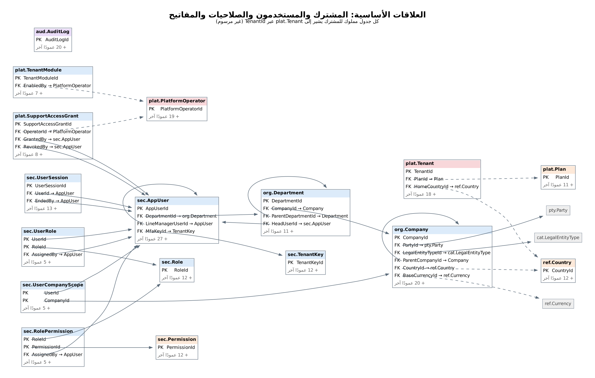

## 4. الاتفاقيات (Conventions)

| الموضوع | الاتفاق |
|---|---|
| **المفاتيح** | `<Table>Id BIGINT IDENTITY` (و`INT` للكتالوجات الصغيرة بعلامة `int`، 48 جدولًا)؛ المفتاح الأساسي مجمّع على المعرّف وحده؛ الفرادة المركّبة `(TenantId, Id)` هدفًا للمراجع |
| **المعرّف العام** | `PublicId UNIQUEIDENTIFIER DEFAULT NEWSEQUENTIALID()` على جذور التجميعات المعرَّضة (علامة `public`)، فريد على مستوى القاعدة؛ **لا يُعرَّض `BIGINT` عبر API** |
| **التدقيق** | `CreatedAt/CreatedBy/UpdatedAt/UpdatedBy` (UTC `DATETIME2(3)`) + `RowVersion ROWVERSION` للتزامن المتفائل (161 جدولًا) |
| **للإضافة فقط** | علامة `append`: بلا `UpdatedAt/By` وبلا `RowVersion`؛ **تُفرض بالمنح** (`INSERT` و`SELECT` فقط) و**`DENY UPDATE`** — §9 |
| **الحذف** | **لا حذف فعلي** إلا على الجداول المعلَّمة `deletable` (36 جدولًا: وسطاء وجلسات ورموز مؤقتة…)؛ الباقي بالحالة (أرشفة/إلغاء/استبدال) |
| **المبالغ** | `DECIMAL(19,4)` + عمود `CurrencyId` مجاور؛ لا مبلغ بلا عملة. أسعار الصرف `DECIMAL(19,8)` |
| **النسب** | `DECIMAL(9,6)` بنقاط مئوية (1.5 = 1.5%) |
| **القوائم المغلقة** | `VARCHAR` + `CHECK ... IN (...)` (لا جداول بحث لقيم منطق ثابت)؛ القوائم القابلة للتخصيص لكل مشترك في `cat.LookupList/LookupItem` أو كتالوجات مسمّاة |
| **القوائم المتعددة القيم** | جدول وسيط؛ `set{}` (نص مفصول بفواصل) لقوائم صغيرة جدًا ثابتة فقط |
| **التواريخ** | ميلادي `DATE`؛ الهجري نص `NVARCHAR(20)` حيث تفرضه المستندات |
| **الأسماء** | مخططات بحروف صغيرة (`fac`)، جداول `PascalCase` مفرد، قيود `PK_/UQ_/IX_/FK_/CK_/DF_<Table>_…` ≤ 128 حرفًا (ومن 60 حرفًا يُقصَّر بلاحقة تجزئة في PostgreSQL) |
| **الكتالوجات** | علامة `catalog`: `Code, NameAr, NameEn, Description, IsActive, IsSystem, IsLocked, SortOrder, SeedKey, ExternalCode` + فرادة `(Tenant,Code)` و`(Tenant,SeedKey)`؛ `SeedKey` يربط صف البذرة عبر الإصدارات |
| **حقول الربط الخارجي** | `ExternalCode`/`ExternalRef` نصية عامة لربط ERP والبنوك لاحقًا دون تغيير بنيوي |

---

## 5. التاريخ والمراجعات ومصدر القيمة

### 5.1 الصفوف المراجَعة `rev` (13 جدولًا)
الأعمدة: `FromRevision`, `ToRevision` (NULL = الجاري), `SupersedesId`. التعديل **يُنشئ صفًا جديدًا** ويغلق السابق. الفرادة تُصفّى على الجاري (`WHERE ToRevision IS NULL`). التسهيل يملك رأسًا واحدًا + `fac.FacilityRevision` (مسودة/تقديم/رفض/اعتماد؛ مراجعة مفتوحة واحدة لكل تسهيل عبر فهرس فريد مصفّى).

### 5.2 ختم المصدر `src` (11 جدولًا)
كل قيمة ائتمانية مقروءة من اتفاقية تحمل: `SourceDocumentId`, `SourcePage`, `ReadFromScan`, `OriginalText`, `NoSourceReason`, `Confidence` (`ENTERED_NO_DOCUMENT` / … / `CONFIRMED_AGAINST_ORIGINAL`), `VerifiedBy/On`, `ConflictId → fac.ValueConflict`.
- قيد `CHECK`: إما مستند وصفحة، وإما `ENTERED_NO_DOCUMENT` — فلا قيمة بلا أصل أو إقرار بغيابه.
- «مؤكَّد مقابل الأصل» يستلزم مدققًا وتاريخًا.
- التعارض بين مستندين يُسجَّل في `fac.ValueConflict` ولا يُحلّ بالتخمين.

### 5.3 التدقيق وحدوده
- `aud.AuditLog`: من/متى/ماذا (`BeforeJson/AfterJson` مع إخفاء الحقول المقيَّدة)/من أي عنوان وارتباط (`IpAddress`, `CorrelationId`)؛ إدراج فقط، بتصنيف (`Category`) وشدة (`Severity`) ونتيجة (`Result`).
- **سلسلة البصمات** اختيارية لكل مشترك (`ChainSeq`, `PrevHash`, `RowHash` = SHA-256 للسابق مع تمثيل قانوني للصف) (FR-PLT-025). **حدّها:** السلسلة وحدها **لا تكشف العبث**؛ من يملك تعديل السجل يستطيع إعادة حساب البصمات كلها. لذلك يلزم **تثبيت جذر السلسلة خارج القاعدة** دوريًا (مرساة في تخزين غير قابل للتعديل أو تجزئة منشورة)، ومراقبة انقطاع التسلسل. موقع المرساة قرار مفتوح (O-13).
- `aud.SensitiveAccessLog`: كل كشف أو تصدير أو عرض صورة هوية بسبب إلزامي.
- `wfl.RequestAction`: سجل إجراءات الطلب (الخط الزمني للمستخدم) — **غير** سجل التدقيق الأمني.
- `sec.KeyEvent`: دورة حياة المفاتيح.

---

## 6. حماية البيانات الحساسة

### 6.1 ما يُخزَّن
| الجدول | العمود المشفّر | مفتاح البيانات | مفتاح الفهرسة (HMAC) |
|---|---|---|---|
| `pty.IdentityDocument` | `NumberEnc` | `EncKeyId` | `HashKeyId` ← `NumberHash` |
| `pty.PartyCustomField` | `ValueEnc` (للحقل المقيَّد) | `EncKeyId` | — |
| `acc.BankAccount` | `AccountNoEnc`، `IbanEnc` | `EncKeyId` | `HashKeyId` ← `AccountNoHash`، `IbanHash` |
| `lc.LcTerms` | `BeneficiaryAccountIbanEnc` | `EncKeyId` | `HashKeyId` ← `BeneficiaryAccountIbanHash` |
| `sec.AppUser` | `MfaSecretEnc` | `MfaKeyId` | — |
| `plat.PlatformOperator` | `MfaSecretEnc` | `MfaKeyRef` (مفتاح المنصة في KMS وإصداره) | — |
| `sec.TenantKey` | `WrappedKey` | مغلَّف بمفتاح رئيسي خارج القاعدة (`MasterKeyRef`) | — |

أرقام الهوية والإقامة والجواز **لا تُعرض ولا تُخزَّن صريحة**؛ القناع `NumberMask` (آخر 4) للعرض، والبصمة `NumberHash` للبحث بالتطابق وكشف التكرار دون فك التشفير.

### 6.2 شكل الغلاف المشفّر (إلزامي لطبقة التطبيق)
كل قيمة مشفّرة في عمود `bin` تُخزَّن بهذه الصيغة:

| الجزء | الحجم | المحتوى |
|---|---|---|
| إصدار الصيغة | 1 بايت | `0x01` |
| الـnonce | 12 بايت | عشوائي، **فريد لكل عملية تشفير** (لا عداد يُعاد استخدامه) |
| النص المشفّر | متغيّر | AES-256-GCM بمفتاح `DATA` المُشار إليه بعمود المفتاح في الصف |
| الوسم (tag) | 16 بايت | وسم GCM للتحقق من السلامة |

- **أدنى طول للغلاف = 29 بايت**، ويفرضه `CHECK DATALENGTH(...) >= 29` على كل عمود مشفّر.
- **AAD** (البيانات المصادَقة غير المشفّرة): `TenantId` (4 بايت، big-endian) ‖ اسم الجدول ‖ اسم العمود ‖ **المعرّف الثابت للصف**. هذا يمنع نقل نص مشفّر من مشترك إلى آخر أو من عمود إلى آخر. المعرّف الثابت يُحدَّد لكل جدول في S0 (إن لم يكن للجدول `PublicId` يُستعمل المفتاح الأساسي بعد الإدراج، فتُكتب القيمة المشفّرة في المعاملة نفسها).
- **إصدار المفتاح:** عمود المفتاح في الصف (`EncKeyId`/`MfaKeyId`/`MfaKeyRef`) يحدد نسخة المفتاح التي شُفِّر بها الصف. القيد `CHECK` يفرض وجود عمود المفتاح عند وجود القيمة المشفّرة.
- **الطول والصيغة يتحقق منهما التطبيق**؛ القاعدة تفرض الحد الأدنى فقط.

### 6.3 التدوير وإعادة التشفير
1. إنشاء صف `sec.TenantKey` جديد بحالة `PENDING` ثم `ACTIVE` (فرادة `ACTIVE` لكل غرض).
2. الصفوف الجديدة تُشفَّر بالمفتاح `ACTIVE`، والقديم يصير `RETIRING`.
3. مهمة خلفية تعيد تشفير كل صف، فيتغير `EncKeyId` إلى المفتاح الجديد داخل المعاملة نفسها التي تكتب الغلاف.
4. تقدّم الإعادة = عدد الصفوف التي ما زالت تشير إلى المفتاح `RETIRING`؛ عند الصفر يصير `RETIRED`.
5. **فهرس HMAC** (`HashKeyId`) يتطلب إعادة حساب البصمات ثم إعادة بناء الفهرس؛ لا يُدار بالتشفير المعتاد.

### 6.4 مفاتيح وأغلفة أخرى
| العنصر | التصميم |
|---|---|
| **المفاتيح** | `sec.TenantKey`: لكل مشترك مفاتيح بأغراض `DATA` / `BLIND_INDEX` / `FILE` وإصدارات؛ `WrappedKey` **ملفوف بمفتاح رئيسي خارج القاعدة**؛ مفتاح `ACTIVE` واحد لكل غرض؛ التدوير بحالة `RETIRING` |
| **كلمات المرور والرموز** | تُخزَّن **بصمات** فقط (`PasswordHash`, `TokenHash`, `CodeHash`) وأسرار MFA مشفّرة؛ `sec.UserPasswordHistory` لمنع إعادة الاستخدام |
| **حجب عن التقارير** | `DENY SELECT` على 28 عمودًا موسومة `sens=restricted` للدور `tp_readonly` (`006`) |
| **صور الهوية** | ملفات في مخزن خارج القاعدة: `doc.DocumentVersion` بـ`StorageKey` معزول لكل مشترك، و`Sha256` يحسبه الخادم، و`KeyId → sec.TenantKey` بمفتاح `FILE`، وفحص `ScanStatus` — لا يُنزَّل إلا `CLEAN`. عرضها بصلاحية `party.identity.image.view` وسبب |
| **من يرى الأرقام كاملة** | مدير الخزينة وموظف التسهيلات فقط (`04` §9.4)؛ غيرهما يرى `NumberMask`. يُطبَّق بالصلاحيات في طبقة التطبيق، والقاعدة تضمن أن لا شيء يُقرأ نصًّا صريحًا |

⚠ لا أسرار في النماذج: لا مفاتيح، ولا قيم افتراضية لكلمات مرور. البيانات الشخصية المقروءة من الاتفاقيات المرفوعة **لا تدخل الوثائق ولا البذور**.

---

## 7. استراتيجية سلامة البيانات

| المستوى | ما يضمنه | أين |
|---|---|---|
| **مرجعي** | كل مرجع مفتاح أجنبي (750)، والمركّب يمنع العبور بين المشتركين والتجميعات | `002_foreign_keys.sql` |
| **حالة** | قيم الحالات والأنواع `CHECK IN` | `001_tables.sql` |
| **تناسق الحقول** | مبلغ مطلق أو نسبة من الأب (حسب `AmountBasis`)، ترتيب التواريخ، `ExposureAmount >= Amount`، `LcClass` يقيّد الحقول، **لا إكمال طلب بلا إقفال من الخزينة** (§11)، وأطوال الأغلفة المشفّرة | `CHECK` على الجداول |
| **فرادة** | رموز الكتالوج، الرقم الداخلي، **فريد بين الجاري فقط** (`WHERE ToRevision IS NULL`)، **حجز فعّال واحد لكل طلب**، **تحويل حجز واحد لكل استخدام**، وإعادة إرسال أمر الحجز لا تكرّره (`IdempotencyKey` فريد)، و**دورة عمل واحدة مفتوحة** بالفهرس المصفّى | `UNIQUE` وفهارس فريدة مصفّاة |
| **تزامن** | `RowVersion` + مقارنة في التحديث | طبقة التطبيق |
| **منطق معقّد يبقى في التطبيق** (مذكور برمز `BR-…` في تعليق العمود) | عمق شجرة الحدود ≤ 6 وبلا حلقات · سقف الابن ≤ الأب · حساب المتاح `Available` · إعادة حساب `EffectiveAmount` · صلاحيات التفويض · فحص التعارض بين المفوّضين · **معاملة الحجز** (§7.1) | خدمات `fac.*` وخدمات التطبيق |

### 7.1 الحجز الذري للحدود (شرط في طبقة التطبيق)
الحجز والتحويل والتحرير عمليات مالية، والقيود وحدها لا تمنع التجاوز تحت التزامن:
- كل عملية في **معاملة قصيرة واحدة** تبدأ بقفل صف الحد (`UPDLOCK, ROWLOCK` على `fac.Limit`) ثم تحسب المتاح وتكتب `LimitReservation` و`LimitMovement` و`OutboxEvent` معًا.
- مفتاح `IdempotencyKey` يضمن أن إعادة الإرسال لا تكرر الحجز.
- **مستوى العزل:** `READ_COMMITTED` مع القفل الصريح؛ لا يُعتمد `SERIALIZABLE` عامًّا لأنه يخنق الأداء.
- **المتاح لا يُخزَّن وحده:** `reconciliation` دوري يعيد حسابه من `LimitMovement`.
- **الاختبار المطلوب:** 100 طلب متزامن على الحد نفسه، بنجاح واحد أو نتائج محددة بدقة (S2).
- أخطاء الأعمال تُعاد كرموز ثابتة للـ API لا كنصوص SQL.

---

## 8. الفهرسة

| النوع | الاستخدام |
|---|---|
| **تلقائي لكل مفتاح أجنبي** | يُنشأ ما لم يغطّه مفتاح/فهرس أو وُسم `noidx` — يمنع الأقفال الطويلة عند الحذف/التحديث ويُسرّع الربط. أعمدة المفاتيح ومراجع الغلاف `noidx` لأنها لا تُبحث |
| **`TenantId` أولًا** في كل فهرس لجداول المشترك | توافق مع مرشّح RLS |
| **مصفّاة (196)** | استحقاقات وتنبيهات على الحالات الحية فقط |
| **`INCLUDE` (47)** | لوحات التوفر وتقارير الاستحقاق دون رجوع للجدول |
| **بحث نصي كامل** | `wfl.Request.SearchText` — اختياري `db/static/040_fulltext_optional.sql` (يتطلب ميزة Full-Text Search) |

قيود SQL Server التي فُحصت آليًا: لا مفتاح فهرس يتجاوز **1,700 بايت** ولا 16 عمودًا؛ المسندات المصفّاة تستعمل `=` و`<>` و`IN` و`IS [NOT] NULL` و`AND` فقط (**لا `OR`**)؛ مفتاحان فقط بـ`ON DELETE CASCADE` فلا مسارات تعاقب متعددة.

> ملاحظة التنفيذ: الفهارس المصفّاة والأعمدة المحسوبة المخزَّنة تتطلب `QUOTED_IDENTIFIER ON` وخيارات ANSI. أدوات `sqlcmd` تفترضها `OFF`؛ لذلك يبدأ كل ملف مولَّد وثابت بضبطها ويُشغَّل النشر بالخيار `-I`.

---

## 9. الأدوار والصلاحيات (على مستوى القاعدة)

### 9.1 الأدوار
| الدور | الغرض | الصلاحيات (ملخص؛ التفصيل الجدولي في 007) |
|---|---|---|
| `tp_app` | حساب تشغيل تطبيق المشترك | **المشترك والمختلط:** `SELECT, INSERT, UPDATE` (RLS يقصر الصفوف على المشترك) · **العالمي:** `SELECT` فقط · **للإضافة فقط:** `SELECT, INSERT` · **`noapp`:** لا شيء · **`plat.v_CurrentTenant`:** `SELECT` · الحذف الفعلي على `deletable` فقط · `EXECUTE` على `sec.usp_SetSessionContext` فقط · لا `REFERENCES` · لا منح على مستوى المخطط |
| `tp_platform` | مشغّلو المنصة | **العالمي والمختلط:** `SELECT, INSERT, UPDATE` (للإضافة فقط: `SELECT, INSERT`) · **جداول المشتركين: لا شيء** · لا حذف · `DENY UPDATE` على جداول الإضافة فقط |
| `tp_auth` | داخلي بلا تسجيل دخول | `SELECT` على `sec.AppUser` و`plat.Tenant` فقط؛ يُنفَّذ به `usp_SetSessionContext` فقط (`EXECUTE AS`) |
| `tp_readonly` | تقارير/تحليل | `SELECT` على كل المخططات دون الأعمدة الحساسة (`006`)؛ `DENY SELECT` على `plat.PlatformOperator` كليًا |
| `tp_migrator` | النشر والترحيل | يُنشأ الدور فقط؛ **لا منح تشغيلية له هنا** (تُحدَّد مع أداة الترحيل O-2)، ويُستعمل حساب مالك القاعدة أثناء النشر |


### 9.2 من أين تأتي المنح
| الملف | المحتوى |
|---|---|
| `db/static/020_roles_and_grants.sql` | إنشاء الأدوار، `tp_auth`، قراءة `tp_readonly`، الحجب عن `PlatformOperator` |
| `db/generated/tsql/005_delete_grants.sql` | الحذف على الجداول `deletable` لـ`tp_app`، و`DENY UPDATE` على جداول الإضافة فقط |
| `db/generated/tsql/006_sensitive_columns.sql` | `DENY SELECT` على 28 عمودًا لـ`tp_readonly` |
| `db/generated/tsql/007_table_grants.sql` | **المنح الجدولية الصريحة لـ`tp_app` و`tp_platform`** (206 منحة) |
| `db/static/025_tenant_views.sql` | عرض `plat.v_CurrentTenant` لـ`tp_app` |
| `db/static/030_session_context.sql` | الإجراء وتنفيذه بـ`tp_auth` ومنحه لـ`tp_app` |

### 9.3 التحقق الثابت من الصلاحيات
`tools/dbgen/check_grants.py` يقرأ النموذج والملفات المولَّدة والثابتة ويفشل عند المخالفة. القواعد:
- **R1** لا كتابة لـ`tp_app` على جدول عالمي. **R2** لا منح لـ`tp_app` على `noapp`.
- **R3** لا منح مباشر لـ`tp_platform` على جدول مشترك. **R4** لا `REFERENCES` لدور تطبيقي.
- **R5** لا منح على مستوى المخطط لـ`tp_app`/`tp_platform` (استثناء موثَّق: مخطط `rls` للقراءة).
- **R6** `tp_auth` يملك `SELECT` على جدولين فقط. **R7** عدد أعمدة `sens=restricted` = عدد عبارات `DENY` لـ`tp_readonly`.
- **R8** كل جدول فيه عمود مشفّر يملك مفتاح بيانات، وكل بصمة فهرسة مفتاح HMAC. **R9** لا `UPDATE` على جدول للإضافة فقط.
- **R10** كل ملف في `deploy.sql` موجود، ومنح مخطط `rls` يأتي بعد إنشائه في `010` (وقد كان هذا خطأ في الترتيب قبل المراجعة فاكتُشف وصُحِّح).

**اختباره:** حُقنت ثلاث مخالفات متعمدة في `007` (كتابة على `ref.Currency`، ومنح على `plat.Tenant`، ومنح مباشر لـ`tp_platform` على `org.Company`) فاكتشفها الفحص كلها ثم أُزيلت. الفحص الثابت **لا يثبت** أن المحرك ينفّذ المنح كما هي؛ ذلك في S0.

### 9.4 قواعد عامة
- **لا يملك `tp_app` حذفًا** على أي جدول غير مصرَّح به.
- `DENY` يقيّد الأعضاء بالدور؛ مالكو القاعدة (`db_owner`/`sysadmin`) خارج هذا النموذج ويُحصرون تشغيليًا.
- حساب خدمة واحد للتطبيق (`tp_app`)، وحساب منفصل لمهام المنصة (`tp_platform`)، ولا يُشارَك بيانات الاعتماد.
- التطبيق لا يملك `ALTER` على السياسات أو المخططات.

---

## 10. ERD والمواصفات التفصيلية حسب الوحدة

كل مخطط في هذا القسم **مُولَّد من النموذج نفسه** (`db/model`)، فلا ينحرف عن قاعدة البيانات. الترتيب: أولًا خريطة المخططات، ثم مخطط كل مجموعة، ثم جدول مواصفات الجداول، ثم جدول علاقات كل مفتاح أجنبي.

### 10.1 خريطة المخططات (Schema Map)

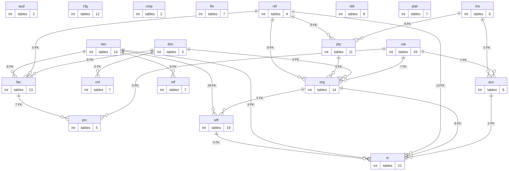

### 10.2 قراءة المخططات

**مفتاح الرسم (معيار Crow's Foot):** `PK` المفتاح الأساسي · `FK` مفتاح أجنبي · `UK` فريد. طرف الأب `||` = واحد إلزامي، وطرف الابن `}o` = صفر أو أكثر؛ الاختياري `|o` = واحد أو لا شيء. اسم العلاقة = أعمدة الربط.

الإحاطة: كل جدول مملوك للمشترك يحمل `TenantId` ويشير إلى `plat.Tenant`، ولم يُرسم هذا الربط في كل مخطط. العلاقات المرسومة **مفاتيح أجنبية فعلية**، وكل علاقة مكتوبة في جدول العلاقات بإلزامها ونطاقها وسلوك حذفها. أعمدة الإثبات والتدقيق (`SourceDocumentId` و`VerifiedBy` و`ConflictId` و`SupersedesId` و`CreatedBy` و`UpdatedBy`…) لا تُرسم في المخطط لتقليل الازدحام، وترد كاملة في جداول العلاقات. الجداول خارج المجموعة تظهر بمفتاحها فقط.

### 10.3 م0 · المنصة والهوية والتدقيق

#### م0 · المشترك والاشتراكات والمشغّلون

*Tenancy & platform operators* — 7 جدولًا

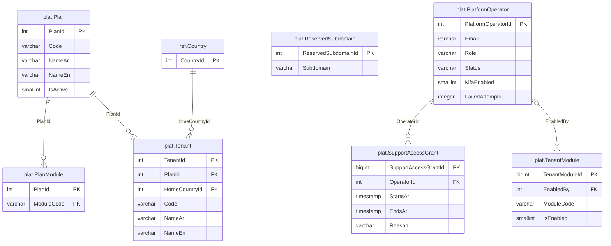

**مواصفات الجداول**

| الجدول | الغرض | PK | FK | UQ | CHECK | أعمدة أخرى |
|---|---|---|---|---|---|---|
| `plat.Plan` | باقة: حزمة وحدات وحدود ناعمة (FR-PLT-003/004، Q-PLT-11) | PlanId | 0 | 0 | 3 | 10 |
| `plat.PlanModule` | وحدات الباقة (يحل محل Plan.IncludedModules json) | PlanId, ModuleCode | 1 | 0 | 0 | 4 |
| `plat.PlatformOperator` | لا يقرؤه تطبيق المشترك (tp_app) · حساب مشغّل المنصة: مخزن هوية منفصل عن AppUser (FR-PLT-006) | PlatformOperatorId | 0 | 0 | 6 | 18 |
| `plat.ReservedSubdomain` | عناوين فرعية محجوزة للنظام: www · admin · api · app… (FR-PLT-046) | ReservedSubdomainId | 0 | 0 | 1 | 5 |
| `plat.SupportAccessGrant` | وصول الدعم المؤقت يفعّله مدير حساب المشترك (FR-PLT-007، BR-PLT-017) | SupportAccessGrantId | 3 | 0 | 1 | 7 |
| `plat.Tenant` | لا وصول مباشر لتطبيق المشترك (يقرأ صفّه عبر plat.v_CurrentTenant) · جذر العزل: المشترك (FR-PLT-001/002/046، BR-PLT-001/002) | TenantId | 2 | 0 | 6 | 17 |
| `plat.TenantModule` | الوحدات المفعّلة للمشترك (FR-PLT-003، BR-PLT-003) | TenantModuleId | 1 | 0 | 1 | 6 |

**العلاقات (المفاتيح الأجنبية)**

| الطفل (الجدول.العمود) | الأب | العلاقة | الإلزام | النطاق | الحذف | أعمدة النطاق |
|---|---|---|---|---|---|---|
| `plat.PlanModule.PlanId` | `plat.Plan` | 1 : N | إلزامي | عام | قيد | — |
| `plat.SupportAccessGrant.OperatorId` | `plat.PlatformOperator` | 1 : N | إلزامي | مرجع عام | قيد | — |
| `plat.SupportAccessGrant.GrantedBy` | `sec.AppUser` | 1 : N | إلزامي | مشترك · مركّب | قيد | — |
| `plat.SupportAccessGrant.RevokedBy` | `sec.AppUser` | 1 : N | اختياري | مشترك · مركّب | قيد | — |
| `plat.Tenant.PlanId` | `plat.Plan` | 1 : N | إلزامي | عام | قيد | — |
| `plat.Tenant.HomeCountryId` | `ref.Country` | 1 : N | إلزامي | عام | قيد | — |
| `plat.TenantModule.EnabledBy` | `plat.PlatformOperator` | 1 : N | اختياري | مرجع عام | قيد | — |

#### م0 · الهوية والصلاحيات

*Identity & authorisation* — 7 جدولًا

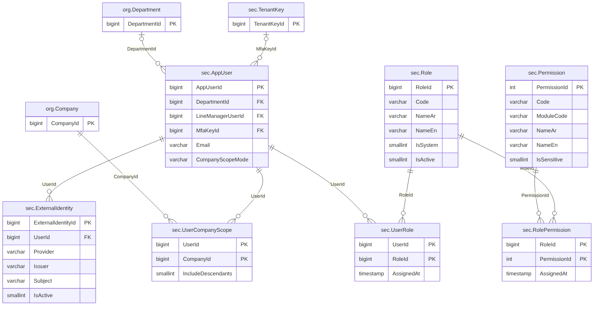

**مواصفات الجداول**

| الجدول | الغرض | PK | FK | UQ | CHECK | أعمدة أخرى |
|---|---|---|---|---|---|---|
| `sec.AppUser` | مستخدم بوابة المشترك (FR-PLT-010..016، BR-PLT-004..006) | AppUserId | 3 | 0 | 10 | 26 |
| `sec.Role` | دور يخصصه المشترك أو مبذور (FR-PLT-018) | RoleId | 0 | 0 | 1 | 11 |
| `sec.Permission` | كتالوج الصلاحيات تملكه المنصة؛ لا يضيف المشترك صلاحية (FR-PLT-017) | PermissionId | 0 | 0 | 1 | 11 |
| `sec.RolePermission` | ربط دور-صلاحية؛ PERMISSION_LOCKED يُفرض في الخدمة (BR-PLT-019) | RoleId, PermissionId | 3 | 0 | 0 | 5 |
| `sec.UserRole` | ربط مستخدم-دور؛ اتحاد الصلاحيات (BR-PLT-007، FR-PLT-018) | UserId, RoleId | 3 | 0 | 0 | 5 |
| `sec.UserCompanyScope` | شركات يراها المستخدم؛ تُهمل إن كان CompanyScopeMode=ALL (FR-PLT-020) | UserId, CompanyId | 2 | 0 | 0 | 5 |
| `sec.ExternalIdentity` | ربط هوية خارجية OIDC/Entra بالمستخدم؛ جاهزية فقط (FR-PLT-015، §11) | ExternalIdentityId | 1 | 0 | 0 | 8 |

**العلاقات (المفاتيح الأجنبية)**

| الطفل (الجدول.العمود) | الأب | العلاقة | الإلزام | النطاق | الحذف | أعمدة النطاق |
|---|---|---|---|---|---|---|
| `sec.AppUser.DepartmentId` | `org.Department` | 1 : N | اختياري | مشترك · مركّب | قيد | — |
| `sec.AppUser.LineManagerUserId` | `sec.AppUser` | 1 : N | اختياري | مشترك · مركّب | قيد | — |
| `sec.AppUser.MfaKeyId` | `sec.TenantKey` | 1 : N | اختياري | مشترك · مركّب | قيد | — |
| `sec.RolePermission.RoleId` | `sec.Role` | 1 : N | إلزامي | مشترك · مركّب | قيد | — |
| `sec.RolePermission.PermissionId` | `sec.Permission` | 1 : N | إلزامي | مرجع عام | قيد | — |
| `sec.RolePermission.AssignedBy` | `sec.AppUser` | 1 : N | اختياري | مشترك · مركّب | قيد | — |
| `sec.UserRole.UserId` | `sec.AppUser` | 1 : N | إلزامي | مشترك · مركّب | قيد | — |
| `sec.UserRole.RoleId` | `sec.Role` | 1 : N | إلزامي | مشترك · مركّب | قيد | — |
| `sec.UserRole.AssignedBy` | `sec.AppUser` | 1 : N | اختياري | مشترك · مركّب | قيد | — |
| `sec.UserCompanyScope.UserId` | `sec.AppUser` | 1 : N | إلزامي | مشترك · مركّب | قيد | — |
| `sec.UserCompanyScope.CompanyId` | `org.Company` | 1 : N | إلزامي | مشترك · مركّب | قيد | — |
| `sec.ExternalIdentity.UserId` | `sec.AppUser` | 1 : N | إلزامي | مشترك · مركّب | قيد | — |

#### م0 · الجلسات والمفاتيح والمحاولات

*Sessions, keys & attempts* — 7 جدولًا

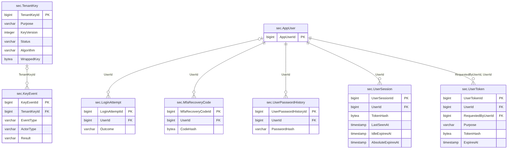

**مواصفات الجداول**

| الجدول | الغرض | PK | FK | UQ | CHECK | أعمدة أخرى |
|---|---|---|---|---|---|---|
| `sec.UserSession` | جلسات المستخدم: خمول 30 دقيقة ومطلقة 12 ساعة (FR-PLT-014) | UserSessionId | 2 | 0 | 1 | 12 |
| `sec.LoginAttempt` | محاولات الدخول لخنق المعدل ونوافذ القفل؛ الأثر الدائم في aud.AuditLog (BR-PLT-005) | LoginAttemptId | 1 | 0 | 1 | 5 |
| `sec.MfaRecoveryCode` | 10 رموز استرداد لمرة واحدة مُجزَّأة (FR-PLT-011، BR-PLT-006؛ بديل AppUser.RecoveryCodesHash json) | MfaRecoveryCodeId | 1 | 0 | 0 | 6 |
| `sec.UserToken` | رابط دعوة (48 ساعة) أو إعادة تعيين كلمة المرور (30 دقيقة) لمرة واحدة (FR-PLT-013) | UserTokenId | 2 | 0 | 0 | 12 |
| `sec.UserPasswordHistory` | آخر 5 كلمات مرور لمنع إعادة استعمالها (BR-PLT-004) | UserPasswordHistoryId | 1 | 0 | 0 | 2 |
| `sec.TenantKey` | سجل مفاتيح المشترك؛ المفتاح ملفوف بمفتاح رئيسي خارج القاعدة (FR-PLT-037، BR-PLT-015) | TenantKeyId | 0 | 0 | 1 | 11 |
| `sec.KeyEvent` | سجل أحداث المفاتيح: إنشاء وتدوير وإبطال (FR-PLT-037؛ شدة عالية BR-PLT-009) | KeyEventId | 1 | 0 | 0 | 7 |

**العلاقات (المفاتيح الأجنبية)**

| الطفل (الجدول.العمود) | الأب | العلاقة | الإلزام | النطاق | الحذف | أعمدة النطاق |
|---|---|---|---|---|---|---|
| `sec.UserSession.UserId` | `sec.AppUser` | 1 : N | إلزامي | مشترك · مركّب | قيد | — |
| `sec.UserSession.EndedBy` | `sec.AppUser` | 1 : N | اختياري | مشترك · مركّب | قيد | — |
| `sec.LoginAttempt.UserId` | `sec.AppUser` | 1 : N | اختياري | مشترك · مركّب | قيد | — |
| `sec.MfaRecoveryCode.UserId` | `sec.AppUser` | 1 : N | إلزامي | مشترك · مركّب | قيد | — |
| `sec.UserToken.UserId` | `sec.AppUser` | 1 : N | إلزامي | مشترك · مركّب | قيد | — |
| `sec.UserToken.RequestedByUserId` | `sec.AppUser` | 1 : N | اختياري | مشترك · مركّب | قيد | — |
| `sec.UserPasswordHistory.UserId` | `sec.AppUser` | 1 : N | إلزامي | مشترك · مركّب | قيد | — |
| `sec.KeyEvent.TenantKeyId` | `sec.TenantKey` | 1 : N | اختياري | مشترك · مركّب | قيد | — |

#### م0 · التدقيق والمستندات

*Audit & documents* — 5 جدولًا

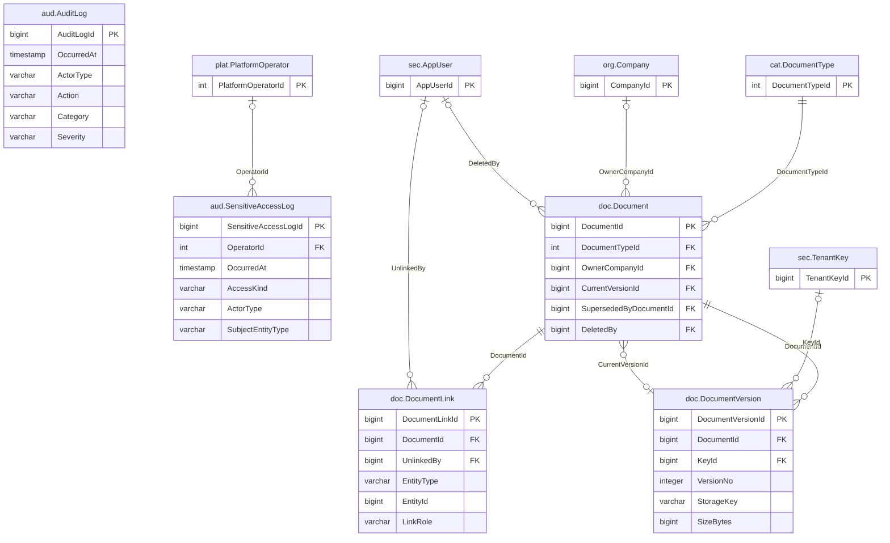

**مواصفات الجداول**

| الجدول | الغرض | PK | FK | UQ | CHECK | أعمدة أخرى |
|---|---|---|---|---|---|---|
| `aud.AuditLog` | للإدراج فقط؛ TenantId الفارغ = حدث منصة لا يراه أي مشترك؛ سياسة RLS خاصة (BR-PLT-001/009) | AuditLogId | 0 | 0 | 0 | 19 |
| `aud.SensitiveAccessLog` | كشف الهويات والصور والتصدير والتنزيل المقيّد؛ لكشف الشذوذ >20/ساعة وR-PLT-3 (BR-PTY-009) | SensitiveAccessLogId | 2 | 0 | 3 | 15 |
| `doc.Document` | المستند المنطقي: بيانات المستند وحالته؛ الملف في doc.DocumentVersion (FR-PLT-027/028، BR-PLT-011) | DocumentId | 5 | 0 | 4 | 15 |
| `doc.DocumentLink` | ربط مستند بأي كيان بدور وصفحة مرجعية؛ إلغاء الربط منطقي (FR-PLT-028) | DocumentLinkId | 2 | 0 | 1 | 9 |
| `doc.DocumentVersion` | إصدار ثابت من الملف؛ لا يُستبدل بل يُنشأ إصدار جديد (FR-PLT-027، BR-PLT-011) | DocumentVersionId | 2 | 0 | 3 | 14 |

**العلاقات (المفاتيح الأجنبية)**

| الطفل (الجدول.العمود) | الأب | العلاقة | الإلزام | النطاق | الحذف | أعمدة النطاق |
|---|---|---|---|---|---|---|
| `aud.SensitiveAccessLog.ActorUserId` | `sec.AppUser` | 1 : N | اختياري | مشترك · مركّب | قيد | — |
| `aud.SensitiveAccessLog.OperatorId` | `plat.PlatformOperator` | 1 : N | اختياري | مرجع عام | قيد | — |
| `doc.Document.DocumentTypeId` | `cat.DocumentType` | 1 : N | إلزامي | مشترك · مركّب | قيد | — |
| `doc.Document.OwnerCompanyId` | `org.Company` | 1 : N | اختياري | مشترك · مركّب | قيد | — |
| `doc.Document.CurrentVersionId` | `doc.DocumentVersion` | 1 : N | اختياري | مشترك · مركّب | قيد | — |
| `doc.Document.SupersededByDocumentId` | `doc.Document` | 1 : N | اختياري | مشترك · مركّب | قيد | — |
| `doc.Document.DeletedBy` | `sec.AppUser` | 1 : N | اختياري | مشترك · مركّب | قيد | — |
| `doc.DocumentLink.DocumentId` | `doc.Document` | 1 : N | إلزامي | مشترك · مركّب | قيد | — |
| `doc.DocumentLink.UnlinkedBy` | `sec.AppUser` | 1 : N | اختياري | مشترك · مركّب | قيد | — |
| `doc.DocumentVersion.DocumentId` | `doc.Document` | 1 : N | إلزامي | مشترك · مركّب | قيد | — |
| `doc.DocumentVersion.KeyId` | `sec.TenantKey` | 1 : N | اختياري | مشترك · مركّب | قيد | — |

#### م0 · الإعدادات والمهام الخلفية (1/2)

*Configuration & background jobs* — 7 جدولًا

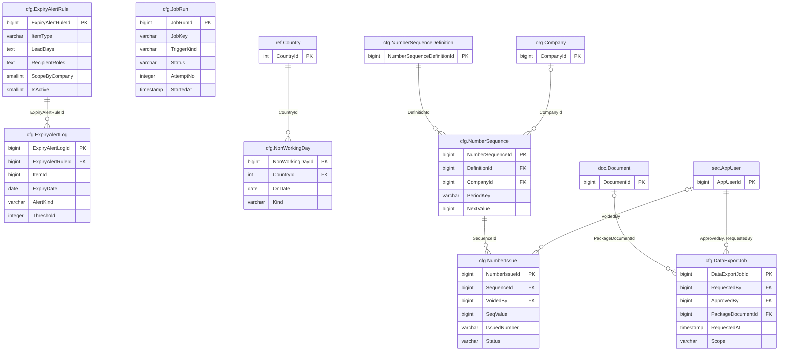

**مواصفات الجداول**

| الجدول | الغرض | PK | FK | UQ | CHECK | أعمدة أخرى |
|---|---|---|---|---|---|---|
| `cfg.DataExportJob` | طلب تصدير بيانات المشترك (FR-PLT-039، BR-PLT-016) | DataExportJobId | 3 | 0 | 3 | 15 |
| `cfg.ExpiryAlertLog` | سجل التنبيهات المرسَلة: حدث واحد لكل (عنصر، عتبة) ولا تكرار في اليوم نفسه (FR-PLT-038) | ExpiryAlertLogId | 1 | 0 | 0 | 5 |
| `cfg.ExpiryAlertRule` | قاعدة تنبيه انتهاء لكل نوع عنصر (FR-PLT-038، BR-PLT-013) | ExpiryAlertRuleId | 0 | 0 | 1 | 10 |
| `cfg.JobRun` | سجل تشغيل المهام الخلفية: آخر تشغيل ومدته ونتيجته ظاهر لمدير الحساب (FR-PLT-044) | JobRunId | 0 | 0 | 3 | 14 |
| `cfg.NonWorkingDay` | يوم غير عمل؛ TenantId الفارغ = عطلة المنصة للقراءة فقط (FR-PLT-035، BR-PLT-014) | NonWorkingDayId | 1 | 0 | 0 | 7 |
| `cfg.NumberIssue` | الأرقام الصادرة؛ الملغى لا يُعاد استعماله (FR-PLT-026، BR-PLT-010) | NumberIssueId | 2 | 0 | 2 | 10 |
| `cfg.NumberSequence` | عدّاد لكل (تعريف، شركة اختيارية، فترة)؛ يُقفل صفه عند التخصيص داخل معاملة المستدعي (BR-PLT-010) | NumberSequenceId | 2 | 0 | 1 | 5 |

**العلاقات (المفاتيح الأجنبية)**

| الطفل (الجدول.العمود) | الأب | العلاقة | الإلزام | النطاق | الحذف | أعمدة النطاق |
|---|---|---|---|---|---|---|
| `cfg.DataExportJob.RequestedBy` | `sec.AppUser` | 1 : N | إلزامي | مشترك · مركّب | قيد | — |
| `cfg.DataExportJob.ApprovedBy` | `sec.AppUser` | 1 : N | اختياري | مشترك · مركّب | قيد | — |
| `cfg.DataExportJob.PackageDocumentId` | `doc.Document` | 1 : N | اختياري | مشترك · مركّب | قيد | — |
| `cfg.ExpiryAlertLog.ExpiryAlertRuleId` | `cfg.ExpiryAlertRule` | 1 : N | إلزامي | مشترك · مركّب | قيد | — |
| `cfg.NonWorkingDay.CountryId` | `ref.Country` | 1 : N | إلزامي | عام | قيد | — |
| `cfg.NumberIssue.SequenceId` | `cfg.NumberSequence` | 1 : N | إلزامي | مشترك · مركّب | قيد | — |
| `cfg.NumberIssue.VoidedBy` | `sec.AppUser` | 1 : N | اختياري | مشترك · مركّب | قيد | — |
| `cfg.NumberSequence.DefinitionId` | `cfg.NumberSequenceDefinition` | 1 : N | إلزامي | مشترك · مركّب | قيد | — |
| `cfg.NumberSequence.CompanyId` | `org.Company` | 1 : N | اختياري | مشترك · مركّب | قيد | — |

#### م0 · الإعدادات والمهام الخلفية (2/2)

*Configuration & background jobs* — 5 جدولًا

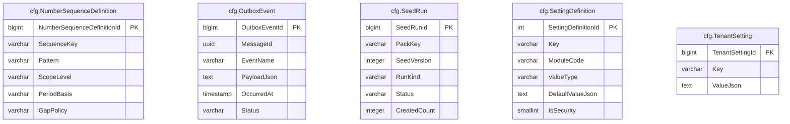

**مواصفات الجداول**

| الجدول | الغرض | PK | FK | UQ | CHECK | أعمدة أخرى |
|---|---|---|---|---|---|---|
| `cfg.NumberSequenceDefinition` | تعريف نوع الترقيم بصيغة بوسوم مثل {seq:000}-{erp}-{yy} (FR-PLT-026) | NumberSequenceDefinitionId | 0 | 0 | 2 | 11 |
| `cfg.OutboxEvent` | طابور الإرسال: تسليم مرة واحدة على الأقل؛ الحمولة معرّفات بلا بيانات مقيّدة (FR-PLT-042) | OutboxEventId | 0 | 0 | 2 | 17 |
| `cfg.SeedRun` | سجل تشغيل البذر المُرقَّم لكل حزمة؛ تكرار التشغيل لا يكرر شيئًا (FR-PLT-008) | SeedRunId | 0 | 0 | 1 | 11 |
| `cfg.SettingDefinition` | تعريف مفتاح إعداد بحدود المنصة الدنيا والقصوى (BR-PLT-018، FR-PLT-043) | SettingDefinitionId | 0 | 0 | 0 | 12 |
| `cfg.TenantSetting` | إعدادات المشترك: سياسات الأمان والمهل والعتبات وwork.start/work.end (FR-PLT-043) | TenantSettingId | 0 | 0 | 0 | 5 |

**العلاقات (المفاتيح الأجنبية)**

| الطفل (الجدول.العمود) | الأب | العلاقة | الإلزام | النطاق | الحذف | أعمدة النطاق |
|---|---|---|---|---|---|---|
| — | — | — | — | — | — | — |

### 10.4 م1 · الهيكل المؤسسي والأشخاص

#### م1 · الشركات والحوكمة

*Company structure & governance* — 7 جدولًا

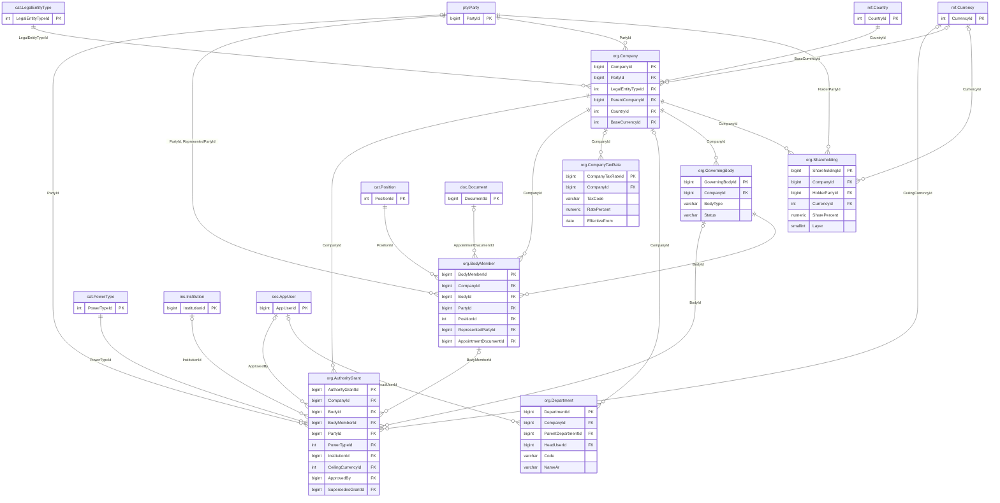

**مواصفات الجداول**

| الجدول | الغرض | PK | FK | UQ | CHECK | أعمدة أخرى |
|---|---|---|---|---|---|---|
| `org.Company` | الشركة: جذر الهيكل المؤسسي (FR-ORG-001..010، BR-ORG-001..004) | CompanyId | 5 | 0 | 4 | 19 |
| `org.CompanyTaxRate` | نسبة ضريبة بتاريخ سريان؛ CompanyId فارغ = افتراضي المشترك (FR-ORG-007، BR-ORG-005) | CompanyTaxRateId | 1 | 0 | 2 | 7 |
| `org.Department` | الإدارة (FR-ORG-014، BR-ORG-016، Q-ORG-09: على مستوى المشترك وشركة اختيارية) | DepartmentId | 3 | 0 | 1 | 10 |
| `org.Shareholding` | حصة ملكية بتاريخ سريان؛ المالك Party فرد أو جهة (FR-ORG-015..018، BR-ORG-006..008، G-7) | ShareholdingId | 4 | 0 | 5 | 10 |
| `org.GoverningBody` | هيئة حوكمة (FR-ORG-019، BR-ORG-009) | GoverningBodyId | 2 | 0 | 1 | 12 |
| `org.BodyMember` | عضوية في هيئة (FR-ORG-020، FR-ORG-021، BR-ORG-010) | BodyMemberId | 6 | 0 | 3 | 6 |
| `org.AuthorityGrant` | تفويض/منحة صلاحية لشركة (FR-ORG-023..028، BR-ORG-011..014) | AuthorityGrantId | 10 | 0 | 8 | 18 |

**العلاقات (المفاتيح الأجنبية)**

| الطفل (الجدول.العمود) | الأب | العلاقة | الإلزام | النطاق | الحذف | أعمدة النطاق |
|---|---|---|---|---|---|---|
| `org.Company.PartyId` | `pty.Party` | 1 : N | إلزامي | مشترك · مركّب | قيد | — |
| `org.Company.LegalEntityTypeId` | `cat.LegalEntityType` | 1 : N | إلزامي | مشترك · مركّب | قيد | — |
| `org.Company.ParentCompanyId` | `org.Company` | 1 : N | اختياري | مشترك · مركّب | قيد | — |
| `org.Company.CountryId` | `ref.Country` | 1 : N | إلزامي | مرجع عام | قيد | — |
| `org.Company.BaseCurrencyId` | `ref.Currency` | 1 : N | اختياري | مرجع عام | قيد | — |
| `org.CompanyTaxRate.CompanyId` | `org.Company` | 1 : N | اختياري | مشترك · مركّب | قيد | — |
| `org.Department.CompanyId` | `org.Company` | 1 : N | اختياري | مشترك · مركّب | قيد | — |
| `org.Department.ParentDepartmentId` | `org.Department` | 1 : N | اختياري | مشترك · مركّب | قيد | — |
| `org.Department.HeadUserId` | `sec.AppUser` | 1 : N | اختياري | مشترك · مركّب | قيد | — |
| `org.Shareholding.CompanyId` | `org.Company` | 1 : N | إلزامي | مشترك · مركّب | قيد | — |
| `org.Shareholding.HolderPartyId` | `pty.Party` | 1 : N | إلزامي | مشترك · مركّب | قيد | — |
| `org.Shareholding.CurrencyId` | `ref.Currency` | 1 : N | اختياري | مرجع عام | قيد | — |
| `org.Shareholding.SourceDocumentId` | `doc.Document` | 1 : N | اختياري | مشترك · مركّب | قيد | — |
| `org.GoverningBody.CompanyId` | `org.Company` | 1 : N | إلزامي | مشترك · مركّب | قيد | — |
| `org.GoverningBody.SourceDocumentId` | `doc.Document` | 1 : N | اختياري | مشترك · مركّب | قيد | — |
| `org.BodyMember.CompanyId` | `org.Company` | 1 : N | إلزامي | مشترك · مركّب | قيد | — |
| `org.BodyMember.BodyId` | `org.GoverningBody` | 1 : N | إلزامي | مشترك · مركّب | قيد | CompanyId |
| `org.BodyMember.PartyId` | `pty.Party` | 1 : N | إلزامي | مشترك · مركّب | قيد | — |
| `org.BodyMember.PositionId` | `cat.Position` | 1 : N | إلزامي | مشترك · مركّب | قيد | — |
| `org.BodyMember.RepresentedPartyId` | `pty.Party` | 1 : N | اختياري | مشترك · مركّب | قيد | — |
| `org.BodyMember.AppointmentDocumentId` | `doc.Document` | 1 : N | اختياري | مشترك · مركّب | قيد | — |
| `org.AuthorityGrant.CompanyId` | `org.Company` | 1 : N | إلزامي | مشترك · مركّب | قيد | — |
| `org.AuthorityGrant.BodyId` | `org.GoverningBody` | 1 : N | اختياري | مشترك · مركّب | قيد | CompanyId |
| `org.AuthorityGrant.BodyMemberId` | `org.BodyMember` | 1 : N | اختياري | مشترك · مركّب | قيد | CompanyId |
| `org.AuthorityGrant.PartyId` | `pty.Party` | 1 : N | اختياري | مشترك · مركّب | قيد | — |
| `org.AuthorityGrant.PowerTypeId` | `cat.PowerType` | 1 : N | إلزامي | مشترك · مركّب | قيد | — |
| `org.AuthorityGrant.InstitutionId` | `ins.Institution` | 1 : N | اختياري | مشترك · مركّب | قيد | — |
| `org.AuthorityGrant.CeilingCurrencyId` | `ref.Currency` | 1 : N | اختياري | مرجع عام | قيد | — |
| `org.AuthorityGrant.ApprovedBy` | `sec.AppUser` | 1 : N | اختياري | مشترك · مركّب | قيد | — |
| `org.AuthorityGrant.SourceDocumentId` | `doc.Document` | 1 : N | اختياري | مشترك · مركّب | قيد | — |
| `org.AuthorityGrant.SupersedesGrantId` | `org.AuthorityGrant` | 1 : N | اختياري | مشترك · مركّب | قيد | — |

#### م1 · ملف الشركة والاكتمال

*Company profile & KYC* — 7 جدولًا

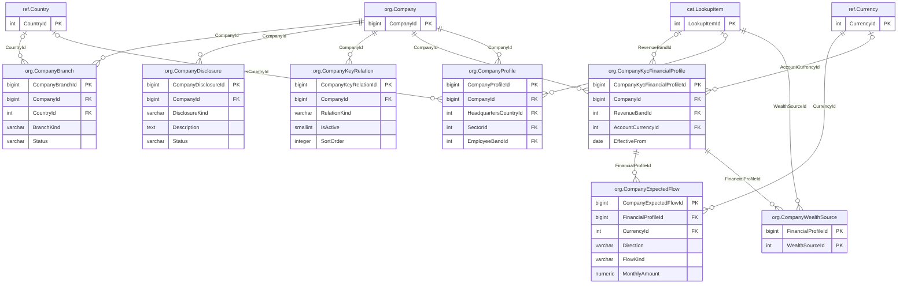

**مواصفات الجداول**

| الجدول | الغرض | PK | FK | UQ | CHECK | أعمدة أخرى |
|---|---|---|---|---|---|---|
| `org.CompanyProfile` | ملف تعريف الشركة 1:1 (G-1) | CompanyProfileId | 4 | 0 | 3 | 15 |
| `org.CompanyBranch` | فرع/مستودع/تابعة خارج الحساب كنص (G-3) | CompanyBranchId | 2 | 0 | 3 | 13 |
| `org.CompanyKycFinancialProfile` | الملف المالي KYC بتاريخ سريان: شريحة الإيرادات والغرض (G-4) | CompanyKycFinancialProfileId | 3 | 0 | 1 | 9 |
| `org.CompanyExpectedFlow` | مصفوفة الحركة المتوقعة الشهرية CTP: اتجاه × 5 بنود (G-4) | CompanyExpectedFlowId | 2 | 0 | 1 | 6 |
| `org.CompanyWealthSource` | مصادر الأموال والثروة: قائمة متعددة (G-4) | FinancialProfileId, WealthSourceId | 2 | 0 | 0 | 5 |
| `org.CompanyDisclosure` | إفصاحات الشركة (G-5) | CompanyDisclosureId | 2 | 0 | 1 | 8 |
| `org.CompanyKeyRelation` | أصحاب العلاقة: مدققون، مستشار قانوني، جهات تنظيمية، أبرز العملاء/الموردين (G-6) | CompanyKeyRelationId | 1 | 0 | 1 | 9 |

**العلاقات (المفاتيح الأجنبية)**

| الطفل (الجدول.العمود) | الأب | العلاقة | الإلزام | النطاق | الحذف | أعمدة النطاق |
|---|---|---|---|---|---|---|
| `org.CompanyProfile.CompanyId` | `org.Company` | 1 : N | إلزامي | مشترك · مركّب | قيد | — |
| `org.CompanyProfile.HeadquartersCountryId` | `ref.Country` | 1 : N | اختياري | مرجع عام | قيد | — |
| `org.CompanyProfile.SectorId` | `cat.LookupItem` | 1 : N | اختياري | مرجع عام | قيد | — |
| `org.CompanyProfile.EmployeeBandId` | `cat.LookupItem` | 1 : N | اختياري | مرجع عام | قيد | — |
| `org.CompanyBranch.CompanyId` | `org.Company` | 1 : N | إلزامي | مشترك · مركّب | قيد | — |
| `org.CompanyBranch.CountryId` | `ref.Country` | 1 : N | اختياري | مرجع عام | قيد | — |
| `org.CompanyKycFinancialProfile.CompanyId` | `org.Company` | 1 : N | إلزامي | مشترك · مركّب | قيد | — |
| `org.CompanyKycFinancialProfile.RevenueBandId` | `cat.LookupItem` | 1 : N | اختياري | مرجع عام | قيد | — |
| `org.CompanyKycFinancialProfile.AccountCurrencyId` | `ref.Currency` | 1 : N | اختياري | مرجع عام | قيد | — |
| `org.CompanyExpectedFlow.FinancialProfileId` | `org.CompanyKycFinancialProfile` | 1 : N | إلزامي | مشترك · مركّب | قيد | — |
| `org.CompanyExpectedFlow.CurrencyId` | `ref.Currency` | 1 : N | إلزامي | مرجع عام | قيد | — |
| `org.CompanyWealthSource.FinancialProfileId` | `org.CompanyKycFinancialProfile` | 1 : N | إلزامي | مشترك · مركّب | CASCADE | — |
| `org.CompanyWealthSource.WealthSourceId` | `cat.LookupItem` | 1 : N | إلزامي | مرجع عام | قيد | — |
| `org.CompanyDisclosure.CompanyId` | `org.Company` | 1 : N | إلزامي | مشترك · مركّب | قيد | — |
| `org.CompanyDisclosure.SourceDocumentId` | `doc.Document` | 1 : N | اختياري | مشترك · مركّب | قيد | — |
| `org.CompanyKeyRelation.CompanyId` | `org.Company` | 1 : N | إلزامي | مشترك · مركّب | قيد | — |

#### م1 · الأشخاص والهوية والاكتمال (1/2)

*Parties, identity documents & KYC* — 7 جدولًا

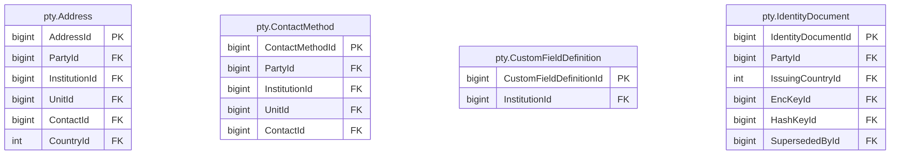

**مواصفات الجداول**

| الجدول | الغرض | PK | FK | UQ | CHECK | أعمدة أخرى |
|---|---|---|---|---|---|---|
| `pty.Address` | عنوان متعدد الملكية: OwnerType+OwnerId بلا FK (مزوّد المالك يتحقق منه التطبيق) (FR-PTY-011، BR-PTY-015) | AddressId | 1 | 0 | 2 | 19 |
| `pty.ContactMethod` | وسيلة اتصال متعددة الملكية (FR-PTY-012، BR-PTY-015) | ContactMethodId | 0 | 0 | 0 | 10 |
| `pty.CustomFieldDefinition` | تعريف حقل مخصص (FR-PTY-013، BR-PTY-014) | CustomFieldDefinitionId | 1 | 0 | 1 | 12 |
| `pty.IdentityDocument` | وثيقة هوية؛ الرقم مشفّر والصور مستندات مقيَّدة (FR-PTY-004..009، FR-PTY-020..022، BR-PTY-002..008) | IdentityDocumentId | 6 | 0 | 5 | 16 |
| `pty.KycProfile` | قائمة اكتمال KYC لكل بنك ودور (FR-PTY-023، BR-PTY-012..013، G-8، G-14) | KycProfileId | 2 | 0 | 3 | 13 |
| `pty.KycProfileItem` | بند اكتمال (FR-PTY-023، FR-PTY-024، G-14) | KycProfileItemId | 1 | 0 | 2 | 14 |
| `pty.KycProfileItemLegalForm` | شروط ظهور البند بحسب الشكل القانوني؛ غياب الصفوف = ينطبق على الكل (G-15) | KycProfileItemId, LegalEntityTypeId | 2 | 0 | 0 | 4 |

**العلاقات (المفاتيح الأجنبية)**

| الطفل (الجدول.العمود) | الأب | العلاقة | الإلزام | النطاق | الحذف | أعمدة النطاق |
|---|---|---|---|---|---|---|
| `pty.Address.CountryId` | `ref.Country` | 1 : N | إلزامي | مرجع عام | قيد | — |
| `pty.CustomFieldDefinition.InstitutionId` | `ins.Institution` | 1 : N | اختياري | مشترك · مركّب | قيد | — |
| `pty.IdentityDocument.PartyId` | `pty.Party` | 1 : N | إلزامي | مشترك · مركّب | قيد | — |
| `pty.IdentityDocument.IssuingCountryId` | `ref.Country` | 1 : N | إلزامي | مرجع عام | قيد | — |
| `pty.IdentityDocument.EncKeyId` | `sec.TenantKey` | 1 : N | إلزامي | مشترك · مركّب | قيد | — |
| `pty.IdentityDocument.HashKeyId` | `sec.TenantKey` | 1 : N | إلزامي | مشترك · مركّب | قيد | — |
| `pty.IdentityDocument.SupersededById` | `pty.IdentityDocument` | 1 : N | اختياري | مشترك · مركّب | قيد | — |
| `pty.IdentityDocument.VerifiedBy` | `sec.AppUser` | 1 : N | اختياري | مشترك · مركّب | قيد | — |
| `pty.KycProfile.InstitutionId` | `ins.Institution` | 1 : N | اختياري | مشترك · مركّب | قيد | — |
| `pty.KycProfile.SourceDocumentId` | `doc.Document` | 1 : N | اختياري | مشترك · مركّب | قيد | — |
| `pty.KycProfileItem.ProfileId` | `pty.KycProfile` | 1 : N | إلزامي | مشترك · مركّب | قيد | — |
| `pty.KycProfileItemLegalForm.KycProfileItemId` | `pty.KycProfileItem` | 1 : N | إلزامي | مشترك · مركّب | CASCADE | — |
| `pty.KycProfileItemLegalForm.LegalEntityTypeId` | `cat.LegalEntityType` | 1 : N | إلزامي | مشترك · مركّب | قيد | — |

#### م1 · الأشخاص والهوية والاكتمال (2/2)

*Parties, identity documents & KYC* — 4 جدولًا

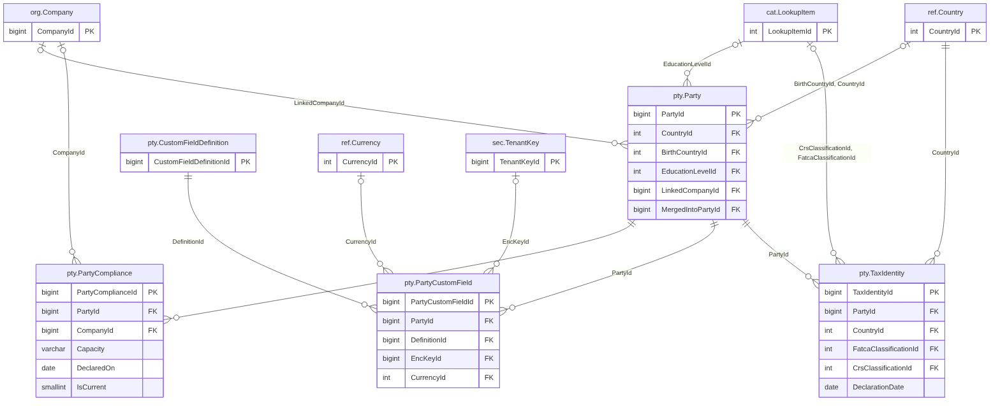

**مواصفات الجداول**

| الجدول | الغرض | PK | FK | UQ | CHECK | أعمدة أخرى |
|---|---|---|---|---|---|---|
| `pty.Party` | شخص أو جهة؛ لا دور مخزَّن (FR-PTY-001..003، BR-PTY-001..004، BR-PTY-016..018) | PartyId | 5 | 0 | 4 | 16 |
| `pty.PartyCompliance` | إقرارات امتثال بتاريخ لكل شخص بصفته: PEP، عقوبات، تحقيقات، حصانة (G-9) | PartyComplianceId | 3 | 0 | 0 | 12 |
| `pty.PartyCustomField` | قيمة حقل مخصص لشخص (FR-PTY-013، FR-PTY-014) | PartyCustomFieldId | 4 | 0 | 3 | 6 |
| `pty.TaxIdentity` | الهوية الضريبية والإقرار الضريبي FATCA/CRS (G-13) | TaxIdentityId | 5 | 0 | 1 | 7 |

**العلاقات (المفاتيح الأجنبية)**

| الطفل (الجدول.العمود) | الأب | العلاقة | الإلزام | النطاق | الحذف | أعمدة النطاق |
|---|---|---|---|---|---|---|
| `pty.Party.CountryId` | `ref.Country` | 1 : N | اختياري | مرجع عام | قيد | — |
| `pty.Party.BirthCountryId` | `ref.Country` | 1 : N | اختياري | مرجع عام | قيد | — |
| `pty.Party.EducationLevelId` | `cat.LookupItem` | 1 : N | اختياري | مرجع عام | قيد | — |
| `pty.Party.LinkedCompanyId` | `org.Company` | 1 : N | اختياري | مشترك · مركّب | قيد | — |
| `pty.Party.MergedIntoPartyId` | `pty.Party` | 1 : N | اختياري | مشترك · مركّب | قيد | — |
| `pty.PartyCompliance.PartyId` | `pty.Party` | 1 : N | إلزامي | مشترك · مركّب | قيد | — |
| `pty.PartyCompliance.CompanyId` | `org.Company` | 1 : N | اختياري | مشترك · مركّب | قيد | — |
| `pty.PartyCompliance.SourceDocumentId` | `doc.Document` | 1 : N | اختياري | مشترك · مركّب | قيد | — |
| `pty.PartyCustomField.PartyId` | `pty.Party` | 1 : N | إلزامي | مشترك · مركّب | قيد | — |
| `pty.PartyCustomField.DefinitionId` | `pty.CustomFieldDefinition` | 1 : N | إلزامي | مشترك · مركّب | قيد | — |
| `pty.PartyCustomField.EncKeyId` | `sec.TenantKey` | 1 : N | اختياري | مشترك · مركّب | قيد | — |
| `pty.PartyCustomField.CurrencyId` | `ref.Currency` | 1 : N | اختياري | مرجع عام | قيد | — |
| `pty.TaxIdentity.PartyId` | `pty.Party` | 1 : N | إلزامي | مشترك · مركّب | قيد | — |
| `pty.TaxIdentity.CountryId` | `ref.Country` | 1 : N | إلزامي | مرجع عام | قيد | — |
| `pty.TaxIdentity.FatcaClassificationId` | `cat.LookupItem` | 1 : N | اختياري | مرجع عام | قيد | — |
| `pty.TaxIdentity.CrsClassificationId` | `cat.LookupItem` | 1 : N | اختياري | مرجع عام | قيد | — |
| `pty.TaxIdentity.SourceDocumentId` | `doc.Document` | 1 : N | اختياري | مشترك · مركّب | قيد | — |

### 10.5 م2–م3 · الجهات المالية والحسابات

#### م2–م3 · الجهات المالية والحسابات والمفوّضون (1/2)

*Institutions, bank accounts & signatories* — 7 جدولًا

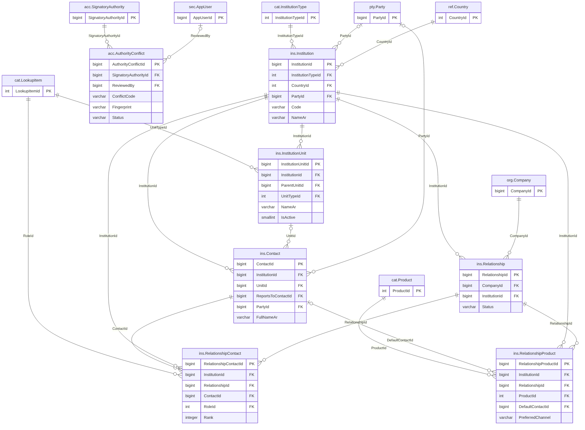

**مواصفات الجداول**

| الجدول | الغرض | PK | FK | UQ | CHECK | أعمدة أخرى |
|---|---|---|---|---|---|---|
| `ins.Contact` | جهة اتصال لدى البنك: سجل خفيف بلا هوية، PartyId اختياري للترقية (FR-INS-007/008، BR-INS-005/006/014) | ContactId | 4 | 0 | 2 | 11 |
| `ins.Institution` | المنشأة المالية (FR-INS-001..004، BR-INS-001..003، BR-INS-012)؛ Locality محلي/أجنبي مشتقة (BR-INS-002) فلا تُخزَّن | InstitutionId | 3 | 0 | 2 | 12 |
| `ins.InstitutionUnit` | وحدة في هيكل المنشأة: إدارة/قسم/فرع، شجرة ذاتية حتى 4 مستويات (FR-INS-005/006، BR-INS-004) | InstitutionUnitId | 3 | 0 | 1 | 6 |
| `ins.Relationship` | علاقة شركة–منشأة (D-4)؛ فريدة مهما كانت حالتها (FR-INS-009، BR-INS-007/011) | RelationshipId | 2 | 0 | 2 | 10 |
| `ins.RelationshipContact` | تغطية العلاقة (الطبقة الأولى): جهة اتصال بدور ورتبة وفترة (FR-INS-010، BR-INS-008/009) | RelationshipContactId | 4 | 0 | 2 | 8 |
| `ins.RelationshipProduct` | منتج يُتعامل به ضمن علاقة مع جهة افتراضية وقناة (FR-INS-011..013، BR-INS-010) | RelationshipProductId | 4 | 0 | 0 | 7 |
| `acc.AuthorityConflict` | نتيجة مقارنة صلاحية المفوّض بالحوكمة وقرار المراجع (S1-ب) (FR-ACC-018، BR-ACC-015) | AuthorityConflictId | 2 | 0 | 2 | 9 |

**العلاقات (المفاتيح الأجنبية)**

| الطفل (الجدول.العمود) | الأب | العلاقة | الإلزام | النطاق | الحذف | أعمدة النطاق |
|---|---|---|---|---|---|---|
| `ins.Contact.InstitutionId` | `ins.Institution` | 1 : N | إلزامي | مشترك · مركّب | قيد | — |
| `ins.Contact.UnitId` | `ins.InstitutionUnit` | 1 : N | اختياري | مشترك · مركّب | قيد | InstitutionId |
| `ins.Contact.ReportsToContactId` | `ins.Contact` | 1 : N | اختياري | مشترك · مركّب | قيد | InstitutionId |
| `ins.Contact.PartyId` | `pty.Party` | 1 : N | اختياري | مشترك · مركّب | قيد | — |
| `ins.Institution.InstitutionTypeId` | `cat.InstitutionType` | 1 : N | إلزامي | مشترك · مركّب | قيد | — |
| `ins.Institution.CountryId` | `ref.Country` | 1 : N | إلزامي | مرجع عام | قيد | — |
| `ins.Institution.PartyId` | `pty.Party` | 1 : N | اختياري | مشترك · مركّب | قيد | — |
| `ins.InstitutionUnit.InstitutionId` | `ins.Institution` | 1 : N | إلزامي | مشترك · مركّب | قيد | — |
| `ins.InstitutionUnit.ParentUnitId` | `ins.InstitutionUnit` | 1 : N | اختياري | مشترك · مركّب | قيد | InstitutionId |
| `ins.InstitutionUnit.UnitTypeId` | `cat.LookupItem` | 1 : N | إلزامي | مرجع عام | قيد | — |
| `ins.Relationship.CompanyId` | `org.Company` | 1 : N | إلزامي | مشترك · مركّب | قيد | — |
| `ins.Relationship.InstitutionId` | `ins.Institution` | 1 : N | إلزامي | مشترك · مركّب | قيد | — |
| `ins.RelationshipContact.InstitutionId` | `ins.Institution` | 1 : N | إلزامي | مشترك · مركّب | قيد | — |
| `ins.RelationshipContact.RelationshipId` | `ins.Relationship` | 1 : N | إلزامي | مشترك · مركّب | قيد | InstitutionId |
| `ins.RelationshipContact.ContactId` | `ins.Contact` | 1 : N | إلزامي | مشترك · مركّب | قيد | InstitutionId |
| `ins.RelationshipContact.RoleId` | `cat.LookupItem` | 1 : N | إلزامي | مرجع عام | قيد | — |
| `ins.RelationshipProduct.InstitutionId` | `ins.Institution` | 1 : N | إلزامي | مشترك · مركّب | قيد | — |
| `ins.RelationshipProduct.RelationshipId` | `ins.Relationship` | 1 : N | إلزامي | مشترك · مركّب | قيد | InstitutionId |
| `ins.RelationshipProduct.ProductId` | `cat.Product` | 1 : N | إلزامي | مشترك · مركّب | قيد | — |
| `ins.RelationshipProduct.DefaultContactId` | `ins.Contact` | 1 : N | اختياري | مشترك · مركّب | قيد | InstitutionId |
| `acc.AuthorityConflict.SignatoryAuthorityId` | `acc.SignatoryAuthority` | 1 : N | إلزامي | مشترك · مركّب | قيد | — |
| `acc.AuthorityConflict.ReviewedBy` | `sec.AppUser` | 1 : N | اختياري | مشترك · مركّب | قيد | — |

#### م2–م3 · الجهات المالية والحسابات والمفوّضون (2/2)

*Institutions, bank accounts & signatories* — 5 جدولًا

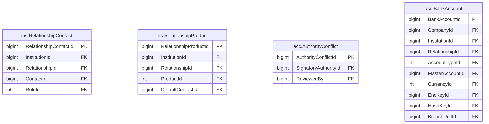

**مواصفات الجداول**

| الجدول | الغرض | PK | FK | UQ | CHECK | أعمدة أخرى |
|---|---|---|---|---|---|---|
| `acc.BankAccount` | حساب شركة لدى منشأة (FR-ACC-001..009، BR-ACC-001..006، BR-ACC-016)؛ الرقم وIBAN مشفّران بفهرس أعمى للفرادة | BankAccountId | 9 | 0 | 8 | 18 |
| `acc.FacilityAccount` | ربط حساب بتسهيل بغرض (S2) (FR-ACC-010، BR-ACC-007)؛ يُملأ من شاشة التسهيل | FacilityAccountId | 4 | 0 | 1 | 7 |
| `acc.Signatory` | تفويض شخص لدى علاقة (S1-ب) (FR-ACC-012، FR-ACC-023، BR-ACC-008/009) + إضافات docs/05 G-10 | SignatoryId | 8 | 0 | 3 | 12 |
| `acc.SignatoryAuthority` | صلاحية المفوّض لعملية على حساب أو على البنك (S1-ب) (FR-ACC-013/014/017، BR-ACC-010/011)؛ لا تعديل في مكانه: الإغلاق والفتح؛ حالتها مشتقة فلا تُخزَّن | SignatoryAuthorityId | 7 | 0 | 8 | 10 |
| `acc.SignatoryAuthorityJointClass` | فئات التوقيع المطلوبة للتوقيع المشترك (JointClassIds) (BR-ACC-013) -- جدول وسيط جديد؛ لا حذف: التعديل بصف صلاحية جديد | SignatoryAuthorityId, SignatureClassId | 2 | 0 | 0 | 4 |

**العلاقات (المفاتيح الأجنبية)**

| الطفل (الجدول.العمود) | الأب | العلاقة | الإلزام | النطاق | الحذف | أعمدة النطاق |
|---|---|---|---|---|---|---|
| `acc.BankAccount.CompanyId` | `org.Company` | 1 : N | إلزامي | مشترك · مركّب | قيد | — |
| `acc.BankAccount.InstitutionId` | `ins.Institution` | 1 : N | إلزامي | مشترك · مركّب | قيد | — |
| `acc.BankAccount.RelationshipId` | `ins.Relationship` | 1 : N | إلزامي | مشترك · مركّب | قيد | CompanyId, InstitutionId |
| `acc.BankAccount.AccountTypeId` | `cat.AccountType` | 1 : N | إلزامي | مشترك · مركّب | قيد | — |
| `acc.BankAccount.MasterAccountId` | `acc.BankAccount` | 1 : N | اختياري | مشترك · مركّب | قيد | CompanyId, InstitutionId, CurrencyId |
| `acc.BankAccount.CurrencyId` | `ref.Currency` | 1 : N | إلزامي | مرجع عام | قيد | — |
| `acc.BankAccount.EncKeyId` | `sec.TenantKey` | 1 : N | إلزامي | مشترك · مركّب | قيد | — |
| `acc.BankAccount.HashKeyId` | `sec.TenantKey` | 1 : N | إلزامي | مشترك · مركّب | قيد | — |
| `acc.BankAccount.BranchUnitId` | `ins.InstitutionUnit` | 1 : N | اختياري | مشترك · مركّب | قيد | InstitutionId |
| `acc.FacilityAccount.FacilityId` | `fac.Facility` | 1 : N | إلزامي | مشترك · مركّب | قيد | — |
| `acc.FacilityAccount.BankAccountId` | `acc.BankAccount` | 1 : N | إلزامي | مشترك · مركّب | قيد | CurrencyId |
| `acc.FacilityAccount.CurrencyId` | `ref.Currency` | 1 : N | إلزامي | مرجع عام | قيد | — |
| `acc.FacilityAccount.PurposeId` | `cat.LookupItem` | 1 : N | إلزامي | مرجع عام | قيد | — |
| `acc.Signatory.RelationshipId` | `ins.Relationship` | 1 : N | إلزامي | مشترك · مركّب | قيد | — |
| `acc.Signatory.PartyId` | `pty.Party` | 1 : N | إلزامي | مشترك · مركّب | قيد | — |
| `acc.Signatory.SignatureClassId` | `cat.LookupItem` | 1 : N | إلزامي | مرجع عام | قيد | — |
| `acc.Signatory.PositionId` | `cat.Position` | 1 : N | اختياري | مشترك · مركّب | قيد | — |
| `acc.Signatory.AuthorisationBasisId` | `cat.LookupItem` | 1 : N | اختياري | مرجع عام | قيد | — |
| `acc.Signatory.CashWithdrawalCurrencyId` | `ref.Currency` | 1 : N | اختياري | مرجع عام | قيد | — |
| `acc.Signatory.AuthorizationDocumentId` | `doc.Document` | 1 : N | اختياري | مشترك · مركّب | قيد | — |
| `acc.Signatory.SpecimenDocumentId` | `doc.Document` | 1 : N | اختياري | مشترك · مركّب | قيد | — |
| `acc.SignatoryAuthority.RelationshipId` | `ins.Relationship` | 1 : N | إلزامي | مشترك · مركّب | قيد | — |
| `acc.SignatoryAuthority.SignatoryId` | `acc.Signatory` | 1 : N | إلزامي | مشترك · مركّب | قيد | RelationshipId |
| `acc.SignatoryAuthority.BankAccountId` | `acc.BankAccount` | 1 : N | اختياري | مشترك · مركّب | قيد | RelationshipId |
| `acc.SignatoryAuthority.OperationTypeId` | `cat.OperationType` | 1 : N | إلزامي | مشترك · مركّب | قيد | — |
| `acc.SignatoryAuthority.CurrencyId` | `ref.Currency` | 1 : N | اختياري | مرجع عام | قيد | — |
| `acc.SignatoryAuthority.SourceDocumentId` | `doc.Document` | 1 : N | اختياري | مشترك · مركّب | قيد | — |
| `acc.SignatoryAuthority.SupersededById` | `acc.SignatoryAuthority` | 1 : N | اختياري | مشترك · مركّب | قيد | SignatoryId |
| `acc.SignatoryAuthorityJointClass.SignatoryAuthorityId` | `acc.SignatoryAuthority` | 1 : N | إلزامي | مشترك · مركّب | قيد | — |
| `acc.SignatoryAuthorityJointClass.SignatureClassId` | `cat.LookupItem` | 1 : N | إلزامي | مرجع عام | قيد | — |

### 10.6 م4 · الكتالوجات والمراجع

#### م4 · المنتجات والرسوم والتمويل والضمانات (1/2)

*Products, fees, financing & collateral types* — 7 جدولًا

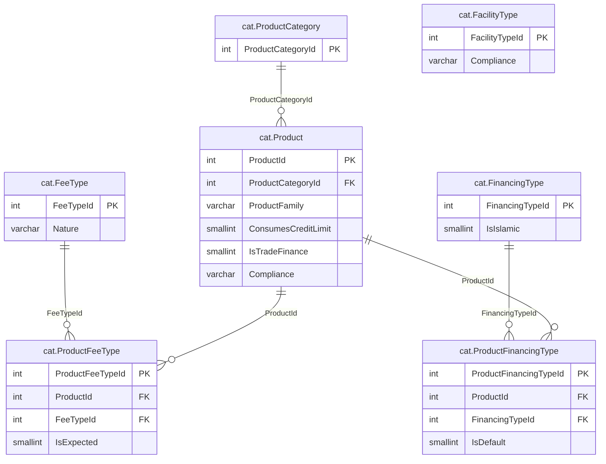

**مواصفات الجداول**

| الجدول | الغرض | PK | FK | UQ | CHECK | أعمدة أخرى |
|---|---|---|---|---|---|---|
| `cat.ProductCategory` | تصنيف المنتجات: مسطّح (FR-CAT-007) | ProductCategoryId | 0 | 0 | 2 | 13 |
| `cat.Product` | المنتج البنكي بأعلامه (FR-CAT-007، BR-CAT-004) | ProductId | 1 | 0 | 2 | 18 |
| `cat.FeeType` | نوع المصروف: فئة عريضة لا بند تعرفة (FR-CAT-008، BR-CAT-005، Q-CAT-10) | FeeTypeId | 0 | 0 | 2 | 15 |
| `cat.FinancingType` | نوع التمويل (FR-CAT-009، BR-CAT-006) | FinancingTypeId | 0 | 0 | 2 | 15 |
| `cat.ProductFeeType` | المصاريف المسموحة للمنتج؛ تعطيل الربط = حذفه ولا يمس قواعد تسعير قائمة (FR-CAT-010، BR-CAT-007) -- يبقى بمفتاح بديل لأنه يحمل سمة | ProductFeeTypeId | 2 | 0 | 0 | 4 |
| `cat.ProductFinancingType` | أنواع التمويل المسموحة للمنتج (FR-CAT-010، BR-CAT-007) | ProductFinancingTypeId | 2 | 0 | 0 | 4 |
| `cat.FacilityType` | نوع التسهيل (FR-CAT-011) | FacilityTypeId | 0 | 0 | 2 | 14 |

**العلاقات (المفاتيح الأجنبية)**

| الطفل (الجدول.العمود) | الأب | العلاقة | الإلزام | النطاق | الحذف | أعمدة النطاق |
|---|---|---|---|---|---|---|
| `cat.Product.ProductCategoryId` | `cat.ProductCategory` | 1 : N | إلزامي | مشترك · مركّب | قيد | — |
| `cat.ProductFeeType.ProductId` | `cat.Product` | 1 : N | إلزامي | مشترك · مركّب | قيد | — |
| `cat.ProductFeeType.FeeTypeId` | `cat.FeeType` | 1 : N | إلزامي | مشترك · مركّب | قيد | — |
| `cat.ProductFinancingType.ProductId` | `cat.Product` | 1 : N | إلزامي | مشترك · مركّب | قيد | — |
| `cat.ProductFinancingType.FinancingTypeId` | `cat.FinancingType` | 1 : N | إلزامي | مشترك · مركّب | قيد | — |

#### م4 · المنتجات والرسوم والتمويل والضمانات (2/2)

*Products, fees, financing & collateral types* — 5 جدولًا

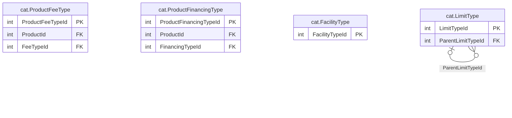

**مواصفات الجداول**

| الجدول | الغرض | PK | FK | UQ | CHECK | أعمدة أخرى |
|---|---|---|---|---|---|---|
| `cat.LimitType` | نوع الحد: رئيسي/جزئي (FR-CAT-012، BR-CAT-008) | LimitTypeId | 1 | 0 | 4 | 16 |
| `cat.LimitTypeProduct` | المنتجات المسموحة لنوع الحد؛ غياب الصفوف = أي منتج بعلامة ظاهرة (BR-CAT-008) -- جدول وسيط جديد | LimitTypeId, ProductId | 2 | 0 | 0 | 4 |
| `cat.CollateralType` | نوع الضمان بنوع بنية وقالب سمات (FR-CAT-013) | CollateralTypeId | 0 | 0 | 2 | 14 |
| `cat.CollateralTypeAttribute` | سمة في قالب نوع الضمان؛ لا تُحذف بل تُرمَّز Retired (BR-CAT-009) -- جدول جديد | CollateralTypeAttributeId | 1 | 0 | 1 | 11 |
| `cat.ObligationType` | نوع الالتزام بأربع عائلات (FR-CAT-014، BR-CAT-010) | ObligationTypeId | 0 | 0 | 4 | 18 |

**العلاقات (المفاتيح الأجنبية)**

| الطفل (الجدول.العمود) | الأب | العلاقة | الإلزام | النطاق | الحذف | أعمدة النطاق |
|---|---|---|---|---|---|---|
| `cat.LimitType.ParentLimitTypeId` | `cat.LimitType` | 1 : N | اختياري | مشترك · مركّب | قيد | — |
| `cat.LimitTypeProduct.LimitTypeId` | `cat.LimitType` | 1 : N | إلزامي | مشترك · مركّب | قيد | — |
| `cat.LimitTypeProduct.ProductId` | `cat.Product` | 1 : N | إلزامي | مشترك · مركّب | قيد | — |
| `cat.CollateralTypeAttribute.CollateralTypeId` | `cat.CollateralType` | 1 : N | إلزامي | مشترك · مركّب | قيد | — |

#### م4 · الكتالوجات المرجعية

*Reference catalogues* — 7 جدولًا

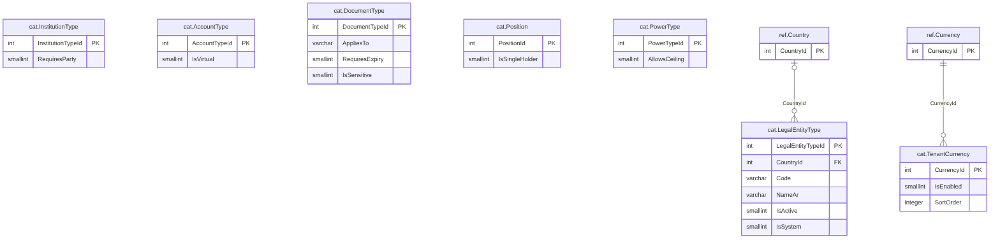

**مواصفات الجداول**

| الجدول | الغرض | PK | FK | UQ | CHECK | أعمدة أخرى |
|---|---|---|---|---|---|---|
| `cat.TenantCurrency` | العملات المفعّلة للمشترك: تفعيل مجموعة جزئية من المرجع العالمي (FR-CAT-023، Q-CAT-08) -- جدول بنيوي جديد | CurrencyId | 1 | 0 | 0 | 6 |
| `cat.InstitutionType` | نوع المنشأة المالية: بنك، شركة تمويل، استثمارية، مالية، فرد (FR-INS-001) | InstitutionTypeId | 0 | 0 | 2 | 14 |
| `cat.AccountType` | نوع الحساب (FR-ACC-001) | AccountTypeId | 0 | 0 | 2 | 14 |
| `cat.LegalEntityType` | الشكل القانوني: الكيان وسماته يعرّفها 10 (FR-ORG-002، BR-CAT-017) وتبذره هذه الوحدة؛ أعمدة الكتالوج مكتوبة يدويًا لأن فرادة الرمز بالدولة (10 §6.2) ل… | LegalEntityTypeId | 1 | 0 | 2 | 16 |
| `cat.DocumentType` | نوع الوثيقة؛ يطبّق 10 أعلامه عند الرفع (FR-CAT-018، BR-CAT-016، FR-PLT-028) | DocumentTypeId | 0 | 0 | 5 | 20 |
| `cat.Position` | المنصب: السمات يعرّفها 10 §6.2 وحده وتبذر هذه الوحدة صفوفه (FR-CAT-019، BR-CAT-017)؛ SortOrder من أساس الكتالوج | PositionId | 0 | 0 | 2 | 15 |
| `cat.PowerType` | نوع الصلاحية: السمات يعرّفها 10 §6.2 وحده وتبذر هذه الوحدة صفوفه (FR-CAT-019، FR-ORG-024) | PowerTypeId | 0 | 0 | 2 | 15 |

**العلاقات (المفاتيح الأجنبية)**

| الطفل (الجدول.العمود) | الأب | العلاقة | الإلزام | النطاق | الحذف | أعمدة النطاق |
|---|---|---|---|---|---|---|
| `cat.TenantCurrency.CurrencyId` | `ref.Currency` | 1 : N | إلزامي | مرجع عام | قيد | — |
| `cat.LegalEntityType.CountryId` | `ref.Country` | 1 : N | اختياري | مرجع عام | قيد | — |

#### م4 · الأسعار المرجعية والقوائم

*Base rates & lookup lists* — 7 جدولًا

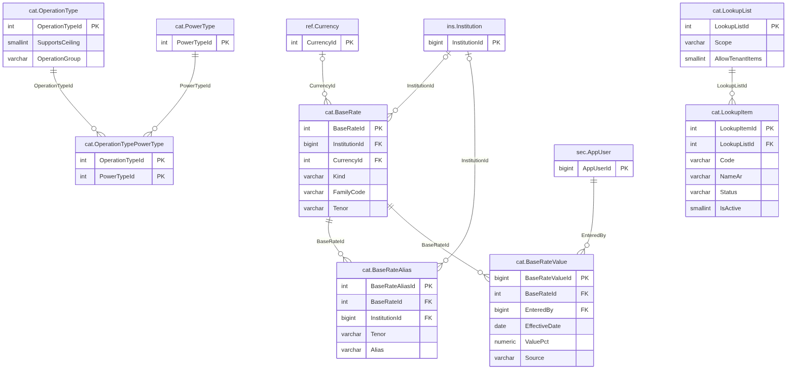

**مواصفات الجداول**

| الجدول | الغرض | PK | FK | UQ | CHECK | أعمدة أخرى |
|---|---|---|---|---|---|---|
| `cat.OperationType` | نوع العملية البنكية المفوَّض بها (FR-ACC-013، BR-CAT-014) | OperationTypeId | 0 | 0 | 2 | 15 |
| `cat.OperationTypePowerType` | ربط عملية بنوع/أنواع صلاحية حوكمة؛ «أي واحد يكفي» (BR-CAT-014، FR-CAT-019، Q-ACC-05) -- جدول وسيط جديد | OperationTypeId, PowerTypeId | 2 | 0 | 0 | 4 |
| `cat.BaseRate` | سعر الأساس: سوق (InstitutionId فارغ) أو داخلي لبنك (FR-CAT-015، BR-CAT-011)؛ الأسماء البديلة في BaseRateAlias | BaseRateId | 2 | 0 | 4 | 17 |
| `cat.BaseRateAlias` | اسم بديل لسعر أساس (SIBOR ≡ SAIBOR) بحث بلا حساسية حالة وفريد ضمن النطاق (BR-CAT-011، FR-CAT-015) -- جدول وسيط جديد يحل «Aliases set» | BaseRateAliasId | 2 | 0 | 0 | 6 |
| `cat.BaseRateValue` | قيمة سعر الأساس بتاريخ سريان؛ لا حذف: التصحيح صف جديد والقديم SUPERSEDED (FR-CAT-016، BR-CAT-012/013) | BaseRateValueId | 3 | 0 | 1 | 9 |
| `cat.LookupList` | قائمة قيم؛ TenantId فارغ = قائمة عالمية يملكها المشغّل للقراءة (FR-CAT-020، BR-CAT-015) | LookupListId | 0 | 0 | 3 | 16 |
| `cat.LookupItem` | بند في قائمة قيم؛ TenantId فارغ = بند عالمي للقراءة فقط؛ أعمدة الكتالوج يدوية لأن فرادة الرمز داخل القائمة لا المشترك (FR-CAT-020) | LookupItemId | 1 | 0 | 2 | 15 |

**العلاقات (المفاتيح الأجنبية)**

| الطفل (الجدول.العمود) | الأب | العلاقة | الإلزام | النطاق | الحذف | أعمدة النطاق |
|---|---|---|---|---|---|---|
| `cat.OperationTypePowerType.OperationTypeId` | `cat.OperationType` | 1 : N | إلزامي | مشترك · مركّب | قيد | — |
| `cat.OperationTypePowerType.PowerTypeId` | `cat.PowerType` | 1 : N | إلزامي | مشترك · مركّب | قيد | — |
| `cat.BaseRate.InstitutionId` | `ins.Institution` | 1 : N | اختياري | مشترك · مركّب | قيد | — |
| `cat.BaseRate.CurrencyId` | `ref.Currency` | 1 : N | اختياري | مرجع عام | قيد | — |
| `cat.BaseRateAlias.BaseRateId` | `cat.BaseRate` | 1 : N | إلزامي | مشترك · مركّب | قيد | Tenor |
| `cat.BaseRateAlias.InstitutionId` | `ins.Institution` | 1 : N | اختياري | مشترك · مركّب | قيد | — |
| `cat.BaseRateValue.BaseRateId` | `cat.BaseRate` | 1 : N | إلزامي | مشترك · مركّب | قيد | — |
| `cat.BaseRateValue.SupersedesId` | `cat.BaseRateValue` | 1 : N | اختياري | مشترك · مركّب | قيد | BaseRateId |
| `cat.BaseRateValue.EnteredBy` | `sec.AppUser` | 1 : N | إلزامي | مشترك · مركّب | قيد | — |
| `cat.LookupItem.LookupListId` | `cat.LookupList` | 1 : N | إلزامي | عام | قيد | — |

#### المراجع العامة (ref)

*Global references (shared, read-only)* — 4 جدولًا

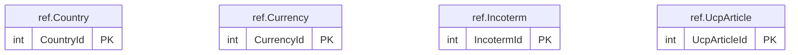

**مواصفات الجداول**

| الجدول | الغرض | PK | FK | UQ | CHECK | أعمدة أخرى |
|---|---|---|---|---|---|---|
| `ref.Country` | الدولة: مرجع عالمي للقراءة فقط يديره مشغّل المنصة (FR-CAT-026، BR-CAT-018، BR-CAT-015) | CountryId | 0 | 0 | 3 | 11 |
| `ref.Currency` | العملة: مرجع عالمي ISO 4217 للقراءة فقط (FR-CAT-021، Q-CAT-08) | CurrencyId | 0 | 0 | 3 | 10 |
| `ref.Incoterm` | مصطلح تسليم Incoterms: مرجع عالمي للقراءة فقط يديره المشغّل؛ القديم LEGACY للعرض لا للاختيار (FR-LCT-013، FR-CAT-021، BR-CAT-015) | IncotermId | 0 | 0 | 1 | 11 |
| `ref.UcpArticle` | مادة UCP 600 مرجعية: TenantId الفارغ = صف عام للقراءة فقط ينشره المشغّل وحده (FR-LCT-006، BR-LCT-018، BR-PLT-001) | UcpArticleId | 1 | 0 | 2 | 12 |

**العلاقات (المفاتيح الأجنبية)**

| الطفل (الجدول.العمود) | الأب | العلاقة | الإلزام | النطاق | الحذف | أعمدة النطاق |
|---|---|---|---|---|---|---|
| `ref.UcpArticle.VerifiedBy` | `plat.PlatformOperator` | 1 : N | اختياري | عام | قيد | — |

### 10.7 م5 · التسهيلات والتسعير والضمانات والالتزامات والبيانات المالية

#### م5 · التسهيلات والمراجعات

*Facilities & revisions* — 6 جدولًا

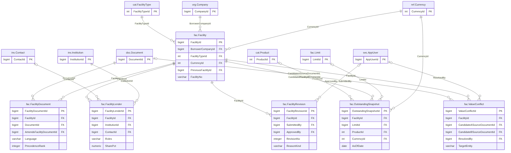

**مواصفات الجداول**

| الجدول | الغرض | PK | FK | UQ | CHECK | أعمدة أخرى |
|---|---|---|---|---|---|---|
| `fac.Facility` | حزمة الاتفاقية الائتمانية: جذر التجميعة (FR-FAC-001..008، BR-FAC-001/005/006) | FacilityId | 4 | 0 | 11 | 28 |
| `fac.FacilityRevision` | مراجعة معدّ/معتمِد لشروط التسهيل (FR-FAC-024، BR-FAC-003/004، §8) | FacilityRevisionId | 3 | 0 | 5 | 13 |
| `fac.FacilityDocument` | وثيقة ضمن الحزمة بأسبقية (FR-FAC-004، BR-FAC-008، V-FAC-03)؛ نوعها من doc.Document.DocumentTypeId | FacilityDocumentId | 4 | 0 | 4 | 12 |
| `fac.FacilityLender` | مقرض وحصته (FR-FAC-003، BR-FAC-007، V-FAC-02)؛ مجموع الحصص 100 ووكيل واحد يتحقق منهما التطبيق | FacilityLenderId | 4 | 0 | 4 | 7 |
| `fac.OutstandingSnapshot` | لقطة الرصيد المعترف به (FR-FAC-009، BR-FAC-017)؛ PctOfLimit مشتق لا يُخزَّن | OutstandingSnapshotId | 7 | 0 | 4 | 13 |
| `fac.ValueConflict` | تعارض قيمتين لحقل واحد وحسمه (FR-FAC-026، BR-FAC-019، BR-FAC-008) | ValueConflictId | 4 | 0 | 5 | 21 |

**العلاقات (المفاتيح الأجنبية)**

| الطفل (الجدول.العمود) | الأب | العلاقة | الإلزام | النطاق | الحذف | أعمدة النطاق |
|---|---|---|---|---|---|---|
| `fac.Facility.BorrowerCompanyId` | `org.Company` | 1 : N | إلزامي | مشترك · مركّب | قيد | — |
| `fac.Facility.FacilityTypeId` | `cat.FacilityType` | 1 : N | إلزامي | مشترك · مركّب | قيد | — |
| `fac.Facility.CurrencyId` | `ref.Currency` | 1 : N | إلزامي | مرجع عام | قيد | — |
| `fac.Facility.PreviousFacilityId` | `fac.Facility` | 1 : N | اختياري | مشترك · مركّب | قيد | — |
| `fac.FacilityRevision.FacilityId` | `fac.Facility` | 1 : N | إلزامي | مشترك · مركّب | قيد | — |
| `fac.FacilityRevision.SubmittedBy` | `sec.AppUser` | 1 : N | اختياري | مشترك · مركّب | قيد | — |
| `fac.FacilityRevision.ApprovedBy` | `sec.AppUser` | 1 : N | اختياري | مشترك · مركّب | قيد | — |
| `fac.FacilityDocument.FacilityId` | `fac.Facility` | 1 : N | إلزامي | مشترك · مركّب | قيد | — |
| `fac.FacilityDocument.DocumentId` | `doc.Document` | 1 : N | إلزامي | مشترك · مركّب | قيد | — |
| `fac.FacilityDocument.AmendsFacilityDocumentId` | `fac.FacilityDocument` | 1 : N | اختياري | مشترك · مركّب | قيد | FacilityId |
| `fac.FacilityDocument.SupersedesId` | `fac.FacilityDocument` | 1 : N | اختياري | مشترك · مركّب | قيد | — |
| `fac.FacilityLender.FacilityId` | `fac.Facility` | 1 : N | إلزامي | مشترك · مركّب | قيد | — |
| `fac.FacilityLender.InstitutionId` | `ins.Institution` | 1 : N | إلزامي | مشترك · مركّب | قيد | — |
| `fac.FacilityLender.ContactId` | `ins.Contact` | 1 : N | اختياري | مشترك · مركّب | قيد | InstitutionId |
| `fac.FacilityLender.SupersedesId` | `fac.FacilityLender` | 1 : N | اختياري | مشترك · مركّب | قيد | — |
| `fac.OutstandingSnapshot.FacilityId` | `fac.Facility` | 1 : N | إلزامي | مشترك · مركّب | قيد | — |
| `fac.OutstandingSnapshot.LimitId` | `fac.Limit` | 1 : N | اختياري | مشترك · مركّب | قيد | FacilityId |
| `fac.OutstandingSnapshot.ProductId` | `cat.Product` | 1 : N | اختياري | مشترك · مركّب | قيد | — |
| `fac.OutstandingSnapshot.CurrencyId` | `ref.Currency` | 1 : N | إلزامي | مرجع عام | قيد | — |
| `fac.OutstandingSnapshot.SourceDocumentId` | `doc.Document` | 1 : N | اختياري | مشترك · مركّب | قيد | — |
| `fac.OutstandingSnapshot.VerifiedBy` | `sec.AppUser` | 1 : N | اختياري | مشترك · مركّب | قيد | — |
| `fac.OutstandingSnapshot.ConflictId` | `fac.ValueConflict` | 1 : N | اختياري | مشترك · مركّب | قيد | — |
| `fac.ValueConflict.FacilityId` | `fac.Facility` | 1 : N | إلزامي | مشترك · مركّب | قيد | — |
| `fac.ValueConflict.CandidateASourceDocumentId` | `doc.Document` | 1 : N | اختياري | مشترك · مركّب | قيد | — |
| `fac.ValueConflict.CandidateBSourceDocumentId` | `doc.Document` | 1 : N | اختياري | مشترك · مركّب | قيد | — |
| `fac.ValueConflict.ResolvedBy` | `sec.AppUser` | 1 : N | اختياري | مشترك · مركّب | قيد | — |

#### م5 · الحدود والاستخدام والحجوزات

*Limits, utilisation & reservations* — 7 جدولًا

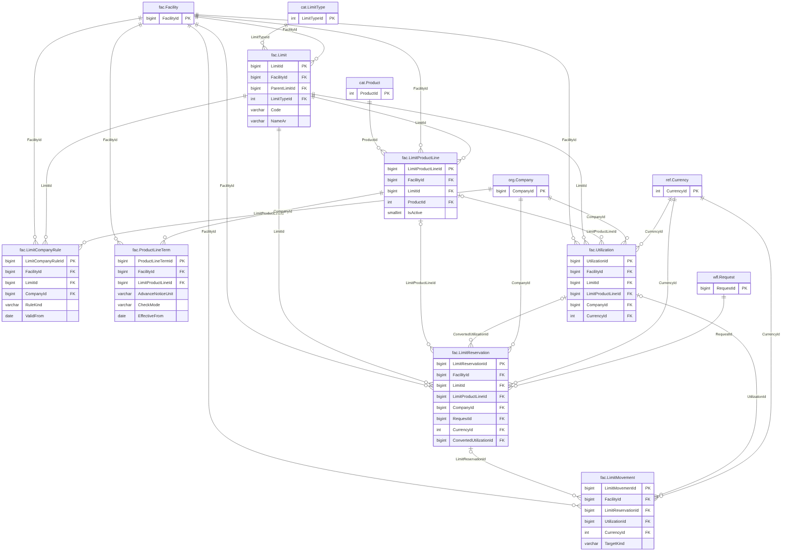

**مواصفات الجداول**

| الجدول | الغرض | PK | FK | UQ | CHECK | أعمدة أخرى |
|---|---|---|---|---|---|---|
| `fac.Limit` | عقدة شجرة الحدود (FR-FAC-010/011، BR-FAC-009/010، V-FAC-04..07) | LimitId | 7 | 0 | 9 | 27 |
| `fac.LimitProductLine` | خط منتج داخل حد: سقف اختياري SHARED_CAP دائمًا (FR-FAC-012، V-FAC-08) | LimitProductLineId | 7 | 0 | 6 | 18 |
| `fac.LimitCompanyRule` | قيد شركة على حد: مسموح/مستثنى/تخصيص (FR-FAC-013، BR-FAC-012، V-FAC-09) | LimitCompanyRuleId | 7 | 0 | 8 | 17 |
| `fac.ProductLineTerm` | شروط العملية لخط المنتج بتواريخ سريان؛ الفارغ = «غير محدد» لا صفر (FR-FAC-014، BR-FAC-016) | ProductLineTermId | 6 | 0 | 11 | 22 |
| `fac.Utilization` | بند استخدام فعّال: يدوي أو مرتبط باعتماد مستندي؛ لا حذف (FR-FAC-016/030، BR-FAC-013/020) | UtilizationId | 5 | 0 | 6 | 15 |
| `fac.LimitReservation` | حجز مبلغ لطلب = ExposureAmount (FR-FAC-017/018/020، BR-FAC-015) | LimitReservationId | 7 | 0 | 7 | 13 |
| `fac.LimitMovement` | سجل حركة على حجز أو استخدام؛ لا تعديل ولا حذف؛ مفتاح عدم التكرار (BR-FAC-015/020) | LimitMovementId | 5 | 0 | 4 | 11 |

**العلاقات (المفاتيح الأجنبية)**

| الطفل (الجدول.العمود) | الأب | العلاقة | الإلزام | النطاق | الحذف | أعمدة النطاق |
|---|---|---|---|---|---|---|
| `fac.Limit.FacilityId` | `fac.Facility` | 1 : N | إلزامي | مشترك · مركّب | قيد | — |
| `fac.Limit.ParentLimitId` | `fac.Limit` | 1 : N | اختياري | مشترك · مركّب | قيد | FacilityId |
| `fac.Limit.LimitTypeId` | `cat.LimitType` | 1 : N | إلزامي | مشترك · مركّب | قيد | — |
| `fac.Limit.SupersedesId` | `fac.Limit` | 1 : N | اختياري | مشترك · مركّب | قيد | — |
| `fac.Limit.SourceDocumentId` | `doc.Document` | 1 : N | اختياري | مشترك · مركّب | قيد | — |
| `fac.Limit.VerifiedBy` | `sec.AppUser` | 1 : N | اختياري | مشترك · مركّب | قيد | — |
| `fac.Limit.ConflictId` | `fac.ValueConflict` | 1 : N | اختياري | مشترك · مركّب | قيد | — |
| `fac.LimitProductLine.FacilityId` | `fac.Facility` | 1 : N | إلزامي | مشترك · مركّب | قيد | — |
| `fac.LimitProductLine.LimitId` | `fac.Limit` | 1 : N | إلزامي | مشترك · مركّب | قيد | FacilityId |
| `fac.LimitProductLine.ProductId` | `cat.Product` | 1 : N | إلزامي | مشترك · مركّب | قيد | — |
| `fac.LimitProductLine.SupersedesId` | `fac.LimitProductLine` | 1 : N | اختياري | مشترك · مركّب | قيد | — |
| `fac.LimitProductLine.SourceDocumentId` | `doc.Document` | 1 : N | اختياري | مشترك · مركّب | قيد | — |
| `fac.LimitProductLine.VerifiedBy` | `sec.AppUser` | 1 : N | اختياري | مشترك · مركّب | قيد | — |
| `fac.LimitProductLine.ConflictId` | `fac.ValueConflict` | 1 : N | اختياري | مشترك · مركّب | قيد | — |
| `fac.LimitCompanyRule.FacilityId` | `fac.Facility` | 1 : N | إلزامي | مشترك · مركّب | قيد | — |
| `fac.LimitCompanyRule.LimitId` | `fac.Limit` | 1 : N | إلزامي | مشترك · مركّب | قيد | FacilityId |
| `fac.LimitCompanyRule.CompanyId` | `org.Company` | 1 : N | إلزامي | مشترك · مركّب | قيد | — |
| `fac.LimitCompanyRule.SupersedesId` | `fac.LimitCompanyRule` | 1 : N | اختياري | مشترك · مركّب | قيد | — |
| `fac.LimitCompanyRule.SourceDocumentId` | `doc.Document` | 1 : N | اختياري | مشترك · مركّب | قيد | — |
| `fac.LimitCompanyRule.VerifiedBy` | `sec.AppUser` | 1 : N | اختياري | مشترك · مركّب | قيد | — |
| `fac.LimitCompanyRule.ConflictId` | `fac.ValueConflict` | 1 : N | اختياري | مشترك · مركّب | قيد | — |
| `fac.ProductLineTerm.FacilityId` | `fac.Facility` | 1 : N | إلزامي | مشترك · مركّب | قيد | — |
| `fac.ProductLineTerm.LimitProductLineId` | `fac.LimitProductLine` | 1 : N | إلزامي | مشترك · مركّب | قيد | FacilityId |
| `fac.ProductLineTerm.SupersedesId` | `fac.ProductLineTerm` | 1 : N | اختياري | مشترك · مركّب | قيد | — |
| `fac.ProductLineTerm.SourceDocumentId` | `doc.Document` | 1 : N | اختياري | مشترك · مركّب | قيد | — |
| `fac.ProductLineTerm.VerifiedBy` | `sec.AppUser` | 1 : N | اختياري | مشترك · مركّب | قيد | — |
| `fac.ProductLineTerm.ConflictId` | `fac.ValueConflict` | 1 : N | اختياري | مشترك · مركّب | قيد | — |
| `fac.Utilization.FacilityId` | `fac.Facility` | 1 : N | إلزامي | مشترك · مركّب | قيد | — |
| `fac.Utilization.LimitId` | `fac.Limit` | 1 : N | إلزامي | مشترك · مركّب | قيد | FacilityId |
| `fac.Utilization.LimitProductLineId` | `fac.LimitProductLine` | 1 : N | اختياري | مشترك · مركّب | قيد | FacilityId, LimitId |
| `fac.Utilization.CompanyId` | `org.Company` | 1 : N | إلزامي | مشترك · مركّب | قيد | — |
| `fac.Utilization.CurrencyId` | `ref.Currency` | 1 : N | إلزامي | مرجع عام | قيد | — |
| `fac.LimitReservation.FacilityId` | `fac.Facility` | 1 : N | إلزامي | مشترك · مركّب | قيد | — |
| `fac.LimitReservation.LimitId` | `fac.Limit` | 1 : N | إلزامي | مشترك · مركّب | قيد | FacilityId |
| `fac.LimitReservation.LimitProductLineId` | `fac.LimitProductLine` | 1 : N | اختياري | مشترك · مركّب | قيد | FacilityId, LimitId |
| `fac.LimitReservation.CompanyId` | `org.Company` | 1 : N | إلزامي | مشترك · مركّب | قيد | — |
| `fac.LimitReservation.RequestId` | `wfl.Request` | 1 : N | إلزامي | مشترك · مركّب | قيد | — |
| `fac.LimitReservation.CurrencyId` | `ref.Currency` | 1 : N | إلزامي | مرجع عام | قيد | — |
| `fac.LimitReservation.ConvertedUtilizationId` | `fac.Utilization` | 1 : N | اختياري | مشترك · مركّب | قيد | FacilityId |
| `fac.LimitMovement.FacilityId` | `fac.Facility` | 1 : N | إلزامي | مشترك · مركّب | قيد | — |
| `fac.LimitMovement.LimitReservationId` | `fac.LimitReservation` | 1 : N | اختياري | مشترك · مركّب | قيد | FacilityId |
| `fac.LimitMovement.UtilizationId` | `fac.Utilization` | 1 : N | اختياري | مشترك · مركّب | قيد | FacilityId |
| `fac.LimitMovement.CurrencyId` | `ref.Currency` | 1 : N | إلزامي | مرجع عام | قيد | — |
| `fac.LimitMovement.ActorUserId` | `sec.AppUser` | 1 : N | إلزامي | مشترك · مركّب | قيد | — |

#### م5 · التسعير وشروط المقارنة

*Pricing, tariffs & comparable terms* — 7 جدولًا

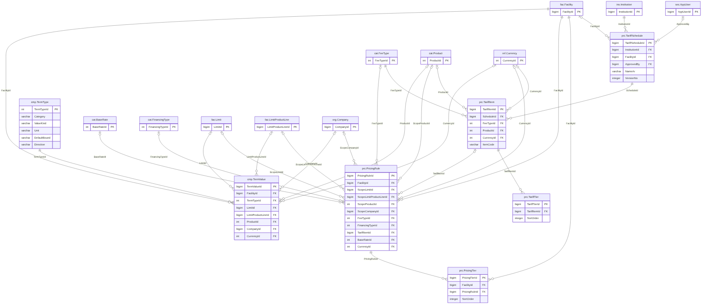

**مواصفات الجداول**

| الجدول | الغرض | PK | FK | UQ | CHECK | أعمدة أخرى |
|---|---|---|---|---|---|---|
| `prc.PricingRule` | قاعدة تسعير بنطاق ووراثة وطرق (FR-PRC-006..017، BR-PRC-006..012، V-PRC-02) | PricingRuleId | 14 | 0 | 37 | 40 |
| `prc.PricingTier` | شريحة قاعدة TIERED بالمبلغ و/أو المدة (FR-PRC-003، BR-PRC-002) | PricingTierId | 3 | 0 | 8 | 13 |
| `prc.TariffItem` | بند رسم في جدول التعرفة (FR-PRC-002، BR-PRC-002..005) | TariffItemId | 7 | 0 | 11 | 24 |
| `prc.TariffSchedule` | إصدار جدول رسوم لبنك؛ بخاص بتسهيل اختياريًا (FR-PRC-001، BR-PRC-001، V-PRC-01) | TariffScheduleId | 4 | 0 | 3 | 11 |
| `prc.TariffTier` | شريحة بند تعرفة بالمبلغ و/أو المدة (FR-PRC-003، BR-PRC-002) | TariffTierId | 1 | 0 | 8 | 11 |
| `cmp.TermType` | مفتاح شرط قابل للمقارنة (FR-CMP-001)؛ الرمز بنمط PRC.MARGIN_PCT؛ النظامي لا يُحذف ولا تتغير وحدته (IsSystem) | TermTypeId | 0 | 0 | 3 | 22 |
| `cmp.TermValue` | قيمة شرط في تسهيل بنطاقها ومصدرها (FR-CMP-002..006، BR-CMP-001..006، V-CMP-01) | TermValueId | 11 | 0 | 9 | 24 |

**العلاقات (المفاتيح الأجنبية)**

| الطفل (الجدول.العمود) | الأب | العلاقة | الإلزام | النطاق | الحذف | أعمدة النطاق |
|---|---|---|---|---|---|---|
| `prc.PricingRule.FacilityId` | `fac.Facility` | 1 : N | إلزامي | مشترك · مركّب | قيد | — |
| `prc.PricingRule.ScopeLimitId` | `fac.Limit` | 1 : N | اختياري | مشترك · مركّب | قيد | FacilityId |
| `prc.PricingRule.ScopeLimitProductLineId` | `fac.LimitProductLine` | 1 : N | اختياري | مشترك · مركّب | قيد | FacilityId |
| `prc.PricingRule.ScopeProductId` | `cat.Product` | 1 : N | اختياري | مشترك · مركّب | قيد | — |
| `prc.PricingRule.ScopeCompanyId` | `org.Company` | 1 : N | اختياري | مشترك · مركّب | قيد | — |
| `prc.PricingRule.FeeTypeId` | `cat.FeeType` | 1 : N | اختياري | مشترك · مركّب | قيد | — |
| `prc.PricingRule.FinancingTypeId` | `cat.FinancingType` | 1 : N | اختياري | مشترك · مركّب | قيد | — |
| `prc.PricingRule.TariffItemId` | `prc.TariffItem` | 1 : N | اختياري | مشترك · مركّب | قيد | — |
| `prc.PricingRule.BaseRateId` | `cat.BaseRate` | 1 : N | اختياري | مشترك · مركّب | قيد | — |
| `prc.PricingRule.CurrencyId` | `ref.Currency` | 1 : N | اختياري | مرجع عام | قيد | — |
| `prc.PricingRule.SupersedesId` | `prc.PricingRule` | 1 : N | اختياري | مشترك · مركّب | قيد | — |
| `prc.PricingRule.SourceDocumentId` | `doc.Document` | 1 : N | اختياري | مشترك · مركّب | قيد | — |
| `prc.PricingRule.VerifiedBy` | `sec.AppUser` | 1 : N | اختياري | مشترك · مركّب | قيد | — |
| `prc.PricingRule.ConflictId` | `fac.ValueConflict` | 1 : N | اختياري | مشترك · مركّب | قيد | — |
| `prc.PricingTier.FacilityId` | `fac.Facility` | 1 : N | إلزامي | مشترك · مركّب | قيد | — |
| `prc.PricingTier.PricingRuleId` | `prc.PricingRule` | 1 : N | إلزامي | مشترك · مركّب | قيد | FacilityId |
| `prc.PricingTier.SupersedesId` | `prc.PricingTier` | 1 : N | اختياري | مشترك · مركّب | قيد | — |
| `prc.TariffItem.ScheduleId` | `prc.TariffSchedule` | 1 : N | إلزامي | مشترك · مركّب | قيد | — |
| `prc.TariffItem.FeeTypeId` | `cat.FeeType` | 1 : N | إلزامي | مشترك · مركّب | قيد | — |
| `prc.TariffItem.ProductId` | `cat.Product` | 1 : N | اختياري | مشترك · مركّب | قيد | — |
| `prc.TariffItem.CurrencyId` | `ref.Currency` | 1 : N | اختياري | مرجع عام | قيد | — |
| `prc.TariffItem.SourceDocumentId` | `doc.Document` | 1 : N | اختياري | مشترك · مركّب | قيد | — |
| `prc.TariffItem.VerifiedBy` | `sec.AppUser` | 1 : N | اختياري | مشترك · مركّب | قيد | — |
| `prc.TariffItem.ConflictId` | `fac.ValueConflict` | 1 : N | اختياري | مشترك · مركّب | قيد | — |
| `prc.TariffSchedule.InstitutionId` | `ins.Institution` | 1 : N | إلزامي | مشترك · مركّب | قيد | — |
| `prc.TariffSchedule.FacilityId` | `fac.Facility` | 1 : N | اختياري | مشترك · مركّب | قيد | — |
| `prc.TariffSchedule.SourceDocumentId` | `doc.Document` | 1 : N | اختياري | مشترك · مركّب | قيد | — |
| `prc.TariffSchedule.ApprovedBy` | `sec.AppUser` | 1 : N | اختياري | مشترك · مركّب | قيد | — |
| `prc.TariffTier.TariffItemId` | `prc.TariffItem` | 1 : N | إلزامي | مشترك · مركّب | قيد | — |
| `cmp.TermValue.FacilityId` | `fac.Facility` | 1 : N | إلزامي | مشترك · مركّب | قيد | — |
| `cmp.TermValue.TermTypeId` | `cmp.TermType` | 1 : N | إلزامي | مشترك · مركّب | قيد | — |
| `cmp.TermValue.LimitId` | `fac.Limit` | 1 : N | اختياري | مشترك · مركّب | قيد | FacilityId |
| `cmp.TermValue.LimitProductLineId` | `fac.LimitProductLine` | 1 : N | اختياري | مشترك · مركّب | قيد | FacilityId |
| `cmp.TermValue.ProductId` | `cat.Product` | 1 : N | اختياري | مشترك · مركّب | قيد | — |
| `cmp.TermValue.CompanyId` | `org.Company` | 1 : N | اختياري | مشترك · مركّب | قيد | — |
| `cmp.TermValue.CurrencyId` | `ref.Currency` | 1 : N | اختياري | مرجع عام | قيد | — |
| `cmp.TermValue.SupersedesId` | `cmp.TermValue` | 1 : N | اختياري | مشترك · مركّب | قيد | — |
| `cmp.TermValue.SourceDocumentId` | `doc.Document` | 1 : N | اختياري | مشترك · مركّب | قيد | — |
| `cmp.TermValue.VerifiedBy` | `sec.AppUser` | 1 : N | اختياري | مشترك · مركّب | قيد | — |
| `cmp.TermValue.ConflictId` | `fac.ValueConflict` | 1 : N | اختياري | مشترك · مركّب | قيد | — |

#### م5 · الضمانات

*Collateral & guarantees* — 7 جدولًا

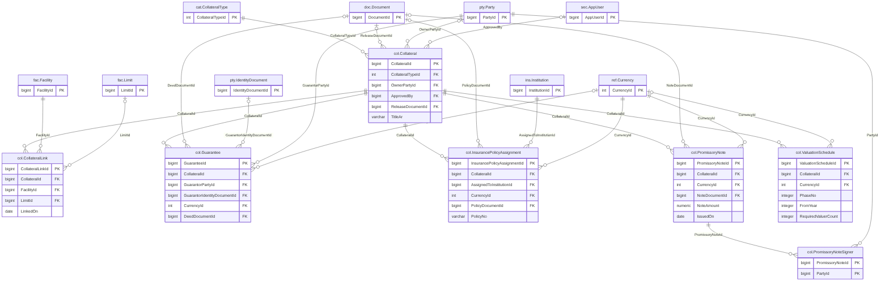

**مواصفات الجداول**

| الجدول | الغرض | PK | FK | UQ | CHECK | أعمدة أخرى |
|---|---|---|---|---|---|---|
| `col.Collateral` | سجل ضمان؛ اعتماد مستقل عن مراجعة التسهيل والتعديل نسخة جديدة (FR-COL-001/014، V-COL-01، §8) | CollateralId | 8 | 0 | 9 | 19 |
| `col.CollateralLink` | ربط ضمان بتسهيل أو حد؛ ضمان واحد لعدة تسهيلات (FR-COL-002، BR-COL-005) | CollateralLinkId | 4 | 0 | 4 | 9 |
| `col.Guarantee` | كفالة 1:1 مع Collateral؛ الكفيل Party دائمًا ولا أرقام هوية هنا (FR-COL-003/004، BR-COL-001) | GuaranteeId | 5 | 0 | 5 | 9 |
| `col.InsurancePolicyAssignment` | تجيير وثيقة تأمين؛ مفتاح الفرادة (CollateralId,PolicyNo) يسمح بتجديد الوثيقة (FR-COL-006، BR-COL-003) | InsurancePolicyAssignmentId | 4 | 0 | 5 | 12 |
| `col.PromissoryNote` | سند لأمر 1:1؛ مبلغ مستقل قد يفوق الحد (FR-COL-005، BR-COL-002)؛ NextRenewalDue وPNRatio مشتقان | PromissoryNoteId | 3 | 0 | 5 | 10 |
| `col.PromissoryNoteSigner` | موقّعو السند (SignerPartyIds) -- جدول وسيط جديد؛ مزوّد PromissoryNote signer (FR-COL-015) | PromissoryNoteId, PartyId | 2 | 0 | 0 | 4 |
| `col.ValuationSchedule` | مراحل تقييم عقار (FR-COL-008، BR-COL-004)؛ مثل 3 مقيّمين في السنة الأولى ثم مقيّم سنويًا | ValuationScheduleId | 2 | 0 | 7 | 11 |

**العلاقات (المفاتيح الأجنبية)**

| الطفل (الجدول.العمود) | الأب | العلاقة | الإلزام | النطاق | الحذف | أعمدة النطاق |
|---|---|---|---|---|---|---|
| `col.Collateral.CollateralTypeId` | `cat.CollateralType` | 1 : N | إلزامي | مشترك · مركّب | قيد | — |
| `col.Collateral.OwnerPartyId` | `pty.Party` | 1 : N | اختياري | مشترك · مركّب | قيد | — |
| `col.Collateral.ApprovedBy` | `sec.AppUser` | 1 : N | اختياري | مشترك · مركّب | قيد | — |
| `col.Collateral.SupersedesId` | `col.Collateral` | 1 : N | اختياري | مشترك · مركّب | قيد | — |
| `col.Collateral.ReleaseDocumentId` | `doc.Document` | 1 : N | اختياري | مشترك · مركّب | قيد | — |
| `col.Collateral.SourceDocumentId` | `doc.Document` | 1 : N | اختياري | مشترك · مركّب | قيد | — |
| `col.Collateral.VerifiedBy` | `sec.AppUser` | 1 : N | اختياري | مشترك · مركّب | قيد | — |
| `col.Collateral.ConflictId` | `fac.ValueConflict` | 1 : N | اختياري | مشترك · مركّب | قيد | — |
| `col.CollateralLink.CollateralId` | `col.Collateral` | 1 : N | إلزامي | مشترك · مركّب | قيد | — |
| `col.CollateralLink.FacilityId` | `fac.Facility` | 1 : N | إلزامي | مشترك · مركّب | قيد | — |
| `col.CollateralLink.LimitId` | `fac.Limit` | 1 : N | اختياري | مشترك · مركّب | قيد | FacilityId |
| `col.CollateralLink.SupersedesId` | `col.CollateralLink` | 1 : N | اختياري | مشترك · مركّب | قيد | — |
| `col.Guarantee.CollateralId` | `col.Collateral` | 1 : N | إلزامي | مشترك · مركّب | قيد | — |
| `col.Guarantee.GuarantorPartyId` | `pty.Party` | 1 : N | إلزامي | مشترك · مركّب | قيد | — |
| `col.Guarantee.GuarantorIdentityDocumentId` | `pty.IdentityDocument` | 1 : N | اختياري | مشترك · مركّب | قيد | — |
| `col.Guarantee.CurrencyId` | `ref.Currency` | 1 : N | اختياري | مرجع عام | قيد | — |
| `col.Guarantee.DeedDocumentId` | `doc.Document` | 1 : N | اختياري | مشترك · مركّب | قيد | — |
| `col.InsurancePolicyAssignment.CollateralId` | `col.Collateral` | 1 : N | إلزامي | مشترك · مركّب | قيد | — |
| `col.InsurancePolicyAssignment.AssignedToInstitutionId` | `ins.Institution` | 1 : N | إلزامي | مشترك · مركّب | قيد | — |
| `col.InsurancePolicyAssignment.CurrencyId` | `ref.Currency` | 1 : N | إلزامي | مرجع عام | قيد | — |
| `col.InsurancePolicyAssignment.PolicyDocumentId` | `doc.Document` | 1 : N | اختياري | مشترك · مركّب | قيد | — |
| `col.PromissoryNote.CollateralId` | `col.Collateral` | 1 : N | إلزامي | مشترك · مركّب | قيد | — |
| `col.PromissoryNote.CurrencyId` | `ref.Currency` | 1 : N | إلزامي | مرجع عام | قيد | — |
| `col.PromissoryNote.NoteDocumentId` | `doc.Document` | 1 : N | اختياري | مشترك · مركّب | قيد | — |
| `col.PromissoryNoteSigner.PromissoryNoteId` | `col.PromissoryNote` | 1 : N | إلزامي | مشترك · مركّب | قيد | — |
| `col.PromissoryNoteSigner.PartyId` | `pty.Party` | 1 : N | إلزامي | مشترك · مركّب | قيد | — |
| `col.ValuationSchedule.CollateralId` | `col.Collateral` | 1 : N | إلزامي | مشترك · مركّب | قيد | — |
| `col.ValuationSchedule.CurrencyId` | `ref.Currency` | 1 : N | اختياري | مرجع عام | قيد | — |

#### م5 · الالتزامات والتعهدات (1/2)

*Obligations, covenants & reporting* — 7 جدولًا

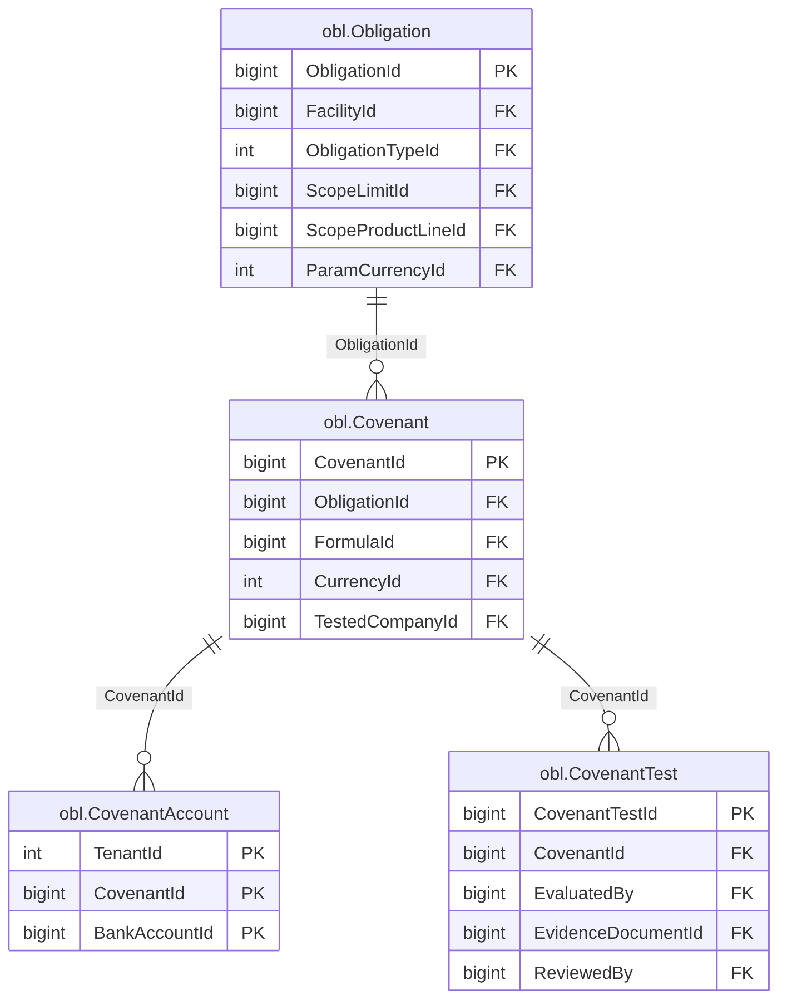

**مواصفات الجداول**

| الجدول | الغرض | PK | FK | UQ | CHECK | أعمدة أخرى |
|---|---|---|---|---|---|---|
| `obl.Covenant` | نسخة تعهد بتواريخ؛ الحدود المتدرجة = عدة نسخ (FR-OBL-006، BR-OBL-001/005/006، Q-OBL-01) | CovenantId | 5 | 0 | 11 | 22 |
| `obl.CovenantAccount` | AccountIds لـ SELECTED_ACCOUNTS -- جدول وسيط جديد؛ الحذف لصفوف مسودة المراجعة فقط (يفرضه التطبيق) | CovenantId, BankAccountId | 2 | 0 | 0 | 4 |
| `obl.CovenantTest` | تقييم تعهد لفترة وإصدار تقييم؛ المخزَّن لا يُعدَّل (FR-OBL-011، FR-FIN-012/013، BR-OBL-006/007، §8) | CovenantTestId | 4 | 0 | 14 | 22 |
| `obl.Obligation` | التزام على تسهيل (أو حد/خط/شركات)؛ العائلة من ObligationType ولا تُحرَّر (FR-OBL-001، BR-OBL-001) | ObligationId | 9 | 0 | 11 | 28 |
| `obl.ObligationBreach` | سجل خرق وعلاجه وتنازله (FR-OBL-012، BR-OBL-009/011، §8) | ObligationBreachId | 5 | 0 | 10 | 17 |
| `obl.ObligationCompany` | AppliesToCompanyIds -- جدول وسيط جديد؛ الحذف لصفوف مسودة المراجعة فقط (يفرضه التطبيق) | ObligationId, CompanyId | 2 | 0 | 0 | 4 |
| `obl.ReportingInstance` | بند أجندة مولَّد أو مسجَّل لحدث (FR-OBL-003..005، BR-OBL-003، §8)؛ DUE_SOON/OVERDUE مشتقتان | ReportingInstanceId | 4 | 0 | 7 | 15 |

**العلاقات (المفاتيح الأجنبية)**

| الطفل (الجدول.العمود) | الأب | العلاقة | الإلزام | النطاق | الحذف | أعمدة النطاق |
|---|---|---|---|---|---|---|
| `obl.Covenant.ObligationId` | `obl.Obligation` | 1 : N | إلزامي | مشترك · مركّب | قيد | — |
| `obl.Covenant.FormulaId` | `fin.MeasureFormula` | 1 : N | اختياري | مشترك · مركّب | قيد | — |
| `obl.Covenant.CurrencyId` | `ref.Currency` | 1 : N | اختياري | مرجع عام | قيد | — |
| `obl.Covenant.TestedCompanyId` | `org.Company` | 1 : N | إلزامي | مشترك · مركّب | قيد | — |
| `obl.Covenant.SupersedesId` | `obl.Covenant` | 1 : N | اختياري | مشترك · مركّب | قيد | — |
| `obl.CovenantAccount.CovenantId` | `obl.Covenant` | 1 : N | إلزامي | مشترك · مركّب | قيد | — |
| `obl.CovenantAccount.BankAccountId` | `acc.BankAccount` | 1 : N | إلزامي | مشترك · مركّب | قيد | — |
| `obl.CovenantTest.CovenantId` | `obl.Covenant` | 1 : N | إلزامي | مشترك · مركّب | قيد | — |
| `obl.CovenantTest.EvaluatedBy` | `sec.AppUser` | 1 : N | اختياري | مشترك · مركّب | قيد | — |
| `obl.CovenantTest.EvidenceDocumentId` | `doc.Document` | 1 : N | اختياري | مشترك · مركّب | قيد | — |
| `obl.CovenantTest.ReviewedBy` | `sec.AppUser` | 1 : N | اختياري | مشترك · مركّب | قيد | — |
| `obl.Obligation.FacilityId` | `fac.Facility` | 1 : N | إلزامي | مشترك · مركّب | قيد | — |
| `obl.Obligation.ObligationTypeId` | `cat.ObligationType` | 1 : N | إلزامي | مشترك · مركّب | قيد | — |
| `obl.Obligation.ScopeLimitId` | `fac.Limit` | 1 : N | اختياري | مشترك · مركّب | قيد | FacilityId |
| `obl.Obligation.ScopeProductLineId` | `fac.LimitProductLine` | 1 : N | اختياري | مشترك · مركّب | قيد | FacilityId |
| `obl.Obligation.ParamCurrencyId` | `ref.Currency` | 1 : N | اختياري | مرجع عام | قيد | — |
| `obl.Obligation.SupersedesId` | `obl.Obligation` | 1 : N | اختياري | مشترك · مركّب | قيد | — |
| `obl.Obligation.SourceDocumentId` | `doc.Document` | 1 : N | اختياري | مشترك · مركّب | قيد | — |
| `obl.Obligation.VerifiedBy` | `sec.AppUser` | 1 : N | اختياري | مشترك · مركّب | قيد | — |
| `obl.Obligation.ConflictId` | `fac.ValueConflict` | 1 : N | اختياري | مشترك · مركّب | قيد | — |
| `obl.ObligationBreach.ObligationId` | `obl.Obligation` | 1 : N | إلزامي | مشترك · مركّب | قيد | — |
| `obl.ObligationBreach.CovenantTestId` | `obl.CovenantTest` | 1 : N | اختياري | مشترك · مركّب | قيد | — |
| `obl.ObligationBreach.ReportingInstanceId` | `obl.ReportingInstance` | 1 : N | اختياري | مشترك · مركّب | قيد | — |
| `obl.ObligationBreach.WaiverBankContactId` | `ins.Contact` | 1 : N | اختياري | مشترك · مركّب | قيد | — |
| `obl.ObligationBreach.WaiverDocumentId` | `doc.Document` | 1 : N | اختياري | مشترك · مركّب | قيد | — |
| `obl.ObligationCompany.ObligationId` | `obl.Obligation` | 1 : N | إلزامي | مشترك · مركّب | قيد | — |
| `obl.ObligationCompany.CompanyId` | `org.Company` | 1 : N | إلزامي | مشترك · مركّب | قيد | — |
| `obl.ReportingInstance.ReportingObligationId` | `obl.ReportingObligation` | 1 : N | إلزامي | مشترك · مركّب | قيد | — |
| `obl.ReportingInstance.SubmissionChannelUsedId` | `cat.LookupItem` | 1 : N | اختياري | مرجع عام | قيد | — |
| `obl.ReportingInstance.EvidenceDocumentId` | `doc.Document` | 1 : N | اختياري | مشترك · مركّب | قيد | — |
| `obl.ReportingInstance.CurrencyId` | `ref.Currency` | 1 : N | اختياري | مرجع عام | قيد | — |

#### م5 · الالتزامات والتعهدات (2/2)

*Obligations, covenants & reporting* — 1 جدولًا

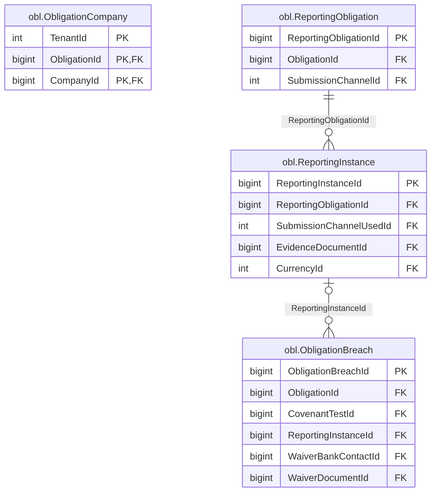

**مواصفات الجداول**

| الجدول | الغرض | PK | FK | UQ | CHECK | أعمدة أخرى |
|---|---|---|---|---|---|---|
| `obl.ReportingObligation` | قاعدة استحقاق تقرير/إخطار 1:1 مع Obligation (FR-OBL-002/003، BR-OBL-002، V-OBL-01) | ReportingObligationId | 3 | 0 | 10 | 18 |

**العلاقات (المفاتيح الأجنبية)**

| الطفل (الجدول.العمود) | الأب | العلاقة | الإلزام | النطاق | الحذف | أعمدة النطاق |
|---|---|---|---|---|---|---|
| `obl.ReportingObligation.ObligationId` | `obl.Obligation` | 1 : N | إلزامي | مشترك · مركّب | قيد | — |
| `obl.ReportingObligation.SubmissionChannelId` | `cat.LookupItem` | 1 : N | اختياري | مرجع عام | قيد | — |
| `obl.ReportingObligation.SupersedesId` | `obl.ReportingObligation` | 1 : N | اختياري | مشترك · مركّب | قيد | — |

#### م5 · البيانات المالية والأرصدة

*Financial statements & balances* — 7 جدولًا

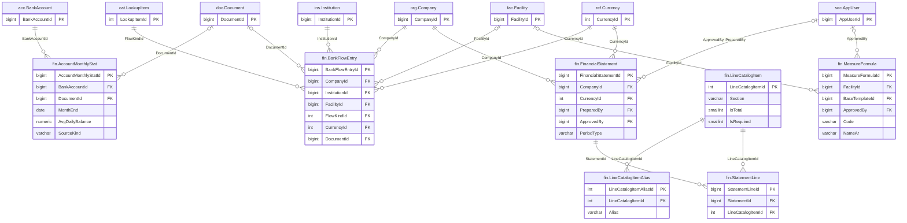

**مواصفات الجداول**

| الجدول | الغرض | PK | FK | UQ | CHECK | أعمدة أخرى |
|---|---|---|---|---|---|---|
| `fin.AccountMonthlyStat` | رصيد شهري لحساب بعملة الحساب (FR-FIN-008، BR-FIN-005/006، V-FIN-02) | AccountMonthlyStatId | 2 | 0 | 0 | 12 |
| `fin.BankFlowEntry` | مبلغ محوَّل للبنك في شهر؛ تجميع سنوي آلي (FR-FIN-009/010، BR-FIN-007/008) | BankFlowEntryId | 6 | 0 | 1 | 7 |
| `fin.FinancialStatement` | رأس قائمة مالية؛ سري جدًا (FR-FIN-002/005/006، BR-FIN-001..004، §8) | FinancialStatementId | 6 | 0 | 8 | 19 |
| `fin.LineCatalogItem` | بند معياري للقوائم؛ 39 بندًا مزروعًا؛ النظامي في الصيغ لا يُحذف (FR-FIN-001، CatalogBase) | LineCatalogItemId | 0 | 0 | 5 | 17 |
| `fin.LineCatalogItemAlias` | الأسماء البديلة للبند (Aliases) للصق والمطابقة -- جدول جديد يحل «Aliases set» (FR-FIN-003) | LineCatalogItemAliasId | 1 | 0 | 1 | 4 |
| `fin.MeasureFormula` | صيغة مقياس: قالب أو نسخة اتفاقية بإصدارات؛ لا تُنفَّذ نصًا (FR-FIN-011، BR-FIN-009، §12) | MeasureFormulaId | 6 | 0 | 10 | 20 |
| `fin.StatementLine` | سطر قائمة؛ بعملة الرأس والمخزَّن = المُدخل x UnitScale؛ Variance مشتق؛ سري جدًا (BR-FIN-001/002) | StatementLineId | 2 | 0 | 0 | 5 |

**العلاقات (المفاتيح الأجنبية)**

| الطفل (الجدول.العمود) | الأب | العلاقة | الإلزام | النطاق | الحذف | أعمدة النطاق |
|---|---|---|---|---|---|---|
| `fin.AccountMonthlyStat.BankAccountId` | `acc.BankAccount` | 1 : N | إلزامي | مشترك · مركّب | قيد | — |
| `fin.AccountMonthlyStat.DocumentId` | `doc.Document` | 1 : N | اختياري | مشترك · مركّب | قيد | — |
| `fin.BankFlowEntry.CompanyId` | `org.Company` | 1 : N | إلزامي | مشترك · مركّب | قيد | — |
| `fin.BankFlowEntry.InstitutionId` | `ins.Institution` | 1 : N | إلزامي | مشترك · مركّب | قيد | — |
| `fin.BankFlowEntry.FacilityId` | `fac.Facility` | 1 : N | اختياري | مشترك · مركّب | قيد | — |
| `fin.BankFlowEntry.FlowKindId` | `cat.LookupItem` | 1 : N | إلزامي | مرجع عام | قيد | — |
| `fin.BankFlowEntry.CurrencyId` | `ref.Currency` | 1 : N | إلزامي | مرجع عام | قيد | — |
| `fin.BankFlowEntry.DocumentId` | `doc.Document` | 1 : N | اختياري | مشترك · مركّب | قيد | — |
| `fin.FinancialStatement.CompanyId` | `org.Company` | 1 : N | إلزامي | مشترك · مركّب | قيد | — |
| `fin.FinancialStatement.CurrencyId` | `ref.Currency` | 1 : N | إلزامي | مرجع عام | قيد | — |
| `fin.FinancialStatement.SupersedesId` | `fin.FinancialStatement` | 1 : N | اختياري | مشترك · مركّب | قيد | — |
| `fin.FinancialStatement.SourceDocumentId` | `doc.Document` | 1 : N | اختياري | مشترك · مركّب | قيد | — |
| `fin.FinancialStatement.PreparedBy` | `sec.AppUser` | 1 : N | اختياري | مشترك · مركّب | قيد | — |
| `fin.FinancialStatement.ApprovedBy` | `sec.AppUser` | 1 : N | اختياري | مشترك · مركّب | قيد | — |
| `fin.LineCatalogItemAlias.LineCatalogItemId` | `fin.LineCatalogItem` | 1 : N | إلزامي | مشترك · مركّب | قيد | — |
| `fin.MeasureFormula.FacilityId` | `fac.Facility` | 1 : N | اختياري | مشترك · مركّب | قيد | — |
| `fin.MeasureFormula.BaseTemplateId` | `fin.MeasureFormula` | 1 : N | اختياري | مشترك · مركّب | قيد | — |
| `fin.MeasureFormula.ApprovedBy` | `sec.AppUser` | 1 : N | اختياري | مشترك · مركّب | قيد | — |
| `fin.MeasureFormula.SourceDocumentId` | `doc.Document` | 1 : N | اختياري | مشترك · مركّب | قيد | — |
| `fin.MeasureFormula.VerifiedBy` | `sec.AppUser` | 1 : N | اختياري | مشترك · مركّب | قيد | — |
| `fin.MeasureFormula.ConflictId` | `fac.ValueConflict` | 1 : N | اختياري | مشترك · مركّب | قيد | — |
| `fin.StatementLine.StatementId` | `fin.FinancialStatement` | 1 : N | إلزامي | مشترك · مركّب | قيد | — |
| `fin.StatementLine.LineCatalogItemId` | `fin.LineCatalogItem` | 1 : N | إلزامي | مشترك · مركّب | قيد | — |

### 10.8 م6 · الطلبات ودورات العمل والإشعارات

#### م6 · قوالب دورات العمل (1/2)

*Workflow templates* — 7 جدولًا

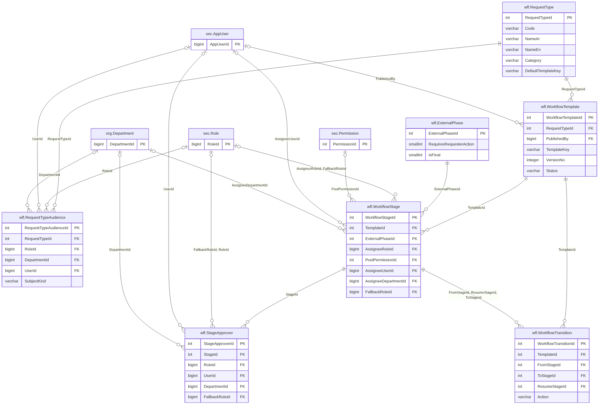

**مواصفات الجداول**

| الجدول | الغرض | PK | FK | UQ | CHECK | أعمدة أخرى |
|---|---|---|---|---|---|---|
| `wfl.RequestType` | تعريف نوع الطلب (FR-REQ-001، BR-REQ-001، V-REQ-01)؛ الأنواع الجديدة بلا كود (FR-REQ-021) | RequestTypeId | 0 | 0 | 2 | 21 |
| `wfl.RequestTypeAudience` | جمهور النوع: من يحق له الطلب؛ غياب الصفوف = لا أحد (فشل مغلق) (FR-REQ-007) | RequestTypeAudienceId | 4 | 0 | 1 | 5 |
| `wfl.ExternalPhase` | المرحلة الظاهرة للطالب: DRAFT · IN_APPROVAL · RETURNED · AWAITING_REQUESTER · IN_PROGRESS · COMPLETED · REJECTED · CANCELLED (BR-WFL-011، D-6) | ExternalPhaseId | 0 | 0 | 1 | 16 |
| `wfl.WorkflowTemplate` | نسخة قالب دورة عمل؛ المنشورة ثابتة (FR-WFL-001/028، BR-WFL-019، AC-WFL-6) | WorkflowTemplateId | 2 | 0 | 8 | 20 |
| `wfl.WorkflowStage` | مرحلة في نسخة قالب (FR-WFL-003/004/005، BR-WFL-002/010/012)؛ حذف فعلي لمسودة النسخة فقط | WorkflowStageId | 7 | 0 | 14 | 22 |
| `wfl.StageApprover` | خانة موافقة في مرحلة APPROVAL؛ ALL = كل الخانات، ودور بشخصين يلزمان معًا = خانتان (FR-WFL-007/041، BR-WFL-003/004) | StageApproverId | 5 | 0 | 7 | 10 |
| `wfl.WorkflowTransition` | انتقال بين مرحلتين بشرط وأولوية؛ دورة خطية بتفرع شرطي بسيط (FR-WFL-006، BR-WFL-001، D-8) | WorkflowTransitionId | 4 | 0 | 4 | 9 |

**العلاقات (المفاتيح الأجنبية)**

| الطفل (الجدول.العمود) | الأب | العلاقة | الإلزام | النطاق | الحذف | أعمدة النطاق |
|---|---|---|---|---|---|---|
| `wfl.RequestTypeAudience.RequestTypeId` | `wfl.RequestType` | 1 : N | إلزامي | مشترك · مركّب | قيد | — |
| `wfl.RequestTypeAudience.RoleId` | `sec.Role` | 1 : N | اختياري | مشترك · مركّب | قيد | — |
| `wfl.RequestTypeAudience.DepartmentId` | `org.Department` | 1 : N | اختياري | مشترك · مركّب | قيد | — |
| `wfl.RequestTypeAudience.UserId` | `sec.AppUser` | 1 : N | اختياري | مشترك · مركّب | قيد | — |
| `wfl.WorkflowTemplate.RequestTypeId` | `wfl.RequestType` | 1 : N | إلزامي | مشترك · مركّب | قيد | — |
| `wfl.WorkflowTemplate.PublishedBy` | `sec.AppUser` | 1 : N | اختياري | مشترك · مركّب | قيد | — |
| `wfl.WorkflowStage.TemplateId` | `wfl.WorkflowTemplate` | 1 : N | إلزامي | مشترك · مركّب | قيد | — |
| `wfl.WorkflowStage.ExternalPhaseId` | `wfl.ExternalPhase` | 1 : N | إلزامي | مشترك · مركّب | قيد | — |
| `wfl.WorkflowStage.AssigneeRoleId` | `sec.Role` | 1 : N | اختياري | مشترك · مركّب | قيد | — |
| `wfl.WorkflowStage.PoolPermissionId` | `sec.Permission` | 1 : N | اختياري | مرجع عام | قيد | — |
| `wfl.WorkflowStage.AssigneeUserId` | `sec.AppUser` | 1 : N | اختياري | مشترك · مركّب | قيد | — |
| `wfl.WorkflowStage.AssigneeDepartmentId` | `org.Department` | 1 : N | اختياري | مشترك · مركّب | قيد | — |
| `wfl.WorkflowStage.FallbackRoleId` | `sec.Role` | 1 : N | اختياري | مشترك · مركّب | قيد | — |
| `wfl.StageApprover.StageId` | `wfl.WorkflowStage` | 1 : N | إلزامي | مشترك · مركّب | قيد | — |
| `wfl.StageApprover.RoleId` | `sec.Role` | 1 : N | اختياري | مشترك · مركّب | قيد | — |
| `wfl.StageApprover.UserId` | `sec.AppUser` | 1 : N | اختياري | مشترك · مركّب | قيد | — |
| `wfl.StageApprover.DepartmentId` | `org.Department` | 1 : N | اختياري | مشترك · مركّب | قيد | — |
| `wfl.StageApprover.FallbackRoleId` | `sec.Role` | 1 : N | اختياري | مشترك · مركّب | قيد | — |
| `wfl.WorkflowTransition.TemplateId` | `wfl.WorkflowTemplate` | 1 : N | إلزامي | مشترك · مركّب | قيد | — |
| `wfl.WorkflowTransition.FromStageId` | `wfl.WorkflowStage` | 1 : N | إلزامي | مشترك · مركّب | قيد | TemplateId |
| `wfl.WorkflowTransition.ToStageId` | `wfl.WorkflowStage` | 1 : N | إلزامي | مشترك · مركّب | قيد | TemplateId |
| `wfl.WorkflowTransition.ResumeStageId` | `wfl.WorkflowStage` | 1 : N | اختياري | مشترك · مركّب | قيد | TemplateId |

#### م6 · قوالب دورات العمل (2/2)

*Workflow templates* — 3 جدولًا

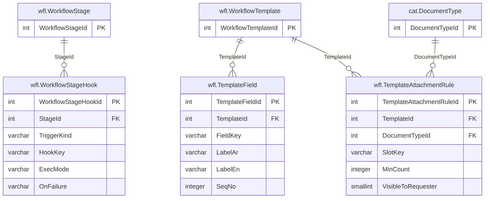

**مواصفات الجداول**

| الجدول | الغرض | PK | FK | UQ | CHECK | أعمدة أخرى |
|---|---|---|---|---|---|---|
| `wfl.WorkflowStageHook` | خطاف مسجَّل بالكود على مرحلة: مفتاح ومعاملات لا شيفرة (FR-WFL-021، BR-WFL-015، §5.4) | WorkflowStageHookId | 1 | 0 | 2 | 10 |
| `wfl.TemplateField` | حقل في نسخة قالب يولّد النموذج بلا كود واجهة (FR-REQ-002..005، BR-REQ-003/004) | TemplateFieldId | 1 | 0 | 4 | 21 |
| `wfl.TemplateAttachmentRule` | قاعدة مرفق على نسخة قالب (FR-REQ-006، BR-REQ-005، FR-WFL-024/025) | TemplateAttachmentRuleId | 2 | 0 | 4 | 11 |

**العلاقات (المفاتيح الأجنبية)**

| الطفل (الجدول.العمود) | الأب | العلاقة | الإلزام | النطاق | الحذف | أعمدة النطاق |
|---|---|---|---|---|---|---|
| `wfl.WorkflowStageHook.StageId` | `wfl.WorkflowStage` | 1 : N | إلزامي | مشترك · مركّب | قيد | — |
| `wfl.TemplateField.TemplateId` | `wfl.WorkflowTemplate` | 1 : N | إلزامي | مشترك · مركّب | قيد | — |
| `wfl.TemplateAttachmentRule.TemplateId` | `wfl.WorkflowTemplate` | 1 : N | إلزامي | مشترك · مركّب | قيد | — |
| `wfl.TemplateAttachmentRule.DocumentTypeId` | `cat.DocumentType` | 1 : N | إلزامي | مشترك · مركّب | قيد | — |

#### م6 · الطلبات وإجراءاتها (1/2)

*Requests, approvals & actions* — 7 جدولًا

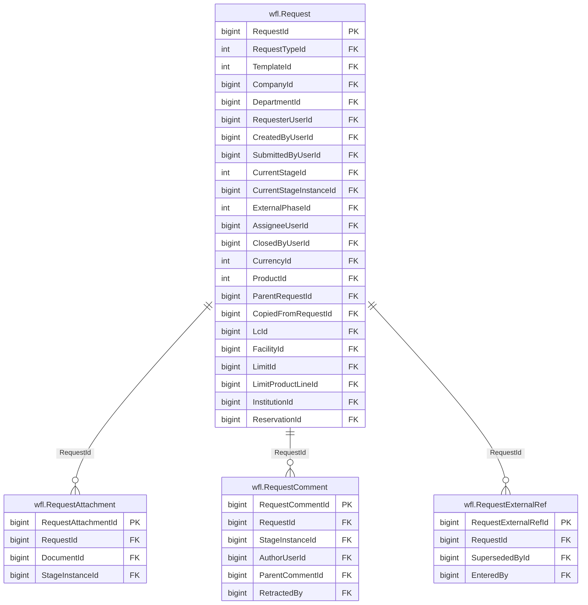

**مواصفات الجداول**

| الجدول | الغرض | PK | FK | UQ | CHECK | أعمدة أخرى |
|---|---|---|---|---|---|---|
| `wfl.Request` | الطلب: أكثر الجداول ازدحامًا؛ الحالة الداخلية منفصلة عن المرحلة الظاهرة (FR-WFL-001، FR-REQ-009، D-6، BR-REQ-002/003) | RequestId | 22 | 0 | 23 | 36 |
| `wfl.RequestComment` | تعليق ظاهر للطالب أو داخلي؛ غير قابل للتعديل (سحب مع بقاء الأصل) (FR-REQ-017، BR-REQ-014) | RequestCommentId | 5 | 0 | 2 | 6 |
| `wfl.RequestAttachment` | ربط مستند بطلب ينشئ DocumentLink (EntityType=Request) (FR-REQ-006، BR-REQ-005) | RequestAttachmentId | 3 | 0 | 0 | 6 |
| `wfl.RequestExternalRef` | مرجع خارجي بنص حر؛ تعديل بالإحلال ويبقى التاريخ؛ بلا تحقق خارجي (FR-REQ-010، X-DAT-7، BR-REQ-006) | RequestExternalRefId | 3 | 0 | 2 | 10 |
| `wfl.RequestStageInstance` | دخول طلب إلى مرحلة؛ مصدر مقاييس الأزمنة والسحب والـ SLA (BR-WFL-002/007/012، §8) | RequestStageInstanceId | 4 | 0 | 12 | 17 |
| `wfl.RequestApproval` | خانة موافقة تُنشأ لكل دخول ودورة؛ الدورة الجديدة بخانات جديدة (BR-WFL-003، FR-WFL-007/008/011) | RequestApprovalId | 7 | 0 | 7 | 16 |
| `wfl.RequestAction` | سجل إجراءات للإضافة فقط يغطي كل حدث؛ غير AuditLog الأمني (FR-WFL-033/034، §6.2) | RequestActionId | 4 | 0 | 2 | 14 |

**العلاقات (المفاتيح الأجنبية)**

| الطفل (الجدول.العمود) | الأب | العلاقة | الإلزام | النطاق | الحذف | أعمدة النطاق |
|---|---|---|---|---|---|---|
| `wfl.Request.RequestTypeId` | `wfl.RequestType` | 1 : N | إلزامي | مشترك · مركّب | قيد | — |
| `wfl.Request.TemplateId` | `wfl.WorkflowTemplate` | 1 : N | إلزامي | مشترك · مركّب | قيد | RequestTypeId |
| `wfl.Request.CompanyId` | `org.Company` | 1 : N | إلزامي | مشترك · مركّب | قيد | — |
| `wfl.Request.DepartmentId` | `org.Department` | 1 : N | اختياري | مشترك · مركّب | قيد | — |
| `wfl.Request.RequesterUserId` | `sec.AppUser` | 1 : N | إلزامي | مشترك · مركّب | قيد | — |
| `wfl.Request.CreatedByUserId` | `sec.AppUser` | 1 : N | إلزامي | مشترك · مركّب | قيد | — |
| `wfl.Request.SubmittedByUserId` | `sec.AppUser` | 1 : N | اختياري | مشترك · مركّب | قيد | — |
| `wfl.Request.CurrentStageId` | `wfl.WorkflowStage` | 1 : N | اختياري | مشترك · مركّب | قيد | TemplateId |
| `wfl.Request.CurrentStageInstanceId` | `wfl.RequestStageInstance` | 1 : N | اختياري | مشترك · مركّب | قيد | — |
| `wfl.Request.ExternalPhaseId` | `wfl.ExternalPhase` | 1 : N | إلزامي | مشترك · مركّب | قيد | — |
| `wfl.Request.AssigneeUserId` | `sec.AppUser` | 1 : N | اختياري | مشترك · مركّب | قيد | — |
| `wfl.Request.ClosedByUserId` | `sec.AppUser` | 1 : N | اختياري | مشترك · مركّب | قيد | — |
| `wfl.Request.CurrencyId` | `ref.Currency` | 1 : N | اختياري | مرجع عام | قيد | — |
| `wfl.Request.ProductId` | `cat.Product` | 1 : N | اختياري | مشترك · مركّب | قيد | — |
| `wfl.Request.ParentRequestId` | `wfl.Request` | 1 : N | اختياري | مشترك · مركّب | قيد | — |
| `wfl.Request.CopiedFromRequestId` | `wfl.Request` | 1 : N | اختياري | مشترك · مركّب | قيد | — |
| `wfl.Request.LcId` | `lc.LetterOfCredit` | 1 : N | اختياري | مشترك · مركّب | قيد | — |
| `wfl.Request.FacilityId` | `fac.Facility` | 1 : N | اختياري | مشترك · مركّب | قيد | — |
| `wfl.Request.LimitId` | `fac.Limit` | 1 : N | اختياري | مشترك · مركّب | قيد | FacilityId |
| `wfl.Request.LimitProductLineId` | `fac.LimitProductLine` | 1 : N | اختياري | مشترك · مركّب | قيد | FacilityId, LimitId |
| `wfl.Request.InstitutionId` | `ins.Institution` | 1 : N | اختياري | مشترك · مركّب | قيد | — |
| `wfl.Request.ReservationId` | `fac.LimitReservation` | 1 : N | اختياري | مشترك · مركّب | قيد | — |
| `wfl.RequestComment.RequestId` | `wfl.Request` | 1 : N | إلزامي | مشترك · مركّب | قيد | — |
| `wfl.RequestComment.StageInstanceId` | `wfl.RequestStageInstance` | 1 : N | اختياري | مشترك · مركّب | قيد | RequestId |
| `wfl.RequestComment.AuthorUserId` | `sec.AppUser` | 1 : N | إلزامي | مشترك · مركّب | قيد | — |
| `wfl.RequestComment.ParentCommentId` | `wfl.RequestComment` | 1 : N | اختياري | مشترك · مركّب | قيد | RequestId |
| `wfl.RequestComment.RetractedBy` | `sec.AppUser` | 1 : N | اختياري | مشترك · مركّب | قيد | — |
| `wfl.RequestAttachment.RequestId` | `wfl.Request` | 1 : N | إلزامي | مشترك · مركّب | قيد | — |
| `wfl.RequestAttachment.DocumentId` | `doc.Document` | 1 : N | إلزامي | مشترك · مركّب | قيد | — |
| `wfl.RequestAttachment.StageInstanceId` | `wfl.RequestStageInstance` | 1 : N | اختياري | مشترك · مركّب | قيد | RequestId |
| `wfl.RequestExternalRef.RequestId` | `wfl.Request` | 1 : N | إلزامي | مشترك · مركّب | قيد | — |
| `wfl.RequestExternalRef.SupersededById` | `wfl.RequestExternalRef` | 1 : N | اختياري | مشترك · مركّب | قيد | RequestId |
| `wfl.RequestExternalRef.EnteredBy` | `sec.AppUser` | 1 : N | اختياري | مشترك · مركّب | قيد | — |
| `wfl.RequestStageInstance.RequestId` | `wfl.Request` | 1 : N | إلزامي | مشترك · مركّب | قيد | — |
| `wfl.RequestStageInstance.StageId` | `wfl.WorkflowStage` | 1 : N | إلزامي | مشترك · مركّب | قيد | — |
| `wfl.RequestStageInstance.AssigneeUserId` | `sec.AppUser` | 1 : N | اختياري | مشترك · مركّب | قيد | — |
| `wfl.RequestStageInstance.ResumeStageId` | `wfl.WorkflowStage` | 1 : N | اختياري | مشترك · مركّب | قيد | — |
| `wfl.RequestApproval.RequestId` | `wfl.Request` | 1 : N | إلزامي | مشترك · مركّب | قيد | — |
| `wfl.RequestApproval.StageInstanceId` | `wfl.RequestStageInstance` | 1 : N | إلزامي | مشترك · مركّب | قيد | RequestId |
| `wfl.RequestApproval.AssignedUserId` | `sec.AppUser` | 1 : N | اختياري | مشترك · مركّب | قيد | — |
| `wfl.RequestApproval.AssignedRoleId` | `sec.Role` | 1 : N | اختياري | مشترك · مركّب | قيد | — |
| `wfl.RequestApproval.ActedByUserId` | `sec.AppUser` | 1 : N | اختياري | مشترك · مركّب | قيد | — |
| `wfl.RequestApproval.OnBehalfOfUserId` | `sec.AppUser` | 1 : N | اختياري | مشترك · مركّب | قيد | — |
| `wfl.RequestApproval.DelegationId` | `wfl.UserDelegation` | 1 : N | اختياري | مشترك · مركّب | قيد | — |
| `wfl.RequestAction.RequestId` | `wfl.Request` | 1 : N | إلزامي | مشترك · مركّب | قيد | — |
| `wfl.RequestAction.StageInstanceId` | `wfl.RequestStageInstance` | 1 : N | اختياري | مشترك · مركّب | قيد | RequestId |
| `wfl.RequestAction.ActorUserId` | `sec.AppUser` | 1 : N | اختياري | مشترك · مركّب | قيد | — |
| `wfl.RequestAction.OnBehalfOfUserId` | `sec.AppUser` | 1 : N | اختياري | مشترك · مركّب | قيد | — |

#### م6 · الطلبات وإجراءاتها (2/2)

*Requests, approvals & actions* — 2 جدولًا

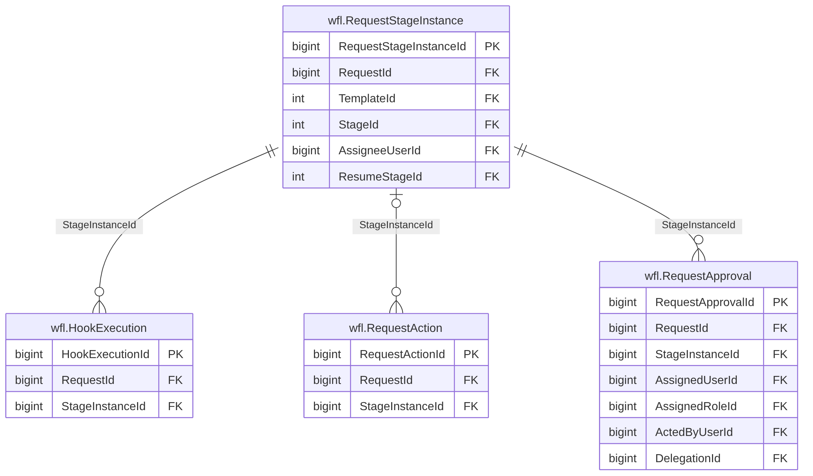

**مواصفات الجداول**

| الجدول | الغرض | PK | FK | UQ | CHECK | أعمدة أخرى |
|---|---|---|---|---|---|---|
| `wfl.HookExecution` | تنفيذ خطاف بمفتاح عدم تكرار يعيد النتيجة المخزَّنة (FR-WFL-021، BR-WFL-015) -- جدول جديد | HookExecutionId | 2 | 0 | 3 | 17 |
| `wfl.UserDelegation` | تفويض مهام بفترة ونطاق؛ لا تفويض متسلسل (FR-WFL-020، BR-WFL-021، V-WFL-06) | UserDelegationId | 4 | 0 | 4 | 10 |

**العلاقات (المفاتيح الأجنبية)**

| الطفل (الجدول.العمود) | الأب | العلاقة | الإلزام | النطاق | الحذف | أعمدة النطاق |
|---|---|---|---|---|---|---|
| `wfl.HookExecution.RequestId` | `wfl.Request` | 1 : N | إلزامي | مشترك · مركّب | قيد | — |
| `wfl.HookExecution.StageInstanceId` | `wfl.RequestStageInstance` | 1 : N | إلزامي | مشترك · مركّب | قيد | RequestId |
| `wfl.UserDelegation.FromUserId` | `sec.AppUser` | 1 : N | إلزامي | مشترك · مركّب | قيد | — |
| `wfl.UserDelegation.ToUserId` | `sec.AppUser` | 1 : N | إلزامي | مشترك · مركّب | قيد | — |
| `wfl.UserDelegation.RequestTypeId` | `wfl.RequestType` | 1 : N | اختياري | مشترك · مركّب | قيد | — |
| `wfl.UserDelegation.RevokedBy` | `sec.AppUser` | 1 : N | اختياري | مشترك · مركّب | قيد | — |

#### م6 · الإشعارات

*Notifications* — 7 جدولًا

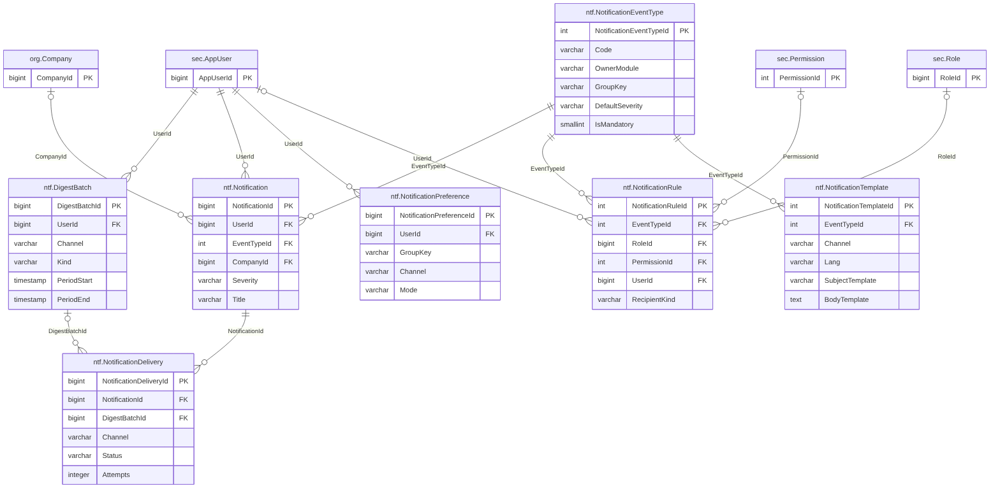

**مواصفات الجداول**

| الجدول | الغرض | PK | FK | UQ | CHECK | أعمدة أخرى |
|---|---|---|---|---|---|---|
| `ntf.DigestBatch` | دفعة ملخص لمستخدم وقناة وفترة؛ لا يُرسل فارغًا (FR-NTF-014، BR-NTF-004، JOB-NTF-DIGEST) -- جدول جديد يحل DigestBatchId | DigestBatchId | 1 | 0 | 4 | 12 |
| `ntf.Notification` | إشعار لمستخدم؛ المحتوى بلا قيم مقيّدة (FR-NTF-005/006/007/021، BR-NTF-001/002/007/008/011) | NotificationId | 3 | 0 | 5 | 21 |
| `ntf.NotificationDelivery` | تسليم الإشعار لكل قناة بحالاته وإعادة المحاولة (FR-NTF-019، BR-NTF-009، §8) | NotificationDeliveryId | 2 | 0 | 6 | 10 |
| `ntf.NotificationEventType` | كتالوج الأحداث؛ تملكه 13 لكل الوحدات وتبذر فيه الوحدات أحداثها (FR-NTF-001، §9.2، §9.2-ب) | NotificationEventTypeId | 0 | 0 | 4 | 16 |
| `ntf.NotificationPreference` | تفضيل المستخدم لكل مجموعة أحداث وقناة (FR-NTF-010، BR-NTF-003/014)؛ الإلزامي لا يُوقَف في التطبيق | NotificationPreferenceId | 1 | 0 | 0 | 6 |
| `ntf.NotificationRule` | قاعدة مستلمين لحدث؛ التعديل يسري على الأحداث التالية فقط (FR-NTF-003، BR-NTF-001، V-NTF-02) | NotificationRuleId | 4 | 0 | 2 | 10 |
| `ntf.NotificationTemplate` | قالب رسالة لكل (حدث، قناة، لغة)؛ الحذف = العودة إلى قالب البذرة (FR-NTF-012، FR-NTF-025) | NotificationTemplateId | 1 | 0 | 0 | 8 |

**العلاقات (المفاتيح الأجنبية)**

| الطفل (الجدول.العمود) | الأب | العلاقة | الإلزام | النطاق | الحذف | أعمدة النطاق |
|---|---|---|---|---|---|---|
| `ntf.DigestBatch.UserId` | `sec.AppUser` | 1 : N | إلزامي | مشترك · مركّب | قيد | — |
| `ntf.Notification.UserId` | `sec.AppUser` | 1 : N | إلزامي | مشترك · مركّب | قيد | — |
| `ntf.Notification.EventTypeId` | `ntf.NotificationEventType` | 1 : N | إلزامي | مشترك · مركّب | قيد | — |
| `ntf.Notification.CompanyId` | `org.Company` | 1 : N | اختياري | مشترك · مركّب | قيد | — |
| `ntf.NotificationDelivery.NotificationId` | `ntf.Notification` | 1 : N | إلزامي | مشترك · مركّب | قيد | — |
| `ntf.NotificationDelivery.DigestBatchId` | `ntf.DigestBatch` | 1 : N | اختياري | مشترك · مركّب | قيد | — |
| `ntf.NotificationPreference.UserId` | `sec.AppUser` | 1 : N | إلزامي | مشترك · مركّب | قيد | — |
| `ntf.NotificationRule.EventTypeId` | `ntf.NotificationEventType` | 1 : N | إلزامي | مشترك · مركّب | قيد | — |
| `ntf.NotificationRule.RoleId` | `sec.Role` | 1 : N | اختياري | مشترك · مركّب | قيد | — |
| `ntf.NotificationRule.PermissionId` | `sec.Permission` | 1 : N | اختياري | مرجع عام | قيد | — |
| `ntf.NotificationRule.UserId` | `sec.AppUser` | 1 : N | اختياري | مشترك · مركّب | قيد | — |
| `ntf.NotificationTemplate.EventTypeId` | `ntf.NotificationEventType` | 1 : N | إلزامي | مشترك · مركّب | قيد | — |

### 10.9 م7/م8 · الاعتمادات المستندية والبروفورما

#### م7/م8 · شروط الاعتماد والنماذج (1/2)

*LC terms, fields & form maps* — 7 جدولًا

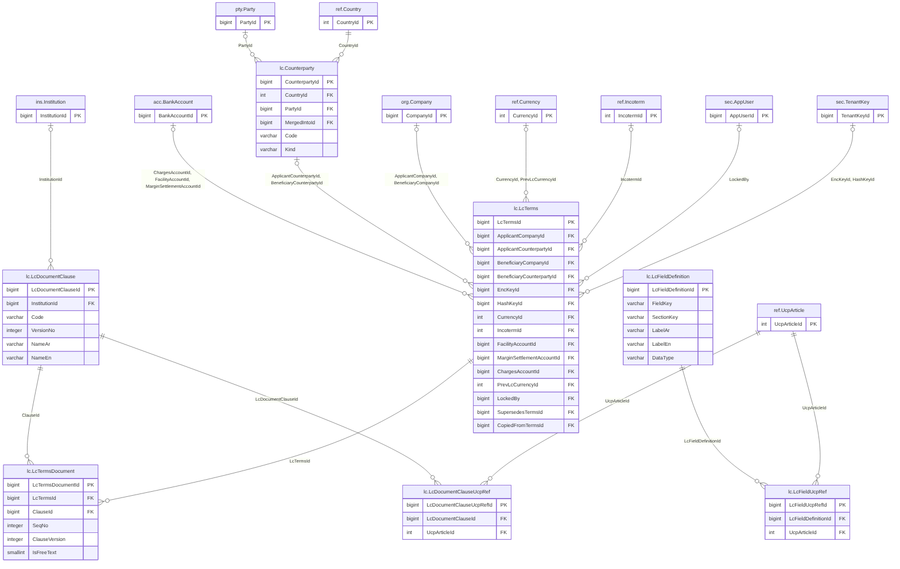

**مواصفات الجداول**

| الجدول | الغرض | PK | FK | UQ | CHECK | أعمدة أخرى |
|---|---|---|---|---|---|---|
| `lc.LcFieldDefinition` | تعريف حقل في شروط الاعتماد: بيانات تُبذر لكل مشترك (FR-LCT-004، BR-LCT-002)؛ مراجع UCP في lc.LcFieldUcpRef | LcFieldDefinitionId | 0 | 0 | 3 | 20 |
| `lc.LcFieldUcpRef` | مرجع UCP لحقل: مادة + فقرة (UcpRefs في المواصفة)؛ يغذّي الشارة وR-LCT-01 وBR-LCT-018 -- وسيط جديد | LcFieldUcpRefId | 2 | 0 | 0 | 4 |
| `lc.Counterparty` | الطرف المقابل: مورّد/عميل خفيف بلا هوية؛ يُرقّى إلى Party عند الحاجة (FR-LCT-036/037، BR-LCT-022، Q-PTY-03) | CounterpartyId | 3 | 0 | 2 | 21 |
| `lc.LcDocumentClause` | مكتبة بنود المستندات بإصدارات: نص قالب بمعاملات (FR-LCT-017..019، BR-LCT-012)؛ مراجع UCP في lc.LcDocumentClauseUcpRef | LcDocumentClauseId | 1 | 0 | 5 | 21 |
| `lc.LcDocumentClauseUcpRef` | مرجع UCP لبند مستند: مادة + فقرة (UcpRefs في المواصفة) -- وسيط جديد | LcDocumentClauseUcpRefId | 2 | 0 | 0 | 4 |
| `lc.LcTerms` | إصدار شروط اعتماد: صف لكل نسخة بأعمدة قاموس §6.2؛ مشترك بين البروفورما والطلب والاعتماد والتعديل (FR-LCT-001..035) | LcTermsId | 15 | 0 | 44 | 86 |
| `lc.LcTermsDocument` | بند مستند مختار في الشروط ومعاملاته؛ النص المصيَّر يُجمَّد عند القفل (FR-LCT-018، BR-LCT-012) -- جديد | LcTermsDocumentId | 2 | 0 | 5 | 12 |

**العلاقات (المفاتيح الأجنبية)**

| الطفل (الجدول.العمود) | الأب | العلاقة | الإلزام | النطاق | الحذف | أعمدة النطاق |
|---|---|---|---|---|---|---|
| `lc.LcFieldUcpRef.LcFieldDefinitionId` | `lc.LcFieldDefinition` | 1 : N | إلزامي | مشترك · مركّب | قيد | — |
| `lc.LcFieldUcpRef.UcpArticleId` | `ref.UcpArticle` | 1 : N | إلزامي | مرجع عام | قيد | — |
| `lc.Counterparty.CountryId` | `ref.Country` | 1 : N | إلزامي | مرجع عام | قيد | — |
| `lc.Counterparty.PartyId` | `pty.Party` | 1 : N | اختياري | مشترك · مركّب | قيد | — |
| `lc.Counterparty.MergedIntoId` | `lc.Counterparty` | 1 : N | اختياري | مشترك · مركّب | قيد | — |
| `lc.LcDocumentClause.InstitutionId` | `ins.Institution` | 1 : N | اختياري | مشترك · مركّب | قيد | — |
| `lc.LcDocumentClauseUcpRef.LcDocumentClauseId` | `lc.LcDocumentClause` | 1 : N | إلزامي | مشترك · مركّب | قيد | — |
| `lc.LcDocumentClauseUcpRef.UcpArticleId` | `ref.UcpArticle` | 1 : N | إلزامي | مرجع عام | قيد | — |
| `lc.LcTerms.ApplicantCompanyId` | `org.Company` | 1 : N | اختياري | مشترك · مركّب | قيد | — |
| `lc.LcTerms.ApplicantCounterpartyId` | `lc.Counterparty` | 1 : N | اختياري | مشترك · مركّب | قيد | — |
| `lc.LcTerms.BeneficiaryCompanyId` | `org.Company` | 1 : N | اختياري | مشترك · مركّب | قيد | — |
| `lc.LcTerms.BeneficiaryCounterpartyId` | `lc.Counterparty` | 1 : N | اختياري | مشترك · مركّب | قيد | — |
| `lc.LcTerms.EncKeyId` | `sec.TenantKey` | 1 : N | اختياري | مشترك · مركّب | قيد | — |
| `lc.LcTerms.HashKeyId` | `sec.TenantKey` | 1 : N | اختياري | مشترك · مركّب | قيد | — |
| `lc.LcTerms.CurrencyId` | `ref.Currency` | 1 : N | اختياري | مرجع عام | قيد | — |
| `lc.LcTerms.IncotermId` | `ref.Incoterm` | 1 : N | اختياري | مرجع عام | قيد | — |
| `lc.LcTerms.FacilityAccountId` | `acc.BankAccount` | 1 : N | اختياري | مشترك · مركّب | قيد | — |
| `lc.LcTerms.MarginSettlementAccountId` | `acc.BankAccount` | 1 : N | اختياري | مشترك · مركّب | قيد | — |
| `lc.LcTerms.ChargesAccountId` | `acc.BankAccount` | 1 : N | اختياري | مشترك · مركّب | قيد | — |
| `lc.LcTerms.PrevLcCurrencyId` | `ref.Currency` | 1 : N | اختياري | مرجع عام | قيد | — |
| `lc.LcTerms.LockedBy` | `sec.AppUser` | 1 : N | اختياري | مشترك · مركّب | قيد | — |
| `lc.LcTerms.SupersedesTermsId` | `lc.LcTerms` | 1 : N | اختياري | مشترك · مركّب | قيد | — |
| `lc.LcTerms.CopiedFromTermsId` | `lc.LcTerms` | 1 : N | اختياري | مشترك · مركّب | قيد | — |
| `lc.LcTermsDocument.LcTermsId` | `lc.LcTerms` | 1 : N | إلزامي | مشترك · مركّب | قيد | — |
| `lc.LcTermsDocument.ClauseId` | `lc.LcDocumentClause` | 1 : N | إلزامي | مشترك · مركّب | قيد | — |

#### م7/م8 · شروط الاعتماد والنماذج (2/2)

*LC terms, fields & form maps* — 3 جدولًا

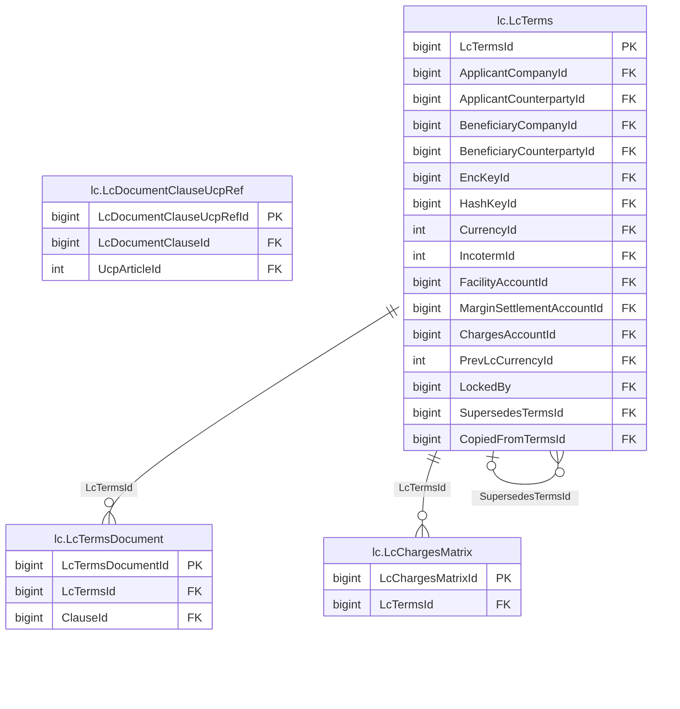

**مواصفات الجداول**

| الجدول | الغرض | PK | FK | UQ | CHECK | أعمدة أخرى |
|---|---|---|---|---|---|---|
| `lc.LcChargesMatrix` | رسوم الشروط: صف لكل فئة (6 صفوف كاملة يتحقق منها التطبيق V-LCT-12) (FR-LCT-020، BR-LCT-014) | LcChargesMatrixId | 1 | 0 | 2 | 8 |
| `lc.LcFormTemplate` | قالب نموذج بنك/منتج/نوع نموذج بإصدار وفترة نفاذ وملحق عقدي (FR-LCT-026، BR-LCT-017، 02 F-14) | LcFormTemplateId | 6 | 0 | 4 | 18 |
| `lc.LcFormFieldMap` | تعيين حقل نظام إلى حقل PDF أو بند في ورقة البوابة (FR-LCT-027، BR-LCT-020) -- جديد | LcFormFieldMapId | 1 | 0 | 4 | 9 |

**العلاقات (المفاتيح الأجنبية)**

| الطفل (الجدول.العمود) | الأب | العلاقة | الإلزام | النطاق | الحذف | أعمدة النطاق |
|---|---|---|---|---|---|---|
| `lc.LcChargesMatrix.LcTermsId` | `lc.LcTerms` | 1 : N | إلزامي | مشترك · مركّب | قيد | — |
| `lc.LcFormTemplate.InstitutionId` | `ins.Institution` | 1 : N | اختياري | مشترك · مركّب | قيد | — |
| `lc.LcFormTemplate.ProductId` | `cat.Product` | 1 : N | اختياري | مشترك · مركّب | قيد | — |
| `lc.LcFormTemplate.CompanyId` | `org.Company` | 1 : N | اختياري | مشترك · مركّب | قيد | — |
| `lc.LcFormTemplate.SourceDocumentId` | `doc.Document` | 1 : N | اختياري | مشترك · مركّب | قيد | — |
| `lc.LcFormTemplate.AnnexDocumentId` | `doc.Document` | 1 : N | اختياري | مشترك · مركّب | قيد | — |
| `lc.LcFormTemplate.LetterheadDocumentId` | `doc.Document` | 1 : N | اختياري | مشترك · مركّب | قيد | — |
| `lc.LcFormFieldMap.TemplateId` | `lc.LcFormTemplate` | 1 : N | إلزامي | مشترك · مركّب | قيد | — |

#### م7/م8 · الاعتمادات والبروفورما (1/2)

*Letters of credit & proforma* — 7 جدولًا

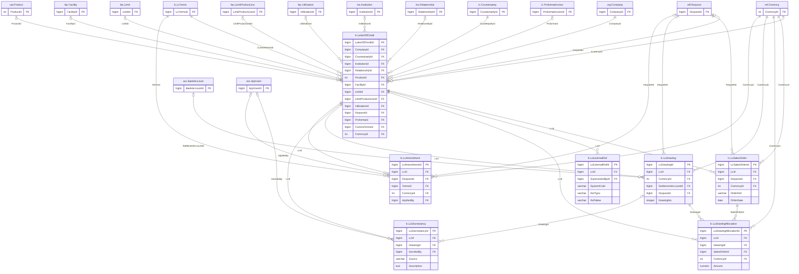

**مواصفات الجداول**

| الجدول | الغرض | PK | FK | UQ | CHECK | أعمدة أخرى |
|---|---|---|---|---|---|---|
| `lc.LetterOfCredit` | سجل الاعتماد للجانبين: مشتريات (نحن الطالب) ومبيعات (نحن المستفيد) (FR-LCI-011..016، FR-LCE-009، BR-LCI-004/008/016، BR-LCE-007/009) | LetterOfCreditId | 13 | 0 | 23 | 35 |
| `lc.LcExternalRef` | مرجع خارجي للاعتماد (ERP...)؛ بلا تفرّد؛ البحث بالمطبَّع (FR-LCI-013، BR-REQ-006) -- جديد | LcExternalRefId | 2 | 0 | 1 | 8 |
| `lc.LcAmendment` | تعديل اعتماد صادر أو مستلَم (FR-LCI-018/019، FR-LCE-020، BR-LCI-011/012، BR-LCE-014)؛ الحالات §8 | LcAmendmentId | 5 | 0 | 11 | 18 |
| `lc.LcDrawing` | سحب/تقديم مستندات تحت اعتماد؛ في التصدير يشمل تحويل التخصيص (FR-LCI-023، BR-LCI-013، BR-LCE-011)؛ الحالات §8 | LcDrawingId | 4 | 0 | 7 | 16 |
| `lc.LcSalesOrder` | تخصيص أمر بيع على اعتماد مستلَم؛ لا يقابله حد ائتماني (FR-LCE-013..015، BR-LCE-009..013)؛ الحالات §8 | LcSalesOrderId | 3 | 0 | 8 | 12 |
| `lc.LcDrawingAllocation` | توزيع سحب تصدير على أوامر بيع (FR-LCE-016/017، BR-LCE-011/013) -- جديد؛ Σ التوزيع ≤ مبلغ السحب وكل جزء ≤ متبقي أمره يتحقق منهما التطبيق | LcDrawingAllocationId | 4 | 0 | 1 | 4 |
| `lc.LcDiscrepancy` | مخالفة على مستندات سحب أو اعتماد؛ القرار يتطلب lc.discrepancy.decide (FR-LCI-024، FR-LCE-021، §8) -- جديد | LcDiscrepancyId | 3 | 0 | 2 | 8 |

**العلاقات (المفاتيح الأجنبية)**

| الطفل (الجدول.العمود) | الأب | العلاقة | الإلزام | النطاق | الحذف | أعمدة النطاق |
|---|---|---|---|---|---|---|
| `lc.LetterOfCredit.CompanyId` | `org.Company` | 1 : N | إلزامي | مشترك · مركّب | قيد | — |
| `lc.LetterOfCredit.CounterpartyId` | `lc.Counterparty` | 1 : N | إلزامي | مشترك · مركّب | قيد | — |
| `lc.LetterOfCredit.InstitutionId` | `ins.Institution` | 1 : N | اختياري | مشترك · مركّب | قيد | — |
| `lc.LetterOfCredit.RelationshipId` | `ins.Relationship` | 1 : N | اختياري | مشترك · مركّب | قيد | CompanyId, InstitutionId |
| `lc.LetterOfCredit.ProductId` | `cat.Product` | 1 : N | اختياري | مشترك · مركّب | قيد | — |
| `lc.LetterOfCredit.FacilityId` | `fac.Facility` | 1 : N | اختياري | مشترك · مركّب | قيد | — |
| `lc.LetterOfCredit.LimitId` | `fac.Limit` | 1 : N | اختياري | مشترك · مركّب | قيد | FacilityId |
| `lc.LetterOfCredit.LimitProductLineId` | `fac.LimitProductLine` | 1 : N | اختياري | مشترك · مركّب | قيد | FacilityId, LimitId |
| `lc.LetterOfCredit.UtilizationId` | `fac.Utilization` | 1 : N | اختياري | مشترك · مركّب | قيد | FacilityId |
| `lc.LetterOfCredit.RequestId` | `wfl.Request` | 1 : N | اختياري | مشترك · مركّب | قيد | CompanyId |
| `lc.LetterOfCredit.ProformaId` | `lc.ProformaInvoice` | 1 : N | اختياري | مشترك · مركّب | قيد | CompanyId |
| `lc.LetterOfCredit.CurrentTermsId` | `lc.LcTerms` | 1 : N | إلزامي | مشترك · مركّب | قيد | — |
| `lc.LetterOfCredit.CurrencyId` | `ref.Currency` | 1 : N | إلزامي | مرجع عام | قيد | — |
| `lc.LcExternalRef.LcId` | `lc.LetterOfCredit` | 1 : N | إلزامي | مشترك · مركّب | قيد | — |
| `lc.LcExternalRef.SupersededById` | `lc.LcExternalRef` | 1 : N | اختياري | مشترك · مركّب | قيد | LcId |
| `lc.LcAmendment.LcId` | `lc.LetterOfCredit` | 1 : N | إلزامي | مشترك · مركّب | قيد | CurrencyId |
| `lc.LcAmendment.RequestId` | `wfl.Request` | 1 : N | اختياري | مشترك · مركّب | قيد | — |
| `lc.LcAmendment.TermsId` | `lc.LcTerms` | 1 : N | إلزامي | مشترك · مركّب | قيد | — |
| `lc.LcAmendment.CurrencyId` | `ref.Currency` | 1 : N | إلزامي | مرجع عام | قيد | — |
| `lc.LcAmendment.AppliedBy` | `sec.AppUser` | 1 : N | اختياري | مشترك · مركّب | قيد | — |
| `lc.LcDrawing.LcId` | `lc.LetterOfCredit` | 1 : N | إلزامي | مشترك · مركّب | قيد | CurrencyId |
| `lc.LcDrawing.CurrencyId` | `ref.Currency` | 1 : N | إلزامي | مرجع عام | قيد | — |
| `lc.LcDrawing.SettlementAccountId` | `acc.BankAccount` | 1 : N | اختياري | مشترك · مركّب | قيد | — |
| `lc.LcDrawing.RequestId` | `wfl.Request` | 1 : N | اختياري | مشترك · مركّب | قيد | — |
| `lc.LcSalesOrder.LcId` | `lc.LetterOfCredit` | 1 : N | إلزامي | مشترك · مركّب | قيد | CurrencyId |
| `lc.LcSalesOrder.RequestId` | `wfl.Request` | 1 : N | إلزامي | مشترك · مركّب | قيد | — |
| `lc.LcSalesOrder.CurrencyId` | `ref.Currency` | 1 : N | إلزامي | مرجع عام | قيد | — |
| `lc.LcDrawingAllocation.LcId` | `lc.LetterOfCredit` | 1 : N | إلزامي | مشترك · مركّب | قيد | CurrencyId |
| `lc.LcDrawingAllocation.DrawingId` | `lc.LcDrawing` | 1 : N | إلزامي | مشترك · مركّب | قيد | LcId, CurrencyId |
| `lc.LcDrawingAllocation.SalesOrderId` | `lc.LcSalesOrder` | 1 : N | إلزامي | مشترك · مركّب | قيد | LcId, CurrencyId |
| `lc.LcDrawingAllocation.CurrencyId` | `ref.Currency` | 1 : N | إلزامي | مرجع عام | قيد | — |
| `lc.LcDiscrepancy.LcId` | `lc.LetterOfCredit` | 1 : N | إلزامي | مشترك · مركّب | قيد | — |
| `lc.LcDiscrepancy.DrawingId` | `lc.LcDrawing` | 1 : N | اختياري | مشترك · مركّب | قيد | LcId |
| `lc.LcDiscrepancy.DecidedBy` | `sec.AppUser` | 1 : N | اختياري | مشترك · مركّب | قيد | — |

#### م7/م8 · الاعتمادات والبروفورما (2/2)

*Letters of credit & proforma* — 4 جدولًا

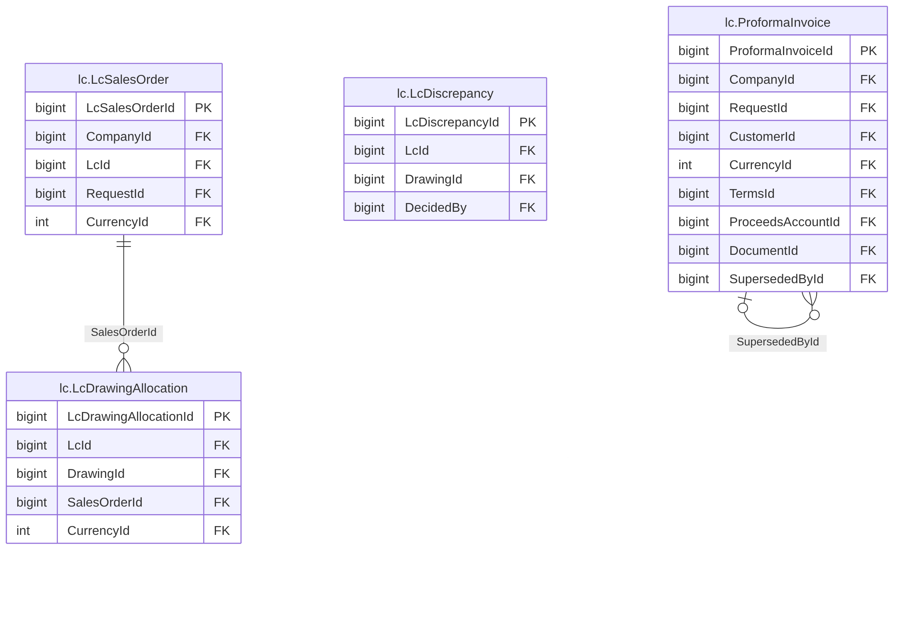

**مواصفات الجداول**

| الجدول | الغرض | PK | FK | UQ | CHECK | أعمدة أخرى |
|---|---|---|---|---|---|---|
| `lc.ProformaInvoice` | البروفورما الصادرة: لا تعديل بعد الإصدار؛ الرقم {seq:000}-{erp}-{yy} (FR-LCE-005..008، BR-LCE-001..006) | ProformaInvoiceId | 8 | 0 | 11 | 25 |
| `lc.ProformaLine` | بند في البروفورما (FR-LCE-003، BR-LCE-001)؛ يُثبَّت بعد الإصدار | ProformaLineId | 2 | 0 | 3 | 10 |
| `lc.LcTermsComparison` | نتيجة مقارنة شروط الاعتماد المستلَم بالبروفورما (FR-LCT-031، FR-LCE-023، BR-LCT-021) -- جديد (Could) | LcTermsComparisonId | 3 | 0 | 1 | 6 |
| `lc.LcTermsComparisonLine` | فرق حقل واحد وحكمه وقرار الخزينة (FR-LCT-031، BR-LCT-021) -- جديد (Could) | LcTermsComparisonLineId | 1 | 0 | 1 | 9 |

**العلاقات (المفاتيح الأجنبية)**

| الطفل (الجدول.العمود) | الأب | العلاقة | الإلزام | النطاق | الحذف | أعمدة النطاق |
|---|---|---|---|---|---|---|
| `lc.ProformaInvoice.CompanyId` | `org.Company` | 1 : N | إلزامي | مشترك · مركّب | قيد | — |
| `lc.ProformaInvoice.RequestId` | `wfl.Request` | 1 : N | إلزامي | مشترك · مركّب | قيد | CompanyId |
| `lc.ProformaInvoice.CustomerId` | `lc.Counterparty` | 1 : N | إلزامي | مشترك · مركّب | قيد | — |
| `lc.ProformaInvoice.CurrencyId` | `ref.Currency` | 1 : N | إلزامي | مرجع عام | قيد | — |
| `lc.ProformaInvoice.TermsId` | `lc.LcTerms` | 1 : N | إلزامي | مشترك · مركّب | قيد | — |
| `lc.ProformaInvoice.ProceedsAccountId` | `acc.BankAccount` | 1 : N | إلزامي | مشترك · مركّب | قيد | CompanyId |
| `lc.ProformaInvoice.DocumentId` | `doc.Document` | 1 : N | إلزامي | مشترك · مركّب | قيد | — |
| `lc.ProformaInvoice.SupersededById` | `lc.ProformaInvoice` | 1 : N | اختياري | مشترك · مركّب | قيد | CompanyId |
| `lc.ProformaLine.ProformaId` | `lc.ProformaInvoice` | 1 : N | إلزامي | مشترك · مركّب | قيد | CurrencyId |
| `lc.ProformaLine.CurrencyId` | `ref.Currency` | 1 : N | إلزامي | مرجع عام | قيد | — |
| `lc.LcTermsComparison.BaselineTermsId` | `lc.LcTerms` | 1 : N | إلزامي | مشترك · مركّب | قيد | — |
| `lc.LcTermsComparison.ReceivedTermsId` | `lc.LcTerms` | 1 : N | إلزامي | مشترك · مركّب | قيد | — |
| `lc.LcTermsComparison.RunBy` | `sec.AppUser` | 1 : N | اختياري | مشترك · مركّب | قيد | — |
| `lc.LcTermsComparisonLine.ComparisonId` | `lc.LcTermsComparison` | 1 : N | إلزامي | مشترك · مركّب | قيد | — |


## 11. أنماط التصميم للمجالات الرئيسية

| المجال | النمط |
|---|---|
| **الأشخاص والجهات** | `pty.Party` موحّد (فرد/منشأة) يُعاد استخدامه: شريك، مدير، مفوّض، كفيل، جهة اتصال، مستفيد؛ الهويات والعناوين ووسائل الاتصال جداول تابعة؛ اكتمال KYC لكل بنك عبر `KycProfile/Item` (بنود بحد مالك `OwnerThresholdPct` وعمر أقصى `MaxAgeDays`) |
| **الهيكل المؤسسي** | `org.Company` (شكل قانوني منفصل عن علم «قابضة»)، `Shareholding` (ملكية متعددة الطبقات)، `GoverningBody`/`BodyMember`/`AuthorityGrant` (حوكمة وصلاحيات بسقف وتوقيع مشترك وفترة)، وجداول KYC للشركة |
| **الجهات المالية والحسابات** | `ins.Institution` ← `InstitutionUnit` ← `Contact` (طبقتان)، `Relationship` (شركة–بنك) تحمل مديري العلاقة والمنتجات؛ `acc.BankAccount` بأرقام مشفّرة؛ المفوّضون `Signatory` بحدود السلطة `SignatoryAuthority` وتعارض السلطات `AuthorityConflict` |
| **التسهيلات** | `fac.Facility` (حزمة اتفاقية) + `FacilityRevision`؛ `Limit` شجرة بأوضاع توزيع؛ `LimitProductLine` خطوط منتج؛ `ProductLineTerm` شروط؛ `FacilityLender` للتجمعات؛ `Utilization`/`LimitReservation`/`LimitMovement`؛ `OutstandingSnapshot`؛ `ValueConflict` |
| **التسعير** | `prc.TariffSchedule/Item/Tier` جداول رسوم؛ `PricingRule/Tier` قواعد تسعير؛ `cat.BaseRate/Alias/Value` أسعار مرجعية بقيم مؤرخة |
| **الضمانات** | `col.Collateral` + `CollateralLink` (ربط بحد/تسهيل بتغطية) + تخصصات: `Guarantee`, `PromissoryNote`+`Signer`, `InsurancePolicyAssignment`, `ValuationSchedule` |
| **الالتزامات** | `obl.Obligation` + `ReportingObligation/Instance` (تقويم تقارير) + `Covenant/CovenantTest/CovenantAccount` + `ObligationBreach`؛ `CheckMode` اختياري يرث افتراضي المشترك |
| **البيانات المالية** | `fin.FinancialStatement/StatementLine` ببنود كتالوج، `AccountMonthlyStat` متوسطات الأرصدة، `BankFlowEntry` المبالغ المحوَّلة (يدخلها قسم الخزينة)، `MeasureFormula` |
| **الشروط القابلة للمقارنة** | `cmp.TermType/TermValue` — مكتبة شروط للمقارنة بين البنوك بترتيب: التسعير ثم المدد ثم الضمانات |
| **محرك الطلبات** | `wfl.RequestType` ← `WorkflowTemplate` ← `WorkflowStage/StageApprover/Transition/Hook`؛ الطلب `Request` + نسخ المراحل + الموافقات + الإجراءات + المرفقات؛ `UserDelegation`؛ أدوار المنشئ والمدقق والمعتمد بالصلاحيات، والفصل بينها `wf.sod.allow_same_person` |
| **إقفال دورة العمل** (C-7) | انظر §11.1 |
| **الإشعارات** | `NotificationEventType` + `Rule` + `Template` + `Preference` (فوري/ملخص يومي/أسبوعي/إيقاف) + `Notification` + `Delivery` + `DigestBatch` |
| **الاعتمادات** | `lc.LcTerms` + `LcFieldDefinition` وربط كل حقل بمواد UCP (`LcFieldUcpRef`) + `LetterOfCredit` (شراء/مبيعات) + تعديل/سحب/مخالفات + `LcSalesOrder` + `LcChargesMatrix` + `LcFormTemplate/FieldMap` لنماذج البنوك + `LcTermsComparison` |
| **الوظائف الخلفية** | `cfg.OutboxEvent` (بريد صادر لأحداث متسقة مع المعاملة)، `JobRun`، `ExpiryAlertRule/Log`، `DataExportJob`، `SeedRun`؛ تعمل بحساب الخدمة `IsSystemUser` لكل مشترك (§3.2) |

### 11.1 إقفال دورة العمل بيد إدارة الخزينة (C-7)
**القاعدة (BR-WFL-027):** انتهاء المراحل بنجاح **لا يُكمل الطلب**. الطلب ينتقل إلى `AWAITING_CLOSE` ويُسجَّل `ReadyToCloseAt`، ثم لا يصير `COMPLETED` إلا **بإقفال من إدارة الخزينة** (صلاحية `req.treasury.close`)، فيُسجَّل `ClosedByUserId` و`ClosedAt`.

| البند | التصميم في القاعدة | الفرض |
|---|---|---|
| الحالة | `Status` ∈ {`DRAFT`, `ACTIVE`, `AWAITING_CLOSE`, `COMPLETED`, `REJECTED`, `CANCELLED`} | قيد `CHECK` على القيم |
| دخول `AWAITING_CLOSE` | يلزم `ReadyToCloseAt` و`CurrentStageInstanceId` | قيد `CHECK` |
| `COMPLETED` | يلزم `ClosedByUserId` و`ClosedAt` و`ClosedAt = CompletedAt`، ولا يُكتب `ClosedByUserId` في غير `COMPLETED` | قيدان `CHECK` |
| من يقفل | مستخدم يحمل `req.treasury.close`، ولا يقفل منشئ الطلب أو مُعتمِده إلا باستثناء فصل المهام المسجَّل (`wf.sod.allow_same_person`) | **التطبيق** (القاعدة لا تملك الأدوار) |
| الحالات النهائية الأخرى | `REJECTED` و`CANCELLED` تبقيان فوريتين كما في المواصفة | — (افتراض يُؤكَّد، O-10) |
| أثر الإقفال | يُكتب `RequestAction` بـ`CLOSED`، ويُرسَل `REQ.COMPLETED` للطالب **عند الإقفال لا عند انتهاء المراحل** | التطبيق |
| الواجهة للطالب | `AWAITING_CLOSE` يظهر كـ«قيد التنفيذ» (`IN_PROGRESS`) | التطبيق |

**أثر على الموجود:** تعديل قاعدة الانتقال إلى `COMPLETED` (مرحلة `COMPLETE ← ISSUANCE` في `13` و`14`) يصير إلى `AWAITING_CLOSE`. **المواصفة 13 لم تُعدَّل بعد** (O-10)، لذا هذا التغيير معلَّق لحين اعتماده رسميًا.


---

## 12. النشر وإدارة التغيير

### 12.1 ترتيب النشر (`db/deploy.sql`، وضع SQLCMD)
```
sqlcmd -S <server> -E -I -f 65001 -i db\deploy.sql -v DbName=BankFas
```
1. إنشاء القاعدة بـ `Arabic_100_CI_AS_SC` إن لم تكن موجودة
2. `000_schemas` → `001_tables` → `002_foreign_keys` → `003_indexes` (مولَّدة)
3. `004_rls_tables` (جدول مؤقت بالجداول الخاضعة لـ RLS، في **الجلسة نفسها** حتى 010)
4. `020_roles_and_grants` (أدوار و`tp_auth` وقراءة `tp_readonly`)
5. `005_delete_grants` → `006_sensitive_columns` → `007_table_grants` (المنح الجدولية)
6. `025_tenant_views` (عرض صف المشترك)
7. `010_rls` (الدوال والسياسات)
8. `030_session_context` (الإجراء بـ`EXECUTE AS tp_auth`)
9. اختياري: `040_fulltext_optional`

**بعد النشر:** يُشغَّل `tools/dbgen/check_grants.py` على الملفات المنشورة (لا على القاعدة)، ثم اختبارات S0 على SQL Server الفعلي (§14). الملفات تحوي `GO` وتُنفَّذ بالترتيب نفسه عند كل نشر؛ **لا يوجد بعدُ مسار ترحيل بين الإصدارات** (O-2).

### 12.2 تغيير النموذج
عدِّل `db/model/*.model` ← `python3 tools/dbgen/dbgen.py check db/model/*.model` ← `build … --out db/generated --docs docs/` ← `tools/dbgen/pg_validate.sh db/generated/pg/000_all.sql` ← `python3 tools/dbgen/check_grants.py`. لا تُعدَّل الملفات المولَّدة يدويًا. صيغة النموذج في `tools/dbgen/README.md`.

### 12.3 النسخ الاحتياطي والاستعادة (توصيات للتشغيل 🟡)
- نسخ كامل ليلي + تفاضلي + سجل المعاملات كل 15 دقيقة (نموذج الاسترداد `FULL`)، ونسخ إلى موقع منفصل.
- **المفاتيح الرئيسية (خارج القاعدة) في نسخ احتياطي منفصل**؛ فقدانها يعني فقدان البيانات المشفّرة.
- اختبار استعادة دوري، مع فك تشفير عيّنة بعد كل استعادة.
- استرجاع مشترك واحد يتم بتصدير/استيراد صفوفه بترتيب التبعيات من استعادة بنسخة مؤقتة.
- `READ_COMMITTED_SNAPSHOT ON` (توصية تشغيل؛ لم يُضمَّن في السكربتات).
- **أرقام RPO/RTO** لم تُحدَّد بعد (O-14).

### 12.4 الأداء والحمل
الحمل المتوقع منخفض؛ التصميم لا يعتمد على Partitioning. إن نمت `aud.AuditLog` و`wfl.RequestAction` و`ntf.NotificationDelivery` فهي أول مرشحة للتقسيم/الأرشفة بالتاريخ.

---

## 13. البذور وتهيئة المشترك (خطة — لم تُنفَّذ بعد)

| المرحلة | المحتوى | الآلية |
|---|---|---|
| **عالمي** | `ref.Country/Currency/Incoterm/UcpArticle`، `plat.Plan/PlanModule`، `sec.Permission` (بما فيها `req.treasury.close`)، `cfg.SettingDefinition`، أنواع الأحداث `ntf.NotificationEventType`، تعريفات حقول الاعتماد | سكربت بذور عالمي عند النشر بمفتاح `SeedKey`؛ `cfg.SeedRun` يسجل التنفيذ. هذه الجداول **يكتبها `tp_platform` فقط** |
| **إجراء تهيئة المشترك** (إجراء منصة واحد) | ينشئ داخل معاملة واحدة: صف المشترك، **حساب الخدمة `IsSystemUser`**، **مستخدم المدير الأول**، والكتالوجات الافتراضية، والأدوار القياسية وربطها بالصلاحيات، وقوالب دورات العمل، وملفات KYC المسبقة، وقواعد الإشعارات | إجراء في `plat` ينفّذه `tp_platform` بموافقة مشغّل؛ لأن المشترك لم يُنشأ بعد لا يمكن تعيين سياقه بالطريقة المعتادة (O-12) |
| **مفتاح مفقود** | قائمة `AUTHORISATION_BASIS` في `cat.LookupList` لأسس التفويض (طلبها مؤلفو النماذج) | تُضاف لبذور المشترك |

⚠ UCP: أرقام المواد في `lc.LcFieldUcpRef` **مراجع هندسية غير موثَّقة قانونيًا** إلى أن يتحقق منها مختص (عمود `VerifiedBy/On` في `ref.UcpArticle`).

---

## 14. أدلة التحقق وحدودها (بصراحة)

| الفحص | النتيجة | ملاحظة |
|---|---|---|
| فحص النموذج (`dbgen check`) | **OK** — 194 جدولًا / 3,261 عمودًا؛ لا مراجع معلّقة؛ لا مخالفة لقواعد النطاق | التسمية والمراجع والمفاتيح المركّبة والأعمدة المطلوبة |
| تنفيذ PostgreSQL 16 | **OK** — 194 جدولًا / 750 مفتاحًا أجنبيًا / 691 قيد فريد أو أساسي | يثبت **البنية المنطقية** فقط. **لا** يثبت صحة T-SQL |
| التحقق الثابت من الصلاحيات (`check_grants.py`) | **OK** — 194 جدولًا، 206 منحة في `007`، و36 منحة حذف و7 `DENY` في `005`، 28 عمودًا مقيّدًا، القواعد R1–R10 | حُقنت ثلاث مخالفات متعمدة فاكتُشفت كلها (§9.3). **لا يثبت** أن المحرك ينفّذ المنح كما هي |
| تحليل T-SQL بـ `sqlglot` | الملفات `000–004`، `007`، `010`، `025`، `030`، `040`: **بلا أخطاء**؛ `005` و`006` و`020`: خطأ واحد لكل ملف عند عبارة `DENY` | المحلّل لا يدعم عبارة `DENY` بصيغتها الكاملة؛ الصيغة صحيحة في T-SQL. التحليل نحوي جزئي |
| فحوص آلية لمحاذير SQL Server | لا `OR` في الفهارس المصفّاة · مفاتيح الفهارس ≤ 1,700 بايت و≤ 16 عمودًا · لا مسارات `CASCADE` متعددة · خيارات `SET` ضُمّنت | فحوص نصّية على المخرجات |
| **التنفيذ على SQL Server 2025** | **لم يحدث** | لا يتوفر المحرك في بيئة العمل. **أول خطوة قبل أي اعتماد.** متوقع: أخطاء صيغة في `CREATE SECURITY POLICY` و`EXECUTE AS` وترتيب النشر |
| **اختبارات السلوك** (RLS، ربط الهوية، الصلاحيات، التدفق المالي) | **لم تُكتب** | مطلوبة في S0–S2: مشتركان ومستخدمان ومحاولات عبور، وربط مستخدم مشترك A بسياق مشترك B يجب أن يُرفض، ومحاولة `tp_app` الكتابة على `ref.Currency` يجب أن تُرفض |

---

## 15. القرارات المتخذة (تُعتمد ما لم تعترض)

| # | الموضوع | القرار |
|---|---|---|
| DB-1 | `ErpCompanyCode` | فريد بين الشركات غير المؤرشفة (أشدّ من تحذير BR-ORG-001 وتحققه القاعدة) |
| DB-2 | `pty.KycProfile.InstitutionId` | اختياري؛ علم «أساسي» للملفات غير المرتبطة ببنك |
| DB-3 | قوالب دورات العمل | عائلة قوالب لكل نوع طلب؛ البذور المشتركة تُكرَّر لكل نوع |
| DB-4 | رأس التسهيل | صف واحد + `FacilityRevision.HeaderChanges`؛ لا نسخ رأس لكل مراجعة |
| DB-5 | `fac.Limit` عقد النسخ | نسخ الشجرة الفرعية عند المراجعة عقدٌ في التطبيق (`[R]`) |
| DB-6 | `ref.UcpArticle` | نطاق مختلط؛ `VerifiedBy → plat.PlatformOperator` |
| DB-7 | `ref.Incoterm` | عالمي (Incoterms 2020) |
| DB-8 | `fac.ValueConflict` | المرشّحون مسطَّحون (أعمدة) لا جدول فرعي |
| DB-9 | `fac.LimitMovement` | مفاتيح أجنبية مكتوبة (حجز/استخدام/…) لا مرجع عام متعدد الأشكال |
| DB-10 | الملخص الأسبوعي | أُضيفت `DIGEST_WEEKLY` إلى `ntf.NotificationPreference.Mode` |
| DB-11 | `wfl.RequestAction.ActionType` | أُضيفت: `RESERVATION_LOST`, `DRAFT_ARCHIVED`, `DRAFT_RESTORED`, `CHANNEL_CHANGED`, `SOD_EXCEPTION_USED`, `DELEGATION_CREATED`, `DELEGATION_REVOKED`، وفي 0.2: `READY_TO_CLOSE`, `CLOSED` |
| DB-12 | جهات اتصال المدير العام/المالي | عبر `org.BodyMember` + `pty.ContactMethod` (لا جدول مستقل) |
| DB-13 | الإضافة فقط | تُفرض بالمنح (`SELECT, INSERT`) و`DENY UPDATE` لـ`tp_app` و`tp_platform` على جداول `append` خارج `aud` |
| DB-14 | **المنح الجدولية** (C-2) | صريحة لكل جدول ومولَّدة؛ لا منح على مستوى المخطط؛ `REFERENCES` محذوف |
| DB-15 | **الجداول العالمية** (C-2) | للقراءة فقط لتطبيق المشترك؛ يكتبها `tp_platform` فقط |
| DB-16 | **الجداول المحجوبة** `noapp` (C-3) | `plat.Tenant` و`PlatformOperator` و`ReservedSubdomain`؛ يقرأ التطبيق صف مشتركه عبر `plat.v_CurrentTenant` |
| DB-17 | **ربط الهوية بالمشترك** (C-1) | `usp_SetSessionContext` يتحقق من المستخدم النشط المنتمي للمشترك، ويعمل بصفة `tp_auth` |
| DB-18 | **حساب الخدمة** (C-8) | `sec.AppUser.IsSystemUser` لكل مشترك للمهام، بلا كلمة مرور ولا MFA |
| DB-19 | **مفاتيح الصفوف المشفّرة** (C-5) | `EncKeyId` / `HashKeyId` / `MfaKeyId` / `MfaKeyRef` في كل جدول فيه غلاف؛ `CHECK` لطول الغلاف |
| DB-20 | **إقفال دورة العمل** (C-7) | `AWAITING_CLOSE` ثم `COMPLETED` بإقفال الخزينة؛ الحقول `ReadyToCloseAt` و`ClosedByUserId` و`ClosedAt` |

---

## 16. حدود معروفة ونقاط مفتوحة

| # | البند | الأثر | المقترح |
|---|---|---|---|
| O-1 | **لم تُنفَّذ السكربتات على SQL Server** (§14) | قد تظهر أخطاء صيغة وتتغير المنح عند التنفيذ | أول مهمة: نشر على SQL Server 2025 نظيف + حزمة اختبار السلوك |
| O-2 | لا سكربتات ترحيل بين الإصدارات | تغيير النموذج يعيد توليد DDL كاملًا | أداة ترحيل (DbUp أو Flyway) عند أول نشر فعلي على بيانات حقيقية |
| O-3 | البذور غير مكتوبة (§13) | القاعدة فارغة بعد النشر | كتابتها مع شريحة S0 |
| O-4 | أسئلة مفتوحة بقيم افتراضية في `90-consolidated-open-questions.md` | أثرها على الشرائح اللاحقة؛ المتعلق منها بـ S3: Q-WFL-02, Q-WFL-09, Q-WFL-11, Q-LCT-01/02, Q-LCI-01/02 | تُراجع عند بدء S3 |
| O-5 | الأعمدة المحسوبة محدودة (3) | بقية المشتقات (المتاح، الرصيد) تُحسب في التطبيق/العروض | عروض/دوال لاحقًا عند الحاجة لتقارير |
| O-6 | سياسات الاحتفاظ والأرشفة (جداول التدقيق والإشعارات) غير محدَّدة | نمو الجداول الكبيرة | قرار احتفاظ لكل جدول مع بدء التشغيل |
| O-7 | نموذج استرداد القاعدة والنسخ المتعدد المشتركين | استعادة مشترك واحد معقّدة (§12.3) | نقل صفوف مشترك كبير إلى قاعدة مستقلة لاحقًا ممكن لأن البنية تحمل `TenantId` |
| O-8 | نوع JSON الأصلي في SQL Server 2025 | غير مستعمل (T-4) | تقييمه عند الحاجة إلى استعلام داخل JSON |
| **O-9** | **مسار ما قبل المصادقة** (تسجيل الدخول والدعوة واستعادة كلمة المرور): لا يوجد مستخدم بعد لضبط السياق | لا يستطيع التطبيق تسجيل الدخول بالمسار الحالي | إجراء `sec.usp_SetAuthContext(@TenantId)` يضبط المشترك فقط بعد فحص حالته، ويقتصر على قراءة صفوف الدخول؛ يُنظر فيه في S1 مع حدّ قراءة يضيّقه (عرض بأعمدة محددة) |
| **O-10** | **تعديل المواصفة 13** لإقفال دورة العمل (C-7) | الوثيقة تتبع قرار الإقفال، والمواصفة ما زالت تقول إن الإكمال تلقائي عند المرحلة الأخيرة | تحديث `13` (حقل `Status`، جدول الحالات، `ExternalPhase`، `FR-WFL`) بعد موافقتك؛ **أكّد أيضًا أن الرفض والإلغاء يبقيان فوريين** |
| **O-11** | **الهوية تُصدَّق من التطبيق** (§3.2) | مخترق `tp_app` يستطيع اختيار مستخدم نشط من أي مشترك | دور تطبيق لكل مشترك (`sp_setapprole`) أو رمز موقَّع يتحقق منه الإجراء؛ يُختار في S1 |
| **O-12** | **إجراءات المنصة على بيانات المشترك** | بلا وصول مباشر لـ`tp_platform`، يلزم إجراء مُراجَع لكل عملية منصة (تهيئة، دعم، إصلاح) | تُكتب في S0 وتتحقق من `SupportAccessGrant` أو من تهيئة المشترك |
| **O-13** | **موقع مرساة سلسلة التدقيق** (§5.3) | بلا مرساة خارجية، السلسلة لا تكشف العبث | تخزين غير قابل للتعديل أو تجزئة منشورة دوريًا؛ قرار تشغيلي |
| **O-14** | أرقام RPO/RTO | لا خطة استعادة مُقاسة بعد | تُحدَّد مع الاعتماد التشغيلي (§12.3) |

---

## 17. الخطوة التالية

1. **تقييمك** لهذا الإصدار، خاصة القرارات DB-14 إلى DB-20 والنقاط O-9 إلى O-13، والأسئلة التي تحتاج قرارك: **هل تعتمد تعديل المواصفة 13 (O-10)؟**
2. نشر على **SQL Server 2025** فعلي وتصحيح ما يظهر (O-1)، مع اختبارات السلوك المذكورة في §14.
3. ثم الواجهات والشريحة الرأسية S0، بعد حسم O-9 و O-11 و O-12.

## 18. مراجعة التصميم (Design review)

أجرى فريق من خمسة مهندسي قواعد بيانات مراجعة مستقلة لكل مجموعة وحدات، فحصت كل جدول وكل علاقة مفتاح أجنبي على أسس النمذجة العلائقية: التطبيع، والمفاتيح، والإلزام والعدد، وسلامة المرجع، والعزل بين المشتركين، والتكرار، والفهرسة، والحساسية، ودلالات دورة العمل. النتائج مسجَّلة بمعرّفاتها في `docs/review/design-review-2026-10-11.json`، وتحمل كل نتيجة مرجع السطر في النموذج أو في DDL.

**الإجمالي: 50 نتيجة — حرجة 10 · رئيسية 36 · طفيفة 4.** لم يُعدَّل النموذج بعد؛ القرار المطلوب في §18.3.

### 18.1 النتائج الحرجة

| المعرّف | الكيان | الدلالة | المشكلة (ملخص) | الإصلاح المقترح (ملخص) |
|---|---|---|---|---|
| DR-01 | `plat.TenantModule.IsEnabled` | tenancy | Entitlement rows are tenant-owned (no global flag; | Make TenantModule platform-owned: declare it global with an explicit TenantId FK to plat.Tenant (global noapp is a legal target), expose it to tp_app only through a view filtered on SESSION_CONTEXT('TenantId') with SELECT only, a… |
| DR-02 | `sec.AppUser.MfaKeyId` | referential | MfaKeyId (model line 126, comment 'DATA key that encrypted the MFA secret') and doc.DocumentVersion.KeyId (line 378, 'file encryption key') reference sec.TenantKey through a composite FK on (TenantId, TenantKeyId) only (db/genera… | Add UNIQUE (TenantId, TenantKeyId, Purpose) on sec.TenantKey. |
| DR-03 | `cat.LookupItem.LookupItemId (targeted by 13 in-scope FKs)` | tenancy | cat.LookupItem is 'mixed' (12-institutions-accounts-catalogs.model:255; | Make referenced items tenant-owned: materialise the seeded global items per tenant so every LookupItem row has TenantId NOT NULL, and emit composite FKs (TenantId, X) -> (TenantId, LookupItemId). |
| DR-04 | `pty.Address.OwnerType, OwnerId` | tenancy | OwnerType+OwnerId is a polymorphic owner (PARTY/INSTITUTION/UNIT/CONTACT; | Replace the OwnerType/OwnerId pair with exclusive-arc columns (PartyId, InstitutionId, UnitId, ContactId), each a composite FK (TenantId, X) -> (TenantId, X), with a CHECK that exactly one is non-null; |
| DR-05 | `cat.LookupItem (mixed) and cat.LookupList (mixed); 13 tenant tables reference LookupItem.LookupListId / *ItemId referencing columns` | tenancy | cat.LookupItem and cat.LookupList are mixed (model 12:247-256), so their references are simple FKs with no TenantId (DDL 002:232 FK_LookupItem_LookupListId; | Keep cat.LookupItem tenant-owned. |
| DR-06 | `prc.PricingRule (ScopeLimitProductLineId); cmp.TermValue (LimitProductLineId).ScopeLimitProductLineId, LimitProductLineId` | referential | Both are declared via=FacilityId only (model 13:438 and 13:561; | Change both to via=FacilityId,LimitId so the composite key is (TenantId, FacilityId, LimitId, LimitProductLineId). |
| DR-07 | `fin.BankFlowEntry.FlowKindId` | tenancy | cat.LookupItem is declared mixed (db/model/12 line 255: TenantId NULL = global, otherwise tenant-owned), but the generator emits FKs into it as simple keys on LookupItemId alone: db/generated/tsql/002_foreign_keys.sql:524 (fin.Ba… | Give each tenant its own copies of the global lookup items it uses (section 13 tenant initialisation already creates per-tenant catalogs), then make the references composite (TenantId, LookupItemId) to cat.LookupItem(TenantId, Lo… |
| DR-08 | `col.Collateral.Attributes` | sensitivity | Attributes is an unclassified json column (db/model/14 line 32). | Model the cash-margin account as a typed FK to acc.BankAccount using the via pattern of acc.BankAccount.RelationshipId. |
| DR-09 | `wfl.RequestStageInstance.StageId` | referential | The stage reference is bound to the tenant only. | Add TemplateId (req, copied from the request at entry) to wfl.RequestStageInstance and declare StageId and ResumeStageId as ->wfl.WorkflowStage via=TemplateId (the WorkflowStage scope unique already exists, DDL 001_tables.sql:467… |
| DR-10 | `wfl.Request.LcId` | tenancy | LcId -> lc.LetterOfCredit is generated as (TenantId, LcId) only (DDL 002_foreign_keys.sql:587), so a request of company A can be linked to a letter of credit of company B inside the same tenant. | Declare Request.LcId ->lc.LetterOfCredit via=CompanyId. |

### 18.2 النتائج الرئيسية والطفيفة

| المعرّف | الكيان | الدرجة | الدلالة | المشكلة (ملخص) | الإصلاح المقترح (ملخص) |
|---|---|---|---|---|---|
| DR-11 | `doc.DocumentVersion.StorageKey` | major | tenancy | The storage path is unique only per tenant (UQ_DocumentVersion_StorageKey = UNIQUE (TenantId, StorageKey), db/generated/tsql/001_tables.sql:609), yet the design (6.4) describes one shared file store. | Make StorageKey globally unique and add CHECK (StorageKey LIKE CAST(TenantId AS varchar(10)) + '/%'). |
| DR-12 | `aud.SensitiveAccessLog.AuditLogId` | major | referential | AuditLogId is a bare bigint commented 'the corresponding event in AuditLog' (model line 332) with no reference. | Add composite FK (TenantId, AuditLogId) -> aud.AuditLog (TenantId, AuditLogId); |
| DR-13 | `cfg.DataExportJob.ApprovedBy` | major | workflow_semantics | A restricted export (IncludesRestricted = 1: identity numbers and images) can be approved by its own requester. | Add CHECK (ApprovedBy IS NULL OR ApprovedBy <> RequestedBy), a pairing CHECK between ApprovedBy and ApprovedAt, and CHECK (Status <> 'READY' OR ExpiresAt IS NOT NULL). |
| DR-14 | `cfg.OutboxEvent.Status` | major | workflow_semantics | Status has five values, but no CHECK ties the lease and completion fields to them; | Add CHECK (Status <> 'PROCESSING' OR (LockedBy IS NOT NULL AND LockedUntil IS NOT NULL)), CHECK (Status <> 'DELIVERED' OR DeliveredAt IS NOT NULL) and CHECK (Status <> 'DEAD' OR LastError IS NOT NULL). |
| DR-15 | `plat.SupportAccessGrant.EndsAt` | major | workflow_semantics | The 1 to 72 hour window (BR-PLT-017) is enforced only in the application; | Add CHECK (DATEDIFF(MINUTE, StartsAt, EndsAt) BETWEEN 60 AND 4320). |
| DR-16 | `sec.Permission.LockedToRoleCodes` | major | normalization | LockedToRoleCodes (json, e.g. | Replace the lock with a junction table keyed on a stable role identity (SeedKey or a global role catalog) and enforce it with a trigger on sec.RolePermission. |
| DR-17 | `cfg.TenantSetting.Key` | major | referential | TenantSetting.Key (ascii(100), unique per tenant) has no foreign key to cfg.SettingDefinition.Key. | Add a simple FK (Key) -> cfg.SettingDefinition (Key). |
| DR-18 | `doc.Document.Sensitivity` | major | sensitivity | Sensitivity is a stored copy of a rule the database never evaluates: the model comment says RESTRICTED if the type is IsSensitive (line 354), but the only CHECK is enum membership (CK_Document_Sensitivity), and the default is CON… | Enforce a sensitivity floor with a trigger on doc.Document, and on cat.DocumentType updates, that raises Sensitivity to RESTRICTED when IsSensitive is set. |
| DR-19 | `acc.Signatory.Status` | major | workflow_semantics | Status (12-institutions-accounts-catalogs.model:447) includes SUSPENDED, EXPIRED and REVOKED, but the table has no timestamp, actor or reason for any transition. | Add SuspendedAt, RevokedAt, RevokedBy and RevocationReason. |
| DR-20 | `acc.BankAccount.EncKeyId, HashKeyId` | major | sensitivity | EncKeyId and HashKeyId reference sec.TenantKey by key id only (generated as (TenantId, EncKeyId) -> (TenantId, TenantKeyId)). | Store the purpose on the row as a constant column (e.g. |
| DR-21 | `org.AuthorityGrant.ApprovedBy, ApprovedAt, SupersedesGrantId` | major | workflow_semantics | ApprovedBy and ApprovedAt (11-organization-party.model:143-144) are nullable, and the status CHECK (line 156) requires only a source document or an exception reason for ACTIVE/SUPERSEDED/REVOKED. | Add CHECK (Status IN ('DRAFT','PENDING_APPROVAL') OR (ApprovedBy IS NOT NULL AND ApprovedAt IS NOT NULL)) and CHECK (ApprovedBy IS NULL OR ApprovedAt IS NOT NULL). |
| DR-22 | `org.Shareholding.Layer, HolderPartyId, CompanyId` | major | cardinality | Layer >= 2 means 'indirect, through intermediate entities' (11-organization-party.model:78), but no column identifies the intermediate holder or the parent holding. | Add a self-referencing ViaShareholdingId (or IntermediatePartyId) with via=CompanyId pointing to the intermediate's layer-1 row, and key the uniqueness and the open-row filter on (CompanyId, HolderPartyId, ViaShareholdingId, Effe… |
| DR-23 | `pty.IdentityDocument.SupersededById, IsSuperseded` | major | referential | SupersededById (11-organization-party.model:305) is generated as (TenantId, SupersededById) only (002_foreign_keys.sql:156), so a document can be superseded by a document belonging to a different party. | Add via=PartyId to SupersededById so the successor must belong to the same party. |
| DR-24 | `org.Company.PartyId` | major | redundancy | The company-party mirror is stored twice: org.Company.PartyId (11-organization-party.model:16, unique line 34) and pty.Party.LinkedCompanyId (line 274, unique line 278). | Keep one pointer and derive the other, or enforce equality declaratively: add a unique key (TenantId, CompanyId, PartyId) on org.Company and make pty.Party's link a composite FK (TenantId, LinkedCompanyId, PartyId) -> org.Company… |
| DR-25 | `org.Company.TaxNumber` | major | sensitivity | org.Company.TaxNumber (11-organization-party.model:26) is a plain ascii(30) column with no sens tag, on a 'public' aggregate root (line 12) whose PublicId is exposed through the API (docs/20 sections 1 and 4). | Drop org.Company.TaxNumber and read the current TaxIdentity row (CountryId = the company's CountryId, IsCurrent = 1) through a view. |
| DR-26 | `fac.Utilization (and lc.LetterOfCredit link, file 16).SourceType, SourceRefId` | major | referential | SourceRefId is a bigint that holds an LcId or a RequestId depending on SourceType (13:254-255). | Replace SourceRefId with typed nullable FKs (for example a request FK to wfl.Request, and the LC link kept on one side only). |
| DR-27 | `fac.ValueConflict.TargetEntity, TargetId, FacilityId` | major | referential | The conflict targets an entity through free text TargetEntity ascii(60) (13:328) and bigint TargetId (13:329), with no FK and no domain CHECK (DDL 001 has only the NOT NULL). | Use typed nullable target FKs with (TenantId, FacilityId, ...) composite keys and an exactly-one CHECK, as LimitMovement does. |
| DR-28 | `fac.Facility (header); fac.Limit, fac.LimitProductLine, fac.LimitCompanyRule, prc.PricingRule, cmp.TermValue (rev children).ApprovedRevisionNo, ParentLimitId, LimitId, ToRevision` | major | workflow_semantics | Revision integrity is left to the application. | Separate stable identity from versions. |
| DR-29 | `cat.BaseRate (with cat.BaseRateValue and cat.BaseRateAlias).InstitutionId (MARKET rows), CurrencyId, Code, BaseRateAlias.InstitutionId` | major | tenancy | BaseRate is tenant-owned (no global/mixed flag, model 12:210; | Make MARKET base rates and their values global or mixed (TenantId NULL, platform-written, tenant read-only) and keep BANK_INTERNAL tenant-owned, with a justification line per table. |
| DR-30 | `cat.FinancingType; cat.ProductFinancingType (with cat.Product and cat.FacilityType).IsIslamic, Compliance` | major | workflow_semantics | Shariah classification is modelled three ways. | Replace IsIslamic with the same Compliance enum. |
| DR-31 | `fac.Limit, fac.LimitProductLine, fac.LimitCompanyRule, fac.ProductLineTerm, fac.OutstandingSnapshot, fac.ValueConflict, prc.PricingRule, cmp.TermValue (src tables).OriginalText (and CandidateAOriginalText, Reason, Notes, ChangeSummary)` | major | sensitivity | The src flag adds OriginalText NVARCHAR(2000) to each sourced row (DDL 001:2969, 3020, 3070, 3114 and others) and ValueConflict.CandidateA/BOriginalText (13:335, 13:341). | Flag OriginalText and the free-text columns in src and rev tables as sens=confidential, and add DENY SELECT for tp_readonly on them. |
| DR-32 | `cat.DocumentType; fac.FacilityLender; fac.Facility; ref.Country; cat.LegalEntityType; cat.Position.AppliesTo, Roles, AlertLeadDays, BankUnilateralRights, WeekendDays, DefaultBodyTypes, ApplicableBodyTypes` | major | normalization | Multi-valued columns are not domain-checked. | Have dbgen emit a membership CHECK for every set{} column (wrap the value in commas and reject any token outside the list, plus duplicates). |
| DR-33 | `col.Guarantee.GuarantorIdentityDocumentId` | major | referential | The generated FK is (TenantId, GuarantorIdentityDocumentId) to pty.IdentityDocument only (002_foreign_keys.sql:444). | Declare GuarantorIdentityDocumentId ->pty.IdentityDocument via=GuarantorPartyId, with a unique (TenantId, PartyId, IdentityDocumentId) on pty.IdentityDocument. |
| DR-34 | `fin.FinancialStatement.SupersedesId` | major | referential | The version-chain FK is (TenantId, SupersedesId) to fin.FinancialStatement only (002_foreign_keys.sql:510) with no via= on CompanyId or on the period key. | Declare SupersedesId ->fin.FinancialStatement via=CompanyId,Basis,Assurance,PeriodType,PeriodEnd (the columns of the approved-uniqueness key), with a unique on the target (TenantId, those columns, FinancialStatementId). |
| DR-35 | `prc.PricingRule.ScopeLimitProductLineId` | major | referential | ScopeLimitProductLineId (db/model/13 line 438), cmp.TermValue.LimitProductLineId (line 561) and obl.Obligation.ScopeProductLineId (db/model/14 line 167) use via=FacilityId only. | Use via=FacilityId,ScopeLimitId for PricingRule and Obligation, and via=FacilityId,LimitId for TermValue. |
| DR-36 | `col.Collateral.Status` | major | workflow_semantics | Status is {DRAFT, ACTIVE, RELEASED, EXPIRED} (db/model/14 line 33), and it has no value for a replaced version. | Add SUPERSEDED to Status and set it in the approval transaction. |
| DR-37 | `fin.AccountMonthlyStat.MonthEnd` | major | key | Both fin.AccountMonthlyStat and fin.BankFlowEntry key on MonthEnd (db/model/14 line 456 unique BankAccountId,MonthEnd; | Add CHECK (MonthEnd = EOMONTH(MonthEnd)) to both tables, and apply the same rule to any other MonthEnd used as a key. |
| DR-38 | `obl.Covenant.ThresholdUnit` | major | workflow_semantics | CK_Covenant_3 (001_tables.sql:4144) requires Operator and ThresholdValue when ThresholdState = 'SET', but not ThresholdUnit (model lines 286-288). | Add CHECK (ThresholdState <> 'SET' OR ThresholdUnit IS NOT NULL) and CHECK (MeasureKind NOT IN ('RATIO','AMOUNT','PERCENT_OF_REVENUE') OR StatementBasis IS NOT NULL), and review RequiredAssurance the same way. |
| DR-39 | `obl.CovenantTest.CovenantId` | major | workflow_semantics | (a) The model says stored results are not edited (المخزَّن لا يُعدَّل, db/model/14 line 300) and InputsSnapshot is fixed after saving (line 314, BR-FIN-010). | Keep a GoverningCovenantId (and GoverningReportingObligationId on ReportingInstance) that is never re-pointed, and resolve the current revision through the logical chain. |
| DR-40 | `col.Guarantee.CollateralId` | major | referential | Subtype rows (Guarantee, PromissoryNote, InsurancePolicyAssignment, ValuationSchedule; | Use the typed-FK pattern. |
| DR-41 | `lc.LcTerms.Status` | major | workflow_semantics | Locked legal content is mutable at the database level. | Separate mutable draft from issued content: keep LcTerms mutable only while DRAFT and insert a new immutable row on lock, with DENY UPDATE/DELETE to tp_app and tp_platform on the locked table (the append mechanism already used in… |
| DR-42 | `lc.LetterOfCredit.CurrentTermsId` | major | referential | LcTerms.OwnerType/OwnerId is polymorphic with no FK (16:162-163), and the generated FK for CurrentTermsId is (TenantId, CurrentTermsId) only (DDL 002_foreign_keys.sql:709). | Replace OwnerType/OwnerId with typed nullable owner keys (RequestId, ProformaInvoiceId, LetterOfCreditId, LcAmendmentId) and a check that exactly one applies for the Purpose, so each terms row has a real FK. |
| DR-43 | `wfl.HookExecution.ActionFilter` | major | key | The idempotency key omits ActionFilter. | Include ActionFilter in the unique key (SQL Server treats NULLs as equal in unique constraints, so ON_ENTER and ON_EXIT rows stay unique). |
| DR-44 | `wfl.Request.DueAt` | major | redundancy | Request duplicates the open stage instance. | Make RequestStageInstance the single source of stage, assignee and SLA state, and build the queue and SLA indexes on it (it already indexes DueAt where ExitedAt IS NULL, 15:405). |
| DR-45 | `lc.LetterOfCredit.InstitutionId` | major | key | InstitutionId is optional (16:397; | Add CHECK (LcClass = 'SALES' OR InstitutionId IS NOT NULL). |
| DR-46 | `lc.LcTermsComparisonLine.BaselineValue` | major | sensitivity | The restricted IBAN is encrypted in one column, but comparison and diff storage writes field values in plaintext with no sensitivity tag. | Exclude sens=restricted FieldKeys from comparison and diff at write time, storing only the mask and an HMAC for changed restricted fields, or encrypt those values with the §6.2 envelope. |
| DR-47 | `org.Company.ErpCodeNormalized` | minor | normalization | ErpCodeNormalized (11-organization-party.model:28) is a stored derivation of ErpCompanyCode (the comment says it implements the BR-LCE-002 formula). | Declare ErpCodeNormalized as a calc column with a persisted expression, e.g. |
| DR-48 | `ref.Country, ref.Currency, and every cat.* table with a Code check (for example cat.BaseRate, cat.LookupItem).Iso2, Iso3, Code` | minor | key | The database collation is Arabic_100_CI_AS_SC (db/deploy.sql:9). | Add COLLATE Latin1_General_100_BIN2 inside each Code CHECK, for example Iso2 COLLATE Latin1_General_100_BIN2 NOT LIKE '%[^A-Z]%'. |
| DR-49 | `wfl.RequestType.AmountFieldKey` | minor | redundancy | RequestType repeats facts that other tables already own. | Derive field keys from TemplateField.IndexRole of the current template, derive the default template from WorkflowTemplate.IsCurrent, and make NumberSequenceKey a computed column or a check equal to 'req:' + Code. |
| DR-50 | `wfl.Request.OutcomeReason` | minor | workflow_semantics | Several state columns lack the evidence that their state implies. | Add CHECKs: Status IN ('REJECTED','CANCELLED') implies OutcomeReason IS NOT NULL; |

### 18.3 القرار المطلوب

المطلوب قبل أي تنفيذ على SQL Server:

1. **اعتماد الإصلاحات الحرجة العشر** أو تعديلها، لأن كل منها يغيّر مفتاحًا أجنبيًا أو ملكية جدول. أكثرها أثرًا: تحويل كتالوج القيم المختلط (`cat.LookupItem`) إلى نسخ لكل مشترك وربط المراجع مركّبًا (DR-03 و DR-05 و DR-07)، وتحويل عنوان المالك المتعدد `pty.Address` إلى أقواس خارجية متعددة الأعمدة (DR-04)، ومراجعة ملكية `plat.TenantModule` (DR-01).
2. **تحديد مفتاح الغرض في مفاتيح التشفير** (DR-02): إضافة `KeyPurpose` وقيد مركّب، أو الإبقاء على الحالي مع فحص آلي.
3. **إعادة توليد النموذج** بعد الموافقة، ثم تشغيل `check_grants.py` والتحقق البنيوي والتحقق من المخططات، ثم تحديث الـ ERD وفق النتائج.

