# وثيقة تصميم قاعدة البيانات — BankFas

| البند | القيمة |
|---|---|
| الحالة | **مسودة للتقييم (الإصدار 0.2)** — التصميم مكتمل لكل وحدات `10…14`؛ **لم يُنفَّذ على SQL Server** بعد (انظر §14) |
| التاريخ | 2026-10-10 |
| المنتج | منصة إدارة الخزينة متعددة المشتركين (TMP) — قاعدة البيانات `BankFas` |
| المحرك المعتمد | **SQL Server 2025** (آخر إصدار؛ قاعدة سياسة الإصدارات في `01` §13) |
| المرجع الهندسي | `db/model/*.model` (194 جدولًا) — **الملفات المولَّدة لا تُعدَّل يدويًا** |
| المخرجات | `db/generated/tsql/*` (SQL Server) · `db/static/*` (الأدوار والـRLS والجلسة والعروض) · `db/deploy.sql` · `21-data-dictionary.md` · `22-erd-by-schema.md` · `tools/dbgen/check_grants.py` (التحقق الثابت للصلاحيات) |
| المتطلبات | 470 متطلبًا وظيفيًا في `10-detailed-analysis/10…14` (فهرس: `91-requirements-index.md`) |

---

## 0. سجل التعديلات (الإصدار 0.2)

جاء الإصدار 0.2 بعد مراجعة خارجية لتقارير التقييم الأربعة. ما قُبل منها وما رُفض موثّق هنا:

| # | التعديل | السبب |
|---|---|---|
| C-1 | `sec.usp_SetSessionContext` يتحقق الآن من أن المستخدم **نشط وينتمي إلى المشترك نفسه** قبل ضبط السياق (§3.2) | كان الإجراء يتحقق من المشترك فقط، فيختار التطبيق أي مشترك |
| C-2 | استبدال منح المخطط بـ**منح صريح لكل جدول** يولّده النموذج (`007_table_grants.sql`) (§9) | منح المخطط كان يعطي `tp_app` الكتابة على الجداول العالمية (`ref`، `sec.Permission`، `cfg.SettingDefinition`) |
| C-3 | `tp_app` لا يقرأ `plat.PlatformOperator` ولا `plat.Tenant` مباشرة؛ يقرأ صفّ مشتركه من العرض `plat.v_CurrentTenant` (§3.6) | أسرار المشغّلين كانت مقروءة للتطبيق، وكان ممكنًا تعداد المشتركين |
| C-4 | `tp_platform` بلا وصول مباشر إلى جداول المشتركين (§3.5، §9) | الوثيقة وصفته بـ«كتابة على plat» فقط، والمنح الفعلي كان أوسع |
| C-5 | مواصفة الغلاف المشفّر وإصدار المفتاح في كل صف (§6) | تدوير المفاتيح وإعادة التشفير لا يمكن إثباتهما بلا مرجع لمفتاح كل صف |
| C-6 | تخفيف ادعاء سلسلة البصمات: لا تكشف العبث بذاتها، وتحتاج مرساة خارجية (§5.3) | الادعاء كان مبالغًا فيه |
| C-7 | **إقفال دورة العمل بيد إدارة الخزينة** (حالة `AWAITING_CLOSE` ثم `COMPLETED` بالإقفال) (§11) | قرار المالك: لا تُقفل دورة العمل إلا بعد إقفال إدارة الخزينة |
| C-8 | حساب خدمة لكل مشترك (`IsSystemUser`) للمهام، لأن المهام لا تملك مستخدمًا (§3.2) | لازم عن C-1 |
| C-9 | إضافة `tools/dbgen/check_grants.py`: تحقق ثابت من قواعد الصلاحيات والتشفير (§14) | لا يُعتمد على المراجعة اليدوية وحدها |
| C-10 | إضافة مخططات العلاقات والعزل والأدوار ودورة الطلب (صور تُولَّد من النموذج بـ`tools/dbgen/erd.py`)، ومنها مخطط العلاقات الأساسية في §3.7 ومخططات الوحدات في §10.2 | طُلب توضيح العلاقات بين الجداول وعزل المشتركين بمخطط لا بنص وحده |
| C-12 | تطبيق الإصلاحات الحرجة العشرة من مراجعة التصميم (DR-01 إلى DR-10) على النموذج والـDDL: كتالوجات القيم مملوكة للمشترك بنسخ لكل مشترك (DR-03/05/07)، ومفتاح الغرض في مفاتيح التشفير (DR-02)، والمالك المتعدد بأقواس خارجية (DR-04)، وربط المراجع بالتسهيل والشركة والقالب (DR-06/09/10)، وتصنيف `Collateral.Attributes` (DR-08)، و`plat.TenantModule` مملوك للمنصة (DR-01) | المراجع في الجداول المختلطة وبعض المفاتيح الأجنبية لا تُقيَّد بالنطاق (المشترك أو الغرض أو التسهيل أو الشركة)، فيقبل قيد المفتاح قيمة من خارج النطاق (§18) |

**مرفوض:** اقتراح تقرير Technical Evaluation بـ.NET 9، لأن قرار المشروع `.NET 10 LTS` (`01` §13) ويبقى كما هو. **مؤجَّل:** أدوات الترحيل (O-2)، ومرساة سلسلة التدقيق (O-13)، وRPO/RTO (O-14)، ومكدّس الواجهات (خارج نطاق وثيقة القاعدة). **لم يُعتمد** الادعاء بأن القيود وحدها تضمن سلامة الحجز؛ الحجز يبقى ذريًا بالقفل في طبقة التطبيق (§7.1).

---

## 1. النطاق والحالة

**داخل هذه الوثيقة:** التصميم المنطقي والفيزيائي الكامل لقاعدة البيانات لكل الوحدات: المنصة والأمن والتدقيق (م0)، الهيكل المؤسسي والأشخاص (م1)، الجهات المالية والحسابات والمفوّضون والكتالوجات (م2–م4)، التسهيلات والتسعير والضمانات والالتزامات والبيانات المالية ومكتبة الشروط (م5)، محرك الطلبات ودورات العمل والإشعارات (م6)، الاعتمادات المستندية والبروفورما (م7/م8).

**ليس فيها (لم يُطلب بعد):** إجراءات تخزين الأعمال (حدود/حجوزات…) — خدمات الحدود (`fac.reserve_limit` وإخوتها) **عقود في طبقة التطبيق** تقرأ وتكتب هذه الجداول؛ بيانات البذور الفعلية (§13)؛ سكربتات الترحيل بين الإصدارات؛ شيفرة التطبيق والواجهات؛ مسار **ما قبل المصادقة** (تسجيل الدخول والدعوات واستعادة كلمة المرور، O-9).

| المؤشر | القيمة |
|---|---|
| جداول | **194** في 20 مخططًا |
| أعمدة | 3,280 مُعرَّفة في النماذج + الأعمدة الآلية = **3,804** في DDL |
| مفاتيح أجنبية | **763** = 184 لملكية المشترك (`TenantId → plat.Tenant`) + **515 مركّبة** `(TenantId, …)` بين جداول المشترك + 64 بسيطة نحو جداول عالمية/مختلطة |
| فهارس | 700 غير مجمّع (206 مصفّاة · 47 بأعمدة `INCLUDE`) |
| قيود | 1,158 `CHECK` (قوائم قيم وتناسق حقول وتواريخ وأطوال الأغلفة المشفّرة) · 387 قيد `UNIQUE` + 128 فهرسًا فريدًا |
| جداول بمعرّف عام `PublicId` | 38 (جذور التجميعات المعرَّضة عبر API) |
| جداول خاضعة لعزل الصفوف RLS | 183 (180 مملوكة للمشترك + 3 مختلطة، منها `aud.AuditLog` بسياسة خاصة؛ الـ11 العالمية خارجها) |
| أعمدة محجوبة عن دور التقارير | 29 |
| جداول محجوبة كليًا عن تطبيق المشترك (`noapp`) | 4 (`plat.Tenant` و`plat.PlatformOperator` و`plat.ReservedSubdomain` و`plat.TenantModule`؛ يقرأ التطبيق وحدات مشتركه عبر `plat.v_TenantModule`) |

---

## 2. القرارات التقنية الأساسية

| # | القرار | السبب |
|---|---|---|
| T-1 | **SQL Server 2025** قاعدة واحدة `BankFas` لكل المشتركين | D-1، حمل منخفض على VPS خاص (`01` §0) |
| T-2 | **Collation القاعدة `Arabic_100_CI_AS_SC`** (غير حساس لحالة الأحرف، حساس للنبرات، يدعم المحارف التكميلية) | بيانات عربية وإنجليزية؛ البحث والفرادة غير حساسة لحالة الأحرف |
| T-3 | **كل النصوص البشرية `NVARCHAR`**، والرموز والأكواد `VARCHAR` ASCII (`ascii(n)`) | توفير مساحة وسرعة فهرسة للأكواد |
| T-4 | **JSON كنص** `NVARCHAR(MAX)` + `CHECK (ISJSON(...) = 1)` | نموذج واحد يُتحقَّق منه على PostgreSQL؛ نوع JSON الأصلي مرشَّح لاحقًا عند حاجة فعلية |
| T-5 | **لا Temporal Tables**؛ التاريخ بصفوف مراجَعة (`rev`) + `aud.AuditLog` | تاريخ ذو معنى أعمال، لا تاريخ تقني فقط |
| T-6 | **عزل المشتركين: `TenantId` + مفاتيح مركّبة + RLS + ربط الهوية بالمشترك داخل الإجراء** (أربع طبقات) | §3 |
| T-7 | التشفير على مستوى **الأعمدة في طبقة التطبيق** (AES-256-GCM) بغلاف مُصدَّر، والمفتاح ملفوف بمفتاح رئيسي **خارج القاعدة** | §6 |
| T-8 | **التوليد من نموذج واحد** (`dbgen`) لا كتابة DDL يدوية، و**الصلاحيات الجدولية نفسها مولَّدة** | اتساق 194 جدولًا؛ تتبّع التغيير في ملف واحد |
| T-9 | **PostgreSQL 16 للتحقق البنيوي فقط**؛ المعتمد للتسليم هو T-SQL | تنفيذ فعلي لما تيسّر (§14) دون ادعاء أنه اختبار على SQL Server |
| T-10 | اللغة: **الإنجليزية الأساس** في واجهات المشتركين، والعربية لاحقًا؛ أعمدة الأسماء ثنائية (`NameAr` إلزامي، `NameEn` اختياري في الكتالوجات) | FR-PLT-032 |
| T-11 | **لا منح على مستوى المخطط** لتطبيق المشترك أو للمشغّلين؛ كل منحة جدولية صريحة ويتحقق منها `check_grants.py` | C-2 |
| T-12 | **الجداول العالمية للقراءة فقط لتطبيق المشترك**، وكتابتها للمشغّلين عبر `tp_platform` | C-2 |
| T-13 | **إقفال دورة العمل حدث مستقل بيد إدارة الخزينة**؛ انتهاء المراحل بنجاح يضع الطلب في `AWAITING_CLOSE` فقط | C-7، §11 |

---

## 3. العزل بين المشتركين

### 3.1 الطبقات الأربع
1. **بنية:** كل جدول مملوك للمشترك فيه `TenantId INT NOT NULL` مع `FK` إلى `plat.Tenant`.
2. **مفاتيح مركّبة:** كل جدول يملك `UNIQUE (TenantId, <Id>)` هدفًا، وكل مرجع بين جدولين للمشترك **مركّب** `(TenantId, [أعمدة النطاق…], Col) → (TenantId, [أعمدة النطاق…], Id)`. يستحيل ربط سجل بسجل مشترك آخر **حتى لو أخطأ التطبيق**. و**أعمدة النطاق `via=`** تمنع الربط عبر تجميعتين داخل المشترك نفسه: حد أب من تسهيل آخر، حجز على خط منتج من حد آخر، مرحلة من قالب آخر… (88 مفتاحًا من الـ515 المركّبة تحمل أعمدة نطاق).
3. **عزل الصفوف RLS** (`db/static/010_rls.sql`): سياسة أمنية لكل جدول؛ ترشيح وحجب إدراج/تعديل بالمعيار `TenantId = SESSION_CONTEXT('TenantId')`.
4. **ربط الهوية بالمشترك** داخل `sec.usp_SetSessionContext` (§3.2): لا يكفي أن يكون المشترك موجودًا؛ يجب أن يكون المستخدم نشطًا وينتمي إليه.

الطبقات 1–3 داخل القاعدة. الطبقة 4 داخلها أيضًا، لكن **هوية المستخدم نفسها تبقى مصدوقة من التطبيق** (انظر الحد المتبقي في §3.2).

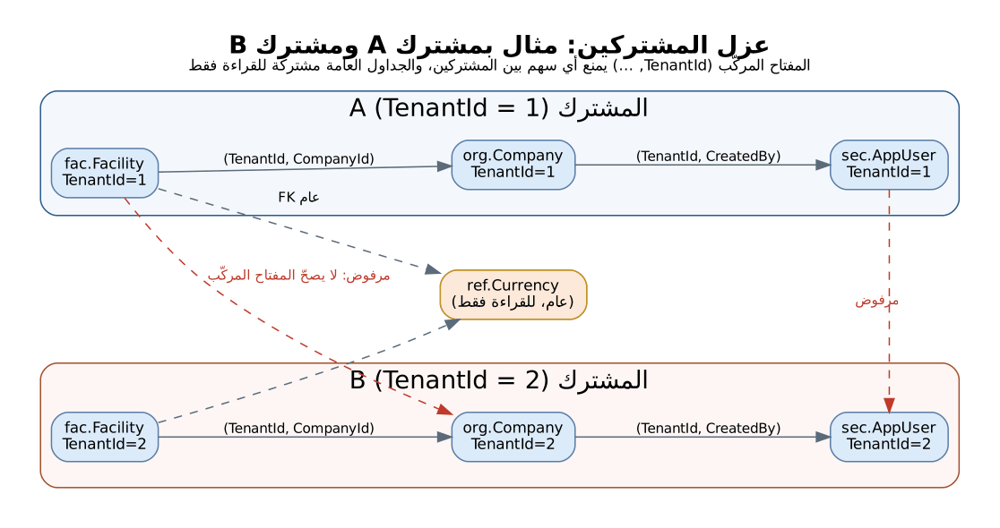

### 3.2 سياق الجلسة وربط الهوية
- `sec.usp_SetSessionContext(@TenantId, @UserId, @ClientIp, @CorrelationId)` يُستدعى **عند فتح كل اتصال من المجمّع** وقبل أي استعلام، ويتحقق بالترتيب:
  1. `TenantId` و`UserId` مطلوبان (خطأ `50001`)؛
  2. المشترك موجود وحالته من `TRIAL/ACTIVE/SUSPENDED/ARCHIVED_READ_ONLY` (خطأ `50002`)؛
  3. **المستخدم بحالة `ACTIVE` ومنتمٍ إلى المشترك نفسه** (خطأ `50003`، برسالة عامة لا تكشف وجود المستخدم).
  ثم يضبط المفاتيح بـ`@read_only = 1` فلا يستطيع استعلام لاحق تغيير المشترك.
- **التنفيذ بصفة `tp_auth`** (`WITH EXECUTE AS`): هذا الدور داخلي بلا تسجيل دخول، يملك قراءة `sec.AppUser` و`plat.Tenant` فقط، ويتجاوز RLS **داخل هذا الإجراء فقط** (عضوية `IS_MEMBER(N'tp_auth')` في دوال السياسات). لولاه لما رأى الإجراء صف المستخدم قبل ضبط السياق.
- **الفشل:** عند أي خطأ يُرفع خطأ ويجب على التطبيق إعادة الاتصال (`sp_reset_connection`) ولا يستعمله. هذا شرط على التطبيق لا يفرضه المحرك؛ يُختبر في S1.
- **حساب الخدمة (`IsSystemUser`):** المهام الخلفية وتكامل المشترك لا تملك مستخدمًا بشريًا. تُنشأ لكل مشترك عند التهيئة مستخدم خدمة بعلم `IsSystemUser = 1` بلا كلمة مرور ولا MFA (قيد `CHECK`)، ويُستعمل في `usp_SetSessionContext` لمهامه.
- **الحد المتبقي (مفتوح، O-11):** الإجراء يتحقق من **الترابط** بين المشترك والمستخدم، لكنه **لا يوثّق أن المستخدم هو من يدّعي أنه هو**. أي تطبيق مخترق يملك `tp_app` يستطيع اختيار أي مستخدم نشط من أي مشترك. لذلك يبقى عزل الهوية مسؤولية التطبيق في المصادقة، ويُعالج أحد خيارين قبل الإنتاج: (أ) دور تطبيق مستقل لكل مشترك (`sp_setapprole`) بكلمة مرور مشتقة من KMS، أو (ب) تمرير رمز موقَّع من طبقة الهوية يتحقق منه الإجراء. يُختار أحدهما في S1.

### 3.3 أنواع النطاق
| النوع | علامة النموذج | الجداول | القراءة (tp_app) | الكتابة (tp_app) | الكتابة (tp_platform) |
|---|---|---|---|---|---|
| مملوك للمشترك | (افتراضي) | 180 | صفوف مشتركه | صفوف مشتركه | **لا وصول مباشر** |
| عالمي | `global` | 7 | الكل (ما عدا `noapp`) | **لا** | نعم |
| عالمي محجوب | `global noapp` | 4 (`plat.Tenant`، `plat.PlatformOperator`، `plat.ReservedSubdomain`، `plat.TenantModule`) | **لا وصول** (يُقرأ صف المشترك عبر §3.6، ووحدات الاشتراك عبر `plat.v_TenantModule`) | لا | نعم |
| مختلط | `mixed` | 3 (`aud.AuditLog`، `cfg.NonWorkingDay`، `ref.UcpArticle`) | صفوف المنصة (`TenantId IS NULL`) + صفوف مشتركه | صفوف مشتركه فقط | صفوف المنصة وغيرها |

قيدان بنيويان يفرضهما المولّد: لا جدول عالمي أو مختلط يشير إلى جدول مملوك (يُرفض عند التوليد)، والمراجع نحو العالمي/المختلط مفاتيح بسيطة.

### 3.4 سياسة خاصة لـ `aud.AuditLog`
`aud.AuditLog` جدول مختلط بسياسة خاصة (BR-PLT-001/009):
- **القراءة:** المشترك يرى صفوفه فقط. صفوف `TenantId IS NULL` (أحداث المنصة) **لأعضاء `tp_platform` فقط**.
- **الكتابة (إدراج فقط):** `TenantId` الخاص بالمشترك أو `NULL` لحدث منصة؛ لا تعديل ولا حذف (`UPDATE` ممنوع لكل الأدوار بالمنح والـ`DENY`).
- الدوال: `rls.fn_AuditRead` و`rls.fn_AuditWrite`، والسياسة `rls.TP_aud_AuditLog`.

### 3.5 مشغّلو المنصة والدعم
- **`tp_platform` لا يملك وصولًا مباشرًا لجداول المشتركين** (C-4). يكتب على الجداول العالمية (بما فيها `plat` المحجوبة) وعلى صفوف المنصة في الجداول المختلطة الثلاثة (§3.3)، ويقرأ/يكتب سجلات المنصة في `aud`. هذا يعني أن التعديل على بيانات مشترك لا يُمكن إلا عبر **إجراءات مُراجَعة** للمنصة (تُحدَّد في S0 — O-12).
- **وصول الدعم** إلى بيانات مشترك يمر عبر `plat.SupportAccessGrant`: يفعّله مستخدم من المشترك لمشغّل محدد، بنافذة زمنية (ساعة إلى 72 ساعة، الافتراضي 4) وسبب إلزامي، ويُلغى بـ`RevokedAt/By`، ويُسجَّل في `aud.AuditLog` بشدة عالية (BR-PLT-009). **تفعيل الإجراء الذي يتحقق من المنحة قبل أي وصول هو شرط S0**، لأن القاعدة وحدها لا تفرضه قبل إنشاء تلك الإجراءات.
- دور `tp_platform` **يتجاوز RLS** لكنه لا يملك جداول مشتركين يتجاوزها؛ التجاوز يبقى في دوال السياسات للكتالوجات المختلطة وسجل التدقيق.

### 3.6 قراءة صف المشترك للتطبيق
`plat.Tenant` محجوب عن `tp_app` (`noapp`). يقرأ التطبيق صف مشتركه من العرض `plat.v_CurrentTenant` الذي يرشّح بـ`SESSION_CONTEXT('TenantId')`، فلا يرى أي مشترك آخر ولا قائمة المشتركين. العرض يملكه نفس مالك الجدول الأساسي، فتعمل سلسلة الملكية دون منح للجدول. وكذلك وحدات الاشتراك `plat.TenantModule` (مملوكة للمنصة ويكتبها مشغّلوها فقط، DR-01) تُقرأ عبر العرض المماثل `plat.v_TenantModule` بالترشيح نفسه.

---

### 3.7 العلاقات الأساسية: المشترك والمستخدمون والصلاحيات

يوضح المخطط كيف يرتبط `plat.Tenant` بالمستخدمين والأدوار والصلاحيات ومفتاح تشفيره وشركاته ووحداته. كل خط **مفتاح أجنبي فعلي** ويحمل اسم عمود الربط، والجداول مرسومة بمفاتيحها (`PK` و`FK` و`UK`) فقط. عمود `TenantId` الذي تحمله جداول المشترك كلها وإشارته إلى `plat.Tenant` **لم يُرسم في كل جدول** لتفادي الازدحام، وترد كاملة في جداول المواصفات (§10). الروابط إلى جداول خارج المجموعة لا تُرسم، وتظهر في جدول العلاقات بعمود «مرسوم: لا».

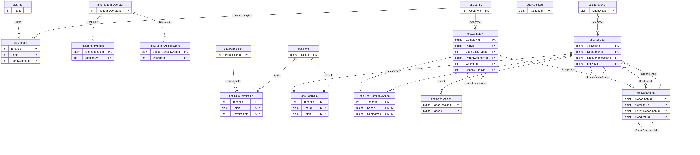

## 4. الاتفاقيات (Conventions)

| الموضوع | الاتفاق |
|---|---|
| **المفاتيح** | `<Table>Id BIGINT IDENTITY` (و`INT` للكتالوجات الصغيرة بعلامة `int`، 48 جدولًا)؛ المفتاح الأساسي مجمّع على المعرّف وحده؛ الفرادة المركّبة `(TenantId, Id)` هدفًا للمراجع |
| **المعرّف العام** | `PublicId UNIQUEIDENTIFIER DEFAULT NEWSEQUENTIALID()` على جذور التجميعات المعرَّضة (علامة `public`)، فريد على مستوى القاعدة؛ **لا يُعرَّض `BIGINT` عبر API** |
| **التدقيق** | `CreatedAt/CreatedBy/UpdatedAt/UpdatedBy` (UTC `DATETIME2(3)`) + `RowVersion ROWVERSION` للتزامن المتفائل (161 جدولًا) |
| **للإضافة فقط** | علامة `append`: بلا `UpdatedAt/By` وبلا `RowVersion`؛ **تُفرض بالمنح** (`INSERT` و`SELECT` فقط) و**`DENY UPDATE`** — §9 |
| **الحذف** | **لا حذف فعلي** إلا على الجداول المعلَّمة `deletable` (36 جدولًا: وسطاء وجلسات ورموز مؤقتة…)؛ الباقي بالحالة (أرشفة/إلغاء/استبدال) |
| **المبالغ** | `DECIMAL(19,4)` + عمود `CurrencyId` مجاور؛ لا مبلغ بلا عملة. أسعار الصرف `DECIMAL(19,8)` |
| **النسب** | `DECIMAL(9,6)` بنقاط مئوية (1.5 = 1.5%) |
| **القوائم المغلقة** | `VARCHAR` + `CHECK ... IN (...)` (لا جداول بحث لقيم منطق ثابت)؛ القوائم القابلة للتخصيص لكل مشترك في `cat.LookupList/LookupItem` أو كتالوجات مسمّاة |
| **القوائم المتعددة القيم** | جدول وسيط؛ `set{}` (نص مفصول بفواصل) لقوائم صغيرة جدًا ثابتة فقط |
| **التواريخ** | ميلادي `DATE`؛ الهجري نص `NVARCHAR(20)` حيث تفرضه المستندات |
| **الأسماء** | مخططات بحروف صغيرة (`fac`)، جداول `PascalCase` مفرد، قيود `PK_/UQ_/IX_/FK_/CK_/DF_<Table>_…` ≤ 128 حرفًا (ومن 60 حرفًا يُقصَّر بلاحقة تجزئة في PostgreSQL) |
| **الكتالوجات** | علامة `catalog`: `Code, NameAr, NameEn, Description, IsActive, IsSystem, IsLocked, SortOrder, SeedKey, ExternalCode` + فرادة `(Tenant,Code)` و`(Tenant,SeedKey)`؛ `SeedKey` يربط صف البذرة عبر الإصدارات |
| **حقول الربط الخارجي** | `ExternalCode`/`ExternalRef` نصية عامة لربط ERP والبنوك لاحقًا دون تغيير بنيوي |

---

## 5. التاريخ والمراجعات ومصدر القيمة

### 5.1 الصفوف المراجَعة `rev` (13 جدولًا)
الأعمدة: `FromRevision`, `ToRevision` (NULL = الجاري), `SupersedesId`. التعديل **يُنشئ صفًا جديدًا** ويغلق السابق. الفرادة تُصفّى على الجاري (`WHERE ToRevision IS NULL`). التسهيل يملك رأسًا واحدًا + `fac.FacilityRevision` (مسودة/تقديم/رفض/اعتماد؛ مراجعة مفتوحة واحدة لكل تسهيل عبر فهرس فريد مصفّى).

### 5.2 ختم المصدر `src` (11 جدولًا)
كل قيمة ائتمانية مقروءة من اتفاقية تحمل: `SourceDocumentId`, `SourcePage`, `ReadFromScan`, `OriginalText`, `NoSourceReason`, `Confidence` (`ENTERED_NO_DOCUMENT` / … / `CONFIRMED_AGAINST_ORIGINAL`), `VerifiedBy/On`, `ConflictId → fac.ValueConflict`.
- قيد `CHECK`: إما مستند وصفحة، وإما `ENTERED_NO_DOCUMENT` — فلا قيمة بلا أصل أو إقرار بغيابه.
- «مؤكَّد مقابل الأصل» يستلزم مدققًا وتاريخًا.
- التعارض بين مستندين يُسجَّل في `fac.ValueConflict` ولا يُحلّ بالتخمين.

### 5.3 التدقيق وحدوده
- `aud.AuditLog`: من/متى/ماذا (`BeforeJson/AfterJson` مع إخفاء الحقول المقيَّدة)/من أي عنوان وارتباط (`IpAddress`, `CorrelationId`)؛ إدراج فقط، بتصنيف (`Category`) وشدة (`Severity`) ونتيجة (`Result`).
- **سلسلة البصمات** اختيارية لكل مشترك (`ChainSeq`, `PrevHash`, `RowHash` = SHA-256 للسابق مع تمثيل قانوني للصف) (FR-PLT-025). **حدّها:** السلسلة وحدها **لا تكشف العبث**؛ من يملك تعديل السجل يستطيع إعادة حساب البصمات كلها. لذلك يلزم **تثبيت جذر السلسلة خارج القاعدة** دوريًا (مرساة في تخزين غير قابل للتعديل أو تجزئة منشورة)، ومراقبة انقطاع التسلسل. موقع المرساة قرار مفتوح (O-13).
- `aud.SensitiveAccessLog`: كل كشف أو تصدير أو عرض صورة هوية بسبب إلزامي.
- `wfl.RequestAction`: سجل إجراءات الطلب (الخط الزمني للمستخدم) — **غير** سجل التدقيق الأمني.
- `sec.KeyEvent`: دورة حياة المفاتيح.

---

## 6. حماية البيانات الحساسة

### 6.1 ما يُخزَّن
| الجدول | العمود المشفّر | مفتاح البيانات (المرجع + الغرض) | مفتاح الفهرسة HMAC (المرجع + الغرض) |
|---|---|---|---|
| `pty.IdentityDocument` | `NumberEnc` | `EncKeyPurpose` = `DATA` → `EncKeyId` | `HashKeyPurpose` = `BLIND_INDEX` → `HashKeyId` ← `NumberHash` |
| `pty.PartyCustomField` | `ValueEnc` (للحقل المقيَّد) | `EncKeyPurpose` = `DATA` → `EncKeyId` | — |
| `acc.BankAccount` | `AccountNoEnc`، `IbanEnc` | `EncKeyPurpose` = `DATA` → `EncKeyId` | `HashKeyPurpose` = `BLIND_INDEX` → `HashKeyId` ← `AccountNoHash`، `IbanHash` |
| `lc.LcTerms` | `BeneficiaryAccountIbanEnc` | `EncKeyPurpose` = `DATA` → `EncKeyId` | `HashKeyPurpose` = `BLIND_INDEX` → `HashKeyId` ← `BeneficiaryAccountIbanHash` |
| `sec.AppUser` | `MfaSecretEnc` | `MfaKeyPurpose` = `DATA` → `MfaKeyId` | — |
| `doc.DocumentVersion` | ملف الهوية في مخزن خارجي (`StorageKey`، `Sha256`) | `KeyPurpose` = `FILE` → `KeyId` | — |
| `plat.PlatformOperator` | `MfaSecretEnc` | `MfaKeyRef` (مفتاح المنصة في KMS وإصداره) | — |
| `sec.TenantKey` | `WrappedKey` | مغلَّف بمفتاح رئيسي خارج القاعدة (`MasterKeyRef`) | — |

أرقام الهوية والإقامة والجواز **لا تُعرض ولا تُخزَّن صريحة**؛ القناع `NumberMask` (آخر 4) للعرض، والبصمة `NumberHash` للبحث بالتطابق وكشف التكرار دون فك التشفير.

### 6.2 شكل الغلاف المشفّر (إلزامي لطبقة التطبيق)
كل قيمة مشفّرة في عمود `bin` تُخزَّن بهذه الصيغة:

| الجزء | الحجم | المحتوى |
|---|---|---|
| إصدار الصيغة | 1 بايت | `0x01` |
| الـnonce | 12 بايت | عشوائي، **فريد لكل عملية تشفير** (لا عداد يُعاد استخدامه) |
| النص المشفّر | متغيّر | AES-256-GCM بمفتاح `DATA` المُشار إليه بعمود المفتاح في الصف |
| الوسم (tag) | 16 بايت | وسم GCM للتحقق من السلامة |

- **أدنى طول للغلاف = 29 بايت**، ويفرضه `CHECK DATALENGTH(...) >= 29` على كل عمود مشفّر.
- **AAD** (البيانات المصادَقة غير المشفّرة): `TenantId` (4 بايت، big-endian) ‖ اسم الجدول ‖ اسم العمود ‖ **المعرّف الثابت للصف**. هذا يمنع نقل نص مشفّر من مشترك إلى آخر أو من عمود إلى آخر. المعرّف الثابت يُحدَّد لكل جدول في S0 (إن لم يكن للجدول `PublicId` يُستعمل المفتاح الأساسي بعد الإدراج، فتُكتب القيمة المشفّرة في المعاملة نفسها).
- **إصدار المفتاح:** عمود المفتاح في الصف (`EncKeyId`/`MfaKeyId`/`MfaKeyRef`) يحدد نسخة المفتاح التي شُفِّر بها الصف. القيد `CHECK` يفرض وجود عمود المفتاح عند وجود القيمة المشفّرة.
- **غرض المفتاح:** بجانب كل مفتاح عمود ثابت للغرض (`EncKeyPurpose = DATA`، `HashKeyPurpose = BLIND_INDEX`، `MfaKeyPurpose = DATA`، `KeyPurpose = FILE`)، والمفتاح الأجنبي إليه **مركّب** `(TenantId، الغرض، معرّف المفتاح)` إلى `sec.TenantKey(TenantId, Purpose, TenantKeyId)`. لا يمكن بذلك ربط مفتاح فهرسة بعمود تشفير، ولا مفتاح مشترك آخر (DR-02).
- **الطول والصيغة يتحقق منهما التطبيق**؛ القاعدة تفرض الحد الأدنى فقط.

### 6.3 التدوير وإعادة التشفير
1. إنشاء صف `sec.TenantKey` جديد بحالة `PENDING` ثم `ACTIVE` (فرادة `ACTIVE` لكل غرض).
2. الصفوف الجديدة تُشفَّر بالمفتاح `ACTIVE`، والقديم يصير `RETIRING`.
3. مهمة خلفية تعيد تشفير كل صف، فيتغير `EncKeyId` إلى المفتاح الجديد داخل المعاملة نفسها التي تكتب الغلاف.
4. تقدّم الإعادة = عدد الصفوف التي ما زالت تشير إلى المفتاح `RETIRING`؛ عند الصفر يصير `RETIRED`.
5. **فهرس HMAC** (`HashKeyId`) يتطلب إعادة حساب البصمات ثم إعادة بناء الفهرس؛ لا يُدار بالتشفير المعتاد.

### 6.4 مفاتيح وأغلفة أخرى
| العنصر | التصميم |
|---|---|
| **المفاتيح** | `sec.TenantKey`: لكل مشترك مفاتيح بأغراض `DATA` / `BLIND_INDEX` / `FILE` وإصدارات؛ `WrappedKey` **ملفوف بمفتاح رئيسي خارج القاعدة**؛ مفتاح `ACTIVE` واحد لكل غرض؛ التدوير بحالة `RETIRING` |
| **كلمات المرور والرموز** | تُخزَّن **بصمات** فقط (`PasswordHash`, `TokenHash`, `CodeHash`) وأسرار MFA مشفّرة؛ `sec.UserPasswordHistory` لمنع إعادة الاستخدام |
| **حجب عن التقارير** | `DENY SELECT` على 29 عمودًا موسومة `sens=restricted` للدور `tp_readonly` (`006`) |
| **صور الهوية** | ملفات في مخزن خارج القاعدة: `doc.DocumentVersion` بـ`StorageKey` معزول لكل مشترك، و`Sha256` يحسبه الخادم، و`KeyId → sec.TenantKey` بمفتاح `FILE`، وفحص `ScanStatus` — لا يُنزَّل إلا `CLEAN`. عرضها بصلاحية `party.identity.image.view` وسبب |
| **من يرى الأرقام كاملة** | مدير الخزينة وموظف التسهيلات فقط (`04` §9.4)؛ غيرهما يرى `NumberMask`. يُطبَّق بالصلاحيات في طبقة التطبيق، والقاعدة تضمن أن لا شيء يُقرأ نصًّا صريحًا |

⚠ لا أسرار في النماذج: لا مفاتيح، ولا قيم افتراضية لكلمات مرور. البيانات الشخصية المقروءة من الاتفاقيات المرفوعة **لا تدخل الوثائق ولا البذور**.

---

## 7. استراتيجية سلامة البيانات

| المستوى | ما يضمنه | أين |
|---|---|---|
| **مرجعي** | كل مرجع مفتاح أجنبي (763)، والمركّب يمنع العبور بين المشتركين والتجميعات | `002_foreign_keys.sql` |
| **حالة** | قيم الحالات والأنواع `CHECK IN` | `001_tables.sql` |
| **تناسق الحقول** | مبلغ مطلق أو نسبة من الأب (حسب `AmountBasis`)، ترتيب التواريخ، `ExposureAmount >= Amount`، `LcClass` يقيّد الحقول، **لا إكمال طلب بلا إقفال من الخزينة** (§11)، وأطوال الأغلفة المشفّرة | `CHECK` على الجداول |
| **فرادة** | رموز الكتالوج، الرقم الداخلي، **فريد بين الجاري فقط** (`WHERE ToRevision IS NULL`)، **حجز فعّال واحد لكل طلب**، **تحويل حجز واحد لكل استخدام**، وإعادة إرسال أمر الحجز لا تكرّره (`IdempotencyKey` فريد)، و**دورة عمل واحدة مفتوحة** بالفهرس المصفّى | `UNIQUE` وفهارس فريدة مصفّاة |
| **تزامن** | `RowVersion` + مقارنة في التحديث | طبقة التطبيق |
| **منطق معقّد يبقى في التطبيق** (مذكور برمز `BR-…` في تعليق العمود) | عمق شجرة الحدود ≤ 6 وبلا حلقات · سقف الابن ≤ الأب · حساب المتاح `Available` · إعادة حساب `EffectiveAmount` · صلاحيات التفويض · فحص التعارض بين المفوّضين · **معاملة الحجز** (§7.1) | خدمات `fac.*` وخدمات التطبيق |

### 7.1 الحجز الذري للحدود (شرط في طبقة التطبيق)
الحجز والتحويل والتحرير عمليات مالية، والقيود وحدها لا تمنع التجاوز تحت التزامن:
- كل عملية في **معاملة قصيرة واحدة** تبدأ بقفل صف الحد (`UPDLOCK, ROWLOCK` على `fac.Limit`) ثم تحسب المتاح وتكتب `LimitReservation` و`LimitMovement` و`OutboxEvent` معًا.
- مفتاح `IdempotencyKey` يضمن أن إعادة الإرسال لا تكرر الحجز.
- **مستوى العزل:** `READ_COMMITTED` مع القفل الصريح؛ لا يُعتمد `SERIALIZABLE` عامًّا لأنه يخنق الأداء.
- **المتاح لا يُخزَّن وحده:** `reconciliation` دوري يعيد حسابه من `LimitMovement`.
- **الاختبار المطلوب:** 100 طلب متزامن على الحد نفسه، بنجاح واحد أو نتائج محددة بدقة (S2).
- أخطاء الأعمال تُعاد كرموز ثابتة للـ API لا كنصوص SQL.

---

## 8. الفهرسة

| النوع | الاستخدام |
|---|---|
| **تلقائي لكل مفتاح أجنبي** | يُنشأ ما لم يغطّه مفتاح/فهرس أو وُسم `noidx` — يمنع الأقفال الطويلة عند الحذف/التحديث ويُسرّع الربط. أعمدة المفاتيح ومراجع الغلاف `noidx` لأنها لا تُبحث |
| **`TenantId` أولًا** في كل فهرس لجداول المشترك | توافق مع مرشّح RLS |
| **مصفّاة (196)** | استحقاقات وتنبيهات على الحالات الحية فقط |
| **`INCLUDE` (47)** | لوحات التوفر وتقارير الاستحقاق دون رجوع للجدول |
| **بحث نصي كامل** | `wfl.Request.SearchText` — اختياري `db/static/040_fulltext_optional.sql` (يتطلب ميزة Full-Text Search) |

قيود SQL Server التي فُحصت آليًا: لا مفتاح فهرس يتجاوز **1,700 بايت** ولا 16 عمودًا؛ المسندات المصفّاة تستعمل `=` و`<>` و`IN` و`IS [NOT] NULL` و`AND` فقط (**لا `OR`**)؛ مفتاحان فقط بـ`ON DELETE CASCADE` فلا مسارات تعاقب متعددة.

> ملاحظة التنفيذ: الفهارس المصفّاة والأعمدة المحسوبة المخزَّنة تتطلب `QUOTED_IDENTIFIER ON` وخيارات ANSI. أدوات `sqlcmd` تفترضها `OFF`؛ لذلك يبدأ كل ملف مولَّد وثابت بضبطها ويُشغَّل النشر بالخيار `-I`.

---

## 9. الأدوار والصلاحيات (على مستوى القاعدة)

### 9.1 الأدوار
| الدور | الغرض | الصلاحيات (ملخص؛ التفصيل الجدولي في 007) |
|---|---|---|
| `tp_app` | حساب تشغيل تطبيق المشترك | **المشترك والمختلط:** `SELECT, INSERT, UPDATE` (RLS يقصر الصفوف على المشترك) · **العالمي:** `SELECT` فقط · **للإضافة فقط:** `SELECT, INSERT` · **`noapp`:** لا شيء · **`plat.v_CurrentTenant` و`plat.v_TenantModule`:** `SELECT` · الحذف الفعلي على `deletable` فقط · `EXECUTE` على `sec.usp_SetSessionContext` فقط · لا `REFERENCES` · لا منح على مستوى المخطط |
| `tp_platform` | مشغّلو المنصة | **العالمي والمختلط:** `SELECT, INSERT, UPDATE` (للإضافة فقط: `SELECT, INSERT`) · **جداول المشتركين: لا شيء** · لا حذف · `DENY UPDATE` على جداول الإضافة فقط |
| `tp_auth` | داخلي بلا تسجيل دخول | `SELECT` على `sec.AppUser` و`plat.Tenant` فقط؛ يُنفَّذ به `usp_SetSessionContext` فقط (`EXECUTE AS`) |
| `tp_readonly` | تقارير/تحليل | `SELECT` على كل المخططات دون الأعمدة الحساسة (`006`)؛ `DENY SELECT` على `plat.PlatformOperator` كليًا |
| `tp_migrator` | النشر والترحيل | يُنشأ الدور فقط؛ **لا منح تشغيلية له هنا** (تُحدَّد مع أداة الترحيل O-2)، ويُستعمل حساب مالك القاعدة أثناء النشر |

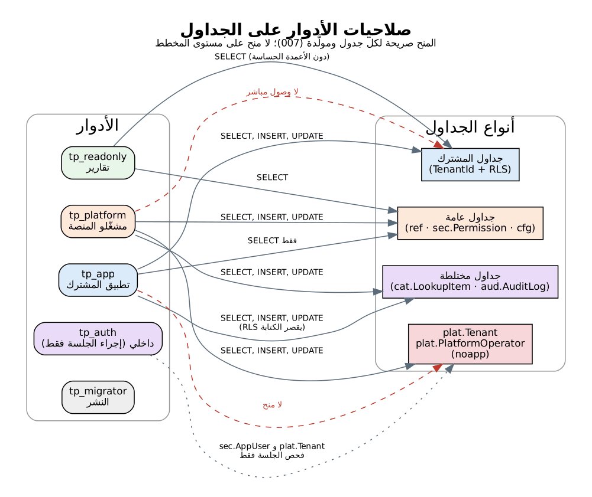

### 9.2 من أين تأتي المنح
| الملف | المحتوى |
|---|---|
| `db/static/020_roles_and_grants.sql` | إنشاء الأدوار، `tp_auth`، قراءة `tp_readonly`، الحجب عن `PlatformOperator` |
| `db/generated/tsql/005_delete_grants.sql` | الحذف على الجداول `deletable` لـ`tp_app`، و`DENY UPDATE` على جداول الإضافة فقط |
| `db/generated/tsql/006_sensitive_columns.sql` | `DENY SELECT` على 28 عمودًا لـ`tp_readonly` |
| `db/generated/tsql/007_table_grants.sql` | **المنح الجدولية الصريحة لـ`tp_app` و`tp_platform`** (206 منحة) |
| `db/static/025_tenant_views.sql` | عرض `plat.v_CurrentTenant` لـ`tp_app` |
| `db/static/030_session_context.sql` | الإجراء وتنفيذه بـ`tp_auth` ومنحه لـ`tp_app` |

### 9.3 التحقق الثابت من الصلاحيات
`tools/dbgen/check_grants.py` يقرأ النموذج والملفات المولَّدة والثابتة ويفشل عند المخالفة. القواعد:
- **R1** لا كتابة لـ`tp_app` على جدول عالمي. **R2** لا منح لـ`tp_app` على `noapp`.
- **R3** لا منح مباشر لـ`tp_platform` على جدول مشترك. **R4** لا `REFERENCES` لدور تطبيقي.
- **R5** لا منح على مستوى المخطط لـ`tp_app`/`tp_platform` (استثناء موثَّق: مخطط `rls` للقراءة).
- **R6** `tp_auth` يملك `SELECT` على جدولين فقط. **R7** عدد أعمدة `sens=restricted` = عدد عبارات `DENY` لـ`tp_readonly`.
- **R8** كل جدول فيه عمود مشفّر يملك مفتاح بيانات، وكل بصمة فهرسة مفتاح HMAC. **R9** لا `UPDATE` على جدول للإضافة فقط.
- **R10** كل ملف في `deploy.sql` موجود، ومنح مخطط `rls` يأتي بعد إنشائه في `010` (وقد كان هذا خطأ في الترتيب قبل المراجعة فاكتُشف وصُحِّح).

**اختباره:** حُقنت ثلاث مخالفات متعمدة في `007` (كتابة على `ref.Currency`، ومنح على `plat.Tenant`، ومنح مباشر لـ`tp_platform` على `org.Company`) فاكتشفها الفحص كلها ثم أُزيلت. الفحص الثابت **لا يثبت** أن المحرك ينفّذ المنح كما هي؛ ذلك في S0.

### 9.4 قواعد عامة
- **لا يملك `tp_app` حذفًا** على أي جدول غير مصرَّح به.
- `DENY` يقيّد الأعضاء بالدور؛ مالكو القاعدة (`db_owner`/`sysadmin`) خارج هذا النموذج ويُحصرون تشغيليًا.
- حساب خدمة واحد للتطبيق (`tp_app`)، وحساب منفصل لمهام المنصة (`tp_platform`)، ولا يُشارَك بيانات الاعتماد.
- التطبيق لا يملك `ALTER` على السياسات أو المخططات.

---

## 10. خريطة المخططات والجداول

| المخطط | الجداول | الوحدة |
|---|---:|---|
| `plat` | 7 — Plan, PlanModule, Tenant, ReservedSubdomain, PlatformOperator, TenantModule, SupportAccessGrant | م0 |
| `sec` | 14 — AppUser, Role, Permission, RolePermission, UserRole, UserCompanyScope, LoginAttempt, UserSession, MfaRecoveryCode, UserToken, UserPasswordHistory, ExternalIdentity, TenantKey, KeyEvent | م0 |
| `aud` | 2 — AuditLog, SensitiveAccessLog | م0 |
| `doc` | 3 — Document, DocumentVersion, DocumentLink | م0 |
| `cfg` | 12 — SettingDefinition, TenantSetting, NumberSequenceDefinition, NumberSequence, NumberIssue, ExpiryAlertRule, ExpiryAlertLog, DataExportJob, NonWorkingDay, OutboxEvent, JobRun, SeedRun | م0 |
| `org` | 14 — Company, CompanyTaxRate, Department, Shareholding, GoverningBody, BodyMember, AuthorityGrant, CompanyProfile, CompanyBranch, CompanyKycFinancialProfile, CompanyExpectedFlow, CompanyWealthSource, CompanyDisclosure, CompanyKeyRelation | م1 |
| `pty` | 11 — Party, IdentityDocument, Address, ContactMethod, CustomFieldDefinition, PartyCustomField, KycProfile, KycProfileItem, KycProfileItemLegalForm, PartyCompliance, TaxIdentity | م1 |
| `ref` | 4 — Country, Currency, Incoterm, UcpArticle | مرجعي |
| `cat` | 26 — TenantCurrency, InstitutionType, AccountType, LegalEntityType, DocumentType, Position, PowerType, OperationType, OperationTypePowerType, ProductCategory, Product, FeeType, FinancingType, ProductFeeType, ProductFinancingType, FacilityType, LimitType, LimitTypeProduct, CollateralType, CollateralTypeAttribute, ObligationType, BaseRate, BaseRateAlias, BaseRateValue, LookupList, LookupItem | م4 |
| `ins` | 6 — Institution, InstitutionUnit, Contact, Relationship, RelationshipContact, RelationshipProduct | م2 |
| `acc` | 6 — BankAccount, FacilityAccount, Signatory, SignatoryAuthority, SignatoryAuthorityJointClass, AuthorityConflict | م3 |
| `fac` | 13 — Facility, FacilityRevision, FacilityDocument, FacilityLender, OutstandingSnapshot, Limit, LimitProductLine, LimitCompanyRule, ProductLineTerm, Utilization, LimitReservation, LimitMovement, ValueConflict | م5 |
| `prc` | 5 — TariffSchedule, TariffItem, TariffTier, PricingRule, PricingTier | م5 |
| `cmp` | 2 — TermType, TermValue | م5 |
| `col` | 7 — Collateral, CollateralLink, Guarantee, PromissoryNote, PromissoryNoteSigner, InsurancePolicyAssignment, ValuationSchedule | م5 |
| `obl` | 8 — Obligation, ObligationCompany, ReportingObligation, ReportingInstance, Covenant, CovenantAccount, CovenantTest, ObligationBreach | م5 |
| `fin` | 7 — LineCatalogItem, LineCatalogItemAlias, FinancialStatement, StatementLine, AccountMonthlyStat, BankFlowEntry, MeasureFormula | م5 |
| `wfl` | 19 — RequestType, RequestTypeAudience, ExternalPhase, WorkflowTemplate, WorkflowStage, StageApprover, WorkflowTransition, WorkflowStageHook, TemplateField, TemplateAttachmentRule, Request, RequestComment, RequestAttachment, RequestExternalRef, RequestStageInstance, RequestApproval, RequestAction, HookExecution, UserDelegation | م6 |
| `ntf` | 7 — NotificationEventType, NotificationRule, NotificationTemplate, NotificationPreference, DigestBatch, Notification, NotificationDelivery | م6 |
| `lc` | 21 — LcFieldDefinition, LcFieldUcpRef, Counterparty, LcDocumentClause, LcDocumentClauseUcpRef, LcTerms, LcTermsDocument, LcChargesMatrix, LcFormTemplate, LcFormFieldMap, LetterOfCredit, LcExternalRef, LcAmendment, LcDrawing, LcSalesOrder, LcDrawingAllocation, LcDiscrepancy, ProformaInvoice, ProformaLine, LcTermsComparison, LcTermsComparisonLine | م7/م8 |

القاموس الكامل (عمود بعمود: النوع، الإلزام، الافتراضي، المرجع، الحساسية، الوصف): [`21-data-dictionary.md`](21-data-dictionary.md). مخططات العلاقات لكل مخطط: [`22-erd-by-schema.md`](22-erd-by-schema.md).

### 10.1 تغطية المتطلبات
فُحص آليًا أن كل كيان مسمّى في القسم 6 من المواصفات (`10…14`) له جدول في النموذج؛ لم يظهر كيان ناقص. تعيين المتطلبات إلى الجداول مرجعه تعليقات النماذج (`FR-…`/`BR-…`/`V-…` في كل جدول وعمود).

### 10.2 مخططات العلاقات حسب الوحدة

تُقرأ الصور كما يلي: كل صندوق جدول، وتحته مفتاحه (`PK`) ومفاتيحه الأجنبية (`FK`) مع الجدول الذي يشير إليه، والأسهم هي المفاتيح الأجنبية الفعلية ويُكتب اسم العمود على السهم. الصورة تعرض جداول المجموعة فقط (حتى أربعة جداول)، والعلاقات إلى جداول خارجها تُقرأ من جدول العلاقات. كل جدول مملوك للمشترك يحمل `TenantId` ويشير إلى `plat.Tenant` (انظر §3.7)، ولم يُرسم ذلك في كل صورة.

#### الهوية والمشترك والصلاحيات (م0)
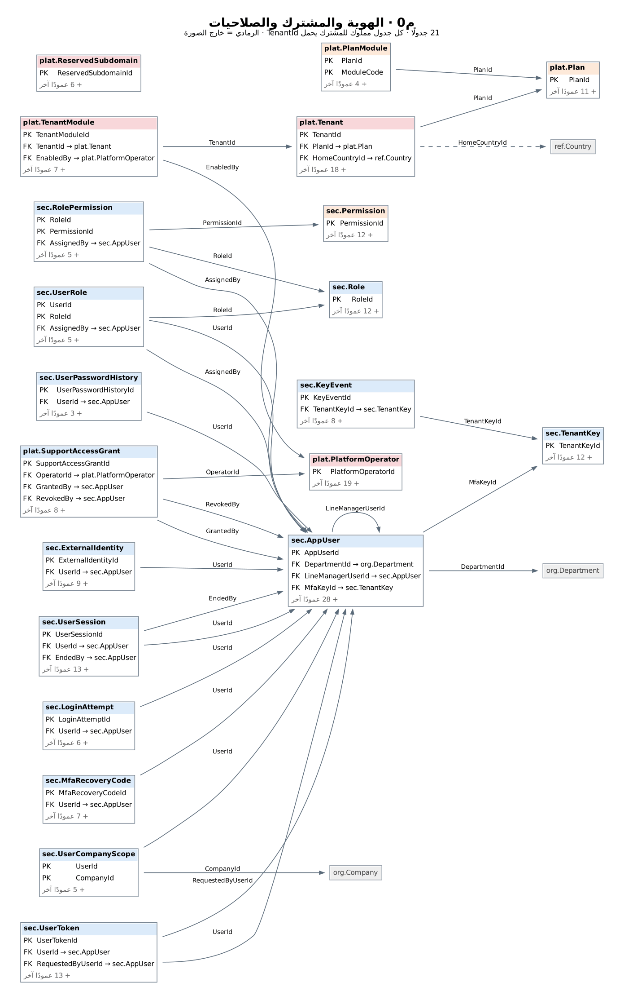

#### التدقيق والمستندات والإعدادات (م0)
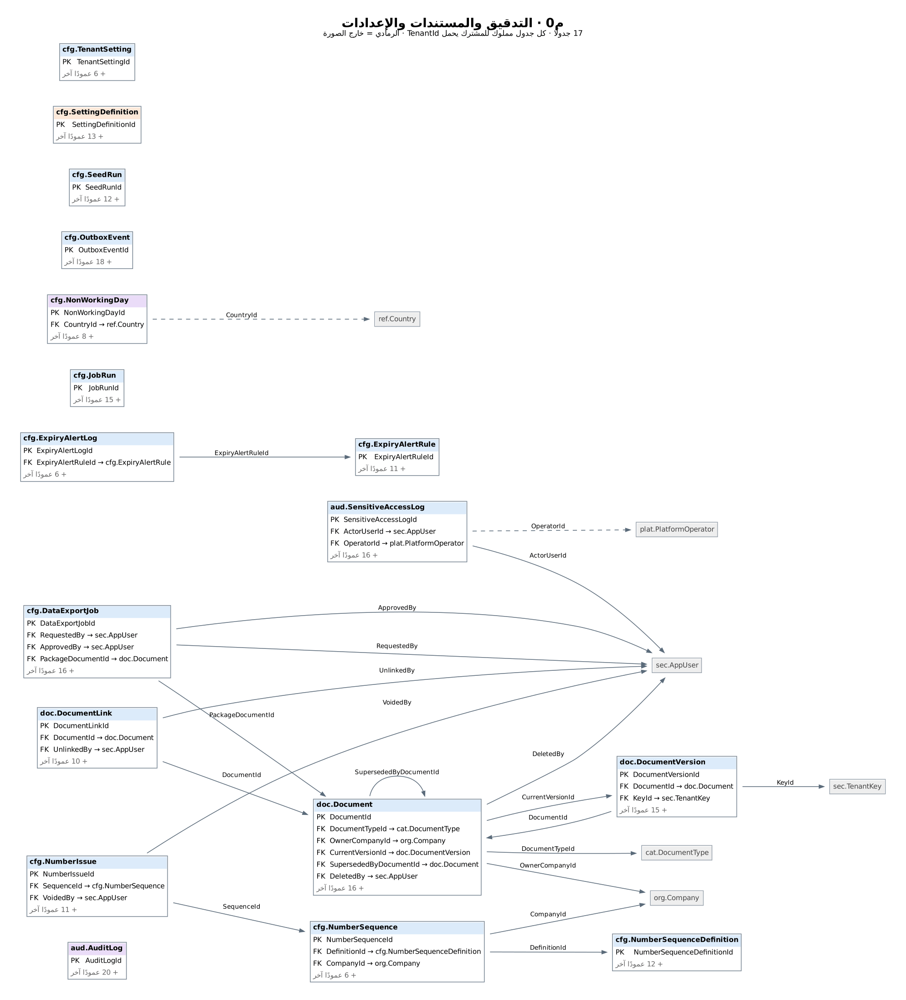

#### الهيكل المؤسسي والأشخاص (م1)
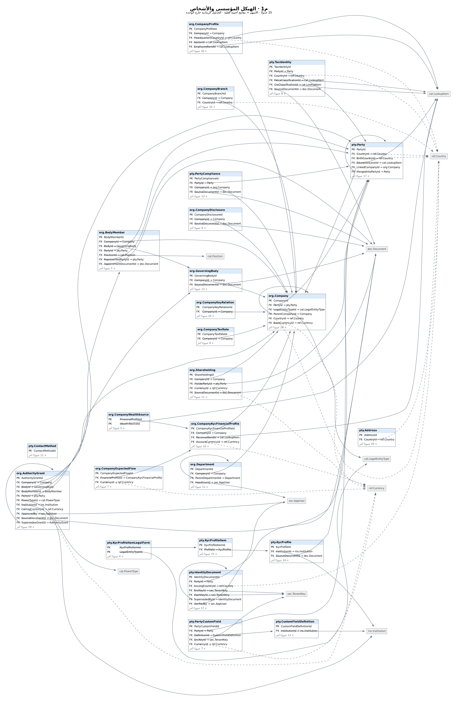

#### المنشآت والحسابات والمفوّضون (م2–م3)
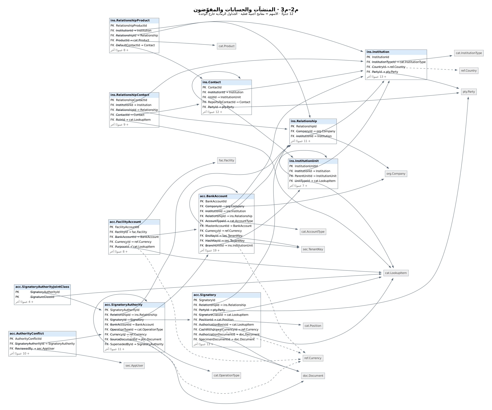

#### الكتالوجات (م4)
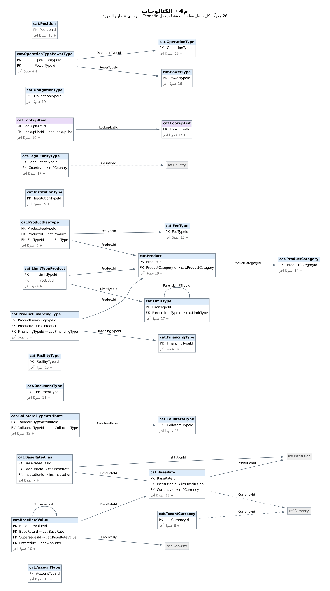

#### التسهيلات والحدود (م5)
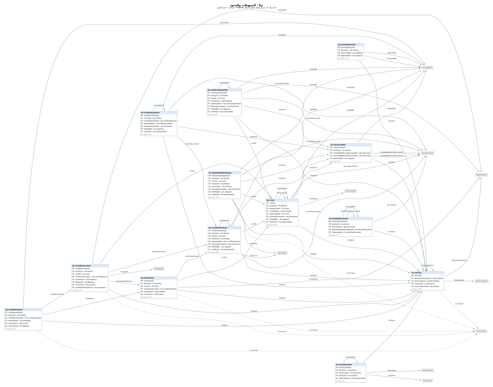

#### التسعير والتعرفة وشروط المقارنة (م5)
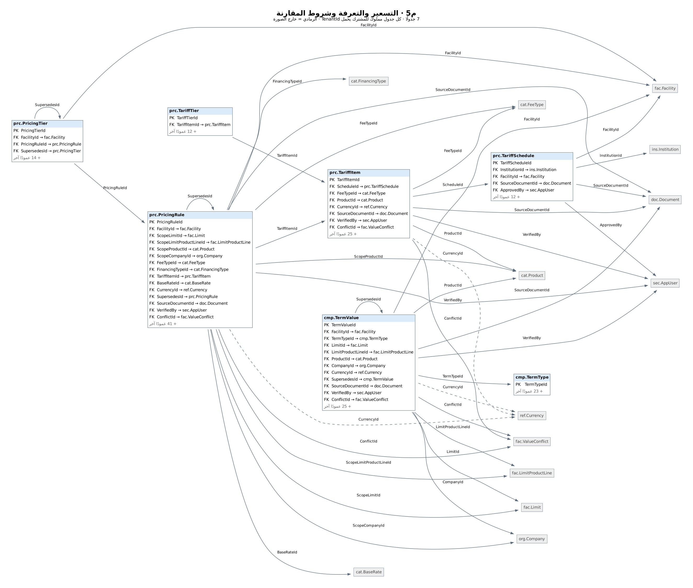

#### الضمانات (م5)
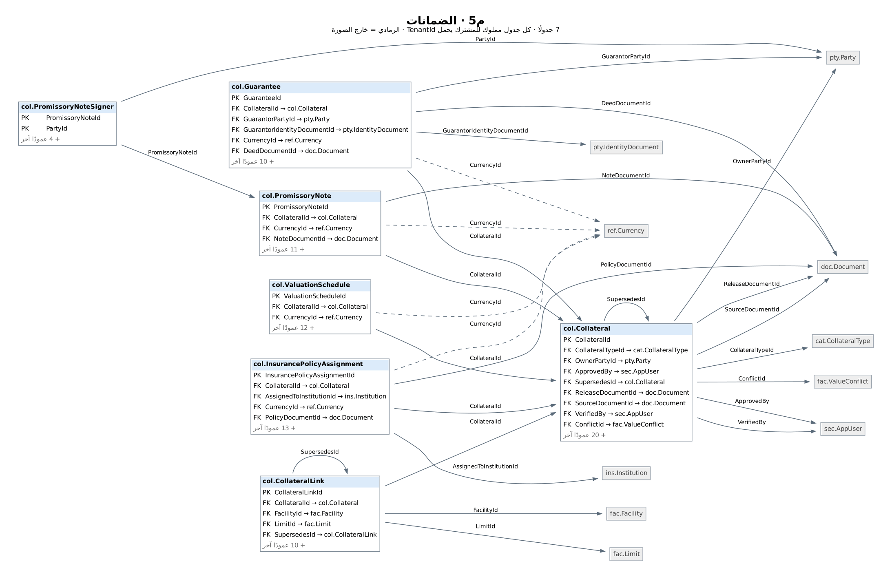

#### الالتزامات والبيانات المالية (م5)
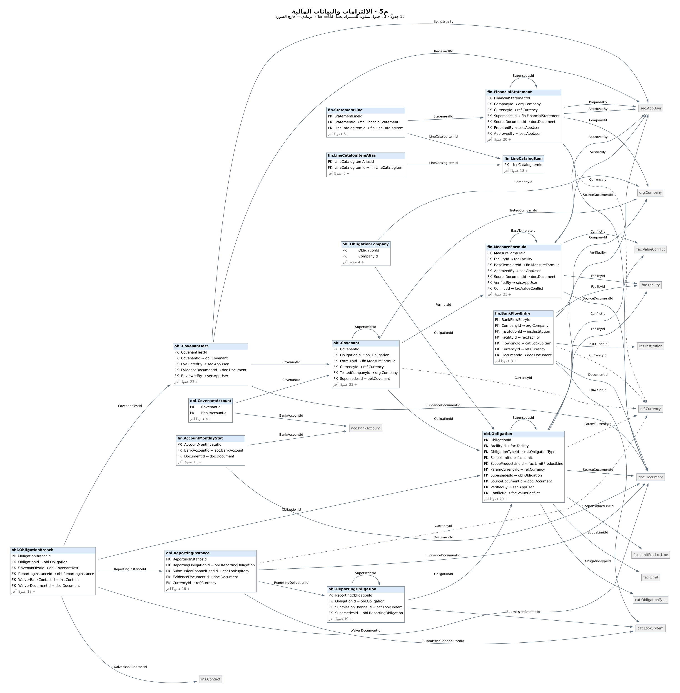

#### محرك الطلبات ودورات العمل (م6)
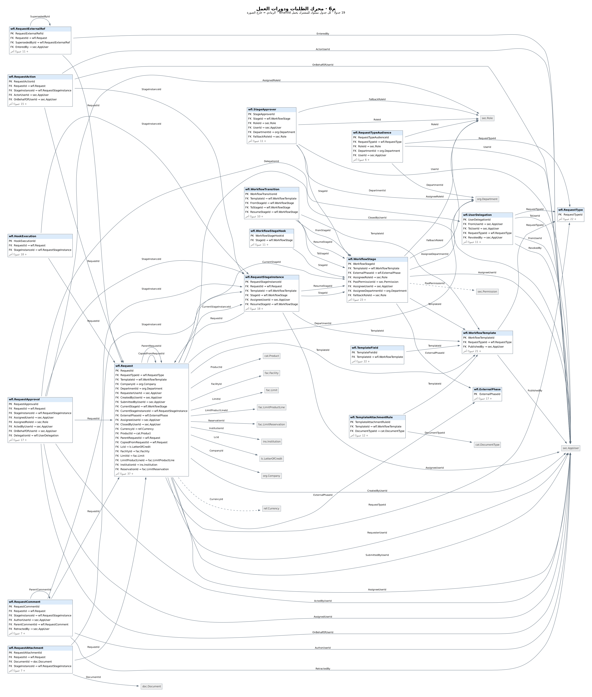

#### الإشعارات (م6)
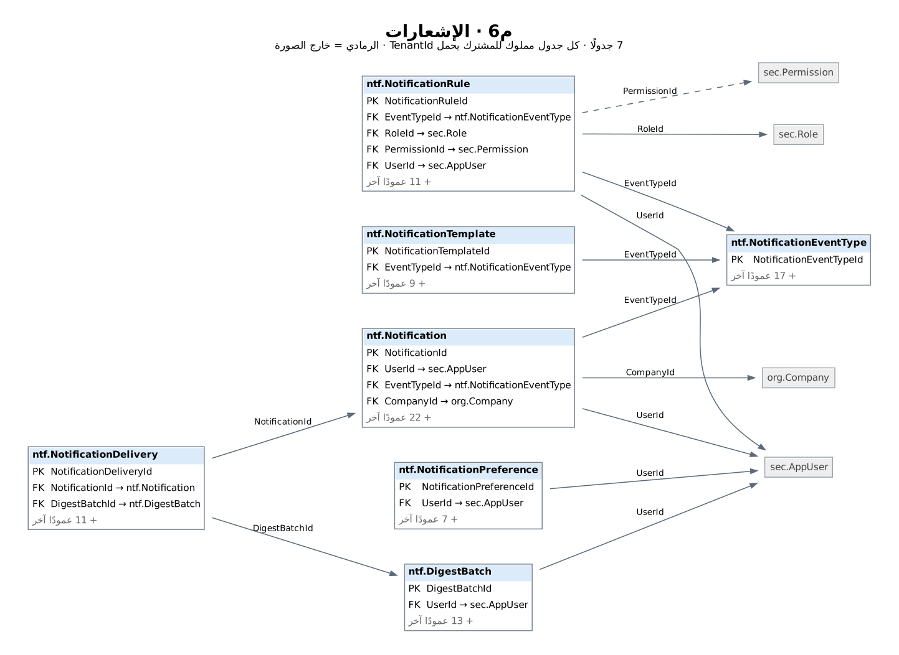

#### الاعتمادات المستندية والبروفورما (م7/م8)
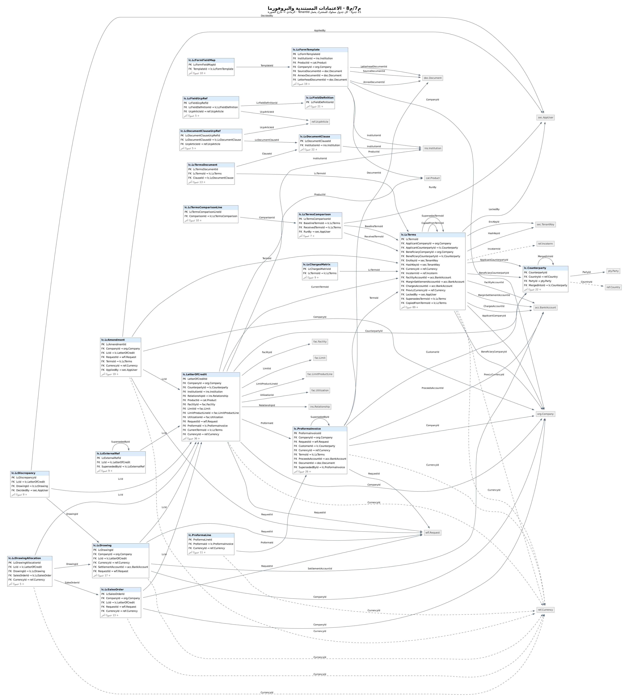

---

## 11. أنماط التصميم للمجالات الرئيسية

| المجال | النمط |
|---|---|
| **الأشخاص والجهات** | `pty.Party` موحّد (فرد/منشأة) يُعاد استخدامه: شريك، مدير، مفوّض، كفيل، جهة اتصال، مستفيد؛ الهويات والعناوين ووسائل الاتصال جداول تابعة؛ اكتمال KYC لكل بنك عبر `KycProfile/Item` (بنود بحد مالك `OwnerThresholdPct` وعمر أقصى `MaxAgeDays`) |
| **الهيكل المؤسسي** | `org.Company` (شكل قانوني منفصل عن علم «قابضة»)، `Shareholding` (ملكية متعددة الطبقات)، `GoverningBody`/`BodyMember`/`AuthorityGrant` (حوكمة وصلاحيات بسقف وتوقيع مشترك وفترة)، وجداول KYC للشركة |
| **الجهات المالية والحسابات** | `ins.Institution` ← `InstitutionUnit` ← `Contact` (طبقتان)، `Relationship` (شركة–بنك) تحمل مديري العلاقة والمنتجات؛ `acc.BankAccount` بأرقام مشفّرة؛ المفوّضون `Signatory` بحدود السلطة `SignatoryAuthority` وتعارض السلطات `AuthorityConflict` |
| **التسهيلات** | `fac.Facility` (حزمة اتفاقية) + `FacilityRevision`؛ `Limit` شجرة بأوضاع توزيع؛ `LimitProductLine` خطوط منتج؛ `ProductLineTerm` شروط؛ `FacilityLender` للتجمعات؛ `Utilization`/`LimitReservation`/`LimitMovement`؛ `OutstandingSnapshot`؛ `ValueConflict` |
| **التسعير** | `prc.TariffSchedule/Item/Tier` جداول رسوم؛ `PricingRule/Tier` قواعد تسعير؛ `cat.BaseRate/Alias/Value` أسعار مرجعية بقيم مؤرخة |
| **الضمانات** | `col.Collateral` + `CollateralLink` (ربط بحد/تسهيل بتغطية) + تخصصات: `Guarantee`, `PromissoryNote`+`Signer`, `InsurancePolicyAssignment`, `ValuationSchedule` |
| **الالتزامات** | `obl.Obligation` + `ReportingObligation/Instance` (تقويم تقارير) + `Covenant/CovenantTest/CovenantAccount` + `ObligationBreach`؛ `CheckMode` اختياري يرث افتراضي المشترك |
| **البيانات المالية** | `fin.FinancialStatement/StatementLine` ببنود كتالوج، `AccountMonthlyStat` متوسطات الأرصدة، `BankFlowEntry` المبالغ المحوَّلة (يدخلها قسم الخزينة)، `MeasureFormula` |
| **الشروط القابلة للمقارنة** | `cmp.TermType/TermValue` — مكتبة شروط للمقارنة بين البنوك بترتيب: التسعير ثم المدد ثم الضمانات |
| **محرك الطلبات** | `wfl.RequestType` ← `WorkflowTemplate` ← `WorkflowStage/StageApprover/Transition/Hook`؛ الطلب `Request` + نسخ المراحل + الموافقات + الإجراءات + المرفقات؛ `UserDelegation`؛ أدوار المنشئ والمدقق والمعتمد بالصلاحيات، والفصل بينها `wf.sod.allow_same_person` |
| **إقفال دورة العمل** (C-7) | انظر §11.1 |
| **الإشعارات** | `NotificationEventType` + `Rule` + `Template` + `Preference` (فوري/ملخص يومي/أسبوعي/إيقاف) + `Notification` + `Delivery` + `DigestBatch` |
| **الاعتمادات** | `lc.LcTerms` + `LcFieldDefinition` وربط كل حقل بمواد UCP (`LcFieldUcpRef`) + `LetterOfCredit` (شراء/مبيعات) + تعديل/سحب/مخالفات + `LcSalesOrder` + `LcChargesMatrix` + `LcFormTemplate/FieldMap` لنماذج البنوك + `LcTermsComparison` |
| **الوظائف الخلفية** | `cfg.OutboxEvent` (بريد صادر لأحداث متسقة مع المعاملة)، `JobRun`، `ExpiryAlertRule/Log`، `DataExportJob`، `SeedRun`؛ تعمل بحساب الخدمة `IsSystemUser` لكل مشترك (§3.2) |

### 11.1 إقفال دورة العمل بيد إدارة الخزينة (C-7)
**القاعدة (BR-WFL-027):** انتهاء المراحل بنجاح **لا يُكمل الطلب**. الطلب ينتقل إلى `AWAITING_CLOSE` ويُسجَّل `ReadyToCloseAt`، ثم لا يصير `COMPLETED` إلا **بإقفال من إدارة الخزينة** (صلاحية `req.treasury.close`)، فيُسجَّل `ClosedByUserId` و`ClosedAt`.

| البند | التصميم في القاعدة | الفرض |
|---|---|---|
| الحالة | `Status` ∈ {`DRAFT`, `ACTIVE`, `AWAITING_CLOSE`, `COMPLETED`, `REJECTED`, `CANCELLED`} | قيد `CHECK` على القيم |
| دخول `AWAITING_CLOSE` | يلزم `ReadyToCloseAt` و`CurrentStageInstanceId` | قيد `CHECK` |
| `COMPLETED` | يلزم `ClosedByUserId` و`ClosedAt` و`ClosedAt = CompletedAt`، ولا يُكتب `ClosedByUserId` في غير `COMPLETED` | قيدان `CHECK` |
| من يقفل | مستخدم يحمل `req.treasury.close`، ولا يقفل منشئ الطلب أو مُعتمِده إلا باستثناء فصل المهام المسجَّل (`wf.sod.allow_same_person`) | **التطبيق** (القاعدة لا تملك الأدوار) |
| الحالات النهائية الأخرى | `REJECTED` و`CANCELLED` تبقيان فوريتين كما في المواصفة | — (افتراض يُؤكَّد، O-10) |
| أثر الإقفال | يُكتب `RequestAction` بـ`CLOSED`، ويُرسَل `REQ.COMPLETED` للطالب **عند الإقفال لا عند انتهاء المراحل** | التطبيق |
| الواجهة للطالب | `AWAITING_CLOSE` يظهر كـ«قيد التنفيذ» (`IN_PROGRESS`) | التطبيق |

**أثر على الموجود:** تعديل قاعدة الانتقال إلى `COMPLETED` (مرحلة `COMPLETE ← ISSUANCE` في `13` و`14`) يصير إلى `AWAITING_CLOSE`. **المواصفة 13 لم تُعدَّل بعد** (O-10)، لذا هذا التغيير معلَّق لحين اعتماده رسميًا.

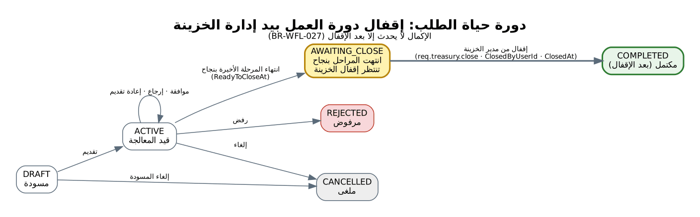

### 11.2 الملكية المتعددة والمراجع المركّبة (DR-04 · DR-06 · DR-09 · DR-10)

| المشكلة (قبل الإصلاح) | النمط المعتمد |
|---|---|
| عنوان أو جهة اتصال مالكها متعدد الأشكال (`OwnerType` + `OwnerId`) لا يحميه مفتاح أجنبي (DR-04) | أقواس خارجية: `PartyId` و`InstitutionId` و`UnitId` و`ContactId` مفاتيح أجنبية فعلية اختيارية، و`CHECK` يفرض **عمودًا واحدًا فقط** غير فارغ، وفرادة مصفّاة لكل قوس |
| `PricingRule.ScopeLimitProductLineId` و`TermValue.LimitProductLineId` تُربط بخط المنتج وحده، فيجوز أن يخص خط منتج حدًا آخر (DR-06) | مركّبة بالتسهيل والحد: `via=FacilityId,ScopeLimitId>LimitId` و`via=FacilityId,LimitId` |
| `wfl.RequestStageInstance.StageId` لا يربط المرحلة بقالب الطلب الذي تنتمي إليه (DR-09) | `TemplateId` إلزامي، و`StageId` و`ResumeStageId` مركّبان به: لا تُنفَّذ مرحلة من قالب آخر |
| `wfl.Request.LcId` و`RequestId` في `lc.LcSalesOrder` و`LcDrawing` و`LcAmendment` لا تربط الطلب بخطاب الاعتماد أو بالطلب الآخر في الشركة نفسها (DR-10) | مركّبة بـ`CompanyId`، فلا يُربط طلب شركة بخطاب اعتماد أو بتعديل لشركة أخرى |

### 11.3 الكتالوجات المملوكة للمشترك (DR-03 · DR-05 · DR-07)

كان `cat.LookupList` و`cat.LookupItem` جدولين مختلطين، تشير إليهما 13 عمودًا من جداول المشترك، وتشترك فيهما قيم المنصة بين المشتركين بلا نسخة يملكها كل مشترك. بعد الإصلاح:

- الجدولان **مملوكان للمشترك** (`TenantId` إلزامي) ولا صفوف مختلطة في الكتالوجات.
- `Scope = SYSTEM` قائمة من قالب المنصة تُنسخ لكل مشترك عند التهيئة (`IsSystem = 1`)، و`Scope = TENANT` قائمة يعرّفها المشترك (`IsSystem = 0`)، وقيد `CHECK` يفرض ذلك.
- كل مرجع إلى بند قائمة مركّب `(TenantId, LookupItemId)`، فلا يشير مشترك إلى بند يخص مشتركًا آخر.
- ثمن ذلك نسخ متعددة لقيم النظام بعدد المشتركين. تحديث القالب لاحقًا يُطبَّق على النسخ بمطابقة `SeedKey`، ولا يكتب فوق تعديلات المشترك (§13).

---

## 12. النشر وإدارة التغيير

### 12.1 ترتيب النشر (`db/deploy.sql`، وضع SQLCMD)
```
sqlcmd -S <server> -E -I -f 65001 -i db\deploy.sql -v DbName=BankFas
```
1. إنشاء القاعدة بـ `Arabic_100_CI_AS_SC` إن لم تكن موجودة
2. `000_schemas` → `001_tables` → `002_foreign_keys` → `003_indexes` (مولَّدة)
3. `004_rls_tables` (جدول مؤقت بالجداول الخاضعة لـ RLS، في **الجلسة نفسها** حتى 010)
4. `020_roles_and_grants` (أدوار و`tp_auth` وقراءة `tp_readonly`)
5. `005_delete_grants` → `006_sensitive_columns` → `007_table_grants` (المنح الجدولية)
6. `025_tenant_views` (عرض صف المشترك)
7. `010_rls` (الدوال والسياسات)
8. `030_session_context` (الإجراء بـ`EXECUTE AS tp_auth`)
9. اختياري: `040_fulltext_optional`

**بعد النشر:** يُشغَّل `tools/dbgen/check_grants.py` على الملفات المنشورة (لا على القاعدة)، ثم اختبارات S0 على SQL Server الفعلي (§14). الملفات تحوي `GO` وتُنفَّذ بالترتيب نفسه عند كل نشر؛ **لا يوجد بعدُ مسار ترحيل بين الإصدارات** (O-2).

### 12.2 تغيير النموذج
عدِّل `db/model/*.model` ← `python3 tools/dbgen/dbgen.py check db/model/*.model` ← `build … --out db/generated --docs docs/` ← `tools/dbgen/pg_validate.sh db/generated/pg/000_all.sql` ← `python3 tools/dbgen/check_grants.py`. لا تُعدَّل الملفات المولَّدة يدويًا. صيغة النموذج في `tools/dbgen/README.md`.

### 12.3 النسخ الاحتياطي والاستعادة (توصيات للتشغيل 🟡)
- نسخ كامل ليلي + تفاضلي + سجل المعاملات كل 15 دقيقة (نموذج الاسترداد `FULL`)، ونسخ إلى موقع منفصل.
- **المفاتيح الرئيسية (خارج القاعدة) في نسخ احتياطي منفصل**؛ فقدانها يعني فقدان البيانات المشفّرة.
- اختبار استعادة دوري، مع فك تشفير عيّنة بعد كل استعادة.
- استرجاع مشترك واحد يتم بتصدير/استيراد صفوفه بترتيب التبعيات من استعادة بنسخة مؤقتة.
- `READ_COMMITTED_SNAPSHOT ON` (توصية تشغيل؛ لم يُضمَّن في السكربتات).
- **أرقام RPO/RTO** لم تُحدَّد بعد (O-14).

### 12.4 الأداء والحمل
الحمل المتوقع منخفض؛ التصميم لا يعتمد على Partitioning. إن نمت `aud.AuditLog` و`wfl.RequestAction` و`ntf.NotificationDelivery` فهي أول مرشحة للتقسيم/الأرشفة بالتاريخ.

---

## 13. البذور وتهيئة المشترك (خطة — لم تُنفَّذ بعد)

| المرحلة | المحتوى | الآلية |
|---|---|---|
| **عالمي** | `ref.Country/Currency/Incoterm` وصفوف المنصة في `ref.UcpArticle`، `plat.Plan/PlanModule`، `sec.Permission` (بما فيها `req.treasury.close`)، `cfg.SettingDefinition`، أنواع الأحداث `ntf.NotificationEventType`، تعريفات حقول الاعتماد | سكربت بذور عالمي عند النشر بمفتاح `SeedKey`؛ `cfg.SeedRun` يسجل التنفيذ. هذه الجداول **يكتبها `tp_platform` فقط** |
| **إجراء تهيئة المشترك** (إجراء منصة واحد) | ينشئ داخل معاملة واحدة: صف المشترك، **حساب الخدمة `IsSystemUser`**، **مستخدم المدير الأول**، ونسخ كتالوجات النظام لهذا المشترك (§11.3)، والأدوار القياسية وربطها بالصلاحيات، وقوالب دورات العمل، وملفات KYC المسبقة، وقواعد الإشعارات، ووحدات الاشتراك في `plat.TenantModule` | إجراء في `plat` ينفّذه `tp_platform` بموافقة مشغّل؛ لأن المشترك لم يُنشأ بعد لا يمكن تعيين سياقه بالطريقة المعتادة (O-12) |
| **مفتاح مفقود** | قائمة `AUTHORISATION_BASIS` في `cat.LookupList` لأسس التفويض (طلبها مؤلفو النماذج) | تُضاف لبذور المشترك |

⚠ UCP: أرقام المواد في `lc.LcFieldUcpRef` **مراجع هندسية غير موثَّقة قانونيًا** إلى أن يتحقق منها مختص (عمود `VerifiedBy/On` في `ref.UcpArticle`).

---

## 14. أدلة التحقق وحدودها (بصراحة)

| الفحص | النتيجة | ملاحظة |
|---|---|---|
| فحص النموذج (`dbgen check`) | **OK** — 194 جدولًا / 3,280 عمودًا؛ لا مراجع معلّقة؛ لا مخالفة لقواعد النطاق | التسمية والمراجع والمفاتيح المركّبة والأعمدة المطلوبة |
| تنفيذ PostgreSQL 16 | **OK** — 194 جدولًا / 763 مفتاحًا أجنبيًا / 691 قيد فريد أو أساسي | يثبت **البنية المنطقية** فقط. **لا** يثبت صحة T-SQL |
| التحقق الثابت من الصلاحيات (`check_grants.py`) | **OK** — 194 جدولًا، 247 منحة مولّدة، 7 منح ثابتة، 29 عمودًا مقيّدًا، القواعد R1–R10 | حُقنت ثلاث مخالفات متعمدة فاكتُشفت كلها (§9.3). **لا يثبت** أن المحرك ينفّذ المنح كما هي |
| التحقق من الإصلاحات الحرجة (`check_review_fixes.py`) | **OK** — 24 من 24 | يفحص أن كل إصلاح من DR-01 إلى DR-10 موجود في DDL المولَّد، لا في الوثيقة وحدها |
| تحليل T-SQL بـ `sqlglot` | الملفات `000–004`، `007`، `010`، `025`، `030`، `040`: **بلا أخطاء**؛ `005` و`006` و`020`: خطأ واحد لكل ملف عند عبارة `DENY` | المحلّل لا يدعم عبارة `DENY` بصيغتها الكاملة؛ الصيغة صحيحة في T-SQL. التحليل نحوي جزئي |
| فحوص آلية لمحاذير SQL Server | لا `OR` في الفهارس المصفّاة · مفاتيح الفهارس ≤ 1,700 بايت و≤ 16 عمودًا · لا مسارات `CASCADE` متعددة · خيارات `SET` ضُمّنت | فحوص نصّية على المخرجات |
| **التنفيذ على SQL Server 2025** | **لم يحدث** | لا يتوفر المحرك في بيئة العمل. **أول خطوة قبل أي اعتماد.** متوقع: أخطاء صيغة في `CREATE SECURITY POLICY` و`EXECUTE AS` وترتيب النشر |
| **اختبارات السلوك** (RLS، ربط الهوية، الصلاحيات، التدفق المالي) | **لم تُكتب** | مطلوبة في S0–S2: مشتركان ومستخدمان ومحاولات عبور، وربط مستخدم مشترك A بسياق مشترك B يجب أن يُرفض، ومحاولة `tp_app` الكتابة على `ref.Currency` يجب أن تُرفض |

---

## 15. القرارات المتخذة (تُعتمد ما لم تعترض)

| # | الموضوع | القرار |
|---|---|---|
| DB-1 | `ErpCompanyCode` | فريد بين الشركات غير المؤرشفة (أشدّ من تحذير BR-ORG-001 وتحققه القاعدة) |
| DB-2 | `pty.KycProfile.InstitutionId` | اختياري؛ علم «أساسي» للملفات غير المرتبطة ببنك |
| DB-3 | قوالب دورات العمل | عائلة قوالب لكل نوع طلب؛ البذور المشتركة تُكرَّر لكل نوع |
| DB-4 | رأس التسهيل | صف واحد + `FacilityRevision.HeaderChanges`؛ لا نسخ رأس لكل مراجعة |
| DB-5 | `fac.Limit` عقد النسخ | نسخ الشجرة الفرعية عند المراجعة عقدٌ في التطبيق (`[R]`) |
| DB-6 | `ref.UcpArticle` | نطاق مختلط؛ `VerifiedBy → plat.PlatformOperator` |
| DB-7 | `ref.Incoterm` | عالمي (Incoterms 2020) |
| DB-8 | `fac.ValueConflict` | المرشّحون مسطَّحون (أعمدة) لا جدول فرعي |
| DB-9 | `fac.LimitMovement` | مفاتيح أجنبية مكتوبة (حجز/استخدام/…) لا مرجع عام متعدد الأشكال |
| DB-10 | الملخص الأسبوعي | أُضيفت `DIGEST_WEEKLY` إلى `ntf.NotificationPreference.Mode` |
| DB-11 | `wfl.RequestAction.ActionType` | أُضيفت: `RESERVATION_LOST`, `DRAFT_ARCHIVED`, `DRAFT_RESTORED`, `CHANNEL_CHANGED`, `SOD_EXCEPTION_USED`, `DELEGATION_CREATED`, `DELEGATION_REVOKED`، وفي 0.2: `READY_TO_CLOSE`, `CLOSED` |
| DB-12 | جهات اتصال المدير العام/المالي | عبر `org.BodyMember` + `pty.ContactMethod` (لا جدول مستقل) |
| DB-13 | الإضافة فقط | تُفرض بالمنح (`SELECT, INSERT`) و`DENY UPDATE` لـ`tp_app` و`tp_platform` على جداول `append` خارج `aud` |
| DB-14 | **المنح الجدولية** (C-2) | صريحة لكل جدول ومولَّدة؛ لا منح على مستوى المخطط؛ `REFERENCES` محذوف |
| DB-15 | **الجداول العالمية** (C-2) | للقراءة فقط لتطبيق المشترك؛ يكتبها `tp_platform` فقط |
| DB-16 | **الجداول المحجوبة** `noapp` (C-3) | `plat.Tenant` و`PlatformOperator` و`ReservedSubdomain`؛ يقرأ التطبيق صف مشتركه عبر `plat.v_CurrentTenant` |
| DB-17 | **ربط الهوية بالمشترك** (C-1) | `usp_SetSessionContext` يتحقق من المستخدم النشط المنتمي للمشترك، ويعمل بصفة `tp_auth` |
| DB-18 | **حساب الخدمة** (C-8) | `sec.AppUser.IsSystemUser` لكل مشترك للمهام، بلا كلمة مرور ولا MFA |
| DB-19 | **مفاتيح الصفوف المشفّرة** (C-5) | `EncKeyId` / `HashKeyId` / `MfaKeyId` / `MfaKeyRef` في كل جدول فيه غلاف؛ `CHECK` لطول الغلاف |
| DB-20 | **إقفال دورة العمل** (C-7) | `AWAITING_CLOSE` ثم `COMPLETED` بإقفال الخزينة؛ الحقول `ReadyToCloseAt` و`ClosedByUserId` و`ClosedAt` |
| DB-21 | **الإصلاحات الحرجة العشرة** (DR-01 إلى DR-10، C-12) | مُعتمدة ومُطبَّقة: كتالوجات مملوكة للمشترك بنسخ لكل مشترك (§11.3)، ومفتاح الغرض في مفاتيح التشفير، وأقواس المالك الخارجية والمراجع المركّبة (§11.2)، و`plat.TenantModule` مملوك للمنصة |

---

## 16. حدود معروفة ونقاط مفتوحة

| # | البند | الأثر | المقترح |
|---|---|---|---|
| O-1 | **لم تُنفَّذ السكربتات على SQL Server** (§14) | قد تظهر أخطاء صيغة وتتغير المنح عند التنفيذ | أول مهمة: نشر على SQL Server 2025 نظيف + حزمة اختبار السلوك |
| O-2 | لا سكربتات ترحيل بين الإصدارات | تغيير النموذج يعيد توليد DDL كاملًا | أداة ترحيل (DbUp أو Flyway) عند أول نشر فعلي على بيانات حقيقية |
| O-3 | البذور غير مكتوبة (§13) | القاعدة فارغة بعد النشر | كتابتها مع شريحة S0 |
| O-4 | أسئلة مفتوحة بقيم افتراضية في `90-consolidated-open-questions.md` | أثرها على الشرائح اللاحقة؛ المتعلق منها بـ S3: Q-WFL-02, Q-WFL-09, Q-WFL-11, Q-LCT-01/02, Q-LCI-01/02 | تُراجع عند بدء S3 |
| O-5 | الأعمدة المحسوبة محدودة (3) | بقية المشتقات (المتاح، الرصيد) تُحسب في التطبيق/العروض | عروض/دوال لاحقًا عند الحاجة لتقارير |
| O-6 | سياسات الاحتفاظ والأرشفة (جداول التدقيق والإشعارات) غير محدَّدة | نمو الجداول الكبيرة | قرار احتفاظ لكل جدول مع بدء التشغيل |
| O-7 | نموذج استرداد القاعدة والنسخ المتعدد المشتركين | استعادة مشترك واحد معقّدة (§12.3) | نقل صفوف مشترك كبير إلى قاعدة مستقلة لاحقًا ممكن لأن البنية تحمل `TenantId` |
| O-8 | نوع JSON الأصلي في SQL Server 2025 | غير مستعمل (T-4) | تقييمه عند الحاجة إلى استعلام داخل JSON |
| **O-9** | **مسار ما قبل المصادقة** (تسجيل الدخول والدعوة واستعادة كلمة المرور): لا يوجد مستخدم بعد لضبط السياق | لا يستطيع التطبيق تسجيل الدخول بالمسار الحالي | إجراء `sec.usp_SetAuthContext(@TenantId)` يضبط المشترك فقط بعد فحص حالته، ويقتصر على قراءة صفوف الدخول؛ يُنظر فيه في S1 مع حدّ قراءة يضيّقه (عرض بأعمدة محددة) |
| **O-10** | **تعديل المواصفة 13** لإقفال دورة العمل (C-7) | الوثيقة تتبع قرار الإقفال، والمواصفة ما زالت تقول إن الإكمال تلقائي عند المرحلة الأخيرة | تحديث `13` (حقل `Status`، جدول الحالات، `ExternalPhase`، `FR-WFL`) بعد موافقتك؛ **أكّد أيضًا أن الرفض والإلغاء يبقيان فوريين** |
| **O-11** | **الهوية تُصدَّق من التطبيق** (§3.2) | مخترق `tp_app` يستطيع اختيار مستخدم نشط من أي مشترك | دور تطبيق لكل مشترك (`sp_setapprole`) أو رمز موقَّع يتحقق منه الإجراء؛ يُختار في S1 |
| **O-12** | **إجراءات المنصة على بيانات المشترك** | بلا وصول مباشر لـ`tp_platform`، يلزم إجراء مُراجَع لكل عملية منصة (تهيئة، دعم، إصلاح) | تُكتب في S0 وتتحقق من `SupportAccessGrant` أو من تهيئة المشترك |
| **O-13** | **موقع مرساة سلسلة التدقيق** (§5.3) | بلا مرساة خارجية، السلسلة لا تكشف العبث | تخزين غير قابل للتعديل أو تجزئة منشورة دوريًا؛ قرار تشغيلي |
| **O-14** | أرقام RPO/RTO | لا خطة استعادة مُقاسة بعد | تُحدَّد مع الاعتماد التشغيلي (§12.3) |
| **O-15** | **36 نتيجة رئيسية و4 طفيفة** من المراجعة (§18.2) لم تُعتمد بعد | بعضها يغيّر أعمدة أو قيودًا، فيتغير الـDDL قبل S0 | قرار لكل نتيجة: تُطبَّق قبل S0، أو تُؤجَّل بسبب مكتوب |

---

## 17. الخطوة التالية

1. **تقييمك** لهذا الإصدار، خاصة القرارات DB-14 إلى DB-21 والنقاط O-9 إلى O-13 و O-15، والأسئلة التي تحتاج قرارك: **هل تعتمد تعديل المواصفة 13 (O-10)؟ وأيّ من النتائج الرئيسية الـ36 والطفيفة الـ4 تُطبَّق قبل S0 (O-15)؟**
2. نشر على **SQL Server 2025** فعلي وتصحيح ما يظهر (O-1)، مع اختبارات السلوك المذكورة في §14.
3. ثم الواجهات والشريحة الرأسية S0، بعد حسم O-9 و O-11 و O-12.
