# مخططات العلاقات (ERD) حسب المخطط

> مُولَّد آليًا. تظهر العلاقات بين الجداول (مفتاح أجنبي ← جدول مرجعي) داخل المخطط، وتُختصَر العلاقات العابرة للمخططات في جدول.

## مخطط `plat` (7 جدولًا)

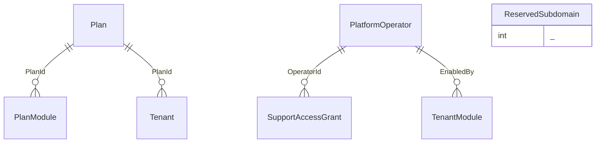

| الجدول | العمود | يشير إلى |
|---|---|---|
| SupportAccessGrant | GrantedBy | sec.AppUser |
| SupportAccessGrant | RevokedBy | sec.AppUser |
| Tenant | HomeCountryId | ref.Country |

## مخطط `sec` (14 جدولًا)

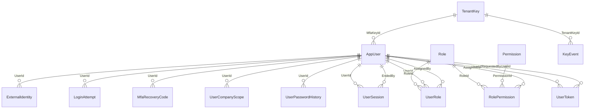

| الجدول | العمود | يشير إلى |
|---|---|---|
| AppUser | DepartmentId | org.Department |
| UserCompanyScope | CompanyId | org.Company |

## مخطط `aud` (2 جدولًا)

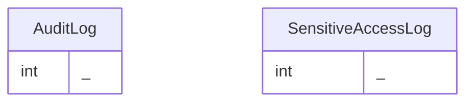

| الجدول | العمود | يشير إلى |
|---|---|---|
| SensitiveAccessLog | ActorUserId | sec.AppUser |
| SensitiveAccessLog | OperatorId | plat.PlatformOperator |

## مخطط `doc` (3 جدولًا)

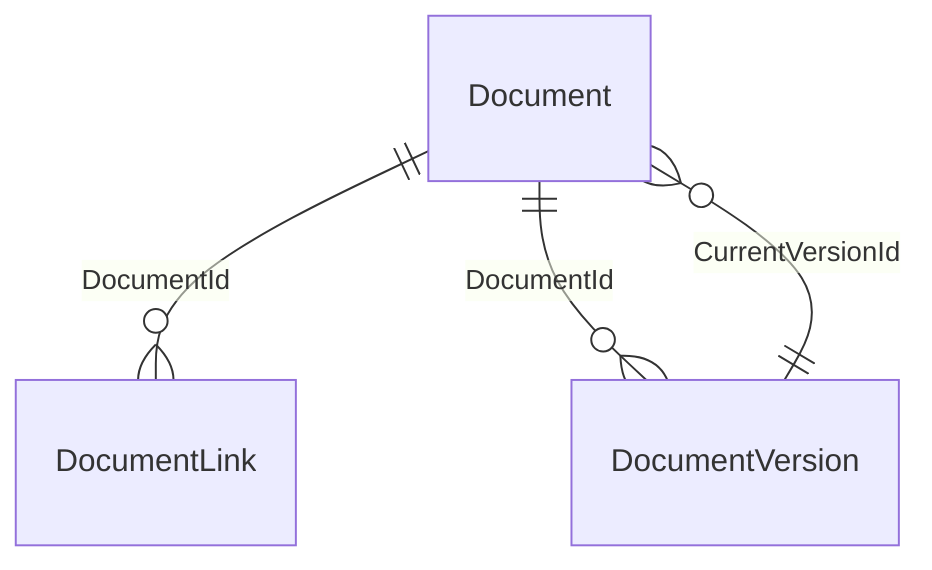

| الجدول | العمود | يشير إلى |
|---|---|---|
| Document | DeletedBy | sec.AppUser |
| Document | DocumentTypeId | cat.DocumentType |
| Document | OwnerCompanyId | org.Company |
| DocumentLink | UnlinkedBy | sec.AppUser |
| DocumentVersion | KeyId | sec.TenantKey |

## مخطط `cfg` (12 جدولًا)

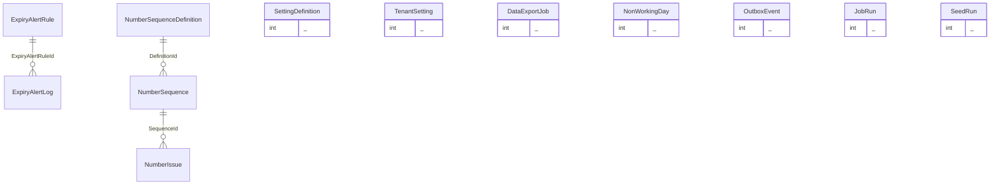

| الجدول | العمود | يشير إلى |
|---|---|---|
| DataExportJob | ApprovedBy | sec.AppUser |
| DataExportJob | PackageDocumentId | doc.Document |
| DataExportJob | RequestedBy | sec.AppUser |
| NonWorkingDay | CountryId | ref.Country |
| NumberIssue | VoidedBy | sec.AppUser |
| NumberSequence | CompanyId | org.Company |

## مخطط `org` (14 جدولًا)

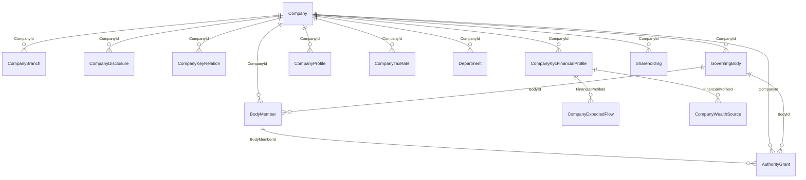

| الجدول | العمود | يشير إلى |
|---|---|---|
| AuthorityGrant | ApprovedBy | sec.AppUser |
| AuthorityGrant | CeilingCurrencyId | ref.Currency |
| AuthorityGrant | InstitutionId | ins.Institution |
| AuthorityGrant | PartyId | pty.Party |
| AuthorityGrant | PowerTypeId | cat.PowerType |
| AuthorityGrant | SourceDocumentId | doc.Document |
| BodyMember | AppointmentDocumentId | doc.Document |
| BodyMember | PartyId | pty.Party |
| BodyMember | PositionId | cat.Position |
| BodyMember | RepresentedPartyId | pty.Party |
| Company | BaseCurrencyId | ref.Currency |
| Company | CountryId | ref.Country |
| Company | LegalEntityTypeId | cat.LegalEntityType |
| Company | PartyId | pty.Party |
| CompanyBranch | CountryId | ref.Country |
| CompanyDisclosure | SourceDocumentId | doc.Document |
| CompanyExpectedFlow | CurrencyId | ref.Currency |
| CompanyKycFinancialProfile | AccountCurrencyId | ref.Currency |
| CompanyKycFinancialProfile | RevenueBandId | cat.LookupItem |
| CompanyProfile | EmployeeBandId | cat.LookupItem |
| CompanyProfile | HeadquartersCountryId | ref.Country |
| CompanyProfile | SectorId | cat.LookupItem |
| CompanyWealthSource | WealthSourceId | cat.LookupItem |
| Department | HeadUserId | sec.AppUser |
| GoverningBody | SourceDocumentId | doc.Document |
| Shareholding | CurrencyId | ref.Currency |
| Shareholding | HolderPartyId | pty.Party |
| Shareholding | SourceDocumentId | doc.Document |

## مخطط `pty` (11 جدولًا)

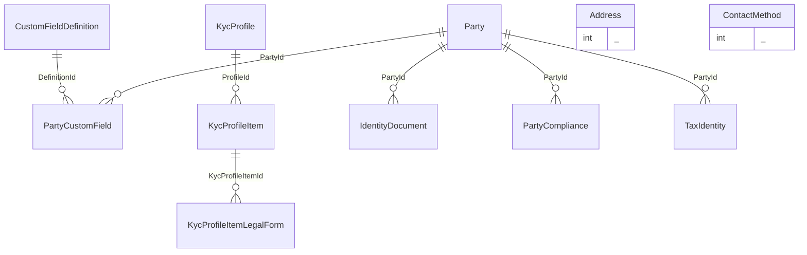

| الجدول | العمود | يشير إلى |
|---|---|---|
| Address | CountryId | ref.Country |
| CustomFieldDefinition | InstitutionId | ins.Institution |
| IdentityDocument | EncKeyId | sec.TenantKey |
| IdentityDocument | HashKeyId | sec.TenantKey |
| IdentityDocument | IssuingCountryId | ref.Country |
| IdentityDocument | VerifiedBy | sec.AppUser |
| KycProfile | InstitutionId | ins.Institution |
| KycProfile | SourceDocumentId | doc.Document |
| KycProfileItemLegalForm | LegalEntityTypeId | cat.LegalEntityType |
| Party | BirthCountryId | ref.Country |
| Party | CountryId | ref.Country |
| Party | EducationLevelId | cat.LookupItem |
| Party | LinkedCompanyId | org.Company |
| PartyCompliance | CompanyId | org.Company |
| PartyCompliance | SourceDocumentId | doc.Document |
| PartyCustomField | CurrencyId | ref.Currency |
| PartyCustomField | EncKeyId | sec.TenantKey |
| TaxIdentity | CountryId | ref.Country |
| TaxIdentity | CrsClassificationId | cat.LookupItem |
| TaxIdentity | FatcaClassificationId | cat.LookupItem |
| TaxIdentity | SourceDocumentId | doc.Document |

## مخطط `ref` (4 جدولًا)

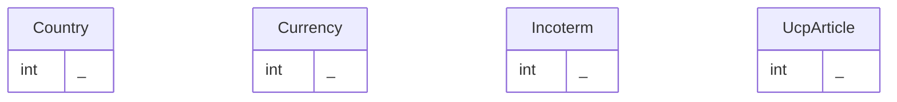

| الجدول | العمود | يشير إلى |
|---|---|---|
| UcpArticle | VerifiedBy | plat.PlatformOperator |

## مخطط `cat` (26 جدولًا)

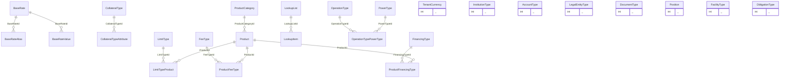

| الجدول | العمود | يشير إلى |
|---|---|---|
| BaseRate | CurrencyId | ref.Currency |
| BaseRate | InstitutionId | ins.Institution |
| BaseRateAlias | InstitutionId | ins.Institution |
| BaseRateValue | EnteredBy | sec.AppUser |
| LegalEntityType | CountryId | ref.Country |
| TenantCurrency | CurrencyId | ref.Currency |

## مخطط `ins` (6 جدولًا)

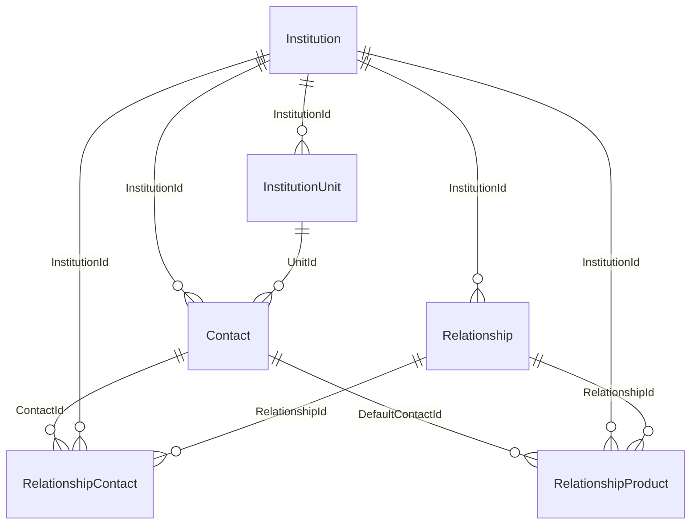

| الجدول | العمود | يشير إلى |
|---|---|---|
| Contact | PartyId | pty.Party |
| Institution | CountryId | ref.Country |
| Institution | InstitutionTypeId | cat.InstitutionType |
| Institution | PartyId | pty.Party |
| InstitutionUnit | UnitTypeId | cat.LookupItem |
| Relationship | CompanyId | org.Company |
| RelationshipContact | RoleId | cat.LookupItem |
| RelationshipProduct | ProductId | cat.Product |

## مخطط `acc` (6 جدولًا)

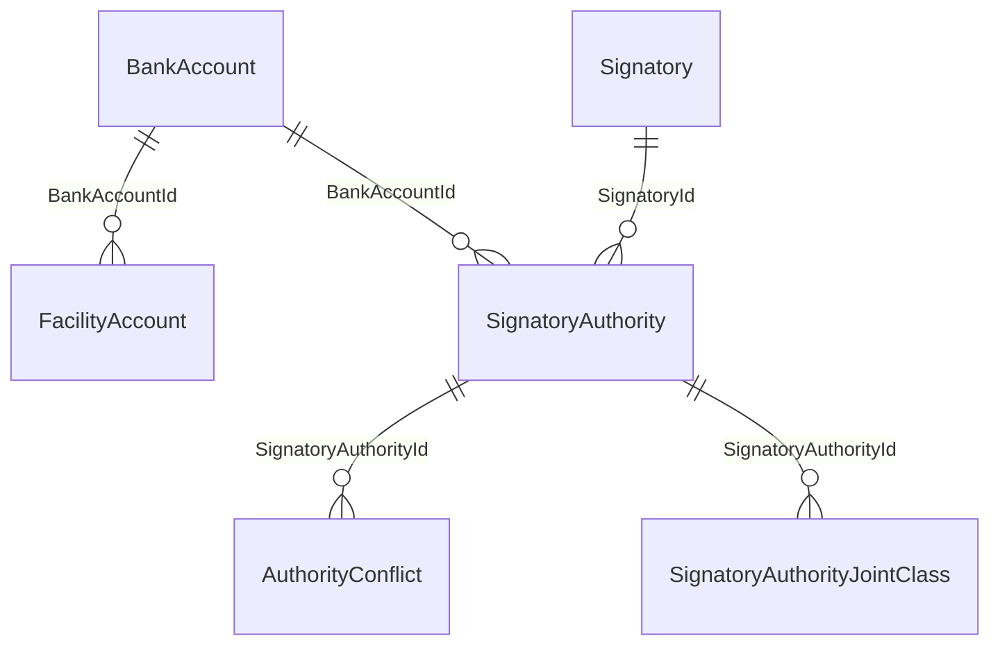

| الجدول | العمود | يشير إلى |
|---|---|---|
| AuthorityConflict | ReviewedBy | sec.AppUser |
| BankAccount | AccountTypeId | cat.AccountType |
| BankAccount | BranchUnitId | ins.InstitutionUnit |
| BankAccount | CompanyId | org.Company |
| BankAccount | CurrencyId | ref.Currency |
| BankAccount | EncKeyId | sec.TenantKey |
| BankAccount | HashKeyId | sec.TenantKey |
| BankAccount | InstitutionId | ins.Institution |
| BankAccount | RelationshipId | ins.Relationship |
| FacilityAccount | CurrencyId | ref.Currency |
| FacilityAccount | FacilityId | fac.Facility |
| FacilityAccount | PurposeId | cat.LookupItem |
| Signatory | AuthorisationBasisId | cat.LookupItem |
| Signatory | AuthorizationDocumentId | doc.Document |
| Signatory | CashWithdrawalCurrencyId | ref.Currency |
| Signatory | PartyId | pty.Party |
| Signatory | PositionId | cat.Position |
| Signatory | RelationshipId | ins.Relationship |
| Signatory | SignatureClassId | cat.LookupItem |
| Signatory | SpecimenDocumentId | doc.Document |
| SignatoryAuthority | CurrencyId | ref.Currency |
| SignatoryAuthority | OperationTypeId | cat.OperationType |
| SignatoryAuthority | RelationshipId | ins.Relationship |
| SignatoryAuthority | SourceDocumentId | doc.Document |
| SignatoryAuthorityJointClass | SignatureClassId | cat.LookupItem |

## مخطط `fac` (13 جدولًا)

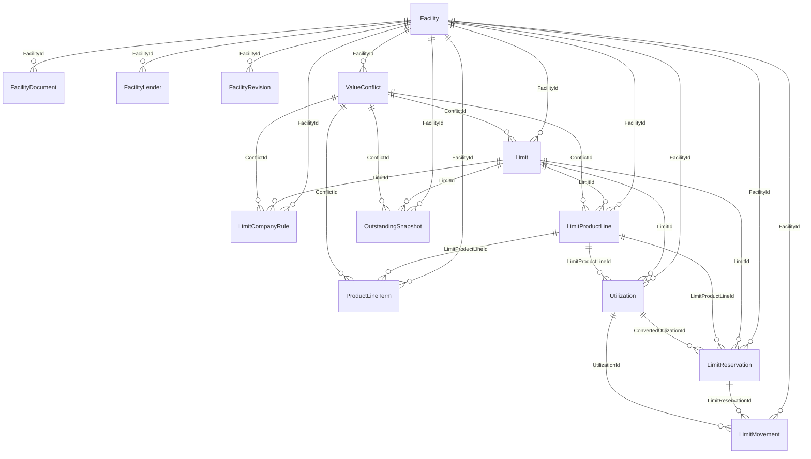

| الجدول | العمود | يشير إلى |
|---|---|---|
| Facility | BorrowerCompanyId | org.Company |
| Facility | CurrencyId | ref.Currency |
| Facility | FacilityTypeId | cat.FacilityType |
| FacilityDocument | DocumentId | doc.Document |
| FacilityLender | ContactId | ins.Contact |
| FacilityLender | InstitutionId | ins.Institution |
| FacilityRevision | ApprovedBy | sec.AppUser |
| FacilityRevision | SubmittedBy | sec.AppUser |
| Limit | LimitTypeId | cat.LimitType |
| Limit | SourceDocumentId | doc.Document |
| Limit | VerifiedBy | sec.AppUser |
| LimitCompanyRule | CompanyId | org.Company |
| LimitCompanyRule | SourceDocumentId | doc.Document |
| LimitCompanyRule | VerifiedBy | sec.AppUser |
| LimitMovement | ActorUserId | sec.AppUser |
| LimitMovement | CurrencyId | ref.Currency |
| LimitProductLine | ProductId | cat.Product |
| LimitProductLine | SourceDocumentId | doc.Document |
| LimitProductLine | VerifiedBy | sec.AppUser |
| LimitReservation | CompanyId | org.Company |
| LimitReservation | CurrencyId | ref.Currency |
| LimitReservation | RequestId | wfl.Request |
| OutstandingSnapshot | CurrencyId | ref.Currency |
| OutstandingSnapshot | ProductId | cat.Product |
| OutstandingSnapshot | SourceDocumentId | doc.Document |
| OutstandingSnapshot | VerifiedBy | sec.AppUser |
| ProductLineTerm | SourceDocumentId | doc.Document |
| ProductLineTerm | VerifiedBy | sec.AppUser |
| Utilization | CompanyId | org.Company |
| Utilization | CurrencyId | ref.Currency |
| ValueConflict | CandidateASourceDocumentId | doc.Document |
| ValueConflict | CandidateBSourceDocumentId | doc.Document |
| ValueConflict | ResolvedBy | sec.AppUser |

## مخطط `prc` (5 جدولًا)

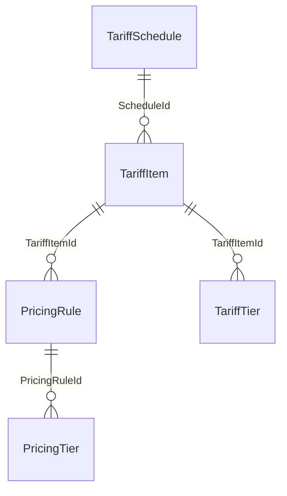

| الجدول | العمود | يشير إلى |
|---|---|---|
| PricingRule | BaseRateId | cat.BaseRate |
| PricingRule | ConflictId | fac.ValueConflict |
| PricingRule | CurrencyId | ref.Currency |
| PricingRule | FacilityId | fac.Facility |
| PricingRule | FeeTypeId | cat.FeeType |
| PricingRule | FinancingTypeId | cat.FinancingType |
| PricingRule | ScopeCompanyId | org.Company |
| PricingRule | ScopeLimitId | fac.Limit |
| PricingRule | ScopeLimitProductLineId | fac.LimitProductLine |
| PricingRule | ScopeProductId | cat.Product |
| PricingRule | SourceDocumentId | doc.Document |
| PricingRule | VerifiedBy | sec.AppUser |
| PricingTier | FacilityId | fac.Facility |
| TariffItem | ConflictId | fac.ValueConflict |
| TariffItem | CurrencyId | ref.Currency |
| TariffItem | FeeTypeId | cat.FeeType |
| TariffItem | ProductId | cat.Product |
| TariffItem | SourceDocumentId | doc.Document |
| TariffItem | VerifiedBy | sec.AppUser |
| TariffSchedule | ApprovedBy | sec.AppUser |
| TariffSchedule | FacilityId | fac.Facility |
| TariffSchedule | InstitutionId | ins.Institution |
| TariffSchedule | SourceDocumentId | doc.Document |

## مخطط `cmp` (2 جدولًا)

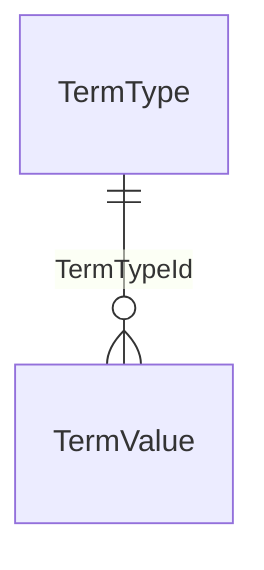

| الجدول | العمود | يشير إلى |
|---|---|---|
| TermValue | CompanyId | org.Company |
| TermValue | ConflictId | fac.ValueConflict |
| TermValue | CurrencyId | ref.Currency |
| TermValue | FacilityId | fac.Facility |
| TermValue | LimitId | fac.Limit |
| TermValue | LimitProductLineId | fac.LimitProductLine |
| TermValue | ProductId | cat.Product |
| TermValue | SourceDocumentId | doc.Document |
| TermValue | VerifiedBy | sec.AppUser |

## مخطط `col` (7 جدولًا)

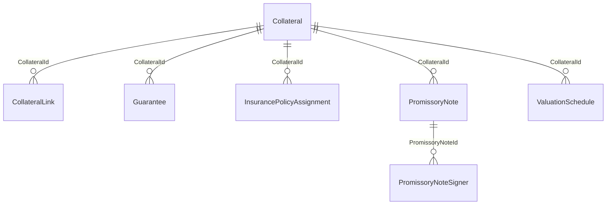

| الجدول | العمود | يشير إلى |
|---|---|---|
| Collateral | ApprovedBy | sec.AppUser |
| Collateral | CollateralTypeId | cat.CollateralType |
| Collateral | ConflictId | fac.ValueConflict |
| Collateral | OwnerPartyId | pty.Party |
| Collateral | ReleaseDocumentId | doc.Document |
| Collateral | SourceDocumentId | doc.Document |
| Collateral | VerifiedBy | sec.AppUser |
| CollateralLink | FacilityId | fac.Facility |
| CollateralLink | LimitId | fac.Limit |
| Guarantee | CurrencyId | ref.Currency |
| Guarantee | DeedDocumentId | doc.Document |
| Guarantee | GuarantorIdentityDocumentId | pty.IdentityDocument |
| Guarantee | GuarantorPartyId | pty.Party |
| InsurancePolicyAssignment | AssignedToInstitutionId | ins.Institution |
| InsurancePolicyAssignment | CurrencyId | ref.Currency |
| InsurancePolicyAssignment | PolicyDocumentId | doc.Document |
| PromissoryNote | CurrencyId | ref.Currency |
| PromissoryNote | NoteDocumentId | doc.Document |
| PromissoryNoteSigner | PartyId | pty.Party |
| ValuationSchedule | CurrencyId | ref.Currency |

## مخطط `obl` (8 جدولًا)

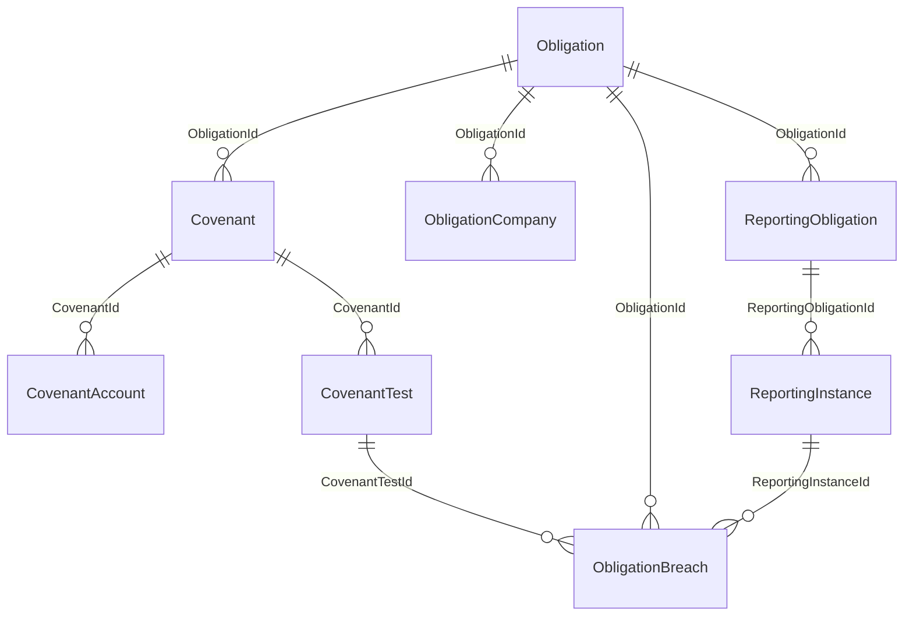

| الجدول | العمود | يشير إلى |
|---|---|---|
| Covenant | CurrencyId | ref.Currency |
| Covenant | FormulaId | fin.MeasureFormula |
| Covenant | TestedCompanyId | org.Company |
| CovenantAccount | BankAccountId | acc.BankAccount |
| CovenantTest | EvaluatedBy | sec.AppUser |
| CovenantTest | EvidenceDocumentId | doc.Document |
| CovenantTest | ReviewedBy | sec.AppUser |
| Obligation | ConflictId | fac.ValueConflict |
| Obligation | FacilityId | fac.Facility |
| Obligation | ObligationTypeId | cat.ObligationType |
| Obligation | ParamCurrencyId | ref.Currency |
| Obligation | ScopeLimitId | fac.Limit |
| Obligation | ScopeProductLineId | fac.LimitProductLine |
| Obligation | SourceDocumentId | doc.Document |
| Obligation | VerifiedBy | sec.AppUser |
| ObligationBreach | WaiverBankContactId | ins.Contact |
| ObligationBreach | WaiverDocumentId | doc.Document |
| ObligationCompany | CompanyId | org.Company |
| ReportingInstance | CurrencyId | ref.Currency |
| ReportingInstance | EvidenceDocumentId | doc.Document |
| ReportingInstance | SubmissionChannelUsedId | cat.LookupItem |
| ReportingObligation | SubmissionChannelId | cat.LookupItem |

## مخطط `fin` (7 جدولًا)

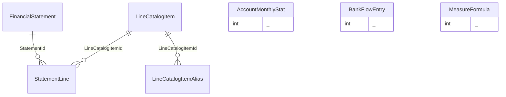

| الجدول | العمود | يشير إلى |
|---|---|---|
| AccountMonthlyStat | BankAccountId | acc.BankAccount |
| AccountMonthlyStat | DocumentId | doc.Document |
| BankFlowEntry | CompanyId | org.Company |
| BankFlowEntry | CurrencyId | ref.Currency |
| BankFlowEntry | DocumentId | doc.Document |
| BankFlowEntry | FacilityId | fac.Facility |
| BankFlowEntry | FlowKindId | cat.LookupItem |
| BankFlowEntry | InstitutionId | ins.Institution |
| FinancialStatement | ApprovedBy | sec.AppUser |
| FinancialStatement | CompanyId | org.Company |
| FinancialStatement | CurrencyId | ref.Currency |
| FinancialStatement | PreparedBy | sec.AppUser |
| FinancialStatement | SourceDocumentId | doc.Document |
| MeasureFormula | ApprovedBy | sec.AppUser |
| MeasureFormula | ConflictId | fac.ValueConflict |
| MeasureFormula | FacilityId | fac.Facility |
| MeasureFormula | SourceDocumentId | doc.Document |
| MeasureFormula | VerifiedBy | sec.AppUser |

## مخطط `wfl` (19 جدولًا)

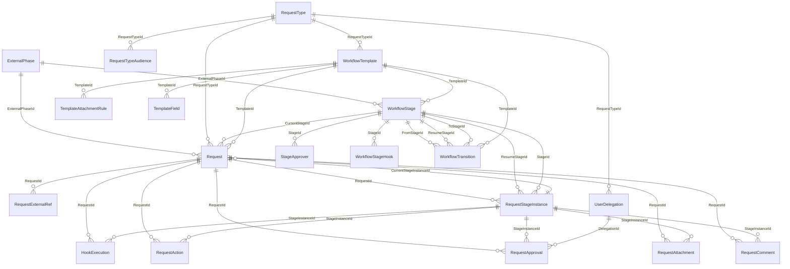

| الجدول | العمود | يشير إلى |
|---|---|---|
| Request | AssigneeUserId | sec.AppUser |
| Request | ClosedByUserId | sec.AppUser |
| Request | CompanyId | org.Company |
| Request | CreatedByUserId | sec.AppUser |
| Request | CurrencyId | ref.Currency |
| Request | DepartmentId | org.Department |
| Request | FacilityId | fac.Facility |
| Request | InstitutionId | ins.Institution |
| Request | LcId | lc.LetterOfCredit |
| Request | LimitId | fac.Limit |
| Request | LimitProductLineId | fac.LimitProductLine |
| Request | ProductId | cat.Product |
| Request | RequesterUserId | sec.AppUser |
| Request | ReservationId | fac.LimitReservation |
| Request | SubmittedByUserId | sec.AppUser |
| RequestAction | ActorUserId | sec.AppUser |
| RequestAction | OnBehalfOfUserId | sec.AppUser |
| RequestApproval | ActedByUserId | sec.AppUser |
| RequestApproval | AssignedRoleId | sec.Role |
| RequestApproval | AssignedUserId | sec.AppUser |
| RequestApproval | OnBehalfOfUserId | sec.AppUser |
| RequestAttachment | DocumentId | doc.Document |
| RequestComment | AuthorUserId | sec.AppUser |
| RequestComment | RetractedBy | sec.AppUser |
| RequestExternalRef | EnteredBy | sec.AppUser |
| RequestStageInstance | AssigneeUserId | sec.AppUser |
| RequestTypeAudience | DepartmentId | org.Department |
| RequestTypeAudience | RoleId | sec.Role |
| RequestTypeAudience | UserId | sec.AppUser |
| StageApprover | DepartmentId | org.Department |
| StageApprover | FallbackRoleId | sec.Role |
| StageApprover | RoleId | sec.Role |
| StageApprover | UserId | sec.AppUser |
| TemplateAttachmentRule | DocumentTypeId | cat.DocumentType |
| UserDelegation | FromUserId | sec.AppUser |
| UserDelegation | RevokedBy | sec.AppUser |
| UserDelegation | ToUserId | sec.AppUser |
| WorkflowStage | AssigneeDepartmentId | org.Department |
| WorkflowStage | AssigneeRoleId | sec.Role |
| WorkflowStage | AssigneeUserId | sec.AppUser |
| WorkflowStage | FallbackRoleId | sec.Role |
| WorkflowStage | PoolPermissionId | sec.Permission |
| WorkflowTemplate | PublishedBy | sec.AppUser |

## مخطط `ntf` (7 جدولًا)

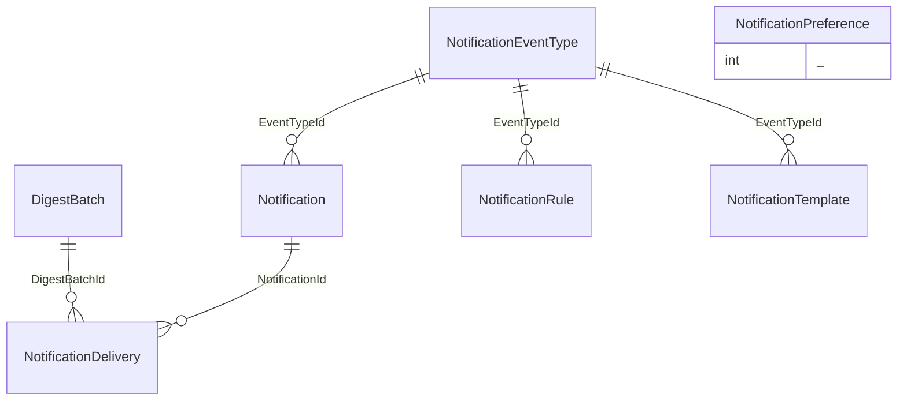

| الجدول | العمود | يشير إلى |
|---|---|---|
| DigestBatch | UserId | sec.AppUser |
| Notification | CompanyId | org.Company |
| Notification | UserId | sec.AppUser |
| NotificationPreference | UserId | sec.AppUser |
| NotificationRule | PermissionId | sec.Permission |
| NotificationRule | RoleId | sec.Role |
| NotificationRule | UserId | sec.AppUser |

## مخطط `lc` (21 جدولًا)

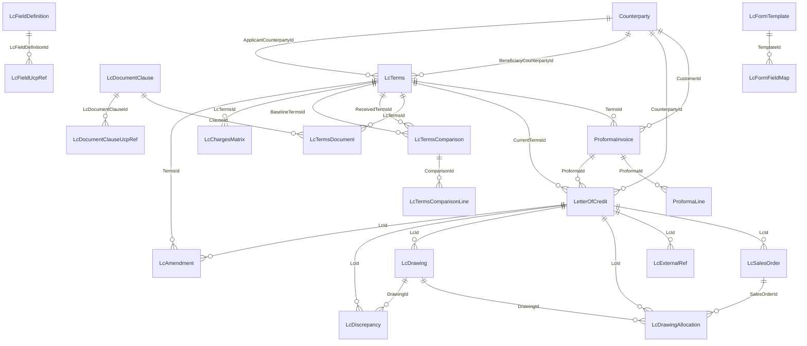

| الجدول | العمود | يشير إلى |
|---|---|---|
| Counterparty | CountryId | ref.Country |
| Counterparty | PartyId | pty.Party |
| LcAmendment | AppliedBy | sec.AppUser |
| LcAmendment | CurrencyId | ref.Currency |
| LcAmendment | RequestId | wfl.Request |
| LcDiscrepancy | DecidedBy | sec.AppUser |
| LcDocumentClause | InstitutionId | ins.Institution |
| LcDocumentClauseUcpRef | UcpArticleId | ref.UcpArticle |
| LcDrawing | CurrencyId | ref.Currency |
| LcDrawing | RequestId | wfl.Request |
| LcDrawing | SettlementAccountId | acc.BankAccount |
| LcDrawingAllocation | CurrencyId | ref.Currency |
| LcFieldUcpRef | UcpArticleId | ref.UcpArticle |
| LcFormTemplate | AnnexDocumentId | doc.Document |
| LcFormTemplate | CompanyId | org.Company |
| LcFormTemplate | InstitutionId | ins.Institution |
| LcFormTemplate | LetterheadDocumentId | doc.Document |
| LcFormTemplate | ProductId | cat.Product |
| LcFormTemplate | SourceDocumentId | doc.Document |
| LcSalesOrder | CurrencyId | ref.Currency |
| LcSalesOrder | RequestId | wfl.Request |
| LcTerms | ApplicantCompanyId | org.Company |
| LcTerms | BeneficiaryCompanyId | org.Company |
| LcTerms | ChargesAccountId | acc.BankAccount |
| LcTerms | CurrencyId | ref.Currency |
| LcTerms | EncKeyId | sec.TenantKey |
| LcTerms | FacilityAccountId | acc.BankAccount |
| LcTerms | HashKeyId | sec.TenantKey |
| LcTerms | IncotermId | ref.Incoterm |
| LcTerms | LockedBy | sec.AppUser |
| LcTerms | MarginSettlementAccountId | acc.BankAccount |
| LcTerms | PrevLcCurrencyId | ref.Currency |
| LcTermsComparison | RunBy | sec.AppUser |
| LetterOfCredit | CompanyId | org.Company |
| LetterOfCredit | CurrencyId | ref.Currency |
| LetterOfCredit | FacilityId | fac.Facility |
| LetterOfCredit | InstitutionId | ins.Institution |
| LetterOfCredit | LimitId | fac.Limit |
| LetterOfCredit | LimitProductLineId | fac.LimitProductLine |
| LetterOfCredit | ProductId | cat.Product |
| LetterOfCredit | RelationshipId | ins.Relationship |
| LetterOfCredit | RequestId | wfl.Request |
| LetterOfCredit | UtilizationId | fac.Utilization |
| ProformaInvoice | CompanyId | org.Company |
| ProformaInvoice | CurrencyId | ref.Currency |
| ProformaInvoice | DocumentId | doc.Document |
| ProformaInvoice | ProceedsAccountId | acc.BankAccount |
| ProformaInvoice | RequestId | wfl.Request |
| ProformaLine | CurrencyId | ref.Currency |
